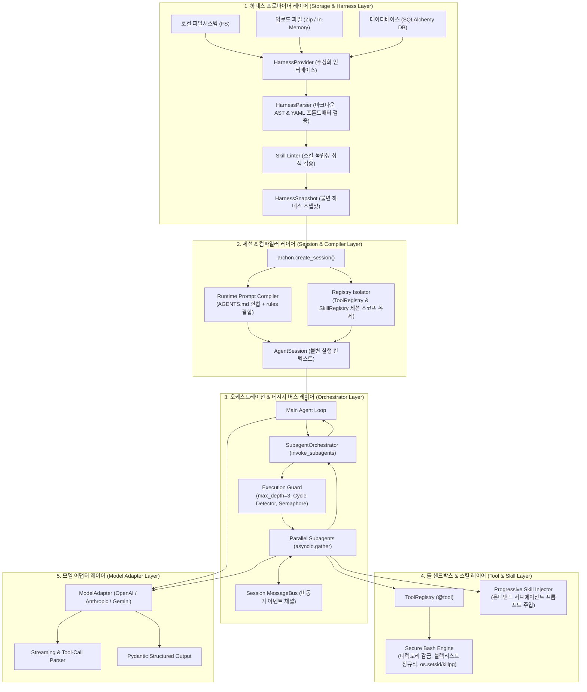

# [ADR-001] archon 시스템 아키텍처 및 핵심 기술 스택 결정 레코드

- **작성일자**: 2026-09-23
- **작성자**: 풀스택 아키텍트 (`fullstack-architect`)
- **상태**: APPROVED
- **영향 범위**: Agent Harness Engine, Multi-Source Storage, Session Lifecycle, Subagent Orchestration, Tool Sandbox & Security, Skill System

---

## 1. 배경 및 컨텍스트 (Context & Problem Statement)

대형 언어 모델(LLM) 기반의 자율 에이전트 시스템이 단순한 단일 프롬프트 챗봇에서 다중 에이전트(Multi-Agent) 협업 체계로 발전하면서, 실무 엔지니어링 현장에서는 기존 에이전트 프레임워크들의 구조적 한계가 드러나고 있습니다. 기획 산출물([`01_PRD.md`](../spec-writer/01_PRD.md), [`02_FUNCTIONAL_SPECIFICATION.md`](../spec-writer/02_FUNCTIONAL_SPECIFICATION.md), [`03_POLICIES_AND_EDGES.md`](../spec-writer/03_POLICIES_AND_EDGES.md), [`fsd/AGENT_HARNESS_SPECIFICATION.md`](../spec-writer/fsd/AGENT_HARNESS_SPECIFICATION.md)) 및 시장 벤치마킹([`01_MARKET_BENCHMARK.md`](../market-analyst/01_MARKET_BENCHMARK.md))을 검토한 결과, 상용 엔터프라이즈 환경에서 직면하는 핵심 과제는 다음과 같습니다:

1. **프롬프트와 소스코드의 강결합으로 인한 운영 오버헤드**:
   - 기존 프레임워크(CrewAI, PydanticAI 등)는 에이전트의 페르소나, 시스템 지시문, 도구 권한을 파이썬 클래스와 함수 내부에 하드코딩합니다. 이로 인해 프롬프트나 코딩 규칙을 한 줄 수정할 때마다 파이썬 코드를 다시 빌드하고 배포 파이프라인을 태워야 하는 비효율이 발생합니다.
2. **로컬 파일시스템 종속성 및 멀티 테넌트 SaaS 수용 불가**:
   - 대부분의 오픈소스 도구는 로컬 디렉터리에 룰 파일이 존재한다고 가정합니다. 그러나 B2B 멀티 테넌트 환경이나 웹 서비스에서는 테넌트별, 프로젝트별로 데이터베이스(DB)나 업로드된 압축파일(Zip)에서 하네스 규칙을 실시간 인출하여 세션에 주입해야 합니다.
3. **비결정적 오케스트레이션과 토큰 폭주 위험**:
   - AutoGen 스타일의 자유 대화형 핑퐁 방식은 대화 수렴(Convergence) 제어가 불가능하여 무한 루프와 토큰 낭비를 유발합니다. 반면 LangGraph는 단순한 병렬 서브에이전트 위임 작업에도 복잡한 상태 그래프(Pregel Graph) 노드와 엣지를 정의해야 하므로 학습 곡선과 보일러플레이트가 과도합니다.
4. **도구(Tool) 및 Bash 실행 시 호스트 시스템 보안 취약점**:
   - 에이전트에게 셸 커맨드(Bash) 실행 권한을 부여할 때, 작업 디렉토리 탈출(`cd ../../../`), 파괴적 삭제(`rm -rf /`), 좀비 프로세스 방치, 대용량 출력으로 인한 메모리 고갈(OOM)을 제어하는 실질적 샌드박스 정책이 결여되어 있습니다.
5. **스킬 오염(Skill Pollution)으로 인한 컨텍스트 낭비**:
   - 모든 스킬 가이드를 에이전트 초기 프롬프트에 쏟아붓거나 스킬 내부에서 타 스킬을 무분별하게 참조하여 프롬프트 토큰이 낭비되고 모델 환각이 증가합니다.

`archon`은 Google Antigravity Agy Harness가 입증한 **마크다운 기반 하네스 엔지니어링(Harness Engineering)** 방법론을 표준 파이썬 SDK로 전면 수용합니다. `AGENTS.md`와 `.agents/` 디렉터리 구조를 런타임에 동적으로 컴파일하고, 다중 소스 지원, 비동기 동시 서브에이전트 오케스트레이션, 다층 보안 샌드박스를 제공하는 고신뢰성 에이전트 코어 라이브러리로 구축합니다.

---

## 2. 고려된 기술 스택 및 아키텍처 후보군 (Considered Alternatives & Trade-offs)

| 아키텍처 계층 / 항목 | 선정안 (Selection) | 대안 (Alternatives) | 장단점 비교, 기각 사유 및 감수한 트레이드오프 |
| :--- | :--- | :--- | :--- |
| **에이전트 거버넌스 모델** | **선언적 하네스 엔지니어링** (`AGENTS.md` + `.agents/` AST 파서) | 코드 기반 선언 (PydanticAI, CrewAI 클래스 데코레이터) | **선언적 하네스 선정**: - 마크다운/YAML 선언으로 에이전트 헌법, 규칙, 스킬, 서브에이전트를 파이썬 코드와 완전히 분리. - 비개발자(기획자, 도메인 전문가)가 프롬프트 수칙을 즉시 수정 가능. **대안 기각 사유**: - 코드 기반 선언은 규칙 수정마다 서버 재배포가 필요하고 런타임에 테넌트별 하네스를 동적 주입하기 어려움. **감수한 트레이드오프**: - 마크다운 AST 및 프론트매터 파싱 오버헤드가 발생하나, 세션 시작 시 1회 컴파일 후 캐싱($\le 20\text{ms}$)하여 극복. |
| **스토리지 및 하네스 소스** | **플러그형 `HarnessProvider` 추상화** (FileSystem, Upload/Zip, Database) | 로컬 파일시스템 전용 바인딩 | **플러그형 프로바이더 선정**: - 저장 매체에 무관하게 동일한 불변 `HarnessSnapshot`을 생성하여 멀티 테넌트 SaaS 및 웹 업로드 환경 수용. - 인메모리 압축 해제 시 ZipSlip 경로 탈출 공격 차단 내장. **대안 기각 사유**: - 로컬 FS 고정 방식은 서버리스, 컨테이너, 다중 사용자 웹 플랫폼에서 동작 불가. |
| **서브에이전트 오케스트레이션** | **계층형 비동기 디스패치** (`asyncio.gather` + `MessageBus`) | 1. 상태 그래프 (LangGraph) 2. 그룹챗 핑퐁 (AutoGen) | **비동기 디스패치 선정**: - `invoke_subagents`로 프론트/백엔드 작업을 완전 병렬 비동기 실행하고, `return_exceptions=True`로 부분 실패를 안전하게 취합. - 인메모리 `MessageBus`로 이벤트 기반 상태 전파. **대안 기각 사유**: - `LangGraph`: 노드/엣지/체크포인터 보일러플레이트가 너무 무겁고 의존성 비대. - `AutoGen`: 대화 종료 조건 제어가 어려워 프로덕션 파이프라인에 부적합. **주의점(Gotcha)**: - 서브에이전트 재귀 호출 깊이(`max_depth=3`)와 부모 계통 추적(Lineage Tracking)으로 순환 호출 데드락 방어 필수. |
| **도구 및 셸 실행 샌드박스** | **다층 서브프로세스 샌드박스** (`os.setsid` + `os.killpg` + 디렉토리 감금 + 정규식 차단) | 1. 일회성 Docker 컨테이너 2. 무제한 `subprocess.run` | **서브프로세스 샌드박스 선정**: - 프로세스 그룹 분리와 `SIGKILL` 강제 회수로 좀비 프로세스 방지. - 작업 디렉토리 감금(Jail) 및 위험 명령어(`rm -rf /`, `sudo`, 포크폭탄) 사전 차단. - 추가 데몬 없이 밀리초 단위 초고속 실행 가능. **대안 기각 사유**: - `Docker`: 완전 격리는 우수하나 컨테이너 기동 지연(500ms~2s)과 도커 데몬 의존성으로 인해 v1 코어 SDK로는 무거움 (v2 선택적 플러그인으로 이관). - `무제한 subprocess`: 호스트 OS 파괴 위험으로 배제. |
| **스킬 주입 모델** | **독립 스킬 온디맨드 프로그레시브 주입** (Skill Isolation Principle) | 전역 스킬 프롬프트 누적 주입 | **스킬 독립성 주입 선정**: - 스킬 간 상호 참조를 엄격히 금지(정적 린터 검증)하고, 서브에이전트 요구 시점에 필요한 스킬만 점진적 주입(Progressive Disclosure). - 컨텍스트 윈도우 오염 및 스킬 간 결합도 원천 차단. |

---

## 3. 최종 아키텍처 결정 사항 (Decision)

### 3.1 archon 전체 시스템 토폴로지

`archon`은 5개의 핵심 논리 계층으로 구성되며, 각 계층은 단방향 의존성을 준수합니다.

---

### 3.2 핵심 아키텍처 결정 상세 (ADR-001 ~ ADR-006)

#### ADR-001: 하네스 엔지니어링 퍼스트 아키텍처 및 선언적 거버넌스 수용
- **결정 내용**:
  - 시스템 프롬프트, 도구 허용 목록, 코딩 룰, 역할 정의를 파이썬 코드에서 완전히 분리하고, 표준 마크다운/YAML 디렉터리 구조(`AGENTS.md`, `.agents/rules/`, `.agents/skills/`, `.agents/subagents/`)로 선언합니다.
  - `AGENTS.md`는 파이프라인의 최고 헌법(Constitution)으로 동작하며, 런타임에 최우선 시스템 지시문으로 파싱됩니다.
- **선정 사유 (Why)**:
  - 프롬프트 튜닝이나 업무 규칙 변경 시 파이썬 코드를 건드리지 않고 파일 수정만으로 동작을 바꿀 수 있어 거버넌스 유지보수성이 극대화됩니다.
- **실무 주의점 (Gotcha)**:
  - 마크다운 파싱 시 정규식에만 의존하면 복잡한 코드 블록 내의 마크다운 태그를 오인식할 수 있으므로, 엄격한 줄 단위 파서와 YAML SafeLoader를 결합하여 AST를 구축해야 합니다.

#### ADR-002: 플러그형 다중 소스 하네스 프로바이더 패턴 (`HarnessProvider`)
- **결정 내용**:
  - `HarnessProvider` 추상 베이스 클래스를 정의하고, 세 가지 구현체를 제공합니다:
    1. `FileSystemProvider`: 로컬 파일시스템 경로에서 하네스 로드 (로컬 개발/CLI 환경).
    2. `UploadProvider`: 웹/API로 인입된 Zip/Tar 바이트 스트림을 인메모리에서 안전하게 파싱 (SaaS 환경).
    3. `DatabaseProvider`: SQLAlchemy 세션과 테넌트 식별자(`tenant_id`)를 통해 DB 테이블에서 하네스 레코드 인출 (엔터프라이즈 환경).
  - 모든 프로바이더는 최종적으로 완전히 검증된 불변 객체인 `HarnessSnapshot`을 생성하여 반환합니다.
- **선정 사유 (Why)**:
  - 상위 오케스트레이터와 세션 엔진은 하네스가 로컬 파일인지, 메모리 Zip인지, DB인지 알 필요 없이 일관된 스냅샷 객체만 다루므로 완벽한 계층 분리가 이루어집니다.
- **보안 가드 (ZipSlip 방어)**:
  - `UploadProvider`는 인메모리 압축 해제 루프에서 파일 경로를 정규화(`os.path.commonpath`)하여 `../../etc/passwd` 등 상위 디렉토리 탈출 시도가 감지되면 즉시 `HarnessSecurityError`를 발생시키고 전체 바이트를 폐기합니다.

#### ADR-003: 세션 스코프 런타임 컴파일 및 바인딩 모델 (`AgentSession`)
- **결정 내용**:
  - 세션 생성 함수 `archon.create_session(harness=snapshot)` 호출 시, `session_id`(UUIDv4)를 발급하고 독립된 메모리 스코프를 할당합니다.
  - 시스템 프롬프트는 `AGENTS.md`와 `.agents/rules`를 합성하여 1회 컴파일한 뒤 불변(Frozen) 문자열로 캐싱합니다.
  - 도구 레지스트리(`ToolRegistry`)와 스킬 레지스트리(`SkillRegistry`)를 세션 스코프로 딥카피(Deep Copy)하여 바인딩합니다.
- **선정 사유 (Why)**:
  - 멀티 테넌트 동시 요청 시 세션 간에 프롬프트가 오염되거나 특정 세션에서 등록한 커스텀 툴이 타 세션으로 유출되는 교차 오염(Cross-Contamination)을 원천 차단합니다.
- **실무 주의점 (Gotcha)**:
  - 세션이 종료될 때(`session.close()` 또는 `session_timeout` 만료) 세션 내부에서 실행 중이던 모든 백그라운드 코루틴에 `asyncio.CancelledError`를 전파하고, 할당된 임시 리소스를 명시적으로 회수해야 메모리 누수가 발생하지 않습니다.

#### ADR-004: 메인/서브에이전트 비동기 동시 오케스트레이션 및 재귀 깊이 제어
- **결정 내용**:
  - 복수 서브에이전트 호출 API `await session.invoke_subagents([req1, req2, ...])`는 `asyncio.gather(*tasks, return_exceptions=True)`를 기반으로 동작합니다.
  - **부분 성공 수집 (Fault-Tolerant Partial Collection)**: 3개의 서브에이전트 중 1개가 타임아웃으로 실패하더라도 전체가 중단되지 않고, 성공한 2개의 산출물은 보존하여 `SubagentResult` 목록으로 취합 반환합니다.
  - **재귀 깊이 및 순환 호출 차단 (Depth & Cycle Guard)**:
    - 최대 재귀 호출 깊이를 `max_subagent_depth = 3`으로 엄격히 강제합니다 (Root $\rightarrow$ Depth 1 $\rightarrow$ Depth 2 $\rightarrow$ Depth 3).
    - 호출 체인에 부모 계통 리스트(`caller_lineage`)를 불변으로 유지하여, 체인 내 순환 호출(A $\rightarrow$ B $\rightarrow$ A) 감지 시 즉시 `SubagentCycleDetectedError`를 던집니다.
  - **동시성 세마포어**: 세션당 동시 실행 서브에이전트 수를 `asyncio.Semaphore(10)`으로 제한하여 이벤트 루프 고갈을 방지합니다.
- **선정 사유 (Why)**:
  - 프론트엔드 TDD 에이전트와 백엔드 TDD 에이전트처럼 상호 독립적인 작업을 순차 실행 대비 2~3배 빠르게 완료할 수 있으며, 포크 폭탄(Fork Bomb) 사고를 방지합니다.

#### ADR-005: 보안 Bash 실행기 및 툴 샌드박스 경계
- **결정 내용**:
  - 에이전트가 테스트 실행 및 파일 조작을 위해 사용하는 `BashTool`에 다층 보안 샌드박스를 강제합니다:
    1. **디렉토리 감금 (Directory Jail)**: `working_directory` 상위로 벗어나는 명령어(`cd ../../../` 등) 사전 차단.
    2. **위험 명령어 정규식 블랙리스트**: `rm -rf /`, `sudo`, `su`, `dd`, `mkfs`, `shutdown`, `:(){ :|:& };:`(포크폭탄) 등을 실행 전 100% 차단.
    3. **프로세스 그룹 격리 및 강제 회수**: `asyncio.create_subprocess_shell` 호출 시 `preexec_fn=os.setsid`로 프로세스 그룹을 분리하고, 타임아웃(기본 30초) 발생 시 `os.killpg(os.getpgid(proc.pid), signal.SIGKILL)`로 자식 프로세스 트리를 강제 종료하여 좀비 프로세스를 방지.
    4. **출력 버퍼 절삭 (Truncation)**: `stdout`/`stderr` 버퍼 크기를 1MB로 제한하여 대용량 로그 출력으로 인한 프로세스 OOM 방어.
- **선정 사유 (Why)**:
  - LLM 에이전트가 잘못된 명령어를 생성하거나 프롬프트 인젝션을 당하더라도 호스트 머신의 파일시스템 파괴나 프로세스 잠식을 방지합니다.
- **현실적 한계 및 주의점 (Gotcha)**:
  - 정규식 및 서브프로세스 감금은 일반적인 실수와 파일시스템 파괴를 막아주지만 커널 레벨의 완전 가상화는 아닙니다. 임의 사용자가 업로드한 악성 바이너리를 직접 실행해야 하는 환경에서는 v2에서 제공될 Docker 컨테이너 격리 프로바이더를 사용해야 합니다.

#### ADR-006: 스킬 독립성(Skill Isolation) 원칙 강제 메커니즘
- **결정 내용**:
  - **스킬 간 상호 참조 절대 금지**: 모든 스킬(`SKILL.md`)은 원자적(Atomic)이어야 하며, 스킬 파일 내부에서 다른 스킬의 이름, 경로, 호출 구문을 포함할 수 없습니다.
  - **정적 린터(Linter) 검증**: 하네스 파싱 시 정적 린터가 모든 스킬 텍스트를 검사하여 타 스킬 참조가 발견되면 즉시 `SkillIsolationViolationError`를 던져 하네스 로드를 거부합니다.
  - **온디맨드 프로그레시브 주입 (Progressive Disclosure)**: 스킬은 오직 서브에이전트 명세에 선언된 경우에만 해당 서브에이전트 실행 시점에 시스템 프롬프트 하단에 점진적으로 주입되며, 실행 종료 후 즉시 격리 회수됩니다.
- **선정 사유 (Why)**:
  - 스킬 간 의존성이 얽혀 스킬 하나 수정 시 다른 스킬이 깨지는 스파게티 의존성을 방지하고, 불필요한 스킬 텍스트로 인한 토큰 낭비를 원천 차단합니다.

---

### 3.3 계약 통합(contract-integrator) 및 UI 설계(ui-system-designer) 생략 근거

본 프로젝트 `archon`은 사용자와 직접 상호작용하는 웹 프론트엔드(React, Next.js 등)나 외부 HTTP REST API 엔드포인트를 서빙하는 서버 애플리케이션이 아니며, **순수 파이썬 라이브러리 및 SDK(`pip install archon`)**로 배포됩니다.

1. **UI 시스템 설계(`ui-system-designer`) 생략 사유**:
   - `archon`은 그래픽 사용자 인터페이스(GUI), 웹 컴포넌트, 프론트엔드 뷰 레이어를 포함하지 않는 헤드리스(Headless) 코어 라이브러리입니다.
2. **계약 통합(`contract-integrator`) 생략 사유**:
   - 클라이언트-서버 간 HTTP/REST API 계약서(OpenAPI, Swagger)나 데이터 통신 프로토콜이 존재하지 않으며, 모든 인터페이스는 파이썬 인메모리 함수 호출(`create_session`, `invoke_subagents`) 및 타입 힌팅(Type Hints, Pydantic 모델)으로 정의됩니다.

따라서 본 아키텍처 결정 레코드에서는 UI 및 HTTP 계약 통합 설계를 명시적으로 생략하고, 코어 런타임 및 하네스 엔진 설계에 집중합니다.

---

## 4. 결과 및 트레이드오프 (Consequences)

### 4.1 긍정적 영향 (Positive Impacts)
- **개발 생산성 및 거버넌스 민첩성**:
  - 에이전트 행동 수칙, 프롬프트, 도구 권한 변경 시 파이썬 소스코드 재빌드 없이 마크다운 파일 수정만으로 즉각 반영됩니다.
- **멀티 테넌트 SaaS 완전 지원**:
  - 파일시스템뿐만 아니라 인메모리 Zip 업로드, DB 소스로부터 테넌트별 하네스를 격리 로드하여 세션에 동적 바인딩할 수 있습니다.
- **복합 작업 처리 속도 대폭 개선**:
  - 메인 에이전트가 복수의 전문 서브에이전트를 비동기 병렬로 동시 실행하여 TDD나 분석 파이프라인의 총 소요 시간을 크게 단축합니다.
- **호스트 인프라 안정성 보장**:
  - 서브프로세스 그룹 분리, 위험 명령어 차단, 디렉토리 감금을 통해 에이전트 도구 실행 중 발생할 수 있는 시스템 파괴를 방지합니다.

### 4.2 수용된 제약사항 및 실무 주의점 (Trade-offs & Gotchas)
1. **서브프로세스 기반 샌드박스의 한계**:
   - v1의 Bash 샌드박스는 서브프로세스 레벨의 감금과 블랙리스트 검사입니다. 악의적인 C 바이너리 컴파일 및 로우 레벨 시스템 콜 공격까지 완벽히 방어할 수는 없으므로, 완전히 신뢰할 수 없는 사용자의 임의 코드를 실행하는 서비스의 경우 향후 v2 Docker 컨테이너 격리 모드를 사용해야 합니다.
2. **서브에이전트 재귀 호출 깊이 및 비용 주의**:
   - 서브에이전트가 하위 서브에이전트를 과도하게 호출하면 LLM API 토큰 비용이 기하급수적으로 증가할 수 있습니다. 시스템에 내장된 `max_subagent_depth = 3` 제한과 `concurrency_limit = 10` 세마포어를 임의로 과도하게 늘리지 않도록 운영 가이드가 필요합니다.
3. **스킬 독립성 원칙에 따른 설계 훈련 필요**:
   - 기존의 절차적 프로그래밍 관점에서 "스킬 A에서 스킬 B를 재사용"하려던 개발자에게는 스킬 간 상호 참조 금지 규칙이 낯설 수 있습니다. 스킬의 조합은 서브에이전트 레벨에서 수행해야 한다는 점을 린터 에러 메시지를 통해 명확히 안내해야 합니다.
