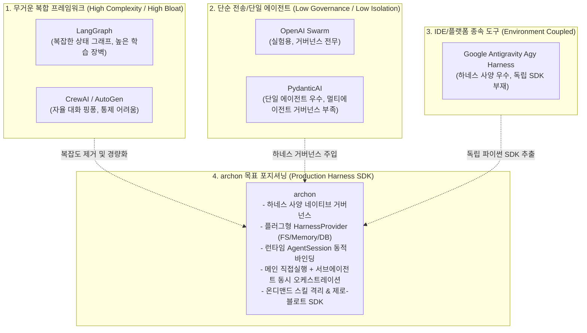
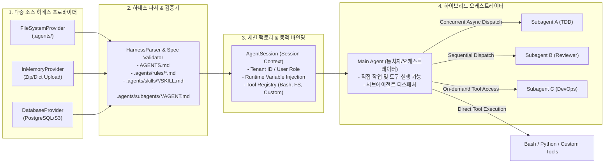

# [archon] 하네스 엔지니어링 기반 AI 에이전트 프레임워크 시장 벤치마킹 분석 보고서

- **작성일자**: 2026-09-23
- **작성자**: 시니어 마켓 및 아키텍처 애널리스트 (`market-analyst`)
- **문서 버전**: v1.0
- **상태**: Approved

---

## 1. 분석 개요 및 목적 (Executive Summary)

### 배경: 왜 프로덕션 AI 에이전트는 프레임워크 전환과 재작성을 반복하는가?
LLM 애플리케이션 개발이 단순 프롬프트 체이닝(Chaining)에서 도구를 자율적으로 사용하는 단일 에이전트(ReAct), 나아가 도메인별 전문 에이전트들이 협업하는 다중 에이전트(Multi-Agent) 시스템으로 진화했습니다. 그러나 실제 상용 서비스(B2B SaaS, 엔터프라이즈 봇, 사내 자동화 플랫폼)를 구축하는 엔지니어링 현장에서는 오픈소스 에이전트 프레임워크 도입 후 다음과 같은 이유로 결국 프레임워크를 걷어내고 자체 코드로 회귀하는 현상이 반복됩니다:

1. **프롬프트와 코드의 하드코딩 결합**: 시스템 프롬프트, 도구 명세, 페르소나가 파이썬 클래스와 함수 내부에 하드코딩되어 있어, 프롬프트나 행동 수칙 하나를 수정할 때마다 애플리케이션 코드를 다시 빌드하고 배포해야 함.
2. **로컬 파일시스템 종속성**: 대부분의 도구가 로컬 디렉터리(`prompts/`, `skills/`)에 파일이 존재한다고 가정하므로, 멀티테넌트 SaaS 환경에서 사용자(테넌트)별로 DB나 S3, 혹은 런타임 업로드로 주입되는 동적 규칙을 지원하지 못함.
3. **세션 단위 동적 거버넌스 부재**: 로그인한 사용자의 권한, 요금제 티어, 워크스페이스 컨텍스트에 따라 서브에이전트 사용 가능 여부와 스킬 셋을 세션 생성 시점에 동적으로 주입하기 어려움.
4. **과도한 추상화 오버헤드와 비결정적 무한 루프**: 프레임워크 자체의 거대한 의존성(수백 개 패키지 체인), 복잡한 상태 그래프(Pregel 엔진) 학습 곡선, 혹은 자유 대화형 에이전트 간 핑퐁으로 인한 통제 불능 토큰 소진.

최근 개발자 생태계에서는 이러한 문제를 해결하기 위해 프롬프트와 규칙, 스킬, 에이전트 명세를 구조화된 파일셋으로 정의하고 런타임이 이를 제어하는 **"하네스 엔지니어링(Harness Engineering)"** 패러다임(`AGENTS.md`, `.agents/rules/`, `.agents/skills/`, `.agents/subagents/`)이 강력한 대안으로 부상했습니다.

### 목표
글로벌 주요 에이전트 프레임워크인 OpenAI Swarm/Agents SDK, LangGraph, AutoGen, CrewAI, PydanticAI, 그리고 하네스 패러다임을 선도한 Google Antigravity Agy Harness를 벤치마킹합니다. 이를 바탕으로 하네스 엔지니어링 거버넌스를 완벽히 수용하고, 플러그형 다중 소스 프로바이더와 세션 단위 동적 바인딩을 지원하는 프로덕션급 파이썬 SDK **`archon`**의 킬러 차별화 영역과 아키텍처 원칙을 정의합니다.

---

## 2. 벤치마킹 대상 프로덕트 선정 (Benchmark Targets)

| 프레임워크 | 주관사 / 생태계 | 핵심 설계 철학 | 강점 (Strengths) | 운영상 한계 및 페인포인트 (Gotchas) |
| :--- | :--- | :--- | :--- | :--- |
| **OpenAI Swarm / Agents SDK** | OpenAI | **경량 핸드오프 (Handoffs & Routines)**<br/>"에이전트가 다른 에이전트를 반환하는 함수 호출" | 극도로 단순한 추상화(클래스 2개 수준). 상태 변수(`context_variables`) 전달. 러닝 커브가 거의 없음. | 프로덕션용 영속성(Persistence), 세션 관리, 메모리 거버넌스 부재. 교육/실험용 수준이며 구조적 룰/스킬 관리 체계 없음. |
| **LangGraph (LangChain)** | LangChain | **방향성 순환 그래프 (Pregel Cyclic Graph)**<br/>"에이전트 루프는 상태 머신(State Machine)이다" | 명확한 분기 제어, 복수 액터 간 체크포인팅(Time-Travel 디버깅), 복잡한 엔터프라이즈 워크플로우 정밀 제어. | 학습 곡선이 매우 가파름. 보일러플레이트 코드가 과도하며, 간단한 서브에이전트 호출에도 그래프 노드/엣지/리듀서 정의 필요. 프레임워크 의존성 비대. |
| **Microsoft AutoGen** | Microsoft | **대화형 다중 에이전트 협업 (Conversable Multi-Agent)**<br/>"에이전트들이 채팅방에서 메시지를 주고받으며 문제를 푼다" | 코드 자동 생성 및 실행 샌드박스, 다양한 대화 패턴(GroupChat, Two-Agent), 자율 협업 능력 우수. | 대화 수렴(Convergence) 제어가 극히 어려움. 핑퐁 대화로 인한 토큰 낭비 심각. 비즈니스 룰 및 결정론적 파이프라인 강제 불가. |
| **CrewAI** | CrewAI Inc | **역할극 기반 계층 프로세스 (Role-Playing Crew)**<br/>"회사 조직도처럼 에이전트에게 Role/Goal/Backstory 부여" | 직관적인 인지 모델(Manager-Worker), 구조화된 출력(Pydantic 연동), 빠른 프로토타이핑. | LangChain 기반의 무거운 의존성. 정형화된 프로세스 외 동적 런타임 분기 제어 경직성. 파일 기반 거버넌스 규격 부재. |
| **PydanticAI** | Pydantic | **타입 안전 모델 독립 에이전트 (Type-Safe Agent & DI)**<br/>"Pythonic 의존성 주입과 Pydantic v2 유효성 검증" | 엄격한 런타임 타입 검증, 깨끗한 의존성 주입(Context Injection), 모델 비종속적 설계, 초경량 코어. | 단일 에이전트 중심 설계. 다중 서브에이전트 간 체계적 위임/협업 패턴 부재. 룰/스킬 하네스 파일 시스템 거버넌스 미지원. |
| **Google Antigravity Agy Harness** | Google | **하네스 엔지니어링 거버넌스 (Harness Spec & Isolation)**<br/>"코드 수정 없이 마크다운/YAML 선언으로 에이전트 통제" | `AGENTS.md`, 룰셋, 온디맨드 스킬, 서브에이전트 격리 체계 완비. 컨텍스트 오염 방지 및 프로덕션 거버넌스 최적화. | Antigravity CLI/IDE 환경에 강결합되어 있음. 일반 파이썬 백엔드(FastAPI, Celery, Lambda)에서 `import archon` 형태로 직접 가져다 쓸 수 있는 독립 SDK 부재. |

---

## 3. 심층 기능 및 UX 비교 분석 (Feature & UX Comparison)

| 평가 항목 | OpenAI Swarm | LangGraph | Microsoft AutoGen | CrewAI | PydanticAI | Antigravity Agy Harness | archon 설계 목표 |
| :--- | :--- | :--- | :--- | :--- | :--- | :--- | :--- |
| **하네스 규격 거버넌스**<br/>(`AGENTS.md`, rules, skills) | 전무 (코드 내 문자열) | 수동 구현 필요 | 시스템 메시지 파편화 | Agent backstory 파편화 | 시스템 프롬프트 데코레이터 | **완벽 수용 (표준 파일셋 기반 규격)** | **완벽 네이티브 수용 (파서 및 검증기 내장)** |
| **스토리지 추상화**<br/>(FS, Memory, DB, S3) | N/A (인메모리 전용) | 체크포인터만 추상화 (설정은 코드) | 로컬 파일 의존 | 로컬 파일 의존 | N/A | 로컬 파일시스템 (.agents/) 전용 | **플러그형 `HarnessProvider` (FS, Memory, DB, S3)** |
| **동적 세션 바인딩**<br/>(런타임 테넌트별 하네스 주입) | 수동 객체 생성 | 설정 주입 복잡 | 지원 미흡 | 지원 미흡 | Dependencies 주입 지원 (하네스 개념 무) | CLI 실행 시 워크스페이스 고정 | **`AgentSession` 생성 시 하네스/룰/에이전트 즉시 바인딩** |
| **실행 모델 유연성** | Handoff (위임 후 제어권 이전) | Graph Node 분기 | GroupChat 라운드로빈 | Hierarchical / Sequential | 단일 에이전트 실행 | 메인 작업 + 서브에이전트 호출 | **메인 직접 실행 + 서브에이전트 동시/순차 오케스트레이션** |
| **스킬 격리 메커니즘**<br/>(온디맨드 주입 vs 프롬프트 누적) | 없음 (모든 툴 상시 노출) | 그래프 상태로 제어 | 툴셋 등록 방식 | Task별 tools 할당 | 함수 도구 바인딩 | **스킬 온디맨드 로딩 및 컨텍스트 격리** | **독립적 스킬 시스템 (명시적 로딩 + 프롬프트 윈도우 보존)** |
| **프레임워크 비대도 및 DX** | 극도로 가벼움 (프로덕션 기능 부족) | 무거움 (학습 비용 수주일, 의존성 다수) | 무거움 (디버깅 난항, 코드 실행 보안) | 무거움 (LangChain 기반 래퍼 체인) | 극도로 가볍고 직관적 (단일 에이전트 한정) | CLI 툴 중심 (SDK 부재) | **경량 모듈형 SDK, 제로-블로트, 직관적 DX** |

---

## 4. 사용자 선호 요인 분석 (Best UX & Killer Features)

### 1. Antigravity Agy Harness의 "선언적 하네스 거버넌스"
- **개발자 심리 및 현장 피드백**:
  - *"에이전트의 페르소나나 코딩 컨벤션, 비즈니스 룰을 수정하기 위해 파이썬 코드를 건드리고 CI/CD 파이프라인을 돌릴 필요가 없습니다. `.agents/rules/`의 마크다운 파일만 고치면 에이전트의 동작이 즉각 바뀌므로 기획자나 도메인 전문가와 협업하기가 압도적으로 편합니다."*
- **성공 요인**:
  - `AGENTS.md`를 중심으로 룰, 온디맨드 스킬, 서브에이전트의 역할과 도구가 디렉터리 기반으로 명확히 구조화됨.
  - LLM에게 한꺼번에 수만 토큰의 프롬프트를 쏟아붓지 않고, 필요한 하위 에이전트와 스킬만 격리하여 호출하므로 컨텍스트 윈도우 낭비와 환각(Hallucination)이 극적으로 감소함.

### 2. PydanticAI의 "타입 세이프 의존성 주입(Dependency Injection)과 간결성"
- **개발자 심리 및 현장 피드백**:
  - *"LangChain처럼 알 수 없는 추상 클래스 10개를 상속받을 필요 없이, 그냥 내가 쓰던 Pydantic 모델과 `@agent.tool` 함수 하나로 끝납니다. IDE에서 타입 자동완성과 린팅이 100% 작동하여 런타임 에러가 거의 없습니다."*
- **성공 요인**:
  - 파이썬 최신 표준(Type Hints, Pydantic v2)에 완벽히 부합하는 담백한 DX.
  - 복잡한 프레임워크 래퍼 없이 표준 라이브러리처럼 자연스러운 통합 지원.

### 3. OpenAI Swarm의 "핸드오프(Handoff) 함수 패턴"
- **개발자 심리 및 현장 피드백**:
  - *"에이전트 간의 전환이 복잡한 라우터 객체가 아니라, 그냥 툴 함수가 다른 `Agent` 인스턴스를 리턴하는 방식이라 직관적입니다. 코드 흐름을 눈으로 따라가기 가장 쉽습니다."*
- **성공 요인**:
  - 상태 머신이나 복잡한 그래프 이론 없이 일반 프로그래밍 함수 호출 개념으로 에이전트 전환을 모델링.

---

## 5. 사용자 불호 및 페인포인트 분석 (Pain Points & Pitfalls)

### 1. 프롬프트-비즈니스 로직 결합으로 인한 운영 유지보수 불능
- **실제 장애 시나리오**:
  ```python
  # 흔히 볼 수 있는 기존 프레임워크 안티패턴
  class CustomerSupportAgent:
      def __init__(self):
          self.prompt = """당신은 고객센터 상담원입니다. 
          규칙 1: 환불은 7일 이내만 가능합니다.
          규칙 2: ... (수백 줄 하드코딩)"""
  ```
  이커머스 운영 정책이 "환불 7일 $\rightarrow$ 14일"로 변경되었을 때, 단순 텍스트 수정임에도 백엔드 서버 저장소의 코드를 수정하고, 유닛 테스트를 거쳐, Docker 이미지를 빌드하고 롤링 배포를 해야 합니다. 정책이 잦은 엔터프라이즈 환경에서 운영팀과 개발팀 간의 극심한 커뮤니케이션 병목이 발생합니다.

### 2. 로컬 파일시스템 고정으로 인한 멀티테넌트 SaaS 구현 불가
- **실제 장애 시나리오**:
  B2B SaaS 플랫폼을 구축하는 팀이 "테넌트(고객사 A사, B사)마다 서로 다른 에이전트 수칙과 커스텀 스킬을 적용"하고자 합니다. 그러나 기존 프레임워크들은 로컬 디스크 경로(`path/to/prompts`)만을 읽도록 설계되어 있습니다. 멀티테넌트 환경에서 1,000개 고객사의 프롬프트 설정을 서버 디스크에 디렉터리별로 동적으로 생성/동기화하는 것은 파일 잠금(Lock), K8s Pod 로컬 스토리지 비동기화 등 인프라 레벨의 재앙을 초래합니다. DB(PostgreSQL JSONB), S3, 혹은 사용자가 브라우저에서 올린 압축 파일(In-Memory)로부터 하네스를 즉시 읽어오는 추상화 계층이 필수적입니다.

### 3. 세션 단위 동적 하네스 주입의 결여
- **실제 운영 시나리오**:
  동일한 테넌트 내에서도 "일반 사용자 세션"은 기본 도구만 써야 하고, "관리자 세션"은 Bash 실행 및 DB 변경 서브에이전트를 호출할 수 있어야 합니다. 하지만 대부분의 에이전트 프레임워크는 프로세스 기동 시점에 에이전트 인스턴스와 툴셋이 싱글톤으로 고정됩니다. 세션이 시작되는 시점에 토큰/세션 컨텍스트를 받아 하네스 스펙을 동적으로 조합하고 권한을 격리하는 아키텍처가 전무합니다.

### 4. 제어 불가능한 다중 에이전트 핑퐁과 무한 루프 토큰 증발
- **실제 장애 시나리오**:
  AutoGen이나 CrewAI의 자율 대화 모드에서 에이전트 A와 에이전트 B가 서로에게 질문을 던지며 "좋은 의견입니다", "그렇다면 이 점은 어떨까요?"를 무한 반복하다가 10분 만에 OpenAI API 토큰 200달러를 소진하고 타임아웃으로 크래시가 발생하는 사고가 빈번합니다. 메인 에이전트가 확실한 작업 통제권을 쥐고, 서브에이전트에게 명확한 태스크를 디스패치한 뒤 결과를 종합하는 결정론적 오케스트레이션 메커니즘이 절실합니다.

### 5. 무분별한 툴 바인딩으로 인한 컨텍스트 윈도우 오염 및 모델 성능 저하
- **실제 성능 저하 사례**:
  에이전트에 30개의 도구(Tool)를 한꺼번에 바인딩하면 시스템 프롬프트의 툴 스키마 정의만으로 10,000 토큰 이상을 소모합니다. 이는 API 호출 비용을 급증시킬 뿐만 아니라, 모델의 인스트럭션 추종 능력을 떨어뜨려 엉뚱한 도구를 호출하거나 파라미터 유효성 검증에 실패하는 원인이 됩니다. 도구와 스킬은 필요할 때만 선별적으로 로드(On-demand Skill Isolation)되어야 합니다.

---

## 6. 프로덕트 차별화 기회 영역 (Opportunity Gap & Strategy)

### 1. 경쟁 프레임워크 대비 기술 포지셔닝 매트릭스



### 2. `archon`의 5대 핵심 차별화 아키텍처



#### 차별화 1: 하네스 사양(Harness Specifications) 완벽 수용
- `AGENTS.md`(메인 지침), `.agents/rules/`(행동 수칙), `.agents/skills/`(온디맨드 실행 지침), `.agents/subagents/`(전문 위임 에이전트)의 표준 파일 규격을 파이썬 객체 모델로 완벽히 파싱 및 검증.
- 마크다운 Frontmatter(`YAML`)와 본문을 깔끔히 분리하여 메타데이터와 지침을 체계적으로 구조화.

#### 차별화 2: 플러그형 다중 소스 하네스 프로바이더 (`HarnessProvider`)
- **`FileSystemHarnessProvider`**: 로컬 CLI 및 개발 환경에서 파일시스템 디렉터리를 감시하고 로드.
- **`InMemoryHarnessProvider`**: 사용자가 웹 UI에서 업로드한 ZIP 파일이나 사전(dict) 구조를 메모리에서 즉시 파싱.
- **`DatabaseHarnessProvider`**: 멀티테넌트 SaaS를 위해 PostgreSQL, MySQL, S3에 저장된 테넌트별 하네스 스펙을 실시간 쿼리하여 캐싱 및 로드.

#### 차별화 3: 세션 초기화 시점의 동적 하네스 바인딩 (`AgentSession`)
- 요청이 들어오는 시점에 `AgentSession(tenant_id="oz", user_role="admin", harness_provider=db_provider)`를 생성.
- 사용자 권한에 따라 비활성화된 서브에이전트나 위험 툴(예: Bash execution)을 원천 차단하여 세션 레벨의 멀티테넌트 보안 격리 달성.

#### 차별화 4: 듀얼 실행 모델 (Main Agent Work + Multi-Subagent Orchestration)
- 메인 에이전트가 단순 전달자(Router)에 그치지 않고, 가벼운 작업은 직접 툴을 실행하여 해결.
- 복잡하거나 전문성이 요구되는 태스크는 `dispatch_subagents([task_a, task_b], mode="parallel")`를 통해 동시 비동기(`asyncio.gather`) 또는 순차 파이프라인으로 안전하게 위임하고 결과를 취합.

#### 차별화 5: 온디맨드 스킬 격리 (Skill Isolation) 시스템
- 모든 스킬의 세부 가이드를 시스템 프롬프트에 상시 적재하지 않고, 메인 에이전트가 필요 시점에 `load_skill("humanizer")` 형태로 로드하여 일시적으로 컨텍스트에 주입.
- 토큰 비용을 최소화하고 불필요한 프롬프트 간섭으로 인한 모델 성능 저하를 방지.

---

## 7. 아키텍처 트레이드오프 및 엔지니어링 주의사항 (Gotchas & Limitations)

1. **동적 프로바이더 로딩과 레이턴시 트레이드오프**:
   DB나 S3에서 하네스 스펙을 세션마다 매번 새로 긁어오면 첫 번째 LLM 호출 전에 수십~수백 밀리초의 I/O 지연이 추가됩니다. 이를 방지하기 위해 테넌트별 하네스 스펙에 대한 메모리 기반 LRU 캐시 및 ETag 기반 조건부 갱신 메커니즘을 내장해야 합니다.
2. **다중 서브에이전트 병렬 호출 시 API 레이트 리밋(Rate Limit) 폭증**:
   메인 에이전트가 5개의 서브에이전트를 `parallel` 모드로 동시 호출할 경우, 순간 분당 토큰/요청 수(TPM/RPM)가 급증하여 LLM 공급자로부터 `429 Too Many Requests` 에러를 맞을 수 있습니다. `archon` 내부 오케스트레이터에 세마포어(`asyncio.Semaphore`) 기반의 동시성 제어 및 지수 백오프 재시도 큐가 반드시 내장되어야 합니다.
3. **세션 상태 직렬화(Serialization) 한계**:
   세션 내에 복잡한 파이썬 콜백이나 오픈 소켓, 툴 클라이언트 객체가 바인딩된 경우, 세션을 Redis나 DB로 온전히 직렬화(pickle/json)하여 분산 서버 간 공유하기 어렵습니다. 세션의 "설정 및 대화 기록(State)"과 "실행 런타임(Runtime Client)"을 명확히 레이어로 분리 설계해야 합니다.
