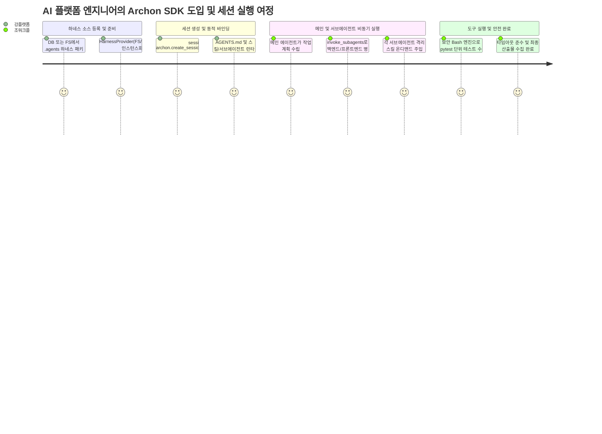

# [archon] 제품 요구사항 정의서 (Product Requirements Document - PRD)

- **작성일자**: 2026-09-23
- **작성자**: 기획 명세 작성가 (`spec-writer`)
- **문서 버전**: v1.0
- **상태**: Approved

---

## 1. 배경 및 문제 정의 (Problem Statement & Context)

### 1.1 배경 (Background)
복합 업무를 수행하는 LLM 기반 자율 에이전트(Autonomous Agents)가 프로덕션 시스템에 도입되면서, 단일 프롬프트에 모든 역할을 밀어 넣는 방식의 한계가 명확해졌습니다. 프롬프트 길이가 증가할수록 컨텍스트 윈도우가 오염되고, 지시문 충돌로 인해 할루시네이션과 역할 혼선이 급증하기 때문입니다.

이를 해결하기 위해 에이전트를 전문 도메인 단위(기획, 아키텍처, 구현, 리뷰, QA)로 분할하고, 표준화된 규칙 파일(`AGENTS.md`)과 거버넌스 디렉토리(`.agents/rules`, `.agents/skills`, `.agents/subagents`)를 통해 에이전트의 행동을 엄격히 규정하는 **하네스 엔지니어링(Harness Engineering)** 방법론이 등장했습니다.

그러나 기존의 파이썬 에이전트 프레임워크들은 다음과 같은 실무적 한계를 가지고 있습니다:
- 에이전트와 도구 구성이 파이썬 소스코드에 하드코딩되어 있어, 규칙이나 프롬프트 수정 시마다 애플리케이션을 재배포해야 함.
- 사내 멀티 테넌트 SaaS 환경에서 사용자별, 프로젝트별로 서로 다른 하네스 파일(로컬 파일시스템, zip 업로드, 데이터베이스 저장소)을 세션에 동적으로 연결하기 어려움.
- 메인 에이전트가 복수의 전문 서브에이전트를 비동기 병렬(`asyncio.gather`)로 호출하고 결과를 안전하게 취합하는 신뢰성 있는 오케스트레이션 메커니즘 부재.
- 셸 커맨드(Bash)나 도구 실행 시 타임아웃, 디렉토리 탈출(Jailbreak), 위험 명령어 차단 등 프로덕션 레벨의 보안 통제가 결여됨.

`archon`은 하네스 엔지니어링 거버넌스를 퍼스트 클래스로 수용하여, 마크다운 기반의 선언적 하네스를 런타임에 동적으로 로드하고, 안전한 서브에이전트 오케스트레이션과 툴 실행을 제공하는 파이썬 에이전트 SDK입니다.

### 1.2 해결하려는 핵심 문제 (Core Problems)

1. **정적 코드 결합으로 인한 거버넌스 운영 유연성 부재**:
   - 에이전트의 시스템 프롬프트, 도구 허용 목록, 스킬 세트가 파이썬 클래스 정의에 고정되어 있어 런타임 변경이 불가능합니다.
   - 프로젝트 파일시스템(`FS`), 웹 업로드(`Zip`), 데이터베이스(`DB`) 등 다양한 저장소에 위치한 하네스를 세션 시작 시 즉시 주입(Dynamic Binding)하는 표준 인터페이스가 없습니다.
2. **서브에이전트 동시 오케스트레이션 및 메시징 규약 결여**:
   - 프론트엔드와 백엔드처럼 병렬 진행 가능한 작업을 메인 에이전트가 동시에 분기하고 결과를 취합하는 표준 라이브러리 지원이 부족합니다.
   - 부모-자식 에이전트 간의 재귀 깊이 폭주(Fork Bomb), 데드락, 개별 서브에이전트 타임아웃에 대한 격리 실패로 시스템 전체가 멈추는 현상이 빈발합니다.
3. **스킬 오염(Skill Pollution) 및 툴 보안 취약점**:
   - 스킬 파일 내에서 다른 스킬을 무분별하게 참조하거나 임포트하여 스킬 간 결합도가 치솟고 프롬프트 토큰이 낭비되는 스킬 오염 문제가 발생합니다.
   - 에이전트가 코드 빌드나 테스트를 위해 Bash 툴을 실행할 때, 파괴적인 명령어(`rm -rf /`, `mkfs` 등)나 작업 디렉토리 상위 탈출을 차단하는 샌드박스 정책이 없습니다.

### 1.3 제품 비전 (Product Vision)
**"마크다운 기반 하네스 거버넌스(AGENTS.md, .agents/)를 완벽 수용하고, 세션 단위 다중 소스(FS/Upload/DB) 동적 바인딩과 안전한 서브에이전트 비동기 동시 오케스트레이션을 제공하는 파이썬 에이전트 코어 SDK"**

---

## 2. 타깃 페르소나 및 사용자 시나리오 (Personas & User Journey)

### 2.1 대표 페르소나

- **강플랫폼 (33세, AI 에이전트 플랫폼 엔지니어)**
  - **상황**: 사내 20여 개 개발팀을 위한 멀티 테넌트 LLM 에이전트 서비스 플랫폼 구축 중.
  - **페인포인트**: "팀마다 자기 프로젝트의 `AGENTS.md`와 `.agents/` 규칙이 다릅니다. 사용자가 웹에서 프로젝트 zip을 업로드하거나 DB에 저장된 설정을 불러올 때, 파이썬 서버 재시작 없이 세션마다 해당 하네스를 격리하여 즉시 바인딩할 수 있어야 합니다."
- **조워크플 (29세, 자율 개발 파이프라인 엔지니어)**
  - **상황**: 기획-설계-TDD-리뷰-QA 파이프라인을 에이전트 팀으로 자동화하려 함.
  - **페인포인트**: "계약(API)이 체결된 후 백엔드 에이전트와 프론트엔드 에이전트를 동시에 비동기로 돌리고 결과를 안전하게 합쳐야 합니다. 한쪽이 무한 루프에 빠지거나 위험한 bash 커맨드를 치더라도 전체 플랫폼이 죽지 않도록 타임아웃과 샌드박스가 필요합니다."

### 2.2 사용자 핵심 여정 (User Journey)

---

## 3. 기능 요구사항 및 우선순위 (Feature Requirements)

| 요구사항 ID | 도메인 | 요구사항 명칭 및 상세 설명 | 우선순위 (MoSCoW) | 선정 사유 및 기술적 고려사항 |
| :--- | :--- | :--- | :---: | :--- |
| `REQ-HARN-001` | 하네스 시스템 | **다중 소스 하네스 프로바이더 및 파서** 로컬 파일시스템(FS), 업로드 압축파일(Zip/Tar), 데이터베이스(DB)에서 `.agents` 및 `AGENTS.md`를 로드하고 마크다운 프론트매터를 정규화 파싱 | **Must Have** | 멀티 테넌트 SaaS 및 동적 프로젝트 환경 수용의 핵심 기반 |
| `REQ-SESS-001` | 세션 라이프사이클 | **세션 단위 하네스 동적 바인딩 및 런타임 컴파일** 요청 세션마다 독립된 하네스 스냅샷을 생성하고, 시스템 지시문/스킬 레지스트리/사용 가능 도구를 불변 컨텍스트로 컴파일 | **Must Have** | 서버 무중단 상태에서 테넌트별 맞춤형 에이전트 격리 실행 보장 |
| `REQ-SUB-001` | 오케스트레이션 | **모듈러 다중 서브에이전트 비동기 동시 호출 (`invoke_subagents`)** `asyncio.gather` 기반으로 복수 서브에이전트를 병렬 실행하고, 인메모리 이벤트 버스를 통한 부모-자식 상태 전달 | **Must Have** | 프론트/백엔드 병렬 TDD 등 복합 워크플로우 처리 시간 단축 |
| `REQ-TOOL-001` | 툴 엔진 | **보안 Bash 및 툴 실행 엔진 (`ToolRegistry`, `@tool`)** 파이썬 함수를 도구로 등록하고, Bash 툴 실행 시 작업 디렉토리 감금(Jail), 위험 명령어 차단, 프로세스 타임아웃 강제 | **Must Have** | 에이전트의 임의 코드 실행으로 인한 호스트 시스템 파괴 원천 방지 |
| `REQ-SKIL-001` | 스킬 시스템 | **독립 스킬(Skill Isolation) 온디맨드 프로그레시브 주입** 스킬 간 상호 참조를 엄격히 금지하고, 서브에이전트 요구 시점에 필요한 스킬 가이드만 컨텍스트에 점진적 주입 | **Must Have** | 프롬프트 토큰 낭비 방지 및 스킬 간 결합도 오염 차단 |
| `REQ-MOD-001` | 모델 어댑터 | **멀티 LLM 모델 어댑터 및 스트리밍 처리** OpenAI, Anthropic, Gemini 등 다양한 모델과의 스트리밍 통신, 도구 호출(Tool Call) 직렬화 및 구조화 출력 파싱 | **Must Have** | 모델 벤더 종속성 탈피 및 유연한 모델 교체 지원 |
| `REQ-BUS-001` | 코어 런타임 | **반응형 이벤트 메시지 버스 (Message Bus)** 세션 내 에이전트 간 비동기 메시지 교환, 상태 변경 이벤트 전파, 조기 종료 시그널 지원 | **Should Have** | 서브에이전트 간 느슨한 결합(Decoupling) 및 실시간 관측성 확보 |
| `REQ-VIS-001` | 관측성 | **에이전트 실행 궤적 트레이싱 (Trace Logger)** 각 에이전트의 프롬프트 토큰 소모량, 레이턴시, 툴 호출 입출력을 구조화 JSON으로 기록 | **Should Have** | 프로덕션 디버깅 및 비용/성능 분석 가시성 제공 |
| `REQ-DOCK-001` | 격리 샌드박스 | **도커 컨테이너 격리 툴 실행기** 호스트 OS 대신 일회성 Docker 컨테이너 내부에서 Bash 명령어를 격리 실행 | **Could Have (v2)** | v1은 서브프로세스 샌드박스로 대응하고 v2에서 컨테이너 격리 고도화 |

---

## 4. 정량적 성공 지표 (Measurable KPIs)

| 지표명 | 측정 기준 및 테스트 시나리오 | 목표치 |
| :--- | :--- | :--- |
| **하네스 로드 및 컴파일 지연** | FS 및 DB 소스에서 하네스 파싱 후 `AgentSession` 생성 완료까지의 시간 | **$\le 20\text{ms}$** |
| **비동기 동시 호출 성공률** | 5개 서브에이전트 병렬 호출 1,000회 스트레스 테스트 시 데드락 없는 완료율 | **$\ge 99.5\%$** |
| **스킬 독립성 위반 차단율** | 스킬 내부에서 타 스킬 참조/호출 시도 시 런타임 사전 검증 차단율 | **100% (Zero Tolerance)** |
| **위험 Bash 명령어 차단율** | 블랙리스트 명령어(`rm -rf`, `sudo`, `mkfs` 등) 50종 모의 주입 시 차단율 | **100% (완전 차단)** |
| **동시 세션 리소스 격리도** | 50개 동시 세션 실행 시 세션 간 프롬프트, 도구 레지스트리 교차 오염 발생 건수 | **0건 (완벽 격리)** |
| **테스트 코드 라인 커버리지** | `pytest` 기준 단위 및 통합 테스트 커버리지 | **$\ge 90\%$** |

---

## 5. 비기능적 요구사항 및 한계/주의사항 (Non-Functional Requirements & Gotchas)

### 5.1 비기능 요구사항
- **런타임 및 의존성**: Python 3.10 이상 지원, 비동기 네이티브(`asyncio`), `pydantic>=2.0`, `httpx>=0.25.0` 기반의 경량 패키지 구성.
- **타입 안전성**: 모든 공개 API(`ArchonSession`, `HarnessProvider`, `invoke_subagents`)에 엄격한 Type Hinting 적용 (MyPy strict 통과).
- **스레드/코루틴 안전성**: 세션 객체와 메시지 버스는 비동기 코루틴 간 안전하게 공유되며 락(Lock) 경합으로 인한 블로킹이 발생하지 않도록 설계.

### 5.2 솔직한 한계와 실무 주의점 (Known Limitations & Gotchas)
1. **서브에이전트 재귀 깊이 폭주(Fork Bomb) 주의**:
   - 서브에이전트가 또 다른 서브에이전트를 무제한으로 호출할 경우 LLM API 비용과 프로세스 리소스가 급증합니다.
   - `archon`은 기본적으로 `max_subagent_depth=3`을 강제하며, 동일한 부모-자식 체인 내의 순환 호출(Cycle)을 엄격히 탐지하여 차단합니다.
2. **Bash 도구 샌드박스의 한계**:
   - v1의 Bash 도구는 파이썬 `asyncio.subprocess` 레벨에서 작업 디렉토리 감금과 커맨드 정규식 블랙리스트로 방어합니다.
   - 이는 파일시스템 파괴나 단순 탈출을 막을 수 있으나, 완전한 OS 커널 레벨 격리는 아니므로 임의 사용자의 완전히 검증되지 않은 악성 코드를 실행할 때는 외부 Docker 컨테이너 환경을 병행해야 합니다.
3. **스킬 간 상호 참조 금지 원칙(Skill Isolation Principle)**:
   - 스킬은 완전한 독립 단위여야 합니다. "스킬 A가 내부에서 스킬 B를 가져다 쓴다"는 구조는 금지되며, 두 스킬이 모두 필요한 경우 서브에이전트 선언부나 오케스트레이터에서 두 스킬을 각각 독립적으로 주입해야 합니다.
