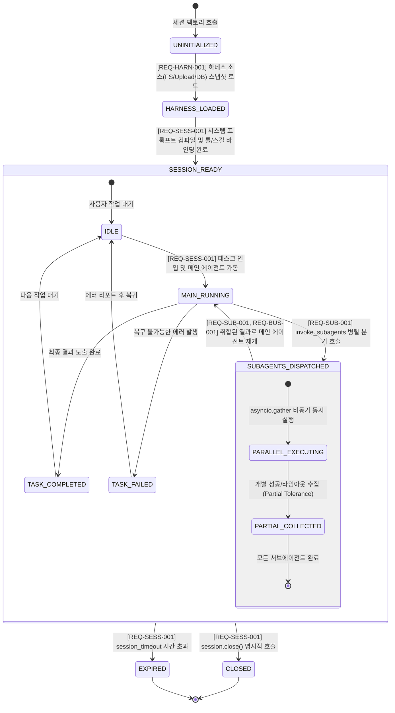

# [archon] 비즈니스 정책 및 전역 예외 처리 명세서 (Policy & Edge Cases)

- **작성일자**: 2026-09-23
- **작성자**: 기획 명세 작성가 (`spec-writer`)
- **문서 버전**: v1.1 (REQ 기준 거버넌스 및 엣지 매핑 전면 확립 개정판)
- **상태**: Approved

---

## 1. 세션 및 서브에이전트 생명주기 상태 머신 (Session & Subagent Lifecycle by REQ)

`archon`이 관리하는 에이전트 세션의 초기화, 메인 에이전트 실행, 서브에이전트 병렬 디스패치 및 종료 상태 전이도입니다. 모든 전이 조건은 PRD의 `REQ-SESS-001`, `REQ-SUB-001`, `REQ-HARN-001` 인수 판정 기준과 100% 매핑됩니다.

### 1.1 상태 전이 매트릭스 및 REQ 검증 규칙

| 현재 상태 | 대상 상태 | 전이 트리거 이벤트 | 필수 사전 조건 | 동작 및 사후 조건 | 검증 대응 REQ-ID |
| :--- | :--- | :--- | :--- | :--- | :---: |
| `UNINITIALIZED` | `HARNESS_LOADED` | `HarnessProvider.load()` | 유효한 소스 설정(FS 경로, 업로드 바이트, DB 세션) | 하네스 스냅샷 생성 및 마크다운/YAML 파싱 완료 ($\le 20\text{ms}$) | `REQ-HARN-001` |
| `HARNESS_LOADED` | `SESSION_READY` | `create_session()` | 스냅샷 무결성 통과 (스킬 독립성 린트 포함) | 프롬프트 컴파일, 세션 격리 ToolRegistry 복제, MessageBus 개설 | `REQ-SESS-001` |
| `IDLE` | `MAIN_RUNNING` | `session.run(task)` | 세션이 활성 상태(`not is_closed`) | 메인 에이전트 코루틴 시작, 세션 타임아웃 타이머 가동 | `REQ-SESS-001` |
| `MAIN_RUNNING` | `SUBAGENTS_DISPATCHED` | `invoke_subagents()` 호출 | 호출 깊이 $\le 3$, 순환 호출 부재 | `asyncio.gather` 병렬 스폰, 세마포어(최대 10개) 획득 | `REQ-SUB-001` |
| `SUBAGENTS_DISPATCHED` | `MAIN_RUNNING` | 모든 서브에이전트 완료 | 개별 태스크 종료 (성공 또는 타임아웃) | 부분 성공 결과 보존 및 `SubagentResult` 리스트 반환 | `REQ-SUB-001` `REQ-BUS-001` |
| `MAIN_RUNNING` | `TASK_COMPLETED` | 최종 출력 도출 | 메인 에이전트 완료 선언 | 최종 응답 객체 생성 및 세션 상태 갱신 | `REQ-SESS-001` |
| `SESSION_READY` | `EXPIRED` | 세션 경과 시간 > `session_timeout` | 타이머 만료 (기본 600초) | 활성 서브프로세스 및 코루틴 강제 취소 (`cancel()`) | `REQ-SESS-001` |
| `SESSION_READY` | `CLOSED` | `session.close()` 호출 | 사용자 명시적 종료 요청 | 메시지 버스 닫힘, 임시 리소스 및 프로세스 정리 | `REQ-SESS-001` |

---

## 2. REQ 기준 전역 거버넌스 및 제약 정책 (Global Governance Policies by REQ)

### 2.1 [REQ-HARN-001] 하네스 소스 로드 및 ZipSlip 방어 정책
- **다중 소스 추상화 원칙**:
  - `FS`, `Upload`, `DB` 프로바이더는 원본 저장소의 물리적 차이를 은닉하고 표준화된 `HarnessSnapshot` 불변 객체만을 상위 계층에 전달합니다.
- **ZipSlip 파일시스템 탈출 방어**:
  - 압축 파일(Zip/Tar) 해제 시 모든 대상 파일의 경로를 `os.path.commonpath`로 정규화하여 작업 임시 디렉토리 외부(`../../` 등)로의 쓰기 시도를 전수 차단합니다. 위반 시 프로세스를 즉시 중단하고 `HarnessSecurityError`를 발생시킵니다.
- **YAML 프론트매터 스키마 강제**:
  - 모든 마크다운 상단 메타데이터는 Pydantic 스키마 검증을 통과해야 하며, 필수 속성 누락 시 런타임 진입 전 파싱 단계에서 거부합니다.

### 2.2 [REQ-SESS-001] 세션 동적 바인딩 및 프롬프트 불변성/타임아웃 정책
- **세션 리소스 완전 격리 (Multi-Tenant Isolation)**:
  - 각 `AgentSession`은 고유한 `session_id`를 소유하며, 프롬프트, 도구 레지스트리, 스킬 레지스트리를 세션 메모리 스코프로 독립 복제합니다. 50개 동시 세션 실행 시에도 교차 오염이 절대 발생하지 않아야 합니다.
- **프롬프트 불변성 (Prompt Immutability)**:
  - 시스템 프롬프트는 세션 생성 시점에 1회 컴파일되어 Frozen 상태로 캐싱되며, 런타임 중간 변조를 금지합니다.
- **세션 타임아웃 세분화**:
  - `session_timeout` (기본값: 600.0초, 상한선: 3600.0초): 전체 세션 최대 지속 시간. 만료 시 하위 비동기 태스크 및 서브프로세스를 즉시 강제 취소합니다.

### 2.3 [REQ-SUB-001] 서브에이전트 재귀 깊이, 순환 방지 및 동시성 제어 정책
- **최대 호출 깊이 한도 (`max_subagent_depth = 3`)**:
  - `Root Main Agent` (Depth 0) $\rightarrow$ `Subagent` (Depth 1) $\rightarrow$ `Nested Subagent` (Depth 2) $\rightarrow$ `Leaf Subagent` (Depth 3).
  - Depth 3에 도달한 서브에이전트가 추가로 `invoke_subagents`를 호출하면 시스템은 즉시 `SubagentDepthExceededError`를 발생시키고 실행을 차단합니다.
- **순환 호출 체인 탐지 (Cycle Detection)**:
  - 모든 서브에이전트 호출 요청에는 부모 계통 리스트(`caller_lineage: List[str]`)가 불변으로 첨부됩니다.
  - 대상 서브에이전트가 이미 `caller_lineage`에 존재하는 경우(예: A $\rightarrow$ B $\rightarrow$ A), 데드락과 무한 루프를 방지하기 위해 즉시 `SubagentCycleDetectedError`를 발생시킵니다.
- **부분 실패 허용 및 결과 보존 (Partial Failure Tolerance)**:
  - `asyncio.gather(*tasks, return_exceptions=True)` 방식을 적용하여, 복수 서브에이전트 중 1개가 타임아웃이나 예외로 실패하더라도 성공한 나머지 서브에이전트의 산출물은 정상 취합하여 반환합니다.
- **동시성 세마포어 (`concurrency_limit = 10`)**:
  - 세션당 동시 실행 가능한 서브에이전트 수를 최대 10개로 제한하여 호스트 OS의 스레드/코루틴 폭주를 방어합니다. 초과 요청은 FIFO 큐에서 대기합니다.

### 2.4 [REQ-TOOL-001] 작업 디렉토리 감금(Jail) 및 Bash 프로세스 샌드박스 정책
- **디렉토리 감금 (Directory Jail)**:
  - `BashTool` 실행 시 작업 디렉토리는 반드시 사전에 지정된 `working_directory` 내부로 한정됩니다.
  - 명령어 내에 `cd /`, `cd ../../../` 등 작업 디렉토리 상위로 탈출하려는 시도가 감지되면 프로세스를 띄우지 않고 `ToolSecurityError`를 발생시킵니다.
- **위험 명령어 블랙리스트 정규식 (Zero Tolerance)**:
  - 다음 패턴이 포함된 명령어는 사전 검증에서 100% 차단됩니다:
    - 파괴적 삭제: `\brm\s+-[rfRF]*\s+[/~]`
    - 권한 상승: `\bsudo\b`, `\bsu\b`, `\bchown\b`, `\bchmod\s+[0-7]{3,4}\s+[/~]`
    - 디스크 직접 조작: `\bmkfs\b`, `\bdd\b`, `\bfdisk\b`
    - 시스템 제어: `\bshutdown\b`, `\breboot\b`, `\binit\s+[06]\b`
    - 포크 폭탄: `:\(\)\s*\{\s*:\|:&\s*\};:`
- **프로세스 그룹 격리 및 강제 회수**:
  - 서브프로세스 실행 시 `preexec_fn=os.setsid`를 사용하여 독립된 프로세스 그룹을 생성합니다.
  - 타임아웃(`command_timeout`, 기본 60초) 초과 또는 취소 발생 시 `os.killpg(os.getpgid(proc.pid), signal.SIGKILL)`을 호출하여 자식 프로세스 트리를 완전히 강제 종료함으로써 좀비 프로세스를 방지합니다.
- **출력 버퍼 보호 (Output Truncation)**:
  - `stdout` 및 `stderr`는 최대 1MB(1,048,576 바이트)까지만 인메모리에 버퍼링합니다. 1MB 초과 시 즉시 스트림 수집을 중단하고 `[TRUNCATED: Output exceeded 1MB]` 접미사를 붙여 메모리 폭주(OOM)를 방지합니다.

### 2.5 [REQ-SKIL-001] 스킬 독립성 원칙 (Skill Isolation Principle)
- **스킬 간 상호 참조 절대 금지**:
  - 모든 스킬(`SKILL.md`)은 원자적(Atomic)이며 직교(Orthogonal)해야 합니다.
  - 스킬 파일 내부에서 다른 스킬의 이름, 파일 경로(`../other_skill/`), 또는 스킬 호출 구문을 포함하는 행위는 엄격히 금지됩니다.
- **정적 린터(Linter) 사전 차단**:
  - 하네스 파싱 시 모든 스킬 텍스트를 검사하여 타 스킬 참조가 감지되면 즉시 `SkillIsolationViolationError`를 던져 하네스 로드 자체를 거부합니다.
- **온디맨드 프로그레시브 주입**:
  - 스킬의 결합은 오직 서브에이전트 선언부(`.agents/subagents/*.md`)나 오케스트레이터의 동적 인젝터를 통해서만 수행되며, 에이전트 실행 시점에 필요한 스킬만 점진적으로 주입되어 컨텍스트 윈도우 오염을 방지합니다.

### 2.6 [REQ-MOD-001] 멀티 LLM 통신 및 Full Jitter 지수 백오프 정책
- 외부 LLM API(Anthropic, OpenAI 등) 호출 중 일시적 429(Rate Limit) 또는 503(Overloaded) 에러 발생 시, 시스템은 Full Jitter 지수 백오프 알고리즘을 적용하여 최대 3회 자동 재시도합니다:
  $$T_{exp} = \min(30.0, 0.5 \times 2^{attempt}), \quad T_{wait} \sim \text{Uniform}(0, T_{exp})$$

### 2.7 [REQ-BUS-001] 세션 내 비동기 메시지 버스 규약
- 세션 내 통신은 전역 변수 공유를 금지하며, `MessageBus.send_message` 및 `publish_event` 채널을 통해서만 비동기 통신합니다. 수신 에이전트는 메시지 도착 시 지연 없이 리액티브 웨이크업(Reactive Wakeup)됩니다.

---

## 3. REQ 기준 전역 엣지 케이스 및 복구 가이드 (Edge Cases & Recovery Playbook by REQ)

| 검증 대응 REQ-ID | 장애 / 엣지 시나리오 | 감지 방식 | 시스템 처리 방식 및 엔지니어링 복구 가이드 | 인수 판정 기준 매핑 |
| :---: | :--- | :--- | :--- | :--- |
| `REQ-SUB-001` | **서브에이전트 부분 실패 (Partial Failure)** | `asyncio.gather(..., return_exceptions=True)`로 포착 | 실패한 서브에이전트만 `is_success=False`, `ERR_SUB_TIMEOUT`으로 마킹하고, 성공한 다른 서브에이전트의 산출물은 정상 보존하여 메인 에이전트에 반환 (부분 실패 격리) | 5개 병렬 중 1개 실패 시 성공 4개 산출물 $100\%$ 보존 |
| `REQ-SUB-001` | **재귀 호출 깊이 3단계 초과 및 순환 체인 인입** | 서브에이전트 디스패처의 `current_depth` 및 `caller_lineage` 검사 | 즉시 하위 태스크 스폰을 차단하고 `ERR_SUB_DEPTH_EXCEEDED` 또는 `ERR_SUB_CYCLE_DETECTED` 반환 | 재귀 4단계 차단율 $100\%$, 순환 호출 탐지율 $100\%$ |
| `REQ-TOOL-001` | **무한 루프 Bash 스크립트 실행 (`while true`)** | `command_timeout`(60초) 도달 시 비동기 타이머 트리거 | `os.killpg`로 해당 프로세스 그룹 전체에 `SIGKILL`을 발행하여 OS 소켓 및 CPU 자원을 즉시 회수하고 `exit_code=-1` 기록 | 강제 종료 후 좀비 프로세스 잔존 $0\text{건}$ |
| `REQ-TOOL-001` | **위험 명령어(`rm -rf /`) 및 작업 디렉토리 탈출** | 정규식 사전 검사 및 절대 경로 접두사(`startswith`) 검사 | 서브프로세스를 생성하지 않고 `ToolSecurityError`를 발생시켜 시스템 파괴 원천 차단 | 위험 명령어 50종 모의 주입 시 차단율 $100\%$ |
| `REQ-TOOL-001` | **대용량 콘솔 출력으로 인한 메모리 폭주 (OOM)** | 서브프로세스 stdout 수집 바이트 수가 1MB 초과 시 | 스트림 리더를 즉시 닫고 앞부분 1MB만 버퍼에 보존한 뒤 `is_truncated=True` 플래그를 설정하여 OOM 방어 | 버퍼링 상한 1MB 엄수 및 절삭 문구 표기 |
| `REQ-HARN-001` | **업로드 압축파일 내 ZipSlip 탈출 공격** | 압축 해제 대상 경로의 `os.path.commonpath` 불일치 감지 | 인메모리 압축 해제 루프를 즉시 중단하고 해당 업로드 바이트를 파기한 뒤 `HarnessSecurityError` 발생 | 상위 탈출 경로 파일 쓰기 차단 $100\%$ |
| `REQ-SKIL-001` | **스킬 간 상호 참조 린트 위반** | 하네스 파싱 시 정규식 패턴 분석으로 타 스킬명 매칭 | 하네스 로드를 즉시 거부하고 위반 스킬 파일명과 라인 번호를 에러 메시지로 명시하여 개발자 수정 유도 | 스킬 간 상호 참조 모의 10종 전수 차단 |
| `REQ-SESS-001` | **세션 타임아웃 만료 시 잔여 비동기 태스크 잔존** | `session_timeout` 타이머 만료 또는 `session.close()` 호출 | 세션 활성 Task Set 순회하며 `task.cancel()` 발행 및 비동기 수거 완료 후 세션 종료 | 세션 종료 후 미수거 코루틴 및 핸들 $0\text{건}$ |
| `REQ-MOD-001` | **외부 LLM API 429/503 일시 장애** | HTTP 응답 상태코드 429, 503 수신 | Full Jitter 지수 백오프 공식($T_{wait} \sim \text{Uniform}(0, \min(30, 0.5 \times 2^k))$)으로 최대 3회 재시도 후 최종 실패 처리 | Thundering Herd 완화 및 지수 백오프 동작 검증 |
| `REQ-BUS-001` | **유효하지 않은 수신자 ID 메시지 발송** | `MessageBus.send_message` 시 등록된 서브에이전트 ID 조회 | 존재하지 않는 ID인 경우 즉시 `InvalidRecipientError` 반환하여 데드레터 방지 | 미등록 수신자 전송 시 $100\%$ 에러 피드백 |
