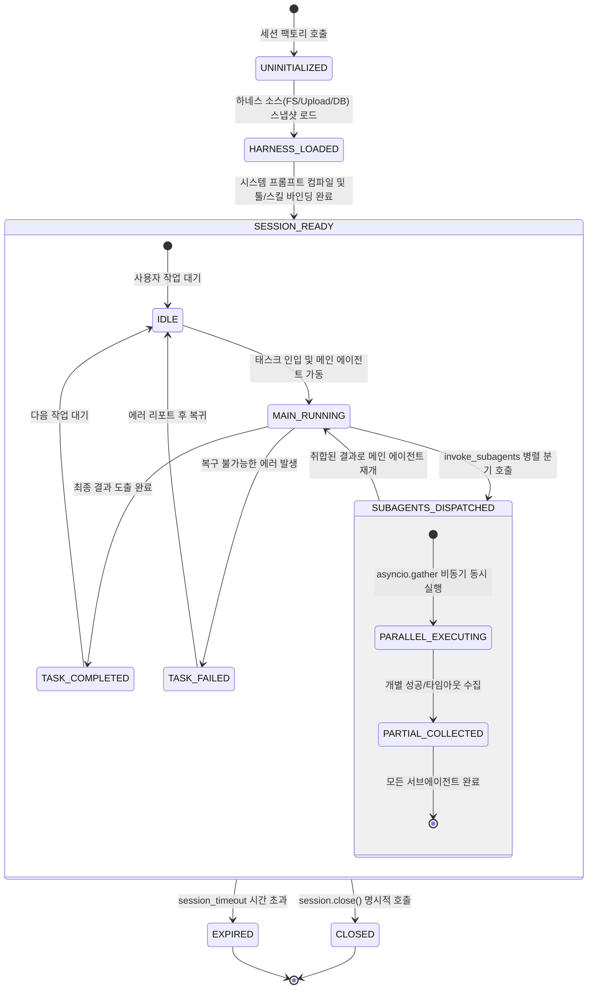

# [archon] 비즈니스 정책 및 전역 예외 처리 명세서 (Policy & Edge Cases)

- **작성일자**: 2026-09-23
- **작성자**: 기획 명세 작성가 (`spec-writer`)
- **문서 버전**: v1.0
- **상태**: Approved

---

## 1. 세션 및 서브에이전트 생명주기 상태 머신 (Session & Subagent Lifecycle)

`archon`이 관리하는 에이전트 세션의 초기화, 메인 에이전트 실행, 서브에이전트 병렬 디스패치 및 종료 상태 전이도입니다.

### 1.1 상태 전이 매트릭스 및 규칙

| 현재 상태 | 대상 상태 | 전이 트리거 이벤트 | 필수 사전 조건 | 동작 및 사후 조건 |
| :--- | :--- | :--- | :--- | :--- |
| `UNINITIALIZED` | `HARNESS_LOADED` | `HarnessProvider.load()` | 유효한 소스 설정(FS 경로, 업로드 바이트, DB 세션) | 하네스 스냅샷 생성 및 마크다운/YAML 파싱 완료 |
| `HARNESS_LOADED` | `SESSION_READY` | `create_session()` | 스냅샷 무결성 통과 (스킬 독립성 린트 포함) | 프롬프트 컴파일, 세션 격리 ToolRegistry 복제, MessageBus 개설 |
| `IDLE` | `MAIN_RUNNING` | `session.run(task)` | 세션이 활성 상태(`not is_closed`) | 메인 에이전트 코루틴 시작, 세션 타임아웃 타이머 가동 |
| `MAIN_RUNNING` | `SUBAGENTS_DISPATCHED` | `invoke_subagents()` 호출 | 호출 깊이 $\le 3$, 순환 호출 부재 | `asyncio.gather` 병렬 스폰, 세마포어(최대 10개) 획득 |
| `SUBAGENTS_DISPATCHED` | `MAIN_RUNNING` | 모든 서브에이전트 완료 | 개별 태스크 종료 (성공 또는 타임아웃) | 부분 성공 결과 보존 및 `SubagentResult` 리스트 반환 |
| `MAIN_RUNNING` | `TASK_COMPLETED` | 최종 출력 도출 | 메인 에이전트 완료 선언 | 최종 응답 객체 생성 및 세션 상태 갱신 |
| `SESSION_READY` | `EXPIRED` | 세션 경과 시간 > `session_timeout` | 타이머 만료 | 활성 서브프로세스 및 코루틴 강제 취소 (`cancel()`) |
| `SESSION_READY` | `CLOSED` | `session.close()` 호출 | 사용자 명시적 종료 요청 | 메시지 버스 닫힘, 임시 리소스 정리 |

---

## 2. 전역 비즈니스 제약 및 거버넌스 정책 (Global Governance Policies)

### 2.1 서브에이전트 재귀 호출 깊이 및 순환 방지 정책 (Depth & Cycle Policy)
- **최대 호출 깊이 한도 (`max_subagent_depth = 3`)**:
  - `Root Main Agent` (Depth 0) $\rightarrow$ `Subagent` (Depth 1) $\rightarrow$ `Nested Subagent` (Depth 2) $\rightarrow$ `Leaf Subagent` (Depth 3).
  - Depth 3에 도달한 서브에이전트가 추가로 `invoke_subagents`를 호출하면 시스템은 즉시 `SubagentDepthExceededError`를 발생시키고 실행을 차단합니다.
- **순환 호출 체인 탐지 (Cycle Detection)**:
  - 모든 서브에이전트 호출 요청에는 부모 계통 리스트(`caller_lineage: List[str]`)가 불변으로 첨부됩니다.
  - 대상 서브에이전트가 이미 `caller_lineage`에 존재하는 경우(예: A $\rightarrow$ B $\rightarrow$ A), 데드락과 무한 루프를 방지하기 위해 즉시 `SubagentCycleDetectedError`를 발생시킵니다.

### 2.2 세션 타임아웃 및 동시성 제어 정책 (Timeout & Concurrency Policy)
- **세션 타임아웃 (`session_timeout`, 기본값: 600.0초 / 최대: 3600.0초)**:
  - 세션 전체의 최대 누적 실행 시간. 초과 시 실행 중인 모든 하위 작업이 일괄 취소됩니다.
- **서브에이전트 타임아웃 (`subagent_timeout`, 기본값: 120.0초 / 최대: 600.0초)**:
  - 개별 서브에이전트의 최대 실행 시간. 초과 시 해당 서브에이전트만 취소되고, 정상 완료된 다른 서브에이전트의 결과는 유지됩니다.
- **동시성 세마포어 (`concurrency_limit`, 기본값: 10)**:
  - 단일 세션 내에서 동시에 실행될 수 있는 최대 서브에이전트 수.
  - 10개를 초과하는 요청은 큐에서 대기(FIFO)하며, 기존 서브에이전트가 종료되어 세마포어가 반환될 때 순차적으로 스폰됩니다.

### 2.3 툴 샌드박스 및 Bash 보안 정책 (Bash Security & Sandbox Policy)
- **디렉토리 감금 (Directory Jail)**:
  - `BashTool` 실행 시 작업 디렉토리는 반드시 사전에 지정된 `working_directory` 내부로 한정됩니다.
  - 명령어 내에 `cd /`, `cd ../../../` 등 작업 디렉토리 상위로 탈출하려는 시도가 감지되면 프로세스를 띄우지 않고 `ToolSecurityError`를 발생시킵니다.
- **위험 명령어 블랙리스트 정규식**:
  - 다음 패턴이 포함된 명령어는 사전 검증에서 100% 차단됩니다:
    - 파괴적 삭제: `\brm\s+-[rfRF]*\s+[/~]`
    - 권한 상승: `\bsudo\b`, `\bsu\b`, `\bchown\b`, `\bchmod\s+[0-7]{3,4}\s+[/~]`
    - 디스크 직접 조작: `\bmkfs\b`, `\bdd\b`, `\bfdisk\b`
    - 시스템 제어: `\bshutdown\b`, `\breboot\b`, `\binit\s+[06]\b`
    - 포크 폭탄: `:\(\)\s*\{\s*:\|:&\s*\};:`
- **프로세스 그룹 격리 및 강제 회수**:
  - 서브프로세스 실행 시 `preexec_fn=os.setsid`를 사용하여 독립된 프로세스 그룹을 생성합니다.
  - 타임아웃 또는 취소 발생 시 `os.killpg(os.getpgid(proc.pid), signal.SIGKILL)`을 호출하여 자식 프로세스 트리를 완전히 강제 종료함으로써 좀비 프로세스를 방지합니다.
- **출력 버퍼 보호 (Output Truncation)**:
  - `stdout` 및 `stderr`는 최대 1MB(1,048,576 바이트)까지만 인메모리에 버퍼링합니다. 1MB 초과 시 즉시 스트림 수집을 중단하고 `[TRUNCATED: Output exceeded 1MB]` 접미사를 붙여 메모리 폭주(OOM)를 방지합니다.

### 2.4 스킬 독립성 강제 정책 (Skill Isolation Principle)
- **스킬 간 상호 참조 절대 금지**:
  - 모든 스킬(`SKILL.md`)은 원자적(Atomic)이며 직교(Orthogonal)해야 합니다.
  - 스킬 파일 내부에서 다른 스킬의 이름, 파일 경로(`../other_skill/`), 또는 스킬 호출 구문을 포함하는 행위는 엄격히 금지됩니다.
- **정적 린터(Linter) 검증**:
  - 하네스 파싱 시 모든 스킬 텍스트를 검사하여 타 스킬 참조가 감지되면 즉시 `SkillIsolationViolationError`를 던져 하네스 로드 자체를 거부합니다.
- **온디맨드 프로그레시브 주입**:
  - 스킬의 결합은 오직 서브에이전트 선언부(`.agents/subagents/*.md`)나 오케스트레이터의 동적 인젝터를 통해서만 수행되며, 에이전트 실행 시점에 필요한 스킬만 점진적으로 주입되어 컨텍스트 윈도우 오염을 방지합니다.

### 2.5 LLM 회복성 및 지수 백오프 정책 (LLM Resilience Policy)
- 외부 LLM API(Anthropic, OpenAI 등) 호출 중 일시적 429(Rate Limit) 또는 503(Overloaded) 에러 발생 시, 시스템은 Full Jitter 지수 백오프 알고리즘을 적용하여 최대 3회 자동 재시도합니다:
  $$T_{exp} = \min(30.0, 0.5 \times 2^{attempt}), \quad T_{wait} \sim \text{Uniform}(0, T_{exp})$$

---

## 3. 전역 엣지 케이스 및 장애 복구 가이드 (Edge Cases & Recovery Playbook)

| 장애 / 예외 유형 | 감지 방식 | 시스템 처리 방식 및 엔지니어링 가이드 |
| :--- | :--- | :--- |
| **서브에이전트 부분 실패 (Partial Failure)** | `asyncio.gather(..., return_exceptions=True)`로 포착 | 실패한 서브에이전트만 `is_success=False`로 마킹하고, 성공한 다른 서브에이전트의 산출물은 정상 보존하여 메인 에이전트에 반환 (부분 실패 복구) |
| **무한 루프 Bash 스크립트 실행** | `subagent_timeout` 또는 `tool_timeout`(30s) 초과 | `os.killpg`로 해당 프로세스 그룹 전체에 `SIGKILL`을 발행하여 OS 소켓 및 CPU 자원을 즉시 회수하고 `exit_code=-1` 기록 |
| **업로드 파일 내 ZipSlip 경로 탈출 공격** | 압축 해제 대상 경로의 `os.path.commonpath` 불일치 | 인메모리 압축 해제 루프를 즉시 중단하고 해당 업로드 바이트를 파기한 뒤 `HarnessSecurityError` 발생 |
| **스킬 간 상호 참조 린트 위반** | 하네스 파싱 시 정규식 패턴 분석으로 타 스킬명 매칭 | 하네스 로드를 즉시 거부하고 위반 스킬 파일명과 라인 번호를 에러 메시지로 명시하여 개발자 수정 유도 |
| **세션 종료 시 잔여 비동기 태스크** | `session.close()` 호출 시 활성 Task Set 순회 | 잔여 모든 태스크에 `task.cancel()`을 발행하고 `asyncio.gather(*tasks, return_exceptions=True)`로 클린업 완료 후 세션 종료 |
| **대용량 JSON/텍스트 출력 메모리 폭주** | 스트림 수집 바이트 수가 1MB 초과 시 | 스트림 리더를 강제 종료하고 앞선 1MB만 버퍼에 보존한 뒤 `is_truncated=True` 플래그를 설정하여 OOM 방어 |
