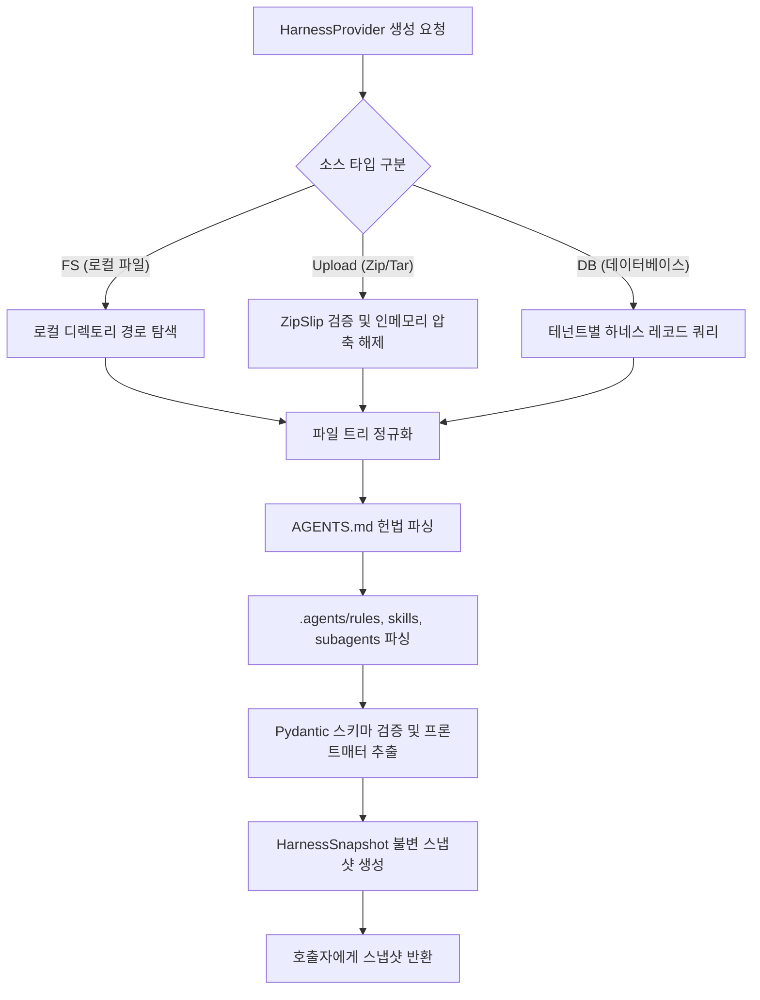
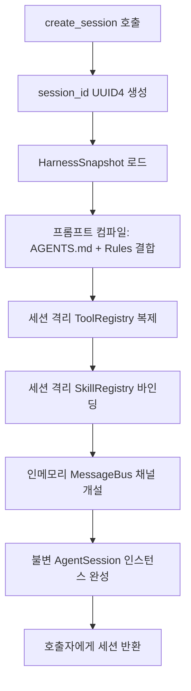
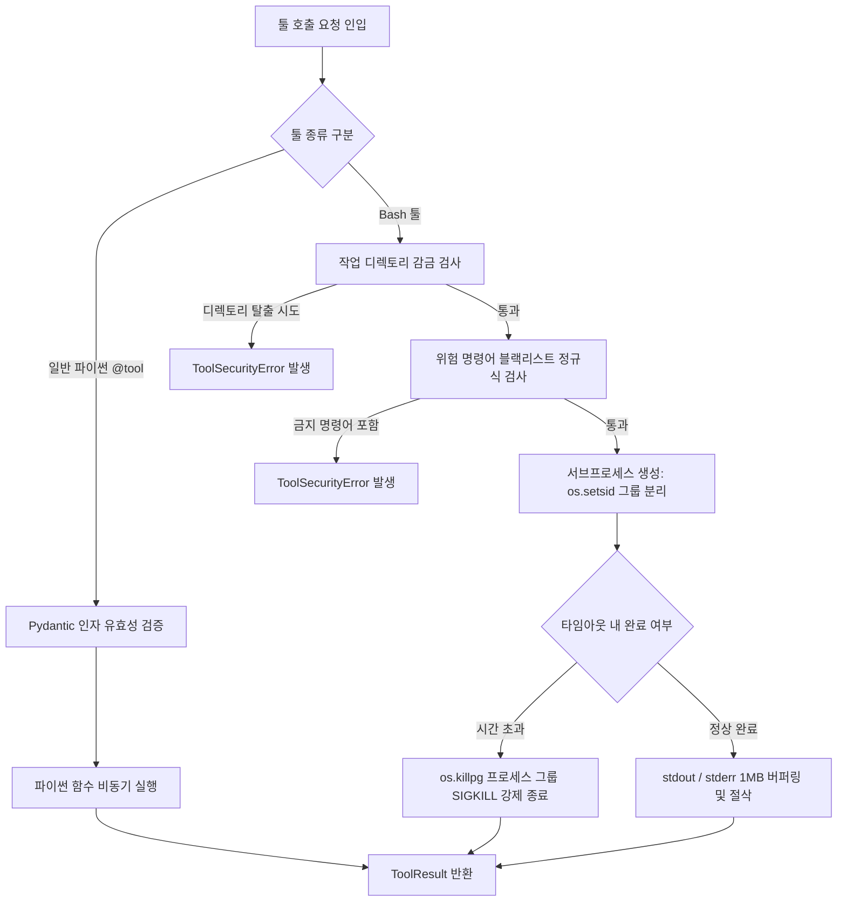
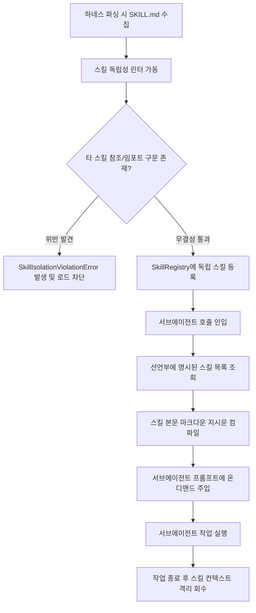

# [archon] 에이전트 하네스 및 오케스트레이션 상세기능정의서 (Modular FSD)

- **도메인**: 에이전트 하네스 거버넌스 및 분산 서브에이전트 오케스트레이션
- **작성자**: 기획 명세 작성가 (`spec-writer`)
- **문서 버전**: v1.1 (REQ 인수 기준 전면 바인딩 개정판)
- **상태**: Approved

---

## 단위 기능 상세 명세 (단위기능별 7대 상세 명세 완비)

---

### [FUNC-HARN-001] 다중 소스 하네스 프로바이더 및 파서 (Multi-Source Harness Provider & Parser)

#### 0. 대응 요구사항 및 인수 판정 기준 바인딩 (Requirements & Acceptance Criteria Binding)
- **대응 요구사항 ID**: `REQ-HARN-001` (다중 소스 하네스 프로바이더 및 파서)
- **정상 판정 기준 (Happy Path)**:
  - `HarnessProvider.from_fs(path)`, `HarnessProvider.from_upload(zip_bytes)`, `HarnessProvider.from_db(session, tenant_id)`를 통해 `AGENTS.md` 및 `.agents/` 디렉토리를 로드하여 불변 `HarnessSnapshot` DTO 생성에 성공해야 한다.
  - 마크다운 프론트매터 파싱 및 Pydantic 스키마 검증을 거쳐 `HarnessSnapshot` 완제본 생성까지의 소요 시간은 $\le 20\text{ms}$이어야 한다.
- **예외/실패 판정 기준 (Edge/Exception Path)**:
  - 대상 경로 또는 테넌트 하네스 부재 시 `HarnessNotFoundError` (`ERR_HARN_NOT_FOUND`)를 발생시켜야 한다.
  - 마크다운 프론트매터 YAML 문법 오류 또는 필수 필드 누락 시 파싱 라인 번호를 명시한 `HarnessParseError` (`ERR_HARN_PARSE_FAILED`)를 발생시켜야 한다.
  - 업로드 압축파일 내 `../` 등 상위 디렉토리 탈출(ZipSlip) 경로 탐지 시 즉시 `HarnessSecurityError` (`ERR_HARN_PATH_TRAVERSAL`)를 발생시키고 압축 해제를 전면 중단해야 한다.
- **단위 테스트 검증 조건 (TDD Target)**:
  - FS, Zip, DB 모의 픽스처 3종에 대한 로드 단위 테스트 $100\%$ 성공 검증.
  - 악의적인 상위 탈출 경로를 포함한 모의 Zip 파일 10종 주입 시 차단 검증.

#### 1. 기본 정보
- **기능명**: 다중 소스 하네스 프로바이더 (FS, Upload, DB) 및 정규화 파서
- **기능 ID**: `FUNC-HARN-001`
- **대응 요구사항 ID**: `REQ-HARN-001`
- **대상 모듈 코드**: `MOD-HARNESS-001`
- **우선순위**: Must Have
- **관련 액터 (Actor)**: AI 플랫폼 엔지니어, 워크플로우 개발자

#### 2. 사전 조건 (Pre-conditions)
1. 하네스 소스 유형(`FS`, `Upload`, `DB`)에 맞는 연결 정보(로컬 경로, 업로드 바이트 스트림, DB 연결 세션)가 제공된 상태.
2. 대상 소스 내에 `AGENTS.md` 또는 `.agents/` 디렉토리 구조(rules, skills, subagents)가 존재하거나 동적으로 구성 가능한 상태.

#### 3. 시스템 동작 흐름 및 플로우차트 (Step-by-Step Flow & Flowchart)

1. 호출자가 `HarnessProvider.from_fs(path)`, `HarnessProvider.from_upload(zip_bytes)`, 또는 `HarnessProvider.from_db(session, tenant_id)`를 호출합니다.
2. 프로바이더는 원본 저장소에서 파일 트리를 안전하게 인출합니다:
   - **FS**: 지정된 디렉토리 트리를 순회하며 마크다운 파일 수집.
   - **Upload**: 인메모리 압축 해제(`zipfile`) 시 상위 디렉토리 탈출(ZipSlip) 여부를 검사한 후 메모리 가상 파일시스템에 적재.
   - **DB**: 테넌트별 하네스 테이블에서 규칙, 스킬, 서브에이전트 레코드를 조회.
3. `HarnessParser`가 `AGENTS.md` 및 `.agents/` 내의 모든 마크다운 파일을 정규화 파싱합니다:
   - YAML 프론트매터(Frontmatter: `name`, `description`, `tools`, `skills` 등)를 Pydantic 스키마로 파싱 및 유효성 검증.
   - 마크다운 본문을 구조화된 지시문 블록으로 AST 파싱.
4. 파싱된 데이터를 불변(Immutable) 객체인 `HarnessSnapshot`으로 묶어 반환합니다.



#### 4. 데이터 항목 명세 (Data Elements - 8대 표준 컬럼)

| 항목명 | 입출력 구분 | 속성/타입 | 필수 여부 | 데이터 타입 / 제약 | 기본값 | 유효성 검증 규칙 (Validation) | 노출 및 오버라이드 조건 |
| :--- | :---: | :--- | :---: | :--- | :---: | :--- | :--- |
| `source_type` | 파라미터 | Enum | 필수 | Enum ('FS', 'UPLOAD', 'DB') | - | 지원하는 프로바이더 타입 매칭 | 항상 필수 |
| `base_path` | 파라미터 | Path | 선택 | String / 파일시스템 절대 경로 | `None` | `source_type='FS'`일 때 존재하는 디렉토리 | FS 소스 사용 시 필수 |
| `upload_bytes` | 파라미터 | Bytes | 선택 | `bytes` / Zip 또는 Tar 바이너리 | `None` | 최대 50MB 한도, ZipSlip 방어 검증 | UPLOAD 소스 사용 시 필수 |
| `db_session` | 파라미터 | Any | 선택 | DB 세션 인스턴스 | `None` | 유효한 SQLAlchemy 동기/비동기 세션 | DB 소스 사용 시 필수 |
| `tenant_id` | 파라미터 | String | 선택 | String / `^[a-zA-Z0-9_\-]+$` | `"default"` | 테넌트 격리 식별자 | DB 소스 사용 시 필수 |
| `rules` | 반환 속성 | Dict | 필수 | `Dict[str, RuleSpec]` | `{}` | 규칙 파일 식별자 매핑 | 항상 반환 |
| `skills` | 반환 속성 | Dict | 필수 | `Dict[str, SkillSpec]` | `{}` | 스킬 식별자 매핑 (독립성 검증 완료) | 항상 반환 |
| `subagents` | 반환 속성 | Dict | 필수 | `Dict[str, SubagentSpec]` | `{}` | 서브에이전트 역할 정의 매핑 | 항상 반환 |

#### 5. 비즈니스 규칙 (Business Rules)
- **BR-HARN-001-1**: `FS`, `Upload`, `DB` 프로바이더는 구체적 저장소 구현에 관계없이 동일한 `HarnessSnapshot` 규격을 반환해야 하며, 상위 엔진은 소스의 종류를 알 필요가 없어야 합니다.
- **BR-HARN-001-2**: `AGENTS.md`는 하네스 파이프라인의 최우선 헌법(Top-Level Constitution)으로 기능하며, 프론트매터와 본문 지시문이 반드시 최우선 순위로 파싱되어야 합니다.
- **BR-HARN-001-3**: 업로드 압축파일 해제 시 `../`를 포함하여 상위 디렉토리를 덮어쓰거나 탈출하려는 파일명(ZipSlip)이 감지되면 즉시 전체 처리를 중단하고 `HarnessSecurityError`를 발생시켜야 합니다.

#### 6. 예외 처리 및 엣지 케이스 (Edge Cases & Exception Handling)

| 발생 상황 (Edge Case Scenario) | 시스템 처리 방식 | 사용자 안내 메시지 / 예외 |
| :--- | :--- | :--- |
| Zip 파일 내 `../../etc/passwd` 등 악의적 경로 포함 시 | 압축 해제 전 경로 정규화(`os.path.commonpath`) 검사에서 즉시 차단 | `HarnessSecurityError: Malicious relative path detected in archive: ../../etc/passwd` |
| `AGENTS.md` 파일이 누락된 경우 | 기본 시스템 헌법(Default Constitution)을 폴백으로 적용하고 경고 로깅 | 경고 로그 후 `DefaultHarnessSpec` 적용 |
| DB 조회 시 대상 `tenant_id`의 하네스 레코드가 없는 경우 | 빈 하네스 스냅샷 대신 `TenantHarnessNotFoundError` 발생 | `TenantHarnessNotFoundError: No harness configuration found for tenant 'tenant_123'` |

#### 7. 비즈니스 에러 코드 매핑

| 비즈니스 에러 코드 | 발생 원인 | 예외 클래스 | 대응 가이드 |
| :--- | :--- | :--- | :--- |
| `ERR_HARN_NOT_FOUND` | 지정된 경로 또는 소스 부재 | `HarnessNotFoundError` | 하네스 경로 또는 테넌트 식별자 확인 |
| `ERR_HARN_PARSE_FAILED` | 마크다운 프론트매터 문법 오류 | `HarnessParseError` | YAML 프론트매터 문법 및 필수 필드 점검 |
| `ERR_HARN_PATH_TRAVERSAL` | ZipSlip 경로 탈출 공격 시도 감지 | `HarnessSecurityError` | 업로드 압축파일 내 상대 경로 제거 |
| `ERR_HARN_DB_FAILED` | DB 하네스 레코드 조회 실패 | `HarnessDatabaseError` | DB 연결 및 테이블 스키마 확인 |

---

### [FUNC-SESS-001] 세션 초기화 시 하네스 동적 바인딩 및 런타임 컴파일 (Dynamic Session Binding & Compiler)

#### 0. 대응 요구사항 및 인수 판정 기준 바인딩 (Requirements & Acceptance Criteria Binding)
- **대응 요구사항 ID**: `REQ-SESS-001` (세션 단위 하네스 동적 바인딩 및 런타임 컴파일), `REQ-MOD-001` (멀티 LLM 어댑터 및 구조화 출력)
- **정상 판정 기준 (Happy Path)**:
  - `archon.create_session(provider)` 호출 시 고유 세션 ID(`sess_<uuid4>`)를 발급하고, 하네스 스냅샷의 규칙과 도구를 바인딩한 불변 `AgentSession` 인스턴스를 반환해야 한다.
  - 컴파일된 시스템 프롬프트는 헌법(`AGENTS.md`), 전역 규칙(`.agents/rules`), 사용 가능 도구 명세를 순서대로 결합해야 한다.
  - 각 세션은 독립된 `ToolRegistry` 인스턴스를 소유하여 타 세션과 도구 등록 상태를 교차 공유하지 않아야 한다.
- **예외/실패 판정 기준 (Edge/Exception Path)**:
  - 세션 유휴/실행 시간 `session_timeout`(기본 600초) 초과 시 `SessionTimeoutError` (`ERR_SESS_TIMEOUT`)를 발생시키고 실행 중인 자식 태스크를 일괄 취소해야 한다.
  - 명시적으로 종료된 세션(`session.close()`)에 작업 실행을 요청할 경우 `SessionClosedError` (`ERR_SESS_CLOSED`)를 발생시켜야 한다.
- **단위 테스트 검증 조건 (TDD Target)**:
  - 동시 50개 세션 생성 시 상호 컨텍스트 및 도구 레지스트리 누설 $0\text{건}$ 검증.
  - 만료 타이머 인터럽트 발생 시 자식 프로세스 및 비동기 태스크 $100\%$ 정리 검증.

#### 1. 기본 정보
- **기능명**: 세션 초기화 시 하네스 동적 바인딩 및 불변 실행 컨텍스트 컴파일
- **기능 ID**: `FUNC-SESS-001`
- **대응 요구사항 ID**: `REQ-SESS-001`, `REQ-MOD-001`
- **대상 모듈 코드**: `MOD-SESSION-001`
- **우선순위**: Must Have
- **관련 액터 (Actor)**: AI 플랫폼 엔지니어, 세션 호출자

#### 2. 사전 조건 (Pre-conditions)
1. `HarnessSnapshot`이 정상 파싱되어 메모리에 준비된 상태.
2. 세션 실행에 사용할 LLM 모델 어댑터(`ModelAdapter`) 및 기본 설정이 준비된 상태.

#### 3. 시스템 동작 흐름 및 플로우차트 (Step-by-Step Flow & Flowchart)

1. 호출자가 `archon.create_session(harness=snapshot, model="claude-3-5-sonnet")`을 호출합니다.
2. 시스템은 고유한 `session_id`(`UUID4`)를 발급하고 독립된 세션 메모리 공간을 할당합니다.
3. **런타임 프롬프트 컴파일러**가 동작합니다:
   - `AGENTS.md`의 파이프라인 규칙과 글로벌 원칙을 기본 시스템 지시문으로 결합.
   - `.agents/rules`의 필수 규칙을 지시문에 주입.
   - 전역 도구 및 스킬 레지스트리를 세션 스코프로 복제 바인딩.
4. 세션 전용 인메모리 `MessageBus`를 초기화하여 에이전트 간 이벤트 발행/구독 채널을 개설합니다.
5. 컴파일된 실행 컨텍스트를 가진 불변의 `AgentSession` 인스턴스를 반환합니다.



#### 4. 데이터 항목 명세 (Data Elements - 8대 표준 컬럼)

| 항목명 | 입출력 구분 | 속성/타입 | 필수 여부 | 데이터 타입 / 제약 | 기본값 | 유효성 검증 규칙 (Validation) | 노출 및 오버라이드 조건 |
| :--- | :---: | :--- | :---: | :--- | :---: | :--- | :--- |
| `session_id` | 반환 속성 | Model Property | 필수 | String / UUID4 형식 | 자동 생성 | 유효한 UUIDv4 문자열 | 항상 제공 |
| `harness_snapshot` | 생성 인자 | Python Arg | 필수 | `HarnessSnapshot` 인스턴스 | - | 유효성 검증 완료된 스냅샷 | 항상 필수 |
| `system_prompt` | 세션 속성 | Model Property | 필수 | String (Markdown 텍스트) | 컴파일 결과 | 컴파일된 시스템 프롬프트 본문 | 세션 내부 불변 |
| `active_tools` | 세션 속성 | Model Property | 필수 | `Dict[str, ToolSpec]` | `{}` | 세션에 등록된 가용 툴 맵 | 항상 제공 |
| `active_skills` | 세션 속성 | Model Property | 필수 | `Dict[str, SkillSpec]` | `{}` | 세션에 등록된 가용 스킬 맵 | 항상 제공 |
| `session_timeout` | 설정 인자 | Config Key | 선택 | Float / 10.0 ~ 3600.0 (초) | `600.0` | $10.0 \le \text{timeout} \le 3600.0$ | 세션 생성 시 오버라이드 가능 |
| `max_tokens` | 설정 인자 | Config Key | 선택 | Integer / 1000 ~ 128000 | `8192` | $1000 \le \text{tokens} \le 128000$ | 세션 생성 시 오버라이드 가능 |
| `is_closed` | 상태 속성 | Model Property | 필수 | Boolean | `False` | 세션 종료 시 True | 항상 제공 |

#### 5. 비즈니스 규칙 (Business Rules)
- **BR-SESS-001-1**: 각 `AgentSession`은 상호 간에 프롬프트, 도구 레지스트리, 메시지 버스를 절대 공유하지 않으며 완벽히 메모리 격리되어야 합니다.
- **BR-SESS-001-2**: 시스템 프롬프트는 세션 생성 시점에 1회 컴파일되어 불변(Frozen)으로 캐싱되며, 세션 실행 도중 임의로 변조될 수 없습니다.
- **BR-SESS-001-3**: 세션이 명시적으로 `close()`되거나 타임아웃에 도달하면, 연결된 모든 활성 서브프로세스와 비동기 태스크를 즉시 취소(`cancel()`)하고 리소스를 반환해야 합니다.

#### 6. 예외 처리 및 엣지 케이스 (Edge Cases & Exception Handling)

| 발생 상황 (Edge Case Scenario) | 시스템 처리 방식 | 사용자 안내 메시지 / 예외 |
| :--- | :--- | :--- |
| 세션 타임아웃(기본 600초) 도달 시 | 진행 중인 코루틴에 `asyncio.CancelledError`를 주입하고 세션 상태를 `EXPIRED`로 전환 | `SessionTimeoutError: Session 'sess_123' timed out after 600.0s` |
| 이미 닫힌 세션(`is_closed=True`)에 작업 요청 시 | 즉시 `SessionClosedError`를 던져 비정상 작업 인입 차단 | `SessionClosedError: Cannot invoke agent on closed session 'sess_123'` |

#### 7. 비즈니스 에러 코드 매핑

| 비즈니스 에러 코드 | 발생 원인 | 예외 클래스 | 대응 가이드 |
| :--- | :--- | :--- | :--- |
| `ERR_SESS_CREATE_FAILED` | 세션 컴파일 또는 툴 바인딩 실패 | `SessionInitializationError` | 하네스 스냅샷의 프롬프트 및 도구 무결성 확인 |
| `ERR_SESS_TIMEOUT` | 세션 실행 제한 시간 초과 | `SessionTimeoutError` | session_timeout 설정 상향 또는 태스크 분할 |
| `ERR_SESS_CLOSED` | 종료된 세션에 대한 재호출 | `SessionClosedError` | 신규 세션 생성 후 재시도 |

---

### [FUNC-SUB-001] 모듈러 다중 서브에이전트 비동기 동시 호출 및 메시지 버스 (Subagent Orchestrator & Message Bus)

#### 0. 대응 요구사항 및 인수 판정 기준 바인딩 (Requirements & Acceptance Criteria Binding)
- **대응 요구사항 ID**: `REQ-SUB-001` (모듈러 다중 서브에이전트 비동기 동시 호출), `REQ-BUS-001` (반응형 이벤트 메시지 버스)
- **정상 판정 기준 (Happy Path)**:
  - 메인 에이전트가 `invoke_subagents(subagents=[...], tasks=[...])`를 호출하면 `asyncio.gather(..., return_exceptions=True)`로 복수 서브에이전트를 병렬 실행해야 한다.
  - 모든 서브에이전트가 정상 완료되면 각 에이전트의 출력, 소요시간, 상태코드를 취합한 `List[SubagentResult]`를 반환해야 한다.
  - 세션 내 `MessageBus`를 통해 발행-구독 방식으로 서브에이전트 간 비동기 메시지 교환 및 리액티브 웨이크업이 정상 작동해야 한다.
- **예외/실패 판정 기준 (Edge/Exception Path)**:
  - 호출 체인 깊이가 `max_subagent_depth`(기본 3단계)를 초과할 경우 `SubagentDepthExceededError` (`ERR_SUB_DEPTH_EXCEEDED`)를 발생시키며 즉시 실행을 거부해야 한다.
  - 부모-자식 호출 체인 내에서 동일한 서브에이전트가 다시 호출되는 순환 참조(`A -> B -> A`) 감지 시 `SubagentCycleDetectedError` (`ERR_SUB_CYCLE_DETECTED`)를 발생시켜야 한다.
  - 특정 서브에이전트가 `subagent_timeout`(기본 120초)을 초과한 경우 해당 서브에이전트만 `is_timeout=True`로 마킹되고 다른 병렬 에이전트의 성공 결과는 정상 보존되어야 한다 (Partial Failure Tolerance).
- **단위 테스트 검증 조건 (TDD Target)**:
  - 5개 서브에이전트 병렬 호출 1,000회 스트레스 테스트 시 데드락 없는 완료율 $\ge 99.5\%$.
  - 4단계 재귀 진입 차단 및 순환 호출 체인 100% 탐지 차단 검증.

#### 1. 기본 정보
- **기능명**: 모듈러 다중 서브에이전트 비동기 동시 호출 (`invoke_subagents`) 및 메시지 버스
- **기능 ID**: `FUNC-SUB-001`
- **대응 요구사항 ID**: `REQ-SUB-001`, `REQ-BUS-001`
- **대상 모듈 코드**: `MOD-ORCH-001`
- **우선순위**: Must Have
- **관련 액터 (Actor)**: 메인 에이전트, 파이프라인 오케스트레이터

#### 2. 사전 조건 (Pre-conditions)
1. 세션 내에 호출 대상 서브에이전트(예: `backend-tdd-engineer`, `frontend-tdd-engineer`)가 등록되어 있는 상태.
2. 부모-자식 호출 깊이가 최대 허용 깊이(`max_subagent_depth=3`) 이내인 상태.

#### 3. 시스템 동작 흐름 및 플로우차트 (Step-by-Step Flow & Flowchart)

1. 메인 에이전트가 `await session.invoke_subagents([req1, req2, ...])`를 호출합니다.
2. 오케스트레이터는 각 요청에 대해 다음 제어 검사를 수행합니다:
   - **호출 깊이 검사**: $current\_depth + 1 \le max\_depth$ 확인.
   - **순환 호출 검사**: 부모 호출 체인(`call_stack`)에 동일한 서브에이전트가 존재하는지 확인.
3. 제어 검사를 통과한 요청들을 `asyncio.gather(*tasks, return_exceptions=True)`로 동시 스폰합니다.
4. 각 서브에이전트는 독립된 작업 컨텍스트에서 실행되며, 진행 상황 및 산출물 알림을 세션의 `MessageBus`로 비동기 전송합니다.
5. 모든 서브에이전트의 실행이 완료되면, 개별 결과(`SubagentResult`)를 취합하여 호출자에게 리스트 형태로 반환합니다.

```mermaid
flowchart TD
    A[invoke_subagents 호출] --> B{호출 깊이 depth <= 3 검증}
    B -- 깊이 초과 --> C[SubagentDepthExceededError 발생]
    B -- 통과 --> D{순환 호출 Cycle 검증}
    D -- 순환 발견 --> E[SubagentCycleDetectedError 발생]
    D -- 통과 --> F[asyncio.gather 기반 비동기 병렬 스폰]
    F --> G1[서브에이전트 1 실행 (e.g. Backend TDD)]
    F --> G2[서브에이전트 2 실행 (e.g. Frontend TDD)]
    G1 --> H1[MessageBus 상태 이벤트 발행]
    G2 --> H2[MessageBus 상태 이벤트 발행]
    H1 --> I[결과 취합: return_exceptions=True]
    H2 --> I
    I --> J[SubagentResult 리스트 반환]
```

#### 4. 데이터 항목 명세 (Data Elements - 8대 표준 컬럼)

| 항목명 | 입출력 구분 | 속성/타입 | 필수 여부 | 데이터 타입 / 제약 | 기본값 | 유효성 검증 규칙 (Validation) | 노출 및 오버라이드 조건 |
| :--- | :---: | :--- | :---: | :--- | :---: | :--- | :--- |
| `subagent_name` | 요청 인자 | String | 필수 | String / 등록된 서브에이전트 식별자 | - | 영문 소문자 및 하이픈 | 항상 필수 |
| `task_prompt` | 요청 인자 | String | 필수 | String / 1자 이상 50,000자 이하 | - | 공백 제외 1자 이상 | 항상 필수 |
| `context_data` | 요청 인자 | Dict | 선택 | `Dict[str, Any]` | `{}` | JSON 직렬화 가능 딕셔너리 | 부모 데이터 전달 시 |
| `timeout_seconds` | 요청 인자 | Float | 선택 | Float / 1.0 ~ 600.0 (초) | `120.0` | $1.0 \le \text{timeout} \le 600.0$ | 개별 요청 타임아웃 지정 시 |
| `max_depth` | 시스템 설정 | Integer | 필수 | Integer / 1 ~ 5 | `3` | 최대 재귀 깊이 상한선 | 오케스트레이터 설정 |
| `is_success` | 반환 속성 | Boolean | 필수 | Boolean | `False` | 서브에이전트 정상 완료 여부 | 항상 반환 |
| `result_data` | 반환 속성 | Any | 선택 | String 또는 Dict | `None` | 서브에이전트 최종 출력 산출물 | 성공 시 반환 |
| `error_detail` | 반환 속성 | Optional | 선택 | `Optional[SubagentErrorDetail]` | `None` | 실패 시 예외 메시지 및 스택 | 실패 시 반환 |

#### 5. 비즈니스 규칙 (Business Rules)
- **BR-SUB-001-1**: `invoke_subagents`에 전달된 복수 서브에이전트는 완전히 병렬로 동시 실행되어야 하며, 전체 실행 시간은 $\max(T_1, T_2, \dots) + \text{오버헤드}$로 수렴해야 합니다.
- **BR-SUB-001-2**: 복수 서브에이전트 실행 중 일부가 예외나 타임아웃으로 실패하더라도, 시스템은 정상 완료된 타 서브에이전트의 산출물을 절대 유실하지 않고 성공/실패 결과를 분리 집계하여 반환합니다 (`Fault-Tolerant Partial Collection`).
- **BR-SUB-001-3**: 서브에이전트 호출 깊이는 기본 3단계(`max_depth=3`)로 엄격히 제한되며, 동일한 부모-자식 체인에서 순환 호출(A $\rightarrow$ B $\rightarrow$ A)이 발생하면 즉시 실행을 거부합니다.
- **BR-SUB-001-4**: 서브에이전트 간의 통신은 세션 단위 `MessageBus`를 통한 메시지 전달로만 이루어지며, 전역 변수나 인메모리 상태를 직접 조작하는 행위는 금지됩니다.

#### 6. 예외 처리 및 엣지 케이스 (Edge Cases & Exception Handling)

| 발생 상황 (Edge Case Scenario) | 시스템 처리 방식 | 사용자 안내 메시지 / 예외 |
| :--- | :--- | :--- |
| 한 서브에이전트가 타임아웃에 도달한 경우 | 해당 서브에이전트 태스크만 취소하고 결과 객체에 `is_success=False`, `error_code="ERR_SUB_TIMEOUT"` 기록 | `SubagentResult(is_success=False, error_detail=SubagentErrorDetail(code="ERR_SUB_TIMEOUT"))` |
| 재귀 호출 깊이 3단계 초과 시 | 자식 서브에이전트 생성을 즉시 차단하고 에러 반환 | `SubagentDepthExceededError: Maximum subagent depth of 3 exceeded` |
| 순환 호출(A -> B -> A) 감지 시 | 호출 스택 추적을 통해 감지 즉시 실행 차단 | `SubagentCycleDetectedError: Cycle detected in subagent invocation: main -> A -> B -> A` |

#### 7. 비즈니스 에러 코드 매핑

| 비즈니스 에러 코드 | 발생 원인 | 예외 클래스 | 대응 가이드 |
| :--- | :--- | :--- | :--- |
| `ERR_SUB_DEPTH_EXCEEDED` | 재귀 호출 깊이 한도 초과 | `SubagentDepthExceededError` | 워크플로우 계층 단순화 또는 max_depth 상향 |
| `ERR_SUB_CYCLE_DETECTED` | 서브에이전트 간 순환 호출 발생 | `SubagentCycleDetectedError` | 서브에이전트 호출 체인의 순환 종속성 제거 |
| `ERR_SUB_TIMEOUT` | 개별 서브에이전트 실행 시간 초과 | `SubagentTimeoutError` | 서브에이전트의 태스크 범위 분할 |
| `ERR_SUB_NOT_FOUND` | 미등록 서브에이전트 호출 시도 | `SubagentNotFoundError` | 하네스 내 서브에이전트 명칭 확인 |

---

### [FUNC-TOOL-001] 보안 Bash 및 툴 실행 엔진 (Secure Bash & Tool Execution Engine)

#### 0. 대응 요구사항 및 인수 판정 기준 바인딩 (Requirements & Acceptance Criteria Binding)
- **대응 요구사항 ID**: `REQ-TOOL-001` (보안 Bash 및 툴 실행 엔진)
- **정상 판정 기준 (Happy Path)**:
  - `@tool` 데코레이터가 적용된 임의의 파이썬 함수를 `ToolRegistry`에 등록하고, OpenAPI/JSON Schema 규격 메타데이터를 자동 생성해야 한다.
  - 내장 Bash 도구 실행 시 허용된 작업 디렉토리(`cwd`) 내에서 명령(`pytest`, `git status` 등)을 실행하고 종료 코드, 표준 출력, 표준 에러를 반환해야 한다.
- **예외/실패 판정 기준 (Edge/Exception Path)**:
  - 실행 커맨드에 위험 명령어 블랙리스트(`rm -rf /`, `sudo`, `mkfs`, 포크 폭탄 등) 정규식 매칭 시 즉시 `DangerousCommandError` (`ERR_TOOL_COMMAND_BLOCKED`)를 발생시키고 실행을 거부해야 한다.
  - `cd /` 또는 `../../` 등을 통해 작업 디렉토리 상위로 탈출을 시도하는 경로는 `PathTraversalError` (`ERR_TOOL_DIRECTORY_ESCAPE`)로 차단해야 한다.
  - 커맨드 실행 시간이 `command_timeout`(기본 60초)을 초과할 경우 `os.killpg`를 호출하여 하위 프로세스 그룹 전체를 즉시 강제 종료하고 `CommandTimeoutError` (`ERR_TOOL_TIMEOUT`)를 반환해야 한다.
  - 출력 버퍼가 1MB를 초과하면 버퍼 오버플로우 방지를 위해 앞부분 1MB만 보존하고 나머지는 절삭(Truncate)해야 한다.
- **단위 테스트 검증 조건 (TDD Target)**:
  - 위험 명령어 50종 모의 주입 시 차단율 $100\%$ (완전 차단).
  - 60초 초과 슬립 명령 강제 종료 후 좀비 프로세스 잔존 $0\text{건}$.

#### 1. 기본 정보
- **기능명**: 보안 Bash 및 툴 실행 엔진 (`ToolRegistry`, `@tool`)
- **기능 ID**: `FUNC-TOOL-001`
- **대응 요구사항 ID**: `REQ-TOOL-001`
- **대상 모듈 코드**: `MOD-TOOL-001`
- **우선순위**: Must Have
- **관련 액터 (Actor)**: 메인 에이전트, 서브에이전트

#### 2. 사전 조건 (Pre-conditions)
1. 실행 대상 툴이 세션 `ToolRegistry`에 등록되어 있거나 내장 `BashTool`이 활성화된 상태.
2. 툴 실행을 위한 작업 디렉토리(`working_directory`)가 유효하게 설정된 상태.

#### 3. 시스템 동작 흐름 및 플로우차트 (Step-by-Step Flow & Flowchart)

1. 에이전트가 툴 호출 요청(예: `tool="bash", command="pytest tests/"`)을 전달합니다.
2. 시스템은 파이썬 함수 기반 도구인 경우 인자 유효성을 Pydantic 모델로 1차 검증합니다.
3. `BashTool` 실행 요청인 경우 **다층 보안 샌드박스 검증**을 수행합니다:
   - **디렉토리 감금(Jail) 검사**: 대상 경로가 허용된 `working_directory` 하위에 속하는지 검증.
   - **위험 명령어 블랙리스트 정규식 검사**: `rm -rf /`, `sudo`, `mkfs`, `dd`, `shutdown`, 포크 폭탄(`:(){ :|:& };:`) 등 파괴적 패턴 매칭.
4. 검증 통과 시 `asyncio.create_subprocess_shell`로 서브프로세스를 생성하되, 프로세스 그룹 분리(`preexec_fn=os.setsid`)를 적용합니다.
5. 설정된 타임아웃(`timeout_seconds`) 동안 비동기 대기하며, 시간 초과 시 `os.killpg`로 자식 프로세스 트리를 강제 종료(SIGKILL)합니다.
6. 표준 출력(`stdout`)과 표준 에러(`stderr`)를 수집하고, 출력 크기가 1MB를 초과하면 앞부분 1MB만 버퍼링 후 절삭(Truncate) 처리하여 `ToolResult`로 반환합니다.



#### 4. 데이터 항목 명세 (Data Elements - 8대 표준 컬럼)

| 항목명 | 입출력 구분 | 속성/타입 | 필수 여부 | 데이터 타입 / 제약 | 기본값 | 유효성 검증 규칙 (Validation) | 노출 및 오버라이드 조건 |
| :--- | :---: | :--- | :---: | :--- | :---: | :--- | :--- |
| `command` | 입력 인자 | String | 필수 | String / 단일 셸 명령어 문자열 | - | 공백 제외 1자 이상, 블랙리스트 불포함 | Bash 실행 시 필수 |
| `working_directory` | 설정/인자 | Path | 필수 | String / 작업 디렉토리 절대 경로 | 현재 작업 경로 | 존재하는 유효 디렉토리 | 항상 필수 |
| `timeout_seconds` | 설정/인자 | Float | 선택 | Float / 1.0 ~ 300.0 (초) | `30.0` | $1.0 \le \text{timeout} \le 300.0$ | 항상 오버라이드 가능 |
| `max_output_bytes` | 설정 인자 | Integer | 선택 | Integer / 1,024 ~ 5,242,880 | `1,048,576` (1MB) | $1\text{KB} \le \text{bytes} \le 5\text{MB}$ | 시스템 설정 |
| `exit_code` | 반환 속성 | Integer | 필수 | Integer | `0` | 프로세스 종료 반환 코드 (-1: 강제종료) | 항상 반환 |
| `stdout` | 반환 속성 | String | 필수 | String (UTF-8 텍스트) | `""` | 표준 출력 스트림 | 항상 반환 |
| `stderr` | 반환 속성 | String | 필수 | String (UTF-8 텍스트) | `""` | 표준 에러 스트림 | 항상 반환 |
| `is_truncated` | 반환 속성 | Boolean | 필수 | Boolean | `False` | 1MB 초과 절삭 발생 시 True | 항상 반환 |

#### 5. 비즈니스 규칙 (Business Rules)
- **BR-TOOL-001-1**: 파이썬 일반 함수는 `@tool` 데코레이터를 적용하면 타입 힌트와 Docstring을 기반으로 JSON Schema가 자동 추출되어 LLM에 전달되어야 합니다.
- **BR-TOOL-001-2**: Bash 도구는 지정된 `working_directory` 외부로의 경로 탈출(`cd ../../../` 등)을 철저히 감시하며, 위반 시 프로세스를 생성하지 않고 `ToolSecurityError`를 발생시켜야 합니다.
- **BR-TOOL-001-3**: 파괴적인 명령어 패턴(`rm -rf /`, `mkfs`, `sudo`, `dd if=/dev/zero`, `:(){ :|:& };:`)이 포함된 명령어는 실행 전 정규식 검사에서 100% 차단되어야 합니다.
- **BR-TOOL-001-4**: 타임아웃 발생 시 메인 프로세스뿐만 아니라 파생된 모든 자식 프로세스 트리를 `os.killpg`로 완전 정리하여 좀비 프로세스 발생을 방지합니다.

#### 6. 예외 처리 및 엣지 케이스 (Edge Cases & Exception Handling)

| 발생 상황 (Edge Case Scenario) | 시스템 처리 방식 | 사용자 안내 메시지 / 예외 |
| :--- | :--- | :--- |
| `rm -rf /` 등 파괴적 명령어 실행 시도 시 | 정규식 사전 검증에서 즉시 차단하고 보안 위반 기록 | `ToolSecurityError: Command blocked by security policy: pattern 'rm -rf' is prohibited` |
| 명령어 출력이 100MB 이상 쏟아지는 경우 | 1MB(1,048,576 바이트)까지만 읽고 스트림을 닫은 뒤 `is_truncated=True` 설정 | 정상 반환하되 `[TRUNCATED: Output exceeded 1MB]` 추가 |
| 무한 루프(`while true; do ...`) 스크립트 실행 시 | `timeout_seconds`(30s) 경과 즉시 SIGKILL 발행 후 `exit_code=-1` 반환 | `ToolResult(exit_code=-1, stderr="Command timed out after 30.0s and was killed")` |

#### 7. 비즈니스 에러 코드 매핑

| 비즈니스 에러 코드 | 발생 원인 | 예외 클래스 | 대응 가이드 |
| :--- | :--- | :--- | :--- |
| `ERR_TOOL_COMMAND_BLOCKED` | 보안 블랙리스트 명령어 감지 | `ToolSecurityError` | 명령어 패턴 확인 및 안전한 명령어로 대체 |
| `ERR_TOOL_DIRECTORY_ESCAPE` | 작업 디렉토리 감금 범위 탈출 시도 | `ToolSecurityError` | working_directory 내부 상대 경로 사용 |
| `ERR_TOOL_TIMEOUT` | 도구 실행 제한 시간 초과 | `ToolTimeoutError` | timeout_seconds 설정 상향 조정 |
| `ERR_TOOL_NOT_FOUND` | 미등록 툴 호출 시도 | `ToolNotFoundError` | ToolRegistry 등록 여부 점검 |

---

### [FUNC-SKIL-001] 독립 스킬 온디맨드 프로그레시브 주입 (Skill Isolation & Progressive Disclosure)

#### 0. 대응 요구사항 및 인수 판정 기준 바인딩 (Requirements & Acceptance Criteria Binding)
- **대응 요구사항 ID**: `REQ-SKIL-001` (독립 스킬 온디맨드 프로그레시브 주입)
- **정상 판정 기준 (Happy Path)**:
  - 서브에이전트 매니페스트에 선언된 스킬 목록(`skills: [git, humanizer]`)에 해당하는 스킬 마크다운 파일만 컨텍스트에 점진적으로 주입해야 한다.
  - 주입된 스킬 가이드는 불변 캐시되어 세션 내 동일 스킬 재요청 시 파싱 지연 없이 즉시 제공되어야 한다.
- **예외/실패 판정 기준 (Edge/Exception Path)**:
  - 스킬 파일 본문 내에서 타 스킬을 참조하거나 임포트하는 행위(`skill:`, `import`, `@skill` 등) 감지 시 정적 린터가 `SkillIsolationViolationError` (`ERR_SKIL_MUTUAL_REF`)를 발생시키며 세션 컴파일을 전면 거부해야 한다.
  - 선언부에 기재된 스킬이 `.agents/skills`에 존재하지 않을 경우 `SkillNotFoundError` (`ERR_SKIL_NOT_FOUND`)를 발생시켜야 한다.
- **단위 테스트 검증 조건 (TDD Target)**:
  - 스킬 간 상호 참조를 포함하는 모의 마크다운 파일 10종 대상 정적 린트 차단율 $100\%$ (Zero Tolerance).
  - 불필요한 미사용 스킬의 프롬프트 컨텍스트 유입 $0\text{건}$.

#### 1. 기본 정보
- **기능명**: 독립 스킬(Skill Isolation) 온디맨드 프로그레시브 주입 및 무결성 검증
- **기능 ID**: `FUNC-SKIL-001`
- **대응 요구사항 ID**: `REQ-SKIL-001`
- **대상 모듈 코드**: `MOD-SKILL-001`
- **우선순위**: Must Have
- **관련 액터 (Actor)**: 하네스 린터, 서브에이전트 인젝터

#### 2. 사전 조건 (Pre-conditions)
1. `.agents/skills/` 디렉토리에 각 스킬 정의 파일(`SKILL.md`)이 준비된 상태.
2. 서브에이전트 명세에 해당 작업에 필요한 스킬 식별자 목록(`skills: ["humanizer", "tdd-cycle"]`)이 선언된 상태.

#### 3. 시스템 동작 흐름 및 플로우차트 (Step-by-Step Flow & Flowchart)

1. 하네스 파싱 시 **스킬 정적 린터(Skill Isolation Linter)**가 동작합니다:
   - 각 `SKILL.md` 본문과 메타데이터를 정적 분석하여 다른 스킬을 임포트, 인클루드, 참조하는 구문이 있는지 검사합니다.
   - 타 스킬 의존성이 감지되면 즉시 파싱을 거부하고 `SkillIsolationViolationError`를 발생시킵니다.
2. 서브에이전트 실행 시점에 **스킬 온디맨드 인젝터**가 가동됩니다:
   - 해당 서브에이전트의 선언부에 명시된 스킬 목록만 `SkillRegistry`에서 조회합니다.
   - 스킬 본문을 정규화된 마크다운 지시문 블록으로 변환하여 서브에이전트의 시스템 프롬프트 하단에 점진적으로 주입(Progressive Disclosure)합니다.
3. 서브에이전트 실행이 끝나면 주입된 스킬은 해당 서브에이전트 컨텍스트와 함께 정리되며, 부모나 타 서브에이전트로 오염 전파되지 않습니다.



#### 4. 데이터 항목 명세 (Data Elements - 8대 표준 컬럼)

| 항목명 | 입출력 구분 | 속성/타입 | 필수 여부 | 데이터 타입 / 제약 | 기본값 | 유효성 검증 규칙 (Validation) | 노출 및 오버라이드 조건 |
| :--- | :---: | :--- | :---: | :--- | :---: | :--- | :--- |
| `skill_name` | 메타데이터 | String | 필수 | String / `^[a-z0-9_\-]+$` | - | 영문 소문자, 숫자, 하이픈 | 항상 필수 |
| `description` | 메타데이터 | String | 필수 | String / 10자 이상 500자 이하 | - | 공백 제외 10자 이상 | 항상 필수 |
| `content` | 스킬 본문 | String | 필수 | String / 마크다운 텍스트 | - | 타 스킬 참조 구문 불포함 | 항상 필수 |
| `is_isolated` | 상태 플래그 | Boolean | 필수 | Boolean | `True` | 린터 통과 시 True 고정 | 항상 True |
| `target_agent` | 주입 파라미터 | String | 필수 | String / 대상 서브에이전트 이름 | - | 유효한 서브에이전트 ID | 주입 시 필수 |
| `prompt_tokens` | 관측 지표 | Integer | 필수 | Integer | `0` | 주입된 스킬 텍스트의 토큰 수 | 주입 후 기록 |
| `injection_mode` | 설정 항목 | Enum | 선택 | Enum ('ON_DEMAND', 'STATIC') | `'ON_DEMAND'` | 온디맨드 점진적 주입 | 항상 오버라이드 가능 |
| `tags` | 메타데이터 | List | 선택 | List[String] | `[]` | 문자열 태그 목록 | 검색 및 분류 시 |

#### 5. 비즈니스 규칙 (Business Rules)
- **BR-SKIL-001-1**: **스킬 간 상호 참조 절대 금지 원칙 (Skill-to-Skill Reference Prohibition)**:
  - 모든 스킬은 완전히 독립적(Atomic & Orthogonal)이어야 합니다.
  - 스킬 파일 내부에서 다른 스킬을 호출, 임포트, 인클루드하거나 의존성을 명시하는 일체의 행위는 결합도 오염 방지를 위해 엄격히 금지됩니다.
- **BR-SKIL-001-2**: 스킬의 조합과 적용은 오직 서브에이전트 명세 파일(`.agents/subagents/*.md`)이나 오케스트레이터의 동적 인젝터를 통해서만 수행됩니다.
- **BR-SKIL-001-3**: 온디맨드 프로그레시브 주입(Progressive Disclosure)을 의무화하여, 모든 스킬을 처음부터 프롬프트에 쏟아붓지 않고 각 에이전트가 선언한 스킬만 동적으로 주입함으로써 컨텍스트 윈도우 낭비와 프롬프트 간섭을 방지합니다.

#### 6. 예외 처리 및 엣지 케이스 (Edge Cases & Exception Handling)

| 발생 상황 (Edge Case Scenario) | 시스템 처리 방식 | 사용자 안내 메시지 / 예외 |
| :--- | :--- | :--- |
| `SKILL.md` 내부에서 타 스킬 참조 감지 시 | 린터가 위반 라인과 참조 스킬명을 명시하고 즉시 로드 실패 처리 | `SkillIsolationViolationError: Skill 'tdd-cycle' violates isolation principle by referencing skill 'humanizer' at line 14` |
| 서브에이전트가 존재하지 않는 스킬을 요구한 경우 | 세션 실행 전 검증 단계에서 즉시 미등록 스킬 에러 발생 | `SkillNotFoundError: Skill 'non-existent-skill' declared in subagent 'backend-tdd' does not exist in registry` |

#### 7. 비즈니스 에러 코드 매핑

| 비즈니스 에러 코드 | 발생 원인 | 예외 클래스 | 대응 가이드 |
| :--- | :--- | :--- | :--- |
| `ERR_SKIL_MUTUAL_REF` | 스킬 간 상호 참조 규칙 위반 | `SkillIsolationViolationError` | 스킬 내부의 타 스킬 참조 제거 및 서브에이전트 단위 분리 |
| `ERR_SKIL_NOT_FOUND` | 미등록 스킬 선언 | `SkillNotFoundError` | .agents/skills/ 경로 내 스킬 정의 추가 |
| `ERR_SKIL_SYNTAX_INVALID`| 스킬 파일 프론트매터 문법 오류 | `SkillSyntaxError` | SKILL.md 상단 YAML 프론트매터 점검 |
