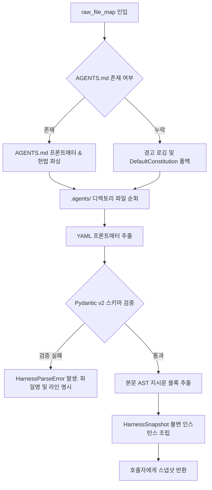

# [archon] 하네스 시스템 상세기능정의서 (Harness System Modular FSD)

- **도메인**: 하네스 거버넌스 및 다중 소스 로더/파서 시스템
- **작성자**: 기획 명세 작성가 (`spec-writer`)
- **문서 버전**: v1.0
- **상태**: Approved

---

## 단위 기능 상세 명세 (단위기능별 7대 상세 명세 완비)

---

### [FUNC-HARN-001] 다중 소스 하네스 프로바이더 및 로더 (Multi-Source Harness Provider & Loader)

#### 0. 대응 요구사항 및 인수 판정 기준 바인딩 (Requirements & Acceptance Criteria Binding)
- **대응 요구사항 ID**: `REQ-HARN-001` (다중 소스 하네스 프로바이더 및 파서)
- **정상 판정 기준 (Happy Path)**:
  - `HarnessProvider.from_fs(path)`, `HarnessProvider.from_upload(zip_bytes)`, `HarnessProvider.from_db(session, tenant_id)` 팩토리를 통해 로컬 디렉토리, 인메모리 압축 바이트, DB 레코드로부터 원시 파일 트리를 안전하게 인출해야 한다.
  - 파일 인출 및 인메모리 트리 구성에 소요되는 지연 시간은 $\le 10\text{ms}$이어야 한다.
- **예외/실패 판정 기준 (Edge/Exception Path)**:
  - 대상 로컬 디렉토리 또는 DB 테넌트 레코드가 존재하지 않을 경우 `HarnessNotFoundError` (`ERR_HARN_NOT_FOUND`)를 발생시켜야 한다.
  - 업로드된 압축 바이트 해제 시 `../` 등 상위 디렉토리 탈출(ZipSlip) 경로가 발견되면 파일 쓰기를 즉시 거부하고 `HarnessSecurityError` (`ERR_HARN_PATH_TRAVERSAL`)를 발생시켜야 한다.
  - 압축 파일 크기가 50MB를 초과하면 `HarnessPayloadTooLargeError` (`ERR_HARN_PAYLOAD_TOO_LARGE`)를 발생시켜야 한다.
- **단위 테스트 검증 조건 (TDD Target)**:
  - FS, Upload(Zip), DB 소스 3종에 대한 모의 인출 테스트 통과율 $100\%$.
  - 악의적인 상대 경로를 포함한 모의 Zip 파일 10종 주입 시 ZipSlip 차단율 $100\%$.

#### 1. 기본 정보
- **기능명**: 다중 소스 하네스 프로바이더 (FS, Upload, DB) 및 로더
- **기능 ID**: `FUNC-HARN-001`
- **대응 요구사항 ID**: `REQ-HARN-001`
- **대상 모듈 코드**: `MOD-HARNESS-001`
- **우선순위**: Must Have
- **관련 액터 (Actor)**: AI 플랫폼 엔지니어, 세션 오케스트레이터

#### 2. 사전 조건 (Pre-conditions)
1. 하네스 소스 유형(`FS`, `UPLOAD`, `DB`)에 맞는 파라미터가 유효하게 전달된 상태.
2. 로컬 디렉토리 읽기 권한, 유효한 바이트 스트림, 또는 SQLAlchemy 활성 DB 세션이 확보된 상태.

#### 3. 사용자 인터랙션 및 시스템 동작 흐름과 플로우차트 (Step-by-Step Flow & Flowchart)

1. 호출자가 `HarnessProvider`의 정적 팩토리 메서드를 호출합니다:
   - `HarnessProvider.from_fs(path)`
   - `HarnessProvider.from_upload(zip_bytes)`
   - `HarnessProvider.from_db(db_session, tenant_id)`
2. 프로바이더는 소스 유형별로 파일 트리를 추출합니다:
   - **FS**: 로컬 파일시스템의 `path` 하위 트리를 탐색하여 `AGENTS.md` 및 `.agents/` 내 파일 수집.
   - **UPLOAD**: `zipfile.ZipFile`을 메모리에서 검사하며, 모든 엔트리의 `os.path.commonpath`를 검증하여 ZipSlip 공격을 방어한 뒤 인메모리 가상 파일시스템에 적재.
   - **DB**: 전달된 테넌트 식별자로 하네스 규칙/스킬/서브에이전트 레코드를 쿼리.
3. 추출된 원시 텍스트 파일 맵(`Dict[str, str]`)을 생성하여 후속 `HarnessParser`(`FUNC-HARN-002`)로 전달합니다.

```mermaid
flowchart TD
    A[HarnessProvider 생성 요청] --> B{소스 유형 판별}
    B -- FS (로컬 파일시스템) --> C[로컬 디렉토리 경로 탐색 및 파일 수집]
    B -- UPLOAD (Zip 바이트) --> D[인메모리 압축 해제 및 ZipSlip 검증]
    B -- DB (데이터베이스) --> E[테넌트 하네스 테이블 SQL 쿼리]
    D -- ZipSlip 경로 발견 --> F[HarnessSecurityError 발생 및 즉시 중단]
    D -- 안전 검증 통과 --> G[가상 파일 트리 생성]
    C --> G
    E --> G
    G --> H[정규화된 파일 맵 반환: Dict[str, str]]
```

#### 4. 데이터 항목 명세 (Data Elements - 8대 표준 컬럼)

| 항목명 | 입출력 구분 | UI/호출 타입 | 필수 여부 | 데이터 타입 / 제약 | 기본값 | 유효성 검증 규칙 (Validation) | 노출/수정 조건 |
| :--- | :---: | :--- | :---: | :--- | :---: | :--- | :--- |
| `source_type` | 파라미터 | Enum | 필수 | Enum ('FS', 'UPLOAD', 'DB') | - | 지원하는 프로바이더 타입 매칭 | 항상 필수 |
| `base_path` | 파라미터 | Path String | 선택 | String / 파일시스템 절대 경로 | `None` | 존재하는 디렉토리 경로 검증 | `source_type='FS'`일 때 필수 |
| `upload_bytes` | 파라미터 | Bytes | 선택 | `bytes` / Zip 바이너리 | `None` | 바이트 크기 $\le 52,428,800$ (50MB) | `source_type='UPLOAD'`일 때 필수 |
| `db_session` | 파라미터 | Any Session | 선택 | SQLAlchemy Session 인스턴스 | `None` | 활성 세션 상태 검증 | `source_type='DB'`일 때 필수 |
| `tenant_id` | 파라미터 | String | 선택 | String / `^[a-zA-Z0-9_\-]+$` | `"default"` | 영문, 숫자, 밑줄, 하이픈 | `source_type='DB'`일 때 필수 |
| `raw_file_map` | 반환 속성 | Dict | 필수 | `Dict[str, str]` | `{}` | 경로-문자열 텍스트 매핑 | 항상 반환 |
| `load_duration_ms` | 반환 속성 | Float | 필수 | Float ($t \ge 0.0$) | `0.0` | 소요 시간 밀리초 | 항상 반환 |
| `file_count` | 반환 속성 | Integer | 필수 | Integer ($n \ge 0$) | `0` | 인출된 마크다운 파일 총 개수 | 항상 반환 |

#### 5. 비즈니스 규칙 (Business Rules)
- **BR-HARN-001-1**: 저장소 소스 구현체는 상위 런타임에 완전히 은닉되어야 하며, 상위 엔진은 `HarnessProvider` 인터페이스만을 통해 파일 맵을 공급받아야 합니다.
- **BR-HARN-001-2**: 업로드 압축 파일 검증 시 `os.path.isabs(p)` 또는 정규화 경로가 임시 타깃 디렉토리를 벗어나는 상대 경로(`../`)는 파일 쓰기 전에 전수 차단되어야 합니다.
- **BR-HARN-001-3**: DB 소스 조회 시 동일 `tenant_id`에 대한 중복 활성 하네스가 존재하는 경우 최신 생성 타임스탬프(`created_at`) 레코드를 우선 로드합니다.

#### 6. 예외 처리 및 엣지 케이스 (Edge Cases & Exception Handling)

| 발생 상황 (Edge Case Scenario) | 시스템 처리 방식 | 사용자 안내 메시지 / 예외 |
| :--- | :--- | :--- |
| Zip 파일 내 `../../etc/passwd` 등 악의적 경로 포함 시 | 압축 해제 루프 진입 즉시 차단 및 바이트 스트림 파기 | `HarnessSecurityError: Malicious relative path detected in archive: ../../etc/passwd` |
| DB 조회 시 대상 `tenant_id`의 하네스 레코드가 없는 경우 | 빈 딕셔너리 반환 대신 명시적 에러 발생 | `HarnessNotFoundError: No harness configuration found for tenant 'tenant_123'` |
| 압축 파일이 손상되어 `zipfile.BadZipFile` 발생 시 | 손상 위치 명시 후 표준 에러로 변환 | `HarnessParseError: Uploaded file is not a valid zip archive` |

#### 7. 비즈니스 에러 코드 매핑

| 비즈니스 에러 코드 | 발생 원인 | 예외 클래스 | 대응 가이드 |
| :--- | :--- | :--- | :--- |
| `ERR_HARN_NOT_FOUND` | 지정된 경로 또는 테넌트 하네스 부재 | `HarnessNotFoundError` | 경로 존재 여부 및 DB 테넌트 식별자 확인 |
| `ERR_HARN_PATH_TRAVERSAL` | ZipSlip 파일시스템 탈출 시도 감지 | `HarnessSecurityError` | 압축 파일 내부 상대 경로 확인 및 제거 |
| `ERR_HARN_PAYLOAD_TOO_LARGE` | 업로드 압축 바이트 크기 초과 (50MB) | `HarnessPayloadTooLargeError` | 파일 크기 압축 및 불필요한 바이너리 제거 |
| `ERR_HARN_DB_QUERY_FAILED` | DB 연결 단절 또는 쿼리 실패 | `HarnessDatabaseError` | DB 연결 풀 및 세션 상태 점검 |

---

### [FUNC-HARN-002] 선언적 하네스 파서 및 YAML 프론트매터 스키마 검증 (Declarative Parser & Frontmatter Validator)

#### 0. 대응 요구사항 및 인수 판정 기준 바인딩 (Requirements & Acceptance Criteria Binding)
- **대응 요구사항 ID**: `REQ-HARN-001` (다중 소스 하네스 프로바이더 및 파서)
- **정상 판정 기준 (Happy Path)**:
  - 수집된 원시 파일 맵에서 `AGENTS.md` 및 `.agents/rules`, `.agents/skills`, `.agents/subagents`의 마크다운 파일을 정규화 AST 파싱하고, 상단 YAML 프론트매터를 Pydantic v2 스키마로 검증하여 불변 `HarnessSnapshot` DTO를 생성해야 한다.
  - 파서 동작 및 스냅샷 완제본 생성 소요 시간은 $\le 10\text{ms}$이어야 한다.
- **예외/실패 판정 기준 (Edge/Exception Path)**:
  - YAML 프론트매터의 문법 오류 또는 Pydantic 스키마 검증 실패 시 오류 파일명과 라인 번호를 포함한 `HarnessParseError` (`ERR_HARN_PARSE_FAILED`)를 발생시켜야 한다.
  - 필수 헌법 파일인 `AGENTS.md`가 누락된 경우 `DefaultHarnessSpec`으로 안전하게 폴백하고 경고 로그를 기록해야 한다.
- **단위 테스트 검증 조건 (TDD Target)**:
  - 정상 하네스 마크다운 20종 파싱 성공률 $100\%$.
  - 프론트매터 문법 불량 파일 5종 모의 주입 시 라인 번호 포함 에러 검출율 $100\%$.

#### 1. 기본 정보
- **기능명**: 선언적 하네스 파서 및 YAML 프론트매터 스키마 검증
- **기능 ID**: `FUNC-HARN-002`
- **대응 요구사항 ID**: `REQ-HARN-001`
- **대상 모듈 코드**: `MOD-HARNESS-002`
- **우선순위**: Must Have
- **관련 액터 (Actor)**: AI 플랫폼 엔지니어, 세션 오케스트레이터

#### 2. 사전 조건 (Pre-conditions)
1. `FUNC-HARN-001`에 의해 수집된 정규화 파일 맵(`Dict[str, str]`)이 전달된 상태.
2. YAML 파서(`pyyaml`) 및 Pydantic v2 스키마 정의(`HarnessSnapshot`, `RuleSpec`, `SkillSpec`, `SubagentSpec`)가 로드된 상태.

#### 3. 사용자 인터랙션 및 시스템 동작 흐름과 플로우차트 (Step-by-Step Flow & Flowchart)

1. `HarnessParser.parse(raw_file_map)`를 호출합니다.
2. 파서는 최우선으로 `AGENTS.md`를 분리하여 상단 프론트매터와 마크다운 본문을 파싱합니다:
   - `---`로 둘러싸인 YAML 블록 추출 및 `AgentConstitutionSpec` 검증.
   - 마크다운 본문을 전역 헌법 텍스트로 보존.
3. `.agents/rules/*.md`, `.agents/skills/*/SKILL.md`, `.agents/subagents/*.md` 파일을 분류하여 순차 파싱합니다.
4. 각 파일의 프론트매터를 해당 Pydantic 모델(`RuleSpec`, `SkillSpec`, `SubagentSpec`)로 엄격 검증합니다.
5. 파싱 완료된 명세들을 취합하여 불변 `HarnessSnapshot` DTO 인스턴스를 생성하고 반환합니다.



#### 4. 데이터 항목 명세 (Data Elements - 8대 표준 컬럼)

| 항목명 | 입출력 구분 | UI/호출 타입 | 필수 여부 | 데이터 타입 / 제약 | 기본값 | 유효성 검증 규칙 (Validation) | 노출/수정 조건 |
| :--- | :---: | :--- | :---: | :--- | :---: | :--- | :--- |
| `raw_file_map` | 입력 인자 | Dict | 필수 | `Dict[str, str]` | - | 경로 및 텍스트 본문 매핑 | 항상 필수 |
| `constitution` | 반환 속성 | Model Property | 필수 | `AgentConstitutionSpec` | 기본 헌법 | 파싱된 글로벌 헌법 명세 | 항상 반환 |
| `rules` | 반환 속성 | Model Property | 필수 | `Dict[str, RuleSpec]` | `{}` | 규칙 식별자 매핑 | 항상 반환 |
| `skills` | 반환 속성 | Model Property | 필수 | `Dict[str, SkillSpec]` | `{}` | 스킬 식별자 매핑 | 항상 반환 |
| `subagents` | 반환 속성 | Model Property | 필수 | `Dict[str, SubagentSpec]` | `{}` | 서브에이전트 역할 명세 매핑 | 항상 반환 |
| `snapshot_hash` | 반환 속성 | Model Property | 필수 | String / SHA-256 해시 | 자동 계산 | 내용 변경 감지용 불변 해시 | 항상 반환 |
| `created_at` | 반환 속성 | Model Property | 필수 | String / ISO-8601 UTC | 현재 시각 | 파싱 완료 시점 타임스탬프 | 항상 반환 |
| `is_valid` | 상태 플래그 | Boolean | 필수 | Boolean | `True` | 스키마 검증 통과 시 True | 항상 True |

#### 5. 비즈니스 규칙 (Business Rules)
- **BR-HARN-002-1**: YAML 프론트매터는 반드시 마크다운 파일의 첫 번째 줄에서 시작하는 삼중 하이픈(`---`)으로 열리고 닫혀야 합니다.
- **BR-HARN-002-2**: 스킬 명세(`SkillSpec`) 파싱 시, 스킬 파일 본문 내의 타 스킬 참조 여부는 이 단계가 아닌 `FUNC-SKIL-002` 정적 린터에서 직교 검증을 수행합니다.
- **BR-HARN-002-3**: 생성된 `HarnessSnapshot`은 변경 불가능한 Frozen 모델(`ConfigDict(frozen=True)`)로 설정되어, 세션 실행 중 런타임 변조가 원천 차단되어야 합니다.

#### 6. 예외 처리 및 엣지 케이스 (Edge Cases & Exception Handling)

| 발생 상황 (Edge Case Scenario) | 시스템 처리 방식 | 사용자 안내 메시지 / 예외 |
| :--- | :--- | :--- |
| 프론트매터 YAML 들여쓰기 오류 발생 시 | 파싱 오류 위치(파일명, 라인 번호)를 명시한 예외 전파 | `HarnessParseError: YAML syntax error in 'rules/tdd.md' at line 5: mapping values are not allowed here` |
| 필수 필드(`name` 또는 `description`) 누락 시 | Pydantic 누락 필드 경로를 요약하여 에러 발생 | `HarnessParseError: Missing required field 'name' in '.agents/subagents/backend.md'` |
| 알 수 없는 미정의 파일 포맷 인입 시 | 마크다운(`.md`) 및 YAML(`.yaml`, `.yml`) 외 파일은 무시하고 스냅샷에서 제외 | 정상 무시 처리 후 디버그 로깅 |

#### 7. 비즈니스 에러 코드 매핑

| 비즈니스 에러 코드 | 발생 원인 | 예외 클래스 | 대응 가이드 |
| :--- | :--- | :--- | :--- |
| `ERR_HARN_PARSE_FAILED` | YAML 문법 파싱 오류 | `HarnessParseError` | YAML 들여쓰기 및 특수문자 이스케이프 확인 |
| `ERR_HARN_SCHEMA_INVALID` | Pydantic 필수 스키마 제약 위반 | `HarnessParseError` | 명세 파일 내 name, description 등 필수 키 확인 |
| `ERR_HARN_EMPTY_CONTENT` | 파일 본문 내용이 전무한 빈 파일 | `HarnessParseError` | 마크다운 본문 지시문 작성 확인 |
