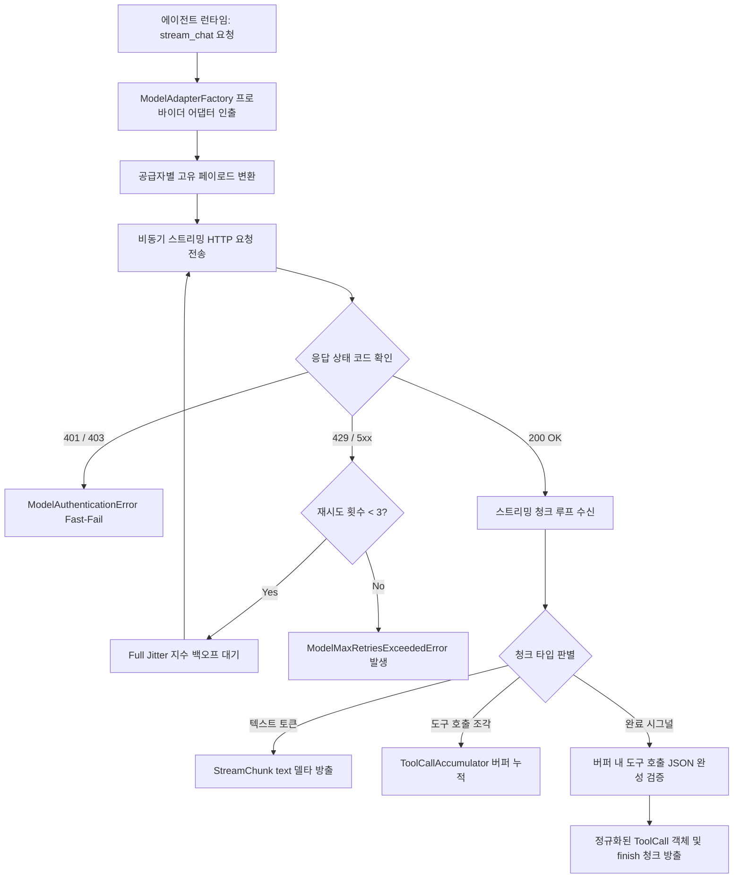
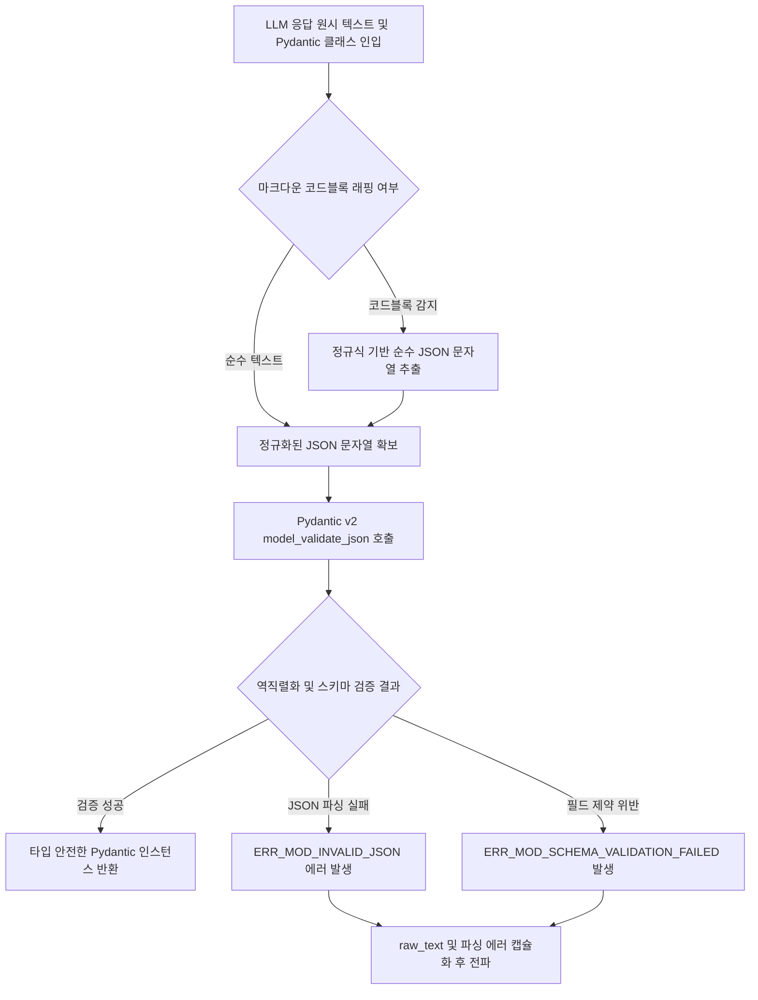

# [archon] 모델 어댑터 상세기능정의서 (Model Adapter Modular FSD)

- **도메인**: 멀티 LLM 스트리밍 통신, 도구 호출 정규화 및 Pydantic v2 구조화 출력 파싱
- **작성자**: 기획 명세 작성가 (`spec-writer`)
- **문서 버전**: v1.0
- **상태**: Approved

---

## 단위 기능 상세 명세 (단위기능별 7대 상세 명세 완비)

---

### [FUNC-MOD-001] 멀티 LLM 스트리밍 및 도구 호출 정규화 어댑터 (Multi-LLM Streaming & Tool Call Normalization Adapter)

#### 0. 대응 요구사항 및 인수 판정 기준 바인딩 (Requirements & Acceptance Criteria Binding)
- **대응 요구사항 ID**: `REQ-MOD-001` (멀티 LLM 모델 어댑터 및 스트리밍 처리)
- **정상 판정 기준 (Happy Path)**:
  - OpenAI ChatCompletion (`gpt-4o`, `o1`), Anthropic Messages API (`claude-3-5-sonnet`), Google Gemini API의 상이한 스트리밍 청크 프로토콜을 단일 정규화 비동기 제너레이터 `AsyncIterator[StreamChunk]`로 추상화 변환해야 한다.
  - 모델의 쪼개진 도구 호출(Tool Call) 스트리밍 토큰 조각을 메모리 버퍼에 손실 없이 누적 조립하여 완성된 JSON 인수 및 정규화된 `ToolCall(id, name, arguments)` 구조체로 변환해야 한다.
  - 네트워크 일시 단절 및 5xx, 429(Rate Limit) 응답 수신 시 Full Jitter 지수 백오프 공식($T_{\text{sleep}} = \text{random}(0, \min(T_{\max}, T_{\text{base}} \times 2^{\text{attempt}}))$, $T_{\text{base}}=1.0\text{s}$, $T_{\max}=30.0\text{s}$)에 따라 최대 3회 자동 재시도해야 한다.
- **예외/실패 판정 기준 (Edge/Exception Path)**:
  - 지원하지 않거나 오탈자가 있는 공급자 식별자(`provider`) 입력 시 즉시 `UnsupportedModelProviderError` (`ERR_MOD_UNSUPPORTED_PROVIDER`)를 반환해야 한다.
  - 인증 오류(HTTP 401, 403) 발생 시 재시도 루프를 즉시 중단하고 `ModelAuthenticationError` (`ERR_MOD_AUTH_FAILED`)로 Fast-Fail해야 한다.
  - 스트리밍 도중 소켓 연결이 비정상 종료되거나 청크 누적 실패 시 `ToolCallChunkStreamError` (`ERR_MOD_STREAM_CORRUPTED`)를 발생시켜야 한다.
- **단위 테스트 검증 조건 (TDD Target)**:
  - OpenAI 및 Anthropic 스트리밍 청크 모의 데이터 1,000건 주입 시 파싱 에러율 $0.0\%$, 정규화 `StreamChunk` 순서 보장 검증.
  - 분할된 툴 호출 조각 20건 순차 누적 시 조립된 JSON 인수 일치도 $100\%$ 검증.
  - 503 에러 발생 모의 환경에서 3회 지수 백오프 호출 간격 및 상한선($\le 30.0\text{s}$) 준수 검증.

#### 1. 기본 정보
- **기능명**: 멀티 LLM 스트리밍 및 도구 호출 정규화 어댑터
- **기능 ID**: `FUNC-MOD-001`
- **대응 요구사항 ID**: `REQ-MOD-001`
- **대상 모듈 코드**: `MOD-MODEL-001`
- **우선순위**: Must Have
- **관련 액터 (Actor)**: 에이전트 런타임 엔진, 세션 오케스트레이터, LLM 공급자 API

#### 2. 사전 조건 (Pre-conditions)
1. 지원 대상 공급자(`openai`, `anthropic`, `gemini`)의 API 인증 키가 환경 변수 또는 세션 런타임 컨텍스트에 로드된 상태.
2. `ModelRequest(model, messages, tools, temperature, stream=True)` 인스턴스가 유효하게 생성된 상태.

#### 3. 사용자 인터랙션 및 시스템 동작 흐름과 플로우차트 (Step-by-Step Flow & Flowchart)

1. 에이전트 런타임이 `ModelAdapterFactory.get_adapter(provider)`를 호출하여 해당 벤더 어댑터를 인출합니다.
2. 어댑터는 내부 정규화 메시지 및 툴 스펙을 공급자별 고유 페이로드(예: OpenAI functions/tools 형식 또는 Anthropic tools 형식)로 변환합니다.
3. 비동기 HTTP/2 클라이언트를 통해 공급자 엔드포인트로 스트리밍 요청을 전송합니다.
4. 공급자로부터 청크 수신 시마다:
   - 텍스트 델타 토큰인 경우: `StreamChunk(type="text", delta_text="...")` 발행
   - 도구 호출 델타 토큰인 경우: `ToolCallAccumulator`에 청크(인덱스, ID, 함수명, 인수 조각)를 누적 기록
   - 완료 토큰인 경우: `StreamChunk(type="finish", finish_reason=reason)` 발행 및 도구 호출 조립 완료 검증
5. HTTP 429 또는 5xx 수신 시 재시도 카운트를 증가시키고 Full Jitter 백오프 대기 후 2단계부터 재시도합니다.



#### 4. 데이터 항목 명세 (Data Elements - 8대 표준 컬럼)

| 항목명 | 입출력 구분 | UI/호출 타입 | 필수 여부 | 데이터 타입 / 제약 | 기본값 | 유효성 검증 규칙 (Validation) | 노출/수정 조건 |
| :--- | :---: | :--- | :---: | :--- | :---: | :--- | :--- |
| `provider` | 입력 인자 | String | 필수 | Enum (`openai`, `anthropic`, `gemini`) | - | 소문자 정규화, 미지원 시 예외 | 항상 필수 |
| `model_name` | 입력 인자 | String | 필수 | String / 1~64자 | - | 공급자별 유효 모델명 | 항상 필수 |
| `messages` | 입력 인자 | List | 필수 | `List[ChatMessage]` (Role, Content) | - | 최소 1개 이상의 메시지 | 항상 필수 |
| `tools` | 입력 인자 | Optional | 선택 | `List[ToolDefinition]` | `None` | 함수명, 설명, 파라미터 스키마 준수 | 툴 사용 시 전달 |
| `temperature` | 입력 인자 | Float | 선택 | Float ($0.0 \le t \le 2.0$) | `0.7` | 범위 내 부동소수점 | 항상 수정 가능 |
| `stream` | 입력 인자 | Boolean | 선택 | Boolean | `True` | 스트리밍 모드 여부 | 항상 설정 가능 |
| `chunk_type` | 출력 속성 | Enum | 필수 | Enum (`text`, `tool_call_delta`, `finish`) | - | 3종 타입 정규화 | 청크 수신 시 노출 |
| `delta_text` | 출력 속성 | Optional | 선택 | String | `None` | 텍스트 청크 시 필수 | 텍스트 타입 시 노출 |
| `tool_calls` | 출력 속성 | Optional | 선택 | `List[ToolCall]` | `None` | 조립 완료된 완전한 툴 호출 객체 | 완료 시점 노출 |
| `finish_reason`| 출력 속성 | Optional | 선택 | Enum (`stop`, `tool_calls`, `length`, `error`) | `None` | 종료 사유 정규화 | 스트림 종료 시 노출 |

#### 5. 비즈니스 규칙 (Business Rules)
- **BR-MOD-001-1**: **공급자 중립적 이벤트 정규화**:
  - 에이전트 상위 계층은 특정 벤더(OpenAI, Anthropic 등)의 응답 DTO를 직접 참조할 수 없으며, 반드시 본 어댑터가 발행하는 불변 `StreamChunk` 및 `ToolCall` DTO만 참조해야 합니다.
- **BR-MOD-001-2**: **도구 호출 청크 원자적 조립 (Atomic Tool Call Assembly)**:
  - 스트리밍 도중 도구 인수 JSON이 바이트 단위로 쪼개져 전달되더라도, 상위 레이어에는 완벽한 JSON 파싱이 검증된 완전한 `ToolCall` 객체 단위로 제공되어야 합니다.
  - JSON 파싱 오류 발생 시 `ToolCallChunkStreamError`를 발생시키고 불완전한 상태로 도구 실행기로 전달되지 않도록 차단합니다.
- **BR-MOD-001-3**: **Full Jitter 지수 백오프 공식 준수**:
  - 429(Rate Limit) 및 5xx 에러에 대한 재시도 대기 시간 $T$는 다음 수학적 공식을 엄격히 따릅니다:
    $$T = \text{random\_uniform}(0, \min(T_{\max}, T_{\text{base}} \times 2^{\text{attempt}}))$$
  - 여기서 $T_{\text{base}} = 1.0\text{s}$, $T_{\max} = 30.0\text{s}$, 최대 시도 횟수는 $3\text{회}$입니다.

#### 6. 예외 처리 및 엣지 케이스 (Edge Cases & Exception Handling)

| 발생 상황 (Edge Case Scenario) | 시스템 처리 방식 | 사용자 안내 메시지 / 예외 |
| :--- | :--- | :--- |
| 미지원 모델 공급자 문자열 입력 시 | 어댑터 팩토리에서 즉시 감지 후 등록 거절 | `UnsupportedModelProviderError: Provider 'unknown_llm' is not supported. Choose from ['openai', 'anthropic', 'gemini']` |
| 인증 키 누락 또는 만료 (401/403) | 지수 백오프 재시도를 일체 생략하고 즉각 Fast-Fail | `ModelAuthenticationError: Authentication failed for provider 'openai'. Verify API key credentials.` |
| 스트리밍 중도 소켓 단절 발생 시 | 최대 3회 재시도 범위 내에서 연결 복구 시도, 최종 실패 시 에러 발생 | `ToolCallChunkStreamError: Model streaming connection severed prematurely.` |
| 토큰 길이 제한 초과 (`finish_reason == "length"`) | 경고 로그를 기록하고 응답 절단 상태 DTO를 명시 반환 | `ModelTokenLimitExceededWarning: Response truncated due to context window limits.` |

#### 7. 비즈니스 에러 코드 매핑

| 비즈니스 에러 코드 | 발생 원인 | 예외 클래스 | 대응 가이드 |
| :--- | :--- | :--- | :--- |
| `ERR_MOD_UNSUPPORTED_PROVIDER` | 미등록/미지원 모델 공급자 지정 | `UnsupportedModelProviderError` | 지원 공급자(`openai`, `anthropic`, `gemini`) 설정 확인 |
| `ERR_MOD_AUTH_FAILED` | API Key 불일치 또는 인가 실패 | `ModelAuthenticationError` | 환경 변수 내 API Key 유효성 및 권한 재점검 |
| `ERR_MOD_RATE_LIMIT_EXCEEDED` | 429 Rate Limit 및 3회 재시도 초과 | `ModelMaxRetriesExceededError` | 호출 주기 조절 또는 공급자 계정 쿼터 상향 |
| `ERR_MOD_STREAM_CORRUPTED` | 스트리밍 청크 패킷 손상/단절 | `ToolCallChunkStreamError` | 네트워크 인프라 상태 점검 및 요청 재전송 |
| `ERR_MOD_API_TIMEOUT` | 소켓 타임아웃 ($> 60\text{s}$) 초과 | `ModelTimeoutError` | 네트워크 타임아웃 설정 확대 또는 모델 파라미터 조정 |

---

### [FUNC-MOD-002] Pydantic v2 기반 구조화 출력(Structured Outputs) 역직렬화 (Pydantic v2 Structured Outputs Deserializer)

#### 0. 대응 요구사항 및 인수 판정 기준 바인딩 (Requirements & Acceptance Criteria Binding)
- **대응 요구사항 ID**: `REQ-MOD-001` (멀티 LLM 모델 어댑터 및 스트리밍 처리)
- **정상 판정 기준 (Happy Path)**:
  - 모델 호출 시 응답 규격으로 Pydantic v2 `BaseModel` 서브클래스(`response_format: Type[T]`)를 전달하면, 어댑터가 이를 OpenAI 호환 엄격 JSON 스키마(`strict=True`, `additionalProperties=False`)로 자동 변환하여 모델 페이로드에 주입해야 한다.
  - 모델로부터 수신한 원시 JSON 텍스트를 `response_format.model_validate_json(raw_text)`를 통해 Rust 코어 기반 고속 역직렬화를 수행하고, 타입 안전성이 보장된 `T` 타입 인스턴스를 반환해야 한다.
- **예외/실패 판정 기준 (Edge/Exception Path)**:
  - 모델 응답 문자열이 유효한 JSON 포맷이 아니거나 Pydantic 필드 제약 조건(필수값 누락, 타입 불일치 등)을 위반할 경우 `ModelResponseValidationError` (`ERR_MOD_SCHEMA_VALIDATION_FAILED`)를 발생시켜야 한다.
  - 발생한 예외 객체는 디버깅 및 자동 재교정을 위해 원시 응답 문자열(`raw_response`)과 Pydantic 상세 에러 구조체(`errors()`)를 누락 없이 캡슐화해야 한다.
- **단위 테스트 검증 조건 (TDD Target)**:
  - 다중 중첩(Nested), 리스트, 열거형(Enum), 옵셔널 필드를 포함한 복합 Pydantic v2 모델 50종에 대한 자동 스키마 추출 및 역직렬화 성공률 $100\%$.
  - 타입 불일치 및 필수 필드 결손 모의 데이터 30건 주입 시 `ModelResponseValidationError` 정확한 필드 경로(`loc`) 식별률 $100\%$.

#### 1. 기본 정보
- **기능명**: Pydantic v2 기반 구조화 출력 역직렬화
- **기능 ID**: `FUNC-MOD-002`
- **대응 요구사항 ID**: `REQ-MOD-001`
- **대상 모듈 코드**: `MOD-MODEL-002`
- **우선순위**: Must Have
- **관련 액터 (Actor)**: 에이전트 런타임 엔진, Pydantic 검증기

#### 2. 사전 조건 (Pre-conditions)
1. 파싱 대상 클래스가 Pydantic v2 `pydantic.BaseModel`을 상속하여 정의된 상태.
2. 모델 응답 문자열이 수신 완료된 상태.

#### 3. 사용자 인터랙션 및 시스템 동작 흐름과 플로우차트 (Step-by-Step Flow & Flowchart)

1. 개발자 또는 오케스트레이터가 `StructuredOutputParser.parse(raw_text, response_format)`를 호출합니다.
2. 파서는 원시 문자열에 마크다운 코드 블록(` ```json ... ``` `)이 감싸져 있는지 정규식으로 검사하고, 존재하는 경우 순수 JSON 본문만 추출(Unwrap)합니다.
3. 대상 Pydantic 모델의 `model_validate_json(clean_json)` 메서드를 고속 Rust 엔진으로 직접 호출합니다.
4. 검증이 성공하면 타입 힌트가 적용된 객체 인스턴스를 반환합니다.
5. `pydantic.ValidationError` 또는 `json.JSONDecodeError` 발생 시, 원본 텍스트 및 상세 필드 오류 목록을 패키징하여 `ModelResponseValidationError`를 발생시킵니다.



#### 4. 데이터 항목 명세 (Data Elements - 8대 표준 컬럼)

| 항목명 | 입출력 구분 | UI/호출 타입 | 필수 여부 | 데이터 타입 / 제약 | 기본값 | 유효성 검증 규칙 (Validation) | 노출/수정 조건 |
| :--- | :---: | :--- | :---: | :--- | :---: | :--- | :--- |
| `raw_text` | 입력 인자 | String | 필수 | String / 1자 이상 | - | 빈 문자열 불허 | 항상 필수 |
| `schema_class` | 입력 인자 | Type | 필수 | `Type[BaseModel]` | - | `issubclass(cls, BaseModel)` | 항상 필수 |
| `clean_json` | 내부 속성 | String | 필수 | String (정규화된 JSON) | - | 마크다운 제거된 유효 JSON | 파싱 단계 생성 |
| `validated_output`| 출력 속성 | Object | 필수 | `T (BaseModel 서브클래스 인스턴스)` | - | 모든 필드 타입 검증 통과 인스턴스 | 검증 성공 시 반환 |
| `validation_errors`| 출력 속성 | List | 선택 | `List[Dict[str, Any]]` | `None` | `pydantic.ValidationError.errors()` | 오류 발생 시 포함 |
| `raw_response` | 출력 속성 | String | 필수 | String | - | 모델이 생성했던 원시 텍스트 | 오류 발생 시 포함 |
| `strict_mode` | 설정 속성 | Boolean | 선택 | Boolean | `True` | 추가 속성 허용 금지 (`extra="forbid"`) | 스키마 생성 시 설정 |
| `max_depth` | 설정 속성 | Integer | 선택 | Integer ($1 \le d \le 10$) | `5` | 스키마 중첩 깊이 상한 | 시스템 설정 |

#### 5. 비즈니스 규칙 (Business Rules)
- **BR-MOD-002-1**: **엄격 스키마 강제 (Strict Schema Enforcement)**:
  - 구조화 출력 요청 시 LLM의 할루시네이션 및 임의 필드 생성을 차단하기 위해 스키마는 항상 `additionalProperties: false` 설정을 유지해야 합니다.
  - 모델의 선택적 필드는 반드시 `Optional[T] = None` 형태로 기본값이 명시되어야 합니다.
- **BR-MOD-002-2**: **Rust 코어 기반 무손실 고속 역직렬화**:
  - 역직렬화는 Python 레벨의 dict 변환(`json.loads` $\to$ `**kwargs`)을 거치지 않고 Pydantic v2 네이티브 `model_validate_json` C/Rust 루틴을 직접 호출하여 성능을 극대화($\le 5\text{ms}$)해야 합니다.
- **BR-MOD-002-3**: **에러 원인 추적성 보존**:
  - 검증 실패 시 상위 재시도 루프가 LLM에게 교정 프롬프트(Self-Correction)를 재전송할 수 있도록, 원본 문자열(`raw_response`)과 오류 위치(`loc`), 실패 이유(`msg`)를 객체 내에 불변 보존해야 합니다.

#### 6. 예외 처리 및 엣지 케이스 (Edge Cases & Exception Handling)

| 발생 상황 (Edge Case Scenario) | 시스템 처리 방식 | 사용자 안내 메시지 / 예외 |
| :--- | :--- | :--- |
| 모델이 JSON 외 일반 텍스트나 사과문을 반환한 경우 | JSON 파싱 실패 감지 즉시 원본 보존 후 예외 발생 | `ModelResponseValidationError: Response is not valid JSON. Content: 'I am sorry, but...'` |
| 필수 필드가 누락된 JSON 응답 생성 시 | 누락된 필드 경로를 추출하여 구조화 에러 발생 | `ModelResponseValidationError: Field 'summary' is required but missing in response.` |
| 마크다운 백틱 및 json 키워드가 혼입된 경우 | 자동 정규식 스트리핑 후 재시도하여 정상 수용 | 경고 로그 기록 후 정상 파싱 진행 |
| Pydantic 모델이 아닌 일반 클래스 전달 시 | 함수 진입 단계에서 타입 체커로 조기 차단 | `TypeError: schema_class must be a subclass of pydantic.BaseModel` |

#### 7. 비즈니스 에러 코드 매핑

| 비즈니스 에러 코드 | 발생 원인 | 예외 클래스 | 대응 가이드 |
| :--- | :--- | :--- | :--- |
| `ERR_MOD_INVALID_JSON` | 모델 응답이 유효한 JSON 규격이 아님 | `ModelResponseValidationError` | 시스템 프롬프트에 JSON 출력 강제 규칙 강화 |
| `ERR_MOD_SCHEMA_VALIDATION_FAILED` | Pydantic 스키마 필드 제약 위반 | `ModelResponseValidationError` | 누락 필드 안내 및 Self-Correction 프롬프트 재전송 |
| `ERR_MOD_INVALID_SCHEMA_TYPE` | 유효하지 않은 스키마 클래스 전달 | `TypeError` | `pydantic.BaseModel` 상속 클래스 전달 여부 확인 |
