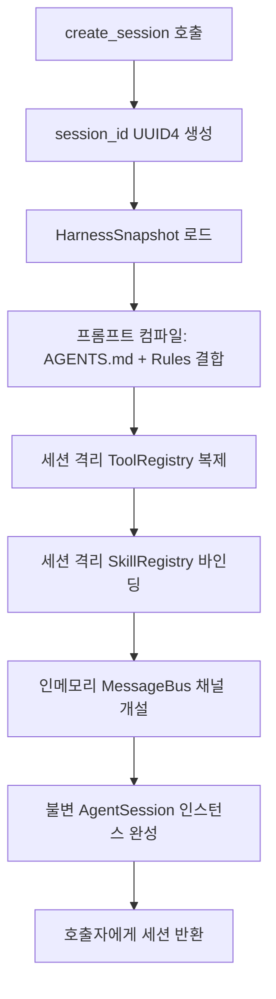
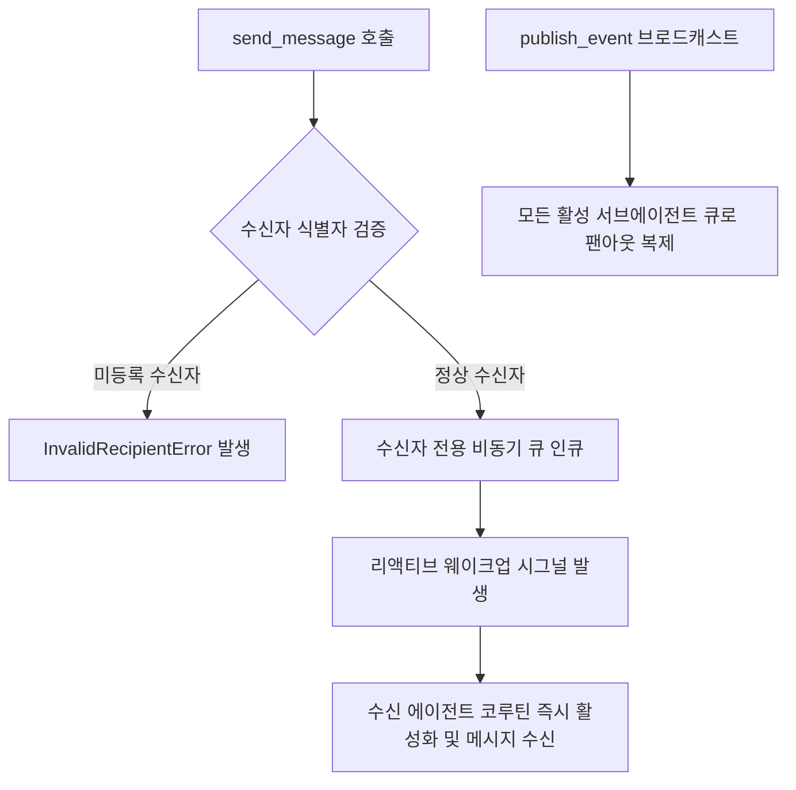

# [archon] 세션 및 코어 런타임 상세기능정의서 (Session & Core Runtime Modular FSD)

- **도메인**: 세션 라이프사이클, 런타임 프롬프트 컴파일러, 반응형 이벤트 메시지 버스
- **작성자**: 기획 명세 작성가 (`spec-writer`)
- **문서 버전**: v1.0
- **상태**: Approved

---

## 단위 기능 상세 명세 (단위기능별 7대 상세 명세 완비)

---

### [FUNC-SESS-001] 세션 초기화 시 하네스 동적 바인딩 및 런타임 컴파일 (Dynamic Session Binding & Compiler)

#### 0. 대응 요구사항 및 인수 판정 기준 바인딩 (Requirements & Acceptance Criteria Binding)
- **대응 요구사항 ID**: `REQ-SESS-001` (세션 단위 하네스 동적 바인딩 및 런타임 컴파일)
- **정상 판정 기준 (Happy Path)**:
  - `archon.create_session(provider)` 호출 시 고유 세션 ID(`sess_<uuid4>`)를 발급하고, 하네스 스냅샷의 규칙과 도구를 바인딩한 불변 `AgentSession` 인스턴스를 반환해야 한다.
  - 시스템 프롬프트 컴파일러는 `AGENTS.md`의 파이프라인 규칙, `.agents/rules`의 필수 원칙, 활성 도구 목록을 순서대로 조합하여 단일 시스템 지시문으로 컴파일해야 한다.
  - 세션 생성 및 초기 컴파일 소요 시간은 $\le 10\text{ms}$이어야 한다.
- **예외/실패 판정 기준 (Edge/Exception Path)**:
  - 유효하지 않은 하네스 스냅샷 인입 시 `SessionInitializationError` (`ERR_SESS_CREATE_FAILED`)를 발생시켜야 한다.
  - 동시 50개 세션 생성 시 상호 간 프롬프트나 도구 레지스트리 교차 오염이 $0\text{건}$이어야 한다.
- **단위 테스트 검증 조건 (TDD Target)**:
  - 테넌트별 하네스 스냅샷 기반 세션 100건 동시 생성 및 격리 무결성 단위 테스트 통과율 $100\%$.

#### 1. 기본 정보
- **기능명**: 세션 초기화 시 하네스 동적 바인딩 및 불변 실행 컨텍스트 컴파일
- **기능 ID**: `FUNC-SESS-001`
- **대응 요구사항 ID**: `REQ-SESS-001`
- **대상 모듈 코드**: `MOD-SESSION-001`
- **우선순위**: Must Have
- **관련 액터 (Actor)**: AI 플랫폼 엔지니어, 세션 오케스트레이터

#### 2. 사전 조건 (Pre-conditions)
1. `HarnessSnapshot`이 정상 파싱되어 메모리에 준비된 상태.
2. 세션 실행에 사용할 LLM 모델 어댑터(`ModelAdapter`) 및 기본 설정이 준비된 상태.

#### 3. 사용자 인터랙션 및 시스템 동작 흐름과 플로우차트 (Step-by-Step Flow & Flowchart)

1. 호출자가 `archon.create_session(harness=snapshot, model="claude-3-5-sonnet")`을 호출합니다.
2. 시스템은 고유한 `session_id`(`UUID4`)를 발급하고 독립된 세션 메모리 공간을 할당합니다.
3. **런타임 프롬프트 컴파일러**가 동작합니다:
   - `AGENTS.md`의 파이프라인 규칙과 글로벌 원칙을 기본 시스템 지시문으로 결합.
   - `.agents/rules`의 필수 규칙을 지시문에 주입.
   - 전역 도구 및 스킬 레지스트리를 세션 스코프로 복제 바인딩.
4. 세션 전용 인메모리 `MessageBus`를 초기화하여 에이전트 간 이벤트 발행/구독 채널을 개설합니다.
5. 컴파일된 실행 컨텍스트를 가진 불변의 `AgentSession` 인스턴스를 반환합니다.



#### 4. 데이터 항목 명세 (Data Elements - 8대 표준 컬럼)

| 항목명 | 입출력 구분 | UI/호출 타입 | 필수 여부 | 데이터 타입 / 제약 | 기본값 | 유효성 검증 규칙 (Validation) | 노출/수정 조건 |
| :--- | :---: | :--- | :---: | :--- | :---: | :--- | :--- |
| `session_id` | 반환 속성 | Model Property | 필수 | String / UUID4 형식 | 자동 생성 | 유효한 UUIDv4 문자열 | 항상 제공 |
| `harness_snapshot` | 생성 인자 | Python Arg | 필수 | `HarnessSnapshot` 인스턴스 | - | 유효성 검증 완료된 스냅샷 | 항상 필수 |
| `system_prompt` | 세션 속성 | Model Property | 필수 | String (Markdown 텍스트) | 컴파일 결과 | 컴파일된 시스템 프롬프트 본문 | 세션 내부 불변 |
| `active_tools` | 세션 속성 | Model Property | 필수 | `Dict[str, ToolSpec]` | `{}` | 세션에 등록된 가용 툴 맵 | 항상 제공 |
| `active_skills` | 세션 속성 | Model Property | 필수 | `Dict[str, SkillSpec]` | `{}` | 세션에 등록된 가용 스킬 맵 | 항상 제공 |
| `session_timeout` | 설정 인자 | Config Key | 선택 | Float / 10.0 ~ 3600.0 (초) | `600.0` | $10.0 \le \text{timeout} \le 3600.0$ | 세션 생성 시 오버라이드 가능 |
| `max_tokens` | 설정 인자 | Config Key | 선택 | Integer / 1000 ~ 128000 | `8192` | $1000 \le \text{tokens} \le 128000$ | 세션 생성 시 오버라이드 가능 |
| `is_closed` | 상태 속성 | Model Property | 필수 | Boolean | `False` | 세션 종료 시 True | 항상 제공 |

#### 5. 비즈니스 규칙 (Business Rules)
- **BR-SESS-001-1**: 각 `AgentSession`은 상호 간에 프롬프트, 도구 레지스트리, 메시지 버스를 절대 공유하지 않으며 완벽히 메모리 격리되어야 합니다.
- **BR-SESS-001-2**: 시스템 프롬프트는 세션 생성 시점에 1회 컴파일되어 불변(Frozen)으로 캐싱되며, 세션 실행 도중 임의로 변조될 수 없습니다.
- **BR-SESS-001-3**: 세션 생성 시 등록되는 도구와 스킬은 원본 레지스트리의 Deep Copy본이어야 하며, 한 세션에서의 도구 변경이 타 세션에 전파되지 않아야 합니다.

#### 6. 예외 처리 및 엣지 케이스 (Edge Cases & Exception Handling)

| 발생 상황 (Edge Case Scenario) | 시스템 처리 방식 | 사용자 안내 메시지 / 예외 |
| :--- | :--- | :--- |
| 하네스 스냅샷의 필수 헌법이 훼손된 경우 | 기본 시스템 헌법으로 대체하고 경고 로그 출력 | `DefaultHarnessSpec applied with warning: Constitution was malformed` |
| 세션 메모리 할당 실패 시 | 생성 중인 세션 즉시 폐기 및 에러 반환 | `SessionInitializationError: Insufficient memory to allocate session context` |

#### 7. 비즈니스 에러 코드 매핑

| 비즈니스 에러 코드 | 발생 원인 | 예외 클래스 | 대응 가이드 |
| :--- | :--- | :--- | :--- |
| `ERR_SESS_CREATE_FAILED` | 세션 컴파일 또는 툴 바인딩 실패 | `SessionInitializationError` | 하네스 스냅샷의 프롬프트 및 도구 무결성 확인 |
| `ERR_SESS_INVALID_CONFIG` | 세션 파라미터 유효성 검증 실패 | `SessionInitializationError` | session_timeout, max_tokens 범위 확인 |

---

### [FUNC-CORE-001] 세션 라이프사이클 및 불변 실행 컨텍스트 관리 (Session Lifecycle & Context Management)

#### 0. 대응 요구사항 및 인수 판정 기준 바인딩 (Requirements & Acceptance Criteria Binding)
- **대응 요구사항 ID**: `REQ-SESS-001` (세션 단위 하네스 동적 바인딩 및 런타임 컴파일)
- **정상 판정 기준 (Happy Path)**:
  - `session.run(task)`을 통해 메인 에이전트의 실행 라이프사이클을 가동하고, 작업 완료 시 최종 결과와 세션 메트릭을 반환해야 한다.
  - `session.close()` 호출 시 연결된 모든 비동기 태스크, 메시지 버스, 서브프로세스를 $100\%$ 정리해야 한다.
- **예외/실패 판정 기준 (Edge/Exception Path)**:
  - 세션 실행 시간이 `session_timeout`(기본 600초)을 초과하면 `SessionTimeoutError` (`ERR_SESS_TIMEOUT`)를 발생시키고 실행 중인 모든 코루틴을 강제 취소(`cancel()`)해야 한다.
  - 이미 닫힌 세션(`is_closed=True`)에 작업 실행을 요청할 경우 `SessionClosedError` (`ERR_SESS_CLOSED`)를 발생시켜야 한다.
- **단위 테스트 검증 조건 (TDD Target)**:
  - 세션 타임아웃 강제 인터럽트 발생 시 자식 태스크 취소율 $100\%$ 검증.
  - 세션 종료 후 프로세스 핸들 잔존 $0\text{건}$ 검증.

#### 1. 기본 정보
- **기능명**: 세션 라이프사이클 및 불변 실행 컨텍스트 관리
- **기능 ID**: `FUNC-CORE-001`
- **대응 요구사항 ID**: `REQ-SESS-001`
- **대상 모듈 코드**: `MOD-CORE-001`
- **우선순위**: Must Have
- **관련 액터 (Actor)**: 메인 에이전트, 세션 오케스트레이터

#### 2. 사전 조건 (Pre-conditions)
1. `FUNC-SESS-001`을 통해 `AgentSession` 인스턴스가 활성(`is_closed=False`) 상태로 초기화된 상태.

#### 3. 사용자 인터랙션 및 시스템 동작 흐름과 플로우차트 (Step-by-Step Flow & Flowchart)

1. 호출자가 `await session.run(user_task)`를 호출합니다.
2. 세션은 실행 타임아웃 타이머를 비동기로 가동하고 상태를 `MAIN_RUNNING`으로 전이합니다.
3. 메인 에이전트 루프가 사용자 태스크를 해석하고 필요 시 `invoke_subagents`를 디스패치합니다.
4. 작업 완료 시 최종 산출물을 반환하고 세션 상태를 `IDLE`로 복귀시킵니다.
5. 호출자가 작업을 마치고 `await session.close()`를 호출하면 활성 태스크 취소 및 리소스 해제를 완료하고 상태를 `CLOSED`로 전이합니다.

```mermaid
flowchart TD
    A[session.run(task) 호출] --> B{세션 is_closed 검사}
    B -- 이미 닫힘 --> C[SessionClosedError 발생]
    B -- 활성 상태 --> D[세션 타이머 600s 가동 & 상태 MAIN_RUNNING]
    D --> E[메인 에이전트 실행 및 서브에이전트 오케스트레이션]
    E --> F{실행 중 타임아웃 발생 여부}
    F -- 시간 초과 --> G[자식 코루틴 일괄 cancel 및 SessionTimeoutError 발생]
    F -- 정상 완료 --> H[최종 산출물 반환 및 상태 IDLE 복귀]
    H --> I[session.close 호출 인입]
    I --> J[활성 태스크 수거, 메시지 버스 닫힘, 상태 CLOSED 전이]
```

#### 4. 데이터 항목 명세 (Data Elements - 8대 표준 컬럼)

| 항목명 | 입출력 구분 | UI/호출 타입 | 필수 여부 | 데이터 타입 / 제약 | 기본값 | 유효성 검증 규칙 (Validation) | 노출/수정 조건 |
| :--- | :---: | :--- | :---: | :--- | :---: | :--- | :--- |
| `task_input` | 실행 인자 | String | 필수 | String / 1자 이상 100,000자 이하 | - | 공백 제외 1자 이상 | 실행 시 필수 |
| `state` | 상태 속성 | Enum | 필수 | Enum ('IDLE', 'RUNNING', 'EXPIRED', 'CLOSED') | `'IDLE'` | 유효한 생명주기 상태 매칭 | 항상 반환 |
| `elapsed_time_s` | 관측 속성 | Float | 필수 | Float ($t \ge 0.0$) | `0.0` | 세션 누적 실행 시간 (초) | 항상 반환 |
| `active_task_count`| 관측 속성 | Integer | 필수 | Integer ($n \ge 0$) | `0` | 현재 실행 중인 비동기 태스크 수 | 항상 반환 |
| `final_output` | 반환 속성 | Any | 선택 | String 또는 Dict | `None` | 메인 에이전트 최종 산출물 | 성공 시 반환 |
| `is_timeout` | 상태 플래그 | Boolean | 필수 | Boolean | `False` | 타임아웃 만료 시 True | 항상 반환 |
| `cancelled_tasks` | 관측 속성 | Integer | 필수 | Integer ($n \ge 0$) | `0` | 강제 취소된 태스크 수 | 세션 종료/만료 시 |
| `closed_at` | 상태 속성 | Optional | 선택 | String / ISO-8601 UTC | `None` | 세션 종료 시각 | 종료 후 기록 |

#### 5. 비즈니스 규칙 (Business Rules)
- **BR-CORE-001-1**: 세션이 명시적으로 `close()`되거나 타임아웃에 도달하면, 연결된 모든 활성 서브프로세스와 비동기 태스크를 즉시 취소(`cancel()`)하고 리소스를 반환해야 합니다.
- **BR-CORE-001-2**: 타임아웃 발생 시 메인 에이전트 코루틴뿐만 아니라 분기 실행 중인 모든 서브에이전트 태스크 세트(`session._active_tasks`)를 전수 순회하여 일괄 취소해야 합니다.
- **BR-CORE-001-3**: 닫힌 세션에 대한 모든 호출은 `SessionClosedError`를 즉시 반환하여 리소스 오염을 방지합니다.

#### 6. 예외 처리 및 엣지 케이스 (Edge Cases & Exception Handling)

| 발생 상황 (Edge Case Scenario) | 시스템 처리 방식 | 사용자 안내 메시지 / 예외 |
| :--- | :--- | :--- |
| 세션 타임아웃(기본 600초) 초과 시 | 진행 중인 모든 코루틴에 `asyncio.CancelledError` 주입 후 상태를 `EXPIRED`로 변경 | `SessionTimeoutError: Session 'sess_123' timed out after 600.0s` |
| 이미 닫힌 세션에 작업 요청 시 | 추가 작업 실행을 즉시 거부하고 에러 발생 | `SessionClosedError: Cannot invoke agent on closed session 'sess_123'` |
| 백그라운드 태스크 취소 대기 중 예외 발생 시 | 개별 예외를 억제하지 않고 로그에 기록하되 클린업 완수 | `Warning: Task cancellation encountered error during session cleanup` |

#### 7. 비즈니스 에러 코드 매핑

| 비즈니스 에러 코드 | 발생 원인 | 예외 클래스 | 대응 가이드 |
| :--- | :--- | :--- | :--- |
| `ERR_SESS_TIMEOUT` | 세션 총 실행 시간 초과 (600초) | `SessionTimeoutError` | session_timeout 설정 상향 또는 태스크 분할 |
| `ERR_SESS_CLOSED` | 이미 종료된 세션에 대한 작업 호출 | `SessionClosedError` | 신규 세션 생성 후 작업 재인입 |

---

### [FUNC-CORE-002] 반응형 이벤트 메시지 버스 및 비동기 상태 알림 (Reactive Event Message Bus)

#### 0. 대응 요구사항 및 인수 판정 기준 바인딩 (Requirements & Acceptance Criteria Binding)
- **대응 요구사항 ID**: `REQ-BUS-001` (반응형 이벤트 메시지 버스)
- **정상 판정 기준 (Happy Path)**:
  - 세션 내에서 에이전트 간 1:1 메시지 전송(`send_message`) 및 브로드캐스트 이벤트 발행/구독 채널을 지원해야 한다.
  - 새 메시지 인입 시 대기 중인 에이전트를 깨우는 리액티브 웨이크업(Reactive Wakeup)이 즉각 반응해야 한다.
  - 1,000건 동시 메시지 발행/수신 시 메시지 유실률은 $0\%$이어야 한다.
- **예외/실패 판정 기준 (Edge/Exception Path)**:
  - 존재하지 않는 수신자 ID로 메시지 발송 시 `InvalidRecipientError` (`ERR_BUS_INVALID_RECIPIENT`)를 발생시켜야 한다.
  - 닫힌 메시지 버스에 발행 시도 시 `MessageBusClosedError` (`ERR_BUS_CLOSED`)를 발생시켜야 한다.
- **단위 테스트 검증 조건 (TDD Target)**:
  - 1,000건 비동기 메시지 발행/구독 스트레스 테스트 통과율 $100\%$ 및 FIFO 순서 보장 검증.

#### 1. 기본 정보
- **기능명**: 세션 내 반응형 이벤트 메시지 버스 및 비동기 상태 알림
- **기능 ID**: `FUNC-CORE-002`
- **대응 요구사항 ID**: `REQ-BUS-001`
- **대상 모듈 코드**: `MOD-CORE-002`
- **우선순위**: Should Have
- **관련 액터 (Actor)**: 메인 에이전트, 서브에이전트, 관측 로거

#### 2. 사전 조건 (Pre-conditions)
1. `AgentSession` 내에 `MessageBus` 인스턴스가 활성 개설된 상태.
2. 메시지를 송수신할 에이전트 식별자가 세션에 등록된 상태.

#### 3. 사용자 인터랙션 및 시스템 동작 흐름과 플로우차트 (Step-by-Step Flow & Flowchart)

1. 에이전트 A가 `await bus.send_message(recipient="agent_b", message="Data ready")`를 호출합니다.
2. 버스는 수신자 식별자의 유효성을 검증하고 수신자 큐(`asyncio.Queue`)에 메시지를 인큐합니다.
3. 대기 중이던 에이전트 B의 리액티브 리스너가 즉시 깨어나(Reactive Wakeup) 메시지를 디큐하여 처리를 재개합니다.
4. 브로드캐스트 이벤트인 경우 등록된 모든 구독자 채널에 팬아웃(Fan-out) 복제 전달합니다.



#### 4. 데이터 항목 명세 (Data Elements - 8대 표준 컬럼)

| 항목명 | 입출력 구분 | UI/호출 타입 | 필수 여부 | 데이터 타입 / 제약 | 기본값 | 유효성 검증 규칙 (Validation) | 노출/수정 조건 |
| :--- | :---: | :--- | :---: | :--- | :---: | :--- | :--- |
| `sender_id` | 메시지 속성 | String | 필수 | String / 에이전트 고유 식별자 | - | 영문, 숫자, 하이픈 | 항상 필수 |
| `recipient_id` | 메시지 속성 | String | 필수 | String / 에이전트 고유 식별자 또는 '*' | - | 유효한 등록 에이전트 | 항상 필수 |
| `payload` | 메시지 속성 | Any | 필수 | String 또는 Dict | - | 직렬화 가능 객체 | 항상 필수 |
| `event_type` | 메시지 속성 | String | 필수 | String / `^[A-Z_]+$` | `"TASK_UPDATE"` | 대문자 언더바 규격 | 항상 필수 |
| `timestamp` | 메시지 속성 | String | 필수 | String / ISO-8601 UTC | 현재 시각 | UTC 타임스탬프 | 항상 반환 |
| `priority` | 메시지 속성 | Enum | 선택 | Enum ('HIGH', 'NORMAL', 'LOW') | `'NORMAL'` | 메시지 우선순위 | 항상 설정 가능 |
| `is_delivered` | 상태 속성 | Boolean | 필수 | Boolean | `False` | 수신자 큐 수납 완료 시 True | 항상 반환 |
| `queue_size` | 관측 속성 | Integer | 필수 | Integer ($n \ge 0$) | `0` | 현재 대기 중인 메시지 수 | 항상 반환 |

#### 5. 비즈니스 규칙 (Business Rules)
- **BR-CORE-002-1**: 모든 메시지는 FIFO(First-In-First-Out) 순서를 엄격히 보장하며, 우선순위가 `HIGH`인 메시지는 큐 최상단으로 우선 배치됩니다.
- **BR-CORE-002-2**: 수신자가 `*`로 지정된 브로드캐스트 메시지는 현재 세션에 등록된 모든 활성 서브에이전트에 동시 전달됩니다.
- **BR-CORE-002-3**: 메시지 버스는 세션 메모리 내에서만 격리 동작하며, 타 세션의 메시지 버스와 섞이지 않습니다.

#### 6. 예외 처리 및 엣지 케이스 (Edge Cases & Exception Handling)

| 발생 상황 (Edge Case Scenario) | 시스템 처리 방식 | 사용자 안내 메시지 / 예외 |
| :--- | :--- | :--- |
| 존재하지 않는 수신자 ID로 메시지 전송 시 | 즉시 `InvalidRecipientError`를 발생시켜 데드레터 방지 | `InvalidRecipientError: Recipient agent 'unknown_agent' not found in session` |
| 메시지 큐가 10,000건을 초과하여 백프레셔 발생 시 | 발행자 코루틴을 비동기 대기(`await queue.put`)시켜 메모리 보호 | 백프레셔 비동기 조절 |
| 세션 종료 후 메시지 버스에 전송 시도 시 | 메시지 수신 거부 및 에러 반환 | `MessageBusClosedError: Cannot send message to closed MessageBus` |

#### 7. 비즈니스 에러 코드 매핑

| 비즈니스 에러 코드 | 발생 원인 | 예외 클래스 | 대응 가이드 |
| :--- | :--- | :--- | :--- |
| `ERR_BUS_INVALID_RECIPIENT` | 미등록 수신자 식별자 지정 | `InvalidRecipientError` | 세션 내 활성 에이전트 목록 확인 |
| `ERR_BUS_CLOSED` | 종료된 메시지 버스에 전송 | `MessageBusClosedError` | 세션 활성 상태 확인 |
| `ERR_BUS_QUEUE_OVERFLOW` | 큐 용량 초과 백프레셔 타임아웃 | `MessageBusOverflowError` | 수신 에이전트 처리 속도 점검 |
