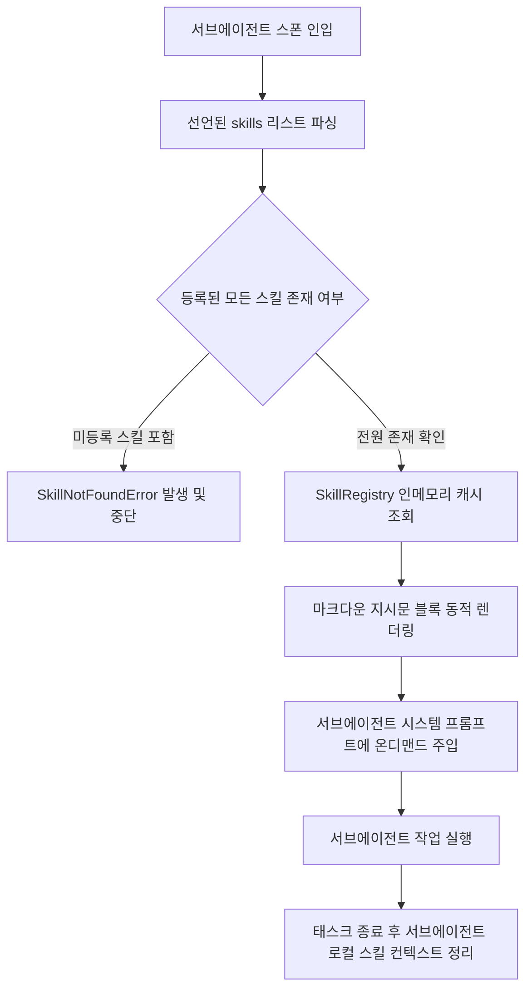
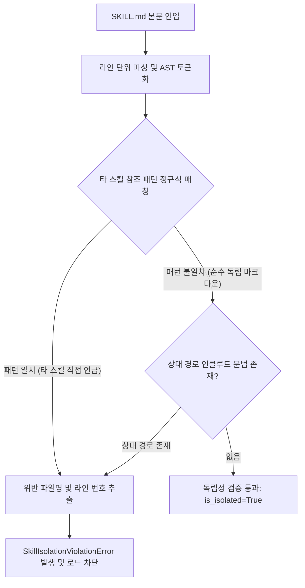

# [archon] 스킬 시스템 상세기능정의서 (Skill System Modular FSD)

- **도메인**: 독립 스킬 온디맨드 프로그레시브 주입 및 상호 참조 차단 정적 린터
- **작성자**: 기획 명세 작성가 (`spec-writer`)
- **문서 버전**: v1.0
- **상태**: Approved

---

## 단위 기능 상세 명세 (단위기능별 7대 상세 명세 완비)

---

### [FUNC-SKIL-001] 독립 스킬(Skill Isolation) 온디맨드 프로그레시브 주입 (Skill Progressive Disclosure)

#### 0. 대응 요구사항 및 인수 판정 기준 바인딩 (Requirements & Acceptance Criteria Binding)
- **대응 요구사항 ID**: `REQ-SKIL-001` (독립 스킬 온디맨드 프로그레시브 주입)
- **정상 판정 기준 (Happy Path)**:
  - 서브에이전트 매니페스트에 선언된 스킬 식별자 목록(`skills: ["humanizer", "git"]`)에 해당하는 스킬 마크다운 파일만 컨텍스트에 점진적으로 주입해야 한다.
  - 주입된 스킬 가이드는 메모리에 불변 캐싱되어 동일 스킬 재요청 시 추가 I/O 지연 없이 즉시 제공되어야 한다 ($\le 1\text{ms}$).
- **예외/실패 판정 기준 (Edge/Exception Path)**:
  - 선언부에 기재된 스킬이 `.agents/skills` 레지스트리에 존재하지 않을 경우 세션 실행 전 즉시 `SkillNotFoundError` (`ERR_SKIL_NOT_FOUND`)를 발생시켜야 한다.
  - 서브에이전트가 종료되면 주입된 스킬은 해당 서브에이전트 컨텍스트와 함께 격리 소멸되며 부모나 타 서브에이전트로 유출되지 않아야 한다.
- **단위 테스트 검증 조건 (TDD Target)**:
  - 선언된 스킬만 서브에이전트 프롬프트에 주입되고 미선언 스킬의 프롬프트 유입 $0\text{건}$ 검증.
  - 동일 스킬 100회 주입 요청 시 인메모리 캐시 히트율 $100\%$.

#### 1. 기본 정보
- **기능명**: 독립 스킬(Skill Isolation) 온디맨드 프로그레시브 주입
- **기능 ID**: `FUNC-SKIL-001`
- **대응 요구사항 ID**: `REQ-SKIL-001`
- **대상 모듈 코드**: `MOD-SKILL-001`
- **우선순위**: Must Have
- **관련 액터 (Actor)**: 서브에이전트 런타임, 스킬 인젝터

#### 2. 사전 조건 (Pre-conditions)
1. `FUNC-SKIL-002`의 정적 린터를 통과하여 `SkillRegistry`에 등록된 독립 스킬들이 존재하는 상태.
2. 서브에이전트 명세에 요구 스킬 식별자 리스트가 선언된 상태.

#### 3. 사용자 인터랙션 및 시스템 동작 흐름과 플로우차트 (Step-by-Step Flow & Flowchart)

1. 서브에이전트가 스폰되면 스킬 인젝터가 선언부(`subagent.skills`)를 분석합니다.
2. 각 스킬 식별자에 대해 `SkillRegistry`에서 사전 파싱된 `SkillSpec`을 조회합니다.
3. 스킬 본문을 정규화된 마크다운 지시문 블록으로 렌더링합니다:
   - `<skill_instruction name="...">\n...\n</skill_instruction>`
4. 렌더링된 지시문을 서브에이전트의 시스템 프롬프트 하단에 점진적 주입(Progressive Disclosure)합니다.
5. 서브에이전트 실행 완료 시 주입된 스킬 블록을 회수하여 컨텍스트 누수를 방지합니다.

#### 4. 데이터 항목 명세 (Data Elements - 8대 표준 컬럼)

| 항목명 | 입출력 구분 | UI/호출 타입 | 필수 여부 | 데이터 타입 / 제약 | 기본값 | 유효성 검증 규칙 (Validation) | 노출/수정 조건 |
| :--- | :---: | :--- | :---: | :--- | :---: | :--- | :--- |
| `skill_name` | 메타데이터 | String | 필수 | String / `^[a-z0-9_\-]+$` | - | 영문 소문자, 숫자, 하이픈 | 항상 필수 |
| `description` | 메타데이터 | String | 필수 | String / 10자 이상 500자 이하 | - | 공백 제외 10자 이상 | 항상 필수 |
| `content` | 스킬 본문 | String | 필수 | String / 마크다운 지시문 | - | 타 스킬 참조 구문 불포함 | 항상 필수 |
| `is_isolated` | 상태 플래그 | Boolean | 필수 | Boolean | `True` | 린터 통과 시 True 고정 | 항상 True |
| `target_agent` | 주입 파라미터 | String | 필수 | String / 대상 서브에이전트 명칭 | - | 유효한 서브에이전트 ID | 주입 시 필수 |
| `prompt_tokens` | 관측 속성 | Integer | 필수 | Integer ($n \ge 0$) | `0` | 주입된 텍스트 토큰 수 | 주입 후 기록 |
| `injection_mode` | 설정 항목 | Enum | 선택 | Enum ('ON_DEMAND', 'STATIC') | `'ON_DEMAND'` | 온디맨드 점진적 주입 | 항상 오버라이드 가능 |
| `cache_hit` | 관측 속성 | Boolean | 필수 | Boolean | `False` | 인메모리 캐시 적중 여부 | 항상 반환 |

#### 5. 비즈니스 규칙 (Business Rules)
- **BR-SKIL-001-1**: 모든 스킬은 처음부터 세션 전체에 주입되지 않으며, 각 서브에이전트가 명시적으로 요구한 시점에만 온디맨드로 주입되어야 합니다 (Progressive Disclosure).
- **BR-SKIL-001-2**: 스킬 지시문 블록은 서브에이전트의 로컬 프롬프트에만 바인딩되며, 부모 에이전트나 형제 서브에이전트로 유출되어서는 안 됩니다.

#### 6. 예외 처리 및 엣지 케이스 (Edge Cases & Exception Handling)

| 발생 상황 (Edge Case Scenario) | 시스템 처리 방식 | 사용자 안내 메시지 / 예외 |
| :--- | :--- | :--- |
| 서브에이전트 명세에 미등록 스킬 선언 시 | 세션 스폰 전 즉시 유효성 검사에서 차단 | `SkillNotFoundError: Skill 'non-existent' declared in subagent 'backend' does not exist in registry` |
| 스킬 지시문 크기가 32KB를 초과하는 경우 | 경고 로그를 기록하고 토큰 낭비 주의 알림 | `Warning: Skill 'heavy-skill' exceeds recommended prompt size (32KB)` |

#### 7. 비즈니스 에러 코드 매핑

| 비즈니스 에러 코드 | 발생 원인 | 예외 클래스 | 대응 가이드 |
| :--- | :--- | :--- | :--- |
| `ERR_SKIL_NOT_FOUND` | 미등록 스킬 식별자 선언 | `SkillNotFoundError` | .agents/skills/ 경로 내 스킬 정의 추가 |
| `ERR_SKIL_INJECTION_FAILED`| 프롬프트 렌더링 중 오류 발생 | `SkillInjectionError` | 스킬 마크다운 본문 특수문자 점검 |

---

### [FUNC-SKIL-002] 스킬 간 상호 참조 방지 정적 린터 및 격리 검증기 (Skill Isolation Static Linter)

#### 0. 대응 요구사항 및 인수 판정 기준 바인딩 (Requirements & Acceptance Criteria Binding)
- **대응 요구사항 ID**: `REQ-SKIL-001` (독립 스킬 온디맨드 프로그레시브 주입)
- **정상 판정 기준 (Happy Path)**:
  - `.agents/skills/*/SKILL.md` 파일 본문과 프론트매터를 정적 분석하여 타 스킬 참조, 파일 경로 인클루드, 스킬 임포트 구문이 전혀 없는 경우 검증 통과(`is_isolated=True`)를 판정해야 한다.
- **예외/실패 판정 기준 (Edge/Exception Path)**:
  - 스킬 파일 본문 내에서 타 스킬을 참조하거나 임포트하는 행위(`skill:`, `import`, `@skill`, `../other_skill/` 등) 감지 시 즉시 위반 라인 번호를 명시한 `SkillIsolationViolationError` (`ERR_SKIL_MUTUAL_REF`)를 발생시키고 하네스 로드를 전면 거부해야 한다.
- **단위 테스트 검증 조건 (TDD Target)**:
  - 타 스킬 참조가 포함된 모의 스킬 10종에 대한 정적 린트 차단율 $100\%$ (Zero Tolerance).

#### 1. 기본 정보
- **기능명**: 스킬 간 상호 참조 방지 정적 린터 및 격리 검증기
- **기능 ID**: `FUNC-SKIL-002`
- **대응 요구사항 ID**: `REQ-SKIL-001`
- **대상 모듈 코드**: `MOD-SKILL-002`
- **우선순위**: Must Have
- **관련 액터 (Actor)**: 하네스 린터, 하네스 파서

#### 2. 사전 조건 (Pre-conditions)
1. 하네스 파싱 단계에서 `.agents/skills/*/SKILL.md` 마크다운 파일 내용이 수집된 상태.

#### 3. 사용자 인터랙션 및 시스템 동작 흐름과 플로우차트 (Step-by-Step Flow & Flowchart)

1. 하네스 파서가 `SkillIsolationLinter.lint(skill_content, registered_skill_names)`를 호출합니다.
2. 린터는 스킬 본문을 라인 단위로 순회하며 정규식 분석을 수행합니다:
   - 타 스킬 이름 직접 참조 패턴: `\b(skill|skills):\s*([a-zA-Z0-9_\-]+)`
   - 파일 상대 경로 참조 패턴: `\.\./[a-zA-Z0-9_\-]+/SKILL\.md`
   - 스킬 임포트/인클루드 지시자: `@skill\([^\)]+\)`, `include\s+skill`
3. 등록된 타 스킬 식별자와 매칭되는 위반 사항이 1건이라도 발견되면 즉시 `SkillIsolationViolationError`를 발생시킵니다.
4. 모든 라인이 무결하면 `is_isolated=True` 플래그를 승인합니다.

#### 4. 데이터 항목 명세 (Data Elements - 8대 표준 컬럼)

| 항목명 | 입출력 구분 | UI/호출 타입 | 필수 여부 | 데이터 타입 / 제약 | 기본값 | 유효성 검증 규칙 (Validation) | 노출/수정 조건 |
| :--- | :---: | :--- | :---: | :--- | :---: | :--- | :--- |
| `skill_content` | 검증 대상 | String | 필수 | String / SKILL.md 마크다운 전문 | - | 공백 제외 10자 이상 | 항상 필수 |
| `registered_names`| 참조 목록 | List | 필수 | `List[str]` / 시스템 등록 스킬명 목록 | - | 식별자 목록 | 항상 필수 |
| `is_isolated` | 반환 속성 | Boolean | 필수 | Boolean | `True` | 린트 통과 시 True | 항상 반환 |
| `violation_line` | 오류 속성 | Optional | 선택 | Integer ($n \ge 1$) | `None` | 위반 발생 라인 번호 | 위반 시 반환 |
| `referenced_skill`| 오류 속성 | Optional | 선택 | String | `None` | 부적절하게 참조된 스킬명 | 위반 시 반환 |
| `lint_rules` | 설정 속성 | List | 필수 | List[String] (정규식 패턴) | 3종 기본 룰 | 사전 컴파일 정규식 | 시스템 설정 |

#### 5. 비즈니스 규칙 (Business Rules)
- **BR-SKIL-002-1**: **스킬 독립성 원칙 (Skill Isolation Principle)**:
  - 모든 스킬은 완전한 원자적(Atomic) 직교(Orthogonal) 단위여야 하며, 스킬 내부에서 다른 스킬을 가져다 쓰는 일체의 구조는 엄격히 금지됩니다.
  - 두 스킬이 동시에 필요한 경우, 서브에이전트 명세의 `skills: [skill_a, skill_b]` 선언을 통해 각각 독립적으로 주입되어야 합니다.
- **BR-SKIL-002-2**: 린트 위반 발견 시 단순 경고로 넘어가지 않고 하네스 로드 자체를 거부(Fast-Fail)하여 결합도 오염을 원천 차단합니다.

#### 6. 예외 처리 및 엣지 케이스 (Edge Cases & Exception Handling)

| 발생 상황 (Edge Case Scenario) | 시스템 처리 방식 | 사용자 안내 메시지 / 예외 |
| :--- | :--- | :--- |
| 스킬 본문에서 타 스킬 이름 언급 시 | 린터가 즉시 파일명, 라인 번호, 참조 대상을 명시하고 에러 발생 | `SkillIsolationViolationError: Skill 'tdd-cycle' violates isolation principle by referencing skill 'humanizer' at line 14` |
| 주석(`<!-- ... -->`) 내에 타 스킬 참조가 있는 경우 | 주석 내부 텍스트도 프롬프트 토큰으로 인입되므로 예외 없이 동일 차단 | 동일 차단 및 라인 번호 안내 |

#### 7. 비즈니스 에러 코드 매핑

| 비즈니스 에러 코드 | 발생 원인 | 예외 클래스 | 대응 가이드 |
| :--- | :--- | :--- | :--- |
| `ERR_SKIL_MUTUAL_REF` | 스킬 간 상호 참조 규칙 위반 | `SkillIsolationViolationError` | 스킬 내부 타 스킬 언급 제거 및 서브에이전트 선언부로 이관 |
| `ERR_SKIL_RELATIVE_INCLUDE`| 스킬 파일 간 상대 경로 임포트 시도 | `SkillIsolationViolationError` | 파일 상대 경로 참조 구문 제거 |
