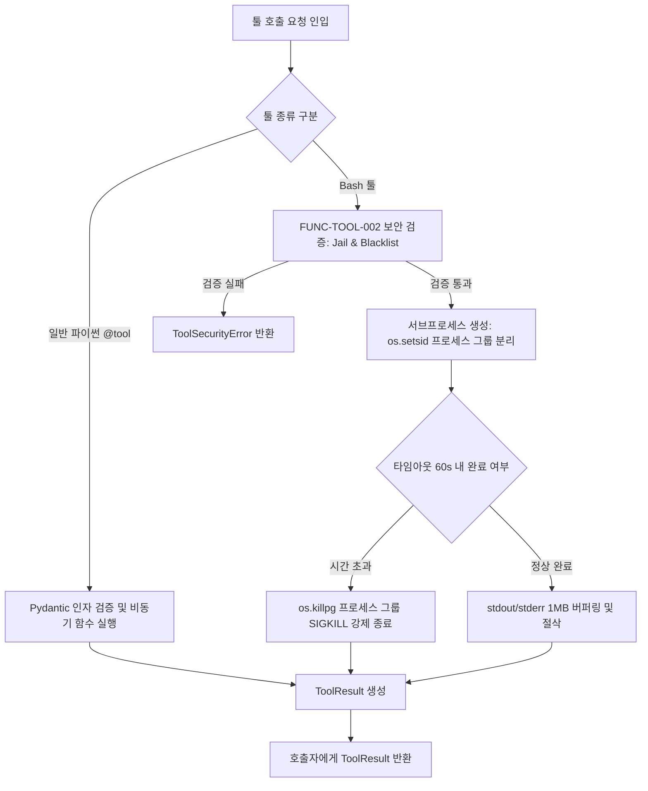

# [archon] 툴 엔진 상세기능정의서 (Tool Engine Modular FSD)

- **도메인**: 선언적 툴 레지스트리 및 보안 Bash 샌드박스 실행 엔진
- **작성자**: 기획 명세 작성가 (`spec-writer`)
- **문서 버전**: v1.0
- **상태**: Approved

---

## 단위 기능 상세 명세 (단위기능별 7대 상세 명세 완비)

---

### [FUNC-TOOL-001] 보안 Bash 및 툴 실행 엔진 (`ToolRegistry`, `@tool`)

#### 0. 대응 요구사항 및 인수 판정 기준 바인딩 (Requirements & Acceptance Criteria Binding)
- **대응 요구사항 ID**: `REQ-TOOL-001` (보안 Bash 및 툴 실행 엔진)
- **정상 판정 기준 (Happy Path)**:
  - `@tool` 데코레이터를 적용한 임의의 파이썬 함수를 `ToolRegistry`에 등록하고, LLM 툴 호출 규격에 맞는 OpenAPI/JSON Schema 메타데이터를 자동 생성해야 한다.
  - 내장 `BashTool` 실행 시 허용된 작업 디렉토리(`cwd`) 내에서 정상 명령(`pytest`, `git status` 등)을 실행하고 종료 코드, 표준 출력, 표준 에러를 캡처하여 `ToolResult`로 반환해야 한다.
- **예외/실패 판정 기준 (Edge/Exception Path)**:
  - 명령 실행 시간이 `command_timeout`(기본 60초)을 초과할 경우 `os.killpg`를 호출하여 하위 프로세스 그룹 전체를 즉시 강제 종료하고 `CommandTimeoutError` (`ERR_TOOL_TIMEOUT`)를 반환해야 한다.
  - 출력 버퍼가 1MB를 초과하면 버퍼 오버플로우 방지를 위해 앞부분 1MB만 보존하고 나머지는 절삭(`is_truncated=True`)해야 한다.
  - 세션에 등록되지 않은 도구 호출 시 즉시 `ToolNotFoundError` (`ERR_TOOL_NOT_FOUND`)를 반환해야 한다.
- **단위 테스트 검증 조건 (TDD Target)**:
  - `@tool` 함수 20종 스키마 자동 추출 검증 통과율 $100\%$.
  - 60초 초과 슬립 명령 강제 종료 후 좀비 프로세스 잔존 $0\text{건}$ 검증.

#### 1. 기본 정보
- **기능명**: 보안 Bash 및 툴 실행 엔진 (`ToolRegistry`, `@tool`)
- **기능 ID**: `FUNC-TOOL-001`
- **대응 요구사항 ID**: `REQ-TOOL-001`
- **대상 모듈 코드**: `MOD-TOOL-001`
- **우선순위**: Must Have
- **관련 액터 (Actor)**: 메인 에이전트, 서브에이전트

#### 2. 사전 조건 (Pre-conditions)
1. 실행 대상 툴이 세션 `ToolRegistry`에 등록되어 있거나 내장 `BashTool`이 활성화된 상태.
2. `FUNC-TOOL-002`의 보안 검증(작업 디렉토리 감금 및 블랙리스트 검사)을 통과한 상태.

#### 3. 사용자 인터랙션 및 시스템 동작 흐름과 플로우차트 (Step-by-Step Flow & Flowchart)

1. 에이전트가 툴 호출 요청(예: `tool="bash", command="pytest tests/"`)을 전달합니다.
2. 시스템은 파이썬 함수 기반 도구인 경우 인자 유효성을 Pydantic 모델로 검증한 후 직접 비동기 호출합니다.
3. `BashTool` 실행 요청인 경우:
   - `FUNC-TOOL-002` 보안 검증 통과 후 `asyncio.create_subprocess_shell`로 서브프로세스를 생성합니다.
   - 프로세스 그룹 분리(`preexec_fn=os.setsid`)를 적용하여 독립 세션을 생성합니다.
4. 비동기 타이머(`timeout_seconds`, 기본 60.0초) 동안 대기하며, 시간 초과 시 `os.killpg`로 자식 프로세스 트리를 강제 종료(SIGKILL)합니다.
5. 표준 출력(`stdout`)과 표준 에러(`stderr`) 스트림을 수집하고, 출력 크기가 1MB를 초과하면 앞부분 1MB만 버퍼링 후 절삭(Truncate) 처리하여 `ToolResult`로 반환합니다.



#### 4. 데이터 항목 명세 (Data Elements - 8대 표준 컬럼)

| 항목명 | 입출력 구분 | UI/호출 타입 | 필수 여부 | 데이터 타입 / 제약 | 기본값 | 유효성 검증 규칙 (Validation) | 노출/수정 조건 |
| :--- | :---: | :--- | :---: | :--- | :---: | :--- | :--- |
| `tool_name` | 호출 인자 | String | 필수 | String / 등록된 툴 식별자 | - | 영문 소문자, 숫자, 밑줄 | 항상 필수 |
| `arguments` | 호출 인자 | Dict | 필수 | `Dict[str, Any]` | `{}` | JSON 직렬화 가능 딕셔너리 | 항상 필수 |
| `timeout_seconds` | 설정 인자 | Float | 선택 | Float / 1.0 ~ 300.0 (초) | `60.0` | $1.0 \le \text{timeout} \le 300.0$ | 항상 오버라이드 가능 |
| `max_output_bytes` | 설정 인자 | Integer | 선택 | Integer / 1,024 ~ 5,242,880 | `1,048,576` (1MB) | $1\text{KB} \le \text{bytes} \le 5\text{MB}$ | 시스템 설정 |
| `exit_code` | 반환 속성 | Integer | 필수 | Integer | `0` | 프로세스 종료 코드 (-1: 타임아웃) | 항상 반환 |
| `stdout` | 반환 속성 | String | 필수 | String (UTF-8 텍스트) | `""` | 표준 출력 스트림 | 항상 반환 |
| `stderr` | 반환 속성 | String | 필수 | String (UTF-8 텍스트) | `""` | 표준 에러 스트림 | 항상 반환 |
| `is_truncated` | 반환 속성 | Boolean | 필수 | Boolean | `False` | 1MB 초과 절삭 발생 시 True | 항상 반환 |

#### 5. 비즈니스 규칙 (Business Rules)
- **BR-TOOL-001-1**: 파이썬 일반 함수는 `@tool` 데코레이터를 적용하면 타입 힌트와 Docstring을 기반으로 JSON Schema가 자동 추출되어 LLM에 전달되어야 합니다.
- **BR-TOOL-001-2**: 서브프로세스 실행 시 반드시 `os.setsid`를 사용하여 독립 프로세스 그룹을 생성해야 하며, 타임아웃 발생 시 메인 프로세스뿐만 아니라 파생된 모든 자식 프로세스를 `os.killpg`로 완전 수거해야 합니다.
- **BR-TOOL-001-3**: 콘솔 출력은 무제한 메모리 적재를 금지하며 엄격히 1MB 한도를 초과할 때 즉시 스트림을 닫고 절삭 플래그를 설정해야 합니다.

#### 6. 예외 처리 및 엣지 케이스 (Edge Cases & Exception Handling)

| 발생 상황 (Edge Case Scenario) | 시스템 처리 방식 | 사용자 안내 메시지 / 예외 |
| :--- | :--- | :--- |
| 명령어 출력이 100MB 이상 쏟아지는 경우 | 1MB(1,048,576 바이트)까지만 읽고 스트림을 닫은 뒤 `is_truncated=True` 설정 | 정상 반환하되 `[TRUNCATED: Output exceeded 1MB]` 추가 |
| 무한 루프(`while true; do ...`) 스크립트 실행 시 | `timeout_seconds`(60s) 경과 즉시 SIGKILL 발행 후 `exit_code=-1` 반환 | `ToolResult(exit_code=-1, stderr="Command timed out after 60.0s and was killed")` |
| 미등록 툴 식별자 호출 인입 시 | 프로세스 실행 없이 즉시 에러 반환 | `ToolNotFoundError: Tool 'unknown_tool' is not registered in ToolRegistry` |

#### 7. 비즈니스 에러 코드 매핑

| 비즈니스 에러 코드 | 발생 원인 | 예외 클래스 | 대응 가이드 |
| :--- | :--- | :--- | :--- |
| `ERR_TOOL_TIMEOUT` | 도구 실행 제한 시간 초과 (60초) | `ToolTimeoutError` | timeout_seconds 설정 상향 또는 명령어 분할 |
| `ERR_TOOL_NOT_FOUND` | 미등록 툴 호출 시도 | `ToolNotFoundError` | ToolRegistry 등록 여부 점검 |
| `ERR_TOOL_EXECUTION_FAILED` | 파이썬 도구 내부 런타임 오류 | `ToolExecutionError` | 도구 함수 코드 로직 및 인자 검증 |

---

### [FUNC-TOOL-002] 작업 디렉토리 감금 및 위험 명령어 블랙리스트 차단기 (Directory Jail & Dangerous Command Blocker)

#### 0. 대응 요구사항 및 인수 판정 기준 바인딩 (Requirements & Acceptance Criteria Binding)
- **대응 요구사항 ID**: `REQ-TOOL-001` (보안 Bash 및 툴 실행 엔진)
- **정상 판정 기준 (Happy Path)**:
  - 명령어 문자열 및 실행 대상 파일 경로가 허용된 작업 디렉토리(`working_directory`) 내부에 속하고, 위험 명령어 패턴이 없는 경우 정상 검증 통과(`True`)를 판정해야 한다.
- **예외/실패 판정 기준 (Edge/Exception Path)**:
  - 실행 커맨드에 위험 명령어 블랙리스트(`rm -rf /`, `sudo`, `mkfs`, 포크 폭탄 등) 정규식 매칭 시 즉시 `DangerousCommandError` (`ERR_TOOL_COMMAND_BLOCKED`)를 발생시키고 실행을 거부해야 한다.
  - `cd /` 또는 `../../` 등을 통해 작업 디렉토리 상위로 탈출을 시도하는 경로는 `PathTraversalError` (`ERR_TOOL_DIRECTORY_ESCAPE`)로 차단해야 한다.
- **단위 테스트 검증 조건 (TDD Target)**:
  - 위험 명령어 50종 모의 주입 시 차단율 $100\%$ (완전 차단).
  - 작업 디렉토리 탈출 시도 경로 20종 모의 주입 시 차단율 $100\%$.

#### 1. 기본 정보
- **기능명**: 작업 디렉토리 감금 및 위험 명령어 블랙리스트 차단기
- **기능 ID**: `FUNC-TOOL-002`
- **대응 요구사항 ID**: `REQ-TOOL-001`
- **대상 모듈 코드**: `MOD-TOOL-002`
- **우선순위**: Must Have
- **관련 액터 (Actor)**: 보안 샌드박스 가드, Bash 도구 엔진

#### 2. 사전 조건 (Pre-conditions)
1. 세션에 허용된 작업 디렉토리 절대 경로(`working_directory`)가 유효하게 지정된 상태.

#### 3. 사용자 인터랙션 및 시스템 동작 흐름과 플로우차트 (Step-by-Step Flow & Flowchart)

1. `BashSecurityGuard.validate_command(command, working_directory)`를 호출합니다.
2. **디렉토리 감금(Jail) 검증**:
   - `cd` 명령어 인자 및 커맨드 내 경로 토큰들을 절대 경로로 정규화(`os.path.realpath`)합니다.
   - 정규화된 경로가 `working_directory`로 시작하지 않거나 상위 경로를 가리키면 `ToolSecurityError`를 발생시킵니다.
3. **위험 명령어 블랙리스트 검증**:
   - 사전 컴파일된 보안 정규식 세트(`_DANGEROUS_PATTERNS`)를 명령어 문자열에 순차 매칭합니다.
   - 매칭된 금지 패턴이 1건이라도 존재하면 `ToolSecurityError`를 발생시킵니다.
4. 모든 검증을 통과하면 실행 승인(`True`)을 반환합니다.

```mermaid
flowchart TD
    A[validate_command(cmd, cwd) 호출] --> B{작업 디렉토리 Jail 탈출 검사}
    B -- 상위 디렉토리 탈출 시도 (cd /, ../..) --> C[ToolSecurityError: Directory Escape]
    B -- 정상 CWD 내부 --> D{위험 명령어 블랙리스트 정규식 매칭}
    D -- 매칭 성공 (rm -rf, sudo, mkfs 등) --> E[ToolSecurityError: Dangerous Command Blocked]
    D -- 매칭 실패 (안전한 명령) --> F[검증 통과: 서브프로세스 실행 승인]
```

#### 4. 데이터 항목 명세 (Data Elements - 8대 표준 컬럼)

| 항목명 | 입출력 구분 | UI/호출 타입 | 필수 여부 | 데이터 타입 / 제약 | 기본값 | 유효성 검증 규칙 (Validation) | 노출/수정 조건 |
| :--- | :---: | :--- | :---: | :--- | :---: | :--- | :--- |
| `command` | 입력 인자 | String | 필수 | String / 단일 셸 명령어 | - | 공백 제외 1자 이상 | 항상 필수 |
| `working_directory`| 입력 인자 | Path String | 필수 | String / CWD 절대 경로 | - | 존재하는 유효한 절대 경로 | 항상 필수 |
| `is_safe` | 반환 속성 | Boolean | 필수 | Boolean | `True` | 보안 검증 통과 시 True | 항상 반환 |
| `blocked_pattern` | 상태 속성 | Optional | 선택 | String | `None` | 매칭된 위험 정규식 패턴 | 차단 시 반환 |
| `violation_type` | 상태 속성 | Optional | 선택 | Enum ('JAIL_ESCAPE', 'DANGEROUS_CMD') | `None` | 보안 위반 유형 | 차단 시 반환 |
| `blacklist_rules` | 설정 속성 | List | 필수 | List[String] (정규식) | 5종 기본 규칙 | 사전 컴파일된 정규식 목록 | 시스템 설정 |

#### 5. 비즈니스 규칙 (Business Rules)
- **BR-TOOL-002-1**: 다음 5대 위험 패턴은 예외 없이 100% 차단되어야 합니다:
  - 파괴적 삭제: `\brm\s+-[rfRF]*\s+[/~]`
  - 권한 상승: `\bsudo\b`, `\bsu\b`, `\bchown\b`, `\bchmod\s+[0-7]{3,4}\s+[/~]`
  - 디스크 직접 조작: `\bmkfs\b`, `\bdd\b`, `\bfdisk\b`
  - 시스템 제어: `\bshutdown\b`, `\breboot\b`, `\binit\s+[06]\b`
  - 포크 폭탄: `:\(\)\s*\{\s*:\|:&\s*\};:`
- **BR-TOOL-002-2**: 파일시스템 탈출 판정은 심볼릭 링크를 추적한 실제 물리 경로(`os.path.realpath`)를 기준으로 판정하여 심볼릭 링크 우회 공격을 방지합니다.

#### 6. 예외 처리 및 엣지 케이스 (Edge Cases & Exception Handling)

| 발생 상황 (Edge Case Scenario) | 시스템 처리 방식 | 사용자 안내 메시지 / 예외 |
| :--- | :--- | :--- |
| `rm -rf /` 등 파괴적 명령어 실행 시도 시 | 정규식 사전 검증에서 즉시 차단하고 보안 위반 기록 | `ToolSecurityError: Command blocked by security policy: pattern 'rm -rf' is prohibited` |
| `cd ../../../etc` 등 작업 디렉토리 탈출 시도 시 | 절대 경로 비교를 통해 CWD 외부 참조 즉시 차단 | `ToolSecurityError: Command attempts to escape working directory: /etc` |
| `sudo apt update` 등 관리자 권한 상승 명령 시도 시 | 즉시 차단하고 보안 이벤트 로깅 | `ToolSecurityError: Privilege escalation command 'sudo' is strictly forbidden` |

#### 7. 비즈니스 에러 코드 매핑

| 비즈니스 에러 코드 | 발생 원인 | 예외 클래스 | 대응 가이드 |
| :--- | :--- | :--- | :--- |
| `ERR_TOOL_COMMAND_BLOCKED` | 보안 블랙리스트 명령어 감지 | `ToolSecurityError` | 명령어 패턴 확인 및 안전한 명령어로 대체 |
| `ERR_TOOL_DIRECTORY_ESCAPE` | 작업 디렉토리 감금 범위 탈출 시도 | `ToolSecurityError` | working_directory 내부 상대 경로 사용 |
