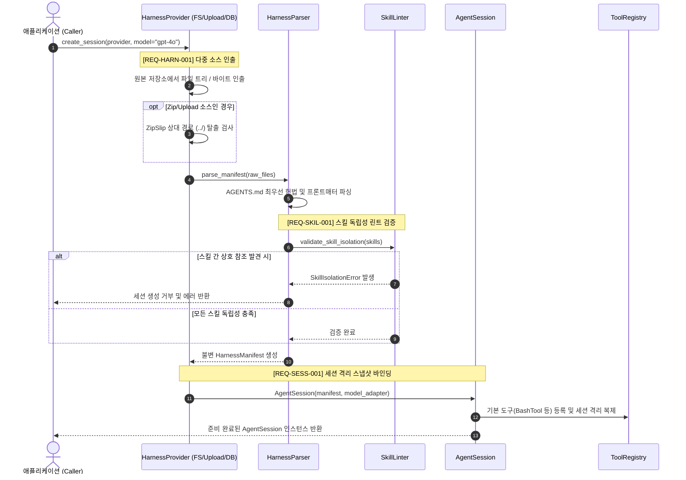
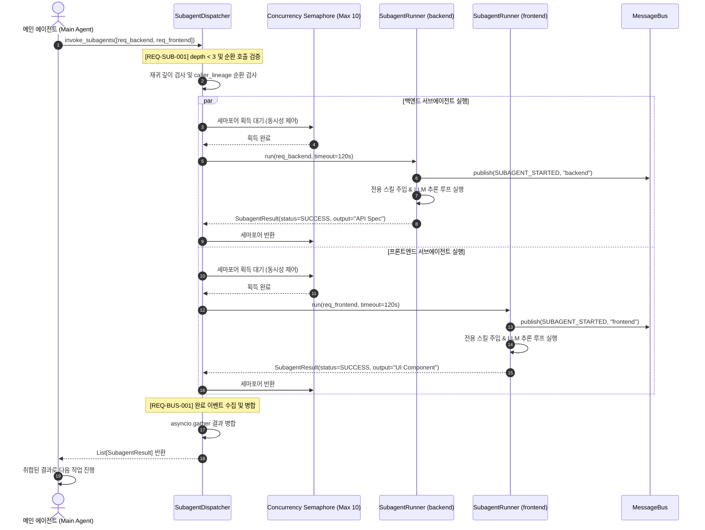
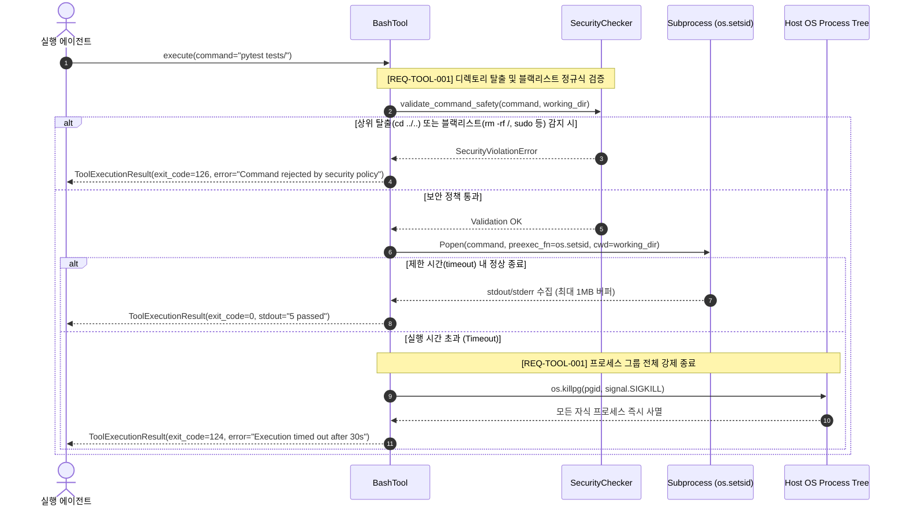

# [archon] 백엔드 시스템 및 공개 SDK 인터페이스 설계서 (System Design & Public SDK Specification)

- **작성일자**: 2026-09-23
- **작성자**: 백엔드 시스템 디자이너 (`system-designer`)
- **문서 버전**: v1.1 (PRD REQ 추적성 완비)
- **상태**: Approved

---

## 1. 설계 배경 및 아키텍처 의사결정 (Context & Architecture Decisions)

### 1.1 배경 및 문제의식 (Problem Statement)

LLM 기반 자율 에이전트(Autonomous Agents)가 프로덕션에 도입되면서, 단일 프롬프트에 모든 역할을 밀어 넣는 모놀리식 에이전트는 심각한 한계에 직면했습니다. 프롬프트가 길어질수록 컨텍스트 윈도우가 오염되고, 지시문 충돌로 인해 할루시네이션과 제어 불능 상태가 빈번해집니다.

이를 극복하기 위해 에이전트를 전문 도메인 단위(기획, 아키텍처, 구현, 리뷰, QA)로 분할하고, 표준화된 규칙 파일(`AGENTS.md`)과 거버넌스 디렉토리(`.agents/rules`, `.agents/skills`, `.agents/subagents`)를 통해 에이전트의 행동을 엄격히 규정하는 **하네스 엔지니어링(Harness Engineering)** 방법론이 등장했습니다.

그러나 기존 에이전트 라이브러리들은 다음과 같은 실무적 결함을 가지고 있습니다:
1. **정적 코드 결합**: 에이전트 시스템 프롬프트와 툴이 파이썬 클래스 코드에 하드코딩되어 있어, 규칙 파일 수정 시마다 애플리케이션 전체를 재배포해야 합니다.
2. **동적 테넌트 격리 부재**: 멀티 테넌트 환경에서 세션마다 서로 다른 프로젝트 하네스(로컬 파일, Zip 업로드, DB 레코드)를 동적으로 바인딩할 수 있는 추상화 레이어가 없습니다.
3. **취약한 오케스트레이션 및 툴 보안**: 메인 에이전트가 복수의 전문 서브에이전트를 비동기 병렬(`asyncio.gather`)로 안전하게 분기/취합하는 표준 규약이 없고, 에이전트가 실행하는 Bash 툴의 상위 디렉토리 탈출(Jailbreak)이나 파괴적 명령어를 차단하는 샌드박스 정책이 부재합니다.

`archon`은 마크다운 기반 하네스 거버넌스를 퍼스트 클래스로 수용하고, 세션 단위 다중 소스 동적 바인딩과 안전한 서브에이전트 비동기 동시 실행을 제공하는 **파이썬 에이전트 코어 SDK**입니다.

### 1.2 핵심 아키텍처 결정 사항 (Architecture Decisions & Trade-offs)

| 결정 항목 | 채택한 방식 | 고려했던 대안 | 선택 이유 및 엔지니어링 트레이드오프 |
| :--- | :--- | :--- | :--- |
| **하네스 바인딩 방식** | **`HarnessProvider` 추상화 및 런타임 스냅샷 컴파일** | 정적 파이썬 모듈 임포트 | • 사용자가 로컬 디렉토리(`FS`), 웹 업로드 압축파일(`Upload`), 데이터베이스(`DB`) 등 어떤 저장소에 하네스를 보관하든, 세션 시작 시 즉시 불변 스냅샷으로 정규화하여 바인딩함.<br/>• *트레이드오프*: 세션 시작 시 파일 파싱 오버헤드가 발생하나, 캐싱과 Pydantic 스키마 검증 최적화를 통해 20ms 이내로 억제함. |
| **서브에이전트 오케스트레이션** | **인프로세스 비동기 이벤트 루프 (`asyncio.gather` + `MessageBus`)** | 분산 큐 기반 분기 (Celery, Kafka, Redis) | • 단일 프로세스/컨테이너 환경에서 서브에이전트 호출 지연을 1ms 미만으로 극소화하고 의존성 구성을 단순화함.<br/>• *트레이드오프*: 프로세스 크래시 시 실행 중인 서브에이전트 인메모리 상태가 유실되므로, 체크포인트 기록 및 타임아웃 격리가 필수적임. |
| **도구 샌드박스 격리** | **서브프로세스 감금 (Chdir/Jail) + 블랙리스트 + 프로세스 그룹 (`os.setsid`)** | Docker 컨테이너 격리 | • 컨테이너 스폰 오버헤드(수 초) 없이 수 밀리초 내에 툴을 실행할 수 있어 로컬 개발 및 빠른 TDD 루프에 최적임.<br/>• `preexec_fn=os.setsid`와 `os.killpg(SIGKILL)`을 적용하여 타임아웃 시 자식 프로세스 트리를 강제 정리함.<br/>• *트레이드오프*: 루트 권한을 탈취당한 호스트 공격까지 완전 격리하지는 못하므로, 커널 격리가 필요한 환경은 v2 Docker 격리기로 위임. |
| **스킬 주입 정책** | **단일 스킬 격리 (Skill Isolation) 및 프로그레시브 주입** | 모든 스킬 전역 병합 (Global Context Dump) | • 스킬 파일 간 상호 참조를 정적 린터로 원천 차단하고, 서브에이전트 실행 시 필요한 스킬만 온디맨드로 주입하여 프롬프트 토큰 낭비와 컨텍스트 오염을 방지함. |

---

## 2. 6대 모듈 상세 패키지 구조 및 요구사항 매핑 (Package Architecture & REQ Mapping)

### 2.1 패키지 디렉터리 레이아웃

```
archon/
├── __init__.py                  # 최상위 공개 엔트리포인트 (create_session, Agent, AgentSession 등)
├── core/                        # 코어 런타임 엔진
│   ├── __init__.py
│   ├── agent.py                 # Agent (자율 실행 주체)
│   ├── session.py               # AgentSession (세션 라이프사이클 및 리소스 관리)
│   ├── context.py               # ExecutionContext (불변 실행 컨텍스트 스냅샷)
│   ├── step.py                  # StepResult (에이전트 단계별 실행 결과 모델)
│   └── event_loop.py            # EventLoop (반응형 턴 실행기)
├── harness/                     # 하네스 소스 로더 및 파서
│   ├── __init__.py
│   ├── provider.py              # HarnessProvider (추상 기저 프로바이더)
│   ├── fs_provider.py           # FileSystemHarnessProvider (로컬 디렉토리)
│   ├── memory_provider.py       # InMemoryHarnessProvider (Zip/Tar 인메모리 압축 해제)
│   ├── db_provider.py           # DatabaseHarnessProvider (RDBMS/NoSQL 테넌트 하네스)
│   ├── parser.py                # HarnessParser (AGENTS.md 및 프론트매터 검증)
│   └── manifest.py              # HarnessManifest (정규화된 하네스 명세 스냅샷)
├── subagents/                   # 서브에이전트 오케스트레이션
│   ├── __init__.py
│   ├── definition.py            # SubagentDefinition (서브에이전트 메타데이터 규격)
│   ├── dispatcher.py            # SubagentDispatcher (invoke_subagents 병렬 오케스트레이터)
│   ├── runner.py                # SubagentRunner (격리 실행기)
│   └── bus.py                   # MessageBus (반응형 이벤트 버스)
├── tools/                       # 도구 실행 엔진 및 보안 샌드박스
│   ├── __init__.py
│   ├── base.py                  # BaseTool (도구 추상 클래스)
│   ├── bash.py                  # BashTool (디렉토리 감금 및 블랙리스트 샌드박스)
│   ├── registry.py              # ToolRegistry (세션별 격리 도구 레지스트리)
│   ├── decorator.py             # @tool 선언적 데코레이터
│   └── result.py                # ToolExecutionResult (표준 도구 실행 결과 모델)
├── skills/                      # 스킬 거버넌스 및 온디맨드 인젝터
│   ├── __init__.py
│   ├── definition.py            # SkillDefinition (스킬 명세 모델)
│   ├── registry.py              # SkillRegistry (스킬 카탈로그)
│   ├── loader.py                # SkillLoader (스킬 정적 분석 및 린터)
│   └── exceptions.py            # SkillIsolationError 등 스킬 도메인 예외
├── models/                      # 멀티 LLM 모델 어댑터
│   ├── __init__.py
│   ├── base.py                  # BaseModelAdapter (추상 어댑터)
│   ├── mock.py                  # MockModelAdapter (테스트용 결정론적 모의 어댑터)
│   ├── openai_adapter.py        # OpenAIAdapter (OpenAI SDK 직접 연동)
│   └── litellm_adapter.py       # LiteLLMAdapter (100+ 멀티 LLM 통합 어댑터)
└── exceptions.py                # 패키지 표준 도메인 예외 계층
```

### 2.2 6대 모듈별 상세 역할 및 구현 대상 요구사항 (Module Responsibilities & Traceability)

| 모듈 경로 | 구현 대상 요구사항 (PRD / FSD) | 핵심 클래스 / 인터페이스 | 상세 역할 및 구현 엔지니어링 명세 |
| :--- | :--- | :--- | :--- |
| `archon/core/` | **`REQ-SESS-001`**<br/>**`REQ-BUS-001`**<br/>**`REQ-VIS-001`**<br/>(`FUNC-CORE-001`, `FUNC-CORE-002`, `FUNC-SESS-001`) | `Agent`<br/>`AgentSession`<br/>`ExecutionContext`<br/>`StepResult`<br/>`EventLoop` | • **세션 라이프사이클 제어**: 세션 생성, 타스크 실행, 타임아웃 감시 및 리소스 정리(`close`) 관리.<br/>• **불변 컨텍스트 스냅샷**: 각 실행 턴마다 읽기 전용 `ExecutionContext` 스냅샷 주입.<br/>• **턴 실행 루프**: LLM 추론 $\rightarrow$ 툴 호출 파싱 $\rightarrow$ 툴 실행 $\rightarrow$ 피드백 루프 구동.<br/>• **실행 궤적 로깅**: 토큰 소모량, 소요시간, 툴 입출력을 `StepResult`에 구조화 기록. |
| `archon/harness/` | **`REQ-HARN-001`**<br/>**`REQ-SESS-001`**<br/>(`FUNC-HARN-001`, `FUNC-HARN-002`, `FUNC-SESS-001`) | `HarnessProvider`<br/>`FileSystemHarnessProvider`<br/>`InMemoryHarnessProvider`<br/>`DatabaseHarnessProvider`<br/>`HarnessParser`<br/>`HarnessManifest` | • **다중 소스 지원**: 로컬 FS, Zip 업로드 바이너리(ZipSlip 상대 경로 탈출 방어), DB 테이블에서 하네스 인출.<br/>• **마크다운/YAML 정규화**: `AGENTS.md` 및 `.agents/` 내 프론트매터를 Pydantic 기반으로 파싱 및 검증.<br/>• **불변 매니페스트**: 컴파일된 규칙, 스킬, 서브에이전트 정의를 `HarnessManifest`로 동결(Freeze). |
| `archon/subagents/` | **`REQ-SUB-001`**<br/>**`REQ-BUS-001`**<br/>(`FUNC-SUB-001`, `FUNC-SUB-002`, `FUNC-CORE-002`) | `SubagentDefinition`<br/>`SubagentDispatcher`<br/>`SubagentRunner`<br/>`MessageBus` | • **비동기 병렬 호출**: `invoke_subagents`를 통한 복수 서브에이전트 동시 실행 (`asyncio.gather`).<br/>• **거버넌스 한도 제어**: 최대 재귀 깊이(`max_depth=3`) 제한, 불변 계통 목록 기반 순환 호출 체인 탐지 및 차단.<br/>• **동시성 세마포어**: 단일 세션 내 동시 실행 서브에이전트 수(기본 10)를 제어하여 리소스 고갈 방지. |
| `archon/tools/` | **`REQ-TOOL-001`**<br/>(`FUNC-TOOL-001`, `FUNC-TOOL-002`) | `BaseTool`<br/>`BashTool`<br/>`ToolRegistry`<br/>`@tool`<br/>`ToolExecutionResult` | • **도구 레지스트리**: 함수 기반 `@tool` 데코레이터를 통한 JSON 스키마 자동 추출 및 세션 격리 등록.<br/>• **보안 Bash 샌드박스**: 지정된 작업 디렉토리 감금(Jail), 상위 탈출 차단, 파괴적 명령어 블랙리스트 정규식 검증.<br/>• **프로세스 안전 회수**: `os.setsid` 기반 프로세스 그룹 분리 및 타임아웃 시 `SIGKILL` 전파.<br/>• **출력 버퍼 보호**: 1MB 초과 시 안전 절삭(Truncation). |
| `archon/skills/` | **`REQ-SKIL-001`**<br/>(`FUNC-SKIL-001`, `FUNC-SKIL-002`) | `SkillDefinition`<br/>`SkillRegistry`<br/>`SkillLoader` | • **스킬 독립성 강제**: 스킬 본문 내 타 스킬 상호 참조 및 결합을 정적 린터로 탐지하여 위반 시 로드 거부.<br/>• **점진적 온디맨드 주입**: 서브에이전트가 선언한 필수 스킬만 프롬프트에 주입하여 토큰 낭비 방지. |
| `archon/models/` | **`REQ-MOD-001`**<br/>(`FUNC-MOD-001`, `FUNC-MOD-002`) | `BaseModelAdapter`<br/>`MockModelAdapter`<br/>`OpenAIAdapter`<br/>`LiteLLMAdapter` | • **멀티 벤더 추상화**: OpenAI, Anthropic, Gemini, 로컬 vLLM 등 통일된 스트리밍 및 툴 호출 규격 지원.<br/>• **구조화 출력 파싱**: Pydantic v2 모델 기반 구조화 출력 역직렬화.<br/>• **단위 테스트 격리**: 네트워크 비용 없는 결정론적 시나리오 테스트용 `MockModelAdapter` 기본 탑재. |

---

## 3. 핵심 클래스 구조 설계 (Mermaid Class Diagram)

> [!NOTE]
> `archon`은 데이터베이스 영속 테이블을 서빙하는 백엔드 애플리케이션이 아닌, 에이전트 런타임 및 하네스 오케스트레이션 SDK입니다. 따라서 RDBMS ERD 대신 6대 모듈 간의 객체 모델, 인터페이스 상속, 의존 관계를 정의하는 Mermaid 클래스 다이어그램(`classDiagram`)으로 구조를 명세합니다.

```mermaid
classDiagram
    class AgentSession {
        +session_id: str
        +harness_manifest: HarnessManifest
        +tool_registry: ToolRegistry
        +skill_registry: SkillRegistry
        +message_bus: MessageBus
        +model_adapter: BaseModelAdapter
        -_is_closed: bool
        +run(prompt: str, context: Optional[dict]) StepResult
        +stream(prompt: str, context: Optional[dict]) AsyncIterator~str~
        +invoke_subagents(requests: List[SubagentRequest]) List[SubagentResult]
        +close() void
    }

    class ExecutionContext {
        +session_id: str
        +agent_name: str
        +depth: int
        +caller_lineage: List~str~
        +variables: dict~str, Any~
        +manifest: HarnessManifest
        +create_child(subagent_name: str) ExecutionContext
    }

    class HarnessProvider {
        <<abstract>>
        +load() HarnessManifest*
    }

    class FileSystemHarnessProvider {
        +base_path: Path
        +load() HarnessManifest
    }

    class InMemoryHarnessProvider {
        +archive_bytes: bytes
        +load() HarnessManifest
        -_extract_safe(zip_file: ZipFile) dict
    }

    class DatabaseHarnessProvider {
        +db_session: Any
        +tenant_id: str
        +load() HarnessManifest
    }

    class HarnessManifest {
        +constitution: str
        +rules: dict~str, str~
        +skills: dict~str, SkillDefinition~
        +subagents: dict~str, SubagentDefinition~
        +metadata: dict~str, Any~
    }

    class SubagentDispatcher {
        +concurrency_limit: int
        -_semaphore: asyncio.Semaphore
        +dispatch(session: AgentSession, requests: List~SubagentRequest~, context: ExecutionContext) List~SubagentResult~
        -_validate_depth_and_cycle(subagent_name: str, context: ExecutionContext) void
    }

    class SubagentDefinition {
        +name: str
        +description: str
        +system_prompt: str
        +allowed_tools: List~str~
        +required_skills: List~str~
        +max_turns: int
        +timeout_seconds: float
    }

    class ToolRegistry {
        -_tools: dict~str, BaseTool~
        +register(tool: BaseTool) void
        +register_func(func: Callable, name: Optional~str~) BaseTool
        +get(name: str) BaseTool
        +get_schemas() List~dict~
        +clone() ToolRegistry
    }

    class BaseTool {
        <<abstract>>
        +name: str
        +description: str
        +parameters_schema: dict
        +execute(**kwargs) ToolExecutionResult*
    }

    class BashTool {
        +working_directory: Path
        +timeout_seconds: float
        +blacklist_patterns: List~Pattern~
        +execute(command: str) ToolExecutionResult
        -_validate_command_safety(command: str) void
        -_run_in_process_group(command: str) Tuple~int, str, str~
    }

    class SkillRegistry {
        -_skills: dict~str, SkillDefinition~
        +register(skill: SkillDefinition) void
        +get(name: str) SkillDefinition
        +get_prompt_injection(skill_names: List~str~) str
    }

    class SkillDefinition {
        +name: str
        +description: str
        +instructions: str
        +validate_isolation() void
    }

    class BaseModelAdapter {
        <<abstract>>
        +generate(messages: List~dict~, tools: List~dict~) StepResult*
        +stream_generate(messages: List~dict~) AsyncIterator~str~*
    }

    class OpenAIAdapter {
        +client: Any
        +model_name: str
        +generate(messages: List~dict~, tools: List~dict~) StepResult
    }

    class LiteLLMAdapter {
        +model_name: str
        +generate(messages: List~dict~, tools: List~dict~) StepResult
    }

    class MockModelAdapter {
        +canned_responses: List~StepResult~
        +generate(messages: List~dict~, tools: List~dict~) StepResult
    }

    HarnessProvider <|-- FileSystemHarnessProvider
    HarnessProvider <|-- InMemoryHarnessProvider
    HarnessProvider <|-- DatabaseHarnessProvider
    HarnessProvider ..> HarnessManifest : produces

    AgentSession "1" *-- "1" HarnessManifest : holds
    AgentSession "1" *-- "1" ToolRegistry : manages
    AgentSession "1" *-- "1" SkillRegistry : manages
    AgentSession "1" *-- "1" BaseModelAdapter : uses
    AgentSession ..> SubagentDispatcher : delegates parallel calls

    ToolRegistry "1" o-- "*" BaseTool : registers
    BaseTool <|-- BashTool

    SkillRegistry "1" o-- "*" SkillDefinition : manages
    BaseModelAdapter <|-- OpenAIAdapter
    BaseModelAdapter <|-- LiteLLMAdapter
    BaseModelAdapter <|-- MockModelAdapter
```



---

## 4. 3대 핵심 시퀀스 다이어그램 및 요구사항 검증 (Sequence Diagrams)

### 4.1 시퀀스 1: 세션 초기화 및 다중 소스 하네스 동적 바인딩 흐름
- **검증 및 구현 대상 요구사항**: **`REQ-HARN-001`**, **`REQ-SESS-001`**, **`REQ-SKIL-001`** (`FUNC-HARN-001`, `FUNC-HARN-002`, `FUNC-SESS-001`, `FUNC-SKIL-002`)

호출자가 FS, Upload(Zip), 또는 DB 소스를 지정하여 세션을 초기화할 때, 하네스를 파싱하고 스킬 독립성 검증을 거쳐 격리된 `AgentSession`을 구성하기까지의 흐름입니다.



### 4.2 시퀀스 2: 메인 에이전트의 다중 서브에이전트 비동기 병렬 호출 (`invoke_subagents`)
- **검증 및 구현 대상 요구사항**: **`REQ-SUB-001`**, **`REQ-BUS-001`** (`FUNC-SUB-001`, `FUNC-SUB-002`, `FUNC-CORE-002`)

메인 에이전트가 백엔드와 프론트엔드 등 복수 서브에이전트를 병렬로 분기 실행하고, 동시성 세마포어와 타임아웃을 거쳐 결과를 취합하는 흐름입니다.



### 4.3 시퀀스 3: 보안 Bash 도구 실행 및 위험 명령어 차단 흐름
- **검증 및 구현 대상 요구사항**: **`REQ-TOOL-001`** (`FUNC-TOOL-001`, `FUNC-TOOL-002`)

에이전트가 코드 빌드나 테스트를 위해 Bash 명령을 요청했을 때, 디렉토리 감금 및 블랙리스트를 거쳐 안전하게 실행하고 좀비 프로세스를 방어하는 흐름입니다.



---

## 5. 동시성 제어, 거버넌스 및 샌드박스 정책 (Governance & Security Policies)

### 5.1 서브에이전트 재귀 호출 깊이 및 순환 탐지 정책 (`REQ-SUB-001`)

1. **최대 호출 깊이 (`max_subagent_depth = 3`)**:
   - `Root Main Agent (Depth 0)` $\rightarrow$ `Subagent (Depth 1)` $\rightarrow$ `Nested Subagent (Depth 2)` $\rightarrow$ `Leaf Subagent (Depth 3)`.
   - Depth 3 서브에이전트가 추가로 `invoke_subagents`를 호출하면 `SubagentDepthExceededError`를 발생시키고 실행을 차단하여 무한 포크 폭탄(Fork Bomb)을 방지합니다.
2. **불변 계통 추적 기반 순환 호출 차단 (Cycle Detection)**:
   - 모든 호출 컨텍스트에는 상위 에이전트 목록인 `caller_lineage: tuple[str, ...]`가 불변 튜플로 복제 전달됩니다.
   - 대상 서브에이전트가 이미 `caller_lineage`에 포함되어 있을 경우(예: A $\rightarrow$ B $\rightarrow$ A), 데드락 방지를 위해 즉시 `SubagentCycleDetectedError`를 발생시킵니다.

### 5.2 툴 샌드박스 및 Bash 보안 정책 (`REQ-TOOL-001`)

| 방어 영역 | 상세 통제 규칙 | 위반 시 시스템 동작 |
| :--- | :--- | :--- |
| **디렉토리 감금 (Jail)** | 명령어 실행 전 `Path(working_dir).resolve()`를 기준으로 상대 경로 계산. 명령어 내 `cd ..` 또는 절대 경로 탈출 시도 탐지. | 프로세스 생성 없이 `ToolSecurityError` 즉시 발생. |
| **위험 명령어 차단** | `\brm\s+-[rfRF]*\s+[/~]`, `\bsudo\b`, `\bsu\b`, `\bmkfs\b`, `\bdd\b`, `\bshutdown\b`, `:\(\)\s*\{\s*:\|:&\s*\};:` 정규식 매칭. | `ToolSecurityError` 발생 및 감사 로그(Audit Log) 기록. |
| **프로세스 그룹 격리** | 서브프로세스 기동 시 `preexec_fn=os.setsid`를 전달하여 새로운 Process Group ID(PGID)를 할당. | 타임아웃 시 `os.killpg(pgid, SIGKILL)`로 트리 전체 사멸. |
| **메모리 버퍼 보호** | `stdout` 및 `stderr` 캡처 시 최대 1MB(1,048,576 바이트) 초과 시 읽기 중단. | 끝에 `[TRUNCATED: Output exceeded 1MB]` 접미사 추가. |

### 5.3 스킬 독립성 원칙 (`REQ-SKIL-001`)

- **상호 참조 절대 금지**: 각 `SKILL.md`는 독립된 지침이어야 하며, 다른 스킬 파일의 이름을 호출하거나 참조해서는 안 됩니다.
- **정적 린터(Linter) 검증**: 하네스 로드 시 모든 스킬 텍스트를 검사하여 타 스킬 이름이나 디렉토리 경로가 포함된 경우 `SkillIsolationError`를 발생시키고 세션 초기화를 중단합니다.

---

## 6. 공개 SDK 인터페이스 상세 명세 (Public SDK Specification)

> [!IMPORTANT]
> **OpenAPI 대체 근거**:
> `archon`은 RESTful 웹 엔드포인트를 노출하는 HTTP 서비스가 아니라, 파이썬 기반 에이전트 오케스트레이션 **클라이언트 SDK 패키지**입니다. 따라서 웹 라우트 명세 대신 개발자가 직접 임포트하여 사용하는 Python 공개 API 함수 시그니처와 모델 명세를 상세 기술합니다.

### 6.1 최상위 팩토리 함수 (`archon.create_session`)

```python
def create_session(
    harness: Union[HarnessProvider, Path, str, bytes],
    *,
    model: Union[str, BaseModelAdapter] = "gpt-4o",
    session_id: Optional[str] = None,
    concurrency_limit: int = 10,
    session_timeout: float = 600.0,
    subagent_timeout: float = 120.0,
    working_directory: Optional[Union[Path, str]] = None,
    custom_tools: Optional[Sequence[BaseTool]] = None,
) -> AgentSession:
    """
    하네스 소스를 로드하고 검증하여 격리된 AgentSession 인스턴스를 생성합니다. (대응 REQ-HARN-001, REQ-SESS-001)

    Args:
        harness: HarnessProvider 인스턴스, 로컬 디렉토리 경로(Path/str), 또는 Zip 압축 바이너리(bytes).
        model: 모델 어댑터 인스턴스 또는 LiteLLM 모델 식별 문자열.
        session_id: 세션 고유 식별자 (미지정 시 uuid4 자동 생성).
        concurrency_limit: 단일 세션 내 서브에이전트 최대 동시 실행 수 (기본값: 10).
        session_timeout: 세션 전체 최대 수명 (초 단위, 기본값: 600.0).
        subagent_timeout: 개별 서브에이전트 최대 실행 시간 (초 단위, 기본값: 120.0).
        working_directory: Bash 도구 등의 기본 격리 작업 디렉토리.
        custom_tools: 세션에 추가로 바인딩할 커스텀 도구 목록.

    Returns:
        초기화 완료된 AgentSession 인스턴스.

    Raises:
        HarnessSecurityError: 하네스 압축파일 내 경로 탈출(ZipSlip) 감지 시.
        SkillIsolationError: 스킬 간 상호 참조 등 독립성 위반 감지 시.
        HarnessParseError: AGENTS.md 또는 하네스 프론트매터 파싱 실패 시.
    """
    ...
```

### 6.2 `AgentSession` 인터페이스 명세

```python
class AgentSession:
    session_id: str
    manifest: HarnessManifest
    tool_registry: ToolRegistry
    skill_registry: SkillRegistry

    def run(
        self,
        prompt: str,
        *,
        context: Optional[Mapping[str, Any]] = None,
    ) -> StepResult:
        """
        메인 에이전트를 동기적으로 실행하고 최종 완료 결과를 반환합니다. (대응 REQ-SESS-001, REQ-VIS-001)
        """
        ...

    async def async_run(
        self,
        prompt: str,
        *,
        context: Optional[Mapping[str, Any]] = None,
    ) -> StepResult:
        """
        메인 에이전트를 비동기적으로 실행하고 최종 결과를 반환합니다.
        """
        ...

    async def stream(
        self,
        prompt: str,
        *,
        context: Optional[Mapping[str, Any]] = None,
    ) -> AsyncIterator[str]:
        """
        메인 에이전트의 생성 텍스트 토큰을 실시간 비동기 제너레이터로 스트리밍합니다. (대응 REQ-MOD-001)
        """
        ...

    async def invoke_subagents(
        self,
        requests: Sequence[SubagentRequest],
    ) -> List[SubagentResult]:
        """
        복수의 서브에이전트를 비동기 병렬로 동시 실행하고 결과를 취합하여 반환합니다. (대응 REQ-SUB-001)

        Raises:
            SubagentDepthExceededError: 최대 호출 깊이(3) 초과 시.
            SubagentCycleDetectedError: 부모-자식 순환 호출 체인 감지 시.
            SubagentNotFoundError: 선언되지 않은 서브에이전트 이름 요청 시.
        """
        ...

    def close(self) -> None:
        """세션에 할당된 메시지 버스, 임시 디렉토리 및 열린 리소스를 완전히 해제합니다."""
        ...
```

### 6.3 도구 정의 데코레이터 (`@tool`) 인터페이스

```python
from archon.tools import tool

@tool(name="calculate_vat", description="공급가액에 대한 부가가치세를 계산합니다.")
def calculate_vat(amount: int, rate: float = 0.1) -> int:
    """
    파이썬 타입 힌트를 기반으로 JSON Schema를 자동 추출하여 LLM 도구 호출 규격으로 변환합니다. (대응 REQ-TOOL-001)
    """
    return int(amount * rate)
```

---

## 7. 모듈별 README 작성 가이드라인 (Module README Guidelines)

`archon` 소스 트리의 각 6대 서브패키지에는 해당 도메인의 경계와 책임을 명확히 규정하는 `README.md`가 포함되어야 합니다.

```
archon/<submodule>/README.md 표준 목차 규격:
1. 모듈 개요 및 책임 (Module Scope & Responsibility)
2. 구현 대상 요구사항 (Implemented Requirements: REQ-xxx, FUNC-xxx)
3. 공개 클래스 및 인터페이스 목록 (Public Classes & Interfaces)
4. 타 모듈과의 의존성 제약 (Dependency Rules - 상향 의존 금지)
5. 단위 테스트 실행 가이드 및 주요 엣지 케이스 (Testing Guide)
```

- **`archon/core/README.md`**: 세션 라이프사이클 관리 및 불변 `ExecutionContext` 보존 원칙, 턴 루프 인터페이스 기술. (`REQ-SESS-001`, `REQ-VIS-001`)
- **`archon/harness/README.md`**: FS/Upload/DB 프로바이더 확장법, ZipSlip 방어 원칙, `HarnessManifest` 스냅샷 스키마 기술. (`REQ-HARN-001`, `REQ-SESS-001`)
- **`archon/subagents/README.md`**: 병렬 디스패치 원리, 재귀 깊이(`max_depth=3`) 및 순환 탐지 알고리즘, 세마포어 정책 기술. (`REQ-SUB-001`, `REQ-BUS-001`)
- **`archon/tools/README.md`**: 커스텀 툴 작성법, BashTool 보안 정규식 블랙리스트 및 `os.setsid` 프로세스 그룹 격리 정책 기술. (`REQ-TOOL-001`)
- **`archon/skills/README.md`**: 스킬 독립성 원칙, 정적 린터 검증 규칙 및 온디맨드 프롬프트 주입 메커니즘 기술. (`REQ-SKIL-001`)
- **`archon/models/README.md`**: 멀티 LLM 어댑터 인터페이스 확장법, 단위 테스트 시 `MockModelAdapter` 활용법 기술. (`REQ-MOD-001`)

---

## 8. 현장 엔지니어링 주의사항 및 한계 (Gotchas & Operational Caveats)

실무 개발팀이 `archon`을 프로덕션 및 사내 플랫폼에 도입할 때 반드시 숙지해야 하는 기술적 주의점입니다:

1. **인메모리 이벤트 버스의 프로세스 종속성**:
   - `archon`의 `MessageBus`는 단일 프로세스 인메모리 큐로 동작합니다. 따라서 호스트 컨테이너가 OOM으로 강제 종료되거나 팟(Pod)이 재배포될 경우 실행 중인 서브에이전트의 런타임 상태가 소실됩니다. 세션 수명이 수십 분 이상 지속되는 배치 작업의 경우, 외부 DB 프로바이더를 연동하여 중간 체크포인트를 주기적으로 저장해야 합니다.
2. **서브프로세스 샌드박스의 한계**:
   - `BashTool`의 디렉토리 감금 및 블랙리스트는 일반적인 애플리케이션 빌드/테스트 스크립트의 실수를 방어하는 수준입니다. 컴파일된 바이너리 실행이나 커널 익스플로잇까지 완벽히 차단하는 가상 머신 수준의 격리는 아니므로, 신뢰할 수 없는 외부 임의 코드를 실행해야 하는 환경에서는 Docker 기반 격리 툴을 추가 구성해야 합니다.
3. **CPU 바운드 툴 실행 시 이벤트 루프 블로킹**:
   - 에이전트가 호출하는 파이썬 커스텀 도구가 무거운 연산(CPU-bound)을 동기 함수로 수행할 경우, `archon`의 비동기 이벤트 루프 전체가 일시 정지되어 다른 서브에이전트의 네트워크 I/O가 함께 지연될 수 있습니다. 무거운 작업은 반드시 `asyncio.to_thread`를 통해 별도 워커 스레드로 위임하십시오.
4. **대규모 병렬 호출 시 토큰 버짓 급증**:
   - `invoke_subagents`로 5개 이상의 서브에이전트를 동시 구동할 경우, 각 서브에이전트가 소모하는 입력/출력 토큰이 메인 에이전트의 컨텍스트 예산을 빠르게 잠식할 수 있습니다. 각 서브에이전트 정의(`SubagentDefinition`)에 `max_turns` 및 엄격한 반환 요약 스키마를 강제하는 것을 권장합니다.

---

## 9. 시스템 설계 ➔ PRD 요구사항(REQ) 종합 추적성 매트릭스 (System Design Traceability Matrix)

본 설계서의 모든 아키텍처 컴포넌트, 모듈, 시퀀스 다이어그램 및 거버넌스 정책이 PRD 및 FSD의 요구사항을 어떻게 100% 충족하는지 검증하는 종합 추적성 매트릭스입니다.

| PRD 요구사항 ID | FSD 기능 명세 ID | 우선순위 | 담당 설계 모듈 | 핵심 클래스 및 인터페이스 | 검증 시퀀스 / 설계 메커니즘 | 설계 반영 세부 구현 내용 |
| :--- | :--- | :---: | :--- | :--- | :--- | :--- |
| **`REQ-HARN-001`**<br/>(다중 소스 하네스 프로바이더 및 파서) | `FUNC-HARN-001`<br/>`FUNC-HARN-002` | **Must** | `archon/harness/` | `HarnessProvider`<br/>`FileSystemHarnessProvider`<br/>`InMemoryHarnessProvider`<br/>`DatabaseHarnessProvider`<br/>`HarnessParser`<br/>`HarnessManifest` | **시퀀스 1**<br/>(하네스 동적 바인딩) | • FS, Upload(Zip), DB 3종 프로바이더 추상화<br/>• ZipSlip(`../`) 경로 탈출 공격 감지 시 `HarnessSecurityError` 차단<br/>• `AGENTS.md` 최우선 헌법 및 프론트매터 Pydantic 파싱 |
| **`REQ-SESS-001`**<br/>(세션 단위 동적 바인딩 및 런타임 컴파일) | `FUNC-SESS-001`<br/>`FUNC-CORE-001` | **Must** | `archon/core/`<br/>`archon/harness/` | `AgentSession`<br/>`ExecutionContext`<br/>`create_session` | **시퀀스 1**<br/>상태 머신 (SESSION_READY) | • 런타임에 불변 `HarnessManifest` 스냅샷 컴파일<br/>• 세션별 격리된 `ToolRegistry`, `SkillRegistry` 주입<br/>• 세션 종료 시 `session.close()`를 통한 소켓/임시자원 완전 해제 |
| **`REQ-SUB-001`**<br/>(모듈러 다중 서브에이전트 비동기 동시 호출) | `FUNC-SUB-001`<br/>`FUNC-SUB-002` | **Must** | `archon/subagents/` | `SubagentDispatcher`<br/>`SubagentDefinition`<br/>`SubagentRunner`<br/>`invoke_subagents` | **시퀀스 2**<br/>(서브에이전트 병렬 호출) | • `asyncio.gather` 기반 비동기 병렬 오케스트레이션<br/>• 동시성 세마포어(Max 10) 및 개별 타임아웃(120s) 격리<br/>• 최대 재귀 깊이(`max_depth=3`) 및 `caller_lineage` 기반 순환 차단 |
| **`REQ-TOOL-001`**<br/>(보안 Bash 및 툴 실행 엔진) | `FUNC-TOOL-001`<br/>`FUNC-TOOL-002` | **Must** | `archon/tools/` | `BaseTool`<br/>`BashTool`<br/>`ToolRegistry`<br/>`@tool`<br/>`ToolExecutionResult` | **시퀀스 3**<br/>(보안 Bash 실행) | • `@tool` 데코레이터 기반 JSON Schema 자동 추출<br/>• 작업 디렉토리 감금(Jail) 및 `rm -rf /`, `sudo` 등 블랙리스트 정규식 차단<br/>• `os.setsid` 프로세스 그룹 분리 및 타임아웃 시 `SIGKILL` 전파<br/>• 1MB 출력 버퍼 안전 절삭 |
| **`REQ-SKIL-001`**<br/>(독립 스킬 온디맨드 프로그레시브 주입) | `FUNC-SKIL-001`<br/>`FUNC-SKIL-002` | **Must** | `archon/skills/` | `SkillDefinition`<br/>`SkillRegistry`<br/>`SkillLoader` | **시퀀스 1**<br/>(SkillLinter 검증) | • 스킬 본문 내 타 스킬 상호 참조 정적 린터 차단 (`SkillIsolationError`)<br/>• 서브에이전트 요구 시점에 필요한 스킬만 컨텍스트에 점진적 주입 |
| **`REQ-MOD-001`**<br/>(멀티 LLM 모델 어댑터 및 스트리밍) | `FUNC-MOD-001`<br/>`FUNC-MOD-002` | **Must** | `archon/models/` | `BaseModelAdapter`<br/>`OpenAIAdapter`<br/>`LiteLLMAdapter`<br/>`MockModelAdapter` | 세션 추론 루프 및 툴 호출 파싱 | • OpenAI, LiteLLM(100+ 벤더) 통일 어댑터 인터페이스<br/>• 실시간 텍스트 토큰 스트리밍(`session.stream`) 지원<br/>• 오프라인 결정론적 테스트용 `MockModelAdapter` 탑재 |
| **`REQ-BUS-001`**<br/>(반응형 이벤트 메시지 버스) | `FUNC-CORE-002` | **Should** | `archon/subagents/`<br/>`archon/core/` | `MessageBus`<br/>`EventLoop` | **시퀀스 2**<br/>(이벤트 발행/구독) | • 인메모리 비동기 이벤트 큐 기반 상태 알림 전파<br/>• 서브에이전트 시작/완료/에러 이벤트 디커플링 수집 |
| **`REQ-VIS-001`**<br/>(에이전트 실행 궤적 트레이싱) | `FUNC-CORE-001` | **Should** | `archon/core/` | `StepResult`<br/>`ExecutionContext` | 에이전트 턴 완료 결과 | • 턴별 입력/출력 토큰 소모량, 실행 레이턴시 측정<br/>• 호출된 도구 이름, 인자, 실행 결과(`ToolExecutionResult`) 구조화 기록 |
| **`REQ-DOCK-001`**<br/>(도커 컨테이너 격리 툴 실행기) | - | **Could (v2)** | `archon/tools/` | `DockerSandboxTool` (v2 설계 인터페이스) | v2 로드맵 이관 | • v1에서는 서브프로세스 감금 + PGID 격리로 대응하고, v2에서 컨테이너 격리 확장 지원 |
