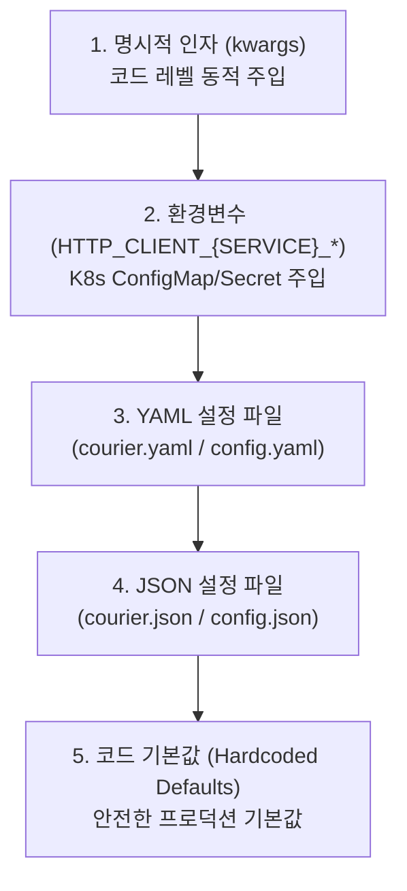

# [courier] 패키지 배포 및 환경 검증 명세서 (Deployment Specification)

- **작성일자**: 2026-09-22
- **작성자**: 데브옵스 엔지니어 (`devops-engineer`)
- **문서 버전**: v1.1
- **상태**: Approved

---

## 1. 패키지 빌드 및 배포 산출물 (Package Artifacts)

### 1.1 빌드 산출물 명세
`courier` 패키지는 Python 3.10 이상 런타임을 지원하며, 표준 PEP 517/621 규격과 `hatchling` 빌드 백엔드를 기반으로 순수 파이썬 휠(Pure Python Wheel)과 소스 배포판(sdist)을 생성합니다.

| 패키지 유형 | 파일명 | 형식 | 크기 | 빌드 상태 | 규격 검증 |
| :--- | :--- | :---: | :---: | :---: | :--- |
| **Source Distribution (sdist)** | `courier-0.1.0.tar.gz` | tar.gz | 약 17.7KB | **BUILD SUCCESS** | POSIX tar archive (gzip 압축), 소스 및 테스트 포함 |
| **Pure Python Wheel** | `courier-0.1.0-py3-none-any.whl` | Wheel | 약 12.6KB | **BUILD SUCCESS** | PEP 427 호환 (`py3-none-any`), 컴파일 불필요 |

### 1.2 패키지 포함 모듈 무결성 검증
휠 아카이브 내 핵심 모듈 및 파일 목록 검증 결과:
- `courier/__init__.py`: 패키지 공개 API 익스포트 (`http`, `get_client`, `ApiResponse`, `ApiError`, `courier`)
- `courier/client.py`: `HttpClient`, 전역 프록시 `_GlobalHttpProxy`, `atexit` 프로세스 종료 훅
- `courier/config.py`: `ClientConfig`, `RetryConfig`, 5단계 `ConfigLoader`
- `courier/retry.py`: `RetryEngine`, Full Jitter 지수 백오프, `Retry-After` 헤더 파싱
- `courier/response.py`: `ApiResponse[T]` (Result 패턴), `unwrap()`, `into()`
- `courier/decorators.py`: `@courier`, `@get`, `@post`, `@put`, `@delete`, `@patch`
- `courier/exceptions.py`: `CourierError`, `ApiConnectionError`, `ApiTimeoutError`, `ConfigurationValidationError` 등

### 1.3 `uv` 기반 빌드 및 PyPI 배포 절차
운영 환경 배포 시 재현 가능성과 산출물 무결성을 보장하기 위해 `uv` 도구를 사용합니다.

```bash
# 1. 이전 빌드 잔여물 정리 및 신규 빌드 수행
rm -rf dist/
uv build

# 2. 빌드 산출물 아카이브 무결성 검증
ls -lh dist/
tar -ztvf dist/courier-0.1.0.tar.gz
unzip -l dist/courier-0.1.0-py3-none-any.whl

# 3. TestPyPI 사전 배포 검증 (Staging 배포 단계)
uv publish --publish-url https://test.pypi.org/legacy/ --token "$TEST_PYPI_API_TOKEN"

# 4. PyPI 운영 배포 (Production 배포 단계)
uv publish --token "$PYPI_API_TOKEN"
```

---

## 2. 계층형 환경변수 및 설정 파일 규격서 (Environment & Config Specification)

### 2.1 설정 우선순위 매트릭스 (Precedence Matrix)
`ConfigLoader`는 다단계 우선순위를 기반으로 서비스별 설정을 심층 병합(Deep Merge)합니다.



1. **명시적 전달 인자 (`kwargs`)**: 런타임 코드 레벨에서 가장 높은 우선순위로 적용됩니다.
2. **환경변수 (`HTTP_CLIENT_<SERVICE>_*`)**: 컨테이너 환경(Kubernetes ConfigMap/Secret, Docker Compose)에서 주입되는 런타임 설정입니다.
3. **YAML 파일 (`courier.yaml`, `courier.yml`, `api_client.yaml`, `config.yaml`)**: 로컬 및 서비스 공통 설정 파일입니다 (`.` 또는 `config/` 디렉토리 탐색).
4. **JSON 파일 (`courier.json`, `api_client.json`, `config.json`)**: JSON 파이프라인 연동용 파일입니다 (`.` 또는 `config/` 디렉토리 탐색).
5. **기본값 (Hardcoded Defaults)**: 외부 설정 부재 시 즉시 안전하게 작동하는 고성능 기본값입니다.

### 2.2 `.env.example`
운영 컨테이너 및 로컬 개발 환경용 환경변수 템플릿입니다:

```ini
# ==============================================================================
# courier 환경변수 템플릿 (.env.example)
# 명명 규칙: HTTP_CLIENT_{SERVICE_NAME}_{PROPERTY_NAME}
# 대소문자: 서비스명은 대문자로 변환되어 매핑됩니다 (예: payment -> PAYMENT)
# ==============================================================================

# [기본 클라이언트: DEFAULT]
HTTP_CLIENT_DEFAULT_BASE_URL=https://api.internal.service.local
HTTP_CLIENT_DEFAULT_TIMEOUT=10.0
HTTP_CLIENT_DEFAULT_CONNECT_TIMEOUT=3.0
HTTP_CLIENT_DEFAULT_READ_TIMEOUT=10.0
HTTP_CLIENT_DEFAULT_WRITE_TIMEOUT=10.0
HTTP_CLIENT_DEFAULT_POOL_TIMEOUT=5.0
HTTP_CLIENT_DEFAULT_POOL_SIZE=20
HTTP_CLIENT_DEFAULT_MAX_KEEPALIVE=10
HTTP_CLIENT_DEFAULT_KEEPALIVE_EXPIRY=30.0

# 재시도 및 지터 설정
HTTP_CLIENT_DEFAULT_RETRY_MAX_RETRIES=3
HTTP_CLIENT_DEFAULT_RETRY_BACKOFF_FACTOR=0.5
HTTP_CLIENT_DEFAULT_RETRY_MAX_BACKOFF_SECONDS=30.0
HTTP_CLIENT_DEFAULT_RETRY_RETRY_ON_POST=false
HTTP_CLIENT_DEFAULT_RETRY_RESPECT_RETRY_AFTER=true
HTTP_CLIENT_DEFAULT_RETRY_JITTER_TYPE=full

# ==============================================================================
# [서비스별 독립 클라이언트 오버라이드 예시]
# ==============================================================================

# 결제 연동 서비스 (타임아웃 단축, POST 재시도 차단)
HTTP_CLIENT_PAYMENT_API_BASE_URL=https://payment.gateway.internal
HTTP_CLIENT_PAYMENT_API_TIMEOUT=5.0
HTTP_CLIENT_PAYMENT_API_CONNECT_TIMEOUT=2.0
HTTP_CLIENT_PAYMENT_API_POOL_SIZE=30
HTTP_CLIENT_PAYMENT_API_RETRY_MAX_RETRIES=2
HTTP_CLIENT_PAYMENT_API_RETRY_RETRY_ON_POST=false

# 외부 데이터 수집 서비스 (대용량 커넥션 풀, 긴 타임아웃)
HTTP_CLIENT_CRAWLER_BASE_URL=https://external-data.provider.com
HTTP_CLIENT_CRAWLER_TIMEOUT=30.0
HTTP_CLIENT_CRAWLER_READ_TIMEOUT=25.0
HTTP_CLIENT_CRAWLER_POOL_SIZE=100
HTTP_CLIENT_CRAWLER_MAX_KEEPALIVE=50
HTTP_CLIENT_CRAWLER_RETRY_MAX_RETRIES=5
```

### 2.3 `courier.yaml` 규격 (서비스 최상위 계층)
`ConfigLoader`는 파일 로드 시 `data[service_name]`으로 직접 접근하므로, YAML 파일의 루트 키는 각 서비스 이름(`default`, `payment_api` 등)이어야 합니다.

```yaml
# courier.yaml: 서비스별 독립 HTTP 클라이언트 설정 파일

default:
  base_url: "https://api.internal.service.local"
  timeout: 10.0
  connect_timeout: 3.0
  read_timeout: 10.0
  write_timeout: 10.0
  pool_timeout: 5.0
  pool_size: 20
  max_keepalive: 10
  keepalive_expiry: 30.0
  headers:
    User-Agent: "courier/0.1.0"
    Accept: "application/json"
  retry:
    max_retries: 3
    backoff_factor: 0.5
    max_backoff_seconds: 30.0
    retry_status_codes:
      - 429
      - 502
      - 503
      - 504
    retry_on_post: false
    respect_retry_after: true
    jitter_type: "full"

payment_api:
  base_url: "https://payment.gateway.internal"
  timeout: 5.0
  connect_timeout: 2.0
  read_timeout: 5.0
  write_timeout: 5.0
  pool_timeout: 3.0
  pool_size: 30
  max_keepalive: 15
  keepalive_expiry: 20.0
  headers:
    X-Client-Service: "order-service"
  retry:
    max_retries: 2
    backoff_factor: 0.2
    max_backoff_seconds: 5.0
    retry_on_post: false

crawler:
  base_url: "https://external-data.provider.com"
  timeout: 30.0
  connect_timeout: 5.0
  read_timeout: 25.0
  write_timeout: 10.0
  pool_size: 100
  max_keepalive: 50
  keepalive_expiry: 60.0
  retry:
    max_retries: 5
    backoff_factor: 1.0
    max_backoff_seconds: 60.0
    jitter_type: "full"
```

### 2.4 `courier.json` 규격
```json
{
  "default": {
    "base_url": "https://api.internal.service.local",
    "timeout": 10.0,
    "connect_timeout": 3.0,
    "read_timeout": 10.0,
    "write_timeout": 10.0,
    "pool_timeout": 5.0,
    "pool_size": 20,
    "max_keepalive": 10,
    "keepalive_expiry": 30.0,
    "headers": {
      "User-Agent": "courier/0.1.0",
      "Accept": "application/json"
    },
    "retry": {
      "max_retries": 3,
      "backoff_factor": 0.5,
      "max_backoff_seconds": 30.0,
      "retry_status_codes": [429, 502, 503, 504],
      "retry_on_post": false,
      "respect_retry_after": true,
      "jitter_type": "full"
    }
  },
  "payment_api": {
    "base_url": "https://payment.gateway.internal",
    "timeout": 5.0,
    "connect_timeout": 2.0,
    "read_timeout": 5.0,
    "write_timeout": 5.0,
    "pool_timeout": 3.0,
    "pool_size": 30,
    "max_keepalive": 15,
    "keepalive_expiry": 20.0,
    "retry": {
      "max_retries": 2,
      "backoff_factor": 0.2,
      "max_backoff_seconds": 5.0,
      "retry_on_post": false
    }
  }
}
```

### 2.5 환경변수 및 설정 우선순위 오적용 시 디버깅 방법 (Gotchas)
운영자가 환경변수를 주입했으나 의도한 대로 동작하지 않을 때 점검해야 할 핵심 포인트입니다:

1. **설정 캐싱 현상 (`ConfigLoader._cache`)**:
   - `ConfigLoader.load(service_name)`는 명시적 `kwargs`가 없는 경우 최초 생성된 `ClientConfig`를 프로세스 메모리에 캐싱합니다.
   - 애플리케이션 기동 중간에 `os.environ`을 동적으로 변경해도 이미 로드된 클라이언트에는 반영되지 않습니다.
   - **조치 방법**: 동적 환경변수 변경 시 `ConfigLoader.clear_cache()`를 호출하여 캐시를 무효화해야 합니다.
2. **서비스명 접두사 대소문자 매핑 불일치**:
   - 환경변수 로더는 `HTTP_CLIENT_{SERVICE_NAME.upper()}_` 형식을 탐색합니다.
   - 예: 서비스명이 `payment_api`인 경우 환경변수 접두사는 반드시 `HTTP_CLIENT_PAYMENT_API_`이어야 합니다. 하이픈(`-`)이 포함된 경우 환경변수 키 규격상 밑줄(`_`)로 치환되는지 확인해야 합니다.
3. **환경변수 타입 자동 변환 규칙**:
   - `_parse_env_val`은 `"true"`, `"1"`, `"yes"`를 불리언 `True`로 변환하며, 점(`.`)이 포함된 숫자는 `float`, 일반 숫자는 `int`로 변환합니다.
   - 만약 문자열 형태의 숫자(예: `"0123"`)나 비밀번호를 환경변수로 전달하는 경우 타입 변환에 주의해야 합니다. 인증 토큰은 환경변수보다 런타임 헤더 주입을 권장합니다.
4. **URL 스키마 누락 즉각 차단 (Failsafe)**:
   - `ClientConfig`는 Pydantic v2 유효성 검증을 통해 `base_url`이 `http://` 또는 `https://`로 시작하지 않으면 앱 기동 즉시 `ConfigurationValidationError`를 발생시키며 조기 차단(Fast-Fail)합니다.

---

## 3. 통합 테스트베드 및 런타임 토폴로지 (Integration Testbed & Runtime Topology)

마이크로서비스 간 HTTP 통신 및 외부 게이트웨이 시뮬레이션을 위한 통합 테스트베드 명세입니다.

### 3.1 모의 서버(Mock Server) Docker Compose 명세
```yaml
version: '3.8'

services:
  mock-upstream-api:
    image: stoplight/prism:5
    container_name: test-mock-api
    command: mock -h 0.0.0.0 /schema/openapi.yaml
    volumes:
      - ./schemas:/schema:ro
    ports:
      - "4010:4010"
    healthcheck:
      test: ["CMD-SHELL", "wget -q -O - http://localhost:4010 || exit 1"]
      interval: 5s
      timeout: 3s
      retries: 5

  httpbin:
    image: kennethreitz/httpbin
    container_name: test-httpbin
    ports:
      - "8080:80"
    healthcheck:
      test: ["CMD-SHELL", "python -c 'import urllib.request; urllib.request.urlopen(\"http://localhost:80/status/200\")' || exit 1"]
      interval: 5s
      timeout: 3s
      retries: 5
```

### 3.2 서비스 토폴로지 사양
| 서비스명 | 베이스 이미지 / 역할 | 노출 포트 | 헬스체크 방식 | 재시작 정책 |
| :--- | :--- | :---: | :--- | :--- |
| **mock-upstream-api** | `stoplight/prism:5` | `4010` | `GET http://localhost:4010` | `unless-stopped` |
| **httpbin** | `kennethreitz/httpbin` | `8080` | `GET http://localhost:80/status/200` | `unless-stopped` |
| **application** | `python:3.11-slim` | `8000` | `GET http://localhost:8000/health` | `unless-stopped` |

---

## 4. 운영 신뢰성 및 장애 대응 가이드 (Production Reliability Runbook)

### 4.1 커넥션 풀 고갈(`httpx.PoolTimeout`) 원인 및 튜닝
트래픽 급증(Spike) 또는 업스트림 서비스의 응답 지연 발생 시 가장 빈번하게 마주치는 장애 유형입니다.

#### 장애 증상 및 로그
```text
ApiConnectionError: [ERR_ENG_TIMEOUT] PoolTimeout: All connections in pool are in use
```
- **원인**: 동시에 처리 중인 요청 수가 `pool_size`에 도달하고, 대기 큐에서 `pool_timeout`(기본 5.0초) 동안 가용 커넥션을 획득하지 못해 요청이 실패합니다.
- **운영 튜닝 가이드**:
  1. **단기 조치 (`pool_size` 상향)**:
     - 컨테이너의 CPU 코어 수와 Worker 프로세스 수에 비례하여 풀 크기를 조정합니다.
     - 공식: `서비스별 풀 크기 = (단일 프로세스 최대 동시 코루틴 수) * 1.2`
     - 예: Uvicorn 단일 워커 기준 `pool_size=50`, `max_keepalive=25`로 상향.
  2. **Fast-Fail 보호 (`pool_timeout` 단축)**:
     - 커넥션 대기가 길어질수록 애플리케이션 스레드나 이벤트 루프가 병목에 갇히게 됩니다.
     - 즉각적인 실패 처리가 필요한 경우 `pool_timeout`을 `2.0초` ~ `3.0초`로 축소하여 지연 누적을 방지합니다.
  3. **업스트림 L4/L7 방화벽 단절 방지 (`keepalive_expiry`)**:
     - 로드밸런서(AWS ALB 등)의 유휴 타임아웃(Idle Timeout: 통상 60초)보다 짧은 `30초`로 유지하여 클라이언트가 먼저 유휴 커넥션을 정리하도록 합니다.

| 파라미터 | 기본값 | 고동시성 API | 대용량 배치/크롤러 | 튜닝 기준 |
| :--- | :---: | :---: | :---: | :--- |
| `pool_size` | `20` | `50` ~ `100` | `100` ~ `300` | 최대 동시 연결 수 (`httpx.Limits.max_connections`). 초과 시 `pool_timeout` 대기. |
| `max_keepalive` | `10` | `25` ~ `50` | `50` ~ `100` | 연결 재사용 한도. 너무 작으면 매 요청마다 핸드셰이크 발생. |
| `keepalive_expiry` | `30.0`s | `20.0` ~ `30.0`s | `60.0`s | 유휴 연결 만료 주기. 서버 Idle Timeout보다 짧게 설정. |
| `pool_timeout` | `5.0`s | `3.0`s | `10.0`s | 풀 가용 커넥션 획득 대기 타임아웃. 초과 시 즉각 Failsafe. |

### 4.2 소켓 파일 디스크립터(FD) 누수 방지 및 프로세스 수명주기
파이썬 서비스에서 소켓 FD 고갈(`OSError: [Errno 24] Too many open files`)이 발생하는 주요 원인과 대응책입니다.

1. **클라이언트 인스턴스 남발 금지**:
   - ❌ 요청 핸들러 내부에서 `HttpClient(config)`를 매번 새로 생성하는 패턴. 매 요청마다 신규 커넥션 풀과 소켓이 열리며 GC가 제때 회수하지 못해 FD가 고갈됩니다.
   - ⭕ 전역 싱글톤 `http` 프록시 또는 `http.get_client("service_name")`를 사용하여 동일 서비스에 대한 커넥션 풀을 지속 재사용해야 합니다.
2. **동기식 프로세스 자동 종료 (`atexit`)**:
   - `courier.client` 모듈은 `atexit.register(http.close_all)`를 등록하여 프로세스 정상 종료(SIGINT, SIGTERM) 시 열려 있는 동기 커넥션 풀을 안전하게 닫습니다.
3. **비동기 런타임(FastAPI / Starlette) Lifespan 종료 훅 구현**:
   - 비동기 클라이언트는 실행 중인 이벤트 루프에 바인딩되므로, 컨테이너 종료 시 이벤트 루프가 닫히기 전에 커넥션 풀을 명시적으로 회수해야 합니다.
   ```python
   from contextlib import asynccontextmanager
   from fastapi import FastAPI
   from courier import http

   @asynccontextmanager
   async def lifespan(app: FastAPI):
       # 애플리케이션 시작 단계
       yield
       # 컨테이너 SIGTERM 수신 및 롤링 배포 시 소켓 커넥션 풀 안전 회수
       await http.aclose_all()

   app = FastAPI(lifespan=lifespan)
   ```

### 4.3 타임아웃 4단 튜닝 가이드
단일 `timeout=10.0`만 설정하면 핸드셰이크 지연과 응답 바디 지연을 구분하지 못해 장애 분석이 어려워집니다. `courier`는 이를 4단계로 세분화합니다:

- **`connect_timeout` (기본 3.0초)**: TCP 3-Way Handshake 및 TLS 핸드셰이크 단계 타임아웃. DNS 장애나 네트워크 단절 시 3초 이내에 Fast-fail.
- **`read_timeout` (기본 10.0초)**: 서버로부터 응답 패킷 바이트를 수신하는 사이의 대기 한도. 무한 행(Hang) 현상 방지.
- **`write_timeout` (기본 10.0초)**: 요청 바디(대용량 JSON, 파일 등)를 서버 소켓 버퍼로 전송하는 시간 한도.
- **`pool_timeout` (기본 5.0초)**: 커넥션 풀에서 유휴 소켓을 체크아웃하기까지 대기하는 시간 한도.

### 4.4 재시도 및 Thundering Herd 방어 전략
1. **Full Jitter 지수 백오프**:
   - AWS 아키텍처 권장 공식인 `random.uniform(0, min(max_backoff, factor * 2^attempt))`를 적용합니다.
   - 복구 시점에 수천 대의 클라이언트가 동시에 재시도를 감행하여 장애를 가중시키는 Thundering Herd 현상을 방지합니다.
2. **비멱등(POST) 요청 재시도 안전망**:
   - 네트워크 타임아웃 발생 시 서버가 요청을 이미 처리했을 가능성이 있습니다.
   - 결제 및 주문 생성 등 중복 처리가 치명적인 비멱등 메서드(`POST`)는 `retry_on_post=False`를 기본값으로 유지하여 중복 호출을 방지합니다.
3. **`Retry-After` 헤더 연동**:
   - 외부 API가 `429 Too Many Requests` 또는 `503 Service Unavailable`과 함께 `Retry-After: 120`을 반환한 경우, 클라이언트는 계산된 백오프 대신 해당 수치를 우선 준수하여 불필요한 레이트 리밋 차단을 회피합니다.
4. **보안/SSL 에러 Fast-Fail**:
   - `ssl.SSLError`는 일시적인 네트워크 순단이 아니므로 재시도 대상에서 제외하고 즉시 반환합니다.
