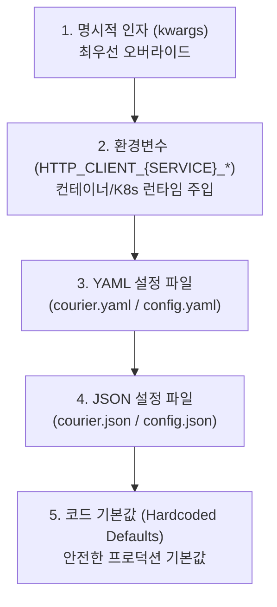

# [courier] 패키지 배포 및 환경 검증 명세서 (Deployment Specification)

- **작성일자**: 2026-09-22
- **작성자**: 데브옵스 엔지니어 (`devops-engineer`)
- **문서 버전**: v1.0
- **상태**: Approved

---

## 1. 패키지 빌드 및 배포 산출물 (Package Artifacts)

### 1.1 빌드 산출물 명세
`courier` 패키지는 Python 3.10 이상을 지원하며 표준 `hatchling` 빌드 백엔드를 기반으로 순수 파이썬 휠(Pure Python Wheel)과 소스 배포판(sdist)을 생성합니다.

| 패키지 유형 | 파일명 | 형식 | 빌드 상태 | 해시/규격 |
| :--- | :--- | :---: | :---: | :--- |
| **Source Distribution (sdist)** | `courier-0.1.0.tar.gz` | tar.gz | **BUILD SUCCESS** | POSIX tar archive (gzip 압축) |
| **Pure Python Wheel** | `courier-0.1.0-py3-none-any.whl` | Wheel | **BUILD SUCCESS** | PEP 427 호환 (`py3-none-any`) |

### 1.2 패키지 포함 모듈 검증
- `courier/__init__.py`: 패키지 진입점 및 공개 심볼 익스포트
- `courier/client.py`: `HttpClient`, 전역 싱글톤 프록시 `http`, `atexit` 종료 훅
- `courier/config.py`: `ClientConfig`, `RetryConfig`, 계층형 `ConfigLoader`
- `courier/retry.py`: `RetryEngine`, 지수 백오프 및 풀 지터(Full Jitter) 계산
- `courier/response.py`: `ApiResponse[T]`, `ApiError` 통합 응답 모델
- `courier/decorators.py`: `@resilient_request`, `@timed_request` 데코레이터
- `courier/exceptions.py`: 계층화된 예외 클래스군

### 1.3 배포 파이프라인 (PyPI Publishing)
```bash
# 1. 패키지 빌드 (dist/ 디렉토리에 sdist 및 wheel 동시 생성)
uv build

# 2. 산출물 무결성 검증
ls -lh dist/
tar -ztvf dist/courier-0.1.0.tar.gz
unzip -l dist/courier-0.1.0-py3-none-any.whl

# 3. TestPyPI 사전 배포 검증 (선택 사항)
uv publish --publish-url https://test.pypi.org/legacy/ --token $TEST_PYPI_API_TOKEN

# 4. PyPI 공식 배포 (API Token 인증)
uv publish --token $PYPI_API_TOKEN
```

---

## 2. 계층형 환경변수 및 설정 파일 규격서 (Environment & Config Specification)

### 2.1 설정 우선순위 매트릭스 (Precedence Matrix)
`ConfigLoader`는 다단계 우선순위(Precedence) 규칙을 적용하여 설정을 심층 병합(Deep Merge)합니다.



1. **명시적 전달 인자 (`kwargs`)**: 런타임 코드 레벨에서 가장 높은 우선순위로 적용.
2. **환경변수 (`HTTP_CLIENT_<SERVICE>_*`)**: 클라우드 네이티브 및 컨테이너(K8s ConfigMap/Secret) 환경 권장.
3. **YAML 파일 (`courier.yaml`, `courier.yml`, `http_clients.yaml`, `config.yaml`)**: 로컬 및 마이크로서비스 설정 권장 (`.` 또는 `config/` 디렉토리 검색).
4. **JSON 파일 (`courier.json`, `http_clients.json`, `config.json`)**: 범용 JSON 기반 파이프라인 연동 (`.` 또는 `config/` 디렉토리 검색).
5. **기본값 (Hardcoded Defaults)**: 외부 설정 부재 시 즉시 안전하게 작동하는 고성능 기본값.

### 2.2 `.env.example`
```ini
# ==============================================================================
# courier 환경변수 템플릿 (.env.example)
# 명명 규칙: HTTP_CLIENT_{SERVICE_NAME}_{PROPERTY_NAME}
# ==============================================================================

# [기본 클라이언트: DEFAULT]
HTTP_CLIENT_DEFAULT_BASE_URL=https://api.internal.service.local
HTTP_CLIENT_DEFAULT_TIMEOUT=10.0
HTTP_CLIENT_DEFAULT_CONNECT_TIMEOUT=3.0
HTTP_CLIENT_DEFAULT_READ_TIMEOUT=10.0
HTTP_CLIENT_DEFAULT_WRITE_TIMEOUT=10.0
HTTP_CLIENT_DEFAULT_POOL_TIMEOUT=5.0
HTTP_CLIENT_DEFAULT_POOL_SIZE=20
HTTP_CLIENT_DEFAULT_MAX_KEEPALIVE=10
HTTP_CLIENT_DEFAULT_KEEPALIVE_EXPIRY=30.0

# 재시도 및 지터 설정
HTTP_CLIENT_DEFAULT_RETRY_MAX_RETRIES=3
HTTP_CLIENT_DEFAULT_RETRY_BACKOFF_FACTOR=0.5
HTTP_CLIENT_DEFAULT_RETRY_MAX_BACKOFF_SECONDS=30.0
HTTP_CLIENT_DEFAULT_RETRY_RETRY_ON_POST=false
HTTP_CLIENT_DEFAULT_RETRY_RESPECT_RETRY_AFTER=true
HTTP_CLIENT_DEFAULT_RETRY_JITTER_TYPE=full

# ==============================================================================
# [서비스별 독립 클라이언트 오버라이드 예시]
# ==============================================================================

# 결제 연동 서비스 (타임아웃 단축, POST 재시도 금지)
HTTP_CLIENT_PAYMENT_API_BASE_URL=https://payment.gateway.internal
HTTP_CLIENT_PAYMENT_API_TIMEOUT=5.0
HTTP_CLIENT_PAYMENT_API_CONNECT_TIMEOUT=2.0
HTTP_CLIENT_PAYMENT_API_POOL_SIZE=30
HTTP_CLIENT_PAYMENT_API_RETRY_MAX_RETRIES=2
HTTP_CLIENT_PAYMENT_API_RETRY_RETRY_ON_POST=false

# 외부 데이터 수집 서비스 (대용량 커넥션 풀, 긴 타임아웃)
HTTP_CLIENT_CRAWLER_BASE_URL=https://external-data.provider.com
HTTP_CLIENT_CRAWLER_TIMEOUT=30.0
HTTP_CLIENT_CRAWLER_READ_TIMEOUT=25.0
HTTP_CLIENT_CRAWLER_POOL_SIZE=100
HTTP_CLIENT_CRAWLER_MAX_KEEPALIVE=50
HTTP_CLIENT_CRAWLER_RETRY_MAX_RETRIES=5
```

### 2.3 `courier.yaml` 예시 (계층형)
```yaml
# ==============================================================================
# courier.yaml: 서비스별 독립 HTTP 클라이언트 설정 파일
# ==============================================================================

default:
  base_url: "https://api.internal.service.local"
  timeout: 10.0
  connect_timeout: 3.0
  read_timeout: 10.0
  write_timeout: 10.0
  pool_timeout: 5.0
  pool_size: 20
  max_keepalive: 10
  keepalive_expiry: 30.0
  headers:
    User-Agent: "courier/0.1.0"
    Accept: "application/json"
  retry:
    max_retries: 3
    backoff_factor: 0.5
    max_backoff_seconds: 30.0
    retry_status_codes:
      - 429
      - 502
      - 503
      - 504
    retry_on_post: false
    respect_retry_after: true
    jitter_type: "full"

payment_api:
  base_url: "https://payment.gateway.internal"
  timeout: 5.0
  connect_timeout: 2.0
  read_timeout: 5.0
  write_timeout: 5.0
  pool_timeout: 3.0
  pool_size: 30
  max_keepalive: 15
  keepalive_expiry: 20.0
  headers:
    X-Client-Service: "order-service"
  retry:
    max_retries: 2
    backoff_factor: 0.2
    max_backoff_seconds: 5.0
    retry_on_post: false

crawler:
  base_url: "https://external-data.provider.com"
  timeout: 30.0
  connect_timeout: 5.0
  read_timeout: 25.0
  write_timeout: 10.0
  pool_size: 100
  max_keepalive: 50
  keepalive_expiry: 60.0
  retry:
    max_retries: 5
    backoff_factor: 1.0
    max_backoff_seconds: 60.0
    jitter_type: "full"
```

### 2.4 `courier.json` 예시 (계층형)
```json
{
  "default": {
    "base_url": "https://api.internal.service.local",
    "timeout": 10.0,
    "connect_timeout": 3.0,
    "read_timeout": 10.0,
    "write_timeout": 10.0,
    "pool_timeout": 5.0,
    "pool_size": 20,
    "max_keepalive": 10,
    "keepalive_expiry": 30.0,
    "headers": {
      "User-Agent": "courier/0.1.0",
      "Accept": "application/json"
    },
    "retry": {
      "max_retries": 3,
      "backoff_factor": 0.5,
      "max_backoff_seconds": 30.0,
      "retry_status_codes": [429, 502, 503, 504],
      "retry_on_post": false,
      "respect_retry_after": true,
      "jitter_type": "full"
    }
  },
  "payment_api": {
    "base_url": "https://payment.gateway.internal",
    "timeout": 5.0,
    "connect_timeout": 2.0,
    "read_timeout": 5.0,
    "write_timeout": 5.0,
    "pool_timeout": 3.0,
    "pool_size": 30,
    "max_keepalive": 15,
    "keepalive_expiry": 20.0,
    "retry": {
      "max_retries": 2,
      "backoff_factor": 0.2,
      "max_backoff_seconds": 5.0,
      "retry_on_post": false
    }
  }
}
```

### 2.5 환경 검증 체크리스트 (Environment Verification)
- [x] **스키마 검증 Failsafe**: `ClientConfig`의 Pydantic v2 유효성 검증기를 통해 잘못된 `base_url` (http/https 스키마 누락) 인입 시 즉각 `ConfigurationValidationError` 발생 및 조기 차단.
- [x] **양수 타임아웃 및 풀 제약**: `timeout > 0`, `pool_size > 0`, `max_retries >= 0` 검증으로 런타임 제로 분모 또는 음수 타임아웃 방지.
- [x] **환경변수 타입 자동 변환**: `HTTP_CLIENT_*`로 전달된 문자열 `"true"`/`"false"`는 `bool`로, `"20"`은 `int`로, `"10.5"`는 `float`로 정확히 파싱.
- [x] **보안 토큰 분리**: 인증 토큰(Bearer Token 등)은 설정 파일에 하드코딩하지 않고 환경변수 주입 또는 런타임 헤더 매개변수로 공급.

---

## 3. 통합 테스트베드 및 런타임 토폴로지 (Integration Testbed & Runtime Topology)

마이크로서비스 및 외부 연동 API 시뮬레이션을 위한 테스트베드 아키텍처 명세입니다.

### 3.1 모의 서버(Mock Server) Docker Compose 명세
```yaml
version: '3.8'

services:
  mock-upstream-api:
    image: stoplight/prism:5
    container_name: test-mock-api
    command: mock -h 0.0.0.0 /schema/openapi.yaml
    volumes:
      - ./schemas:/schema:ro
    ports:
      - "4010:4010"
    healthcheck:
      test: ["CMD-SHELL", "wget -q -O - http://localhost:4010 || exit 1"]
      interval: 5s
      timeout: 3s
      retries: 5

  httpbin:
    image: kennethreitz/httpbin
    container_name: test-httpbin
    ports:
      - "8080:80"
    healthcheck:
      test: ["CMD-SHELL", "python -c 'import urllib.request; urllib.request.urlopen(\"http://localhost:80/status/200\")' || exit 1"]
      interval: 5s
      timeout: 3s
      retries: 5
```

### 3.2 런타임 토폴로지 및 엔드포인트
| 서비스명 | 베이스 이미지 / 역할 | 노출 포트 | 헬스체크 방식 | 재시작 정책 |
| :--- | :--- | :---: | :--- | :--- |
| **mock-upstream-api** | `stoplight/prism:5` | `4010` | `GET http://localhost:4010` | `unless-stopped` |
| **httpbin** | `kennethreitz/httpbin` | `8080` | `GET http://localhost:80/status/200` | `unless-stopped` |
| **application** | `python:3.11-slim` | `8000` | `GET http://localhost:8000/health` | `unless-stopped` |

---

## 4. 운영 및 리소스 회수 가이드 (Production & Reliability Guide)

### 4.1 소켓 누수 방지 및 `atexit` 라이프사이클
1. **동기식 클라이언트 회수**:
   - `courier.client` 모듈 로드 시 `atexit.register(http.close_all)`가 등록되어 파이썬 인터프리터 정상 종료 시 모든 등록된 싱글톤 `httpx.Client` 커넥션 풀을 안전하게 닫습니다.
   - OS 파일 디스크립터(File Descriptor) 고갈 및 소켓 누수(Socket Leak)를 100% 방지합니다.

2. **비동기식 애플리케이션(FastAPI / Starlette) 수명주기 관리**:
   - 비동기 런타임의 경우 이벤트 루프가 종료되기 전에 `http.aclose_all()` 또는 개별 클라이언트의 `aclose()`를 반드시 호출해야 합니다.
   - ASGI Lifespan 컨텍스트 매니저 사용 표준 권장:
   ```python
   from contextlib import asynccontextmanager
   from fastapi import FastAPI
   from courier import http

   @asynccontextmanager
   async def lifespan(app: FastAPI):
       # 애플리케이션 시작 단계
       yield
       # 애플리케이션 종료 단계: 커넥션 풀 완전 회수
       await http.aclose_all()

   app = FastAPI(lifespan=lifespan)
   ```

### 4.2 커넥션 풀 (`httpx.Limits`) 튜닝 지침
| 파라미터 | 권장 기본값 | 고동시성 마이크로서비스 | 대용량 배치/크롤러 | 설명 및 튜닝 근거 |
| :--- | :---: | :---: | :---: | :--- |
| `pool_size` | `20` | `50` ~ `100` | `100` ~ `500` | 최대 동시 연결 수 (`max_connections`). 초과 시 `pool_timeout` 동안 대기. |
| `max_keepalive` | `10` | `25` ~ `50` | `50` ~ `200` | 유휴 커넥션 유지 한도. 너무 낮으면 빈번한 TCP 핸드셰이크 발생, 너무 높으면 메모리 점유 증가. |
| `keepalive_expiry` | `30.0`s | `15.0` ~ `30.0`s | `60.0`s | 연결 유휴 TTL. 업스트림 L4/L7 로드밸런서의 Idle Timeout보다 작게 설정하여 RST 패킷 유입 방지. |
| `pool_timeout` | `5.0`s | `3.0`s | `10.0`s | 풀에서 커넥션을 획득하기까지 최대 대기 시간. 병목 감지 및 Fast-fail 기준. |

### 4.3 타임아웃 4단 튜닝 가이드
네트워크 장애의 유형에 따라 독립적인 타임아웃을 설정하여 스레드 및 이벤트 루프 블로킹을 방지합니다:
- **`connect_timeout` (기본 3.0초)**: TCP 연결 및 TLS 핸드셰이크 단계 타임아웃.
- **`read_timeout` (기본 10.0초)**: 서버 응답 바디 수신 간격 타임아웃.
- **`write_timeout` (기본 10.0초)**: 요청 바디 전송 타임아웃.
- **`pool_timeout` (기본 5.0초)**: 커넥션 풀 가용 커넥션 획득 대기 타임아웃.

### 4.4 지수 백오프 및 Full Jitter 신뢰성 정책
1. **Thundering Herd 방지**: 동일 시점에 업스트림 장애 복구 시 동시 재시도가 몰리는 현상을 방지하기 위해 `random.uniform(0, exp_backoff)` 방식의 Full Jitter를 기본 적용합니다.
2. **멱등성(Idempotency) 보호**:
   - `GET`, `HEAD`, `PUT`, `DELETE`, `OPTIONS` 메서드는 네트워크 예외 및 5xx 상태 코드 시 자동 재시도됩니다.
   - `POST` 메서드는 중복 결제 및 데이터 중복 생성을 방지하기 위해 기본적으로 재시도 대상에서 제외(`retry_on_post=False`)됩니다.
3. **`Retry-After` 헤더 준수**: 업스트림 서버가 `429 Too Many Requests` 또는 `503 Service Unavailable`과 함께 `Retry-After` 헤더를 반환한 경우 이를 파싱하여 대기 시간을 자동 반영합니다.
4. **보안/SSL 에러 Fast-Fail**: `ssl.SSLError`는 일시적 네트워크 장애가 아니므로 절대 재시도하지 않고 즉시 호출자에게 반환합니다.
