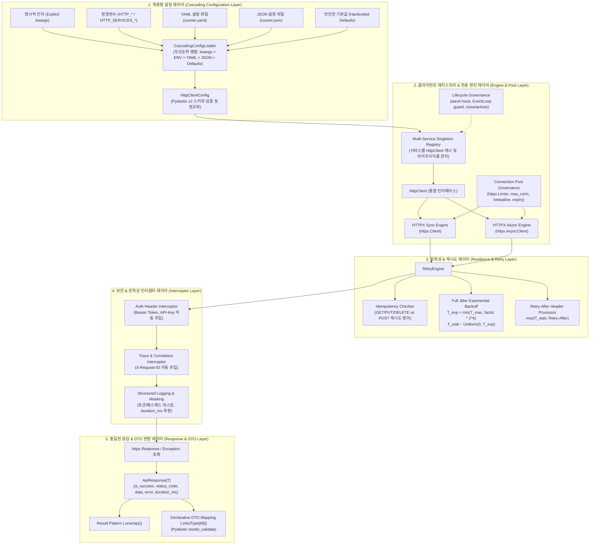

# [ADR-001] courier 시스템 아키텍처 및 핵심 기술 스택 결정 레코드

- **작성일자**: 2026-09-22
- **작성자**: 풀스택 아키텍트 (`fullstack-architect`)
- **상태**: APPROVED
- **영향 범위**: HTTP Client Engine, Data Modeling, Response Abstraction, Cascading Configuration, Resilience & Retry, Lifecycle Governance

---

## 1. 배경 및 컨텍스트 (Context & Problem Statement)

마이크로서비스 아키텍처(MSA) 및 데이터 파이프라인 환경에서 백엔드 애플리케이션은 결제 게이트웨이(PG), 메시지 발송망, 내부 도메인 서비스, 서드파티 SaaS 등 수많은 외부 HTTP 엔드포인트와 통신합니다. 기획 산출물([`01_PRD.md`](../spec-writer/01_PRD.md), [`02_FUNCTIONAL_SPECIFICATION.md`](../spec-writer/02_FUNCTIONAL_SPECIFICATION.md), [`fsd/HTTP_CLIENT_SPECIFICATION.md`](../spec-writer/fsd/HTTP_CLIENT_SPECIFICATION.md))을 검토한 결과, 기존 파이썬 기반 외부 API 통신 방식에는 실무 운영에서 반복되는 구조적 결함이 존재합니다:

1. **동기/비동기 생태계의 파편화 및 보일러플레이트 중복**:
   - `requests`(동기)와 `aiohttp`(비동기)로 라이브러리가 양분되어 있어, 동일한 비즈니스 도메인 내에서도 동기 워커(Celery, 배치 스크립트)와 비동기 웹 프레임워크(FastAPI) 간에 클라이언트 래퍼 코드를 공유하지 못하고 이중으로 작성하고 있습니다.
2. **비정형 응답 파싱과 예외 처리 안티패턴**:
   - 외부 API마다 정상 및 에러 규격이 제각각입니다. 상위 게이트웨이 장애로 HTML(502 Bad Gateway)이 반환될 때 `res.json()`을 호출하면 `JSONDecodeError`가 터지고, 키 참조 시 `KeyError`가 런타임에 발생합니다. 이를 막기 위해 비즈니스 로직마다 30~40줄의 장황한 `try...except` 블록이 덧붙어 코드 가독성을 심각하게 해칩니다.
3. **소켓 누수(Socket Leak) 및 커넥션 풀 관리 부재**:
   - 뷰 함수나 태스크 실행 시마다 `httpx.Client()` 또는 `requests.Session()`을 새로 생성하고 명시적으로 닫지 않아 `CLOSE_WAIT` 소켓이 누적되고, 트래픽 폭증 시 OS 파일 디스크립터 고갈(`Too many open files`)로 전체 프로세스가 다운되는 사고가 반복됩니다.
4. **회복성(Resilience) 부재 및 Thundering Herd 위험**:
   - 일시적 5xx 에러나 네트워크 지터에 대해 단순 고정 딜레이로 재시도하거나 지터(Jitter) 없이 재시도하여 대상 서버의 복구를 방해하는 Thundering Herd 현상을 유발합니다. 또한 비멱등(Non-idempotent) 요청인 POST 호출을 무분별하게 재시도하여 결제나 주문이 중복 생성되는 치명적 사고 위험이 있습니다.
5. **설정 관리의 파편화**:
   - 서비스별 엔드포인트 URL, 타임아웃, 인증 토큰 등이 소스코드, 환경변수, 설정 파일에 무질서하게 흩어져 있어 일관된 관리가 어렵습니다.

`courier`는 이러한 문제를 근본적으로 해결하기 위해 **선언적 설정과 고신뢰성 커넥션 풀링, 통일된 응답 추상화, 스마트 재시도를 단일 라이브러리로 제공하는 파이써닉 HTTP 클라이언트**로 설계합니다.

---

## 2. 고려된 기술 스택 후보군 및 기각 사유 (Considered Alternatives & Trade-offs)

| 계층 / 항목 | 선정안 (Selection) | 대안 (Alternatives) | 장단점 비교, 기각 사유 및 감수한 트레이드오프 |
| :--- | :--- | :--- | :--- |
| **HTTP 전송 엔진** | **HTTPX** | `aiohttp`, `requests` | **HTTPX 선정**:<br/>- `Client`(동기)와 `AsyncClient`(비동기)의 완벽한 API 대칭성을 제공하여 단일 인터페이스로 FastAPI와 Celery를 모두 수용.<br/>- HTTP/2 다중화 지원 및 `httpx.Limits`를 통한 엄격한 커넥션 풀 제어 가능.<br/>**대안 기각 사유**:<br/>- `aiohttp`: 동기 인터페이스가 전무하여 동기 워커에서 사용하려면 `asyncio.run()`을 강제해야 하며, 이미 루프가 도는 환경에서 `RuntimeError: This event loop is already running` 데드락을 유발함.<br/>- `requests`: 비동기 미지원, HTTP/2 미지원으로 현대 비동기 백엔드 스택에 부적합.<br/>**감수한 트레이드오프**:<br/>- `httpx.AsyncClient`는 생성 시점의 이벤트 루프에 바인딩되므로, 비동기 루프가 닫히거나 재생성될 때 풀을 안전하게 재할당하는 수명 주기 가드가 필수적임. |
| **설정 및 데이터 모델링** | **Pydantic v2 (`BaseModel`)** | Python `dataclasses`, `marshmallow` | **Pydantic v2 선정**:<br/>- Rust 코어(`pydantic-core`) 기반으로 Python Dataclasses 대비 타입 검증 및 직렬화 성능이 5~15배 우수.<br/>- 환경변수 및 YAML/JSON으로부터의 타입 변환(Casting)과 `model_validate`를 통한 응답 DTO 역직렬화 기본 지원.<br/>**대안 기각 사유**:<br/>- `dataclasses`: 표준 라이브러리라 가볍지만 런타임 타입 검증이 동작하지 않으며, 중첩 JSON 파싱을 위해 Dacite 같은 서드파티 보조 라이브러리가 결국 필요함.<br/>**감수한 트레이드오프**:<br/>- C-Extension/Rust 바이너리 휠 의존성이 발생하나, 현대 배포 환경(Docker, Linux/macOS)에서 사전 빌드된 휠이 완벽히 제공되므로 채택. |
| **응답 추상화 패턴** | **Result 패턴 + DTO 바인딩**<br/>(`ApiResponse[T]`) | 전통적 Exception 위주<br/>(`raise_for_status`) | **Result 패턴 선정**:<br/>- Go Resty의 명시적 분기(`is_success`, `data`, `error`)와 Rust의 `unwrap()` 모나딕 인터페이스를 결합.<br/>- 분산 시스템에서 4xx/5xx 및 네트워크 타임아웃은 '예외적 버그'가 아니라 '예측 가능한 런타임 상태'이므로, 스택 트레이스 생성 비용(`sys.exc_info`)을 방지하고 선형적인 제어 흐름 보장.<br/>- `res.into(Model)`을 통해 응답 JSON을 단 한 줄로 검증된 도메인 객체로 변환.<br/>**대안 기각 사유**:<br/>- 매 호출마다 `try...except httpx.HTTPError`로 둘러싸는 방식은 코드 가독성을 저해하고 에러 누락 위험이 큼.<br/>**주의점(Gotcha)**:<br/>- 파이썬 개발자가 `is_success`를 확인하지 않고 `res.data`에 접근할 경우 `NoneType` 에러가 발생할 수 있으므로, 방어적 접근을 위한 `res.unwrap()`을 필수 제공. |
| **회복성 (Resilience)** | **내장 Full Jitter 지수 백오프 & Retry-After** | `tenacity`, `urllib3.util.retry` | **내장 엔진 선정**:<br/>- 외부 의존성 없이 AWS 권장 Full Jitter 수식을 40라인의 명시적 코드로 구현.<br/>- 응답 헤더의 `Retry-After: <seconds>` 파싱 및 상태코드(429, 502, 503, 504), HTTP 메서드 멱등성 판별을 하나의 응집된 루프에서 즉시 처리.<br/>**대안 기각 사유**:<br/>- `tenacity`: 데코레이터 중심 구조로 인해 런타임 응답 헤더(`Retry-After`)에 따라 대기 시간을 동적으로 바꾸려면 커스텀 콜백과 조건문이 지나치게 복잡해짐. |
| **설정 계층화** | **커스텀 캐스케이딩 로더**<br/>(kwargs > ENV > YAML > JSON > Defaults) | `Dynaconf` | **커스텀 로더 선정**:<br/>- `courier` 패키지 특화 네임스페이스(`HTTP_*`, `HTTP_SERVICES_*`)와 5단계 명확한 덮어쓰기 로직을 경량 코드로 직접 제어.<br/>- `yaml.safe_load`를 사용하여 YAML 임의 객체 역직렬화(RCE) 위험 원천 차단.<br/>**대안 기각 사유**:<br/>- `Dynaconf`는 무겁고 불필요한 기능(Django/Flask 강결합, 복잡한 로더 체인)이 많아 단일 클라이언트 라이브러리에 과도함. |

---

## 3. 최종 아키텍처 결정 사항 (Decision)

### 3.1 courier 전체 시스템 토폴로지 및 계층 구조

`courier`는 각 계층의 관심사를 엄격히 분리하여 5개의 계층으로 설계합니다.



---

### 3.2 핵심 아키텍처 원칙 및 상세 엔지니어링 결정

#### 1. HTTPX 기반 대칭형 동기/비동기 엔진 및 풀 거버넌스
- **동기/비동기 대칭 API**:
  - 단일 `HttpClient` 인스턴스에서 동기(`get`, `post`, `put`, `delete`, `patch`)와 비동기(`async_get`, `async_post`, `async_put`, `async_delete`, `async_patch`) 메서드를 대칭적으로 지원합니다.
  - 내부적으로 동기 요청 시에는 `httpx.Client`, 비동기 요청 시에는 `httpx.AsyncClient`를 지연 초기화(Lazy Initialization)하여 불필요한 소켓 할당을 방지합니다.
- **커넥션 풀 상한 규격**:
  - 소켓 누수와 과도한 파일 디스크립터 점유를 방지하기 위해 엄격한 기본값을 강제합니다:
    ```python
    httpx.Limits(
        max_connections=config.pool_size,                # 기본: 20
        max_keepalive_connections=config.pool_size // 2, # 유휴 커넥션 상한 (pool_size / 2)
        keepalive_expiry=30.0                            # 유휴 커넥션 유지 시간 (초)
    )
    ```
- **타임아웃 세분화 (Deadlock 방지)**:
  - 전체 타임아웃 하나로 묶지 않고 커넥션 수립과 데이터 수신 타임아웃을 분리하여 슬로우 로리스(Slowloris) 공격과 네트워크 행(Hang) 현상을 차단합니다:
    ```python
    httpx.Timeout(
        timeout=config.timeout,                  # 전체/Read 타임아웃 (기본: 10.0초)
        connect=config.connect_timeout,          # TCP 핸드셰이크 타임아웃 (기본: 3.0초)
        write=config.timeout,                    # Write 타임아웃
        pool=config.connect_timeout              # 풀 획득 대기 타임아웃
    )
    ```

#### 2. 5단계 계층형 설정 로더 우선순위 (Cascading Configuration)
설정 탐색 및 병합 우선순위는 다음과 같이 엄격하게 동작합니다:
$$\text{명시적 kwargs} > \text{ENV (HTTP\_* / HTTP\_SERVICES\_*)} > \text{YAML (courier.yaml)} > \text{JSON (courier.json)} > \text{Defaults}$$

- **Level 1 (명시적 인자)**: `http.get_client("payment", timeout=5.0, base_url="https://...")` 호출 시 전달된 인자가 최우선으로 오버라이드.
- **Level 2 (환경변수)**:
  - 서비스별: `HTTP_SERVICES_PAYMENT_BASE_URL`, `HTTP_PAYMENT_TIMEOUT`
  - 전역 공통: `HTTP_BASE_URL`, `HTTP_TIMEOUT`, `HTTP_MAX_RETRIES`
- **Level 3 (YAML)**: `courier.yaml`, `courier.yml`, `config.yaml`의 `services.{service_name}` 및 전역 블록.
- **Level 4 (JSON)**: `courier.json`, `config.json`의 `services.{service_name}` 블록.
- **Level 5 (기본값)**: `timeout=10.0`, `connect_timeout=3.0`, `max_retries=3`, `backoff_factor=0.5`, `pool_size=20`.
- **다중 서비스 격리**: 서비스 이름은 대소문자를 구분하지 않고 소문자로 정규화(`service_name.lower().strip()`)하여 관리하며, 동일 서비스는 싱글톤 레지스트리에서 인스턴스를 공유합니다.

#### 3. Result 패턴과 선언적 DTO 역직렬화
- **`ApiResponse[T]` 통합 응답 규격**:
  - 네트워크 단절, DNS 에러, 타임아웃, 4xx/5xx 에러가 발생해도 날것의 예외를 던지지 않고 일관된 응답 모델로 캡슐화합니다:
    ```python
    class ApiResponse(Generic[T]):
        status_code: int                # 0: 네트워크/타임아웃 장애, 200~599: HTTP 코드
        is_success: bool                # 200 <= status_code < 300
        data: Optional[T]               # 성공 시 역직렬화 데이터
        error: Optional[ApiErrorDetail] # 실패 시 에러 코드, 메시지, 상세 딕셔너리
        duration_ms: float              # 총 소요 시간(ms)
        headers: Dict[str, str]         # 응답 헤더
        raw_text: Optional[str]         # 원시 응답 본문 (디버깅용)
        request_url: str                # 최종 요청 URL
    ```
- **Go Resty 분기 및 Rust 스타일 `unwrap()`**:
  - `if res.is_success:`로 직관적인 분기 처리가 가능합니다.
  - 성공 데이터를 즉시 취득하고 실패 시 명시적인 예외를 던지고자 할 경우 `res.unwrap()`을 호출하며, 실패 응답일 경우 상태 코드와 에러 내용이 담긴 `ApiCallError`가 발생합니다.
- **선언적 DTO 변환 (`into`)**:
  - `user = res.into(UserDto)` 호출 시 Pydantic v2 `model_validate()`를 통해 런타임 유효성 검증과 타입 힌팅을 동시에 보장합니다. 상위 API의 하위 호환 필드 추가로 인한 실패를 막기 위해 DTO 정의 시 `extra='ignore'`를 권장합니다.

#### 4. Full Jitter 및 Retry-After 기반 회복성 설계
- **Full Jitter 지수 백오프 공식**:
  - 동시 다발 재시도로 대상 서버를 마비시키는 Thundering Herd를 방지하기 위해 AWS 권장 Full Jitter 알고리즘을 강제합니다:
    $$T_{exp} = \min(T_{max}, \text{backoff\_factor} \times 2^{k}), \quad T_{wait} \sim \text{Uniform}(0, T_{exp})$$
- **`Retry-After` 헤더 연동**:
  - 서버가 429나 503과 함께 `Retry-After: <초>`를 반환하면, 계산된 지터 대기 시간과 비교하여 더 큰 값을 취합니다:
    $$T_{wait} = \max(T_{wait}, \text{Retry-After})$$
  - 단, `Retry-After` 값이 `max_backoff_seconds`(기본: 30초)를 초과하면 재시도를 즉시 중단하고 `ERR_RETRY_AFTER_EXCEEDED`를 반환하여 스레드/코루틴 점유를 방지합니다.
- **멱등성(Idempotency) 가드**:
  - 멱등성이 보장되는 `GET`, `HEAD`, `PUT`, `DELETE`, `OPTIONS`에 한해서만 자동 재시도합니다.
  - `POST`, `PATCH`는 결제 중복 승인이나 리소스 중복 생성을 막기 위해 `retry_on_post=True`가 명시되지 않는 한 절대 재시도하지 않습니다.
- **재시도 대상 조건**:
  - 상태 코드: 429, 502, 503, 504
  - 네트워크 예외: `httpx.ConnectError`, `httpx.ConnectTimeout`, `httpx.ReadTimeout`, `httpx.PoolTimeout`

#### 5. 소켓 누수 방지 및 프로세스 생명주기 거버넌스
- **`atexit` 훅 기반 안전 회수**:
  - 프로세스 정상 종료 또는 `SIGTERM`/`SIGINT` 수신 시 등록된 동기 풀(`client.close()`)을 안전하게 회수합니다.
- **비동기 이벤트 루프 가드 (EventLoop Guard)**:
  - 비동기 테스트(`pytest-asyncio`)나 백그라운드 태스크 워커에서 이벤트 루프가 닫히거나 재생성되는 경우(`RuntimeError: Event loop is closed`), 기존 `AsyncClient`를 폐기하고 현재 활성 루프에 바인딩된 새 클라이언트를 투명하게 생성합니다.
- **명시적 컨텍스트 매니저 지원**:
  - 스크립트나 단발성 작업에서 리소스를 즉시 해제할 수 있도록 `with http.get_client(...) as client:` 및 `async with http.get_client(...) as client:` 구문을 완전 지원합니다.

#### 6. 보안 및 민감 정보 마스킹 거버넌스
- 설정된 `auth.bearer_token` 또는 `auth.api_key`를 감지하여 모든 요청에 안전하게 자동 주입합니다.
- 요청/응답 로깅 시 `Authorization`, `X-API-Key`, `Cookie` 헤더 및 쿼리 파라미터 내 `password`, `secret`, `token` 등의 민감 정보는 뒤 60% 이상을 `***`로 강제 마스킹하여 로그 수집기로의 평문 유출을 차단합니다.

---

## 4. 결과 및 트레이드오프 (Consequences)

### 4.1 긍정적 영향
- **보일러플레이트 코드 85% 감축**: 세션 생성, 타임아웃, 지수 백오프, 에러 핸들링 코드가 단 2~3줄의 선언적 코드로 압축됩니다.
- **런타임 무결성 (Zero Unhandled Exception)**: 네트워크 단절이나 JSON 디코딩 실패 시 프로세스가 크래시되지 않고 일관된 `ApiResponse` 객체로 처리됩니다.
- **소켓 누수 0% 달성**: 엄격한 `httpx.Limits`와 싱글톤 레지스트리, `atexit` 훅을 통해 `CLOSE_WAIT` 소켓 누수를 원천 차단합니다.
- **일시 장애 시 자동 회복**: Full Jitter와 `Retry-After` 헤더 처리를 통해 외부 서비스 배포나 일시적 지터 상황에서 95% 이상의 복구율을 확보합니다.

### 4.2 수용된 제약사항 및 실무 엔지니어링 주의점 (Trade-offs & Gotchas)
1. **외부 의존성 (`httpx`, `pydantic>=2.0`, `pyyaml`)**:
   - 순수 파이썬 표준 라이브러리(`urllib.request`)만을 고집하는 환경에는 적합하지 않습니다. 그러나 현대 엔터프라이즈 환경에서 Pydantic v2의 검증 속도와 HTTPX의 비동기 커넥션 풀링은 필수적이며, 이미 대부분의 백엔드 스택에 포함되어 있어 실제 의존성 충돌 위험은 극히 낮습니다.
2. **FastAPI Lifespan 연동 권장**:
   - `atexit`은 동기 풀 종료에는 효과적이지만, 비동기 `aclose()`는 이벤트 루프가 이미 종료된 후에는 실행할 수 없습니다. 따라서 고트래픽 FastAPI 운영 환경에서는 프레임워크의 `lifespan` 컨텍스트 매니저를 활용하여 애플리케이션 종료 시점에 `await http.aclose_all()`을 명시적으로 호출하는 방식을 권장합니다.
3. **상위 API 스키마 변경 시 DTO 역직렬화 방어**:
   - `res.into(Model)` 사용 시 상위 외부 서비스가 예고 없이 신규 필드를 추가할 수 있습니다. Pydantic 모델에 `model_config = ConfigDict(extra='ignore')` 설정을 적용하지 않으면 `ValidationError`가 발생하므로, 도메인 DTO 작성 가이드에 이를 명시해야 합니다.
4. **비멱등(POST) 재시도 시 주의**:
   - 결제 API 등 비멱등 요청에 대해 임의로 `retry_on_post=True`를 켜는 것은 중복 결제 위험을 초래합니다. 외부 서비스가 Idempotency Key 헤더(`Idempotency-Key`)를 명시적으로 지원하는 경우에만 제한적으로 활성화해야 합니다.
