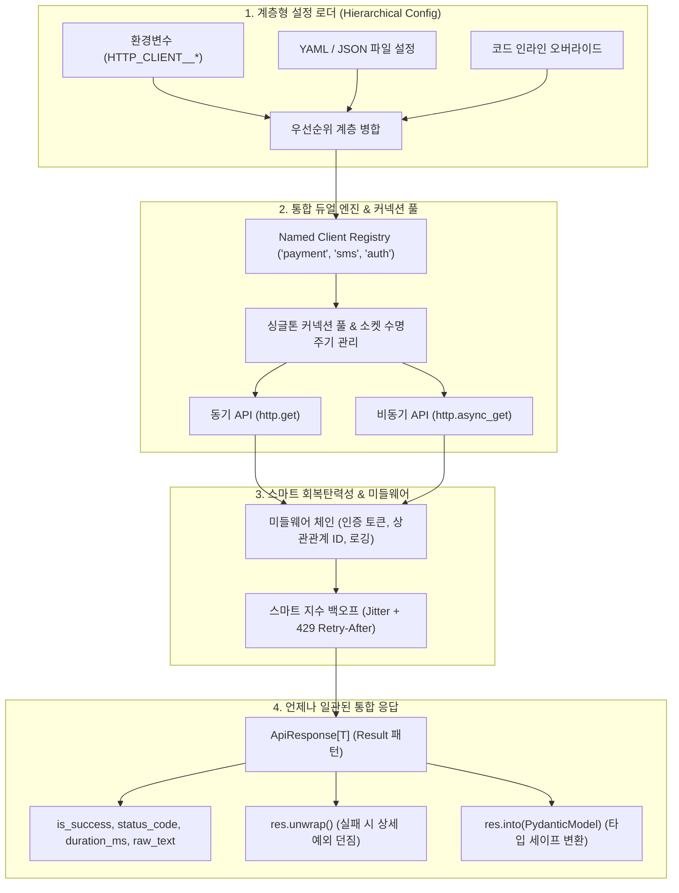

# [courier] 글로벌 언어별 HTTP 클라이언트 설계 철학 및 레퍼런스 벤치마킹 분석 보고서

- **작성일자**: 2026-09-22
- **작성자**: 시니어 마켓 및 아키텍처 애널리스트 (`market-analyst`)
- **문서 버전**: v1.0
- **상태**: Approved

---

## 1. 분석 개요 및 목적 (Executive Summary)

- **분석 배경**:
  현대 분산 시스템 및 마이크로서비스 아키텍처(MSA)에서 외부 API(결제 게이트웨이, 서드파티 SaaS, 사내 마이크로서비스 등) 호출은 애플리케이션의 핵심 비즈니스 로직을 구성합니다. 그러나 Python 에코시스템의 사실상 표준인 `requests`, `httpx`, `aiohttp`는 기본적으로 "저수준 전송 라이브러리(Transport Primitives)"에 가깝습니다. 이로 인해 개발팀마다 매번 다음과 같은 중복 작업을 수작업으로 구현해야 합니다:
  1. 세션 라이프사이클 및 커넥션 풀 관리 누락으로 인한 소켓 누수
  2. 일시적 네트워크 지터/5xx 장애 대응을 위한 지수 백오프(Exponential Backoff) 및 재시도 로직의 파편화
  3. API별 상이한 에러 응답 포맷과 비일관적인 `raise_for_status()` 예외 폭탄(Exception Bombing)
  4. 다중 외부 서비스별 Base URL, Timeout, 인증 토큰(헤더) 설정의 하드코딩 및 환경별 구성 관리 부재
  5. 동기(Sync) 코드와 비동기(Async) 코드 간의 라이브러리/인터페이스 불일치

- **핵심 목표**:
  Java(`OpenFeign`, `Retrofit 2`), Go(`go-resty/resty`), TypeScript(`Axios`, `Ky`), Python(`requests`, `httpx`, `aiohttp`) 등 주요 현대 언어의 HTTP 클라이언트 라이브러리 설계 철학(Design Philosophies)과 개발자 경험(DX, Developer Ergonomics)을 비교 분석합니다. 이를 통해 **"어떤 외부 API를 호출하더라도 언제나 예측 가능한 일관된 `ApiResponse[T]`를 반환하고, 계층형 설정(ENV/YAML/JSON)만으로 즉시 프로덕션 수준의 안정성을 제공하는 차세대 Python HTTP 자동 구성 패키지(`courier`)"**의 핵심 기회 영역과 아키텍처 원칙을 정의합니다.

---

## 2. 벤치마킹 대상 프로덕트 선정 (Benchmark Targets)

| 언어 / 생태계 | 라이브러리명 | 기업 / 서비스 유형 | 주요 타깃 고객군 | 시장 포지셔닝 및 핵심 설계 철학 |
| :--- | :--- | :--- | :--- | :--- |
| **Java (Spring)** | **Spring Cloud OpenFeign** | Netflix / Spring Cloud | 엔터프라이즈 백엔드 엔지니어 | **선언적 인터페이스 (Declarative Interface)**<br/>- HTTP 호출 코드를 직접 작성하지 않고, 인터페이스 어노테이션 정의만으로 런타임 동적 프록시가 요청을 자동 구성 및 디스패치. |
| **Java / Android** | **Square Retrofit 2** | Block (Square) / 모바일 | 안드로이드 및 자바/코틀린 개발자 | **타입 안전한 비즈니스 모델 바인딩 (Type-Safe RPC Binding)**<br/>- HTTP 엔드포인트를 완전한 타입 세이프 인터페이스로 추상화하고, Converter를 통해 JSON $\leftrightarrow$ DTO 양방향 자동 직렬화. |
| **Go** | **go-resty/resty** | 오픈소스 커뮤니티 | Go 마이크로서비스 엔지니어 | **체이닝 플루언트 API & 통합 응답 (Fluent Chaining & Unified Result)**<br/>- `client.R().SetResult(&dto).SetError(&errDto).Get(url)` 패턴으로 성공/에러 분기 DTO 매핑, 내장 Retry 및 요청 레이턴시 자동 측정. |
| **TypeScript / Node** | **Axios & Ky** | 오픈소스 (Matt Zabriskie / Sindre Sorhus) | 프론트엔드 / 풀스택 엔지니어 | **인터셉터 파이프라인 & 경량 불변 확장 (Interceptors & Immutable Hooks)**<br/>- Axios의 양방향 인터셉터와 Ky의 현대적 Fetch 기반 불변 확장(`ky.extend()`), 제로-설정 자동 재시도. |
| **Python** | **requests / httpx / aiohttp** | 오픈소스 (Kenneth Reitz / Encode / aio-libs) | 데이터 엔지니어, 웹 백엔드 개발자 | **파이썬스러운 단순함 & 전송 프리미티브 (Pythonic Simplicity & Low-level Primitives)**<br/>- "인간을 위한 HTTP", 직관적인 한 줄 호출. 그러나 엔터프라이즈 수준의 복원력, Result 래핑, 다중 서비스 설정 관리는 사용자 책임으로 전가. |

---

## 3. 심층 기능 및 UX 비교 분석 (Feature & UX Comparison)

| 평가 항목 | Java Feign / Retrofit 2 | Go Resty | TypeScript Axios / Ky | Python requests / httpx | courier (차별화 목표) | 시사점 (Takeaways) |
| :--- | :--- | :--- | :--- | :--- | :--- | :--- |
| **선언적 인터페이스 (Declarative vs Call)** | **최상 (인터페이스 어노테이션 기반 자동 프록시)** | 보통 (체이닝 기반 동적 빌더) | 보통 (인스턴스 기반 함수 호출) | 낮음 (직접 URL/Method/Params 조합) | **하이브리드 (선언적 데코레이터 + 유연한 Fluent Client 동시 지원)** | 단순 호출과 대규모 API 연동(Swagger/OpenAPI 연동형) 모두를 만족시키는 인터페이스 필요 |
| **통합 응답 모델 (Result Pattern)** | 보통 (DTO 직접 반환 또는 `Call<T>`, 예외 발생) | **최상 (`Response` 객체에 `Result()`, `Error()` 자동 매핑)** | 보통 (`AxiosResponse<T>`, 실패 시 `catch` 분기) | **낮음 (원시 `Response`, 파싱 실패 시 예외 던짐)** | **최상 (항상 `ApiResponse[T]` 반환, Result unwrap/into 지원)** | 예외 던지기 방식은 호출부의 가독성을 파괴함. 성공/실패 여부와 관계없이 항상 구조화된 응답 객체 반환이 필수 |
| **인터셉터 & 미들웨어 파이프라인** | `RequestInterceptor` / `OkHttp.Interceptor` 지원 | `OnBeforeRequest`, `OnAfterResponse` 훅 | **최상 (Axios 인터셉터, Ky 훅 체이닝 완벽 지원)** | `httpx.Auth`, `EventHooks` 일부 지원, requests는 Adapter 수준 | **직관적인 함수형 미들웨어 체인 (로깅, 토큰 주입, 마스킹, 메트릭)** | 비즈니스 로직과 횡단 관심사(인증, 관측성, 로깅)의 완벽한 분리 제공 |
| **지수 백오프 자동 리트라이** | Resilience4j / Spring Retry 외부 라이브러리 결합 | **내장 (RetryCount, Backoff, WaitTime, Condition 지원)** | Ky 내장 (최대 2회, 지수 백오프 기본 적용) | `urllib3.util.Retry` 수동 주입 or `tenacity` 외부 래핑 | **내장 스마트 리트라이 (지수 백오프 + Full Jitter + 429 Retry-After 준수)** | 별도의 복잡한 어댑터 마운트 없이 설정(Config) 플래그 하나로 안정적 리트라이 동작 보장 |
| **커넥션 풀링 & 리소스 수명주기** | OkHttp / Apache HttpClient 풀 연동 및 자동 관리 | Go 런타임 `http.Transport` 풀 자동 재사용 | 브라우저/Node `Agent` 기반 자동 관리 | 매번 `Client()` 생성 시 소켓 누수, 세션 재사용 강제 | **전역 싱글톤 커넥션 풀 + 프로세스 종료 시 Graceful Cleanup** | "Too many open files" 방지를 위해 싱글톤 풀을 보장하고 컨텍스트 매니저와 완벽 연동 |
| **동기/비동기 대칭성 (Sync/Async DX)** | 별도 클라이언트 (Feign vs WebClient) | 고루틴 네이티브 통합 | Promise/async-await 단일화 | `requests`(동기) $\neq$ `aiohttp`(비동기), `httpx`는 분리 | **단일 클라이언트에서 동기(`get`) / 비동기(`async_get`) 완전 대칭 지원** | 프레임워크(Django vs FastAPI) 전환 시에도 러닝 커브가 0에 수렴하는 통일된 DX 제공 |

---

## 4. 사용자 선호 요인 분석 (Best UX & Killer Features)

### 1. 킬러 기능 1: Go Resty의 "듀얼 모델 바인딩과 통합 응답 객체"
- **개발자 심리 및 긍정 반응**:
  - *"외부 API는 성공할 때 `{ "data": {...} }`를 주지만, 실패할 때는 `{ "error_code": "ERR_01", "message": "..." }`를 반환합니다. Resty는 `SetResult(&User{})`와 `SetError(&ApiError{})`를 지정해두면 상태 코드에 따라 알아서 알맞은 구조체에 역직렬화해주어 if/else 파싱 지옥에서 해방되었습니다."*
- **성공 요인 및 DX 가치**:
  - 상태 코드(2xx vs 4xx/5xx)에 따라 성공 DTO와 실패 에러 DTO를 런타임에 자동으로 분기 매핑.
  - 별도의 `json.loads()`나 try-except 블록 없이 한 줄로 비즈니스 객체를 획득.
  - 요청에 소요된 레이턴시(`duration_ms`)와 원시 응답 바디(`raw_text`)가 항상 보존되어 관측성(Observability) 극대화.

### 2. 킬러 기능 2: Java OpenFeign / Retrofit 2의 "선언적 인터페이스 기반 RPC 스타일"
- **개발자 심리 및 긍정 반응**:
  - *"네트워크 URL이나 HTTP 메서드를 코드로 조립하는 게 아니라, 그냥 함수 시그니처와 어노테이션만 정의하면 로컬 함수를 부르듯 외부 API를 호출할 수 있어 비즈니스 로직이 놀랍도록 깔끔해집니다."*
- **성공 요인 및 DX 가치**:
  - HTTP 통신의 세부 구현(URL 조립, 직렬화, 헤더 인코딩)을 추상화하여 비즈니스 레이어에 순수한 인터페이스만 노출.
  - 팀 내 API 명세 변경 시 인터페이스 정의만 수정하면 컴파일/타입 체커가 변경 영향을 즉시 감지.

### 3. 킬러 기능 3: TypeScript Ky의 "불변 확장(extend)과 제로-설정 스마트 리트라이"
- **개발자 심리 및 긍정 반응**:
  - *"기본 공통 클라이언트를 만든 뒤 `api.extend({ prefixUrl: '/v2', headers: {...} })`로 새로운 서비스 클라이언트를 파생시키는 패턴이 정말 우아합니다. 게다가 네트워크 장애나 5xx 발생 시 알아서 지수 백오프로 재시도해주니 코드가 절반으로 줄었습니다."*
- **성공 요인 및 DX 가치**:
  - 원본 인스턴스를 오염시키지 않는 불변(Immutable) 상속 메커니즘.
  - 네트워크 지터 및 일시적 서버 오류(429, 503)에 대한 기본 재시도 정책이 기본값으로 활성화되어 신뢰성 제고.

### 4. 킬러 기능 4: Python httpx의 "동기/비동기 대칭 문법과 HTTP/2 지원"
- **개발자 심리 및 긍정 반응**:
  - *"동기식 CLI 스크립트를 짜다가 FastAPI 비동기 엔드포인트로 로직을 옮길 때, 메서드 이름이나 인자 구조가 완전히 동일해서 앞에 `await`만 붙이면 바로 작동합니다."*
- **성공 요인 및 DX 가치**:
  - 동기(`httpx.Client`)와 비동기(`httpx.AsyncClient`) 간 100% 동일한 메서드 시그니처와 에러 계층.
  - 최신 HTTP/2 멀티플렉싱 지원으로 고부하 통신 환경에서 탁월한 처리량 발휘.

---

## 5. 사용자 불호 및 페인포인트 분석 (Pain Points & Pitfalls)

### 1. 불호 요인 1: 비일관적 예외 처리와 `raise_for_status()`의 "예외 폭탄(Exception Bombing)"
- **개발자 불만 및 현장 부정 리뷰**:
  - *"외부 API가 400 에러와 함께 에러 사유 JSON(`{"code": "INVALID_CARD"}`)을 보냈는데, `res.raise_for_status()`를 호출하면 `HTTPStatusError`가 발생하면서 정작 중요한 에러 바디를 놓치거나, 잡아서 다시 `e.response.json()`을 호출해야 합니다. 반대로 JSON 파싱 에러(`JSONDecodeError`), 커넥션 에러(`ConnectError`), 타임아웃(`TimeoutException`)이 각기 다른 예외로 튀어나와 API 호출 하나에 try-except가 4~5개씩 붙습니다."*
- **`courier`의 해결 방안 (Result Pattern)**:
  - 어떤 네트워크 장애나 4xx/5xx 에러가 발생해도 애플리케이션 코드가 비정상 종료(Crash)되지 않도록, 항상 일관된 `ApiResponse[T]` 객체로 감싸서 반환.
  - `res.is_success`, `res.status_code`, `res.data`, `res.error`, `res.duration_ms`를 보장.
  - 강제 예외 전파를 원하는 개발자를 위해 Rust 스타일의 `res.unwrap()` 및 `res.into(PydanticModel)` 지원.

### 2. 불호 요인 2: 복잡하고 파편화된 지수 백오프/재시도 설정
- **개발자 불만 및 현장 부정 리뷰**:
  - *"requests에서 재시도를 걸려면 `urllib3.util.Retry`를 임포트해서 파라미터를 7개 넘기고 `HTTPAdapter`를 만들어 세션의 `mount('https://', ...)`에 연결해야 합니다. 반면 비동기 `httpx`나 `aiohttp`는 이 방식이 동작하지 않아 `tenacity` 데코레이터로 함수 전체를 감싸야 하는데, 이러면 400(클라이언트 오류)까지 재시도해버려 서버에 불필요한 부하를 줍니다."*
- **`courier`의 해결 방안 (Smart Built-in Retry)**:
  - 설정 파일이나 인자에서 `retry: { max_attempts: 3, backoff_factor: 0.5, retry_on_status: [429, 502, 503, 504] }` 설정만으로 즉시 작동.
  - Full Jitter 알고리즘을 기본 적용하여 분산 시스템의 썬더링 허드(Thundering Herd) 현상 방지.
  - 외부 API의 `Retry-After` 헤더를 자동으로 인식하여 해당 시간만큼 대기 후 재시도.

### 3. 불호 요인 3: 커넥션 풀 고갈, 소켓 누수 및 세션 라이프사이클 관리 실패
- **개발자 불만 및 현장 부정 리뷰**:
  - *"FastAPI 라우터 핸들러 안에서 매 요청마다 `async with httpx.AsyncClient() as client:`를 생성하는 안티패턴이 만연해 있습니다. 트래픽이 몰리면 TCP 핸드셰이크 오버헤드로 지연시간이 치솟고 `Too many open files` 에러가 발생합니다. 반대로 전역 변수에 세션을 두면 테스트 격리가 안 되거나 이벤트 루프 불일치로 세션이 닫히지 않는(`Unclosed client session`) 경고가 쏟아집니다."*
- **`courier`의 해결 방안 (Managed Singleton Engine)**:
  - 서비스별 또는 전역으로 최적화된 커넥션 풀(`httpx.Limits(max_keepalive_connections=..., max_connections=...)`)을 내부에서 지능적으로 관리.
  - 라이프사이클 훅(`atexit`, FastAPI lifespan 지원)을 통해 앱 종료 시 커넥션을 안전하게 정리(Graceful Shutdown).

### 4. 불호 요인 4: 분산 환경 설정 관리 부재 및 다중 서비스 설정 파편화
- **개발자 불만 및 현장 부정 리뷰**:
  - *"우리 시스템은 결제 서비스(PG), SMS 알림 서비스, 본인인증 서비스 등 10개 이상의 외부 API를 호출합니다. 서비스마다 Base URL, 타임아웃, 헤더(API Key), 재시도 횟수가 다른데, 코드 곳곳에 하드코딩되어 환경(Local, Staging, Prod)이 바뀔 때마다 버그가 발생합니다."*
- **`courier`의 해결 방안 (Layered Multi-Service Config Loader)**:
  - `config/clients.yaml`, `config/clients.json`, 또는 `HTTP_CLIENT__PAYMENT__BASE_URL` 형태의 환경변수를 계층형으로 자동 병합.
  - `http.get_client("payment")` 호출만으로 해당 서비스에 특화된 Base URL, 헤더, 타임아웃, 리트라이 정책이 완벽히 바인딩된 인스턴스를 즉시 획득.

---

## 6. 프로덕트 차별화 기회 영역 (Opportunity Gap & Strategy)

### 1. 경쟁 라이브러리 대비 포지셔닝 매트릭스

```mermaid
quadrantChart
    title 글로벌 HTTP 클라이언트 기회 영역 매트릭스 (Opportunity Gap)
    x-axis 낮은 개발자 편의성 (수동 보일러플레이트) --> 높은 개발자 편의성 (Zero-Code 자동구성)
    y-axis 낮은 런타임 신뢰성 (예외 폭탄, 소켓 누수) --> 높은 런타임 신뢰성 (Result 패턴, 지수 백오프)
    quadrant-1 킬러 전략 영역 (courier 목표 포지셔닝)
    quadrant-2 고안정성 엔터프라이즈 (Java OpenFeign / Go Resty)
    quadrant-3 저수준 원시 통신 (Raw socket / urllib)
    quadrant-4 경량 단순 도구 (Python requests / httpx native)
    "Python requests": [0.40, 0.45]
    "Python aiohttp": [0.35, 0.50]
    "Python httpx": [0.55, 0.65]
    "TypeScript Ky": [0.75, 0.75]
    "Java OpenFeign": [0.80, 0.85]
    "Go Resty": [0.85, 0.90]
    "courier (Target)": [0.95, 0.95]
```

### 2. `courier`의 4대 핵심 차별화 전략



#### 차별화 포인트 1: 언제나 일관된 `ApiResponse[T]` (Result 패턴 기반 Zero-Crash 보장)
- 외부 API 통신 중 HTTP 4xx/5xx, 네트워크 타임아웃, DNS 해석 실패, JSON 파싱 오류 등 어떤 예외적 상황이 발생하더라도 호출부 코드를 강제 중단시키지 않고 구조화된 `ApiResponse`를 반환.
- `res.is_success`, `res.status_code`, `res.data`, `res.error`, `res.duration_ms`, `res.raw_text`를 일관되게 제공하여 if/else 기반의 깔끔한 방어적 프로그래밍 구현.
- Pydantic v2와 긴밀히 연동되어 `res.into(PaymentResponseDto)` 한 줄로 안전한 런타임 타입 검증 및 직렬화 지원.

#### 차별화 포인트 2: 다중 외부 서비스를 위한 계층형 설정 로더 (Multi-Service AutoConfig)
- 단일 엔드포인트 설정에 그치지 않고, 복수 개의 마이크로서비스 연동 설정을 일원화하여 관리.
- 환경변수(`HTTP_CLIENT__PAYMENT__BASE_URL`), YAML/JSON 설정 파일, 코드 인라인 설정을 표준 우선순위에 따라 지능적으로 병합.
- `http.get_client("payment")` 호출만으로 사전 설정된 타임아웃, 인증 헤더, 재시도 정책이 즉시 적용된 고성능 클라이언트 제공.

#### 차별화 포인트 3: 단일 인터페이스 기반 동기(Sync) / 비동기(Async) 대칭 통합
- 내부적으로 가장 현대적이고 빠른 `httpx`를 백엔드 엔진으로 채택하여 HTTP/1.1 및 HTTP/2 커넥션 풀을 완벽하게 재사용.
- 동일한 클라이언트 인스턴스에서 `client.get(...)`과 `await client.async_get(...)`을 모두 제공하여 프로젝트 환경(FastAPI 비동기 서비스, Celery 워커, 배치 스크립트 등)에 구애받지 않는 단일 DX 확립.

#### 차별화 포인트 4: 관측성(Observability) 및 보안 기본 내장 (Zero-Config Security & Logging)
- 마이크로서비스 간 분산 추적을 위한 `X-Correlation-ID` / `X-Request-ID` 자동 전파.
- 헤더 및 바디 내 민감 정보(비밀번호, 주민번호, Authorization Bearer 토큰 등) 자동 마스킹 로깅.
- 요청 레이턴시(`duration_ms`) 자동 측정으로 Prometheus/OpenTelemetry 메트릭 수집과 원활한 연동.
