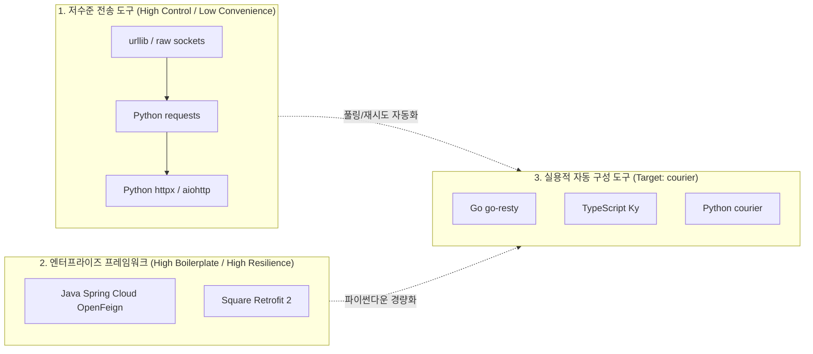

# [courier] 글로벌 언어별 HTTP 클라이언트 설계 철학 및 레퍼런스 벤치마킹 분석 보고서

- **작성일자**: 2026-09-23
- **작성자**: 시니어 마켓 및 아키텍처 애널리스트 (`market-analyst`)
- **문서 버전**: v1.1 (Humanizer 지침 적용 개정판)
- **상태**: Approved

---

## 1. 분석 개요 및 목적 (Executive Summary)

### 배경: 왜 파이썬의 외부 API 호출 코드는 항상 지저분해지는가?
마이크로서비스와 외부 서드파티 SaaS(결제 PG, 카카오 알림톡, 배송 추적, LLM API 등) 연동이 늘어나면서, 백엔드 서비스 트래픽의 상당수가 인바운드 DB 쿼리가 아닌 아웃바운드 HTTP 호출로 이동했습니다.

현재 Python 생태계의 표준 도구인 `requests`, `httpx`, `aiohttp`는 훌륭한 네트워크 전송 계층(Transport Layer) 라이브러리입니다. 그러나 엔터프라이즈 실무 환경에서는 이 전송 계층 위에 올려야 하는 필수 운영 로직이 매 프로젝트마다 개발자 개인의 취향에 따라 파편화되어 작성됩니다:
- 일시적 502/503/429 장애 시 지수 백오프 재시도 로직 구현
- API 제공사마다 제각각인 에러 응답 포맷(JSON 바디 vs HTTP 상태 코드) 파싱
- 컨테이너/K8s 환경에서 환경별(Local, Dev, Prod) Base URL, Timeout, Secret Key 주입 관리
- 동기 배치(Celery 워커)와 비동기 웹(FastAPI) 간의 클라이언트 인스턴스 분리

이로 인해 프로덕션 장애 리뷰(Post-mortem)를 열어보면 "외부 API 타임아웃 미설정으로 인한 스레드 고갈", "`raise_for_status()` 예외 발생 시 에러 바디 유실로 인한 디버깅 불가", "비동기 루프 내 세션 매번 생성으로 인한 OS 소켓 고갈(`Too many open files`)"이 반복적으로 관측됩니다.

### 목표
Java(`OpenFeign`, `Retrofit 2`), Go(`go-resty/resty`), TypeScript(`Axios`, `Ky`), Python(`requests`, `httpx`, `aiohttp`)의 설계 철학과 실제 운영 시 겪는 트레이드오프를 비교 분석합니다. 이를 바탕으로 설정 파일 및 환경변수 기반으로 즉시 커넥션 풀을 구성하고, 어떤 상황에서도 비정상 종료(Crash) 없이 예측 가능한 `ApiResponse[T]`를 반환하는 파이썬 전용 HTTP 자동 구성 라이브러리 `courier`의 실질적인 설계 기준을 확립합니다.

---

## 2. 벤치마킹 대상 라이브러리 선정 (Benchmark Targets)

| 언어 / 생태계 | 라이브러리 | 아키텍처 설계 철학 | 강점 (Strengths) | 약점 및 운영상 트레이드오프 (Gotchas) |
| :--- | :--- | :--- | :--- | :--- |
| **Java (Spring)** | **Spring Cloud OpenFeign** | **선언적 인터페이스 바인딩**<br/>"HTTP 호출 코드를 짜지 말고, 명세를 선언하라" | 어노테이션(`@GetMapping`, `@RequestParam`)으로 인터페이스를 정의하면 동적 프록시가 요청을 자동 빌드. 비즈니스 로직과 통신 계층의 완전 분리. | 동적 런타임 헤더/경로 제어 시 복잡한 `RequestInterceptor` 구현 필요. 스프링 컨텍스트 기동 시간이 길고 리플렉션 오버헤드 존재. |
| **Java / Android** | **Square Retrofit 2** | **타입 세이프 RPC 모델**<br/>"원격 API를 로컬 메서드처럼 다룬다" | Converter(Gson/Moshi/Jackson)를 통한 양방향 DTO 매핑. `Call<T>`를 활용한 동기/비동기/RxJava/코루틴 유연 연동. | 동적 엔드포인트 변경이 까다로움. 에러 바디 파싱 시 별도의 에러 전용 Converter를 수동으로 바인딩해야 하는 번거로움. |
| **Go** | **go-resty/resty** | **체이닝 기반 통합 응답**<br/>"직관적인 빌더와 예측 가능한 단일 응답" | `client.R().SetResult(&res).SetError(&err).Get(url)` 패턴으로 2xx와 4xx/5xx DTO 자동 분기 역직렬화. 레이턴시 및 재시도 내장. | Go의 리플렉션(`reflect`) 기반 언마샬링 비용 발생. 복잡한 미들웨어 파이프라인 구성 시 글로벌 설정 오염 주의 필요. |
| **TypeScript** | **Axios & Ky** | **인터셉터 & 불변 훅**<br/>"생명주기 가로채기 및 현대적 Fetch 래핑" | Axios의 전역 요청/응답 인터셉터. Ky의 가벼운 번들(약 2KB), 불변 확장(`ky.extend()`), 429/5xx 기본 지수 백오프. | TypeScript 제네릭(`api.get<User>()`)은 컴파일 타임 검증일 뿐이므로, 실제 서버 응답 스키마가 깨지면 런타임 `TypeError` 발생. |
| **Python** | **requests / httpx / aiohttp** | **단순한 전송 프리미티브**<br/>"인간을 위한 HTTP, 단순함이 복잡함보다 낫다" | 직관적인 `httpx.get(...)`. `httpx`의 동기/비동기 API 대칭성 및 HTTP/2 지원. 방대한 생태계 레퍼런스. | 복원력(Retry, Circuit Breaker), 일관된 Result 모델, 서비스별 설정 관리 기능이 없어 애플리케이션 코드가 직접 보일러플레이트를 작성해야 함. |

---

## 3. 심층 기능 및 개발자 경험(DX) 비교 분석

| 평가 항목 | Java OpenFeign / Retrofit 2 | Go Resty | TypeScript Ky | Python httpx / requests | courier 설계 방향 |
| :--- | :--- | :--- | :--- | :--- | :--- |
| **호출 인터페이스** | 인터페이스 선언 (`@FeignClient`) | 플루언트 체이닝 (`client.R()...`) | 함수형 체이닝 (`ky.get(...)`) | 함수 직접 호출 (`httpx.get(...)`) | **하이브리드: 직관적 인스턴스 호출 + 데코레이터 선언 지원** |
| **응답 데이터 모델** | 반환 타입 DTO 강제 (실패 시 예외) | `resty.Response` (`Result()`, `Error()`) | Promise Response (실패 시 reject) | 원시 `Response` (파싱 실패 시 예외 던짐) | **`ApiResponse[T]`: 항상 일관된 컨테이너 반환 (Result 패턴)** |
| **에러 핸들링 방식** | `ErrorDecoder` 또는 예외 catch | `resp.IsError()` 조건 분기 | `try-catch` 또는 `catch` 블록 | `raise_for_status()` 예외 발생 | **`res.is_success` 기반 방어적 제어 + 필요 시 `res.unwrap()`** |
| **재시도 메커니즘** | Spring Retry / Resilience4j 연동 | 내장 지수 백오프 (`SetRetryCount`) | 기본 지수 백오프 내장 (최대 2회) | `HTTPAdapter` 수동 주입 / `tenacity` 래핑 | **내장 스마트 재시도: Full Jitter + 429 Retry-After 헤더 파싱** |
| **다중 서비스 설정 관리** | YAML `feign.client.config` | 코드 레벨 수동 인스턴스화 | `ky.extend()`로 인스턴스 복제 | 매번 인스턴스 수동 생성 및 매핑 | **계층형 로더: ENV $\rightarrow$ YAML/JSON $\rightarrow$ 인라인 설정 자동 병합** |
| **동기/비동기 통합** | WebClient vs Feign 분리 | Goroutine 네이티브 | Promise/async-await 단일화 | `Client` vs `AsyncClient` 분리 | **단일 설정 레지스트리에서 동기(`get`) / 비동기(`async_get`) 동시 제공** |

---

## 4. 라이브러리별 핵심 설계 철학과 개발자 선호 요인 (Killer Features)

### 1. Go Resty의 듀얼 모델 바인딩 (`SetResult` & `SetError`)
- **실제 동작 방식**:
  ```go
  var user UserSuccessDto
  var apiErr ApiErrorDto

  resp, err := client.R().
      SetResult(&user).
      SetError(&apiErr).
      Get("/v1/users/123")
  ```
- **개발자가 환호하는 이유**:
  외부 API는 200 OK일 때는 정상 데이터를 주지만, 400 Bad Request일 때는 에러 코드와 사유를 담은 완전히 다른 JSON 구조를 반환합니다. 개발자가 직접 상태 코드를 보고 if/else로 분기하여 `json.loads`를 호출할 필요 없이, 라이브러리가 2xx일 때는 Success DTO에, 4xx/5xx일 때는 Error DTO에 자동으로 언마샬링해주므로 비즈니스 로직의 분기 코드가 비약적으로 간결해집니다.

### 2. Java OpenFeign / Retrofit의 인터페이스 추상화
- **실제 동작 방식**:
  ```java
  @FeignClient(name = "billing-service", url = "${services.billing.url}")
  public interface BillingClient {
      @PostMapping("/charges")
      ChargeResponse createCharge(@RequestBody ChargeRequest request);
  }
  ```
- **개발자가 환호하는 이유**:
  비즈니스 서비스 레이어 입장에서는 대상이 로컬 컴포넌트인지, 원격 마이크로서비스인지 알 필요가 없습니다. URL 문자열 조립, 직렬화, HTTP 헤더 인코딩 등 저수준 프로토콜 디테일을 인터페이스 뒤로 완전히 감춤으로써 코드의 결합도를 낮추고 테스트 시 모킹(Mocking)이 매우 쉬워집니다.

### 3. TypeScript Ky의 불변 인스턴스 확장 (`ky.extend`)
- **실제 동작 방식**:
  ```typescript
  const baseClient = ky.create({ prefixUrl: 'https://api.internal', timeout: 5000 });
  const paymentClient = baseClient.extend({
      prefixUrl: 'https://api.internal/payment',
      headers: { 'X-Service-Name': 'order-service' }
  });
  ```
- **개발자가 환호하는 이유**:
  전역 클라이언트를 오염시키지 않으면서 특정 도메인(결제, 알림 등)에 필요한 서브 경로, 헤더, 타임아웃만 깔끔하게 덮어쓸 수 있습니다. 얕은 복사나 전역 상태 변경으로 인한 사이드 이펙트가 원천적으로 발생하지 않습니다.

---

## 5. Python 환경에서의 실무 장애 패턴 및 페인포인트 (Production Pitfalls)

### 1. `raise_for_status()` 예외 폭탄과 에러 응답 유실
- **실제 장애 시나리오**:
  ```python
  # 흔히 작성되는 위험한 코드
  resp = client.post("https://pg.company.com/pay", json=payload)
  resp.raise_for_status()  # 400 Bad Request 발생 시 HTTPStatusError 발생
  return resp.json()
  ```
  PG사가 400 Bad Request와 함께 바디에 `{"code": "ERR_CARD_EXPIRED", "message": "카드 유효기간이 지났습니다"}`를 반환했습니다. 그러나 `raise_for_status()`가 호출되는 순간 파이썬 예외가 발생하여 상위 핸들러로 튕겨 나갑니다. 상위 예외 처리기에서 이를 잡지 못하면 사용자에게는 원인 불명의 500 Internal Server Error가 전달됩니다. 잡아서 바디를 추출하려 해도 `except HTTPStatusError as e: err_body = e.response.json()`과 같이 지저분한 예외 가로채기 코드가 서비스 레이어 전반에 도배됩니다.

### 2. 재시도 로직의 파편화와 썬더링 허드(Thundering Herd)
- **실제 장애 시나리오**:
  - `requests`에서 재시도를 걸려면 `urllib3.util.Retry` 클래스를 불러와 파라미터를 조합하고 `HTTPAdapter`를 만들어 세션의 `mount()`에 걸어야 합니다.
  - 많은 개발자가 이 설정이 번거로워 `tenacity` 데코레이터를 외부 함수에 덕지덕지 붙입니다. 이 경우 400(잘못된 요청 파라미터)이나 401(인증 실패)처럼 재시도해도 절대 성공할 수 없는 클라이언트 에러까지 무차별 3~5회 재시도하여 상대 서버를 공격(Self-DoS)하는 부작용이 발생합니다.
  - 또한 고정 지연 시간(Fixed Delay)으로 재시도할 경우, 일시적 장애 복구 시점에 수천 개의 요청이 동시에 서버를 강타하는 썬더링 허드가 발생합니다. 백오프에 지터(Random Jitter)를 추가하고 파트너사의 `Retry-After` 응답 헤더를 준수하는 재시도 로직이 절실합니다.

### 3. 세션 라이프사이클 미숙지로 인한 소켓 누수
- **실제 장애 시나리오**:
  ```python
  # FastAPI 엔드포인트 안티패턴
  @app.post("/items")
  async def create_item():
      async with httpx.AsyncClient() as client:
          res = await client.post(...)
  ```
  매 API 호출마다 비동기 클라이언트를 열고 닫으면 커넥션 풀을 전혀 활용하지 못합니다. 매번 새로운 TCP 3-Way Handshake와 TLS 협상이 발생하여 레이턴시가 10ms에서 150ms 이상으로 증가합니다. 트래픽이 집중되면 OS 커널에 `TIME_WAIT` 상태의 소켓이 2만~3만 개씩 쌓이며 `OSError: [Errno 24] Too many open files` 에러와 함께 서버 프로세스가 다운됩니다.

### 4. 다중 서비스 연동 시 설정 분산 및 하드코딩
- **실제 운영 시나리오**:
  하나의 서비스에서 결제(타임아웃 3초, 재시도 1회), 푸시 알림(타임아웃 1초, 재시도 3회), 배치 정산(타임아웃 60초, 재시도 0회) 등 여러 외부 API를 호출합니다. 각 클라이언트의 Base URL, 타임아웃, 토큰 발급 엔드포인트가 파이썬 코드 이곳저곳에 하드코딩되어 있습니다. 스테이징과 프로덕션 배포 시 환경변수가 누락되거나, 장애 발생 시 긴급하게 타임아웃을 늘리려면 코드를 수정하고 재배포해야 하는 구조적 한계가 존재합니다.

---

## 6. courier의 기술적 포지셔닝 및 차별화 전략 (Technical Strategy)

### 1. 엔지니어링 포지셔닝 매트릭스



`courier`는 `httpx`의 뛰어난 HTTP/1.1 및 HTTP/2 전송 엔진을 기반으로, 상위 레이어에서 실무 필수 운영 요구사항(계층형 설정, Result 패턴, 스마트 재시도, 커넥션 풀 싱글톤)을 완성도 높게 제공하는 포지션을 지향합니다.

### 2. courier의 4대 핵심 아키텍처 원칙

#### 원칙 1: Zero-Crash를 보장하는 `ApiResponse[T]` (Result 패턴)
- 네트워크 에러, HTTP 4xx/5xx, JSON 역직렬화 실패 등 어떤 상황에서도 호출 스레드를 강제 중단(Crash)시키지 않습니다.
- 항상 아래의 구조화된 데이터 컨테이너를 반환합니다:
  ```python
  res = client.get("/users/42")

  if res.is_success:
      # Pydantic 모델로 한 줄 매핑 (선택사항)
      user: UserDto = res.into(UserDto)
      print(f"조회 성공: {user.name} ({res.duration_ms:.2f}ms)")
  else:
      # 4xx/5xx 응답 또는 네트워크 타임아웃 에러 바디 보존
      print(f"실패 [{res.status_code}]: {res.error.message}")
      print(f"원시 응답 바디: {res.raw_text}")
  ```
- 전통적인 예외 전파 방식을 선호하는 코드베이스를 위해 `res.unwrap()` 메서드를 함께 제공합니다. `is_success`가 False인 경우 원인 컨텍스트가 풍부하게 담긴 `CourierRequestError`를 던집니다.

#### 원칙 2: 계층형 다중 서비스 설정 로더 (Layered Config Loader)
- `config/courier.yaml`, `config/courier.json`, 그리고 환경변수(`COURIER__CLIENTS__PAYMENT__BASE_URL`)를 3단계 우선순위로 자동 병합합니다.
- 서비스 명칭 기반으로 즉시 격리된 클라이언트를 획득합니다:
  ```python
  from courier import get_client

  # courier.yaml의 'payment' 블록 설정이 바인딩된 인스턴스 획득
  payment_client = get_client("payment")
  res = payment_client.post("/charges", json=payload)
  ```

#### 원칙 3: Full Jitter & 429 헤더를 준수하는 스마트 재시도
- 멱등성이 보장되지 않는 POST 요청에 대한 무분별한 재시도를 기본 차단하고, 안전한 멱등 메서드(GET, PUT, DELETE) 및 명시적으로 지정한 엔드포인트에 한해 재시도를 적용합니다.
- 서버가 과부하로 `429 Too Many Requests`와 함께 `Retry-After: 15` 헤더를 응답하면, 백오프 수식을 무시하고 해당 지연 시간만큼 정확히 대기 후 재시도합니다.
- AWS 지수 백오프 표준 알고리즘인 Full Jitter($Wait = \text{random}(0, \min(\text{max\_wait}, \text{base} \times 2^{\text{attempt}}))$)를 기본 탑재합니다.

#### 원칙 4: 동기(Sync) / 비동기(Async) 대칭 인터페이스 및 싱글톤 풀 관리
- Django ORM 및 Celery 워커 환경에서는 동기 인터페이스(`client.get`)를, FastAPI 및 Tornado 비동기 환경에서는 비동기 인터페이스(`await client.async_get`)를 동일한 인스턴스에서 사용할 수 있습니다.
- 내부적으로 호스트별 커넥션 풀을 관리하여 소켓 누수(`TIME_WAIT`)를 방지하고, 프로세스 종료 시그널(`SIGTERM`) 수신 시 진행 중인 커넥션을 정상 드레인(Drain)하는 수명주기 훅을 내장합니다.

---

## 7. 아키텍처 트레이드오프 및 주의사항 (Gotchas & Limitations)

1. **`ApiResponse` 래핑에 따른 오버헤드**:
   원시 딕셔너리를 직접 다루는 것에 비해 `ApiResponse` 객체 인스턴스화 및 Pydantic `res.into()` 검증 시 페이로드 크기에 따라 0.1ms~1ms 수준의 CPU 처리 시간이 추가됩니다. 극도의 초저지연(Microsecond 단위)이 요구되는 HFT(고빈도 매매) 시스템이 아니라면 가독성과 안정성 확보가 가져오는 이점이 훨씬 큽니다.
2. **Result 패턴과 Python 관례(Idiomatic Python)의 충돌**:
   파이썬은 전통적으로 "허락을 구하기보다 용서를 구하는 편이 쉽다(EAFP)"는 철학에 따라 `try-except`를 선호합니다. 따라서 모든 개발자에게 강제적으로 Result 패턴만을 강요하면 거부감이 생길 수 있습니다. 이를 완화하기 위해 `res.unwrap()`과 `raise_on_failure=True` 옵션을 기본 제공하여 점진적 도입을 지원해야 합니다.
3. **분산 환경에서의 커넥션 수 제한 고려**:
   라이브러리 내부 풀 기본값을 너무 크게 잡으면(예: 인스턴스당 100개), K8s Pod가 20개로 스케일아웃될 때 서드파티 서버에 동시 커넥션 2,000개가 몰려 방화벽 차단을 당할 수 있습니다. 기본 풀 크기는 20개 내외로 보수적으로 설정하고 환경변수로 쉽게 조정할 수 있도록 열어두어야 합니다.
