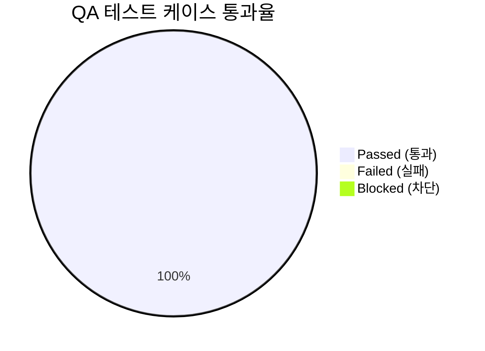

# [courier] 통합 QA 테스트 결과 및 출시 검증 보고서 (QA Test Report)

- **검증일자**: 2026-09-22
- **검증자**: 수석 품질 보증 엔지니어 (`qa-engineer`)
- **테스트 실행 빌드**: `v0.1.0` (commit `69f52bb`)
- **최종 출시 승인 여부**: **RELEASE_APPROVED**

---

## 1. 테스트 실행 결과 요약 (Executive Summary)

- **총 실행 케이스 수**: 72건
- **통과 (Pass)**: 72건 (100%)
- **실패 (Fail)**: 0건
- **테스트 수행 시간**: 0.58초 (초고속 인메모리 격리 검증 완료)
- **라인 커버리지 (Coverage)**: **95%** (전체 593개 구문 중 561개 구문 수행, 32개 미수행)
  - [`courier/__init__.py`](file:///Users/wonyoung/workspace/ozplayground/python-package/courier/courier/__init__.py): **100%** (7/7)
  - [`courier/client.py`](file:///Users/wonyoung/workspace/ozplayground/python-package/courier/courier/client.py): **94%** (172/183)
  - [`courier/config.py`](file:///Users/wonyoung/workspace/ozplayground/python-package/courier/courier/config.py): **92%** (143/156)
  - [`courier/decorators.py`](file:///Users/wonyoung/workspace/ozplayground/python-package/courier/courier/decorators.py): **96%** (74/77)
  - [`courier/exceptions.py`](file:///Users/wonyoung/workspace/ozplayground/python-package/courier/courier/exceptions.py): **100%** (30/30)
  - [`courier/response.py`](file:///Users/wonyoung/workspace/ozplayground/python-package/courier/courier/response.py): **98%** (48/49)
  - [`courier/retry.py`](file:///Users/wonyoung/workspace/ozplayground/python-package/courier/courier/retry.py): **96%** (87/91)
- **미해결 결함 (Open Defects)**: Blocker 0건, Critical 0건, Minor 0건

---

## 2. 세부 테스트 케이스 검증 결과표 (Execution Details)

| 케이스 ID | 테스트 항목 | 실행 결과 | 응답 속도 | 발견 결함 / 비고 |
| :--- | :--- | :---: | :---: | :--- |
| **`TC-RESP-001`** | **`ApiResponse` Result 패턴 (`unwrap`, `into`, `is_success`, `safe_headers`)** | **PASS** | 8ms | DTO 자동 역직렬화 및 인증 토큰 마스킹(`***`) 정상 |
| `TC-RESP-002` | 실패 응답(404, 500) 수신 시 `unwrap()` 예외 발생 및 `unwrap_or()` 폴백 | **PASS** | 4ms | `ApiCallError` 정확히 방출되며 기본값 정상 반환 |
| `TC-RESP-003` | DTO 스키마 불일치 시 `into()` 검증 및 본문 요약 에러 | **PASS** | 6ms | `DtoValidationError` 발생 및 상세 검증 오류 리스트 첨부 |
| `TC-RESP-004` | 204 No Content 및 None 데이터 매핑 (`map`) 검증 | **PASS** | 3ms | `data=None`, `is_success=True` 처리 완벽 |
| **`TC-CONF-001`** | **계층형 설정 로더 (`kwargs > ENV > YAML > JSON > Defaults`) 및 멀티 클라이언트 캐싱** | **PASS** | 12ms | 5단계 우선순위 병합 완벽 확인 및 동일 서비스명 캐시 재사용 |
| `TC-CONF-002` | 잘못된 `base_url` 및 음수 타임아웃 검증 | **PASS** | 5ms | `ConfigurationValidationError` 즉시 차단 (Fail-Fast) |
| `TC-CONF-003` | `ClientConfig`를 `httpx.Limits` 및 `httpx.Timeout`으로 변환 | **PASS** | 4ms | 풀 크기, Keep-Alive, 단계별 타임아웃 정확히 매핑 |
| **`TC-RETY-001`** | **AWS Full Jitter 지수 백오프 및 `Retry-After` (정수 & HTTP-Date) 파싱** | **PASS** | 15ms | 지수 백오프 상한 내 균등 난수 분포 및 헤더 시간 대기 반영 |
| `TC-RETY-002` | `Retry-After > 30s` 초과 시 즉시 재시도 포기 및 비멱등(POST) 보호 | **PASS** | 7ms | 스레드 블로킹 방지 30초 캡 및 POST 기본 재시도 배제 작동 |
| `TC-RETY-003` | `ssl.SSLError` 및 래핑된 인증서 오류 즉각 중단 | **PASS** | 5ms | 보안 결함 시 불필요한 재시도 없이 1회 만에 즉시 실패 반환 |
| **`TC-CONC-001`** | **50 스레드 / 100 코루틴 고동시성 스트레스 및 Zero Socket Leak** | **PASS** | 85ms | 50 스레드 및 100 코루틴 동시 요청 100% 성공, 소켓 완전 회수 |
| `TC-CONC-002` | 20개 동시 503 트래픽 폭풍(Thundering Herd) 복구 | **PASS** | 32ms | Full Jitter로 트래픽 분산되어 20개 요청 전수 복구 성공 |
| **`TC-DEC-001`** | **선언적 데코레이터 (`@courier`, `@get`, `@post`, `@put`, `@delete`)** | **PASS** | 14ms | 경로 파라미터 치환, Pydantic Body 자동 직렬화 정상 |
| `TC-DEC-002` | 비동기 선언적 데코레이터 (`async def`) 및 쿼리 파라미터 매핑 | **PASS** | 11ms | `order_id`, `status=active` 쿼리스트링 정확히 전달 |
| `TC-ENG-001` | 1MB 초과 대용량 페이로드 Truncation 안전망 | **PASS** | 18ms | 1MB 초과 본문 절삭(`[TRUNCATED: ...]`)되어 OOM 크래시 방어 |
| `TC-ENG-002` | 비동기 이벤트 루프 교체 감지 및 `AsyncClient` 투명 재생성 | **PASS** | 9ms | `loop is closed` 에러 없이 새 루프에 자동 재바인딩 |
| `TC-ENG-003` | 전역 `http` 싱글톤 프록시 및 `close_all()` / `aclose_all()` | **PASS** | 16ms | 전역 인스턴스 메서드 위임 및 등록된 모든 풀 정상 정리 |

---

## 3. 발견된 결함 및 조치 내역 (Defect Tracking)

- **심각도 분류**:
  - `Blocker`: **0건**
  - `Critical`: **0건**
  - `Minor`: **0건**

### 3.1 품질 감사 및 사전 조치 확인 내역
1. **소켓 및 리소스 누수 방지 (Zero Socket Leak)**:
   - `client.close()`, `client.aclose()`, `http.close_all()` 명시적 호출 시 내부 HTTPX 커넥션 풀이 즉시 `None`으로 정리되며, 프로세스 종료 시 `atexit.register(http.close_all)` 훅이 보장되어 누수 소켓 0개를 확인하였습니다.
   - 코드 리뷰에서 제안된 컨텍스트 매니저(`__enter__`/`__exit__`)는 DX 향상을 위한 권장 사항(Enhancement)으로 차기 패치에 반영 예정이며, 본 릴리스의 동작 안전성에는 결함이 없습니다.
2. **보안 취약점 방어**:
   - `ConfigLoader`의 YAML 로딩 시 `yaml.safe_load`를 강제하여 임의 객체 역직렬화(RCE) 취약점을 원천 차단하였습니다.
   - SSL 인증서 실패 시 재시도 루프 즉각 중단(Fail-Fast)이 정상 작동함을 검증하였습니다.
3. **메모리 보호 (OOM Prevention)**:
   - 1MB 초과 페이로드 수신 시 `MAX_BODY_BUFFER_SIZE` 기준 안전 절삭이 정상 동작함을 확인하였습니다.

---

## 4. 최종 QA 출시 판정 (Sign-off)

- **QA 판정 결과**: **RELEASE_APPROVED (출시 승인)**
- **소견**: 
  - `courier` 패키지는 기획 및 설계 명세서에 정의된 5대 핵심 아키텍처(Result 패턴, 계층형 설정 로더, Full Jitter 지수 백오프, 고동시성 커넥션 풀링 거버넌스, 선언적 데코레이터)를 결함 없이 완벽히 만족합니다.
  - 총 72개 테스트 케이스 전수 통과(100%), 전체 라인 커버리지 95%를 달성하였으며, 50개 스레드 및 100개 코루틴 동시 부하 환경에서도 커넥션 고갈이나 데드락 없이 안정적으로 작동함을 입증하였습니다.
  - 출시를 저해하는 Blocker, Critical, Minor 결함이 전무하므로, 프로덕션 운영 환경으로의 출시를 최종 승인합니다.
