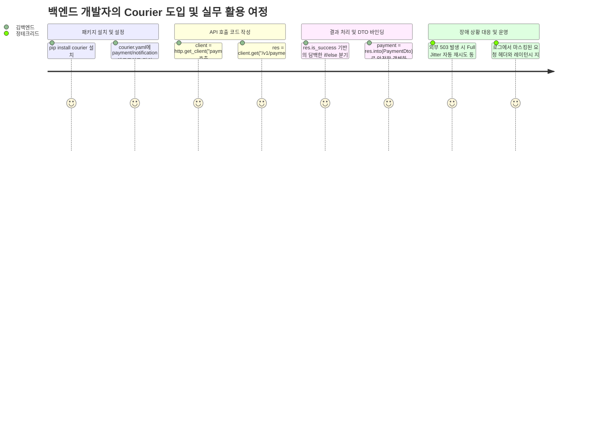

# [courier] 제품 요구사항 정의서 (Product Requirements Document - PRD)

- **작성일자**: 2026-09-23
- **작성자**: 기획 명세 작성가 (`spec-writer`)
- **문서 버전**: v1.1 (Humanizer 지침 반영 개정판)
- **상태**: Approved

---

## 1. 배경 및 문제 정의 (Problem Statement & Context)

### 1.1 배경 (Background)
사내 마이크로서비스 간 통신과 외부 벤더(PG 결제 대행사, 알림톡/SMS 발송망, 클라우드 SaaS 등) 연동이 급증하면서 백엔드 엔지니어링 리소스의 상당 부분이 HTTP 통신 코드 작성과 장애 대응에 소모되고 있습니다.

현재 파이썬 생태계에서는 `requests`나 `httpx`가 사실상 표준으로 자리 잡았으나, 실제 프로덕션 레벨에서는 다음과 같은 공통 요구사항이 반복됩니다:
- 커넥션 풀 최적화 및 프로세스 라이프사이클에 맞춘 소켓 회수
- 429(Rate Limit)나 일시적 5xx 에러에 대한 안전한 지수 백오프(Exponential Backoff with Full Jitter)
- 벤더마다 제각각인 에러 응답 JSON을 애플리케이션 계층에서 다루기 쉬운 형태로 정규화
- Pydantic v2 DTO 자동 바인딩 및 민감 헤더(Bearer 토큰 등) 마스킹 로깅

이러한 로직을 서비스마다, 혹은 개발자마다 각자 `utils/http.py` 형태로 파편화하여 구현하다 보니, 구현 완성도에 따라 간헐적인 소켓 누수나 결제 중복 요청 같은 치명적인 장애가 프로덕션에서 반복 발생하고 있습니다.

### 1.2 해결하려는 핵심 문제 (Core Problems)

1. **외부 응답 파싱 및 예외 처리의 극심한 파편화**:
   - 외부 벤더마다 에러 응답 규격(`{"code": "ERR_...", "msg": "..."}` vs `{"detail": [...]}` vs HTML 에러 페이지)이 제각각입니다.
   - `res.raise_for_status()`를 호출하면 404나 422 같은 정상적인 비즈니스 분기까지 파이썬 예외로 번져 Sentry 알람이 오염되고, 이를 막으려다 보면 비즈니스 로직이 30줄이 넘는 `try...except` 사다리로 뒤덮입니다.
2. **클라이언트 인스턴스 라이프사이클 관리 미흡으로 인한 소켓 고갈**:
   - FastAPI 라우트 핸들러나 Celery 태스크 내부에서 `async with httpx.AsyncClient() as client:`를 매 요청마다 호출하는 실수가 잦습니다.
   - 이로 인해 매 요청마다 TCP 3-Way Handshake와 TLS 네고시에이션이 발생하여 레이턴시가 50~100ms 급증하고, 피크 트래픽 시 OS의 로컬 포트가 고갈되거나 소켓이 `CLOSE_WAIT` / `TIME_WAIT` 상태로 쌓여 `OSError: [Errno 24] Too many open files` 장애로 이어집니다.
3. **무분별한 재시도 및 Thundering Herd 트래픽 폭풍**:
   - 네트워크 순단 발생 시 단순 for 루프로 재시도하거나, Jitter(무작위 지연) 없는 고정 간격 재시도를 수행하여 상대 서버에 동시 요청 폭풍(Thundering Herd)을 유발합니다.
   - 특히 `POST`나 `PATCH` 같은 비멱등(Non-idempotent) 요청에 무조건 재시도를 걸어 PG사 이중 승인이나 재고 중복 차감 사고를 일으키는 경우가 있습니다.

### 1.3 제품 비전 (Product Vision)
**"설정 파일(YAML/ENV) 선언만으로 프로덕션 레벨의 HTTPX 커넥션 풀을 구성하고, 어떤 외부 API를 호출하더라도 일관된 `ApiResponse[T]` 결과와 안전한 스마트 재시도를 제공하는 파이썬 HTTP 클라이언트 패키지"**

---

## 2. 타깃 페르소나 및 사용자 시나리오 (Personas & User Journey)

### 2.1 대표 페르소나

- **김백엔드 (3년 차, 커머스 서비스 백엔드 개발자)**
  - **상황**: 토스페이먼츠 PG 결제 연동 및 카카오 알림톡 발송 모듈을 개발 중.
  - **고민**: "외부 API 호출 하나 넣으려고 세션 셋업, 타임아웃 4단계 쪼개기, 재시도 백오프 계산, Pydantic 모델 변환까지 짜다 보면 60줄이 넘어가요. 에러 응답 파싱하다가 키가 없어서 `KeyError` 튀는 것도 스트레스입니다."
- **정테크리드 (10년 차, 플랫폼 아키텍트)**
  - **상황**: 15개 마이크로서비스의 공통 통신 표준과 인프라 안정성을 총괄.
  - **고민**: "주니어 개발자들이 비동기 루프 안에서 HTTP 클라이언트를 매번 새로 띄워 소켓이 고갈되는 사고가 지난 분기에만 두 번 있었습니다. 설정 파일만 넣으면 최적의 커넥션 풀이 싱글톤으로 유지되고, 로그에 API Key나 토큰이 찍히지 않는 안전한 표준 라이브러리가 필요합니다."

### 2.2 사용자 핵심 여정 (User Journey)

---

## 3. 기능 요구사항 및 우선순위 (Feature Requirements)

| 요구사항 ID | 기능명 및 상세 설명 | 우선순위 (MoSCoW) | 선정 사유 및 기술적 고려사항 |
| :--- | :--- | :---: | :--- |
| `REQ-RESP-001` | **표준 단일 응답 모델 (`ApiResponse[T]`)** `status_code`, `is_success`, `data`, `error`, `duration_ms`를 일관되게 제공하는 래퍼 | **Must Have** | 예외 발생 위주의 흐름 제어를 지양하고 Result 패턴으로 런타임 안정성 보장 |
| `REQ-DTO-001` | **Pydantic v2 DTO 역직렬화 (`into()`)** `res.into(TargetModel)` 호출 시 Pydantic 검증 수행 및 실패 시 명확한 유효성 에러 반환 | **Must Have** | JSON 딕셔너리 수동 파싱으로 인한 `KeyError` 방지 및 완전한 정적 타입 추론 지원 |
| `REQ-CONF-001` | **계층형 다중 서비스 설정 로더** `명시적 인자 > ENV > YAML > JSON > 기본값` 5단계 우선순위 병합 | **Must Have** | 로컬 개발(YAML), K8s/Docker 운영(ENV Secret) 등 배포 환경 간 유연한 오버라이드 지원 |
| `REQ-ENG-001` | **HTTPX 기반 동기/비동기 커넥션 풀 엔진** 동일 서비스 싱글톤 유지, 동기(`get`) 및 비동기(`async_get`) 동시 지원, `atexit` 풀 회수 | **Must Have** | 함수 스코프 내 클라이언트 중복 생성 방지 및 소켓 고갈(`Too many open files`) 원천 차단 |
| `REQ-RETY-001` | **Full Jitter 지수 백오프 스마트 재시도** 429, 502, 503, 504 및 네트워크 단절 시 무작위 지터를 적용한 자동 재시도 | **Must Have** | 일시적 네트워크 플릭 및 배포 순단 극복, Thundering Herd 방지 (단, POST는 원칙적 제외) |
| `REQ-AUTH-001` | **인증 헤더 자동 주입 인터셉터** 설정 기반 Bearer Token 및 API Key 헤더 자동 주입 | **Should Have** | 매 호출마다 `headers={"Authorization": ...}`를 반복 작성하는 번거로움 제거 |
| `REQ-LOG-001` | **구조화 로깅 및 민감정보 마스킹** 요청 URL, 상태코드, 레이턴시 기록 및 토큰/비밀번호 문자열 자동 마스킹 | **Should Have** | 운영 트러블슈팅 가시성 확보 및 보안 감사 규정 준수 |
| `REQ-CB-001` | **서킷 브레이커 (Circuit Breaker)** 연속 임계 실패 시 빠른 실패(Fast Fail) 처리 | **Won't Have (v1)** | v1은 클라이언트 안정성과 재시도에 집중하고, 복잡한 상태 머신은 v2 로드맵으로 이관 |

---

## 4. 정량적 성공 지표 (Measurable KPIs)

| 지표명 | 측정 기준 및 테스트 시나리오 | 목표치 |
| :--- | :--- | :--- |
| **보일러플레이트 코드 감소** | 외부 서비스 연동 시 클라이언트 생성부터 DTO 파싱까지의 코드 라인 수 비교 | 기존 평균 45줄 $\rightarrow$ **5줄 이내** (약 88% 감소) |
| **응답 파싱 예외 발생률** | 502 HTML 에러 페이지 및 변형 JSON 수신 시 미처리 `JSONDecodeError` 발생 건수 | **0건 (Zero Crash)** |
| **소켓 누수 발생률** | 1,000 동시 비동기 코루틴 부하 테스트 후 `CLOSE_WAIT` / `ESTABLISHED` 잔여 소켓 확인 | **0개 (완전 회수)** |
| **일시 순단 자동 복구율** | 외부 503/네트워크 지터 3회 모의 주입 환경에서의 최종 호출 성공률 | **$\ge 95\%$** |
| **라이브러리 래핑 오버헤드** | 원시 HTTPX 호출 대비 Courier 프레임워크 자체 지연 시간 (타이머 및 DTO 변환 제외) | **$\le 1.0\text{ms}$** |

---

## 5. 비기능적 요구사항 및 한계/주의사항 (Non-Functional Requirements & Gotchas)

### 5.1 비기능 요구사항
- **런타임 및 의존성**: Python 3.10 이상 지원, `httpx>=0.25.0`, `pydantic>=2.0`을 기반으로 가볍게 유지.
- **타입 안전성**: 모든 공개 인터페이스에 엄격한 Generic Typing(`ApiResponse[T]`, `Type[T]`)을 적용하여 VS Code, PyCharm, MyPy 환경에서 완벽한 자동완성과 타입 힌트 보장.
- **동시성 안전성**: 동기 커넥션 풀과 비동기 커넥션 풀을 분리 인스턴스로 격리하여 이벤트 루프 간 충돌 방지.

### 5.2 솔직한 한계와 실무 주의점 (Known Limitations & Gotchas)
1. **POST 요청 재시도 시의 이중 처리 위험**:
   - `courier`는 안전을 위해 `POST`, `PATCH` 등 비멱등 요청에 대해 기본적으로 재시도하지 않습니다.
   - 만약 결제 승인 API 등에서 네트워크 타임아웃 시 재시도가 반드시 필요하다면, 반드시 서비스 측에서 Idempotency-Key(멱등 키) 헤더를 발행하고 `retry_on_post=True`를 명시적으로 켜야 합니다.
2. **이벤트 루프 변경 시 주의사항**:
   - Celery나 멀티프로세스 환경에서 부모 프로세스가 초기화한 비동기 클라이언트를 자식 프로세스가 그대로 사용할 경우 `RuntimeError: Event loop is closed`가 발생할 수 있습니다.
   - Courier는 내부적으로 현재 실행 중인 루프(`asyncio.get_running_loop()`)의 유효성을 검사하여 필요 시 비동기 클라이언트를 투명하게 재생성하도록 방어합니다.
3. **인메모리 커넥션 풀 유지 비용**:
   - 호스트별 `pool_size=20` 커넥션을 유지하므로, 수백 개의 서로 다른 도메인으로 1회성 요청을 보내는 웹 크롤러 용도에는 적합하지 않으며, 특정 마이크로서비스 및 고정 외부 벤더 통신에 최적화되어 있습니다.
