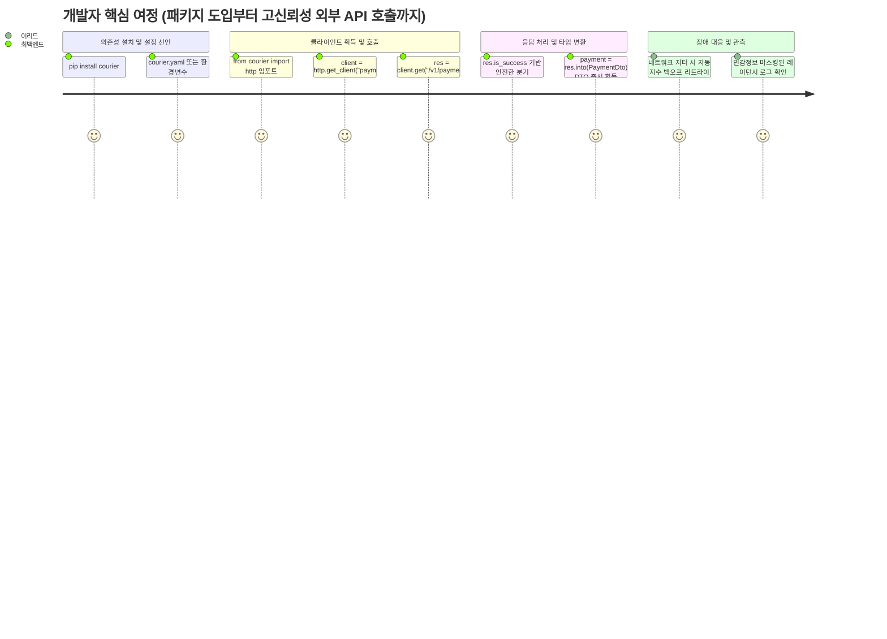

# [courier] 제품 요구사항 정의서 (Product Requirements Document - PRD)

- **작성일자**: 2026-09-22
- **작성자**: 기획 명세 작성가 (`spec-writer`)
- **문서 버전**: v1.0
- **상태**: Approved

---

## 1. 프로덕트 비전 및 문제 정의 (Problem Statement & Vision)

- **배경 (Background)**:
  - 현대 마이크로서비스(MSA) 및 데이터 파이프라인 아키텍처 환경에서 파이썬 백엔드 서비스는 결제 게이트웨이(PG), 알림 발송 서비스, 사내 마이크로서비스, 서드파티 SaaS 등 수많은 외부 HTTP API와 통신합니다.
  - 파이썬 생태계에서는 `requests`나 `httpx` 같은 우수한 원시(Raw) HTTP 클라이언트가 널리 사용되고 있으나, 애플리케이션 개발 시 매번 커넥션 풀 생성, 타임아웃 세분화, 지수 백오프(Exponential Backoff with Jitter) 재시도, 인증 토큰 주입, 예외 처리, 레이턴시 측정 코드를 개발자마다 수작업으로 중복 작성하고 있습니다.
  - 또한 외부 API마다 성공/실패 응답 규격이 제각각이어서 애플리케이션 계층에서 매번 `try...except`와 수십 줄의 JSON 파싱 코드가 양산되며, 비동기 루프에서 클라이언트를 부적절하게 생성하여 운영 환경에서 소켓 고갈(`Too many open files`) 장애가 빈발하고 있습니다.

- **문제 정의 (Problem Statement)**:
  1. **비표준화된 응답 포맷과 취약한 에러 핸들링**:
     - 호출 라이브러리 및 대상 API에 따라 응답 형태가 달라, `res.json()` 호출 시 `JSONDecodeError`, 필드 접근 시 `KeyError`가 런타임에 빈발함.
     - HTTP 상태 코드 확인 후 수동으로 예외를 던지거나 잡는 보일러플레이트 코드가 비즈니스 로직을 오염시킴.
  2. **외부 서비스별 설정 관리의 파편화 및 커넥션 누수**:
     - 서비스(예: `payment`, `notification`, `auth`)별로 서로 다른 Base URL, 타임아웃, 인증 헤더를 관리할 때 중앙 집중형 설정 표준이 없어 하드코딩되거나 설정 불일치 발생.
     - 클라이언트 수명 주기 관리 미흡으로 커넥션 풀이 재사용되지 않고 매 요청마다 소켓을 열어 리소스가 고갈됨.
  3. **일시적 장애에 대한 회복성(Resilience) 결여**:
     - 외부 서비스의 일시적 502/503/504 에러나 네트워크 지터 발생 시, 안전한 재시도 알고리즘(지수 백오프 및 무작위 지터) 없이 즉각 실패하거나 동시 재시도로 인한 Thundering Herd 문제를 유발함.

- **프로덕트 비전 (Vision)**:
  - **"Zero-Boilerplate, Production-Ready HTTP Client Auto-Configuration for Python"**
  - 환경변수(`ENV`), YAML, JSON 설정 파일 선언만으로 최적의 HTTPX 커넥션 풀 엔진을 자동 구성하고, 어떤 외부 API를 호출하더라도 언제나 일관된 `ApiResponse[T]` 결과와 Pydantic DTO 자동 변환, 스마트 지수 백오프 리트라이를 즉시 제공하는 고신뢰성 파이썬 패키지.

---

## 2. 타깃 페르소나 및 유저 저니 맵 (Personas & User Journey)

### 2.1 대표 페르소나

- **페르소나 1: 최백엔드 (31세, 백엔드/플랫폼 개발자)**
  - **주요 목표**: 외부 API 연동 시 반복되는 세션 생성, 타임아웃/리트라이, DTO 매핑 코드를 단 한 줄로 해결하고 핵심 비즈니스 로직 개발에 집중.
  - **핵심 페인포인트**: 서비스 연동마다 40~50줄의 `httpx.Client` 생성 및 에러 분기 코드를 복사-붙여넣기 해야 하며, 응답 모델 파싱 에러로 인한 런타임 버그 발생.

- **페르소나 2: 이리드 (36세, 테크 리드 / MSA 아키텍트)**
  - **주요 목표**: 사내 마이크로서비스 간 통신 규격을 표준화하고, 커넥션 풀 누수 원천 차단 및 민감 정보(인증 토큰 등) 로깅 노출을 방지.
  - **핵심 페인포인트**: 개발자마다 제각각 구현한 재시도 로직으로 인한 장애 전파, 부적절한 클라이언트 라이프사이클로 인한 프로덕션 소켓 고갈 사고.

### 2.2 핵심 유저 저니 (User Journey Map)

---

## 3. 기능 요구사항 및 MoSCoW 우선순위 매트릭스 (Feature Requirements)

| 요구사항 ID | 도메인 | 요구사항 명칭 및 상세 설명 | 우선순위 (MoSCoW) | 대응 비즈니스 가치 |
| :--- | :--- | :--- | :---: | :--- |
| `REQ-RESP-001` | 응답 추상화 | **표준화된 단일 응답 모델 (`ApiResponse[T]`)** 성공/실패 여부, 상태코드, 파싱된 데이터, 에러 정보, 소요시간(`duration_ms`)을 일관되게 제공하는 Result 패턴 인터페이스 | **Must Have** | 응답 파싱 보일러플레이트 제거 및 런타임 안정성 보장 |
| `REQ-CONF-001` | 설정 관리 | **계층형 다중 서비스 설정 로더 (Multi-Service Cascading Loader)** `ENV > YAML > JSON > Defaults` 우선순위 자동 병합 및 서비스별(`payment`, `notification` 등) 독립 설정 바인딩 | **Must Have** | 환경별 무중단 설정 주입 및 중앙 집중식 엔드포인트 관리 |
| `REQ-ENG-001` | 코어 클라이언트 | **HTTPX 기반 동기/비동기 고성능 커넥션 풀 엔진** 단일 라이브러리에서 동기(`get`) 및 비동기(`async_get`)를 완벽 지원하고, 커넥션 풀 재사용 및 소켓 누수 방지 | **Must Have** | 고동시성 I/O 처리 극대화 및 프로덕션 안정성 확보 |
| `REQ-RETY-001` | 회복성(Resilience) | **지수 백오프 기반 스마트 자동 재시도 (Exponential Backoff with Jitter)** 일시적 장애 상태코드(429, 502, 503, 504) 및 타임아웃 발생 시 무작위 지터를 포함한 지수 백오프 자동 재시도 | **Must Have** | 일시적 네트워크 장애 자동 극복 및 서비스 연속성 유지 |
| `REQ-DTO-001` | 데이터 바인딩 | **Pydantic DTO 자동 역직렬화 (`into(Type[T])`)** 응답 JSON 데이터를 검증된 Pydantic 모델로 한 줄로 변환하며, 검증 실패 시 구조화된 에러 반환 | **Must Have** | 타입 세이프한 도메인 모델 매핑 및 DX 극대화 |
| `REQ-AUTH-001` | 보안/인증 | **서비스별 인증 헤더 자동 주입 인터셉터** Bearer Token, API Key 헤더를 설정 기반으로 모든 요청에 안전하게 자동 주입 | **Should Have** | 반복적인 인증 헤더 작성 제거 및 보안 표준 준수 |
| `REQ-LOG-001` | 관측성/로깅 | **구조화된 요청/응답 로깅 및 민감 정보 마스킹** 소요 시간, 상태코드, 엔드포인트를 로깅하되 토큰 및 패스워드 등 민감 정보 자동 마스킹 | **Should Have** | 운영 트러블슈팅 용이성 확보 및 보안 규정 준수 |
| `REQ-CB-001` | 서킷 브레이커 | **서킷 브레이커 (Circuit Breaker) 상태 머신** 연속 실패 임계치 초과 시 외부 호출을 즉시 차단(Open)하고 복구 상태(Half-Open) 자동 점검 | **Won't Have (v1)** (v2 로드맵 이관) | 외부 의존성 전면 장애 시 연쇄 다운 방지 |

---

## 4. 핵심 성공 지표 (KPI / Success Metrics)

| 지표명 | 측정 방식 / 기준 | 목표치 (Target) |
| :--- | :--- | :--- |
| **보일러플레이트 코드 감소율** | 신규 외부 API 연동 시 클라이언트 생성 및 응답 처리 라인 수 비교 (기존 45줄 $\rightarrow$ 목표 3줄) | $\ge 85\%$ 감소 |
| **HTTP 응답 처리 무결성** | 런타임 응답 파싱 미처리 예외(`JSONDecodeError`, unhandled `KeyError`) 발생률 | **0% (Zero Unhandled Exception)** |
| **커넥션 풀 누수율** | 1,000 동시 비동기/동기 요청 부하 테스트 시 누수 소켓(`CLOSE_WAIT`, `ESTABLISHED` 고갈) 발생률 | **0% (Zero Socket Leak)** |
| **일시적 장애 자동 회복률** | 502/503/504 및 네트워크 지터 모의 주입 환경에서 재시도를 통한 최종 성공률 | $\ge 95\%$ |
| **설정 로드 및 클라이언트 획득 지연** | 설정 탐색, 병합, Pydantic 검증 및 클라이언트 인스턴스 반환 시간 | $\le 15\text{ms}$ |
| **테스트 코드 커버리지** | `pytest` 기준 단위 및 통합 테스트 라인 커버리지 | $\ge 90\%$ |

---

## 5. 비기능적 요구사항 (Non-Functional Requirements)

- **성능 (Performance)**:
  - 라이브러리 자체 래핑 오버헤드는 요청당 1ms 미만이어야 함.
  - 커넥션 풀링을 통해 동일 호스트 재요청 시 TCP 핸드셰이크 비용을 0으로 수렴시킴.
- **안정성 (Reliability)**:
  - 비정상 프로세스 종료 또는 핫 리로드 시 Python `atexit` 훅을 통해 열려 있는 동기/비동기 커넥션 풀을 안전하게 닫아 OS 파일 디스크립터 누수를 방지.
  - Thundering Herd 방지를 위해 지수 백오프 공식에 균등 분포(Full Jitter) 알고리즘을 필수로 적용.
- **보안 (Security)**:
  - 로그 출력 시 `Authorization`, `X-API-Key`, `Cookie` 등 민감 헤더 값의 뒤 60% 이상을 `***`로 자동 마스킹.
  - URL 쿼리 파라미터 및 본문 내 민감 키(`password`, `secret`, `token`)에 대한 마스킹 필터링 지원.
- **호환성 (Compatibility)**:
  - Python 3.10 이상 완전 지원 (Python 3.10, 3.11, 3.12, 3.13).
  - HTTPX 0.25+ 및 Pydantic v2 완벽 호환. macOS, Linux, Windows 크로스 플랫폼 지원.
- **타입 안전성 (Type Safety)**:
  - 모든 퍼블릭 API(`ApiResponse[T]`, `into(Type[T]) -> T`, `get_client()`)에 정밀한 Generic Type Hinting을 적용하여 MyPy, Pyright 등 정적 분석 도구에서 100% 타입 추론 지원.
