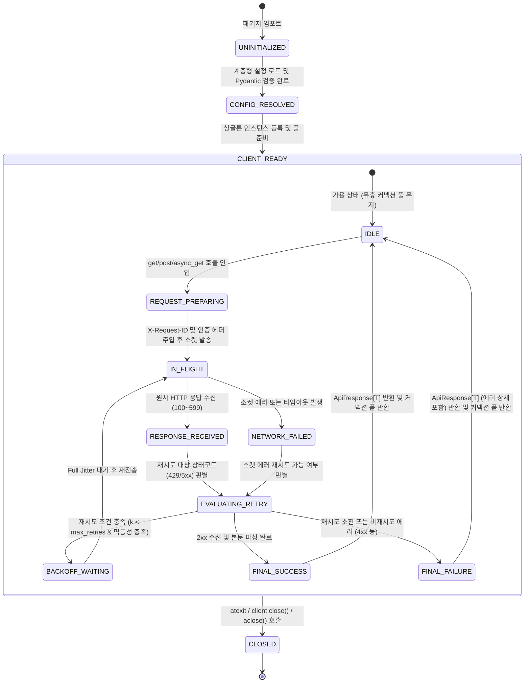

# [courier] 비즈니스 정책 및 전역 예외 처리 명세서 (Policy & Edge Cases)

- **작성일자**: 2026-09-23
- **작성자**: 기획 명세 작성가 (`spec-writer`)
- **문서 버전**: v1.1 (Humanizer 지침 반영 개정판)
- **상태**: Approved

---

## 1. HTTP 클라이언트 및 요청 생명주기 상태 머신 (Lifecycle State Machine)

Courier 패키지가 관리하는 클라이언트 셋업, HTTP 요청 처리 흐름, 그리고 재시도 엔진의 상태 전이도입니다.

### 1.1 상태 전이 매트릭스 및 규칙

| 현재 상태 | 대상 상태 | 전이 트리거 이벤트 | 필수 사전 조건 | 동작 및 사후 조건 |
| :--- | :--- | :--- | :--- | :--- |
| `UNINITIALIZED` | `CONFIG_RESOLVED` | `http.get_client(service)` 최초 호출 | 설정 파일(YAML/JSON), ENV, 또는 기본값 존재 | 계층 우선순위(`kwargs > ENV > YAML > JSON > Defaults`) 병합 및 `HttpClientConfig` Pydantic 검증 |
| `CONFIG_RESOLVED` | `CLIENT_READY` | 클라이언트 팩토리 초기화 | 유효한 `HttpClientConfig` 보유 | `httpx.Limits` 및 타임아웃을 적용한 내부 엔진 인스턴스화, 싱글톤 레지스트리 등록 |
| `IDLE` | `REQUEST_PREPARING` | API 호출 메서드 실행 (`get`, `async_get` 등) | 클라이언트가 활성 상태(`not is_closed`) | 인터셉터 체인 실행, Correlation-ID (`X-Request-ID`) 생성, 시작 시각 $t_{start}$ 기록 |
| `REQUEST_PREPARING` | `IN_FLIGHT` | 소켓 요청 발송 | 파라미터 및 헤더 정합성 검증 완료 | 가용 커넥션 체크아웃 후 네트워크 I/O 실행 |
| `IN_FLIGHT` | `RESPONSE_RECEIVED`| 대상 서버로부터 바이트 스트림 수신 완료 | HTTP 헤더 및 상태코드 수신 완료 | 소요 시간 $\Delta t$ 측정 및 본문 파싱 준비 |
| `IN_FLIGHT` | `NETWORK_FAILED` | DNS 오류, 소켓 연결 실패, 타임아웃 발생 | 네트워크 I/O 중단 | `httpx.TransportError` 포착 및 에러 컨텍스트 기록 |
| `RESPONSE_RECEIVED` / `NETWORK_FAILED` | `EVALUATING_RETRY` | 결과 평가 단계 진입 | 응답 객체 또는 에러 객체 확보 | 상태코드 $\in \{429, 502, 503, 504\}$ 또는 타임아웃 여부 및 멱등성 검사 |
| `EVALUATING_RETRY` | `BACKOFF_WAITING` | 재시도 결정 | $k < K_{max}$ 이고 멱등 메서드이거나 `retry_on_post=True` | Full Jitter 백오프 대기 시간 $T_{wait}$ 계산 |
| `BACKOFF_WAITING` | `IN_FLIGHT` | 대기 완료 ($T_{wait}$ 경과) | 동기 `sleep` 또는 비동기 `asyncio.sleep` 완료 | 재시도 카운트 $k \leftarrow k + 1$ 증가 후 재요청 발송 |
| `EVALUATING_RETRY` | `FINAL_SUCCESS` | 성공 응답 확인 | 상태코드 $200 \le S < 300$ | `is_success=True`, `data`에 JSON 파싱 결과 바인딩 |
| `EVALUATING_RETRY` | `FINAL_FAILURE` | 재시도 소진 또는 비재시도 에러 | $k \ge K_{max}$ 또는 비재시도 상태코드(400, 401, 403, 404 등) | `is_success=False`, `error`에 `ApiErrorDetail` 바인딩 |
| `FINAL_SUCCESS`/`FINAL_FAILURE` | `IDLE` | `ApiResponse[T]` 반환 | 소켓 스트림 닫힘 및 풀 반환 | 커넥션 유지(Keep-Alive) 또는 소켓 정상 종료 |
| `CLIENT_READY` | `CLOSED` | 프로세스 종료 또는 명시적 `close()` | `atexit` 시그널 또는 사용자 종료 요청 | 모든 활성 커넥션 풀 강제 종료 및 OS 소켓 해제 |

---

## 2. 공통 비즈니스 제약 및 유효성 검증 정책 (Global Business Policies)

### 2.1 계층형 설정 우선순위 정책 (Configuration Precedence)
- **우선순위 순서**:
  1. **명시적 인자 (`kwargs`)**: `http.get_client("svc", timeout=5.0)`와 같이 코드에서 직접 주입한 값.
  2. **환경변수 (`ENV`)**: `COURIER_{SERVICE}_{KEY}` (대소문자 무시, 언더바 구분).
  3. **YAML 설정 파일 (`.yaml` / `.yml`)**: `courier.yaml`, `config.yaml`의 `{service_name}` 블록.
  4. **JSON 설정 파일 (`.json`)**: `courier.json`, `config.json`의 `{service_name}` 블록.
  5. **기본값 (Hardcoded Defaults)**: 사내 프로덕션 권장 안전 기본값.
- **병합 규칙**: 상위 계층에 존재하는 키만 하위 계층을 덮어쓰며, 하위 계층의 누락된 키는 기본값으로 채워집니다 (Shallow/Deep 병합).

### 2.2 전역 타임아웃 세분화 정책 (Timeout Granularity)
단일 `timeout=10` 설정을 사용하면 DNS 지연이나 핸드셰이크 단계에서 요청 전체가 대기 상태로 빠질 수 있으므로, 4단계 세분화 타임아웃을 적용합니다:
- **`connect_timeout` (기본값: 3.0초)**: TCP 3-Way Handshake 및 TLS 협상 한계 시간. 방화벽 블랙홀에 빠졌을 때 빠른 실패를 보장합니다.
- **`read_timeout` (기본값: 10.0초)**: 서버가 연결된 후 첫 바이트 또는 청크를 응답하기까지의 대기 시간.
- **`write_timeout` (기본값: 10.0초)**: 대용량 요청 본문을 전송 버퍼에 쓰기까지의 대기 시간.
- **`pool_timeout` (기본값: 5.0초)**: 커넥션 풀의 최대 허용 소켓(`max_connections`)이 가득 찼을 때 새 요청이 대기하는 시간. 초과 시 `ERR_ENG_POOL_EXHAUSTED`가 발생합니다.

### 2.3 스마트 재시도 및 지수 백오프 공식 (Full Jitter Math)
- **계산식**:
  $$T_{exp} = \min(T_{max}, \text{backoff\_factor} \times 2^{attempt})$$
  $$T_{wait} \sim \text{Uniform}(0, T_{exp})$$
  - $\text{backoff\_factor}$: 기본값 `0.5`초
  - $T_{max}$: 최대 대기 시간 상한선, 기본값 `30.0`초
  - $attempt$: 현재 재시도 차수 ($0, 1, 2, \dots$)
- **`Retry-After` 헤더 연동 규칙**:
  - 외부 서버가 `429 Too Many Requests` 또는 `503 Service Unavailable`과 함께 `Retry-After: <초>`를 반환한 경우, $T_{wait} = \max(T_{wait}, \text{Retry-After})$를 적용합니다.
  - 단, 상대가 요구한 대기 시간이 `max_backoff_seconds`(30초)를 초과하면 워커 스레드가 장시간 블로킹되는 것을 방지하기 위해 재시도를 포기하고 즉시 실패 처리합니다.
- **멱등성(Idempotency) 보호 원칙**:
  - `GET`, `HEAD`, `PUT`, `DELETE`, `OPTIONS`는 멱등 요청이므로 자동 재시도를 수행합니다.
  - `POST`, `PATCH`는 비멱등 요청이므로 이중 결제나 리소스 중복 생성을 막기 위해 `retry_on_post=True` 설정이 명시되지 않는 한 절대 재시도하지 않습니다.

### 2.4 커넥션 풀링 및 소켓 수명 관리 정책 (Connection Pool Management)
- **`max_connections` (기본값: 20)**: 호스트당 유지 가능한 최대 동시 소켓 수.
- **`max_keepalive_connections` (기본값: 10)**: 재사용을 위해 유휴 상태로 유지하는 소켓 수.
- **`keepalive_expiry` (기본값: 30.0초)**: AWS ALB(기본 350초)나 사내 방화벽 유휴 타임아웃보다 충분히 짧게 설정하여, 끊어진 유휴 소켓을 재사용하려다 발생하는 `ConnectionResetError`를 방지합니다.
- **프로세스 종료 훅 (`atexit`)**: Python 인터프리터 종료 시 등록된 모든 활성 클라이언트를 순회하며 커넥션 풀을 닫아 OS 파일 디스크립터 누수를 방지합니다.

### 2.5 보안 및 민감 정보 마스킹 정책 (Security Redaction)
- **헤더 마스킹**: 로깅 시 `Authorization`, `Proxy-Authorization`, `X-API-Key`, `Cookie` 헤더 값은 앞 4글자만 노출하고 나머지는 `***`로 치환합니다 (예: `Bearer eyJh***`).
- **본문 및 쿼리 파라미터**: 필드명에 `password`, `secret`, `token`, `key`, `credential`이 포함된 경우 값 전체를 `[REDACTED]`로 치환하여 기록합니다.

---

## 3. 전역 엣지 케이스 및 장애 복구 가이드 (Edge Cases & Recovery Playbook)

| 장애 / 예외 유형 | 감지 방식 | 시스템 처리 방식 및 엔지니어링 가이드 |
| :--- | :--- | :--- |
| **DNS 조회 실패 (Host Unreachable)** | `httpx.ConnectError` 감지 | 일시적 사내 DNS 플릭 가능성이 있으므로 최대 3회 재시도하며, 최종 실패 시 `status_code=0`, `error.code="ERR_ENG_CONNECT_FAILED"`로 래핑하여 반환 |
| **SSL/TLS Handshake 실패** | `httpx.ConnectError` 중 `ssl.SSLError` 감지 | 인증서 만료나 호스트명 불일치 등 보안 오류는 재시도해도 성공 불가능하므로 **즉시 재시도를 중단**하고 보안 에러 코드를 반환 |
| **AWS NAT Gateway 유휴 단절 (Idle Reset)** | `read_timeout`(10.0초) 초과 | AWS NAT Gateway 유휴 타임아웃(350초) 등으로 인해 소켓이 조용히 끊긴 경우, 커넥션을 풀에서 영구 폐기하고 멱등 요청인 경우 새 소켓으로 1회 즉시 재시도 |
| **HTTP 429 Too Many Requests (Rate Limit 폭풍)** | 응답 상태코드 429 감지 | `Retry-After` 헤더 값을 확인하여 지정된 시간(최대 30초 한도)만큼 대기. Thundering Herd 방지를 위해 균등 지터(Full Jitter)를 필수로 적용 |
| **대용량 에러 본문 메모리 폭주 (OOM 방어)** | 응답 본문 크기 1MB 초과 | 비정상적인 대용량 덤프 수신 시 `raw_text`는 앞 1MB(1,048,576 바이트)까지만 버퍼링하고 `[TRUNCATED: Response body exceeded 1MB]` 접미사를 붙여 메모리를 보호 |
| **Celery / Fork 환경 이벤트 루프 변경** | `RuntimeError: Event loop is closed` 감지 | 이전 루프에 귀속된 `httpx.AsyncClient`를 안전하게 닫고, 현재 실행 중인 활성 루프(`asyncio.get_running_loop()`)에 맞추어 비동기 클라이언트를 투명하게 재생성 |
| **Thundering Herd 트래픽 폭풍 방지** | 다수 워커의 동시 장애 재시도 인입 | 모든 재시도 대기 시간에 Full Jitter(`random.uniform(0, T_exp)`)를 의무화하여 재시도 트래픽이 시간축 전체에 고르게 분산되도록 보장 |
