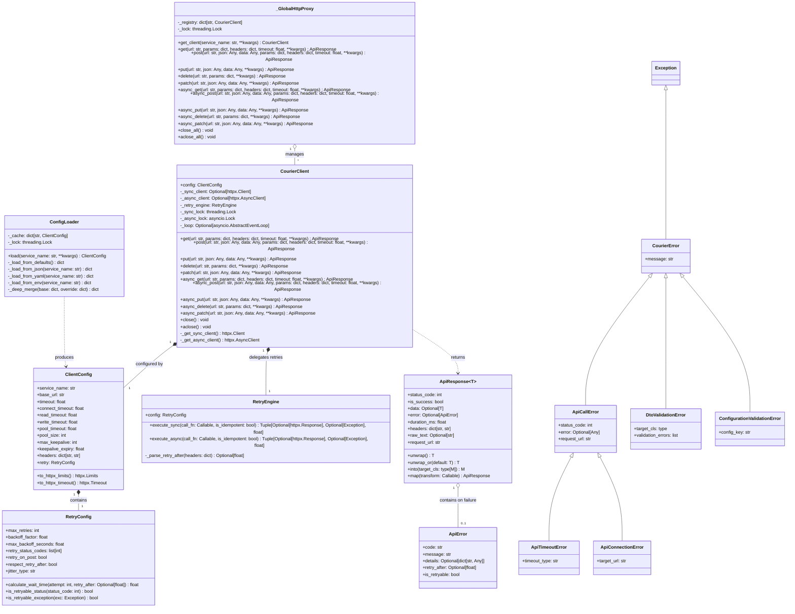
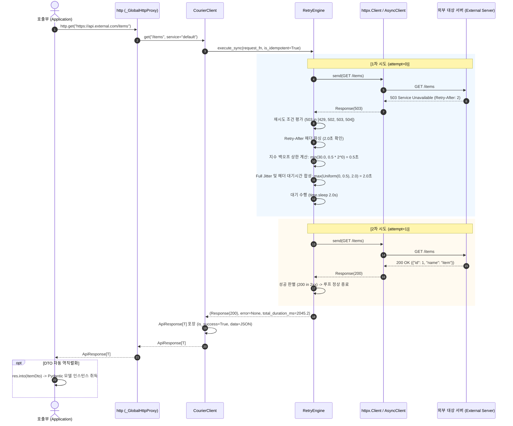

# [courier] 백엔드 시스템 및 공개 SDK 인터페이스 설계서 (System Design & Public SDK Specification)

- **작성일자**: 2026-09-22 (개정일자: 2026-09-23)
- **작성자**: 백엔드 시스템 디자이너 (`system-designer`)
- **문서 버전**: v1.1
- **상태**: Approved

---

## 1. 설계 배경 및 아키텍처 의사결정 (Context & Architecture Decisions)

### 1.1 배경 및 문제의식 (Problem Statement)

현대 마이크로서비스 환경에서 외부 API 연동 코드는 흔히 다음과 같은 만성적인 운영 문제를 겪습니다:

1. **소켓 및 파일 디스크립터 누수**: 매 요청마다 무분별하게 HTTP 세션을 생성하거나, 비동기 이벤트 루프 종료 후에도 풀이 닫히지 않아 프로덕션 서버에서 `Too many open files` OS 장애가 발생합니다.
2. **비표준화된 에러 핸들링과 예외 남발**: `requests.Response.raise_for_status()`에 의존하여 비즈니스 로직 곳곳에 `try...except HTTPError` 블록이 산재하며, 200 OK 응답 본문에 에러 JSON이 담겨 오는 경우나 502 HTML 응답 파싱 시 `JSONDecodeError`로 런타임 크래시가 발생합니다.
3. **위험한 재시도 알고리즘**: 단순 고정 간격 재시도로 인해 장애 서버가 복구되는 순간 대량의 트래픽이 일시에 몰리는 Thundering Herd 현상이 발생하거나, `POST` 결제/생성 요청을 무조건 재시도하여 중복 결제 및 데이터 정합성 훼손 사고가 일어납니다.

`courier`는 이 세 가지 문제를 해결하기 위해 **HTTPX 커넥션 풀 라이프사이클 관리**, **Rust 스타일의 Result 패턴 단일 응답 모델 (`ApiResponse[T]`)**, 그리고 **Full Jitter 기반 스마트 지수 백오프**를 제공하는 독립형 파이썬 클라이언트 패키지입니다.

### 1.2 핵심 아키텍처 결정 사항 (Architecture Decisions & Trade-offs)

| 결정 항목 | 채택한 방식 | 고려했던 대안 | 선택 이유 및 엔지니어링 트레이드오프 |
| :--- | :--- | :--- | :--- |
| **코어 전송 엔진** | **HTTPX (`httpx.Client`, `httpx.AsyncClient`)** | `requests`, `aiohttp` | • `requests`는 비동기(`asyncio`)를 지원하지 않고, `aiohttp`는 동기 인터페이스가 없어 이중 의존성이 발생함.<br/>• HTTPX는 단일 라이브러리로 동기/비동기 API 규격이 일치하며, HTTP/2 지원과 세분화된 `Limits`, `Timeout` 객체를 제공함.<br/>• *트레이드오프*: 순수 `requests` 대비 약간의 의존성 크기 증가(anyio, httpcore 등). |
| **응답 제어 패턴** | **Result 패턴 (`ApiResponse[T]`)** | `raise_for_status()` 예외 전파 방식 | • HTTP 상태코드 4xx/5xx나 일시적 통신 실패를 즉시 예외로 던지지 않고, `ApiResponse` 객체에 상태코드, 에러 정보, 소요시간을 캡슐화함.<br/>• 호출부에서 `if res.is_success:`로 명시적 분기 처리를 유도하여 예외 스택 추적 비용을 줄이고 제어 흐름을 명확히 함.<br/>• 실패 시 강제 종료가 필요한 고속 스크립트나 배치 작업을 위해 `res.unwrap()` 헬퍼를 함께 제공함. |
| **재시도 지터 전략** | **Full Jitter 지수 백오프** | Decorrelated Jitter, Equal Jitter, 고정 백오프 | • 외부 API 장애 후 복구 시 다수의 분산 워커가 동시에 재시도하지 않도록 $[0, T_{exp}]$ 구간의 균등 난수(Uniform Distribution)를 적용함.<br/>• *트레이드오프*: 단일 요청 관점에서는 대기 시간이 다소 불규칙할 수 있으나, 시스템 전체의 처리량 분산 효과가 가장 입증됨. |
| **비멱등 요청 재시도** | **POST/PATCH 기본 차단 (`retry_on_post=False`)** | 무조건 재시도, 상태코드 기반 재시도 | • `POST` 요청 후 서버가 리소스를 생성했으나 응답 전송 중 타임아웃이 발생한 경우, 재시도 시 중복 결제/생성 사고 발생 위험이 큼.<br/>• 명시적으로 `retry_on_post=True` 설정을 켠 경우에만 재시도를 허용하여 데이터 안전을 기본 보장함. |

---

## 2. 패키지 모듈 구조 (Package Layout & Responsibilities)

### 2.1 디렉터리 레이아웃

```
courier/
├── __init__.py           # 공개 API 엔트리포인트 (http, HttpClient, CourierClient, ApiResponse, ApiError, ClientConfig 등)
├── client.py            # CourierClient/HttpClient 코어 엔진, _GlobalHttpProxy 전역 프록시, atexit 풀 회수
├── config.py            # ClientConfig, RetryConfig, ConfigLoader (kwargs > ENV > YAML > JSON > Defaults 우선순위 병합)
├── decorators.py        # 선언적 API 데코레이터 (@courier, @api_client, @get, @post, @put, @delete, @patch)
├── exceptions.py        # 표준 도메인 예외 계층 (CourierError 기저, ApiCallError, ApiTimeoutError, DtoValidationError 등)
├── response.py          # ApiResponse[T], ApiError 모델, Result 패턴 헬퍼 (unwrap, unwrap_or, into, map)
└── retry.py             # RetryEngine, 지수 백오프 공식, Full Jitter, Retry-After 파싱, 상태코드 및 예외 판별
```

### 2.2 모듈별 세부 역할 명세

| 모듈 | 노출 심볼 | 핵심 역할 및 구현 세부사항 |
| :--- | :--- | :--- |
| `client.py` | `CourierClient`, `HttpClient`, `_GlobalHttpProxy`, `http`, `get_client` | • 동기(`httpx.Client`)와 비동기(`httpx.AsyncClient`) 세션을 지연(Lazy) 생성하여 불필요한 리소스 점유 방지.<br/>• 비동기 호출 시 이벤트 루프 교체(`RuntimeError: Event loop is closed`)를 감지하여 세션 투명 재바인딩.<br/>• 전역 싱글톤 캐시 관리 및 멀티스레드 안전한 더블 체크드 락킹(Double-Checked Locking) 적용. |
| `config.py` | `ClientConfig`, `RetryConfig`, `ConfigLoader` | • 5단계 설정 우선순위(`kwargs > ENV > YAML > JSON > Defaults`) 자동 탐색 및 Deep Merge 수행.<br/>• 서비스 식별자(`service_name`)별 멀티 클라이언트 프로필 격리 지원.<br/>• Pydantic v2 기반 유효성 검증 및 `httpx.Limits`, `httpx.Timeout` 객체 변환. |
| `response.py` | `ApiResponse[T]`, `ApiError` | • `status_code`, `is_success`, `data`, `error`, `duration_ms`, `headers`, `raw_text`, `request_url`을 담는 단일 응답 객체.<br/>• `into(PydanticModel)` 호출 시 `model_validate`를 통한 자동 DTO 변환.<br/>• 비정형/대용량 본문 방어를 위한 1MB 메모리 버퍼 안전 절삭(Truncation). |
| `retry.py` | `RetryEngine` | • $T_{exp} = \min(T_{max}, \text{backoff\_factor} \times 2^{k})$ 및 $T_{wait} \sim \text{Uniform}(0, T_{exp})$ 계산.<br/>• HTTP `Retry-After` 헤더(초 단위 정수 및 RFC 7231 HTTP-Date) 파싱 및 상한선 클램핑.<br/>• 멱등성 검증 및 429/502/503/504 상태코드 필터링. |
| `decorators.py` | `@courier`, `@api_client`, `@get`, `@post`, `@put`, `@delete`, `@patch` | • 클래스 기반 선언적 클라이언트 인터페이스 바인딩.<br/>• 함수 시그니처 분석을 통한 경로 파라미터(`{id}`) 치환 및 Body/Query 자동 주입.<br/>• 동기/비동기 함수 자동 분기 처리. |
| `exceptions.py` | `CourierError`, `ApiCallError`, `ApiTimeoutError`, `ApiConnectionError`, `DtoValidationError`, `ConfigurationValidationError` | • 외부 HTTP 통신 실패 및 역직렬화 실패를 포괄하는 표준 도메인 예외 계층.<br/>• `ApiClientError`, `HttpAutoconfigError` 하위 호환성 별칭 유지. |

---

## 3. 핵심 클래스 구조 설계 (Class Diagram & Domain Architecture)

> [!NOTE]
> 본 라이브러리는 관계형 데이터베이스(RDBMS)를 직접 제어하는 서버 애플리케이션이 아니므로, 엔티티 관계도(ERD) 대신 객체 모델과 클라이언트 엔진 간의 인터페이스 및 협력 구조를 정의하는 Mermaid 클래스 다이어그램(`classDiagram`)을 제공합니다.

### 3.1 Mermaid 클래스 다이어그램



---

## 4. 커넥션 풀 라이프사이클 및 동시성 제어 정책 (Connection Pooling & Concurrency)

### 4.1 커넥션 풀링 매트릭스 및 파라미터 설계 근거

| 파라미터 명칭 | 기본값 | 설정 근거 및 엔지니어링 동작 상세 |
| :--- | :---: | :--- |
| `pool_size` (`max_connections`) | `20` | 대상 호스트당 동시에 유지할 수 있는 최대 커넥션 수. 마이크로서비스 간 통신에서 과도한 소켓 점유로 인한 호스트 OS의 파일 디스크립터 고갈을 차단합니다. |
| `max_keepalive_connections` | `10` | 사용 후 반환된 소켓 중 풀에서 재사용 대기 상태로 유지하는 커넥션 수. 불필요한 TCP 3-Way Handshake 및 TLS 핸드셰이크를 건너뛰어 지연 시간을 줄입니다. |
| `keepalive_expiry` | `30.0초` | 유휴 커넥션의 생존 만료 시간. 방화벽, L4 로드밸런서, AWS NAT Gateway가 유휴 커넥션을 예고 없이 닫아 발생하는 `RemoteDisconnected` 및 `BrokenPipeError`를 사전에 차단합니다. |
| `pool_timeout` | `5.0초` | 가용 커넥션이 모두 소진되었을 때 새 연결 대기 한도 시간. 5초 초과 시 블로킹을 해제하고 `ERR_ENG_POOL_EXHAUSTED` 에러를 반환하여 스레드 기아 현상을 방지합니다. |

### 4.2 스레드 안전성 및 비동기 이벤트 루프 격리

1. **전역 레지스트리의 Double-Checked Locking**:
   - `_GlobalHttpProxy`는 `service_name`별 클라이언트 인스턴스를 관리할 때 Python 표준 `threading.Lock`을 사용합니다.
   - 이미 등록된 클라이언트는 락 없이 즉시 읽고(Lock-free Read), 등록되지 않은 서비스 최초 호출 시에만 락을 걸고 2차 검증(Double-Check) 후 인스턴스화하여 멀티스레드 경합 시 중복 생성을 방지합니다.
2. **비동기 이벤트 루프 교체 감지 및 재바인딩**:
   - `httpx.AsyncClient`는 특정 이벤트 루프에 강하게 결합됩니다. 비동기 워커(FastAPI 백그라운드 태스크, Celery, `asyncio.run()`) 환경에서는 이벤트 루프가 닫히거나 재생성되는 경우가 빈번합니다.
   - `CourierClient._get_async_client()`는 호출 시점마다 `asyncio.get_running_loop()`를 확인하여, 바인딩된 루프와 불일치하거나 이전 루프가 닫힌 경우(`loop.is_closed()`):
     1. 이전 비동기 클라이언트 참조를 안전하게 분리합니다.
     2. 현재 실행 중인 활성 루프 컨텍스트에서 새 `httpx.AsyncClient`를 투명하게 재생성하여 바인딩합니다.
     3. `RuntimeError: Event loop is closed` 또는 `Task attached to a different loop` 에러를 방지합니다.
3. **`atexit` 훅을 통한 프로세스 종료 시 리소스 해제**:
   - `courier`가 로드될 때 `atexit.register(http.close_all)`를 등록하여, 프로세스 종료 시 열려 있는 모든 동기 커넥션 풀을 안전하게 닫습니다.

---

## 5. 지수 백오프 및 재시도 실행 흐름 (Retry Engine & Sequence)

외부 API 요청 발송 후 일시적 장애(503, 429, Timeout) 발생 시, 지수 백오프 및 Full Jitter를 거쳐 최종 `ApiResponse[T]`를 반환하는 시퀀스입니다.



### 5.1 재시도 대기 시간 계산 공식

$$T_{exp} = \min(T_{max}, \text{backoff\_factor} \times 2^{attempt})$$
$$T_{wait} = \text{Uniform}(0, T_{exp})$$

- `backoff_factor`: 기본값 `0.5`초
- $T_{max}$: 기본값 `30.0`초
- 서버 응답 헤더에 `Retry-After: <seconds>`가 명시된 경우: $T_{wait} = \max(T_{wait}, \text{int}(Retry-After))$
- 만약 파싱된 `Retry-After` 값이 $T_{max}$를 초과하는 경우, 스레드 장기 점유를 막기 위해 추가 재시도를 포기하고 즉시 실패 응답을 반환합니다.

---

## 6. 공개 SDK 인터페이스 상세 명세 (Public SDK Specification)

> [!IMPORTANT]
> **OpenAPI 문서 대체 근거**:
> `courier`는 RESTful HTTP 엔드포인트를 직접 서비스하는 서버 프레임워크가 아닌, 외부 엔드포인트를 호출하는 **클라이언트 SDK 라이브러리**입니다. 따라서 웹 라우트를 정의하는 OpenAPI YAML 대신, 개발자가 임포트하여 사용하는 Python 공개 인터페이스와 함수 시그니처, 반환 모델 규격을 상세 명세로 갈음합니다.

### 6.1 최상위 전역 프록시 (`http`) 인터페이스

```python
from typing import Any, Mapping, Optional, Sequence, Union
from pydantic import BaseModel
import httpx
from courier.response import ApiResponse
from courier.client import CourierClient

# 동기 요청 인터페이스
def get(
    url: str,
    *,
    params: Optional[Mapping[str, Any]] = None,
    headers: Optional[Mapping[str, str]] = None,
    timeout: Optional[Union[float, httpx.Timeout]] = None,
    service: str = "default",
    **kwargs: Any,
) -> ApiResponse[Any]: ...

def post(
    url: str,
    *,
    json: Optional[Union[Mapping[str, Any], Sequence[Any], BaseModel]] = None,
    data: Optional[Union[Mapping[str, Any], bytes]] = None,
    params: Optional[Mapping[str, Any]] = None,
    headers: Optional[Mapping[str, str]] = None,
    timeout: Optional[Union[float, httpx.Timeout]] = None,
    service: str = "default",
    **kwargs: Any,
) -> ApiResponse[Any]: ...

# 비동기 요청 인터페이스
async def async_get(
    url: str,
    *,
    params: Optional[Mapping[str, Any]] = None,
    headers: Optional[Mapping[str, str]] = None,
    timeout: Optional[Union[float, httpx.Timeout]] = None,
    service: str = "default",
    **kwargs: Any,
) -> ApiResponse[Any]: ...

async def async_post(
    url: str,
    *,
    json: Optional[Union[Mapping[str, Any], Sequence[Any], BaseModel]] = None,
    data: Optional[Union[Mapping[str, Any], bytes]] = None,
    params: Optional[Mapping[str, Any]] = None,
    headers: Optional[Mapping[str, str]] = None,
    timeout: Optional[Union[float, httpx.Timeout]] = None,
    service: str = "default",
    **kwargs: Any,
) -> ApiResponse[Any]: ...

# 서비스별 전용 클라이언트 획득
def get_client(
    service_name: str = "default",
    *,
    base_url: Optional[str] = None,
    timeout: Optional[float] = None,
    connect_timeout: Optional[float] = None,
    max_retries: Optional[int] = None,
    pool_size: Optional[int] = None,
    headers: Optional[Mapping[str, str]] = None,
    **kwargs: Any,
) -> CourierClient: ...
```

### 6.2 통일 응답 모델 (`ApiResponse[T]`) 및 Result 헬퍼

```python
from typing import Callable, Generic, Mapping, Optional, Type, TypeVar
from pydantic import BaseModel

T = TypeVar("T")
M = TypeVar("M", bound=BaseModel)
U = TypeVar("U")

class ApiError(BaseModel):
    code: str                         # 시스템/비즈니스 에러 식별자 (예: 'ERR_ENG_TIMEOUT')
    message: str                      # 디버깅 및 사용자 안내 메시지
    details: Optional[dict[str, Any]] # 원시 에러 JSON 또는 세부 컨텍스트
    retry_after: Optional[float]      # 서버가 응답한 Retry-After 대기 초
    is_retryable: bool                # 재시도 대상 에러 여부

class ApiResponse(Generic[T]):
    status_code: int                  # HTTP 상태코드 (네트워크 실패/타임아웃 시 0)
    is_success: bool                  # 200 <= status_code < 300 시 True
    data: Optional[T]                 # 역직렬화된 JSON 데이터 (Dict, List, 스칼라 값)
    error: Optional[ApiError]         # 실패 시 구체적 에러 상세 (성공 시 None)
    duration_ms: float                # 전체 소요 시간 (밀리초 단위, 재시도 대기 포함)
    headers: Mapping[str, str]        # 응답 헤더 딕셔너리
    raw_text: Optional[str]           # 원시 텍스트 본문 (최대 1MB 안전 버퍼)
    request_url: str                  # 실제 호출된 전체 대상 URL

    def unwrap(self) -> T:
        """성공 시 data를 반환하며, 실패(is_success=False) 시 구체적인 ApiCallError를 발생시킵니다."""
        if not self.is_success:
            from courier.exceptions import ApiCallError
            raise ApiCallError(
                status_code=self.status_code,
                error=self.error,
                request_url=self.request_url,
                message=self.error.message if self.error else None
            )
        return self.data  # type: ignore

    def unwrap_or(self, default: T) -> T:
        """성공 시 data를 반환하고, 실패 시 전달받은 기본값(default)을 반환합니다."""
        return self.data if self.is_success and self.data is not None else default

    def into(self, target_cls: Type[M]) -> M:
        """data 객체를 Pydantic BaseModel(target_cls)로 자동 검증 및 역직렬화합니다.
        검증 실패 시 DtoValidationError를 발생시킵니다.
        """
        ...

    def map(self, transform: Callable[[T], U]) -> "ApiResponse[U]":
        """성공 시 data에 변환 함수를 적용하여 새로운 ApiResponse를 반환합니다."""
        ...
```

### 6.3 선언적 데코레이터 인터페이스 (`decorators.py`)

```python
from courier import courier, get, post
from pydantic import BaseModel

class PaymentConfirmRequest(BaseModel):
    payment_key: str
    amount: int

class PaymentResponseDto(BaseModel):
    order_id: str
    status: str

@courier(service="payment", base_url="https://api.tosspayments.com")
class TossPaymentApi:

    @get("/v1/payments/{payment_key}")
    def get_payment(self, payment_key: str) -> ApiResponse[dict]:
        """URL 경로 파라미터 자동 치환 및 조회."""
        ...

    @post("/v1/payments/confirm")
    async def confirm_payment(self, json: PaymentConfirmRequest) -> ApiResponse[dict]:
        """Pydantic Body 자동 직렬화 및 비동기 전송."""
        ...
```

---

## 7. 현장 엔지니어링 주의사항 및 한계 (Gotchas & Operational Caveats)

실무 개발팀이 `courier`를 프로젝트에 도입할 때 반드시 숙지해야 하는 기술적 제약사항과 대응 가이드입니다:

1. **대용량 파일 다운로드 스트리밍 제한**:
   - `courier`는 OOM(Out of Memory) 방지를 위해 응답 본문의 원시 텍스트(`raw_text`)를 최대 1MB(1,048,576 bytes)까지만 버퍼링하고 초과분을 절삭(`[TRUNCATED]`)합니다.
   - 따라서 10MB 이상의 대용량 파일 다운로드나 청크 스트리밍(Server-Sent Events 등)의 경우 `courier` 기본 메서드 대신 `client.get_sync_client().stream()`과 같은 원시 스트림 컨텍스트를 활용해야 합니다.
2. **비동기 클라이언트의 이벤트 루프 공유 금지**:
   - `httpx.AsyncClient`는 스레드 안전(Thread-safe)하지 않습니다. 서로 다른 OS 스레드에서 동일한 `AsyncClient` 인스턴스에 코루틴을 진입시키면 안 되며, 스레드별로 독립된 `get_client()`를 호출하거나 동기 메서드를 사용해야 합니다.
3. **Pydantic DTO 변환 실패 디버깅**:
   - `res.into(Model)` 호출 시 스키마가 일치하지 않으면 `DtoValidationError`가 발생합니다. 이때 에러 객체에 Pydantic의 구체적인 필드 누락 트리(`validation_errors`)와 `res.raw_text` 앞 200자가 포함되므로, 외부 API 응답 규격 변경 여부를 즉시 확인할 수 있습니다.
