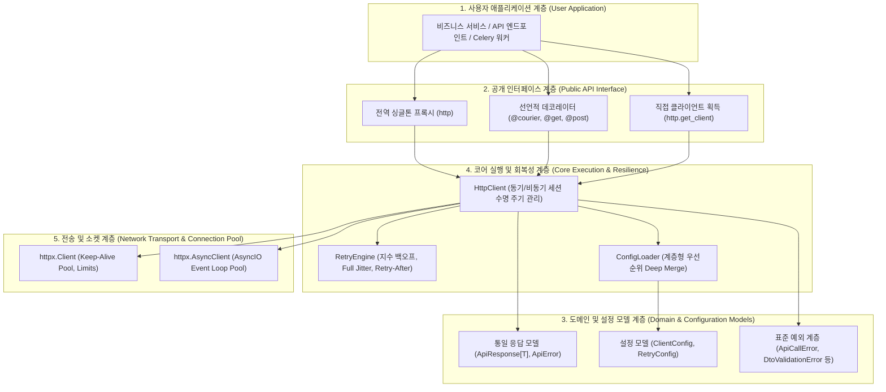
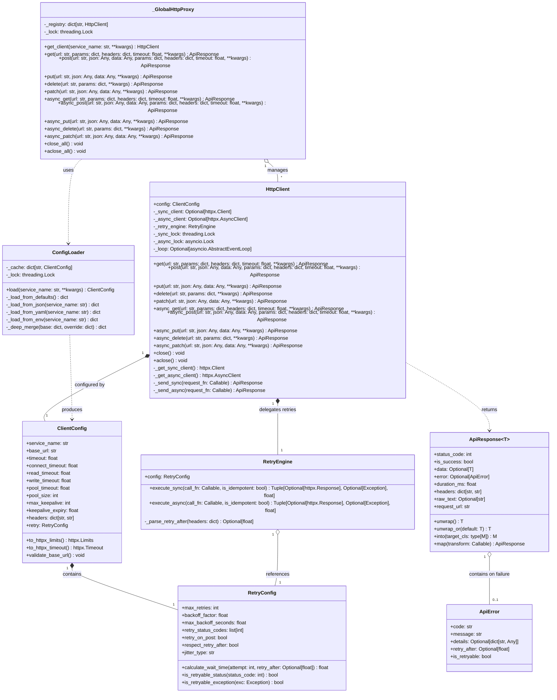
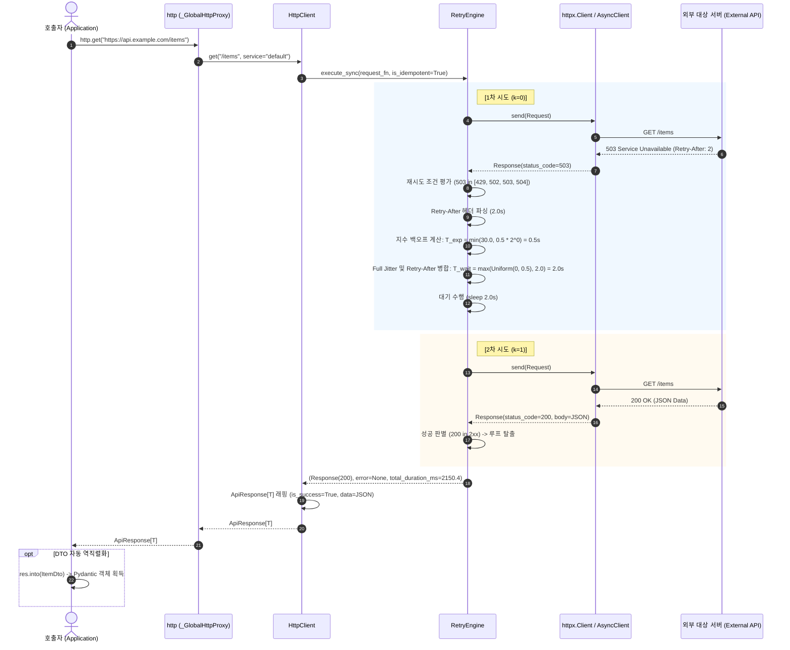
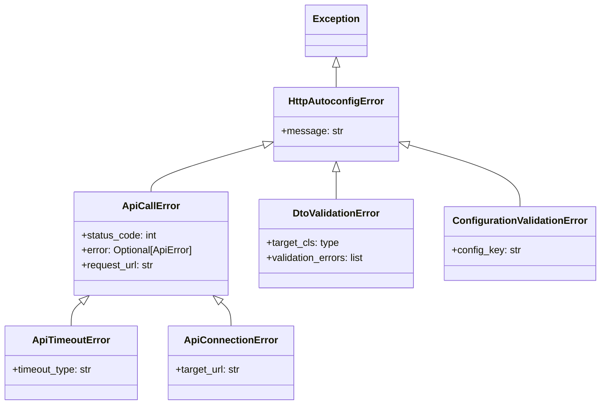

# [courier] 백엔드 시스템 및 공개 SDK 인터페이스 설계서 (System Design & Public SDK Specification)

- **작성일자**: 2026-09-22
- **작성자**: 백엔드 시스템 디자이너 (`system-designer`)
- **문서 버전**: v1.0
- **상태**: Approved

---

## 1. 백엔드 모듈 아키텍처 및 계층도 (Layered Architecture)

`courier`는 반복적인 HTTP 클라이언트 보일러플레이트를 제거하고, 안정적인 커넥션 풀링과 지수 백오프 회복성, 그리고 타입 세이프한 `ApiResponse[T]` 래퍼를 제공하는 고신뢰성 파이썬 라이브러리입니다.

### 1.1 패키지 모듈 구조 (Package Layout)

```
courier/
├── __init__.py           # 공개 API 엔트리포인트 (http, HttpClient, ApiResponse, ApiError, ClientConfig, get_client 등)
├── response.py          # ApiResponse[T], ApiError, Result 패턴 헬퍼 (unwrap, into, is_success 등)
├── config.py            # ClientConfig, RetryConfig, ConfigLoader (계층형 우선순위 병합: kwargs > ENV > YAML > JSON > Defaults)
├── client.py            # HttpClient 동기/비동기 코어 전송 엔진, httpx.Limits 풀링, _GlobalHttpProxy 전역 프록시
├── retry.py             # 지수 백오프(Exponential Backoff), 풀 지터(Full Jitter), Retry-After 파싱, 상태코드 필터링
├── decorators.py        # 선언적 API 데코레이터 (@courier, @get, @post, @put, @delete, @patch)
└── exceptions.py        # 표준 예외 계층 (ApiCallError, ApiTimeoutError, ApiConnectionError, DtoValidationError 등)
```

### 1.2 모듈별 역할 및 책임 명세 (Module Responsibilities)

| 모듈 경로 | 주요 구성 요소 | 역할 및 핵심 책임 |
| :--- | :--- | :--- |
| `__init__.py` | `http`, `get_client`, `HttpClient`, `ApiResponse`, `ApiError`, `ClientConfig`, `RetryConfig`, `courier`, `get`, `post` | • 라이브러리 최상위 공개 인터페이스 노출<br/>• `_GlobalHttpProxy` 전역 인스턴스를 `http` 심볼로 노출하여 `http.get()`, `http.post()` 등 즉시 호출 지원<br/>• 명시적 `__all__` 선언을 통한 클린 네임스페이스 및 IDE 자동완성 지원 |
| `response.py` | `ApiResponse[T]`, `ApiError`, `ApiErrorDetail` | • 단일 통일 응답 래퍼 모델 제공 (상태코드, 성공 여부, 데이터, 에러, 소요시간, 헤더, 원시 텍스트)<br/>• Result 패턴 헬퍼 구현 (`unwrap()`, `into()`, `is_success`)<br/>• Pydantic v2 `model_validate` 기반 DTO 자동 역직렬화 메커니즘 제공 |
| `config.py` | `ClientConfig`, `RetryConfig`, `ConfigLoader` | • 5단계 계층형 우선순위(`kwargs > ENV > YAML > JSON > Defaults`) 자동 병합 로직<br/>• 서비스별(`payment`, `notification` 등) 멀티 테넌트 설정 모델링<br/>• Pydantic 기반 설정 유효성 검증 및 `httpx.Limits`, `httpx.Timeout` 객체 변환 |
| `client.py` | `HttpClient`, `_GlobalHttpProxy` | • `httpx.Client`(동기) 및 `httpx.AsyncClient`(비동기) 코어 세션 수명 주기 제어<br/>• 커넥션 풀링(`httpx.Limits`) 및 타임아웃 세분화 관리<br/>• 지연 초기화(Lazy Initialization) 및 멀티스레드 안전한 싱글톤 레지스트리 제공<br/>• 프로세스 종료 시 `atexit` 훅을 통한 소켓 안전 해제 |
| `retry.py` | `RetryEngine`, `calculate_backoff` | • 지수 백오프 및 풀 지터(Full Jitter, Uniform Distribution) 계산 엔진<br/>• HTTP `Retry-After` 헤더(초 단위 정수 및 HTTP-Date) 파싱 및 대기 시간 클램핑<br/>• 재시도 대상 상태코드(429, 502, 503, 504) 및 네트워크 예외 필터링<br/>• 멱등성(Idempotency) 검증 및 비멱등(POST/PATCH) 요청 재시도 방어 |
| `decorators.py` | `@courier`, `@get`, `@post`, `@put`, `@delete`, `@patch` | • 인터페이스 기반 선언적 HTTP 클라이언트 정의 지원<br/>• URL 경로 파라미터(`{user_id}`) 및 쿼리/바디 매핑 자동화<br/>• 동기 및 비동기 함수 모두에 대한 투명한 래핑 지원 |
| `exceptions.py` | `HttpAutoconfigError`, `ApiCallError`, `ApiTimeoutError`, `ApiConnectionError`, `DtoValidationError`, `ConfigurationValidationError` | • 계층형 표준 예외 클래스 체계 정의<br/>• `unwrap()` 실패 시 구체적인 상태코드 및 원인 제공<br/>• 원시 HTTPX 예외를 도메인 예외로 안전하게 캡슐화 |

### 1.3 소프트웨어 계층도 (Layered Architecture Diagram)



---

## 2. 핵심 클래스 및 구조 설계 (Core Class Architecture & Mermaid Class Diagram)

> [!NOTE]
> 본 프로젝트는 관계형 데이터베이스(RDBMS)를 직접 제어하는 영속 계층 중심의 서버 시스템이 아니라, 외부 HTTP 리소스를 안전하게 소비(Consume)하는 클라이언트 SDK 라이브러리입니다. 따라서 본 섹션에서는 데이터베이스 ERD 대신, 객체 지향적 책임 분리와 타입 안정성을 보장하는 핵심 클래스 다이어그램(`classDiagram`)으로 시스템 구조를 정의합니다.

### 2.1 핵심 클래스 다이어그램 (Mermaid Class Diagram)



### 2.2 클래스 간 상호작용 및 생명주기 관계

1. **`_GlobalHttpProxy` $\rightarrow$ `HttpClient`**:
   - `_GlobalHttpProxy`는 프로세스 전역에서 `http` 인스턴스로 존재하며, `service_name`별로 `HttpClient` 인스턴스를 싱글톤 캐시로 보관합니다.
   - 개발자가 `http.get(...)`을 직접 호출하면 내부적으로 `"default"` 서비스 클라이언트로 위임(Delegate)합니다.
2. **`ConfigLoader` $\rightarrow$ `ClientConfig`**:
   - `ConfigLoader`는 `kwargs > ENV > YAML > JSON > Defaults` 우선순위에 따라 원시 딕셔너리를 병합한 뒤, Pydantic 모델인 `ClientConfig`를 인스턴스화하여 검증된 설정을 반환합니다.
3. **`HttpClient` $\rightarrow$ `RetryEngine` $\rightarrow$ `ApiResponse[T]`**:
   - `HttpClient`는 요청 실행 시 `RetryEngine`을 통해 일시적 네트워크 장애(Connection error, Timeout) 및 429/5xx 응답을 가로채어 지수 백오프 재시도를 수행합니다.
   - 모든 재시도 소진 또는 정상 수신 시 결과를 단일 불변(Immutable) 모델인 `ApiResponse[T]`로 감싸서 반환합니다.

---

## 3. 커넥션 풀링 및 리소스 최적화 전략 (Connection Pooling & Optimization Strategy)

> [!NOTE]
> 본 라이브러리는 RDBMS 테이블 인덱싱 대신, 고성능 네트워크 I/O를 위한 **HTTP 커넥션 풀링 라이프사이클 최적화**, **스레드 안전한 싱글톤 캐싱**, 그리고 **메모리 보호 전략**을 적용합니다.

### 3.1 커넥션 풀 최적화 매트릭스 (Connection Pool Specifications)

| 최적화 영역 | 핵심 설정 파라미터 | 기본값 | 동작 메커니즘 및 시스템 최적화 효과 |
| :--- | :--- | :---: | :--- |
| **최대 커넥션 수** | `max_connections` (`pool_size`) | `20` | 대상 호스트당 동시에 유지할 수 있는 최대 소켓 연결 수. 과도한 동시 소켓 생성으로 인한 OS 파일 디스크립터 고갈을 차단. |
| **유휴 Keep-Alive 풀** | `max_keepalive_connections` | `10` | 사용 완료 후 닫지 않고 풀에 유지하는 최대 Keep-Alive 소켓 수. 반복 요청 시 TCP 3-Way Handshake 및 TLS 핸드셰이크 오버헤드를 0ms로 단축. |
| **유휴 커넥션 만료 주기** | `keepalive_expiry` | `30.0s` | 유휴 커넥션의 최대 생존 시간. 방화벽이나 외부 L4/L7 로드밸런서가 연결을 일방적으로 끊음(Silent Drop)으로써 발생하는 `Broken Pipe` 또는 `RemoteDisconnected` 에러 사전 방지. |
| **풀 획득 타임아웃** | `pool_timeout` | `5.0s` | 커넥션 풀이 모두 고갈되었을 때 새 연결 대기 한도 시간. 5초 초과 시 블로킹을 해제하고 `ERR_ENG_POOL_EXHAUSTED` 예외를 반환하여 스레드 정체 방지. |

### 3.2 지연 초기화(Lazy Initialization) 및 메모리 누수 방지

1. **지연 인스턴스화**:
   - `HttpClient` 생성 시 즉시 소켓을 열지 않고, 첫 번째 동기 요청(`get`) 시점에 동기 `httpx.Client`를, 첫 번째 비동기 요청(`async_get`) 시점에 `httpx.AsyncClient`를 지연 생성합니다.
   - 단 한 번도 호출되지 않은 프로토콜(동기 또는 비동기)에 대한 불필요한 스레드/소켓 메모리 낭비를 원천 제거합니다.
2. **응답 본문 메모리 상한 (1MB Buffer Safety)**:
   - 응답 파싱 시 비정형 대용량 본문(예: 잘못 다운로드된 수백 MB 바이너리 또는 HTML)으로 인한 OOM(Out Of Memory)을 방지하기 위해, `raw_text`는 최대 1MB(1,048,576 bytes)까지만 적재하며 초과 시 `[TRUNCATED: Response body exceeded 1MB]` 접미사를 추가합니다.
3. **프로세스 종료 훅 (`atexit`)을 통한 리소스 해제**:
   - `python-autoconfig`가 초기화될 때 Python 표준 `atexit.register`를 통해 종료 훅을 등록합니다.
   - 인터프리터 종료 시 등록된 모든 `HttpClient`의 `close()` 및 `aclose()`를 일괄 호출하여 열려 있는 소켓을 완전 회수합니다.

---

## 4. 스레드 세이프티 및 동시성 제어 정책 (Thread-Safety & Concurrency Policies)

### 4.1 스레드 세이프티 보장 메커니즘 (Thread-Safety Architecture)

1. **전역 레지스트리 동기화 (Double-Checked Locking)**:
   - `_GlobalHttpProxy` 및 `ConfigLoader`는 내부 캐시 딕셔너리에 접근할 때 재진입 락(`threading.Lock`)을 활용합니다.
   - 이미 캐시된 클라이언트는 락 획득 없이 고속 반환(Lock-free Read)하고, 신규 인스턴스 등록 시에만 락 블록 내부에서 2차 검증(Double-Check) 후 안전하게 생성합니다.
2. **동기 클라이언트의 멀티스레드 안전성**:
   - `httpx.Client`는 내부적으로 커넥션 풀에 대해 스레드 안전(Thread-safe)한 큐를 사용하므로, 복수의 스레드가 동일한 `HttpClient` 인스턴스를 공유하여 `client.get()`을 동시 호출해도 안전합니다.

### 4.2 비동기 이벤트 루프 라이프사이클 및 루프 교체 감지 (AsyncIO Lifecycle)

- **문제 상황**: 비동기 워커 환경(Celery, FastAPI 백그라운드 태스크, 단위 테스트 등)에서는 스레드 내에서 이벤트 루프가 닫히거나(`loop.close()`), 새 이벤트 루프(`asyncio.new_event_loop()`)로 교체될 수 있습니다.
- **해결 정책**:
  - `HttpClient._get_async_client()` 호출 시 현재 실행 중인 루프(`asyncio.get_running_loop()`)와 클라이언트에 바인딩된 루프(`self._loop`)를 비교합니다.
  - 루프가 일치하지 않거나 이전 루프가 닫힌 경우(`loop.is_closed()`):
    1. 이전 `httpx.AsyncClient` 참조를 안전하게 해제합니다.
    2. 현재 실행 중인 활성 루프 컨텍스트에서 새 `httpx.AsyncClient` 인스턴스를 투명하게 재생성하여 바인딩합니다.
    3. `RuntimeError: Event loop is closed` 또는 `Task <...> attached to a different loop` 에러를 원천 방지합니다.

### 4.3 회복성 스마트 재시도 시퀀스 다이어그램 (Mermaid Sequence Diagram)

다음은 클라이언트가 외부 API로 요청을 전송하고, 일시적 장애(429/5xx) 발생 시 지수 백오프와 Full Jitter를 거쳐 최종 `ApiResponse[T]`를 반환하기까지의 전체 시퀀스입니다.



### 4.4 멱등성(Idempotency) 및 비멱등 요청 재시도 안전 정책

- **원칙**: `GET`, `HEAD`, `PUT`, `DELETE`, `OPTIONS`는 HTTP 명세상 멱등(Idempotent)하므로 네트워크 순단 및 일시적 5xx/429 시 안전하게 자동 재시도를 수행합니다.
- **예외 차단**: `POST`, `PATCH` 요청은 리소스 생성이나 상태 전이를 수반하므로, 타임아웃 발생 시 서버에는 이미 요청이 도달해 처리되었을 가능성이 있습니다.
- **정책**: `retry_on_post=True`가 설정에서 명시적으로 활성화되지 않은 경우, `POST`/`PATCH` 요청은 5xx 또는 타임아웃이 발생하더라도 **절대 재시도하지 않고 1회 실패 즉시 `ApiResponse(is_success=False)`를 반환**하여 중복 결제 및 중복 리소스 생성을 원천 차단합니다.

---

## 5. 공개 SDK 인터페이스 상세 명세 (Public SDK Specification)

> [!IMPORTANT]
> **OpenAPI 엔드포인트 명세 대체 근거**:
> 본 소프트웨어는 백엔드 HTTP 서버 엔드포인트를 노출하는 웹 서비스가 아니라, 외부 API를 소비하는 **Python 클라이언트 라이브러리/SDK**입니다. 따라서 원격 서버의 HTTP 라우트를 정의하는 OpenAPI YAML 문서 대신, 라이브러리 사용자가 직접 임포트하여 사용하는 **Python SDK 인터페이스(시그니처, 파라미터, 반환 모델, 메서드 체이닝 규약)**를 상세 명세로 갈음합니다.

### 5.1 최상위 전역 클라이언트 (`http`) 인터페이스

`from courier import http` 형태로 임포트하여 즉시 사용할 수 있는 인터페이스입니다.

#### 1) `http.get` / `http.post` / `http.put` / `http.delete` / `http.patch` (동기)

```python
def get(
    url: str,
    *,
    params: Optional[Mapping[str, Any]] = None,
    headers: Optional[Mapping[str, str]] = None,
    timeout: Optional[Union[float, httpx.Timeout]] = None,
    service: str = "default",
    **kwargs: Any,
) -> ApiResponse[Any]: ...

def post(
    url: str,
    *,
    json: Optional[Union[Mapping[str, Any], Sequence[Any], BaseModel]] = None,
    data: Optional[Union[Mapping[str, Any], bytes]] = None,
    params: Optional[Mapping[str, Any]] = None,
    headers: Optional[Mapping[str, str]] = None,
    timeout: Optional[Union[float, httpx.Timeout]] = None,
    service: str = "default",
    **kwargs: Any,
) -> ApiResponse[Any]: ...
```

- **파라미터 상세**:
  - `url` (str, 필수): 대상 URL (절대 경로 또는 `base_url`이 설정된 경우 상대 경로).
  - `json` (Optional[Any], 선택): JSON 직렬화 페이로드. Pydantic `BaseModel`이 전달되면 자동으로 `.model_dump(mode='json')` 수행.
  - `data` (Optional[Any], 선택): Form 페이로드 또는 원시 바이트 스트림.
  - `params` (Optional[dict], 선택): URL 쿼리 파라미터.
  - `headers` (Optional[dict], 선택): 개별 요청 헤더 (설정된 기본 헤더와 병합).
  - `timeout` (Optional[float | httpx.Timeout], 선택): 해당 요청 한정 타임아웃 오버라이드.
  - `service` (str, 기본값: `"default"`): 사용할 설정 프로필 서비스 식별자.
- **반환값**: `ApiResponse[Any]` 인스턴스 (예외를 던지지 않고 항상 응답 객체 반환).

#### 2) `http.async_get` / `http.async_post` (비동기)

```python
async def async_get(
    url: str,
    *,
    params: Optional[Mapping[str, Any]] = None,
    headers: Optional[Mapping[str, str]] = None,
    timeout: Optional[Union[float, httpx.Timeout]] = None,
    service: str = "default",
    **kwargs: Any,
) -> ApiResponse[Any]: ...

async def async_post(
    url: str,
    *,
    json: Optional[Union[Mapping[str, Any], Sequence[Any], BaseModel]] = None,
    data: Optional[Union[Mapping[str, Any], bytes]] = None,
    params: Optional[Mapping[str, Any]] = None,
    headers: Optional[Mapping[str, str]] = None,
    timeout: Optional[Union[float, httpx.Timeout]] = None,
    service: str = "default",
    **kwargs: Any,
) -> ApiResponse[Any]: ...
```

#### 3) `http.get_client` (서비스별 전용 클라이언트 획득)

```python
def get_client(
    service_name: str = "default",
    *,
    base_url: Optional[str] = None,
    timeout: Optional[float] = None,
    connect_timeout: Optional[float] = None,
    max_retries: Optional[int] = None,
    pool_size: Optional[int] = None,
    headers: Optional[Mapping[str, str]] = None,
    **kwargs: Any,
) -> HttpClient: ...
```

- **설명**: 지정한 `service_name`에 해당하는 설정을 로드하여 싱글톤 `HttpClient` 인스턴스를 반환합니다. 추가 인자(`kwargs`)가 주어질 경우 해당 인자가 최우선으로 설정을 오버라이드합니다.

---

### 5.2 통일된 제네릭 응답 모델 (`ApiResponse[T]`) 명세

```python
class ApiResponse(Generic[T]):
    status_code: int                  # HTTP 상태 코드 (네트워크 실패/타임아웃 시 0)
    is_success: bool                  # 200 <= status_code < 300 인 경우 True
    data: Optional[T]                 # 역직렬화된 응답 데이터 (Dict, List, 또는 Primitive)
    error: Optional[ApiError]         # 실패 시 구체적 에러 상세 (성공 시 None)
    duration_ms: float                # 전체 소요 시간 (밀리초, 재시도 대기 포함)
    headers: Mapping[str, str]        # 응답 헤더 (대소문자 무시)
    raw_text: Optional[str]           # 원시 텍스트 본문 (최대 1MB 안전 버퍼)
    request_url: str                  # 실제 호출된 전체 요청 URL

    def unwrap(self) -> T:
        """
        성공 시 data를 즉시 반환하며, 실패(is_success=False) 시 구체적인 ApiCallError를 발생시킵니다.
        """
        ...

    def unwrap_or(self, default: T) -> T:
        """
        성공 시 data를 반환하고, 실패 시 주어진 기본값(default)을 반환합니다.
        """
        ...

    def into(self, target_cls: type[M]) -> M:
        """
        data 딕셔너리를 주어진 Pydantic BaseModel 클래스(target_cls)로 자동 검증 및 역직렬화합니다.
        실패 시 DtoValidationError를 발생시킵니다.
        """
        ...

    def map(self, transform: Callable[[T], U]) -> "ApiResponse[U]":
        """
        성공한 경우에만 data에 함수를 적용하여 변환된 새 ApiResponse를 반환합니다.
        """
        ...
```

#### `ApiError` 데이터 모델 명세

```python
class ApiError(BaseModel):
    code: str                         # 비즈니스/시스템 에러 코드 (예: 'ERR_ENG_TIMEOUT', 'ERR_HTTP_SERVER_ERROR')
    message: str                      # 사용자 및 시스템 디버깅 안내 메시지
    details: Optional[dict[str, Any]] # 원시 에러 페이로드 또는 추가 컨텍스트
    retry_after: Optional[float]      # 서버가 전달한 Retry-After 대기 초 (없는 경우 None)
    is_retryable: bool                # 재시도 대상 에러 여부
```

---

### 5.3 선언적 API 데코레이터 (`decorators.py`) 명세

인터페이스 지향 프로그래밍을 위한 선언적 데코레이터 규격입니다.

```python
@courier(service="payment", base_url="https://api.tosspayments.com")
class PaymentClient:
    
    @get("/v1/payments/{payment_key}")
    def get_payment(self, payment_key: str) -> ApiResponse[PaymentDto]:
        ...

    @post("/v1/payments/confirm")
    async def confirm_payment(self, json: ConfirmRequest) -> ApiResponse[PaymentDto]:
        ...
```

- **`@courier(service: str, base_url: Optional[str] = None)`**: 대상 클래스를 지정된 서비스의 `HttpClient`와 바인딩합니다.
- **`@get`, `@post`, `@put`, `@delete`, `@patch`**: 함수의 시그니처와 매개변수를 분석하여 URL Path Parameter 치환, Query Params 매핑, Body Payload 전송을 자동으로 처리하고 `ApiResponse[T]`를 반환합니다.

---

### 5.4 표준 예외 계층 구조 (`exceptions.py`)

라이브러리는 원시 예외를 직접 외부로 노출하지 않고 일관된 도메인 예외 계층을 제공합니다.



---

### 5.5 대표 사용 예시 코드 (SDK Usage Examples)

#### 1) 전역 객체를 통한 간편 호출 및 Result 패턴 핸들링

```python
from courier import http
from pydantic import BaseModel

class UserProfile(BaseModel):
    id: int
    name: str
    email: str

# 1. 동기 호출 및 안전한 분기
res = http.get("https://api.example.com/users/42")

if res.is_success:
    user = res.into(UserProfile)  # Pydantic DTO로 자동 변환
    print(f"사용자 이름: {user.name}, 소요시간: {res.duration_ms}ms")
else:
    print(f"호출 실패 ({res.status_code}): {res.error.message}")

# 2. unwrap()을 사용한 고속 프로토타이핑 (실패 시 ApiCallError 발생)
try:
    user_data = http.get("https://api.example.com/users/42").unwrap()
except ApiCallError as e:
    logger.error("API 실패: %s (코드: %s)", e.message, e.status_code)
```

#### 2) 서비스별 클라이언트 획득 및 비동기 고동시성 호출

```python
import asyncio
from courier import http

async def fetch_payment_status():
    # 'payment' 설정 프로필이 적용된 싱글톤 클라이언트 획득
    payment_client = http.get_client("payment")
    
    # 멱등하지 않은 POST 호출 - 재시도 정책 및 타임아웃 자동 적용
    res = await payment_client.async_post(
        "/v1/payments/confirm",
        json={"paymentKey": "pay_123", "amount": 15000}
    )
    return res

async def main():
    res = await fetch_payment_status()
    if res.is_success:
        print("결제 승인 완료:", res.data)
```

---

## 6. 결론 및 향후 로드맵 (Conclusion & Roadmap)

본 설계서는 외부 API 연동 시 발생하는 커넥션 누수, 비표준화된 에러 핸들링, 취약한 재시도 처리 문제를 완전히 해결하기 위한 아키텍처 규격을 제공합니다.
- **v1.0 (현재)**: 계층형 설정 로더, 동기/비동기 HTTPX 커넥션 풀링 엔진, Full Jitter 지수 백오프, 통일된 `ApiResponse[T]`, Result 패턴 DTO 역직렬화.
- **v2.0 (차기 로드맵)**: 분산 환경을 위한 Circuit Breaker 상태 머신 탑재, OpenTelemetry Tracing Span 자동 전파 인터셉터 지원.
