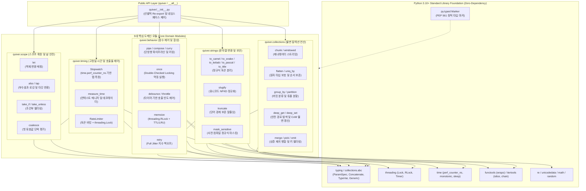

# [ADR-001] quiver 시스템 아키텍처 및 핵심 기술 스택 결정 레코드

- **작성일자**: 2026-09-23
- **작성자**: 풀스택 아키텍트 (`fullstack-architect`)
- **상태**: APPROVED
- **영향 범위**: Core Modules (collections, behavior, strings, scope, timing), Typing Architecture (PEP 561, ParamSpec, TypeVar), Concurrency & Thread-Safety Model, Packaging & Dependency Strategy

---

## 1. 배경 및 컨텍스트 (Context & Problem Statement)

파이썬 기반의 백엔드 서비스, 배치 파이프라인, 사내 공통 SDK를 개발하다 보면 리스트 청킹(Chunking), 다차원 데이터 평탄화(Flattening), 중첩 딕셔너리 안전 접근, 지수 백오프 재시도(Retry), 디바운스/쓰로틀링, 개인정보 마스킹, 실행 시간 측정과 같은 유틸리티 코드를 프로젝트마다 반복해서 작성하게 됩니다.

기획 산출물([`01_PRD.md`](../spec-writer/01_PRD.md), [`02_FUNCTIONAL_SPECIFICATION.md`](../spec-writer/02_FUNCTIONAL_SPECIFICATION.md), [`fsd/QUIVER_UTILITIES_SPECIFICATION.md`](../spec-writer/fsd/QUIVER_UTILITIES_SPECIFICATION.md), [`03_POLICIES_AND_EDGES.md`](../spec-writer/03_POLICIES_AND_EDGES.md))을 바탕으로 현업의 공통 유틸리티 사용 패턴을 분석한 결과, 다음 5가지 주요 문제점이 반복되고 있었습니다:

1. **외부 의존성 추가로 인한 패키지 관리 및 보안 감사 비용 증가**:
   - `toolz`, `pydash`, `more-itertools`, `tenacity` 같은 서드파티 패키지를 몇 개 함수 쓰려고 도입했다가 Poetry/Pipenv 버전 충돌이 발생하거나, 사내 보안 스캐너(Snyk, Dependabot)의 전이적 CVE 경고를 대응하느라 불필요한 운영 공수가 발생합니다.
2. **최신 타입 힌팅 미지원으로 인한 정적 분석 훼손**:
   - 기존 구형 라이브러리들은 Python 3.10+의 최신 타입 시스템(PEP 612 `ParamSpec`, `Concatenate`, 제네릭 문법)을 지원하지 않아 데코레이터 적용 시 파라미터 시그니처와 반환 타입이 소실(`Callable[..., Any]`)됩니다. 이로 인해 `mypy --strict` 환경에서 `# type: ignore`를 남발하게 되고 IDE 자동완성이 깨집니다.
3. **가변 객체 직접 수정(In-place Mutation)으로 인한 부수효과**:
   - 입력받은 리스트나 딕셔너리 원본을 함수 내부에서 직접 수정하여, 멀티스레드나 비동기 워커 환경에서 찾기 어려운 데이터 오염 버그를 유발합니다.
4. **동시성 락킹 모델 부재로 인한 런타임 오류**:
   - 메모이제이션이나 호출율 제한기(RateLimiter)를 단순 딕셔너리와 카운터로 구현하여, 멀티스레드 환경에서 데이터 경합(Race Condition)이나 재귀 호출 시 셀프 데드락(Self-Deadlock)이 발생합니다.
5. **단일 `utils.py` 비대화와 도메인 경계 부재**:
   - 명확한 도메인 분리 없이 한 파일에 온갖 잡다한 함수가 뒤섞여 코드 리뷰와 유지보수가 점차 어려워집니다.

이를 해결하기 위해 `quiver`는 **외부 런타임 의존성 0개(Zero-Dependency)**를 유지하면서, Python 3.10+ 표준 라이브러리만을 활용해 엄격한 정적 타입 보존, 불변성 보장, 스레드 안전성을 갖춘 5대 도메인 기반 유틸리티 라이브러리로 구축하기로 결정했습니다.

---

## 2. 고려된 기술 스택 후보군 (Considered Alternatives)

| 검토 영역 | 선정안 (후보 1) | 대안 (후보 2) | 대안 (후보 3) | 비교 및 선정 이유 |
| :--- | :--- | :--- | :--- | :--- |
| **런타임 의존성** | **Zero-Dependency**<br/>(Python 3.10+ 표준 라이브러리만 사용) | 서드파티 조합<br/>(`toolz` + `more-itertools` + `tenacity`) | 단일 대형 유틸 패키지<br/>(`pydash` / `boltons`) | **Zero-Dependency 선정**:<br/>- 런타임 의존성을 0개로 유지하면 사용자 프로젝트의 패키지 버전 충돌과 보안 스캔 부담을 없앨 수 있습니다.<br/>- CPython 내장 표준 모듈(`collections`, `itertools`, `functools`, `time`, `re`, `threading`)은 C로 작성되어 안정적이고 빠르며, 패키지 크기(<50KB)를 최소화할 수 있습니다. |
| **타입 시스템** | **PEP 561 `py.typed` + Strict Typing**<br/>(`ParamSpec`, `Concatenate`, `TypeVar`) | 동적 타이핑 (Any 위주) | 기본 제네릭 수준<br/>(`TypeVar` 단독 사용) | **Strict Typing 선정**:<br/>- PEP 612 `ParamSpec`을 사용해야 데코레이터(`retry`, `memoize`, `measure_time`) 래핑 후에도 원본 함수의 인자 시그니처와 반환 타입을 온전히 보존할 수 있습니다.<br/>- `py.typed` 마커를 통해 다운스트림 프로젝트의 `mypy --strict` 및 `pyright` 검사를 안전하게 통과할 수 있습니다. |
| **동시성 락킹 모델** | **재진입 락 & 표준 락 조합**<br/>(`threading.RLock`, `threading.Lock`) | 락 미사용 (Lock-Free 가정) | `asyncio.Lock` 전용 모델 | **재진입 락 & 표준 락 선정**:<br/>- `memoize`에서 재귀 함수 호출 시 셀프 데드락을 방지하려면 재진입 가능한 `RLock`이 필수적입니다.<br/>- `RateLimiter`는 원자적 토큰 계산을 위해 `Lock`을 적용합니다.<br/>- 비동기 코루틴 래퍼는 필요 시 인터페이스 변환 계층으로 처리합니다. |
| **불변성 관리** | **순수 함수 + 경로 기반 얕은 복사 (CoW)**<br/>(제너레이터 스트리밍 병행) | 인플레이스 수정 (In-place Mutation) | 서드파티 영속 자료구조<br/>(`pyrsistent` 패키지) | **순수 함수 + CoW 선정**:<br/>- 외부 라이브러리 없이 표준 딕셔너리 언패킹과 얕은 복사로 불변 갱신을 구현합니다.<br/>- 전체 객체를 무조건 `deepcopy`하지 않고 변경 경로 노드만 얕은 복사하여 메모리 할당을 절감합니다.<br/>- `chunk`, `windowed`는 제너레이터 스트리밍으로 대용량 데이터 인입 시 메모리 적재를 방지합니다. |
| **도메인 모듈 구조** | **5대 도메인 모듈 분리**<br/>(`collections`, `behavior`, `strings`, `scope`, `timing`) | 단일 모놀리식 모듈 (`quiver.py`) | 마이크로 패키지 분할 (`quiver-core`, `quiver-time`) | **5대 도메인 분리 선정**:<br/>- 역할에 따라 패키지를 분리하여 모듈 간 결합도를 낮추고 순환 참조를 방지합니다.<br/>- 최상위 `quiver/__init__.py`에서 핵심 함수를 선별 노출하여 사용 편의성을 확보합니다. |
| **계약 통합 계층** | **생략 (Omitted by Design)**<br/>(순수 파이썬 라이브러리) | OpenAPI / MSW 계층 구축 | JSON Schema 기반 계층 | **계약 통합 생략 결정**:<br/>- HTTP 엔드포인트를 노출하지 않는 인메모리 유틸리티 라이브러리이므로 웹 API 계약 통합(Contract Integrator, MSW) 계층은 생략합니다.<br/>- 대신 정적 타입 계약(`py.typed`)과 `pytest` 동시성 테스트 명세로 인터페이스 신뢰성을 확보합니다. |

---

## 3. 최종 아키텍처 결정 사항 (Decision)

### 3.1 전체 시스템 토폴로지 및 도메인 모듈 경계

`quiver`는 단방향 의존성 규칙을 준수하며 5개의 도메인 모듈과 하위 표준 라이브러리 기반 계층으로 구성됩니다. 최상위 패키지 진입점(`quiver/__init__.py`)은 자주 쓰이는 핵심 함수를 선별적으로 Re-export하고, 내부적으로는 모듈 간 직접적인 수평 참조를 제한합니다.



---

### 3.2 핵심 아키텍처 원칙 및 상세 기술 결정

#### 원칙 1: Zero-Dependency 채택 이유와 표준 라이브러리의 성능 한계

- **Zero-Dependency를 고집하는 이유**:
  - 실무 환경에서 공통 유틸 라이브러리에 외부 종속성이 하나라도 포함되면, 해당 라이브러리를 가져다 쓰는 상위 프로젝트들의 `pyproject.toml`이나 `requirements.txt`에서 버전 충돌이 일어날 확률이 높아집니다.
  - 특히 데이터 파이프라인이나 마이크로서비스 배포 시, 전이적 의존성으로 인해 보안 감사 도구가 불필요한 CVE 경고를 띄우거나 도커 이미지 빌드 캐시가 자주 깨지는 문제가 있습니다.
  - 따라서 `quiver`는 `dependencies = []`로 런타임 종속성을 0개로 강제하고, CPython에 내장된 C 최적화 표준 모듈(`itertools`, `collections`, `re`, `time`)만 사용합니다. 패키지 용량은 50KB 미만으로 유지되어 람다(AWS Lambda) 콜드 스타트나 컨테이너 구동 지연을 최소화합니다.

- **표준 라이브러리 조합 시의 성능 한계 (솔직한 엔지니어링 평가)**:
  - C-Extension이나 Rust PyO3 바인딩을 쓰지 않고 순수 파이썬 루프와 제너레이터로만 연산하므로, C 언어로 직접 컴파일된 라이브러리에 비해 요소당 오버헤드가 큽니다.
  - 수천만 건 이상의 대규모 행렬 연산이나 컬럼형 데이터 처리는 본 라이브러리의 적합한 사용처가 아닙니다. 이러한 워크로드는 NumPy, Polars, Pandas 같은 특화 도구를 사용해야 합니다.
  - `quiver`는 애플리케이션 비즈니스 로직, 웹 API 요청/응답 변환, 이벤트 제어, 문자열 가공 등 수백~수만 건 단위의 데이터 처리에 최적화된 포지션을 가집니다.

---

#### 원칙 2: Python 3.10+ Strict Typing 및 데코레이터 시그니처 보존

- **PEP 612 `ParamSpec`과 `TypeVar`를 활용한 데코레이터 타이핑**:
  - 기존 파이썬 유틸리티의 대표적 문제점은 `@retry`나 `@memoize`를 함수에 붙이는 순간 함수의 타입 정보가 사라진다는 점이었습니다.
  - `quiver`는 `ParamSpec("P")`과 `TypeVar("R")`을 사용하여 원본 함수의 매개변수 구조와 반환 타입을 보존합니다:
    ```python
    from typing import Callable, ParamSpec, TypeVar
    from functools import wraps

    P = ParamSpec("P")
    R = TypeVar("R")

    def retry(
        max_attempts: int = 3,
        backoff_base: float = 0.5,
        backoff_max: float = 60.0,
        jitter: bool = True,
        exceptions: tuple[type[Exception], ...] = (Exception,)
    ) -> Callable[[Callable[P, R]], Callable[P, R]]:
        def decorator(fn: Callable[P, R]) -> Callable[P, R]:
            @wraps(fn)
            def wrapper(*args: P.args, **kwargs: P.kwargs) -> R:
                # 지수 백오프 및 Full Jitter 실행 로직
                ...
            return wrapper
        return decorator
    ```
- **PEP 561 마커 파일 배포**:
  - 패키지 루트에 `py.typed` 파일을 포함하여, 사용자의 프로젝트에서 `mypy --strict`나 `pyright`를 돌렸을 때 타입 누락 경고 없이 분석이 완료되도록 지원합니다.

---

#### 원칙 3: 5대 모듈 도메인 분리 및 명확한 경계 거버넌스

- **단일 책임 기반 5대 모듈 분리**:
  1. `quiver.collections`: 컬렉션 슬라이싱, 평탄화, 버킷 분류, 중첩 딕셔너리 안전 접근 및 불변 갱신 모듈.
  2. `quiver.behavior`: 파이프라인 합성(`pipe`, `compose`), 부분 적용(`curry`), 실행 제어(`once`, `debounce`, `throttle`, `memoize`, `retry`) 모듈.
  3. `quiver.strings`: 대소문자 변환(camel, snake, kebab, pascal, title), URL 슬러그화, 단어 단위 자르기, 개인정보 마스킹 모듈.
  4. `quiver.scope`: 객체 변환(`let`), 부수효과 처리(`also`/`tap`), 조건부 필터링(`take_if`, `take_unless`), 널 병합(`coalesce`) 모듈.
  5. `quiver.timing`: 나노초 단위 계측(`Stopwatch`), 소요시간 측정(`measure_time`), 토큰 버킷 호출 속도 제한(`RateLimiter`) 모듈.

- **순환 참조 방지 및 진입점 Re-export 관리**:
  - 도메인 모듈 간 수평적 상호 참조를 금지하여 모듈 간 결합도를 낮춥니다.
  - `quiver/__init__.py`는 사용 빈도가 높은 핵심 함수들을 선별적으로 Re-export하며, 네임스페이스 오염을 방지하기 위해 `__all__` 리스트를 명시적으로 선언합니다.

---

#### 원칙 4: 불변성(Immutability) 보장과 Copy-on-Write의 메모리 트레이드오프

- **불변성 확보를 위한 구조적 공유와 얕은 복사 (Path-based Shallow Copy)**:
  - 파이썬의 `list`와 `dict`는 가변 객체(Mutable)이므로, 외부 라이브러리(`pyrsistent` 등) 없이 불변성을 지키려면 수정 시 복제가 필수적입니다.
  - 하지만 무분별한 `copy.deepcopy`는 객체 그래프 전체를 순회하고 재귀 복사하므로 성능 저하가 심각합니다.
  - 따라서 `deep_set`과 `merge`는 변경이 일어나는 특정 경로 상의 딕셔너리 노드만 얕은 복사(`dict.copy()` 또는 `{**node}`)하여 새로운 딕셔너리를 조합하는 **Path-based Shallow Copy (구조적 공유)** 패턴을 채택했습니다.
  - 이를 통해 변경되지 않은 형제 브랜치(Sibling nodes)는 기존 메모리 참조를 유지하면서, 불변성을 보장하고 복제 오버헤드를 $O(Depth)$ 수준으로 줄였습니다.

- **실무 주의점: 메모리 사용량과 GC 압박 (Memory Trade-off Gotcha)**:
  - 경로 기반 복사를 하더라도 딕셔너리를 수정할 때마다 새로운 딕셔너리 객체가 힙 메모리에 생성됩니다.
  - 초당 수만 건 이상의 고빈도 루프에서 거대한 중첩 딕셔너리를 `deep_set`으로 빈번하게 갱신하면 파이썬 가비지 컬렉터(GC)에 부담을 줄 수 있습니다.
  - 대량 배치 가공이 필요한 경우, 루프 내부에서는 가변 딕셔너리로 빠르게 누적한 뒤 최종 단계에서 불변 객체로 동결하거나 반환하는 방식을 권장합니다.

- **대용량 이터러블 스트리밍**:
  - `chunk` 및 `windowed`는 전체 데이터를 한 번에 리스트 목록으로 메모리에 올리지 않고, `itertools.islice`를 활용한 제너레이터로 제공하여 $O(1)$의 보조 메모리 공간만 사용합니다.

- **원자 타입 평탄화 방어 및 순환 참조 방지**:
  - `flatten` 시 문자열(`str`), 바이트(`bytes`), 딕셔너리(`dict`)는 원자적 데이터로 취급하여 글자 단위나 키 단위로 쪼개지지 않도록 방어합니다.
  - 중첩 컬렉션 내 자기 참조나 상호 순환 참조로 인한 무한 루프를 막기 위해, 탐색 중인 컨테이너 ID를 추적하는 `visited_ids` 집합을 유지하고 순환 참조 발견 시 `ValueError`를 발생시킵니다.

---

#### 원칙 5: 동시성 락킹 모델 설계 이유와 실무 주의점 (Gotchas)

- **`memoize`에서 `threading.RLock`을 사용하는 이유**:
  - 재귀 알고리즘(예: 피보나치, 트리 탐색, 중첩 함수 호출)에 메모이제이션을 적용할 때, 이미 락을 획득한 동일 스레드가 재귀 진입 시 다시 락을 요청하게 됩니다.
  - 이때 일반 `threading.Lock`을 사용하면 자신이 쥔 락을 자기가 기다리게 되는 **셀프 데드락(Self-Deadlock)**이 발생합니다.
  - `threading.RLock`은 현재 소유한 스레드 식별자(Thread ID)와 재진입 횟수(Recursion Level)를 추적하므로, 같은 스레드 내의 재귀 호출을 안전하게 허용합니다.

- **`memoize` 실무 주의점 (Critical Gotchas)**:
  1. **Cache Stampede (Thundering Herd) 대 동시성 병목 트레이드오프**:
     - `memoize` 구현 시 락(`with self.lock:`) 내부에서 타깃 함수(`fn`)를 실행하면, 캐시 미스가 났을 때 계산이 끝날 때까지 다른 스레드의 캐시 조회가 모두 블로킹됩니다.
     - 반대로 락을 풀고 계산을 실행하면, 여러 스레드가 동시에 같은 키로 진입했을 때 무거운 계산이 중복 실행되는 Cache Stampede가 발생합니다.
     - `quiver`는 계산 결과의 정합성과 중복 연산 방지를 위해 락 내부 실행 방식을 채택했습니다. 따라서 네트워크 호출이나 긴 I/O 작업이 수반되는 함수를 캐싱할 경우 다른 스레드가 대기할 수 있으므로, 타임아웃을 짧게 가져가거나 비동기 캐시를 사용하는 것이 바람직합니다.
  2. **GIL(Global Interpreter Lock)과 복합 연산의 착각**:
     - "파이썬에는 GIL이 있으니 딕셔너리 캐시 연산은 락 없이도 안전하지 않은가?"라는 흔한 오해가 있습니다.
     - 딕셔너리의 단일 키 조회나 할당은 원자적이지만, "키 존재 확인 $\rightarrow$ 미스 시 함수 실행 $\rightarrow$ 만료 시각 계산 $\rightarrow$ 딕셔너리 저장 $\rightarrow$ LRU 초과 시 키 삭제"로 이어지는 복합 연산(Composite Operation) 도중에 인터프리터 바이트코드 컨텍스트 스위칭이 일어나면 캐시 상태가 쉽게 오염됩니다. 따라서 락을 통한 임계 구역(Critical Section) 보호가 필수입니다.
  3. **메모리 누수와 만료 키 정리**:
     - TTL(만료 시간)을 설정하더라도 백그라운드 청소 스레드가 없다면, 다시 조회되지 않는 키는 딕셔너리에 계속 남아 메모리를 차지합니다.
     - 이를 방지하기 위해 `memoize`는 반드시 `maxsize`(기본값 128)를 설정하여 용량 초과 시 가장 오래된 항목을 밀어내는 LRU(Least Recently Used) 방출 정책을 함께 동작시킵니다.
  4. **비동기(`asyncio`) 환경과의 비호환성**:
     - `threading.RLock`은 OS 스레드 기반 락이므로 단일 스레드 이벤트 루프 내에서 실행되는 `asyncio` 코루틴 간의 동시 접근은 보호하지 못합니다 (`await` 시점에 다른 코루틴으로 제어권이 넘어가면서 임계 구역이 깨짐). 비동기 함수에는 비동기 전용 락(`asyncio.Lock`)이 필요합니다.

- **`RateLimiter`의 토큰 버킷 락킹과 슬립 주의점**:
  - 토큰 충전 및 차감 계산은 `threading.Lock` 하에서 원자적으로 수행됩니다.
  - **치명적 주의점**: 토큰이 부족하여 대기할 때(`blocking=True`), 락을 쥔 채로 `time.sleep`을 호출하면 시스템 내 모든 스레드가 락을 얻지 못하고 정지합니다.
  - 따라서 `RateLimiter`는 반드시 "락 획득 $\rightarrow$ 필요한 대기 시간 계산 $\rightarrow$ 락 해제 $\rightarrow$ 락 외부에서 `time.sleep` 수행" 구조로 동작합니다. 슬립 완료 후 다시 락을 얻었을 때 다른 스레드가 먼저 토큰을 소진했을 수 있으므로 루프를 통해 가용 여부를 재검증합니다.

- **`once`의 Double-Checked Locking 패턴**:
  - 초기 1회 실행의 멱등성을 보장하면서, 이미 실행된 이후의 빈번한 호출에서 매번 락을 획득하는 오버헤드를 없애기 위해 Double-Checked Locking 패턴을 적용합니다:
    ```python
    class OnceWrapper:
        def __init__(self, fn: Callable[P, R]):
            self._fn = fn
            self._has_run = False
            self._result: Optional[R] = None
            self._lock = threading.Lock()

        def __call__(self, *args: P.args, **kwargs: P.kwargs) -> R:
            if not self._has_run:
                with self._lock:
                    if not self._has_run:
                        self._result = self._fn(*args, **kwargs)
                        self._has_run = True
            return self._result  # type: ignore[return-value]
    ```

- **`Stopwatch`의 나노초 단조 증가 시계**:
  - 시스템 시계가 NTP 동기화나 서머타임 변경 등으로 조정될 때 시간이 거꾸로 흐르는 현상을 방지하기 위해, 모든 시간 계측에 `time.perf_counter_ns()` 단조 시계를 사용합니다.

---

#### 원칙 6: 계약 통합(Contract Integrator) 생략 근거 및 인터페이스 신뢰성 보증

- **순수 라이브러리 특성에 따른 계약 통합 생략 이유**:
  - `quiver`는 서버-클라이언트 통신을 하거나 REST API 엔드포인트를 제공하는 웹 애플리케이션이 아닌 **순수 인메모리 파이썬 라이브러리**입니다.
  - 따라서 웹 프로젝트에서 쓰이는 OpenAPI(Swagger) 스펙 정의, MSW(Mock Service Worker) 모킹 계층, 프론트-백 엔드포인트 계약 통합(`contract-integrator`) 단계는 대상 아키텍처에 해당하지 않으므로 명시적으로 생략합니다.
- **라이브러리 인터페이스 신뢰성 보증 체계**:
  - HTTP 통신 계약 대신 다음 3단계 인터페이스 신뢰성 체계를 구축합니다:
    1. **정적 타입 계약 (Type Contract)**: `py.typed` 배포 및 `mypy --strict`, `pyright --strict` 정적 검사 통과.
    2. **동작 정책 계약 (Behavior Contract)**: 불변성 보장, 널 안전성(Graceful Fallback), 엣지 케이스 표준 예외 정의([`03_POLICIES_AND_EDGES.md`](../spec-writer/03_POLICIES_AND_EDGES.md)).
    3. **동시성 검증 계약 (Concurrency Contract)**: `pytest`를 통한 100 워커 멀티스레드 동시 접근 및 경합 테스트 통과, 95% 이상 테스트 커버리지 유지.

---

## 4. 결과 및 트레이드오프 (Consequences)

### 4.1 긍정적 영향 (Positive Impacts)

1. **의존성 충돌과 공급망 보안 문제 해결**:
   - 외부 런타임 종속성이 0개이므로, 상위 프로젝트 도입 시 패키지 충돌이나 전이적 CVE 보안 이슈가 발생하지 않습니다.
2. **개발 생산성과 컴파일 타임 에러 검출**:
   - PEP 612 `ParamSpec` 기반 타이핑 덕분에 데코레이터를 적용해도 IDE 자동완성과 타입 추론이 유지되며, `mypy --strict` 환경에서 추가적인 타입 예외 주석 없이 코드를 작성할 수 있습니다.
3. **동시성 버그 방지**:
   - 컬렉션 조작 시 원본 데이터를 변이하지 않고, `RLock`/`Lock`을 적재적소에 배치하여 멀티스레드 환경에서도 데이터 오염이나 데드락이 발생하지 않습니다.
4. **가벼운 패키지 크기와 빠른 로딩**:
   - 패키지 크기가 작아 서버리스 환경이나 짧은 주기의 배치 작업에서도 초기화 오버헤드가 거의 없습니다.

---

### 4.2 감수한 트레이드오프 및 실무 완화 방안 (Accepted Trade-offs & Mitigations)

1. **컴파일 가속(C-Extension/Rust) 배제로 인한 대규모 데이터 처리 속도 한계**:
   - *트레이드오프*: 순수 파이썬 표준 라이브러리만 사용하므로, 수백만 행 이상의 대규모 연산 시 컴파일된 네이티브 모듈보다 속도가 느립니다.
   - *완화 방안*: `chunk`, `windowed` 등에 `itertools.islice` 제너레이터 스트리밍을 적용해 메모리 낭비를 줄였습니다. 대규모 수치 연산 워크로드는 NumPy나 Polars 같은 특화 라이브러리를 사용하도록 명확히 안내합니다.
2. **불변 갱신(Copy-on-Write)에 따른 메모리 할당 비용**:
   - *트레이드오프*: 원본 보존을 위해 `deep_set` 등에서 경로 상의 딕셔너리를 얕은 복사하므로, 고빈도 루프에서 과도하게 호출할 경우 메모리 할당 및 가비지 컬렉터 부담이 커집니다.
   - *완화 방안*: 전체 복사 대신 변경 경로 노드만 복사하는 구조적 공유 기법을 적용해 비용을 $O(Depth)$로 줄였습니다. 빈번한 대량 갱신 시에는 루프 내부에서 가변 객체로 작업 후 최종 단계에서 동결하는 패턴을 권장합니다.
3. **엄격한 제네릭 타이핑으로 인한 구현 복잡도**:
   - *트레이드오프*: `ParamSpec`, `Concatenate`, `TypeVar`를 정밀하게 조합함에 따라 라이브러리 내부 소스코드의 타입 선언부가 길어지고 복잡해집니다.
   - *완화 방안*: 공통 타입 별칭(Type Alias)을 별도 내부 모듈로 통일하여 관리함으로써 코드 가독성과 유지보수성을 유지합니다.
