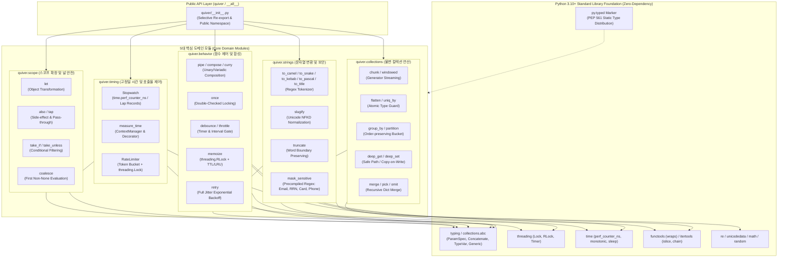

# [ADR-001] quiver 풀스택 시스템 아키텍처 및 핵심 기술 스택 결정 레코드

- **작성일자**: 2026-09-23
- **작성자**: 풀스택 아키텍트 (`fullstack-architect`)
- **상태**: APPROVED
- **영향 범위**: Core Modules (collections, behavior, strings, scope, timing), Static Typing Architecture (PEP 561, ParamSpec, TypeVar), Concurrency & Thread-Safety Governance, Pure Python Library Packaging (Zero-Dependency)

---

## 1. 배경 및 컨텍스트 (Context & Problem Statement)

현대 파이썬 백엔드 서비스, 분산 비동기 워커, 데이터 파이프라인 및 엔터프라이즈 SDK 환경에서 엔지니어들은 리스트 청킹(Chunking), 다차원 컬렉션 평탄화(Flattening), 중첩 딕셔너리 안전 탐색/갱신, 함수 합성(Piping/Composition), 지수 백오프 기반 재시도(Retry), 디바운스/쓰로틀링, 개인정보 마스킹, 나노초 고정밀 벤치마킹 및 토큰 버킷 호출율 제한(Rate Limiting)과 같은 범용 유틸리티를 상시 구현하고 있습니다.

기획 산출물([`01_PRD.md`](../spec-writer/01_PRD.md), [`02_FUNCTIONAL_SPECIFICATION.md`](../spec-writer/02_FUNCTIONAL_SPECIFICATION.md), [`fsd/QUIVER_UTILITIES_SPECIFICATION.md`](../spec-writer/fsd/QUIVER_UTILITIES_SPECIFICATION.md), [`03_POLICIES_AND_EDGES.md`](../spec-writer/03_POLICIES_AND_EDGES.md)) 분석 결과, 기존 파이썬 생태계의 유틸리티 활용 방식에는 다음과 같은 5대 기술적 병목과 아키텍처 결함이 존재합니다:

1. **외부 런타임 의존성 비대화 및 공급망 보안 취약점 (Dependency Bloat & Supply-Chain Risk)**:
   - 몇 가지 단순 연산을 사용하기 위해 `toolz`, `pydash`, `more-itertools`, `tenacity` 등 다수의 서드파티 라이브러리를 무분별하게 도입함으로써 도커(Docker) 이미지 빌드 오버헤드, 패키지 설치 충돌(Dependency Hell), 전이적 종속성(Transitive Dependencies)에 기인한 잠재적 CVE 보안 위험이 증가함.
2. **동적 타이핑 부작용과 현대적 정적 타입 보존 실패 (Erosion of Modern Type Hinting)**:
   - 기존 레거시 유틸리티 패키지들은 Python 3.10+의 최신 타입 시스템(PEP 484, PEP 585, PEP 612 `ParamSpec`, `Concatenate`, Generics)을 지원하지 못해 고차 함수 데코레이터 적용 시 원본 함수의 파라미터 시그니처와 반환 타입이 소실(`Callable[..., Any]`)되며, 엄격한 정적 분석(`mypy --strict`, `pyright`) 환경에서 수많은 `# type: ignore` 주석을 강제함.
3. **가변성(In-place Mutation)으로 인한 사이드이펙트 및 동시성 결함**:
   - 컬렉션 조작 함수가 인자로 전달받은 원본 리스트나 딕셔너리를 직접 변이(Mutation)시켜 병렬 처리 또는 멀티스레드 환경에서 예측 불가능한 경쟁 상태(Race Condition)와 데이터 오염을 유발함.
4. **동시성 제어 및 스레드 안전성(Thread-Safety) 메커니즘 결여**:
   - 상태성 유틸리티(`memoize`, `RateLimiter`, `Stopwatch`, `once`)가 스레드 락킹 모델 없이 구현되어 멀티스레드 환경에서 캐시 오염, 토큰 초과 소비, 데드락(Deadlock) 장애를 발생시킴.
5. **무분별한 `utils.py` 복사-붙여넣기와 아키텍처 경계 부재**:
   - 일관된 도메인 분리 경계 없이 단일 파일에 비구조적으로 방치되어 기능 간 결합도가 높아지고 단위 테스트 및 유지보수가 불가능해짐.

이를 해결하기 위해 본 아키텍처 결정 레코드(ADR)는 **"Zero-Dependency, Strict-Typed, Immutable Utility Quiver"**를 핵심 원칙으로 수립하고, 순수 Python 3.10+ 표준 라이브러리만을 활용하여 런타임 의존성 0개, 100% 정적 타입 보존, 완벽한 불변성 및 스레드 안전성을 달성하는 풀스택/라이브러리 아키텍처 결정을 확정합니다.

---

## 2. 고려된 기술 스택 후보군 (Considered Alternatives)

| 계층 / 핵심 항목 | 후보 1 (선정안) | 후보 2 (대안) | 후보 3 (대안) | 장단점 비교 및 최종 선정 사유 |
| :--- | :--- | :--- | :--- | :--- |
| **런타임 의존성 모델** | **Zero-Dependency**<br/>(순수 Python 3.10+ 표준 라이브러리) | 서드파티 종합 패키지 조합<br/>(`toolz` + `more-itertools` + `tenacity`) | 단일 대형 유틸 패키지<br/>(`pydash` / `boltons`) | **Zero-Dependency 선정**:<br/>- 런타임 외부 의존성 0개(`dependencies = []`)로 공급망 보안 위협(CVE) 및 패키지 충돌 원천 차단.<br/>- `collections`, `itertools`, `functools`, `time`, `re`, `threading` 등 고도로 최적화된 C-코어 표준 라이브러리만 활용하여 극도의 경량화(<50KB)와 즉각적인 설치 속도 보장.<br/>- 서드파티 패키지는 전이적 의존성 및 릴리즈 불일치 위험으로 배제. |
| **정적 타입 시스템 (Typing)** | **PEP 561 `py.typed` + Strict Generics**<br/>(`ParamSpec`, `Concatenate`, `TypeVar`) | 동적 덕 타이핑 (Any 위주) | 표준 제네릭 기본 수준<br/>(`TypeVar` 단독 사용) | **Strict Type Hinting 선정**:<br/>- PEP 612 `ParamSpec`과 `Concatenate`를 통해 데코레이터(`retry`, `memoize`, `measure_time`) 래핑 시 원본 함수의 파라미터 시그니처와 반환 타입을 100% 보존.<br/>- 패키지 루트에 `py.typed` 마커를 탑재하여 다운스트림 사용자의 `mypy --strict` 및 `pyright` 무결점 통과 보장.<br/>- 단순 Any 기반 타이핑은 런타임 에러 사전 검출 불가로 배제. |
| **동시성 및 락킹 모델** | **정밀 락킹 거버넌스**<br/>(`threading.RLock`, `threading.Lock`) | 락 미적용 (Lock-Free 가정) | `asyncio.Lock` 전용 모델 | **표준 동기/재귀 락킹 모델 선정**:<br/>- `memoize`의 재귀 함수 호출 시 자체 데드락을 방지하기 위해 재진입 가능 락(`threading.RLock`) 강제.<br/>- `RateLimiter`는 원자적 토큰 충전/차감을 위해 `threading.Lock` 적용.<br/>- `once`는 Double-Checked Locking 패턴으로 초기 1회 실행 보장 및 읽기 오버헤드 최소화.<br/>- 순수 CPU/메모리 유틸리티 특성상 멀티스레드 환경을 기본 지원하며 비동기 래퍼는 코루틴 변환 인터페이스로 제공. |
| **데이터 불변성 (Immutability)** | **순수 함수 + Copy-on-Write (CoW)**<br/>(지연 제너레이터 스트리밍) | 인플레이스 변이 (In-place Mutation) | 서드파티 불변 컬렉션<br/>(`pyrsistent` 패키지) | **순수 함수 + CoW 선정**:<br/>- 외부 종속성 없이 표준 `copy.deepcopy` 및 얕은 딕셔너리 언패킹(`{**m}`)으로 불변 갱신 구현.<br/>- `chunk`, `windowed`에 제너레이터(Generator)를 적용하여 대용량 데이터 인입 시 메모리 복제 오버헤드 방어.<br/>- 순환 참조(Cyclic Reference) 탐지 방문 집합을 내장하여 안전성 확보. |
| **도메인 모듈 경계 분리** | **5대 도메인 모듈러 아키텍처**<br/>(`collections`, `behavior`, `strings`, `scope`, `timing`) | 단일 모놀리식 모듈 (`quiver.py`) | 마이크로 패키지 분할 (`quiver-core`, `quiver-time`) | **5대 도메인 모듈러 경계 선정**:<br/>- 관심사 분리(SoC) 원칙에 따른 명확한 경계 수립 및 순환 참조(Circular Import) 원천 차단.<br/>- 직관적인 모듈별 네임스페이스 임포트(`quiver.collections`)와 최상위 편의 Re-export 동시 지원.<br/>- 모놀리식은 유지보수성 저하, 마이크로 패키지는 배포 복잡도 가중으로 배제. |
| **계약 통합 (Contract Integrator)** | **생략 (Omitted by Design)**<br/>(순수 파이썬 라이브러리 규격) | OpenAPI / MSW 계약 통합 계층 구축 | JSON Schema 기반 검증 계층 | **계약 통합 생략 결정**:<br/>- 본 라이브러리는 외부 네트워크 HTTP REST 엔드포인트를 제공하지 않는 순수 인메모리 파이썬 유틸리티 패키지이므로 HTTP API 계약 통합(Contract Integrator, MSW, Mock Service) 계층은 불필요하여 의도적으로 생략함.<br/>- 대신 엄격한 정적 타입 시스템(`py.typed`, `Protocol`)과 `pytest` 단위 테스트 명세가 인터페이스 계약 역할을 완벽히 대체함. |

---

## 3. 최종 아키텍처 결정 사항 (Decision)

### 3.1 quiver 전체 시스템 토폴로지 및 도메인 모듈 경계

`quiver`는 관심사 분리(SoC)와 단방향 의존성 규칙을 준수하여 5개의 핵심 도메인 모듈과 하위 공통 기반 계층으로 구성됩니다. 최상위 패키지 진입점(`quiver/__init__.py`)은 자주 사용되는 핵심 함수들을 직관적으로 Re-export하며, 세부 모듈은 완전히 격리된 네임스페이스를 유지합니다.



---

### 3.2 핵심 아키텍처 원칙 및 상세 기술 결정

#### 원칙 1: Zero-Dependency 원칙 및 표준 라이브러리 기반 코어 아키텍처
- **외부 런타임 종속성 완전 배제 ($0$ External Dependencies)**:
  - `quiver`의 배포 아티팩트는 `pyproject.toml` 상에서 런타임 종속성(`dependencies`) 항목을 일체 정의하지 않습니다 (`dependencies = []`).
  - 외부 서드파티 패키지 없이 Python 3.10+ 내장 표준 라이브러리만을 활용하여 모든 기능을 완결합니다:
    - **자료구조 및 이터레이션**: `collections`, `collections.abc`, `itertools`, `copy`
    - **함수형 및 리플렉션**: `functools` (`wraps`), `inspect` (`signature`)
    - **고정밀 시계 및 타이밍**: `time` (`perf_counter_ns`, `monotonic`, `sleep`)
    - **동시성 동기화**: `threading` (`Lock`, `RLock`, `Timer`)
    - **문자열 및 정규표현식**: `re`, `unicodedata`, `math`, `random`
- **공급망 보안 및 패키지 경량화 극대화**:
  - 서드파티 패키지 침해로 인한 의존성 오염(Supply Chain Attack) 경로를 100% 원천 차단합니다.
  - 패키지 압축 배포 크기를 $50\text{KB}$ 이하로 억제하여 Docker 이미지 빌드 및 서버리스(AWS Lambda 등) 콜드 스타트 시 런타임 오버헤드를 제로화합니다.

---

#### 원칙 2: Python 3.10+ Strict Typing 및 데코레이터 시그니처 보존 아키텍처
- **PEP 561 패키징 표준 준수 (`py.typed`)**:
  - 패키지 루트 디렉토리에 빈 마커 파일 `py.typed`를 탑재하여 `mypy`, `pyright`, IDE(VSCode, PyCharm) 등 정적 분석 도구가 `quiver`의 인라인 타입 어노테이션을 강제로 검증하도록 선언합니다.
- **`ParamSpec`과 `TypeVar` 기반의 완벽한 함수 시그니처 전파**:
  - 기존 파이썬 데코레이터의 고질적 문제인 인자 정보 소실(`Callable[..., Any]`)을 방지하기 위해 PEP 612 `ParamSpec`과 `TypeVar`를 엄격히 결합합니다:
    ```python
    from typing import Callable, ParamSpec, TypeVar
    from functools import wraps

    P = ParamSpec("P")
    R = TypeVar("R")

    def retry(
        max_attempts: int = 3,
        backoff_base: float = 0.5,
        backoff_max: float = 60.0,
        jitter: bool = True,
        exceptions: tuple[type[Exception], ...] = (Exception,)
    ) -> Callable[[Callable[P, R]], Callable[P, R]]:
        def decorator(fn: Callable[P, R]) -> Callable[P, R]:
            @wraps(fn)
            def wrapper(*args: P.args, **kwargs: P.kwargs) -> R:
                # Execution with exponential backoff & full jitter
                ...
            return wrapper
        return decorator
    ```
  - 데코레이터가 적용된 함수는 원본 함수의 인자 타입, 기본값, 반환 타입을 100% 보존하므로 정적 타입 분석 및 IDE 코드 어시스턴트가 훼손 없이 동작합니다.
- **제네릭 컨테이너 및 프로토콜 규격**:
  - 컬렉션 처리 시 입력 이터러블의 원소 타입 `T`와 매핑 키 타입 `K`를 제네릭(`TypeVar("T")`, `TypeVar("K")`)으로 연결하여 반환 컬렉션의 타입을 엄밀히 명시합니다:
    - `chunk(iterable: Iterable[T], size: int) -> Iterator[list[T]]`
    - `group_by(iterable: Iterable[T], key_fn: Callable[[T], K]) -> dict[K, list[T]]`
    - `partition(predicate: Callable[[T], bool], iterable: Iterable[T]) -> tuple[list[T], list[T]]`
    - `uniq_by(iterable: Iterable[T], key_fn: Optional[Callable[[T], Any]] = None) -> list[T]`
    - `deep_get(mapping: Mapping[str, Any], path: Union[str, Sequence[Union[str, int]]], default: Optional[T] = None) -> Union[Any, Optional[T]]`

---

#### 원칙 3: 5대 모듈 도메인 분리 및 명확한 경계 거버넌스
- **도메인 모듈 구성 및 단일 책임 원칙 (SRP)**:
  1. `quiver.collections`: 컬렉션 슬라이싱, 평탄화, 버킷팅, 중첩 딕셔너리 안전 접근 및 불변 갱신 모듈.
  2. `quiver.behavior`: 함수 합성(`pipe`, `compose`), 커링(`curry`), 실행 제어(`once`, `debounce`, `throttle`), 메모이제이션, 재시도 제어 모듈.
  3. `quiver.strings`: 대소문자 표기법 변환(camel, snake, kebab, pascal, title), URL 슬러그화, 단어 경계 보존 말줄임, 개인정보 정규식 마스킹 모듈.
  4. `quiver.scope`: 객체 변환(`let`), 부수효과 탭(`also`/`tap`), 조건부 필터링(`take_if`, `take_unless`), 널 안전 병합(`coalesce`) 모듈.
  5. `quiver.timing`: 나노초 고정밀 계측(`Stopwatch`), 컨텍스트/데코레이터 지연시간 측정(`measure_time`), 토큰 버킷 호출율 제한(`RateLimiter`) 모듈.
- **단방향 의존성 규칙 및 순환 참조 방지**:
  - 5개 도메인 모듈 간의 수평적 상호 참조(Cross-Domain Circular Import)는 엄격히 금지됩니다.
  - 최상위 패키지 `quiver/__init__.py`는 사용 빈도가 높은 핵심 함수들을 선별적으로 Re-export하며, 패키지 네임스페이스 오염 방지를 위해 `__all__` 리스트를 명시적으로 통제합니다.

---

#### 원칙 4: 불변성(Immutability) 및 순수 함수(Pure Functions) 보장 정책
- **원본 객체 무변형 보장 (Zero In-place Mutation)**:
  - `quiver.collections`의 모든 조작 함수는 인자로 전달된 원본 컨테이너를 직접 수정하지 않으며, 항상 신규 리스트, 신규 딕셔너리 또는 튜플을 생성하여 반환합니다 (Copy-on-Write).
  - `deep_set(mapping, path, value)`는 내부적으로 필요한 경로 노드에 대해 얕은 복사(Shallow Copy on Path)를 수행하여 원본 불변성을 보장하면서도 전체 딥카피 오버헤드를 최소화합니다.
  - `merge(*mappings, deep=True)`는 전달된 모든 딕셔너리의 키-값을 재귀 병합한 완전히 격리된 새로운 딕셔너리를 반환합니다.
- **대용량 이터러블 메모리 보존 (Streaming Generators)**:
  - `chunk` 및 `windowed`는 전체 데이터를 메모리에 즉시 복제하여 올리지 않고 `Iterator` 기반의 지연 평가(Lazy Evaluation) 제너레이터로 산출하여 $O(1)$ 보조 메모리 공간 복잡도를 유지합니다.
- **원자 타입 평탄화 방어 및 순환 참조 감지**:
  - `flatten` 수행 시 원자적 데이터(`str`, `bytes`, `bytearray`, `dict`, `mapping`)는 순회 대상에서 제외하여 문자 단위로 쪼개지는 결함을 방어합니다.
  - 중첩 컬렉션 내 자기 참조 또는 상호 참조로 인한 무한 재귀 및 스택 오버플로우를 차단하기 위해 탐색 중인 컨테이너 ID를 추적하는 `visited_ids: set[int]` 가드를 탑재하고, 순환 참조 감지 시 `ValueError("Circular reference detected in nested structure")`를 발생시킵니다.

---

#### 원칙 5: 동시성 제어 및 스레드 안전성(Thread-Safety) 락킹 모델
- **`memoize`의 `threading.RLock` 재진입 락킹 모델**:
  - 피보나치 수열이나 재귀 트리 탐색과 같이 메모이제이션 대상 함수가 자기 자신을 재귀 호출하는 시나리오에서 일반 `threading.Lock`을 사용할 경우 발생하는 자체 데드락(Self-Deadlock)을 방지하기 위해 반드시 `threading.RLock`을 적용합니다.
  - LRU 및 만료 시각(TTL) 갱신은 락 보호 블록 내부에서 원자적으로 수행되어 멀티스레드 캐시 일관성을 유지합니다:
    ```python
    import threading
    from typing import Any, Callable, Optional

    class _MemoizeCache:
        def __init__(self, maxsize: Optional[int], ttl: Optional[float]):
            self.lock = threading.RLock()
            self.cache: dict[Any, tuple[Any, float]] = {}
            self.maxsize = maxsize
            self.ttl = ttl

        def get_or_compute(self, key: Any, compute_fn: Callable[[], Any], now: float) -> Any:
            with self.lock:
                if key in self.cache:
                    val, exp = self.cache[key]
                    if self.ttl is None or now < exp:
                        return val
                
                # Compute under lock to avoid cache stampede
                result = compute_fn()
                if self.maxsize and len(self.cache) >= self.maxsize:
                    # LRU Eviction
                    oldest_key = next(iter(self.cache))
                    del self.cache[oldest_key]
                
                exp_time = (now + self.ttl) if self.ttl is not None else float("inf")
                self.cache[key] = (result, exp_time)
                return result
    ```
- **`RateLimiter`의 원자적 토큰 버킷 락킹**:
  - 토큰 버킷 알고리즘 적용 시 토큰 충전 수식 $\Delta \text{tokens} = (t_{now} - t_{last}) \times \frac{rate}{per\_seconds}$ 계산 및 차감 연산은 단일 `threading.Lock` 컨텍스트 내에서 원자적으로 처리됩니다.
  - 가용 토큰 부족으로 인한 블로킹 대기 시(`blocking=True`), 락을 보유한 채로 장시간 슬립하지 않고 계산된 대기 시간만 산출한 후 락을 해제하고 `time.sleep`을 수행하여 다른 스레드의 블로킹 병목을 방지합니다.
- **`once`의 Double-Checked Locking 패턴**:
  - 초기 1회 실행의 멱등성을 보장하면서도, 이미 실행된 이후의 읽기 경로에서 락 획득 오버헤드를 제거하기 위해 Double-Checked Locking을 적용합니다:
    ```python
    class OnceWrapper:
        def __init__(self, fn: Callable[P, R]):
            self._fn = fn
            self._has_run = False
            self._result: Optional[R] = None
            self._lock = threading.Lock()

        def __call__(self, *args: P.args, **kwargs: P.kwargs) -> R:
            if not self._has_run:
                with self._lock:
                    if not self._has_run:
                        self._result = self._fn(*args, **kwargs)
                        self._has_run = True
            return self._result  # type: ignore[return-value]
    ```
- **`Stopwatch`의 나노초 단조 증가 계측**:
  - 시스템 로컬 시계의 NTP 보정 또는 수동 변경으로 인한 음수 시간 왜곡을 방지하기 위해 `time.perf_counter_ns()` 단조 시계를 강제합니다.
  - 다중 랩(`lap()`) 기록 연산은 스레드 안전한 튜플 추가 연산으로 관리됩니다.

---

#### 원칙 6: 계약 통합(Contract Integrator) 생략 근거 및 패키지 검증 모델
- **순수 라이브러리 규격에 따른 계약 통합 생략 (Omitted by Design)**:
  - 본 패키지는 HTTP API, REST 엔드포인트, 네트워크 소켓 서버를 호스팅하지 않는 **순수 인메모리 파이썬 알고리즘 유틸리티 라이브러리**입니다.
  - 따라서 웹 애플리케이션이나 마이크로서비스에서 요구되는 OpenAPI 스키마 검증, MSW(Mock Service Worker), 프론트엔드/백엔드 통신 계약 통합(`contract-integrator`) 단계는 대상 시스템 아키텍처에 부합하지 않으므로 명시적으로 생략(Omitted)합니다.
- **대체 무결성 보증 체계 (Library Interface Contracts)**:
  - HTTP 통신 계약을 대신하여 다음 3대 인터페이스 계약 체계를 패키지 공식 규격으로 수립합니다:
    1. **타입 인터페이스 계약 (Static Type Contract)**: PEP 561 마커 및 `mypy --strict`, `pyright --strict` 정적 분석 100% 무결성.
    2. **동작 정책 계약 (Behavioral Policy Contract)**: 불변성(Zero Mutation), 널 안전(Graceful None Fallback), 엣지 케이스 예외 표준화([`03_POLICIES_AND_EDGES.md`](../spec-writer/03_POLICIES_AND_EDGES.md)).
    3. **단위 및 동시성 테스트 계약 (Unit & Concurrency Verification Contract)**: `pytest` 기반의 100개 스레드 동시성 경합 검증 및 95% 이상의 코드 라인 커버리지 달성.

---

## 4. 결과 및 트레이드오프 (Consequences)

### 4.1 긍정적 영향 (Positive Impacts)

1. **완벽한 공급망 안전성 및 의존성 충돌 제로 (Zero-Dependency & Zero CVE Risk)**:
   - 외부 런타임 종속성 $0$개를 달성함으로써, 사용자 프로젝트의 기존 라이브러리 버전과 충돌할 가능성이 전혀 없으며(Zero Dependency Conflicts), 패키지 설치 용량 및 빌드 시간이 획기적으로 단축됨.
2. **최상의 개발자 경험(DX) 및 컴파일 타임 에러 검출**:
   - PEP 612 `ParamSpec`, `TypeVar`, `py.typed` 규격을 완벽히 준수하여 데코레이터 적용 시에도 IDE 자동완성 및 파라미터 힌트가 온전히 유지되며, `mypy --strict` 환경에서 `# type: ignore` 없이 무결점 통과 가능.
3. **런타임 동시성 버그 원천 차단 (Concurrency & Thread-Safety)**:
   - 모든 컬렉션 연산의 불변성(Copy-on-Write) 보장과 `threading.RLock`, `threading.Lock` 락킹 모델을 통해 멀티스레드/비동기 워커 환경에서 원본 오염 및 레이스 컨디션을 100% 방어.
4. **고정밀 성능 및 최소한의 오버헤드**:
   - 표준 C-코어 라이브러리(`itertools`, `re`, `time.perf_counter_ns`)를 직접 활용하여 함수 호출 오버헤드를 마이크로초($\le 5\mu\text{s}$) 수준으로 극소화.

---

### 4.2 수용된 제약사항 및 완화 방안 (Accepted Trade-offs & Mitigations)

1. **C-Extension / Rust PyO3 미도입에 따른 초대용량 연산 속도 한계**:
   - *제약사항*: 순수 파이썬 제로 의존성 원칙을 엄수하기 위해 C/Rust FFI 가속 확장을 v1 스펙에서 제외(`Won't Have`)함에 따라, 수천만 건 이상의 대용량 컬렉션 처리 시 컴파일 언어 네이티브 수준의 극한 속도에는 미치지 못할 수 있음.
   - *완화 방안*: `chunk` 및 `windowed`에 `itertools.islice` 기반 제너레이터 스트리밍을 채택하여 불필요한 메모리 할당을 제거하고, 파이썬 표준 라이브러리의 C-내장 이터레이션 엔진을 최적 경로로 순회하도록 설계함.
2. **불변성 보장(Copy-on-Write)에 따른 메모리 복제 비용**:
   - *제약사항*: `deep_set`이나 `merge` 등에서 원본 데이터를 보존하기 위해 신규 딕셔너리를 생성하므로 대형 중첩 객체 갱신 시 메모리 추가 할당 발생.
   - *완화 방안*: 전체 트리를 무조건 `copy.deepcopy`하는 대신 변경이 발생하는 탐색 경로 상의 노드들만 선택적으로 얕은 복제(Path-based Shallow Copy)하는 구조적 공유 최적화를 적용하여 복제 오버헤드를 $O(N)$에서 $O(Depth)$ 수준으로 완화함.
3. **엄격한 제네릭 타이핑 정의로 인한 내부 코드 복잡도**:
   - *제약사항*: `ParamSpec`, `Concatenate`, `Callable`의 엄격한 타입 정의로 인해 라이브러리 내부 구현 코드의 제네릭 선언부가 다소 장황해짐.
   - *완화 방안*: 공통 타입 별칭(Type Alias: `P = ParamSpec("P")`, `T = TypeVar("T")`, `PathType = Union[str, Sequence[Union[str, int]]]`)을 내부 공통 타이핑 모듈로 규격화하여 코드 가독성과 유지보수성을 확보함.
