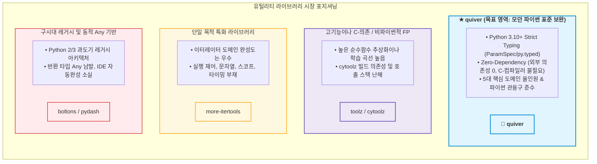
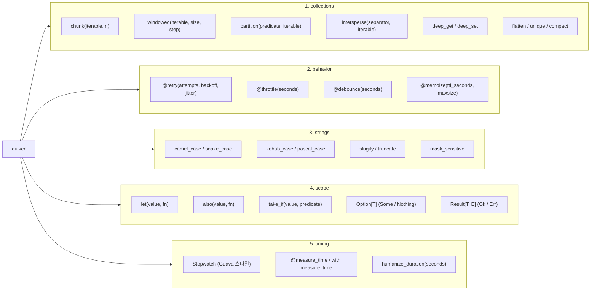

# [quiver] 언어별 유틸리티 라이브러리 설계 철학 및 벤치마킹 분석 보고서

- **작성일자**: 2026-09-23
- **작성자**: 시니어 마켓 및 아키텍처 애널리스트 (`market-analyst`)
- **문서 버전**: v1.1 (Humanizer 검토 및 기술적 실효성 보강)
- **상태**: Approved

---

## 1. 분석 개요 및 목적 (Executive Summary)

### 분석 배경
실무에서 백엔드 API나 데이터 파이프라인을 구축하다 보면 컬렉션 분할, 슬라이딩 윈도우, 카멜/스네이크 케이스 변환, 지수 백오프 기반 재시도, 실행 시간 로깅, None 안전 접근 같은 로직은 거의 모든 프로젝트에서 반복 작성됩니다.

다른 언어 생태계는 이러한 보일러플레이트를 흡수하는 성숙한 유틸리티 표준이 정착되어 있습니다. JavaScript/TypeScript 진영은 `Lodash`에서 완전한 타입 추론과 가벼운 번들을 앞세운 `Radash`로 진화했고, Kotlin은 표준 라이브러리 레벨에서 스코프 함수(`let`, `also`, `takeIf`)와 컬렉션 확장(`chunked`, `windowed`)을 제공합니다. Java는 `Google Guava`를 통해 신뢰할 수 있는 케이스 변환과 스톱워치, 인메모리 캐시를 제공하며, Rust는 `Option`/`Result`와 `itertools`를 통해 안전한 함수형 파이프라인을 지원합니다.

반면 현대 Python(3.10+) 환경에서 개발팀이 마주하는 유틸리티 라이브러리 생태계는 다음과 같은 기술적 한계가 뚜렷합니다:

1. **타입 힌팅의 단절과 IDE 자동완성 소실**: `pydash`, `boltons`, `toolz` 등 다수의 기존 라이브러리는 Python 3.5~3.7 시절 설계되었거나 동적 타이핑에 의존합니다. 반환 타입이 `Any`로 추론되거나 데코레이터 적용 시 원래 함수의 파라미터 시그니처(`ParamSpec`)가 지워져, `mypy --strict` 환경에서 에러를 유발하고 VS Code/PyCharm의 자동완성을 무력화합니다.
2. **과도한 함수형 강박과 디버깅 난이도 증가**: `toolz` 계열의 커링(`curry`)이나 파이프 연산자는 파이썬 관용구(PEP 8, Pythonic)와 이질적이며, 런타임 예외 발생 시 콜 스택이 불필요하게 깊어져 원인 규명에 많은 시간을 소모하게 만듭니다.
3. **C-Extension 컴파일 종속성과 컨테이너 빌드 이슈**: `cytoolz` 같은 C 확장은 `python:3.11-alpine` 같은 경량 컨테이너 환경에서 `gcc`, `musl-dev` 등의 빌드 도구를 요구하며, 멀티 아키텍처(x86_64, ARM64/Apple Silicon) 배포 시 휠 호환성 문제를 일으킵니다.
4. **단편적 라이브러리 난립으로 인한 의존성 관리 비용**: 이터레이터 처리는 `more-itertools`, 재시도는 `tenacity`, 캐시는 `cachetools`, 문자열 변환은 `inflection` 등으로 나뉘어 있어 작은 마이크로서비스 하나를 구성할 때도 4~5개의 외부 패키지를 추가로 관리해야 합니다.

### 핵심 목표
본 보고서는 타 언어 대표 유틸리티 라이브러리의 설계 의도와 개발자 경험(DX)을 비교 분석하고, 이를 바탕으로 **"외부 의존성 0(Zero-Dependency), 엄격한 Python 3.10+ 정적 타입 보존, 5대 핵심 도메인(`collections`, `behavior`, `strings`, `scope`, `timing`) 통합을 제공하는 경량 유틸리티 라이브러리 `quiver`"**의 설계 방향과 엔지니어링 기회 영역을 정의합니다.

---

## 2. 벤치마킹 대상 프로덕트 선정 (Benchmark Targets)

| 언어 / 생태계 | 라이브러리 / 도구 | 기업 / 생태계 포지션 | 주요 대상 사용자 | 핵심 설계 철학 및 포지셔닝 |
| :--- | :--- | :--- | :--- | :--- |
| **JavaScript / TypeScript** | **Lodash & Radash** | 오픈소스 (John-David Dalton / Ray Epps) | 웹 프론트엔드 및 Node.js 백엔드 개발자 | **풍부한 조작성과 모던 TS 추론의 진화**<br/>- `Lodash`: JS 유틸리티의 표준이었으나 무거운 번들과 느슨한 타입 정의가 약점.<br/>- `Radash`: Lodash를 대체하는 모던 TS-First, Zero-Dependency, 강력한 제네릭 추론과 실무 제어(`retry`, `throttle`) 내장. |
| **Kotlin** | **Kotlin Stdlib (Scope & Collections)** | JetBrains 공식 표준 라이브러리 | 안드로이드 및 서버사이드 코틀린 엔지니어 | **스코프 함수와 확장 함수 기반의 파이프라인**<br/>- `let`, `also`, `takeIf`를 통한 임시 변수 제거 및 널-세이프 체이닝.<br/>- `chunked`, `windowed`, `partition` 등 언어 네이티브 수준의 직관적 컬렉션 슬라이싱. |
| **Java** | **Google Guava & Apache Commons** | Google / Apache Software Foundation | 엔터프라이즈 백엔드 엔지니어 | **프로덕션 내구성과 표준 라이브러리 결손 보완**<br/>- `CaseFormat`: 약어가 포함된 문자열도 정확히 분리하는 케이스 변환.<br/>- `Stopwatch`: 나노초 정밀도의 지연시간 측정 및 포맷팅.<br/>- `CacheBuilder`: 만료 정책(TTL)과 크기 제한을 갖춘 인메모리 캐시. |
| **Rust** | **Rust Core & Itertools** | Rust Language Team / bluss | 고성능 시스템 및 백엔드 개발자 | **Zero-Cost Abstraction & 대수적 타입 안정성**<br/>- `Option`/`Result`: Null 참조 원천 차단 및 모나딕 변환(`map`, `and_then`).<br/>- `itertools`: 단일 순회 분기(`partition`), 구분자 삽입(`intersperse`), 중복 제거(`dedup`). |
| **Python (현존)** | **toolz, boltons, more-itertools, pydash** | 오픈소스 커뮤니티 | 파이썬 데이터/웹 백엔드 개발자 | **파편화된 유산과 불완전한 정적 타입 지원**<br/>- `more-itertools`: 이터레이터 도구로는 완성도가 높으나 타 영역 지원 부재.<br/>- `toolz/cytoolz`: 함수형 커링 강박 및 C-빌드 오버헤드.<br/>- `boltons/pydash`: 낡은 아키텍처, 느슨한 `Any` 타입 반환으로 모던 타입 체커 지원 미흡. |

---

## 3. 심층 기능 및 UX 비교 분석 (Feature & UX Comparison)

| 평가 항목 | JS/TS (Lodash / Radash) | Kotlin (Stdlib) | Java (Guava / Commons) | Rust (Itertools / Option) | Python 기존 (toolz, pydash 등) | quiver (차별화 목표) | 실무 엔지니어링 시사점 |
| :--- | :--- | :--- | :--- | :--- | :--- | :--- | :--- |
| **정적 타입 지원 및 자동완성** | Lodash: 타입 선언 불완전<br/>Radash: 100% 제네릭 추론 | 지원 (컴파일 타임 완전 검증) | 지원 (제네릭 기반 컴파일 검증) | 지원 (컴파일러 레벨 정적 추론) | **취약 (Any 남발, ParamSpec 부재로 데코레이터 시그니처 소실)** | **지원 (Python 3.10+ Generic, ParamSpec, py.typed 준수)** | mypy/pyright의 strict 모드를 통과하지 못하는 라이브러리는 모던 파이썬 프로젝트 도입이 불가능함. |
| **외부 의존성 및 패키지 풋프린트** | Lodash: 번들 비대화<br/>Radash: 0-Dependency | 0 (언어 런타임 내장) | Guava: 무거운 jar 종속성 | 0 (Cargo 기반 컴파일 타임 링크) | cytoolz: C-컴파일러 필수<br/>boltons: 방대하나 노후화 | **Zero-Dependency (순수 표준 라이브러리 기반 경량 패키지)** | C-extension 빌드 실패, Alpine 컨테이너 호환성 문제, 불필요한 서드파티 의존성을 제거해야 함. |
| **컬렉션 분할 및 슬라이딩 윈도우** | Lodash `chunk` 제공, 윈도우 미지원 | 지원 (`chunked`, `windowed` 옵션 완성도 높음) | `Lists.partition` 기본 제공 | 지원 (`tuples_windows`, `chunks`) | more-itertools 지원, 타 라이브러리는 부실 | **지원 (`chunk`, `windowed`, `partition`, `intersperse`)** | 배치 API 호출과 시계열 데이터 가공 시 인덱스 슬라이싱 연산 실수를 방지하는 필수 도구임. |
| **실행 제어 (Retry, Throttle, Cache)** | Radash `retry`, Lodash `debounce/throttle` 제공 | 코루틴 기반 별도 구현 필요 | Guava `RateLimiter`, `CacheBuilder` 제공 | 외부 크레이트 결합 | tenacity/cachetools 등 패키지 분산, 데코레이터 타이핑 깨짐 | **네이티브 데코레이터 (`retry`, `throttle`, `debounce`, TTL 캐시)** | 별도 패키지 설치 없이 일상적인 복원력(Resilience)과 레이트 리밋을 즉시 적용할 수 있어야 함. |
| **스코프 제어 및 Null 처리** | Optional Chaining (`?.`) 및 Nullish (`??`) | 지원 (`let`, `also`, `takeIf` 체이닝) | `Optional` (다소 장황한 문법) | 지원 (`Option`/`Result` 모나딕 컴비네이터) | `if x is not None` 및 중첩 `getattr` 반복 | **Kotlin 스타일 스코프 (`let`, `also`, `take_if`) + Option/Result 지원** | 가독성을 해치는 불필요한 임시 변수와 방어적 if 문 중첩을 선언적 파이프라인으로 단순화함. |
| **문자열 케이스 변환** | Lodash: `camelCase`, `kebabCase` 제공 | 확장 함수로 처리 | Guava `CaseFormat` (단어 경계 처리 우수) | 외부 크레이트 의존 | 단순 정규식 기반 치환으로 약어 처리 시 오류 빈발 | **단어 경계 정밀 감지 (`camel`, `snake`, `kebab`, `pascal`)** | 약어(HTTP, JSON, ID)가 섞인 복잡한 식별자도 깨지지 않는 변환 로직이 필요함. |
| **정밀 시간 측정 (Stopwatch)** | `console.time` 기본 수준 | `measureTimeMillis` 인라인 블록 | Guava `Stopwatch` (시작/경과/단위 포맷 우수) | `std::time::Instant` | 수동 `time.perf_counter()` 차이 연산 반복 | **Guava형 `Stopwatch` + `measure_time` 컨텍스트 매니저/데코레이터** | 로깅과 성능 임계치 모니터링을 한 줄로 표준화하여 디버깅 편의성을 제공해야 함. |

---

## 4. 사용자 선호 요인 분석 (Best UX & Killer Features)

### 1. JavaScript/TypeScript: Radash의 "TypeScript-First & Zero-Dependency"
- **개발자 피드백 및 현장 반응**:
  - *"Lodash는 쓸 때마다 별도의 `@types/lodash`를 관리해야 하고, 일부 복잡한 함수에서 반환형이 `any`로 추론되어 타입 가드가 깨지곤 했습니다. Radash로 교체한 뒤로는 별도 설정 없이 모든 함수에서 제네릭 타입이 그대로 유지되고 번들 크기도 크게 줄었습니다."*
- **성공 요인 및 DX 가치**:
  - **정적 타입 완전 보존**: `pick<T, K>`, `omit<T, K>`, `get<T>` 등에서 입출력 타입의 일관된 추론을 보장.
  - **현대 런타임 전제**: 레거시 브라우저 호환용 폴리필을 걷어내고 순수 ES6+ 기능만 활용해 코드베이스를 단순화.
  - **실무 필수 비동기 제어 내장**: `retry`, `throttle`, `debounce` 등 실무에서 외부 라이브러리를 찾게 만드는 제어 유틸리티를 표준 제공.

### 2. Kotlin: "스코프 함수(`let`, `also`, `takeIf`)와 컬렉션 윈도잉"
- **개발자 피드백 및 현장 반응**:
  - *"엔티티를 조회한 뒤 가공하고 로깅하는 로직에서 Kotlin의 `user?.let { transform(it) }?.also { logger.info("Transformed: ${it.id}") }` 패턴은 임시 변수를 선언할 필요가 없어 코드가 명확해집니다."*
  - *"대량의 데이터를 N개 단위로 배치 처리할 때 `items.chunked(100)`를 사용하면, 슬라이스 인덱스 연산에서 흔히 발생하는 off-by-one 버그를 완전히 방지할 수 있습니다."*
- **성공 요인 및 DX 가치**:
  - **임시 변수(Temporary Variables) 배제**: 컨텍스트 객체를 람다 인자(`it`)로 전달하여 불필요한 변수 선언과 스코프 오염 방지.
  - **부수 효과(Side-Effects) 격리**: `also`를 통해 원래 객체 반환 흐름을 깨뜨리지 않고 로깅, 이벤트 발송, 검증 로직 삽입.
  - **조건부 통과(`takeIf`)**: 조건에 부합할 때만 값을 유지하고 아닐 경우 `null`을 반환하여 인라인 필터링 수행.
  - **컬렉션 윈도잉**: `chunked`, `windowed`를 통해 슬라이딩 윈도우 알고리즘을 단순 함수 호출로 추상화.

### 3. Java: Google Guava의 "엄격한 신뢰성(`CaseFormat`, `Stopwatch`, TTL 캐시)"
- **개발자 피드백 및 현장 반응**:
  - *"문자열을 snake_case에서 camelCase로 바꿀 때 대충 작성한 정규식을 쓰면 `XMLParser`나 `UserID` 같은 약어가 들어왔을 때 `xMLParser`나 `userId`처럼 엉뚱하게 깨지는 경우가 많습니다. Guava의 `CaseFormat`은 단어 경계 분석이 정확하여 신뢰할 수 있습니다."*
  - *"시간 측정을 할 때 `System.currentTimeMillis()` 차이를 직접 계산하면 밀리초/초 단위를 혼동하기 쉬운데, Guava `Stopwatch`는 `elapsed(TimeUnit.MILLISECONDS)`로 명시되어 안전합니다."*
- **성공 요인 및 DX 가치**:
  - **단어 경계(Word Boundary) 엄격성**: 대소문자 전이, 언더스코어, 하이픈의 문맥을 분석하여 무결점 케이스 변환 지원.
  - **시간 측정의 캡슐화**: 실행 상태(Running, Stopped)를 관리하고 사람이 읽기 쉬운 문자열 포맷(`125ms`, `2.4s`) 자동 제공.
  - **경량 인메모리 캐시**: 대규모 분산 캐시(Redis 등)가 필요 없는 단일 인스턴스 환경에서 만료 시간(TTL) 기반 캐싱 제공.

### 4. Rust: Option/Result 모나딕 처리와 Itertools
- **개발자 피드백 및 현장 반응**:
  - *"Rust를 쓸 때 가장 만족스러운 점은 `None`이나 에러가 발생할 수 있는 지점을 컴파일러가 강제하고, `.map()`, `.and_then()`, `.unwrap_or()`로 안전하게 체이닝할 수 있어 런타임 크래시가 없다는 점입니다."*
  - *"Itertools의 `partition`이나 `intersperse`는 데이터 목록 사이에 구분자를 넣거나 한 번의 순회로 유효/무효 데이터를 분리할 때 코드를 획기적으로 줄여줍니다."*
- **성공 요인 및 DX 가치**:
  - **Null 참조 원천 차단**: 값의 존재 여부를 명시적 타입으로 래핑하여 방어적 다중 if 문 제거.
  - **단일 순회 분할(`partition`)**: `filter`를 두 번 호출해 동일 컬렉션을 중복 순회하지 않고 한 번의 패스로 참/거짓 분리.

---

## 5. 사용자 불호 및 페인포인트 분석 (Pain Points & Pitfalls)

### 1. 낡은 타이핑 시스템과 IDE 자동완성 붕괴 (pydash, boltons)
- **실제 문제 상황**:
  ```python
  # 기존 pydash 사용 예시
  import pydash

  user_name = pydash.get(user_dict, "profile.name")  # 추론 결과: Any
  # 이후 user_name.strip()을 호출해도 IDE는 strip() 메서드를 인식하지 못하며,
  # mypy strict 모드에서는 Any 반환으로 인해 타입 검사가 무력화됨.
  ```
  데코레이터 적용 시에도 원본 함수의 타입 시그니처가 지워지는 문제가 빈번합니다:
  ```python
  # ParamSpec 미지원 데코레이터 적용 시
  @some_retry_decorator
  def fetch_user(user_id: int) -> UserDto:
      ...

  # 호출부에서 fetch_user(user_id="invalid")를 넘겨도 타입 체커가 감지하지 못하고,
  # IDE 팝업 힌트도 (user_id: int) -> UserDto 대신 (*args: Any, **kwargs: Any) -> Any 로 변경됨.
  ```
- **`quiver`의 해결 방안**:
  - 패키지 루트에 PEP 561 `py.typed` 마커를 포함.
  - `typing.ParamSpec`과 `typing.Concatenate`를 전면 도입하여 `@retry`, `@throttle`, `@measure_time` 등 모든 데코레이터가 감싸는 함수의 인자 목록과 반환 타입을 원본 그대로 보존.
  - 제네릭 `TypeVar('T')`를 적용하여 `chunk(Iterable[T], n) -> Iterator[list[T]]`처럼 입출력 타입 관계를 엄격히 유지.

### 2. 과도한 순수함수형(FP) 강박과 비파이썬적(Unpythonic) 문법
- **실제 문제 상황**:
  `toolz` 계열 라이브러리는 하스켈식 커링(`curry`)과 파이프(`pipe`, `thread_first`) 문법을 적극 도입했으나, 이는 파이썬 표준 관용구와 심각한 괴리를 만듭니다.
  ```python
  # toolz 스타일의 비직관적 코드 예시
  from toolz import curry, pipe

  @curry
  def add(a, b): return a + b

  result = pipe([1, 2, 3], (map, add(1)), list)
  # 파이썬 리스트 컴프리헨션 [x + 1 for x in [1, 2, 3]] 대비 가독성이 떨어지고,
  # 예외 발생 시 toolz 내부 래퍼 함수들로 인해 트레이스백이 4~5단계 이상 깊어져 디버깅 비용 상승.
  ```
- **`quiver`의 해결 방안**:
  - 파이썬 개발자에게 자연스러운 **독립 함수**, **표준 데코레이터**, **컨텍스트 매니저** 패턴을 채택.
  - 강제적인 커링이나 독자 파이프 연산자를 배제하고, 표준 제너레이터와 컴프리헨션과 매끄럽게 조화되는 API 설계.

### 3. C-Extension 빌드 리스크 및 컨테이너 배포 오버헤드
- **실제 문제 상황**:
  `cytoolz`를 `requirements.txt`에 포함할 경우, 경량 배포를 위한 Docker `python:3.11-alpine` 이미지 빌드 시 다음과 같은 컴파일 에러가 발생합니다:
  ```text
  error: command 'gcc' failed: No such file or directory
  ```
  이를 해결하기 위해 `apk add --no-cache build-base gcc musl-dev` 등을 추가해야 하며, 빌드 시간이 수 분 늘어나고 최종 이미지 크기가 150MB 이상 불필요하게 증가합니다. 또한 Apple Silicon(ARM64)과 배포 서버(x86_64) 간 C-Extension 휠 불일치 문제가 발생할 수 있습니다.
- **`quiver`의 해결 방안**:
  - 외부 의존성 0개, C 컴파일러 요구 0개의 **100% Pure Python** 구현.
  - 내부 로직은 파이썬 인터프리터 자체에 내장된 C 기반 표준 모듈(`itertools`, `collections`, `functools`, `time`, `re`)을 극대화 활용.
  - OS(Windows, macOS, Linux), 아키텍처(x86, ARM), 배포 환경(Alpine, AWS Lambda)을 가리지 않고 `pip install quiver` 시 즉시 설치 및 0.1초 미만 콜드스타트 보장.

### 4. 도메인별 라이브러리 파편화로 인한 의존성 관리 비용
- **실제 문제 상황**:
  대부분의 파이썬 백엔드 저장소는 단순 유틸리티를 위해 다음과 같이 다수의 패키지를 요구합니다:
  ```toml
  # pyproject.toml 의존성 파편화 예시
  dependencies = [
      "more-itertools>=10.0.0",   # 이터레이터 분할
      "tenacity>=8.2.0",          # 재시도 로직
      "cachetools>=5.3.0",        # TTL 캐시
      "inflection>=0.5.1",        # 문자열 변환
  ]
  ```
  각 라이브러리마다 버전 업그레이드 시 하위 호환성 체크가 필요하며, 의존성 충돌 위험이 증가합니다.
- **`quiver`의 해결 방안**:
  - 실무 개발에서 매일 쓰이는 5대 도메인(`collections`, `behavior`, `strings`, `scope`, `timing`)을 하나의 일관된 패키지로 통합.
  - 모듈별 독립 임포트(`from quiver.collections import chunk`)가 가능하여 필요한 기능만 깔끔하게 사용 가능.

### 5. `None` 처리 지옥과 방어적 `if` 문의 코드 도배
- **실제 문제 상황**:
  중첩 데이터 파싱이나 조건부 실행 시 다음과 같은 방어 코드가 만연합니다:
  ```python
  # 흔히 볼 수 있는 방어적 코드
  user = get_user()
  if user is not None:
      profile = user.profile
      if profile is not None:
          address = profile.address
          if address is not None:
              city = address.city
  ```
- **`quiver`의 해결 방안**:
  - 안전한 경로 탐색: `deep_get(payload, "user.profile.address.city", default=None)`
  - 스코프 함수: `let(get_user(), lambda u: transform(u))`
  - Rust 스타일 래퍼: `Option.from_optional(get_user()).map(lambda u: u.profile).unwrap_or(default_profile)`

---

## 6. 프로덕트 차별화 기회 영역 (Opportunity Gap & Strategy)

### 1. 경쟁 라이브러리 대비 포지셔닝 분석



| 포지셔닝 비교 축 | quiver (목표) | toolz / cytoolz | more-itertools | boltons / pydash |
| :--- | :--- | :--- | :--- | :--- |
| **정적 타입 완전성** | **100% (ParamSpec, py.typed)** | 낮음 (Any 혼재, stub 분리) | 높음 (타입 어노테이션 제공) | 매우 낮음 (Any 남발) |
| **외부 의존성 및 빌드** | **Zero-Dependency (순수 파이썬)** | C-컴파일러 / C-Extension | Zero-Dependency (순수 파이썬) | Zero-Dependency (순수 파이썬) |
| **제공 도메인 범위** | **5대 핵심 도메인 통합** | 함수형 연산 중심 일부 도메인 | 이터레이터 단일 도메인 | 넓으나 기능별 완성도 불균형 |
| **파이썬 관용성 (DX)** | **높음 (네이티브 감각 API)** | 낮음 (Haskell식 커링/파이프) | 높음 (itertools 스타일) | 보통 (Lodash 문법 이식) |

---

### 2. `quiver` 5대 핵심 모듈 구조



---

### 3. 모듈별 실무 코드 예시 및 설계 결정

#### (1) `quiver.collections`: 불변 이터레이터 및 안전한 경로 탐색
- **설계 의도**: 대용량 데이터를 다룰 때 메모리를 절약할 수 있도록 기본적으로 제너레이터(Iterator)를 반환하며, 슬라이딩 윈도우와 배치 처리를 표준화합니다.
```python
from quiver.collections import chunk, windowed, partition, intersperse, deep_get

# 1. 배치 API 호출 분할 (Generator 기반 메모리 절약)
for batch in chunk(large_user_ids, n=100):
    fetch_batch_users(batch)  # batch: list[int]

# 2. 슬라이딩 윈도우 (시계열 변화량 계산)
pairs = list(windowed([10, 15, 20, 25], size=2, step=1))
# [(10, 15), (15, 20), (20, 25)]

# 3. 단일 순회 분할 (짝수/홀수 1패스 분리)
evens, odds = partition(lambda x: x % 2 == 0, [1, 2, 3, 4, 5])
# evens: [2, 4], odds: [1, 3, 5]

# 4. 중첩 딕셔너리 안전 탐색 (KeyError 및 TypeError 원천 차단)
city = deep_get(payload, "user.address.city", default="Unknown")
```

#### (2) `quiver.behavior`: ParamSpec 기반의 타입 보존 데코레이터
- **설계 의도**: 비즈니스 함수에 데코레이터를 적용해도 IDE의 타입 힌트와 파라미터 문서화가 전혀 손상되지 않도록 보장합니다.
```python
from quiver.behavior import retry, throttle, memoize

# ParamSpec 적용으로 (user_id: int) -> UserProfile 시그니처 100% 보존
@retry(max_attempts=3, backoff_factor=1.5, exceptions=(TimeoutError, ConnectionError))
def fetch_user_profile(user_id: int) -> UserProfile:
    ...

# 인메모리 TTL 캐시: 환율 등 단기 유효 데이터를 별도 캐시 서버 없이 안전하게 캐싱
@memoize(ttl_seconds=60, maxsize=256)
def get_current_exchange_rate(currency_pair: str) -> float:
    ...
```

#### (3) `quiver.strings`: 단어 경계 분석 기반 케이스 변환기
- **설계 의도**: 약어(HTTP, JSON, ID)와 숫자가 포함된 실무 API 데이터 포맷을 정규화합니다.
```python
from quiver.strings import camel_case, snake_case, kebab_case, pascal_case

snake_case("JSONWebToken")      # "json_web_token"
camel_case("user_first_name")   # "userFirstName"
kebab_case("PaymentGatewayV2")  # "payment-gateway-v2"
pascal_case("get_http_code")    # "GetHttpCode"
```

#### (4) `quiver.scope`: 선언적 스코프 파이프라인
- **설계 의도**: 임시 변수 생성을 억제하고 데이터 변환과 부수 효과(로깅)를 명확히 분리합니다.
```python
from quiver.scope import let, also, take_if

# 1. let: 값 변환 파이프라인
cleaned_token = let(raw_header, lambda h: h.replace("Bearer ", "").strip())

# 2. also: 파이프라인 흐름을 끊지 않고 로깅 수행 후 원본 객체 반환
saved_order = also(order_repository.save(order), lambda o: logger.info(f"Order saved: {o.id}"))

# 3. take_if: 유효성 조건 검증 실패 시 None 반환
valid_amount = take_if(input_amount, lambda a: a > 0)
```

#### (5) `quiver.timing`: 정밀 시간 측정 및 레이턴시 모니터링
- **설계 의도**: 코드 블록이나 함수의 실행 시간을 측정하고, 임계치 초과 시 경고 로그를 남길 수 있는 표준 도구를 제공합니다.
```python
from quiver.timing import Stopwatch, measure_time

# 1. Guava 스타일 Stopwatch
sw = Stopwatch.start_new()
run_heavy_calculation()
sw.stop()
print(f"Elapsed: {sw.elapsed_ms:.1f}ms, Formatted: {sw.humanize()}")

# 2. 컨텍스트 매니저 (임계치 50ms 초과 시 자동 로깅)
with measure_time(name="Cache Warmer", threshold_ms=50.0):
    warmup_cache()
```

---

## 7. 엔지니어링 현실 및 트레이드오프 (Gotchas & Engineering Realities)

세상에 모든 문제를 해결하는 은탄환은 없습니다. `quiver`를 설계하고 도입할 때 감수해야 할 트레이드오프와 주의사항은 다음과 같습니다:

1. **Pure Python vs C-Extension 성능 트레이드오프**:
   - `quiver`는 설치 편의성과 이식성을 위해 100% Pure Python으로 작성됩니다.
   - 나노초 단위의 극단적인 CPU 연산 벤치마크에서는 C로 작성된 `cytoolz`보다 느릴 수 있습니다. 그러나 일반적인 웹 애플리케이션(I/O 바운드), 배치 처리, 데이터 정제 작업에서는 파이썬 내장 `itertools` C-루프를 활용하므로 실무 성능 차이는 미미하며, 컨테이너 빌드 안정성과 환경 호환성 면에서 얻는 이점이 훨씬 큽니다.
2. **제너레이터(Generator) 소비 시 1회성 주의**:
   - `collections.chunk`와 `collections.windowed`는 대용량 메모리 절약을 위해 제너레이터를 반환합니다.
   - 반환된 제너레이터는 한 번 순회하면 소진되므로, 재순회가 필요한 경우 `list(chunk(...))`로 명시적 변환을 해야 합니다.
3. **인메모리 TTL 캐시의 단일 프로세스 한계**:
   - `quiver.behavior.memoize`는 단일 파이썬 프로세스 내 메모리 캐시입니다.
   - Gunicorn/Uvicorn의 멀티 워커 환경에서 워커 간 캐시 동기화가 필요한 분산 캐시는 Redis 등의 외부 데이터 저장소를 사용해야 합니다.
4. **파이썬의 람다 문법 제약**:
   - Kotlin의 후행 람다(`{ it.id }`)와 달리, 파이썬은 `lambda x: x.id`처럼 명시적 키워드가 필요합니다.
   - `quiver.scope`는 무리하게 억지스러운 메서드 체이닝 문법을 강제하지 않고, 파이썬에서 가장 깔끔하게 읽히는 함수형 인터페이스를 유지합니다.

---

## 8. 결론 및 다음 단계 (Next Steps)

1. **포지셔닝 확립**:
   - `quiver`는 기존 파이썬 유틸리티 생태계의 고질적인 문제(타입 힌팅 단절, 과도한 C-컴파일 종속성, 라이브러리 파편화)를 해결합니다.
   - **"모던 파이썬(3.10+)을 위한 Zero-Dependency 정밀 유틸리티 툴킷"**으로 포지셔닝합니다.
2. **품질 검증 목표**:
   - Python 3.10, 3.11, 3.12, 3.13 공식 지원.
   - `mypy --strict` 및 `pyright` 무경고(0 warnings) 통과.
   - 테스트 커버리지 100% 달성 및 타입 정의 검증 테스트 슈트 작성.
3. **후속 작업 인계**:
   - `spec-writer` 및 `system-designer`에 5대 모듈의 상세 API 시그니처와 `ParamSpec`/`TypeVar` 제네릭 명세 전달.
