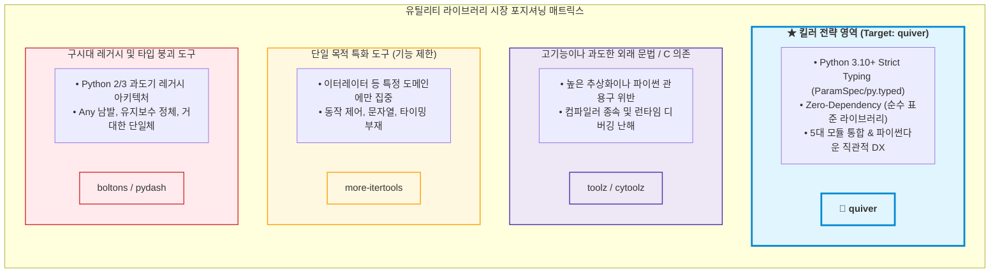
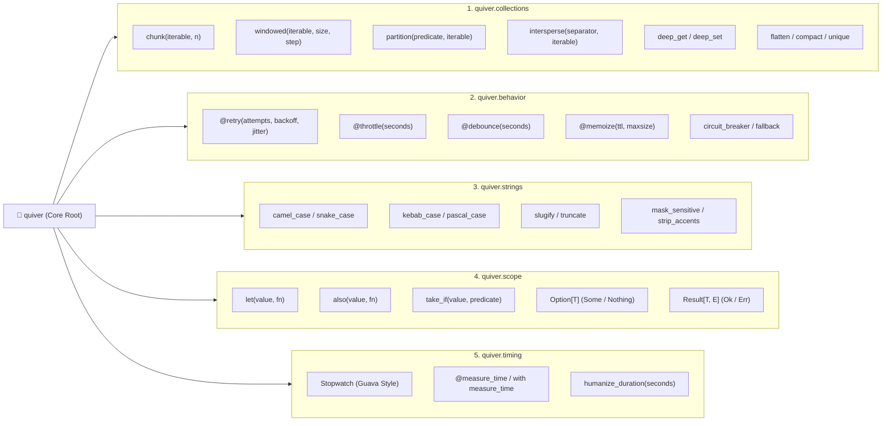

# [quiver] 모던 유틸리티 라이브러리 시장 및 언어별 레퍼런스 벤치마킹 분석 보고서

- **작성일자**: 2026-09-23
- **작성자**: 시니어 마켓 및 아키텍처 애널리스트 (`market-analyst`)
- **문서 버전**: v1.0
- **상태**: Approved

---

## 1. 분석 개요 및 목적 (Executive Summary)

- **분석 배경**:
  소프트웨어 개발에서 컬렉션 가공, 문자열 케이스 변환, 지수 백오프 기반 재시도, 스코프 제어, 정밀 실행 시간 측정과 같은 유틸리티 기능은 모든 도메인과 비즈니스 로직의 기저를 이루는 핵심 구성 요소입니다.
  타 언어 생태계는 JavaScript/TypeScript(`Lodash`, `Radash`), Kotlin(`Scope Functions`, `Collection Extensions`), Java(`Google Guava`, `Apache Commons`), Rust(`Option/Result`, `itertools`)처럼 정교하고 우아한 표준 준거 유틸리티가 정립되어 높은 개발자 생산성과 런타임 안정성을 보장하고 있습니다.
  
  반면, 현대 Python(3.10+) 생태계의 유틸리티 라이브러리 환경은 심각하게 파편화되어 있고 구시대적 유산에 머물러 있습니다:
  1. **타입 힌팅의 붕괴 (`Any` 오염 및 시그니처 소실)**: `pydash`, `boltons`, `toolz` 등 기존 라이브러리들은 Python 3.10+의 최신 타입 시스템(`ParamSpec`, `Concatenate`, `TypeVar`, `py.typed`)을 제대로 지원하지 못해 mypy/pyright에서 타입 검증이 무력화되고 IDE 자동완성이 단절됩니다.
  2. **과도한 함수형 순수주의(FP Dogmatism)로 인한 가독성 저하**: `toolz` 등은 Python의 직관적 문법을 무시하고 하스켈식 커링(`curry`)이나 파이프 연산자를 강제하여 디버깅 난이도를 높이고 코드 리뷰 비용을 가중시킵니다.
  3. **헤비한 의존성 및 C-Extension 빌드 리스크**: `cytoolz` 등 컴파일러 의존 패키지는 Docker Alpine 환경이나 ARM64/Apple Silicon 환경에서 빌드 실패를 유발하며, AWS Lambda/서버리스 환경에서 콜드스타트 지연을 초래합니다.
  4. **도메인별 파편화와 단편적 라이브러리 난립**: 이터레이터는 `more-itertools`, 문자열은 개별 구현, 시간 측정은 ad-hoc 코드, 재시도는 `tenacity`로 나뉘어 불필요하게 많은 서드파티 패키지를 의존성 목록에 추가해야 합니다.

- **핵심 목표**:
  JavaScript/TypeScript, Kotlin, Java, Rust의 대표 유틸리티 설계 철학과 개발자 경험(DX, Developer Ergonomics)을 심층 비교 분석하고, 기존 Python 라이브러리의 한계를 도출합니다. 이를 통해 **"외부 의존성 0(Zero-Dependency), 엄격한 Python 3.10+ 타입 세이프티, 5대 핵심 도메인(`collections`, `behavior`, `strings`, `scope`, `timing`) 통합을 제공하는 모던 유틸리티 툴킷 `quiver`"**의 킬러 차별화 전략과 제품 아키텍처 방향을 정립합니다.

---

## 2. 벤치마킹 대상 프로덕트 선정 (Benchmark Targets)

| 언어 / 생태계 | 라이브러리 / 도구 | 기업 / 생태계 포지션 | 주요 타깃 고객군 | 핵심 설계 철학 및 포지셔닝 |
| :--- | :--- | :--- | :--- | :--- |
| **JavaScript / TypeScript** | **Lodash & Radash** | 오픈소스 (John-David Dalton / Ray Epps) | 프론트엔드 / Node.js 풀스택 개발자 | **풍부한 조작성과 모던 TS 추론의 진화**<br/>- `Lodash`: JS 유틸리티의 사실상 표준. 객체 딥 패스 탐색(`get/set`), 함수 제어(`debounce/throttle`) 확립.<br/>- `Radash`: Lodash를 대체하는 모던 TS-First, Zero-Dependency, 강력한 제네릭 추론과 트리셰이킹 중심 설계. |
| **Kotlin** | **Kotlin Stdlib (Scope & Collections)** | JetBrains / 공식 표준 라이브러리 | 안드로이드, 서버사이드 코틀린 엔지니어 | **스코프 함수와 확장 함수 기반의 유려한 파이프라인**<br/>- `let`, `also`, `takeIf`를 통한 임시 변수 제거 및 널-세이프 체이닝.<br/>- `chunked`, `windowed`, `partition` 등 언어 네이티브 수준의 직관적 컬렉션 슬라이싱. |
| **Java** | **Google Guava & Apache Commons** | Google / Apache Software Foundation | 엔터프라이즈 백엔드 엔지니어 | **엄격한 프로덕션 내구성과 표준 결손 보완**<br/>- `CaseFormat`: 단어 경계 분석 기반의 완벽한 케이스 변환.<br/>- `Stopwatch`: 나노초 정밀도의 신뢰할 수 있는 벤치마크/지연시간 측정.<br/>- `CacheBuilder`: 만료 정책(TTL)과 크기 제한을 갖춘 인메모리 캐시. |
| **Rust** | **Rust Core & Itertools** | Rust Language Team / bluss | 시스템 엔지니어, 백엔드 고성능 개발자 | **Zero-Cost Abstraction & 대수적 타입 안정성**<br/>- `Option`/`Result`: Null 참조 원천 차단 및 모나딕 변환(`map`, `and_then`).<br/>- `itertools`: 이터레이터 조합(`partition`, `intersperse`, `dedup`)의 성능과 불변성 극대화. |
| **Python (기존)** | **toolz, boltons, more-itertools, pydash** | 오픈소스 커뮤니티 | 파이썬 데이터/웹 백엔드 개발자 | **파편화된 유산과 불완전한 타입 지원**<br/>- `more-itertools`: 우수한 이터레이터 도구이나 컬렉션 외 기능 전무.<br/>- `toolz/cytoolz`: 과도한 함수형 강박 및 C-빌드 오버헤드.<br/>- `boltons/pydash`: 낡은 아키텍처, 느린 속도, `Any` 남발로 모던 정적 타입 체커 지원 미비. |

---

## 3. 심층 기능 및 UX 비교 분석 (Feature & UX Comparison)

| 평가 항목 | JS/TS (Lodash / Radash) | Kotlin (Stdlib) | Java (Guava / Commons) | Rust (Itertools / Option) | Python 기존 (toolz, pydash 등) | quiver (차별화 목표) | 시사점 (Takeaways) |
| :--- | :--- | :--- | :--- | :--- | :--- | :--- | :--- |
| **정적 타입 지원 및 자동완성** | Lodash: 타입 정의 불완전<br/>Radash: 100% 완전 추론 | **최상 (컴파일러 레벨 타입 세이프티)** | **최상 (제네릭 기반 컴파일 타임 검증)** | **최상 (완전한 타입 추론 & 차용 검사)** | **최악 (Any 남발, ParamSpec 부재로 데코레이터 시그니처 소실)** | **최상 (Python 3.10+ Generic, ParamSpec, py.typed 100% 준수)** | 모던 Python 개발자에게 타입 힌트와 IDE 자동완성은 필수이며, Any 반환 라이브러리는 퇴출 대상임. |
| **외부 의존성 및 패키지 풋프린트** | Lodash: CJS/ESM 혼란<br/>Radash: 0-Dependency | **0 (언어 런타임 내장)** | Guava: 무거운 jar 종속성 | 0 (Cargo 기반 초경량 크레이트) | cytoolz: C-컴파일러 필수<br/>boltons: 방대하나 노후화 | **Zero-Dependency (순수 표준 라이브러리 100% 활용, 초경량)** | C-extension 빌드 실패, Alpine 리눅스 호환성 문제, 컨테이너 빌드 지연을 원천 제거해야 함. |
| **컬렉션 분할 및 슬라이딩 윈도우** | Lodash `chunk` 제공, 윈도우 지원 미흡 | **최상 (`chunked`, `windowed` 옵션 완벽)** | `Lists.partition` 기본 수준 | **최상 (`tuples_windows`, `chunks`)** | more-itertools는 우수하나 타 라이브러리는 미흡 | **최상 (`chunk`, `windowed`, `partition`, `intersperse` 내장)** | 슬라이딩 윈도우와 파티셔닝은 배치 처리 및 시계열 데이터 가공의 핵심 생산성 도구임. |
| **동작 제어 (Retry, Throttle, Cache)** | Radash `retry`, Lodash `debounce/throttle` 우수 | 코루틴 기반 별도 구현 필요 | Guava `RateLimiter`, `CacheBuilder` 강력 | 외부 크레이트 결합 | tenacity/cachetools 등 패키지 분산, 데코레이터 타이핑 깨짐 | **네이티브 데코레이터 (`retry` with backoff, `throttle`, `debounce`, TTL 캐시)** | 외부 의존성 설치 없이 복원력(Resilience)과 성능 제어 유틸리티를 즉시 쓸 수 있어야 함. |
| **스코프 제어 및 Null 처리** | Optional Chaining (`?.`) 및 Nullish (`??`) | **최상 (`let`, `also`, `takeIf` 스코프 체이닝)** | `Optional` (다소 장황함) | **최상 (`Option`/`Result` 모나딕 컴비네이터)** | `if x is not None` 및 중첩 `getattr` 도배 | **Kotlin 스타일 스코프 (`let`, `also`, `take_if`) + Option/Result 지원** | 가독성을 해치는 임시 변수와 방어적 if-문 지옥을 선언적 파이프라인으로 전환해야 함. |
| **문자열 케이스 정규화** | Lodash: `camelCase`, `kebabCase` 등 | 확장 함수로 유연하게 처리 | **Guava `CaseFormat` (가장 엄격한 단어 분리)** | 외부 크레이트 의존 | 정규식 기반 단순 치환으로 엣지케이스 오작동 다수 | **Guava 수준 정밀 단어 경계 감지 (`camel`, `snake`, `kebab`, `pascal`)** | 약어(URL, HTTP, ID)가 섞인 복잡한 문자열도 깨지지 않는 완벽한 케이스 변환기 필요. |
| **정밀 시간 측정 (Stopwatch)** | `console.time` 원시적 수준 | `measureTimeMillis` 인라인 블록 | **Guava `Stopwatch` (시작/경과/포맷 완벽)** | `std::time::Instant` | 수동 `time.perf_counter()` 차이 계산 반복 | **Guava형 `Stopwatch` + `measure_time` 컨텍스트 매니저/데코레이터** | 마이크로 벤치마크 및 비즈니스 로직 레이턴시 로깅을 한 줄로 처리할 수 있어야 함. |

---

## 4. 사용자 선호 요인 분석 (Best UX & Killer Features)

### 1. JavaScript/TypeScript: Radash의 "TypeScript-First & Zero-Dependency"
- **개발자 심리 및 현장 긍정 반응**:
  - *"Lodash는 쓸 때마다 `@types/lodash`를 깔아야 하고 어떤 함수는 `any`를 뱉어서 타입 체커가 꺼지는 기분이었습니다. Radash로 넘어온 뒤로는 모든 함수가 제네릭 인자를 그대로 유지하고, 별도 설치 없이 번들 크기도 0에 수렴해서 너무 만족스럽습니다."*
- **성공 요인 및 DX 가치**:
  - **정적 타입 완전 보존**: `get<T>`, `pick<T, K>`, `omit<T, K>` 등에서 유실 없는 반환 타입 추론.
  - **불필요한 레거시 걷어내기**: ES6+ 현대 런타임을 전제로 하여 코드베이스가 간결하고 디버깅이 명확함.
  - **비동기/복원력 함수 내장**: `retry(3, async () => ...)`, `sleep`, `throttle` 등 실무에서 가장 빈번히 쓰이는 제어 함수 통합.

### 2. Kotlin: "스코프 함수(`let`, `also`, `takeIf`)와 컬렉션 윈도잉"
- **개발자 심리 및 현장 긍정 반응**:
  - *"데이터를 가져와서 널 체크하고 가공한 뒤 로깅하는 코드를 짤 때, Kotlin의 `?.let { transform(it) }?.also { logger.info(it) }` 흐름은 임시 변수를 단 하나도 만들지 않고 시선이 위에서 아래로 매끄럽게 흐릅니다."*
  - *"데이터 1000개를 100개씩 나눠서 API를 쏠 때 `list.chunked(100)` 한 줄이면 끝납니다. 파이썬에서 `[list[i:i+n] for i in range(...)]`를 작성할 때마다 인덱스 실수를 걱정하던 스트레스가 사라졌습니다."*
- **성공 요인 및 DX 가치**:
  - **임시 변수(Temporary Variables) 배제**: 컨텍스트 객체를 람다 인자(`it`)로 전달하여 네임스페이스 오염 방지.
  - **부수 효과(Side-Effects) 격리**: `also`를 통해 원래 객체 흐름을 끊지 않고 로깅/검증을 우아하게 결합.
  - **조건부 필터링(`takeIf`)**: 조건을 만족할 때만 값을 남기고 아니면 `null`로 흘려보내는 일관된 표현력.
  - **풍부한 컬렉션 연산자**: `chunked`, `windowed(size, step, partialWindows)`로 복잡한 슬라이딩 알고리즘의 즉시 구현.

### 3. Java: Google Guava의 "엄격한 신뢰성(`CaseFormat`, `Stopwatch`, TTL 캐시)"
- **개발자 심리 및 현장 긍정 반응**:
  - *"문자열을 snake_case에서 camelCase로 바꿀 때 대충 정규식으로 짜면 `HTTPResponseCode` 같은 약어나 특수문자가 섞인 경우 엉망이 됩니다. Guava의 `CaseFormat.UPPER_UNDERSCORE.to(CaseFormat.LOWER_CAMEL, str)`는 단 한 번도 버그를 낸 적이 없습니다."*
  - *"시간 측정을 할 때 `System.currentTimeMillis()`로 뺄셈을 하다 보면 단위 실수(초 vs 밀리초)나 음수 레이턴시 버그가 생기는데, Guava `Stopwatch`는 `stopwatch.elapsed(TimeUnit.MILLISECONDS)`로 명확하게 표현되어 코드 리뷰가 편안합니다."*
- **성공 요인 및 DX 가치**:
  - **단어 경계(Word Boundary) 엄격성**: 대소문자 전이, 언더스코어, 하이픈의 문맥을 분석하여 무결점 케이스 변환.
  - **타이밍 캡슐화**: 상태(Running, Stopped)를 추적하고 사람이 읽기 좋은 포맷(예: `125 ms`, `1.2 s`)으로 자동 렌더링.
  - **인메모리 캐시 규격화**: 복잡한 캐시 라이브러리 없이도 시간 기반 만료(Expire After Write)를 내장.

### 4. Rust: Option/Result 모나딕 처리와 Itertools
- **개발자 심리 및 현장 긍정 반응**:
  - *"Rust를 쓰면서 가장 좋은 점은 `None`이 발생할 수 있는 위치가 명확하고, `.map()`, `.and_then()`, `.unwrap_or()`로 안전하게 체이닝할 수 있어 런타임 크래시가 원천 봉쇄된다는 것입니다."*
  - *"Itertools의 `intersperse`나 `partition`은 시각화 UI나 쿼리 빌더를 만들 때 콤마나 구분자를 삽입하거나 참/거짓 그룹을 단 한 번의 순회로 가를 때 타의 추종을 불허하는 편리함을 줍니다."*
- **성공 요인 및 DX 가치**:
  - **Null Pointer 원천 제거**: 값의 부재를 타입 시스템 차원에서 강제하여 방어적 `if` 중첩을 제거.
  - **단일 순회 분할(`partition`)**: `filter`를 두 번 돌리지 않고 참과 거짓 집합을 동시에 추출.

---

## 5. 사용자 불호 및 페인포인트 분석 (Pain Points & Pitfalls)

### 1. 불호 요인 1: 낡은 타이핑 시스템과 IDE 자동완성 붕괴 (pydash, boltons)
- **개발자 불만 및 현장 부정 리뷰**:
  - *"VS Code에서 `pydash.get(user_dict, 'profile.name')`을 쓰면 반환 타입이 무조건 `Any`로 나옵니다. Pylance나 mypy가 이후 코드의 메서드를 전혀 검사하지 못해서 타입 안전성을 위해 유틸리티를 걷어내고 직접 코드를 짜야 했습니다."*
  - *"커스텀 데코레이터나 유틸리티 함수로 비즈니스 함수를 감싸면 파라미터 힌트가 싹 사라져서 인자 이름 자동완성이 작동하지 않습니다. `ParamSpec`을 제대로 적용한 유틸리티 라이브러리가 파이썬에는 왜 없나요?"*
- **`quiver`의 해결 방안 (Typing-First Architecture)**:
  - PEP 561 `py.typed` 마커를 패키지 루트에 배치.
  - `typing.ParamSpec`과 `typing.Concatenate`를 전면 도입하여 `@retry`, `@throttle`, `@measure_time` 등 모든 데코레이터가 원본 함수의 시그니처, 키워드 인자, 반환 타입을 100% 보존.
  - 모든 컬렉션/이터레이터 함수에 `TypeVar` 제네릭을 완벽 적용하여 mypy/pyright의 'Strict' 모드를 완벽 통과.

### 2. 불호 요인 2: 과도한 순수함수형(FP) 강박과 비파이썬적(Unpythonic) 외래 문법
- **개발자 불만 및 현장 부정 리뷰**:
  - *"팀원이 `toolz`의 `curry`와 `pipe`로 코드를 도배해 놨는데, 파이썬 표준 라이브러리 관용구와 완전히 동떨어져 있어 다른 개발자들이 읽지를 못합니다. 에러가 나면 호출 스택 추적이 불가능할 정도로 깊은 내부 래퍼 함수들이 찍혀서 디버깅에 3배의 시간이 걸립니다."*
- **`quiver`의 해결 방안 (Pythonic Ergonomics)**:
  - 억지스러운 하스켈식 커링이나 독자적인 파이프 연산자를 강제하지 않음.
  - 파이썬 개발자에게 가장 익숙한 **"명확하고 독립적인 함수 호출"**과 **"직관적인 데코레이터/컨텍스트 매니저"** 중심의 설계.
  - 내부 구현에서 예외 스택 트레이스를 보존(`from e`)하고 표준 네이밍 컨벤션 준수.

### 3. 불호 요인 3: C-Extension 빌드 리스크 및 컨테이너 배포 오버헤드
- **개발자 불만 및 현장 부정 리뷰**:
  - *"속도 좀 빠르게 해보겠다고 `cytoolz`를 `requirements.txt`에 넣었다가, Docker `python:3.11-alpine` 이미지 빌드할 때 `gcc`, `musl-dev`가 없어서 빌드가 터졌습니다. 배포 이미지 용량도 커지고 M1/M2 맥북과 x86_64 배포 서버 간 휠 호환성 문제로 고생했습니다."*
- **`quiver`의 해결 방안 (Pure Python & Zero-Dependency)**:
  - 단 1개의 외부 서드파티 패키지나 C-Extension도 요구하지 않는 **100% Pure Standard Library** 구현.
  - 파이썬 내장 `itertools`, `collections`, `functools`, `time`, `re`의 최적화된 내부 C-API(파이썬 런타임 내장)를 극대화 활용.
  - Alpine, Windows, macOS, ARM64, WASM 등 모든 환경에서 `pip install quiver` 즉시 빌드 과정 없이 0.1초 만에 설치 및 동작 보장.

### 4. 불호 요인 4: 모듈 파편화로 인한 의존성 인플레이션
- **개발자 불만 및 현장 부정 리뷰**:
  - *"이터레이터 분할하려고 `more-itertools` 깔고, 재시도 걸려고 `tenacity` 깔고, 텍스트 변환하려고 `inflection` 깔고, 시간 측정하려고 직접 유틸 함수 만듭니다. 작은 마이크로서비스 하나 띄우는데 유틸리티 관련 의존성만 6개가 넘어가고 버전 충돌 날까 봐 무섭습니다."*
- **`quiver`의 해결 방안 (5대 핵심 도메인 통합 툴킷)**:
  - 백엔드/데이터 개발에서 매일 반복적으로 쓰이는 5대 영역(`collections`, `behavior`, `strings`, `scope`, `timing`)을 단일 패키지로 통합.
  - 각 모듈은 완전히 독립적이며 경량화되어 필요한 함수만 개별 임포트(`from quiver.collections import chunk`)하여 사용 가능.

### 5. 불호 요인 5: `None` 처리 지옥과 방어적 `if` 문의 코드 도배
- **개발자 불만 및 현장 부정 리뷰**:
  - *"중첩 딕셔너리나 객체에서 값을 꺼낼 때 `if a and a.b and a.b.c:` 형태로 4단 if 문을 치거나 `getattr(getattr(a, 'b', None), 'c', None)`을 쓰는 게 너무 지저분합니다. 코틀린의 safe-call이나 체이닝을 파이썬에서도 깔끔하게 쓸 수 없을까요?"*
- **`quiver`의 해결 방안 (Scope Functions & Safe Accessors)**:
  - Kotlin 스타일의 `let(value, fn)`, `also(value, fn)`, `take_if(value, predicate)`를 제공하여 값의 변환과 부수효과를 한 줄로 선언.
  - 중첩 딕셔너리/객체 안전 탐색을 위한 `deep_get(target, "user.profile.address.city", default=None)` 내장.
  - Rust 스타일의 경량 `Option[T]`(`Some`, `Nothing`) 모나드 래퍼를 제공하여 `.map()`, `.unwrap_or()` 체이닝 지원.

---

## 6. 프로덕트 차별화 기회 영역 (Opportunity Gap & Strategy)

### 1. 경쟁 라이브러리 대비 포지셔닝 분석



| 포지셔닝 비교 축 | quiver (목표) | toolz / cytoolz | more-itertools | boltons / pydash |
| :--- | :--- | :--- | :--- | :--- |
| **타입 안정성 (Type Safety)** | **100% (ParamSpec, py.typed)** | 30% (Any 다수, stubs 분리) | 85% (타입 힌트 제공) | 20% (Any 범벅, 타이핑 누락) |
| **외부 의존성 (Dependencies)** | **0 (Zero-Dependency)** | C-컴파일러 / C-Extension | 0 (순수 파이썬) | 0 (순수 파이썬) |
| **모듈 완결성 (Scope Coverage)** | **5대 도메인 올인원** | 함수형 중심 일부 도메인 | 이터레이터 단일 도메인 | 방대하나 파편화됨 |
| **파이썬 관용성 (Pythonic DX)** | **최상 (네이티브 감각)** | 낮음 (Haskell식 커링) | 높음 (표준 itertools 감각) | 보통 (JS Lodash 이식형) |

---

### 2. `quiver` 5대 핵심 모듈 아키텍처 및 킬러 기능 설계



---

### 3. 모듈별 킬러 기능 상세 및 코드 수준 차별화 전략

#### (1) `quiver.collections`: 직관적이고 강력한 불변 데이터 파이프라인
- **기존 고통**: 배치 API 호출 시 100개씩 청크를 나누려면 인덱스 슬라이싱 코드를 매번 복사해 쓰거나, 시계열 슬라이딩 윈도우 계산 시 경계 조건 버그가 빈번함.
- **quiver 솔루션**:
  ```python
  from quiver.collections import chunk, windowed, partition, intersperse, deep_get

  # 1. 배치 청킹 (메모리 제너레이터 기반)
  for batch in chunk([1, 2, 3, 4, 5], n=2):
      print(batch)  # [1, 2], [3, 4], [5]

  # 2. 슬라이딩 윈도우
  windows = list(windowed([1, 2, 3, 4], size=3, step=1))
  # [[1, 2, 3], [2, 3, 4]]

  # 3. 단일 순회 조건 분할 (참 그룹과 거짓 그룹을 1패스로 분리)
  evens, odds = partition(lambda x: x % 2 == 0, [1, 2, 3, 4, 5])
  # evens: [2, 4], odds: [1, 3, 5]

  # 4. 안전한 중첩 딕셔너리 탐색
  user_city = deep_get(payload, "data.user.address.city", default="Seoul")
  ```

#### (2) `quiver.behavior`: ParamSpec 기반의 완벽한 함수 실행 제어 (Zero-Leakage Decorators)
- **기존 고통**: `@retry`나 `@throttle` 데코레이터를 적용하면 함수의 반환 타입이 `Any`가 되고 IDE 파라미터 팝업 힌트가 사라져 개발 생산성 추락.
- **quiver 솔루션**:
  ```python
  from quiver.behavior import retry, throttle, debounce, memoize

  # ParamSpec 완벽 지원: fetch_order의 시그니처 (order_id: str) -> OrderDto 가 100% 보존됨
  @retry(max_attempts=3, backoff_factor=1.5, exceptions=(TimeoutError, ConnectionError))
  def fetch_order(order_id: str) -> OrderDto:
      ...

  # TTL(Time-To-Live) 기반 캐싱 (기본 라이브러리 functools.lru_cache의 시간 만료 부재 해결)
  @memoize(ttl_seconds=300, maxsize=1024)
  def get_exchange_rate(currency: str) -> float:
      ...
  ```

#### (3) `quiver.strings`: Guava 수준의 단어 경계 감지 케이스 변환기
- **기존 고통**: 단순 regex `replace`는 `HTMLParser`, `user_id_v2`, `getHTTPResponse` 같은 약어와 특수 케이스에서 단어를 쪼개지 못하고 망가뜨림.
- **quiver 솔루션**:
  ```python
  from quiver.strings import camel_case, snake_case, kebab_case, pascal_case

  snake_case("JSONWebToken")      # "json_web_token"
  camel_case("user_first_name")   # "userFirstName"
  kebab_case("PaymentGatewayV2")  # "payment-gateway-v2"
  pascal_case("get_http_code")    # "GetHttpCode"
  ```

#### (4) `quiver.scope`: Kotlin & Rust 철학을 계승한 선언적 스코프 파이프라인
- **기존 고통**: 중간 변수를 계속 만들거나 `if x is not None:`으로 들여쓰기 깊이가 3~4단계로 깊어짐.
- **quiver 솔루션**:
  ```python
  from quiver.scope import let, also, take_if

  # 1. let: 변환 및 임시 변수 제거
  result = let(fetch_raw_token(), lambda token: token.strip().upper())

  # 2. also: 체인 중간에 부수 효과(로깅, 이벤트 발송) 삽입 후 원본 반환
  user = also(create_user(dto), lambda u: logger.info(f"User created: {u.id}"))

  # 3. take_if: 조건부 통과 (조건 미달 시 None)
  valid_discount = take_if(discount_rate, lambda r: 0.0 < r <= 0.5)
  ```

#### (5) `quiver.timing`: 정밀 시간 측정 및 가독성 높은 관측성
- **기존 고통**: 성능 로깅마다 `t0 = time.perf_counter()`, `elapsed = (time.perf_counter() - t0) * 1000`을 복붙하여 실수 발생.
- **quiver 솔루션**:
  ```python
  from quiver.timing import Stopwatch, measure_time

  # 1. Guava 스타일 정밀 Stopwatch
  sw = Stopwatch.start_new()
  heavy_computation()
  sw.stop()
  print(sw.elapsed_ms)    # 142.5
  print(sw.humanize())    # "142.5ms" (또는 "2.3s")

  # 2. 컨텍스트 매니저 및 데코레이터
  with measure_time(name="Database Query", threshold_ms=100.0) as timer:
      execute_heavy_query()
  # 100ms 초과 시 자동 경고 로그 출력: "[Database Query] execution time 185.2ms exceeded threshold 100.0ms"
  ```

---

## 7. 결론 및 로드맵 제언 (Summary & Next Steps)

1. **포지셔닝 확립**:
   - `quiver`는 기존 파이썬 유틸리티 생태계의 3대 결손(타입 붕괴, 불필요한 C-의존성/의존성 비대화, 비파이썬적 난해한 문법)을 정면으로 타격합니다.
   - **"모던 파이썬을 위한 제로 의존성 정밀 유틸리티(The Zero-Dependency Precision Toolkit for Modern Python 3.10+)"**로서의 독점적 틈새를 확보합니다.

2. **패키지 패키징 및 품질 기준**:
   - Python 3.10, 3.11, 3.12, 3.13을 지원하며, mypy strict 모드 및 pyright에서 0 warning 달성.
   - 단위 테스트 커버리지 100%를 목표로 하며 모든 기능에 대한 doctest 및 벤치마크 제공.
   - 패키지 크기는 수십 KB 미만의 초경량 순수 파이썬 휠로 배포.

3. **엔지니어링 팀 인계 사항**:
   - `spec-writer` 및 `system-designer`는 상기 정의된 5대 모듈(`collections`, `behavior`, `strings`, `scope`, `timing`)의 공개 API 명세를 확정하고, `ParamSpec`과 `TypeVar` 제네릭 인터페이스 설계를 우선적으로 진행해야 합니다.
