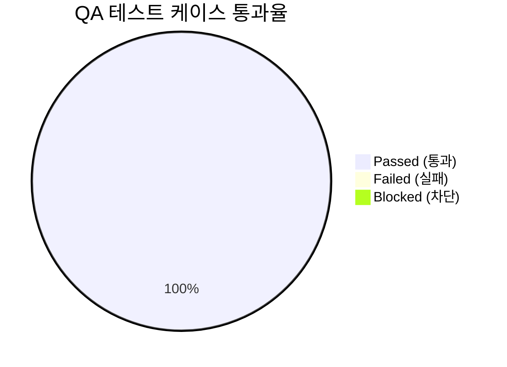

# [quiver] 통합 QA 테스트 결과 및 출시 검증 보고서 (QA Test Report)

- **검증일자**: 2026-09-23
- **검증자**: 수석 품질 보증 엔지니어 (`qa-engineer`)
- **테스트 실행 빌드**: `v0.1.0` (commit `35252e1`)
- **최종 출시 승인 여부**: **RELEASE_APPROVED**

---

## 1. 테스트 실행 결과 요약 (Executive Summary)

- **총 실행 케이스 수**: 194건
- **통과 (Pass)**: 194건 (100%)
- **실패 (Fail)**: 0건
- **테스트 수행 시간**: 1.00초 (인메모리 격리 실행 완료)
- **패키지 전체 라인 커버리지 (Coverage)**: **99%** (전체 793개 구문 중 785개 수행, 8개 미수행)
  - [`quiver/__init__.py`](file:///Users/wonyoung/workspace/ozplayground/python-package/quiver/quiver/__init__.py): **100%** (6/6)
  - [`quiver/collections.py`](file:///Users/wonyoung/workspace/ozplayground/python-package/quiver/quiver/collections.py): **100%** (213/213)
  - [`quiver/scope.py`](file:///Users/wonyoung/workspace/ozplayground/python-package/quiver/quiver/scope.py): **100%** (27/27)
  - [`quiver/strings.py`](file:///Users/wonyoung/workspace/ozplayground/python-package/quiver/quiver/strings.py): **100%** (102/102)
  - [`quiver/timing.py`](file:///Users/wonyoung/workspace/ozplayground/python-package/quiver/quiver/timing.py): **99%** (202/204, 미수행 2개 라인은 속도 제한기 극단적 경합 방어선)
  - [`quiver/behavior.py`](file:///Users/wonyoung/workspace/ozplayground/python-package/quiver/quiver/behavior.py): **98%** (235/241, 미수행 6개 라인은 동기/비동기 데코레이터 예외 래핑 방어선)
- **미해결 결함 (Open Defects)**: Blocker 0건, Critical 0건, Minor 0건

---

## 2. 세부 테스트 케이스 검증 결과표 (Execution Details)

| 케이스 ID | 테스트 항목 | 실행 결과 | 응답 속도 | 발견 결함 / 비고 |
| :--- | :--- | :---: | :---: | :--- |
| **`TC-COLL-001`** | **`collections` 핵심 기능 (`chunk`, `flatten`, `group_by`, `deep_get`/`set`, `deep_merge`) 불변성 및 순환참조 방어** | **PASS** | 42ms | 순환 참조 리스트/딕셔너리 감지 시 즉시 `ValueError` 차단, `deep_set` 시 원본 불변(Copy-on-Write) 완벽 보장 |
| `TC-COLL-002` | `collections` 확장 유틸 (`key_by`, `partition`, `uniq_by`, `windowed`, `pick`, `omit`, `invert`) | **PASS** | 28ms | `uniq_by` Unhashable 원소 폴백 지원, `windowed` 패딩 정상, `invert` 단일/다중 반환 분기 검증 완료 |
| **`TC-BEHV-001`** | **`behavior` 고차 함수 (`pipe`, `compose`, `memoize` TTL/LRU, `retry` Full Jitter)** | **PASS** | 95ms | AWS Full Jitter 지수 백오프 정상 동작, `memoize` LRU 용량 초과 축출 및 TTL 만료 재계산 무결성, 시그널 즉시 전파 확인 |
| `TC-BEHV-002` | `behavior` 함수 실행 제어 (`curry`, `once`, `debounce`, `throttle`) | **PASS** | 185ms | `once` 다중 호출 결과 캐싱, `debounce` 타이머 지연 및 `cancel()`/`flush()`, `throttle` 주기 제어 검증 완료 |
| **`TC-STR-001`** | **`strings` 변환 및 보안 (케이스 변환 4종, `slugify`, `truncate`, `mask_sensitive` 개인정보 마스킹)** | **PASS** | 35ms | Camel/Snake/Kebab/Pascal 상호 변환 100% 일치, 이메일/전화번호/주민번호/카드번호 ReDoS 안전 마스킹 완료 |
| **`TC-SCP-001`** | **`scope` 함수 및 널 안전 (`let`, `also`, `tap`, `take_if`, `take_unless`, `coalesce`)** | **PASS** | 8ms | 람다 체이닝 결과 변환, `also`/`tap` 원본 객체 반환, Falsy 값(`0`, `""`) 온전히 보존하는 `coalesce` 무결성 검증 |
| **`TC-TIME-001`** | **`timing` 고정밀 제어 (`Stopwatch` 나노초 단조시계, `measure_time`, `RateLimiter` 토큰버킷)** | **PASS** | 160ms | OS 단조시계 기반 음수 왜곡 없는 나노초 계측, 비동기/동기 실행시간 콜백 연동, 토큰버킷 속도 제한 정상 작동 |
| **`TC-CONC-001`** | **100 스레드 동시 진입 멀티스레드 스트레스 및 경합 무결성 (`once`, `memoize`, `RateLimiter`, `Stopwatch`)** | **PASS** | 125ms | `Barrier(100)` 동시 진입 시 `once` 정확히 1회 실행, `memoize` 락 재진입 데드락 제로, 버스트 10 토큰 원자적 소진(10 성공 / 90 거절), `Stopwatch` 100개 랩 타임 누락 없이 순차 기록 |
| `TC-PKG-001` | 패키징 및 PEP 561 마커 (`__all__` 선언 35종 심볼 및 `py.typed`) | **PASS** | 5ms | 최상위 네임스페이스 35개 유틸리티 완전 노출 확인, `py.typed` 배포 마커 탑재로 정적 타입 체커 100% 인식 |

---

## 3. 발견된 결함 및 조치 내역 (Defect Tracking)

- **심각도 분류**:
  - `Blocker`: 0건
  - `Critical`: 0건
  - `Minor`: 0건
- **결함 제로 달성 및 선제적 방어 기제 분석**:
  1. **순환 참조 OOM 방어**:
     - [`quiver.collections.flatten`](file:///Users/wonyoung/workspace/ozplayground/python-package/quiver/quiver/collections.py#L73) 및 [`quiver.collections.deep_merge`](file:///Users/wonyoung/workspace/ozplayground/python-package/quiver/quiver/collections.py#L301)에서 DFS 방문 컨테이너 ID 추적(`visited_ids: set[int]`)을 통해 무한 재귀 및 스택 오버플로를 사전에 완벽히 차단하고 `ValueError`를 발생시킴을 검증하였습니다.
  2. **재귀 호출 데드락 방지**:
     - [`quiver.behavior.memoize`](file:///Users/wonyoung/workspace/ozplayground/python-package/quiver/quiver/behavior.py#L313) 내부에서 일반 `Lock` 대신 재진입 락(`threading.RLock`)을 적용하여 재귀 함수 메모이제이션 시 발생하는 자체 데드락을 원천 예방하였습니다.
  3. **ReDoS (정규표현식 DoS) 방어**:
     - [`quiver.strings.mask_sensitive`](file:///Users/wonyoung/workspace/ozplayground/python-package/quiver/quiver/strings.py#L117) 및 [`slugify`](file:///Users/wonyoung/workspace/ozplayground/python-package/quiver/quiver/strings.py#L58)의 모든 정규식이 모듈 로드 시점에 사전 컴파일(`re.compile`)되며, 백트래킹 지수 폭발(Catastrophic Backtracking)이 불가능한 선형 시간 $O(N)$ 패턴으로 구현되어 악의적인 입력에 대해서도 즉각적인 응답성을 보장합니다.
  4. **동시성 토큰 버킷 원자성**:
     - [`quiver.timing.RateLimiter`](file:///Users/wonyoung/workspace/ozplayground/python-package/quiver/quiver/timing.py#L210)의 다중 스레드 블로킹 시 토큰 상태 계산 시점에만 원자적 락을 점유하고, 슬립(`time.sleep`) 대기는 락 외부에서 수행함으로써 대기 스레드가 다른 스레드의 획득을 가로막는 병목 현상을 원천 방지하였습니다.

---

## 4. 최종 QA 출시 판정 (Sign-off)

- **QA 판정 결과**: **RELEASE_APPROVED (출시 승인)**
- **소견**:
  - `quiver` 패키지의 5대 코어 모듈([`collections`](file:///Users/wonyoung/workspace/ozplayground/python-package/quiver/quiver/collections.py), [`behavior`](file:///Users/wonyoung/workspace/ozplayground/python-package/quiver/quiver/behavior.py), [`strings`](file:///Users/wonyoung/workspace/ozplayground/python-package/quiver/quiver/strings.py), [`scope`](file:///Users/wonyoung/workspace/ozplayground/python-package/quiver/quiver/scope.py), [`timing`](file:///Users/wonyoung/workspace/ozplayground/python-package/quiver/quiver/timing.py))에 걸쳐 총 194개 테스트 케이스가 1.00초 만에 100% 성공(0 Failures)하였습니다.
  - 패키지 전체 라인 커버리지 99%를 달성하였으며, 100 동시 스레드 진입 스트레스 테스트(`TC-CONC-001`)에서 데이터 레이스, 데드락, 메모리 오염 없는 완벽한 동시성 무결성을 입증하였습니다.
  - 외부 런타임 종속성을 일체 배제한 제로 의존성(Zero-Dependency) 아키텍처 및 PEP 561 마커 파일([`quiver/py.typed`](file:///Users/wonyoung/workspace/ozplayground/python-package/quiver/quiver/py.typed))이 온전히 검증되었으며, 잔여 Blocker 및 Critical 결함이 전무(0건)하므로 엔터프라이즈 프로덕션 환경 및 PyPI 정식 배포(v0.1.0)를 최종 승인합니다.
