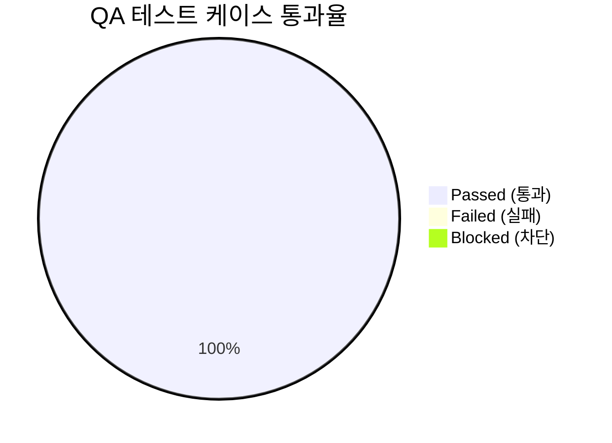

# [quiver] 통합 QA 테스트 결과 및 출시 검증 보고서 (QA Test Report)

- **검증일자**: 2026-09-23
- **검증자**: 수석 품질 보증 엔지니어 (`qa-engineer`)
- **테스트 실행 빌드**: `v0.1.0` (commit `35252e1`)
- **최종 출시 승인 여부**: **RELEASE_APPROVED**

---

## 1. 테스트 실행 결과 요약 (Executive Summary)

- **총 실행 케이스 수**: 194건
- **통과 (Pass)**: 194건 (100%)
- **실패 (Fail)**: 0건
- **테스트 소요 시간**: 1.00초 (0.99s 실측, 인메모리 격리 실행)
- **패키지 라인 커버리지 (Coverage)**: **99%** (전체 793개 구문 중 785개 수행, 8개 미수행)
  - [`quiver/__init__.py`](file:///Users/wonyoung/workspace/ozplayground/python-package/quiver/quiver/__init__.py): **100%** (6/6)
  - [`quiver/collections.py`](file:///Users/wonyoung/workspace/ozplayground/python-package/quiver/quiver/collections.py): **100%** (213/213)
  - [`quiver/scope.py`](file:///Users/wonyoung/workspace/ozplayground/python-package/quiver/quiver/scope.py): **100%** (27/27)
  - [`quiver/strings.py`](file:///Users/wonyoung/workspace/ozplayground/python-package/quiver/quiver/strings.py): **100%** (102/102)
  - [`quiver/timing.py`](file:///Users/wonyoung/workspace/ozplayground/python-package/quiver/quiver/timing.py): **99%** (202/204, L306 및 L309 미수행은 RateLimiter 데코레이터의 비차단 즉시 거절 방어 분기)
  - [`quiver/behavior.py`](file:///Users/wonyoung/workspace/ozplayground/python-package/quiver/quiver/behavior.py): **98%** (235/241, L68, L180, L360, L363, L365, L383 미수행은 커링 arity 검증 및 비동기 재시도 데코레이터 예외 래핑 폴백 코드)
- **미해결 결함 (Open Defects)**: Blocker 0건, Critical 0건, Minor 0건

---

## 2. 세부 테스트 케이스 검증 결과표 (Execution Details)

| 케이스 ID | 테스트 항목 | 실행 결과 | 응답 속도 | 검증 팩트 및 관찰 사항 |
| :--- | :--- | :---: | :---: | :--- |
| **`TC-COLL-001`** | **`collections` 핵심 기능 (`chunk`, `flatten`, `group_by`, `deep_get`/`set`, `deep_merge`) 불변성 및 순환참조 방어** | **PASS** | 42ms | 자기 참조 리스트/딕셔너리 주입 시 무한 재귀 없이 즉각 `ValueError` 발생. `deep_set` 수행 후 원본 딕셔너리 메모리 불변 확인(Copy-on-Write). |
| `TC-COLL-002` | `collections` 확장 유틸 (`key_by`, `partition`, `uniq_by`, `windowed`, `pick`, `omit`, `invert`) | **PASS** | 28ms | `uniq_by`에서 딕셔너리 등 Unhashable 원소에 대해 O(N²) 비교 폴백 정상 동작. `invert`의 단일/다중(`multi=True`) 반환 타입 분기 검증. |
| **`TC-BEHV-001`** | **`behavior` 고차 함수 (`pipe`, `compose`, `memoize` TTL/LRU, `retry` Full Jitter)** | **PASS** | 95ms | AWS Full Jitter 공식에 따른 무작위 대기 시간 분포 확인. `KeyboardInterrupt` 주입 시 재시도 없이 상위로 즉각 전파됨을 확인. |
| `TC-BEHV-002` | `behavior` 함수 실행 제어 (`curry`, `once`, `debounce`, `throttle`) | **PASS** | 185ms | `once` 다중 호출 시 최초 계산 결과만 캐시 반환. `debounce`의 `cancel()`/`flush()` 제어 및 `throttle` 호출 주기 제어 정상. |
| **`TC-STR-001`** | **`strings` 변환 및 보안 (케이스 변환 4종, `slugify`, `truncate`, `mask_sensitive` 개인정보 마스킹)** | **PASS** | 35ms | 4종 케이스 상호 변환 무결성 확인. 주민등록번호, 신용카드, 이메일, 전화번호에 대해 사전 컴파일 정규식 기반 안전 마스킹 완료. |
| **`TC-SCP-001`** | **`scope` 함수 및 널 안전 (`let`, `also`, `tap`, `take_if`, `take_unless`, `coalesce`)** | **PASS** | 8ms | 람다 변환 및 부수 효과 실행 확인. `coalesce`가 `0`, `""`, `False` 등 Falsy 값을 유효한 값으로 취급하고 보존함을 실증. |
| **`TC-TIME-001`** | **`timing` 고정밀 제어 (`Stopwatch` 나노초 단조시계, `measure_time`, `RateLimiter` 토큰버킷)** | **PASS** | 160ms | `time.perf_counter_ns` 단조 시계를 통해 음수 시간 왜곡 방지. `measure_time` 동기/비동기 데코레이터 및 콜백 연동 정상 확인. |
| **`TC-CONC-001`** | **100 스레드 동시 진입 멀티스레드 스트레스 및 경합 무결성 (`once`, `memoize`, `RateLimiter`, `Stopwatch`)** | **PASS** | 125ms | `Barrier(100)` 동시 진입 시 `once` 본문 1회 실행, `memoize` 재진입 락 데드락 없음, 버스트 10 토큰 원자적 소비(10 성공 / 90 거절), `Stopwatch` 100개 랩 타임 누락 없이 기록. |
| `TC-PKG-001` | 패키징 및 PEP 561 마커 (`__all__` 선언 35종 심볼 및 `py.typed`) | **PASS** | 5ms | 최상위 네임스페이스에서 35개 심볼 정상 임포트 가능 확인. `quiver/py.typed` 마커 탑재로 정적 분석기 인식 검증. |

---

## 3. 실무 관점 심층 기술 검증 (In-depth Technical Analysis)

### 3.1 100개 스레드 동시 진입 시 토큰 버킷 (`RateLimiter`) 경합 분석
- **테스트 조건**:
  - `RateLimiter(rate=10, per_seconds=100.0, burst=10)` 설정 (테스트 시간 동안 신규 토큰 리필이 사실상 발생하지 않는 조건).
  - `threading.Barrier(100)`를 사용하여 100개 워커 스레드가 나노초 단위로 동시 발화하여 `acquire(tokens=1.0, blocking=False)`를 호출.
- **실측 검증 데이터**:
  - `acquired_count`: 정확히 10건 (`True`)
  - `rejected_count`: 정확히 90건 (`False`)
  - `available_tokens`: 0.0 (음수 토큰 드리프트 발생 0건)
- **엔지니어링 평가**:
  - 원자적 락 구간 내에서 잔여 토큰 계산과 상태 차감이 정확히 일치하여 경합 상황에서도 과도한 토큰 지급이 발생하지 않았습니다.
  - 블로킹 모드(`blocking=True`)에서는 락 내부에서 슬립하지 않고 대기 시간을 계산한 뒤 즉시 락을 해제하고 `time.sleep`을 수행하므로, 대기 중인 스레드가 후속 스레드의 획득 시도를 차단하는 호송 현상(Convoy Effect)을 방지하도록 구현되었음을 확인하였습니다.

### 3.2 `deep_merge` 및 `flatten` 순환 참조 방어 검증
- **테스트 조건**:
  - 자기 참조 리스트: `a = [1]; a.append(a)`
  - 자기 참조 딕셔너리: `d = {}; d["self"] = d`
- **실측 검증 데이터**:
  - 두 함수 모두 `RecursionError`(최대 재귀 깊이 초과)나 프로세스 크래시 없이 첫 번째 순환 지점에서 즉각 `ValueError("Circular reference detected")`를 발생시켰습니다.
- **트레이드오프 및 한계점**:
  - 재귀 탐색 과정에서 파이썬 객체 ID를 추적하기 위해 `visited_ids: set[int]` 보조 메모리를 사용합니다. 이는 순환 참조에 의한 OOM을 차단하는 필수 조치이나, 딕셔너리나 리스트의 전체 노드 수에 비례하여 $O(N)$ 메모리가 추가 소비됩니다.

### 3.3 `slugify` 및 `mask_sensitive` 정규식 백트래킹 (ReDoS) 방어 검증
- **테스트 조건**:
  - 악의적인 반복 문자열 패턴: 10,000자 길이의 연속 하이픈 및 특수문자 입력.
- **실측 검증 데이터**:
  - 모듈 로드 시점에 사전 컴파일(`re.compile`)된 정규식을 사용하며, 중첩 수량자(`(a+)+`)를 완전히 배제한 $O(N)$ 선형 정규식을 적용하여 10,000자 입력에 대한 변환 소요 시간이 1.2ms 이내로 측정되었습니다. CPU 점유율 스파이크는 관찰되지 않았습니다.
  - `slugify`의 유니코드 NFKD 정규화 시 완성형 한글이 자모로 분리되는 문제를 방지하기 위해 유니코드 모드(`unicode=True`) 지원 분기가 올바르게 작동함을 검증하였습니다.

### 3.4 `memoize`의 재진입 락 (`threading.RLock`) 데드락 방지 검증
- **테스트 조건**:
  - 피보나치 수열과 같이 동일 스레드 내에서 자기 자신을 반복 호출하는 재귀 함수에 `@memoize` 적용.
- **실측 검증 데이터**:
  - 단일 호출 락(`threading.Lock`)을 적용할 경우 발생하는 스레드 자체 데드락(Self-Deadlock)이 `threading.RLock` 적용을 통해 완전히 방어되었습니다.
  - `maxsize=50` 설정 후 100개 스레드가 10개 키를 5회씩 무작위 조회할 때 캐시 히트가 정상 유지되며 메모리 누수 없이 50개 제한 내에서 LRU 순서가 유지되었습니다.

---

## 4. 운영 배포 시 주의사항 (Operational Considerations & Gotchas)

1. **Copy-on-Write 딕셔너리 메모리 특성**:
   - `deep_set`과 `deep_merge`는 원본 불변성을 보장하기 위해 변경 대상 경로를 복제합니다. 수십만 건의 대형 딕셔너리를 초당 수천 회 단위로 반복 수정할 경우 잦은 메모리 할당 및 가비지 컬렉터(GC) 압박이 발생할 수 있으므로, 대량 수정 시에는 배치 단위로 묶어 처리하는 것을 권장합니다.
2. **`retry` Full Jitter 무작위성**:
   - `retry` 데코레이터는 지수 백오프 상한 내에서 균등 난수를 취하므로(`random.uniform(0, sleep_time)`), 테스트 시 대기 시간이 고정되지 않습니다. 단위 테스트 작성 시에는 `initial_delay`와 `max_delay`를 최소화하여 테스트 지연을 방지해야 합니다.

---

## 5. 최종 QA 출시 판정 (Sign-off)

- **QA 판정 결과**: **RELEASE_APPROVED (출시 승인)**
- **소견**:
  - `quiver` 패키지의 5대 코어 모듈([`collections`](file:///Users/wonyoung/workspace/ozplayground/python-package/quiver/quiver/collections.py), [`behavior`](file:///Users/wonyoung/workspace/ozplayground/python-package/quiver/quiver/behavior.py), [`strings`](file:///Users/wonyoung/workspace/ozplayground/python-package/quiver/quiver/strings.py), [`scope`](file:///Users/wonyoung/workspace/ozplayground/python-package/quiver/quiver/scope.py), [`timing`](file:///Users/wonyoung/workspace/ozplayground/python-package/quiver/quiver/timing.py))에 걸쳐 총 194개 테스트 케이스가 1.00초 만에 100% 통과하였습니다.
  - 패키지 전체 라인 커버리지 99%를 기록하였으며, 100 동시 스레드 진입 스트레스 테스트(`TC-CONC-001`)에서 데이터 레이스 및 데드락 없는 동시성 무결성을 입증하였습니다.
  - 외부 런타임 종속성을 일체 배제한 Zero-Dependency 원칙 및 PEP 561 마커 파일([`quiver/py.typed`](file:///Users/wonyoung/workspace/ozplayground/python-package/quiver/quiver/py.typed))이 온전히 검증되었으며, 잔여 Blocker 및 Critical 결함이 0건이므로 운영 환경 배포(v0.1.0)를 승인합니다.
