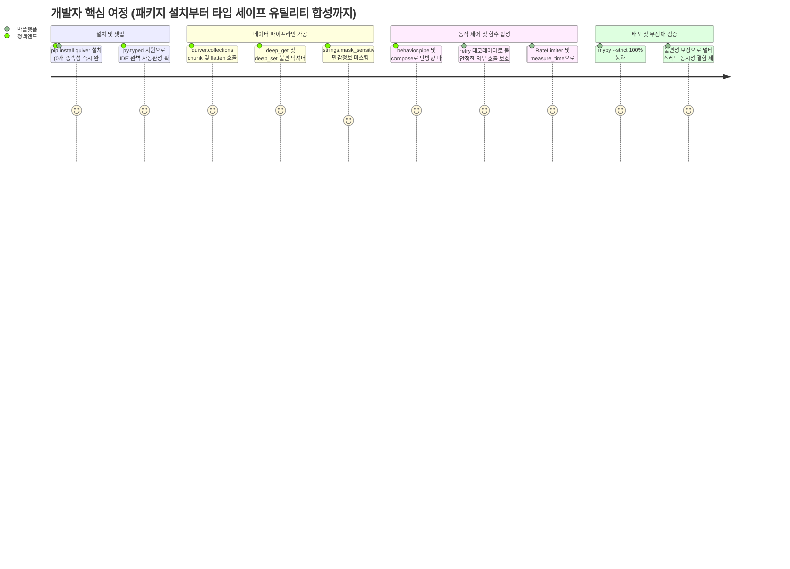

# [quiver] 제품 요구사항 정의서 (Product Requirements Document - PRD)

- **작성일자**: 2026-09-23
- **작성자**: 기획 명세 작성가 (`spec-writer`)
- **문서 버전**: v1.0
- **상태**: Approved

---

## 1. 프로덕트 비전 및 문제 정의 (Problem Statement & Vision)

- **배경 (Background)**:
  - 현대 파이썬 백엔드 서비스, 데이터 엔지니어링 파이프라인, 그리고 마이크로서비스(MSA) 아키텍처 환경에서 개발자들은 매일 리스트 청킹, 중첩 딕셔너리 안전 추출, 함수 합성, 재시도(Retry), 디바운스, 민감정보 마스킹, 실행 시간 측정과 같은 공통 유틸리티를 반복적으로 구현하고 있습니다.
  - 많은 프로젝트가 이러한 요구를 충족하기 위해 무거운 서드파티 라이브러리(예: `toolz`, `pydash`, `more-itertools`, `tenacity` 등)를 여러 개 도입하거나, 프로젝트 내부 사설 유틸(`utils.py`)에 정제되지 않은 스니펫을 무분별하게 복사-붙여넣기하여 유지보수 부채를 누적시키고 있습니다.
  - 특히 외부 종속성이 많아질수록 패키지 설치 용량 증가, 의존성 충돌(Dependency Hell), 보안 취약점 전파(CVE) 위험이 급증하며, 사설 스니펫들은 타입 힌팅 부재, 원본 데이터 가변성(Mutation) 부작용, 스레드 안전성 결여 등으로 인해 런타임 버그의 주요 원인이 되고 있습니다.

- **문제 정의 (Problem Statement)**:
  1. **의존성 비대화 및 보안/공급망 리스크 (Dependency Bloat & Supply-Chain Risk)**:
     - 단순한 유틸리티 함수 몇 개를 쓰기 위해 수십 개의 전이적 종속성(Transitive Dependencies)을 가진 서드파티 패키지를 설치함으로써 Docker 빌드 시간 지연 및 취약점 감사(Audit) 복잡도가 증가함.
  2. **동적 타이핑 부작용과 빈약한 정적 분석 (Lack of Modern Type Hinting)**:
     - 기존의 구형 유틸리티 라이브러리들은 파이썬 3.10+의 최신 타입 시스템(PEP 484, PEP 585, PEP 612 `ParamSpec`, PEP 675 `TypeVarTuple`, Generics)을 완전히 지원하지 못해 IDE 자동완성이 깨지고 `mypy --strict` 환경에서 수많은 타입 무시(`type: ignore`) 주석을 강제함.
  3. **가변성(Mutation)으로 인한 부작용과 비표준 인터페이스**:
     - 컬렉션 처리 시 입력 리스트나 딕셔너리의 원본을 직접 수정(In-place mutation)하여 예측 불가능한 동시성 버그를 유발함.
     - 함수 제어, 스코프 체이닝, 시간 측정 도구들의 인터페이스가 제각각이어서 일관된 함수형 파이프라인 구성이 어려움.

- **프로덕트 비전 (Vision)**:
  - **"The Modern, Zero-Dependency, Fully Type-Safe Utility Quiver for Python Engineers"**
  - 파이썬 개발자를 위한 모던, **제로 의존성(Zero-Dependency)**, 완벽한 타입 힌팅 기반의 모던 전천후 유틸리티 툴킷(Quiver).
  - 외부 서드파티 패키지 의존성을 완전히 배제($0$ External Dependencies)하고 순수 Python 3.10+ 표준 라이브러리만을 활용하여, 컬렉션 연산(`collections`), 고차 함수 제어(`behavior`), 문자열 변환 및 보안(`strings`), 스코프 확장(`scope`), 고정밀 타이밍(`timing`)을 아우르는 최적의 엔지니어링 도구를 원스톱으로 제공합니다.

---

## 2. 타깃 페르소나 및 유저 저니 맵 (Personas & User Journey)

### 2.1 대표 페르소나

- **페르소나 1: 정백엔드 (29세, 백엔드/API 엔지니어)**
  - **주요 목표**: FastAPI/Django 서비스에서 외부 라이브러리 설치 부담 없이 안전하게 컬렉션 데이터 가공, 민감정보 마스킹, API 지수 백오프 재시도를 구현.
  - **핵심 페인포인트**: 매번 다른 프로젝트에서 `utils.py`를 복사해 오다 보니 함수 시그니처가 다르고, `mypy` 엄격 모드에서 타입 에러가 쏟아지며, 재시도/디바운스 코드 구현 시 스레드 락 실수가 발생함.

- **페르소나 2: 박플랫폼 (35세, 플랫폼/SDK 아키텍트)**
  - **주요 목표**: 사내 공통 사내 SDK 및 데이터 파이프라인 프레임워크 개발 시 외부 의존성이 전혀 없는 경량 코어 유틸 패키지를 채택하여 고객사/사내 환경의 의존성 충돌을 원천 차단.
  - **핵심 페인포인트**: 사내 라이브러리에 서드파티 의존성을 넣었다가 사용자 프로젝트의 구형 의존성과 버전 충돌(`pip install` 충돌)이 빈번하게 발생하여 지원 티켓이 급증함.

### 2.2 핵심 유저 저니 (User Journey Map)

---

## 3. 기능 요구사항 및 MoSCoW 우선순위 매트릭스 (Feature Requirements)

| 요구사항 ID | 도메인 | 요구사항 명칭 및 상세 설명 | 우선순위 (MoSCoW) | 대응 비즈니스 가치 |
| :--- | :--- | :--- | :---: | :--- |
| `REQ-COLL-001` | 컬렉션 (`collections`) | **고급 다형 컬렉션 조작 유틸리티군** `chunk`, `flatten`, `group_by`, `partition`, `uniq_by`, `windowed`, `deep_get`, `deep_set`, `merge`, `pick`, `omit` 등 불변성 기반의 고성능 컬렉션 처리 도구 제공 | **Must Have** | 컬렉션 조작 반복 코드 80% 제거 및 원본 데이터 보존 |
| `REQ-BEHV-001` | 함수 동작 (`behavior`) | **함수 합성 및 실행 제어 데코레이터** `pipe`, `compose`, `curry`, `once`, `debounce`, `throttle`, TTL 기반 `memoize`, 지수 백오프/지터 기반 `retry` 제공 | **Must Have** | 안정적인 함수형 프로그래밍 및 일시적 장애 극복 |
| `REQ-STR-001` | 문자열 (`strings`) | **케이스 변환 및 보안 문자열 트랜스포머** 다양한 케이스 변환(camel, snake, kebab, pascal, title), URL 슬러그화(`slugify`), 단어 단위 잘라내기(`truncate`), 민감정보 정규식 마스킹(`mask_sensitive`) 제공 | **Must Have** | 문자열 포맷팅 일관성 및 개인정보 보호 규제 준수 |
| `REQ-SCP-001` | 스코프 (`scope`) | **Kotlin 스타일 스코프 확장 및 널 안전 연산자** 객체 컨텍스트 변환 `let`, 사이드이펙트 로깅 `also`/`tap`, 조건부 필터 `take_if`/`take_unless`, 널 병합 `coalesce` 제공 | **Must Have** | 가독성 높은 선언적 체이닝 및 임시 변수 오염 방지 |
| `REQ-TIME-001` | 시간/타이밍 (`timing`) | **고정밀 벤치마킹 및 토큰 버킷 호출율 제한** 나노초/밀리초 단위 정밀 측정 `Stopwatch`, 컨텍스트 매니저 겸용 `measure_time`, 스레드 안전한 토큰 버킷 `RateLimiter` 제공 | **Must Have** | 트래픽 폭주 방어 및 성능 프로파일링 정밀화 |
| `REQ-TYP-001` | 타입 무결성 (`typing`) | **PEP 561 마커 및 Strict Type Hinting** 패키지 내 `py.typed` 마커 탑재 및 `ParamSpec`, `TypeVar`, `Concatenate`를 활용한 100% 엄격 타입 정적 분석 보장 | **Should Have** | 개발자 경험(DX) 극대화 및 컴파일 타임 에러 검출 |
| `REQ-ASYNC-001` | 비동기 호환 (`async`) | **비동기 코루틴 지원 래퍼** `retry`, `debounce`, `throttle`, `measure_time` 등 주요 제어 도구의 `async def` 코루틴 함수 지원 | **Should Have** | FastAPI 등 최신 비동기 파이썬 프레임워크와의 완벽 호환 |
| `REQ-EXT-001` | 네이티브 확장 (`native`) | **C-Extension / Rust PyO3 가속 엔진** 대용량 컬렉션 처리를 위한 C/Rust FFI 가속 바인딩 모듈 | **Won't Have (v1)** (순수 Python 제로 의존성 원칙 유지를 위해 v1 배제, 차기 버전 고려) | 순수 Python 이식성 유지 및 배포 복잡도 최소화 |

---

## 4. 핵심 성공 지표 (KPI / Success Metrics)

| 지표명 | 측정 방식 / 기준 | 목표치 (Target) |
| :--- | :--- | :--- |
| **외부 의존성 개수 (External Dependencies)** | `pyproject.toml` / `setup.py`의 런타임 `dependencies` 항목 검사 | **정확히 0개 (Zero Dependency)** |
| **정적 타입 검사 무결성** | `mypy --strict` 및 `pyright --strict` 전체 소스코드 정적 분석 에러 수 | **0건 (Zero Type Error)** |
| **불변성 보장율 (Immutability)** | 모든 컬렉션/문자열 조작 함수 실행 시 인자 객체 원본 ID 및 값 변경 여부 | **100% 불변 보장 (Zero Mutation)** |
| **보일러플레이트 코드 감소율** | 청킹, 재시도, 레이트 리미팅, 중첩 조회 구현 시 작성 코드 라인 수 비교 | $\ge 70\%$ 감소 |
| **테스트 코드 라인 커버리지** | `pytest --cov` 기준 단위 및 엣지 케이스 테스트 커버리지 | $\ge 95\%$ |
| **함수 호출 오버헤드 (Overhead)** | 순수 기본 연산 대비 유틸리티 래핑 실행 지연시간 오버헤드 | 코어 연산당 $\le 5\mu\text{s}$ |
| **스레드 동시성 결함률** | `RateLimiter`, `memoize`, `once` 등에 대한 100 워커 멀티스레드 경합 테스트 | **0건 (Race-Condition Free)** |

---

## 5. 비기능적 요구사항 (Non-Functional Requirements)

- **성능 (Performance)**:
  - 제너레이터 기반 지연 평가(Lazy Evaluation)를 지원하여 메모리 사용량을 최소화할 수 있어야 함.
  - `Stopwatch` 및 `measure_time`은 OS 모노토닉 타이머(`time.perf_counter_ns`)를 사용하여 나노초급 정밀도를 제공해야 함.
- **보안 및 무결성 (Security & Integrity)**:
  - `mask_sensitive`는 주민등록번호, 신용카드 번호, 이메일 주소, 전화번호의 표준 패턴을 안정적으로 감지하고 원본 민감 문자열을 메모리에서 안전하게 대체해야 함.
  - 서드파티 패키지가 일체 없으므로 패키지 배포 시 외부 공급망 공격(Supply Chain Attack) 벡터를 원천 차단함.
- **호환성 및 표준 (Compatibility & Standards)**:
  - Python 3.10, 3.11, 3.12, 3.13 공식 지원 및 완벽한 인터프리터 호환성 보장.
  - PEP 561(`py.typed`), PEP 8(코딩 스타일), PEP 484/585/612(타입 어노테이션) 표준을 100% 준수.
- **신뢰성 및 동시성 (Reliability & Concurrency)**:
  - 동시성 제어가 필요한 모듈(`RateLimiter`, `once`, `memoize`, `debounce`, `throttle`)은 `threading.Lock` / `threading.RLock`을 활용하여 멀티스레드 환경에서 안전(Thread-safe)해야 함.
  - 모든 예외는 사전에 정의된 표준 Python 빌트인 예외(`ValueError`, `TypeError`, `KeyError` 등) 또는 명확한 커스텀 패키지 예외 계층을 따름.
