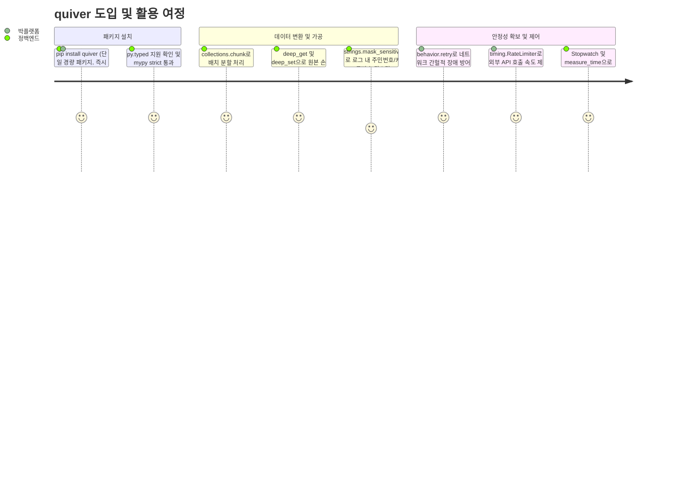

# [quiver] 제품 요구사항 정의서 (Product Requirements Document - PRD)

- **작성일자**: 2026-09-23
- **작성자**: 기획 명세 작성가 (`spec-writer`)
- **문서 버전**: v1.1
- **상태**: Approved

---

## 1. 배경 및 해결하려는 문제 (Problem Statement & Vision)

### 1.1 배경 (Background)
파이썬 백엔드(FastAPI, Django) 및 데이터 처리 파이프라인을 구축하다 보면 리스트 청크 분할, 중첩 딕셔너리 안전 탐색, 지수 백오프 재시도, 실행 시간 측정, 개인정보 마스킹 같은 공통 작업이 끊임없이 반복됩니다.

현업 팀들은 보통 두 가지 방식으로 이 문제를 해결해 왔습니다:
1. **서드파티 패키지 복수 도입**: `toolz`, `pydash`, `more-itertools`, `tenacity` 등을 기능별로 따로 설치합니다.
2. **사내 유틸 파일(`utils.py`) 복사-붙여넣기**: 이전 프로젝트에서 쓰던 10~20줄짜리 스니펫을 새 프로젝트로 옮겨 적습니다.

두 방식 모두 프로젝트가 커지면서 유지보수 문제를 일으킵니다.

### 1.2 문제 정의 (Problem Statement)
1. **외부 의존성 파편화와 공급망 관리 부담**:
   - 단순 유틸리티 몇 개를 쓰자고 무거운 서드파티 패키지를 여러 개 추가하면, 패키지 간 의존성 충돌(`pip dependency conflict`)이 발생하기 쉽고 Docker 이미지 빌드 시간과 패키지 취약점(CVE) 감사 대상이 늘어납니다.
2. **최신 타입 힌팅 미흡으로 인한 생산성 저하**:
   - 구형 유틸리티 라이브러리들은 Python 3.10+의 최신 타입 시스템(PEP 612 `ParamSpec`, PEP 585 제네릭스)을 제대로 지원하지 못해 대부분 `Any`를 반환합니다. 이로 인해 IDE 자동완성이 작동하지 않고, `mypy --strict` 환경에서 코드베이스 전반에 `# type: ignore` 주석이 늘어납니다.
3. **가변 객체 변이(Mutation)와 동시성 결함**:
   - `utils.py`에 흔히 구현된 딕셔너리 병합이나 리스트 조작 코드는 입력 원본을 직접 수정(`dict.update`, `list.sort`)하여 예기치 않은 사이드 이펙트를 유발합니다. 또한 타이머나 캐시 로직에 적절한 스레드 락이 없어 멀티스레드 환경에서 데이터 오염이나 데드락이 발생합니다.

### 1.3 프로덕트 비전 (Vision)
- **"Zero-Dependency, Type-Safe Core Utility Library for Python 3.10+"**
- `quiver`는 외부 의존성을 전혀 두지 않고($0$ External Dependencies) 파이썬 표준 라이브러리만으로 동작하는 경량 유틸리티 툴킷입니다.
- 컬렉션 조작(`collections`), 고차 함수 제어(`behavior`), 문자열 변환 및 보안(`strings`), 스코프 확장(`scope`), 고정밀 계측(`timing`)의 5개 영역을 다루며, 모든 함수는 원본 불변성(Immutability)과 엄격한 정적 타입 힌팅을 기본 원칙으로 삼습니다.

---

## 2. 타깃 페르소나 및 유저 저니 (Personas & User Journey)

### 2.1 대표 페르소나

- **정백엔드 (29세, 백엔드 API 엔지니어)**
  - **상황**: FastAPI 기반 마이크로서비스를 개발하며 대용량 주문 배치 처리, PG사 재시도 로직, 개인정보 마스킹 로깅을 구현 중.
  - **목표**: 추가 라이브러리 설치 결재나 버전 충돌 걱정 없이 한 줄 임포트로 신뢰할 수 있는 헬퍼 함수를 사용하고, IDE에서 반환 타입 추론 지원을 온전히 받고자 함.

- **박플랫폼 (35세, 사내 공통 프레임워크/SDK 테크리드)**
  - **상황**: 사내 20여 개 서비스 팀이 공통으로 사용하는 플랫폼 베이스 라이브러리를 배포 및 관리 중.
  - **목표**: 의존성 트리를 최소화하여 각 팀 프로젝트의 기존 라이브러리 버전과 충돌하지 않는 견고한 코어 툴킷을 원함.

### 2.2 핵심 유저 저니 맵 (User Journey Map)

---

## 3. 기능 요구사항 및 MoSCoW 매트릭스 (Feature Requirements)

| 요구사항 ID | 모듈 도메인 | 요구사항 명칭 및 상세 설명 | 우선순위 (MoSCoW) | 설계 의도 및 가치 |
| :--- | :--- | :--- | :---: | :--- |
| `REQ-COLL-001` | 컬렉션 (`collections`) | **불변 컬렉션 조작 유틸리티** `chunk`, `flatten`, `group_by`, `partition`, `uniq_by`, `windowed`, `deep_get`, `deep_set`, `merge`, `pick`, `omit`. 원본 데이터를 변이하지 않고 신규 컬렉션을 생성하거나 제너레이터 스트림으로 반환 | **Must Have** | 원본 데이터 훼손 버그 차단 및 배치 데이터 처리 간소화 |
| `REQ-BEHV-001` | 함수 제어 (`behavior`) | **실행 제어 및 합성 데코레이터** `pipe`, `compose`, `curry`, `once`, `debounce`, `throttle`, TTL 기반 `memoize`, 지수 백오프/지터 기반 `retry`. 스레드 안전성 보장 | **Must Have** | 일시적 네트워크 장애 복구 및 빈번한 호출 제어 |
| `REQ-STR-001` | 문자열 (`strings`) | **케이스 변환 및 마스킹 트랜스포머** 케이스 변환(camel, snake, kebab, pascal, title), URL 정규화 `slugify`, 단어 경계 보존 `truncate`, 주민번호/이메일/전화번호/카드번호 `mask_sensitive` | **Must Have** | 개인정보 로깅 유출 방지 및 문자열 규격 통일 |
| `REQ-SCP-001` | 스코프 (`scope`) | **스코프 체이닝 및 None 방어 함수** 컨텍스트 변환 `let`, 부수효과 수행 후 원본 반환 `also`/`tap`, 조건부 필터 `take_if`/`take_unless`, 널 병합 `coalesce` | **Must Have** | 임시 변수 남발 방지 및 선언적 체이닝 가독성 확보 |
| `REQ-TIME-001` | 타이밍 (`timing`) | **고정밀 계측기 및 호출율 제한기** 나노초 정밀도 랩 타임 `Stopwatch`, 데코레이터/컨텍스트 매니저 겸용 `measure_time`, 토큰 버킷 기반 스레드 안전 `RateLimiter` | **Must Have** | API 쿼터 초과 방지 및 병목 지점 정밀 프로파일링 |
| `REQ-TYP-001` | 타입 지원 (`typing`) | **PEP 561 마커 및 Strict Type Hinting** 패키지 루트에 `py.typed` 번들링, `ParamSpec`과 `TypeVar` 기반으로 래핑 대상 함수의 시그니처와 반환 타입을 온전히 보존 | **Should Have** | IDE 자동완성 복원 및 타입 체커 오류 제거 |
| `REQ-ASYNC-001` | 비동기 호환 (`async`) | **비동기 코루틴 지원 데코레이터** `retry`, `debounce`, `throttle`, `measure_time`에 대한 `async def` 코루틴 래퍼 호환 지원 | **Should Have** | 비동기 웹 프레임워크(FastAPI 등)와의 매끄러운 연동 |
| `REQ-EXT-001` | 네이티브 가속 (`native`) | **C/Rust 컴파일드 가속 엔진** 대용량 컬렉션 순회 성능을 높이기 위한 C-Extension 또는 Rust 바인딩 | **Won't Have (v1)** (바이너리 휠 빌드 복잡도 및 제로 의존성 원칙 유지를 위해 배제) | 순수 파이썬 환경의 높은 이식성 유지 |

---

## 4. 핵심 성공 지표 (KPI)

| 지표명 | 측정 기준 | 목표치 | 비고 |
| :--- | :--- | :--- | :--- |
| **외부 런타임 의존성** | `pyproject.toml` 내 `dependencies` 목록 | **0개** | 순수 파이썬 표준 라이브러리만 사용 |
| **정적 타입 검사 무결성** | `mypy --strict` 및 `pyright` 검사 결과 | **에러 0건** | PEP 561, PEP 612 준수 |
| **원본 불변성 유지율** | 컬렉션/문자열 함수 실행 전후 원본 메모리 ID 및 데이터 변이 여부 | **100% 보존** | 원본 변이(In-place mutation) 0건 |
| **테스트 라인 커버리지** | `pytest --cov=quiver` 단위/통합 테스트 | $\ge 95\%$ | 엣지 케이스 및 경합 조건 포함 |
| **스레드 안전성** | 100개 스레드 동시 진입 시 데이터 레이스 및 데드락 발생 건수 | **0건** | `threading.Lock` / `RLock` 검증 |

---

## 5. 비기능적 요구사항 및 트레이드오프 (Non-Functional Requirements & Trade-offs)

### 5.1 성능과 메모리 트레이드오프
- **지연 평가(Lazy Evaluation) 우선**: `chunk`, `windowed` 등 대용량 데이터 순회가 예상되는 함수는 메모리 점유를 최소화하기 위해 제너레이터 이터레이터(`Iterator[T]`)를 반환합니다.
- **불변 복사 비용(Copy Overhead)**: `deep_set`과 `merge`는 원본 변이를 방지하기 위해 신규 복사본을 생성합니다. 극도로 깊은 계층이나 수십만 건의 대형 딕셔너리를 다룰 때는 복사 비용이 발생할 수 있으며, 이는 안전성을 위해 감수하는 의도된 설계입니다.

### 5.2 환경 호환성
- **지원 인터프리터**: Python 3.10, 3.11, 3.12, 3.13 공식 지원 (CPython).
- **타이머 기준**: 시스템 시계 변경(NTP 동기화 등)으로 인한 시간 왜곡을 방지하기 위해 시간 측정 및 속도 제한 로직에는 `time.perf_counter_ns`와 `time.monotonic`만 사용합니다.
