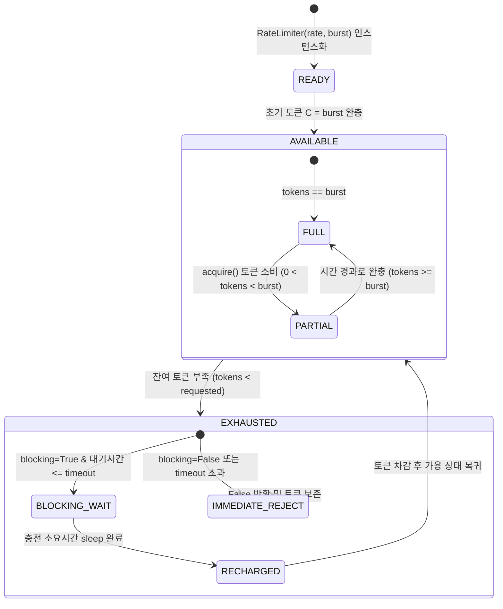
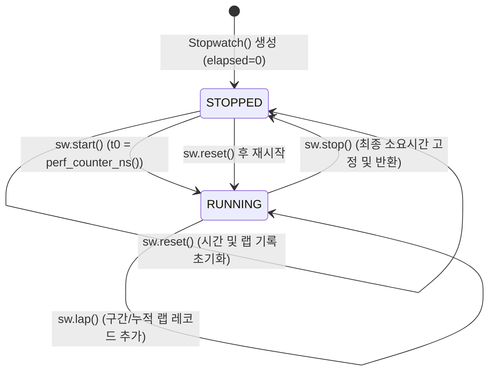

# [quiver] 비즈니스 정책 및 전역 예외 처리 명세서 (Policy & Edge Cases)

- **작성일자**: 2026-09-23
- **작성자**: 기획 명세 작성가 (`spec-writer`)
- **문서 버전**: v1.1
- **상태**: Approved

---

## 1. 상태 머신 및 전이 정책 (State Machine Policies)

`quiver`에서 상태를 관리하는 컴포넌트(`RateLimiter`, `Stopwatch`, `retry`, `once`, `debounce`/`throttle`)는 멀티스레드 환경에서도 상태 불일치가 발생하지 않도록 명확한 생명주기를 가집니다.

### 1.1 RateLimiter (토큰 버킷 상태 머신)

### 1.2 Stopwatch (계측 상태 머신)

### 1.3 상태 전이 매트릭스 및 제약 조건

| 컴포넌트 | 현재 상태 | 대상 상태 | 트리거 이벤트 | 전제 조건 | 사후 동작 및 보증 |
| :--- | :--- | :--- | :--- | :--- | :--- |
| `RateLimiter` | `AVAILABLE` | `EXHAUSTED` | `acquire(tokens)` | 가용 토큰량 $< \text{tokens}$ | 락 하에서 충전량 재계산 후 대기 또는 `False` 반환 |
| `RateLimiter` | `EXHAUSTED` | `AVAILABLE` | 시간 경과 | $\Delta t \times r \ge \text{tokens}$ | 필요한 시간만큼 `time.sleep` 완료 후 토큰 차감 및 `True` 반환 |
| `Stopwatch` | `STOPPED` | `RUNNING` | `sw.start()` | 스톱워치가 정지 상태 | `time.perf_counter_ns()` 기준 시작 시각 기록 |
| `Stopwatch` | `RUNNING` | `STOPPED` | `sw.stop()` | 스톱워치가 실행 중 | 최종 나노초 계산 후 고정, `is_running = False` |
| `Stopwatch` | `RUNNING` | `RUNNING` | `sw.lap()` | 스톱워치가 실행 중 | 직전 랩 대비 구간 및 누적 시간 레코드 추가 |
| `Behavior.once`| `UNINVOKED`| `INVOKED` | 최초 호출 | `has_run == False` | `threading.Lock` 하에 원본 함수 1회 실행 후 결과 고정 |

---

## 2. 공통 비즈니스 제약 및 정책 (Global Business Policies)

### 2.1 불변성 정책 (Immutability Policy)
- **순수 함수(Pure Functions) 원칙**:
  - `quiver.collections`의 모든 함수(`chunk`, `flatten`, `group_by`, `partition`, `uniq_by`, `deep_set`, `merge`, `pick`, `omit`)는 입력으로 들어온 원본 객체(리스트, 딕셔너리, 세트)를 직접 수정(`in-place mutation`)하지 않습니다.
  - `deep_set(mapping, path, value)`과 `merge(dict1, dict2)`는 원본을 변경하지 않고 신규 딕셔너리를 생성하여 반환하는 Copy-on-Write 패턴을 따릅니다.
  - **주의사항(Gotchas)**: 대규모 중첩 딕셔너리(예: 10만 건 이상의 키)에 대해 `deep_set`을 반복 호출하면 복사 오버헤드가 누적될 수 있습니다. 대규모 배치 적재 시에는 로컬 빌더 패턴을 사용하고 최종 단계에서 래핑하는 방식을 권장합니다.
- **불변 컨테이너 반환**:
  - `partition`은 `Tuple[List[T], List[T]]` 형태의 불변 튜플로 분할 결과를 반환합니다.
  - `windowed`의 각 윈도우 원소는 `Tuple[T, ...]`로 산출되어 개별 윈도우 슬라이스가 변이되지 않도록 보장합니다.

### 2.2 빈 이터러블 및 None 방어 정책 (Empty Iterable & None Safety Policy)
- **빈 컬렉션(Empty Collection) 처리**:
  - `chunk([], size=3)` $\rightarrow$ 빈 제너레이터 반환.
  - `flatten([])` $\rightarrow$ 빈 제너레이터 반환.
  - `group_by([], fn)` $\rightarrow$ 빈 딕셔너리 `{}` 반환.
  - `partition(fn, [])` $\rightarrow$ `([], [])` 반환.
  - `uniq_by([])` $\rightarrow$ 빈 리스트 `[]` 반환.
  - `merge()` $\rightarrow$ 인자가 없을 시 빈 딕셔너리 `{}` 반환.
- **`None` 인입 방어(Graceful Fallback)**:
  - `quiver.strings`의 모든 변환 함수는 `None`이 입력되면 예외를 던지지 않고 빈 문자열(`""`)로 변환하여 반환합니다.
  - `quiver.scope.coalesce(*values, default=None)`는 가변 인자를 순회하며 처음으로 `None`이 아닌 값을 반환하고, 모두 `None`이면 `default`를 반환합니다.
  - `deep_get(mapping, path, default=None)`는 중간 키가 없거나 중간 노드가 `None`인 경우 `KeyError` 없이 `default` 값을 안전하게 반환합니다.

### 2.3 제로 의존성(Zero-Dependency) 및 표준 라이브러리 준수
- **외부 런타임 종속성 $0$개 원칙**:
  - `quiver`는 설치 시 서드파티 휠을 일체 다운로드하지 않으며 순수 Python 빌트인 모듈만 사용합니다:
    - `typing`, `collections.abc`, `functools`, `time`, `re`, `threading`, `copy`, `inspect`, `random`, `math`, `unicodedata`.
- **PEP 561 마커 탑재**:
  - 패키지 루트에 `py.typed` 마커를 포함하여 사용자 프로젝트의 `mypy --strict` 및 `pyright` 검사에서 100% 무결점으로 동작합니다.
  - 데코레이터 적용 시에도 `ParamSpec`과 `TypeVar`를 활용해 원본 함수의 파라미터와 반환 타입을 온전히 보존합니다.

### 2.4 스레드 안전성 정책 (Thread-Safety Policy)
- **동시성 락 전략**:
  - `RateLimiter`: 토큰 갱신 및 대기 시간 계산은 `threading.Lock`으로 원자적(Atomic)으로 보호됩니다.
  - `once`: 이중 검사 잠금(Double-Checked Locking)을 적용하여 1회 실행의 안전성을 보장하고, 이후 호출에서는 락 획득 오버헤드 없이 $O(1)$로 캐시를 반환합니다.
  - `memoize`: 내부 캐시 딕셔너리 접근 시 `threading.RLock`(재진입 가능 락)을 사용하여 재귀 함수 캐싱 시 데드락을 방지합니다.

---

## 3. 전역 엣지 케이스 및 장애 복구 가이드 (Global Edge Cases)

| 예외 및 장애 유형 | 감지 방식 | 시스템 처리 방식 및 가이드 |
| :--- | :--- | :--- |
| **중첩 구조의 순환 참조 (Circular Reference)** | `flatten`, `deep_set`, `merge` 수행 시 객체 메모리 주소(`id(obj)`) 추적 | `visited_ids` 세트로 탐색 중인 컨테이너 재진입 감지 시 `ERR_COLL_CYCLIC_REF` 예외를 발생시켜 재귀 스택 오버플로우 방지 |
| **재시도 루프 중 프로세스 인터럽트** | `retry` 대기 중 `KeyboardInterrupt` 또는 `SystemExit` 발생 | 재시도 대상 예외(`Exception`)로 취급하지 않고 즉시 상위로 전파하여 프로세스 안전 종료 지원 |
| **대용량 무한 제너레이터 인입** | `chunk`, `windowed`에 무한 수열 제너레이터 인입 | 전체 데이터를 한 번에 메모리로 로드하지 않고 한 청크씩 즉시 yield하는 스트리밍 구조로 메모리 고갈 방어 |
| **시스템 시계 수동 변경 및 NTP 점프** | 운영체제 시스템 시계가 과거/미래로 점프 | 모든 경과 시간 및 대기 계산에 단조 시계(`time.perf_counter_ns`, `time.monotonic`)만 사용하여 음수 시간 계산 결함 원천 차단 |
| **1,000개 이상 스레드의 동시 RateLimiter 요청** | 대량 스레드가 동시 `acquire()` 진입 | `threading.Lock` 하에 공정하게 토큰 차감, 버스트 용량을 초과하는 요청은 대기 없이 즉시 `False` 반환 |
| **해시 불가능 객체의 캐싱 및 그룹화** | `dict`, `list` 등을 `memoize` 인자나 `uniq_by` 키로 전달 | `TypeError: unhashable type` 발생 시 `repr(x)` 문자열을 키로 사용하는 세이프 폴백 메커니즘 동작 |
| **문자열 정규식 백트래킹 (ReDoS) 위험** | 비정상적으로 긴 반복 문자열에 대한 마스킹 수행 | 비탐욕적(Non-greedy) 패턴과 원자적 그룹화 정규식 설계를 통해 입력 길이에 비례하는 $O(N)$ 선형 탐색 시간 보장 |
