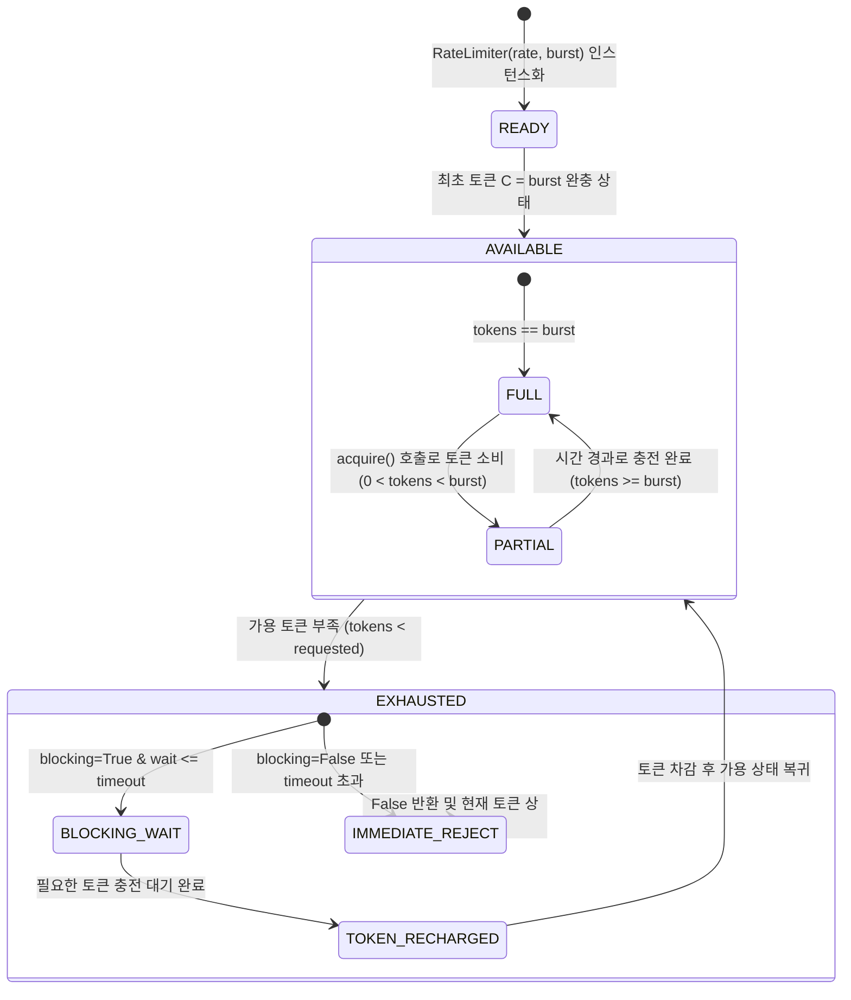
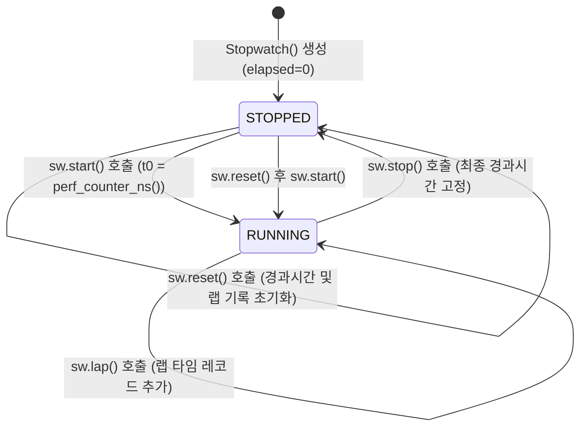

# [quiver] 비즈니스 정책 및 전역 예외 처리 명세서 (Policy & Edge Cases)

- **작성일자**: 2026-09-23
- **작성자**: 기획 명세 작성가 (`spec-writer`)
- **문서 버전**: v1.0
- **상태**: Approved

---

## 1. 핵심 유틸리티 생명주기 및 상태 전이 머신 (State Machine Policies)

`quiver` 라이브러리의 상태성 컴포넌트(`RateLimiter`, `Stopwatch`, `retry`, `debounce`/`throttle`)는 예측 가능하고 일관된 상태 전이 모델을 준수합니다.

### 1.1 RateLimiter (토큰 버킷 상태 머신)

### 1.2 Stopwatch (정밀 계측 상태 머신)

### 1.3 상태 전이 매트릭스 및 권한/조건 규칙

| 엔티티 | 현재 상태 | 대상 상태 | 전이 트리거 이벤트 | 필수 사전 조건 | 사후 동작 및 보증 |
| :--- | :--- | :--- | :--- | :--- | :--- |
| `RateLimiter` | `AVAILABLE` | `EXHAUSTED` | `acquire(tokens)` | 가용 토큰 잔여량 $< \text{tokens}$ | 락 하에서 충전량 계산 후 블로킹 대기 또는 `False` 반환 |
| `RateLimiter` | `EXHAUSTED` | `AVAILABLE` | 토큰 충전 시간 경과 | $\Delta t \times r \ge \text{tokens}$ | 슬립 완료 후 토큰 차감, `True` 반환 |
| `Stopwatch` | `STOPPED` | `RUNNING` | `sw.start()` | 스톱워치가 정지 상태임 | OS 단조 시계 `perf_counter_ns()` 기준 시각 기록 |
| `Stopwatch` | `RUNNING` | `STOPPED` | `sw.stop()` | 스톱워치가 실행 중임 | 누적 나노초 고정 및 `is_running = False` 설정 |
| `Stopwatch` | `RUNNING` | `RUNNING` | `sw.lap()` | 스톱워치가 실행 중임 | 직전 랩 대비 구간 및 누적 랩 레코드 불변 추가 |
| `Behavior.once`| `UNINVOKED`| `INVOKED` | 래핑 함수 최초 호출 | `has_run == False` | `threading.Lock` 하에 원본 함수 1회 실행 및 결과 고정 |

---

## 2. 공통 비즈니스 제약 및 유효성 검증 정책 (Global Business Policies)

### 2.1 불변성(Immutability) 정책 (Zero Mutation Policy)
- **순수 함수(Pure Functions) 원칙**:
  - `quiver.collections`의 모든 함수(`chunk`, `flatten`, `group_by`, `partition`, `uniq_by`, `deep_set`, `merge`, `pick`, `omit`)는 인자로 전달된 입력 컬렉션(리스트, 딕셔너리, 세트 등)을 일체 수정하지 않습니다.
  - `deep_set(mapping, path, value)` 및 `merge(dict1, dict2)`는 원본 딕셔너리를 직접 변이하지 않고 항상 신규 딕셔너리 객체(`new_dict`)를 생성하여 반환합니다(Copy-on-Write).
- **불변 반환 규격**:
  - `partition`은 `Tuple[List[T], List[T]]` 형태의 불변 튜플로 반환합니다.
  - `windowed`의 각 윈도우 원소는 변이 불가능한 `Tuple[T, ...]`로 산출됩니다.
  - `also`/`tap`은 전달받은 타깃 객체의 참조를 수정 없이 그대로 반환하여 불변 객체 파이프라인의 일관성을 유지합니다.

### 2.2 빈 이터러블 및 None 방어 정책 (Empty Iterable & None Safety Policy)
- **빈 컬렉션(Empty Collections) 처리**:
  - `chunk([], size=3)` $\rightarrow$ 빈 제너레이터(소비 시 `[]`) 반환.
  - `flatten([])` $\rightarrow$ 빈 제너레이터 반환.
  - `group_by([], fn)` $\rightarrow$ 빈 딕셔너리 `{}` 반환.
  - `partition(fn, [])` $\rightarrow$ `([], [])` 반환.
  - `uniq_by([])` $\rightarrow$ `[]` 반환.
  - `merge()` $\rightarrow$ 인자가 없으면 빈 딕셔너리 `{}` 반환.
- **`None` 인입 방어(Graceful Fallback)**:
  - `quiver.strings`의 변환 함수에 `None`이 인입될 경우 시스템 크래시를 방지하기 위해 빈 문자열(`""`)로 자동 변환하여 안전하게 반환합니다.
  - `quiver.scope.coalesce(*values, default=None)`는 가변 인자 중 최초로 `v is not None`인 값을 반환하며, 모든 값이 `None`인 경우 `default` 값을 반환합니다.
  - `deep_get(mapping, path, default=None)`는 경로 탐색 도중 키가 존재하지 않거나 중간 노드가 `None`인 경우 `KeyError`/`TypeError`를 발생시키지 않고 `default` 값을 안전하게 반환합니다.

### 2.3 제로 의존성(Zero-Dependency) 원칙 및 표준 라이브러리 준수 정책
- **외부 런타임 종속성 0개 ($0$ External Dependencies)**:
  - `quiver`는 `pip install` 시 어떠한 외부 패키지(`pydantic`, `toolz`, `requests`, `numpy` 등)도 설치하지 않으며 순수 Python 빌트인 표준 라이브러리만을 활용합니다:
    - `typing`, `collections.abc`, `functools`, `time`, `re`, `threading`, `copy`, `inspect`, `random`, `math`, `unicodedata`.
- **PEP 561 및 엄격한 타입 준수 (`py.typed`)**:
  - 패키지 루트에 `py.typed` 마커를 포함하여 사용자 프로젝트의 `mypy --strict` 및 `pyright` 검사를 100% 무결점으로 통과해야 합니다.
  - `ParamSpec`과 `TypeVar`를 철저히 사용하여 데코레이터 적용 후에도 원본 함수의 인자 및 반환값 타입 힌팅이 100% 보존되도록 구현합니다.

### 2.4 스레드 안전성(Thread-Safety) 정책
- **동시성 제어 모델**:
  - 상태를 가지는 모든 데코레이터 및 클래스(`RateLimiter`, `Stopwatch`, `once`, `debounce`, `throttle`, `memoize`)는 멀티스레드 환경에서 데이터 경합(Race Condition)을 원천 차단합니다.
- **락(Locking) 전략**:
  - `RateLimiter`: 토큰 계산 및 슬립 대기 구간에서 `threading.Lock`을 사용하여 원자적(Atomic) 연산을 수행합니다.
  - `once`: 이중 검사 잠금(Double-Checked Locking) 패턴을 사용하여 초기 1회 실행의 멱등성을 보장하고 이후 읽기 성능 오버헤드를 $O(1)$로 최소화합니다.
  - `memoize`: 내부 캐시 딕셔너리 조회 및 갱신 시 `threading.RLock`을 사용하여 재귀 호출 시 데드락을 방지합니다.

---

## 3. 전역 엣지 케이스 및 장애 복구 가이드 (Global Edge Cases)

| 장애 / 예외 유형 | 감지 방식 | 시스템 처리 방식 및 가이드 |
| :--- | :--- | :--- |
| **순환 참조(Circular Reference) 중첩 구조** | `flatten`, `deep_set`, `merge` 수행 시 객체 ID(`id(obj)`) 추적 | `visited_set`을 유지하여 이미 탐색 중인 컨테이너 재방문 감지 시 `ERR_COLL_CYCLIC_REF` 예외를 발생시켜 스택 오버플로우 방지 |
| **재시도 루프 중 시스템 인터럽트 발생** | `retry` 대기 중 `KeyboardInterrupt`, `SystemExit` 발생 | 일반 애플리케이션 `Exception`이 아니므로 재시도 루프를 즉시 중단하고 시스템 인터럽트를 그대로 전파하여 프로세스 정상 종료 유도 |
| **대용량 무한 제너레이터(Infinite Generator) 인입** | `chunk`, `windowed`에 무한 수열 제너레이터 인입 | 전체를 메모리로 로드하지 않고 한 번에 하나의 청크/윈도우만 산출하는 제너레이터 스트리밍 방식으로 메모리 고갈(OOM) 방어 |
| **시스템 시계 수동 변경 / NTP 시각 점프** | 시스템 로컬 시계가 과거 또는 미래로 재설정 | 모든 지연 시간 및 스톱워치 측정에 단조 증가 시계(`time.perf_counter_ns`, `time.monotonic`)만 사용하여 음수 경과시간 결함 원천 차단 |
| **초고동시성 1,000 스레드 동시 RateLimiter 요청** | 다중 스레드의 동시 `acquire()` 진입 | `threading.Lock` 하에 공정하고 원자적인 토큰 차감 수행, 버스트 용량 초과 요청 시 대기 없이 즉시 `False` 반환 |
| **해시 불가능(Unhashable) 객체 캐싱/그룹화** | `dict`, `list` 등을 `memoize` 인자나 `uniq_by` 키로 전달 | `TypeError: unhashable type` 발생 시 `repr(x)` 또는 JSON 정규화 문자열을 키로 사용하는 세이프 폴백 메커니즘 가동 |
| **문자열 마스킹 정규식 DoS (ReDoS)** | 비정상적으로 긴 반복 문자열 인입 시 정규식 백트래킹 | 역추적(Backtracking)이 없는 원자적(Atomic) 비탐욕적 정규식 패턴 설계로 $O(N)$ 시간 복잡도 엄격 보장 |
