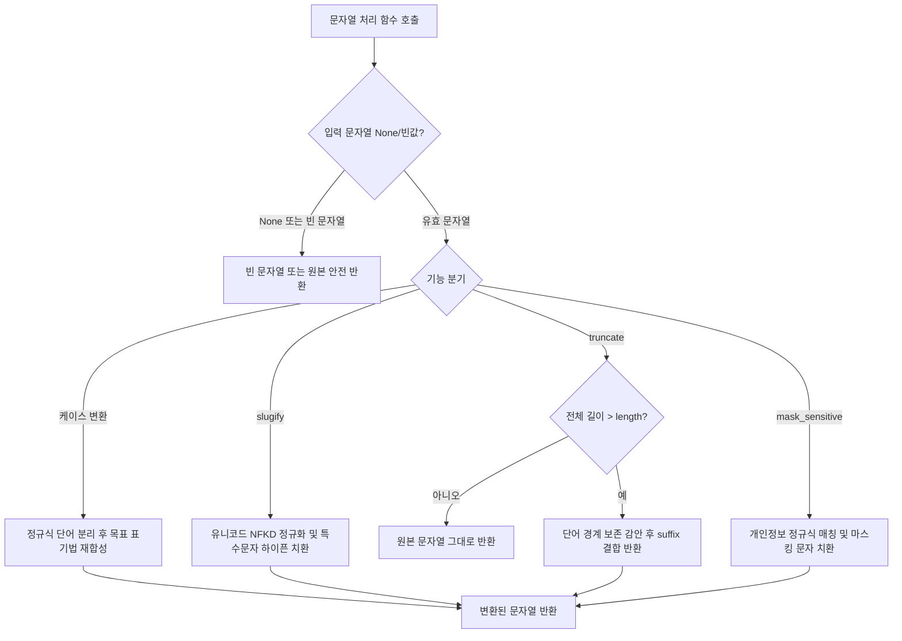

# [quiver] 모던 전천후 유틸리티 툴킷 상세기능정의서 (Modular FSD)

- **도메인**: 전천후 유틸리티 도메인 (Collections, Behavior, Strings, Scope, Timing)
- **작성자**: 기획 명세 작성가 (`spec-writer`)
- **문서 버전**: v1.0
- **상태**: Approved

---

## 단위 기능 상세 명세 (단위기능별 7대 상세 명세 완비)

---

### [FUNC-COLL-001] 불변 컬렉션 고급 다형 연산 (Immutable Collections Operations)

#### 1. 기본 정보
- **기능명**: 불변 컬렉션 고급 다형 연산군 (`chunk`, `flatten`, `group_by`, `partition`, `uniq_by`, `windowed`, `deep_get`, `deep_set`, `merge`, `pick`, `omit`)
- **기능 ID**: `FUNC-COLL-001`
- **대응 요구사항 ID**: `REQ-COLL-001`, `REQ-TYP-001`
- **대상 모듈 코드**: `MOD-COLL-001` (`quiver.collections`)
- **우선순위**: Must Have
- **관련 액터 (Actor)**: 라이브러리 사용자 (파이썬 백엔드 엔지니어, 데이터 엔지니어)

#### 2. 사전 조건 (Pre-conditions)
1. Python 3.10 이상의 런타임 환경에서 `quiver.collections` 모듈이 임포트된 상태.
2. 입력으로 전달되는 시퀀스 또는 매핑 객체는 읽기 접근이 가능해야 함.
3. 제너레이터 등 1회성 이터러블의 경우, 재순회가 요구되는 연산(`group_by`, `partition` 등)에서는 시스템 내부에서 안전하게 튜플/리스트로 소비되거나 이터레이터를 적절히 분기할 수 있어야 함.

#### 3. 사용자 인터랙션 및 시스템 동작 흐름과 플로우차트 (Step-by-Step Flow & Flowchart)
1. 호출자가 `chunk(data, size=3)`, `flatten(nested, depth=1)`, `deep_get(user_dict, "profile.address.city")` 등 유틸리티 함수를 호출한다.
2. 시스템은 입력 인자의 타입 및 제약 조건(예: `size > 0`, `depth >= 0`, `separator` 유효성)을 선행 검증한다.
3. 시스템은 원본 데이터 객체를 직접 수정(In-place mutation)하지 않고, **새로운 리스트, 제너레이터, 또는 얕은/깊은 복사된 딕셔너리**를 생성하여 연산을 수행한다:
   - `chunk`: 지정된 `size` 단위로 원소를 슬라이싱하여 이터레이터(`Iterator[List[T]]`)로 반환. 잔여 원소는 마지막 청크로 포함.
   - `flatten`: 원자 타입(`str`, `bytes`, `dict`)을 제외한 중첩 이터러블을 순회하며 `depth`만큼 평탄화 수행.
   - `group_by`: `key_fn(item)` 결과를 딕셔너리의 키로 매핑하고, 원래 순서를 유지하며 원소들을 리스트로 누적.
   - `partition`: `predicate(item)` 평가 결과에 따라 참 리스트와 거짓 리스트의 `Tuple[List[T], List[T]]` 생성.
   - `uniq_by`: 원소 또는 `key_fn(item)` 기준 고유성을 판별하여 첫 등장 순서를 보존한 리스트 반환.
   - `windowed`: 크기 `size`, 보폭 `step`의 슬라이딩 윈도우 튜플 생성.
   - `deep_get` / `deep_set`: 구분자(`.`) 또는 시퀀스 경로로 중첩 딕셔너리를 탐색/갱신하되, `deep_set`은 기존 딕셔너리를 훼손하지 않는 불변 복제본을 반환.
   - `merge`: 복수의 딕셔너리를 좌에서 우로 재귀 병합한 신규 딕셔너리 반환.
   - `pick` / `omit`: 지정된 키 목록을 포함하거나 제외한 신규 딕셔너리 추출.
4. 연산 완료 후 호출자에게 완전히 격리된 새로운 데이터 구조를 반환한다.

```mermaid
flowchart TD
    A[컬렉션 함수 호출 인입] --> B{입력 파라미터 유효성 검증}
    B -- 제약 위반 (size <= 0 등) --> C[ValueError / TypeError 발생]
    B -- 검증 통과 --> D{연산 유형 판별}
    D -- chunk / windowed --> E[슬라이싱 및 윈도우 제너레이터 산출]
    D -- flatten --> F[원자 타입(str/bytes/dict) 제외 재귀 평탄화]
    D -- group_by / partition --> G[순서 보존 버킷/튜플 분류]
    D -- deep_set / merge --> H[불변 복제본 생성 및 심층 병합/갱신]
    D -- pick / omit / uniq_by --> I[신규 고유 컬렉션 필터링]
    E --> J[불변 결과 반환 (원본 보존 100%)]
    F --> J
    G --> J
    H --> J
    I --> J
```

#### 4. 화면 표시 및 입력 데이터 항목 명세 (UI Data Elements - 8대 표준 컬럼)

| 항목명 | 화면 표시/입력 구분 | UI 컴포넌트 | 필수 여부 | 데이터 타입 / 제약 | 기본값 | 유효성 검증 규칙 (Validation) | 노출/수정 조건 |
| :--- | :---: | :--- | :---: | :--- | :---: | :--- | :--- |
| `iterable` | 함수 인자 (Input) | Function Argument | 필수 | `Iterable[T]` | - | `collections.abc.Iterable` 구현체 | 상시 |
| `size` | 함수 인자 (Input) | Function Argument | 필수 (chunk/windowed) | `int` | - | $\text{size} \ge 1$, 정수형 아닐 시 `TypeError` | 청크 및 윈도우 호출 시 |
| `step` | 옵션 플래그 (Config) | Keyword Option | 선택 | `Optional[int]` | `None` (size와 동일) | $\text{step} \ge 1$ | 윈도우/청크 이동 간격 설정 시 |
| `depth` | 옵션 플래그 (Config) | Keyword Option | 선택 | `Optional[int]` | `None` (무한 재귀) | $\text{depth} \ge 0$ | 평탄화 깊이 제한 시 |
| `key_fn` | 함수 인자 (Input) | Function Argument | 선택 | `Optional[Callable[[T], K]]` | `None` (원소 자체) | 호출 가능한 단일 인자 함수 | 그룹화, 고유성 필터 시 |
| `predicate` | 함수 인자 (Input) | Function Argument | 필수 (partition) | `Callable[[T], bool]` | - | 호출 가능한 진위 판별 함수 | 분할 호출 시 |
| `path` | 함수 인자 (Input) | Function Argument | 필수 (deep_*) | `Union[str, Sequence[Union[str, int]]]` | - | 문자열 또는 키/인덱스 시퀀스 | 중첩 탐색/갱신 시 |
| `value` | 함수 인자 (Input) | Function Argument | 필수 (deep_set) | `Any` | - | 제약 없음 | 심층 갱신 시 |
| `separator` | 옵션 플래그 (Config) | Keyword Option | 선택 | `str` | `"."` | 비어있지 않은 문자열 (길이 $\ge 1$) | 경로 문자열 파싱 시 |
| `deep` | 옵션 플래그 (Config) | Keyword Option | 선택 | `bool` | `True` | 불리언 | 병합 재귀 여부 결정 시 |
| `keys` | 함수 인자 (Input) | VarArgs | 필수 (pick/omit) | `Tuple[K, ...]` | - | $1$개 이상의 키 식별자 | 딕셔너리 필터링 시 |

#### 5. 비즈니스 규칙 (Business Rules)
- **BR-COLL-001-1 (불변성 절대 보장)**: 모든 컬렉션 조작 함수는 인자로 전달된 원본 객체의 메모리 주소 및 내부 상태를 일체 변경하지 않는다(`In-place mutation 0%`).
- **BR-COLL-001-2 (원자 타입 평탄화 방어)**: `flatten` 수행 시 `str`, `bytes`, `bytearray`, `dict`는 단일 원소(Atomic Element)로 취급하여 문자 단위나 키 단위로 재귀 평탄화되지 않도록 보장한다.
- **BR-COLL-001-3 (순서 보존 중복 제거)**: `uniq_by`는 원소의 원래 출현 순서(Insertion Order)를 100% 보존하며, 해시 불가(Unhashable) 객체에 대해서도 등가성 비교를 통해 고유성을 도출한다.
- **BR-COLL-001-4 (심층 딕셔너리 불변 갱신)**: `deep_set(mapping, path, value)`는 원본 `mapping`을 깊은 복사(Copy-on-Write)하여 목표 경로에 값을 세팅하고 신규 딕셔너리를 반환하며, 중간 경로가 존재하지 않을 경우 기본 빈 딕셔너리를 자동 생성한다.
- **BR-COLL-001-5 (청크 잔여분 무손실)**: `chunk` 분할 시 전체 길이가 `size`의 배수가 아니더라도 마지막 잔여 원소들을 버리지 않고 마지막 청크에 온전히 포함하여 반환한다.

#### 6. 예외 처리 및 엣지 케이스 (Edge Cases & Exception Handling)

| 발생 상황 (Edge Case Scenario) | 화면 반응 및 시스템 처리 방식 | 사용자 안내 메시지 / 예외 |
| :--- | :--- | :--- |
| `size <= 0` 또는 `step <= 0` 전달 시 | 즉시 연산을 중단하고 `ValueError`를 발생 | `ValueError: chunk size must be a positive integer (got <= 0)` |
| `iterable`로 빈 컬렉션(`[]`, `{}`, `set()`) 전달 시 | 에러 없이 빈 리스트 또는 빈 제너레이터를 안전하게 반환 | 빈 결과 반환 (예외 미발생) |
| `deep_get` 시 대상 경로가 존재하지 않는 경우 | 예외를 던지지 않고 호출자가 전달한 `default` 값(`None` 기본) 반환 | `default` 값 반환 (KeyError 방지) |
| 순환 참조(Cyclic Reference) 컬렉션 평탄화 시도 시 | 방문 추적 집합(`visited_ids`)을 유지하여 무한 루프 감지 시 차단 | `ValueError: Circular reference detected during flatten` |
| `pick`/`omit`에 딕셔너리에 없는 키가 포함된 경우 | 에러 없이 존재하는 키만 선택하거나 무시하고 신규 딕셔너리 생성 | 정상 처리 (KeyError 미발생) |

#### 7. 비즈니스 에러 코드 매핑

| 비즈니스 에러 코드 | 발생 사유 | HTTP 상태 코드 매핑 / 표준 예외 | 클라이언트 표시 / 예외 형태 |
| :--- | :--- | :---: | :--- |
| `ERR_COLL_INVALID_SIZE` | `chunk` 또는 `windowed`의 `size`가 1 미만 | `ValueError` (400 Bad Request) | `ValueError: size must be greater than or equal to 1` |
| `ERR_COLL_INVALID_DEPTH` | `flatten`의 `depth`가 음수인 경우 | `ValueError` (400 Bad Request) | `ValueError: depth must be non-negative or None` |
| `ERR_COLL_CYCLIC_REF` | 평탄화 대상 컬렉션 내부 순환 참조 감지 | `ValueError` (422 Unprocessable) | `ValueError: Cyclic reference detected in nested structure` |
| `ERR_COLL_TYPE_MISMATCH` | 이터러블이 아닌 객체 전달 시 | `TypeError` (400 Bad Request) | `TypeError: Expected iterable object, got <type>` |

---

### [FUNC-BEHV-001] 함수 제어 및 합성 데코레이터 (Function Behavior & Decorators)

#### 1. 기본 정보
- **기능명**: 함수 제어 및 합성 데코레이터군 (`pipe`, `compose`, `curry`, `once`, `debounce`, `throttle`, `memoize with TTL`, `retry`)
- **기능 ID**: `FUNC-BEHV-001`
- **대응 요구사항 ID**: `REQ-BEHV-001`, `REQ-ASYNC-001`, `REQ-TYP-001`
- **대상 모듈 코드**: `MOD-BEHV-001` (`quiver.behavior`)
- **우선순위**: Must Have
- **관련 액터 (Actor)**: 라이브러리 사용자 (파이썬 백엔드 엔지니어, 아키텍트)

#### 2. 사전 조건 (Pre-conditions)
1. 제어 대상이 되는 원본 함수(또는 코루틴 함수)가 유효한 호출 가능 객체(`Callable`)여야 함.
2. 멀티스레드 환경에서 `once`, `debounce`, `throttle`, `memoize` 호출 시 스레드 간 메모리 가시성이 확보되어야 함.
3. `retry` 데코레이터 적용 대상 함수는 재시도 가능한 멱등성 연산이거나 일시적 네트워크 예외를 포착할 수 있어야 함.

#### 3. 사용자 인터랙션 및 시스템 동작 흐름과 플로우차트 (Step-by-Step Flow & Flowchart)
1. **함수 합성 (`pipe`, `compose`)**:
   - `pipe(val, f, g)`: $val \rightarrow f(val) \rightarrow g(f(val))$ 단방향 흐름으로 데이터를 변환하여 최종값 반환.
   - `compose(g, f)`: 수학적 함수 합성 $(g \circ f)(x) = g(f(x))$ 형태의 신규 합성 함수를 반환.
2. **커링 (`curry`)**:
   - 함수의 검사된 인수 개수(`inspect.signature`)를 추적하여 필요한 인자가 모두 공급될 때까지 부분 적용된 클로저를 반환.
3. **멱등 1회 실행 (`once`)**:
   - `threading.Lock`을 획득하고 내부 실행 플래그(`has_run`)를 검사. 첫 실행 시 결괏값을 캐싱하고 이후 호출에는 재실행 없이 캐시값을 즉시 반환.
4. **시간 제어 (`debounce`, `throttle`)**:
   - `debounce(wait)`: 호출 시 기존 타이머(`threading.Timer`)를 취소하고 새로 예약하여, 마지막 호출 후 `wait`초 동안 추가 호출이 없을 때 1회 실행.
   - `throttle(interval)`: 첫 호출 후 타이머를 가동하고, `interval`초 동안의 중복 호출은 드롭하거나 마지막 값 1회로 제한.
5. **TTL 캐시 (`memoize`)**:
   - 인자 해시 키를 생성하고 만료 시각($t_{expire} = t_{now} + TTL$)을 검사. 유효 시 캐시값 반환, 만료 시 락 기반 재계산 및 갱신.
6. **지수 백오프 스마트 재시도 (`retry`)**:
   - 함수 실행 중 지정된 `exceptions` 발생 시 시도 횟수 $k$를 증가시키고, $t_{wait} = \min(max\_wait, base \times 2^{k-1})$와 풀 지터(Full Jitter $\sim U(0, t_{wait})$)를 적용하여 대기 후 재시도. 최대 시도 초과 시 마지막 예외 전파.

```mermaid
flowchart TD
    A[타깃 함수 호출 인입] --> B{래퍼 유형 분류}
    B -- retry --> C[함수 try 실행]
    C -- 예외 발생 (지정 exception) --> D{시도 횟수 k < max_attempts?}
    D -- 참 --> E[지수 백오프 + Full Jitter 대기 후 재실행]
    E --> C
    D -- 거짓 --> F[최종 예외 재발생 (Re-raise)]
    C -- 성공 --> G[결괏값 정상 반환]
    
    B -- debounce / throttle --> H{시간 윈도우 및 타이머 판별}
    H -- 디바운스 조건 충족 --> I[이전 타이머 취소 및 신규 지연 실행 스케줄링]
    H -- 쓰로틀 간격 경과 --> J[즉시 실행 및 다음 간격 락 설정]
    
    B -- memoize (TTL) --> K{인자 캐시 키 존재 및 유효?}
    K -- 유효 캐시 --> L[캐시된 결과 반환 (함수 미실행)]
    K -- 만료 또는 미존재 --> M[락 획득 후 함수 실행, TTL 기록 후 반환]
    
    B -- once --> N{이미 실행 완료?}
    N -- 참 --> O[최초 실행 결괏값 즉시 반환]
    N -- 거짓 --> P[스레드 락 하에 1회 실행 후 결과 고정]
```

#### 4. 화면 표시 및 입력 데이터 항목 명세 (UI Data Elements - 8대 표준 컬럼)

| 항목명 | 화면 표시/입력 구분 | UI 컴포넌트 | 필수 여부 | 데이터 타입 / 제약 | 기본값 | 유효성 검증 규칙 (Validation) | 노출/수정 조건 |
| :--- | :---: | :--- | :---: | :--- | :---: | :--- | :--- |
| `fn` / `*fns` | 함수 인자 (Input) | Function Argument | 필수 | `Callable[..., Any]` | - | 호출 가능한 파이썬 함수 객체 | 데코레이터 적용 시 |
| `max_attempts` | 옵션 플래그 (Config) | Decorator Param | 선택 | `int` | `3` | $\text{max\_attempts} \ge 1$ | 재시도 데코레이터 설정 |
| `backoff_base` | 옵션 플래그 (Config) | Decorator Param | 선택 | `float` | `0.5` (초) | $\text{backoff\_base} > 0.0$ | 재시도 기본 지연 시간 |
| `backoff_max` | 옵션 플래그 (Config) | Decorator Param | 선택 | `float` | `60.0` (초) | $\text{backoff\_max} \ge \text{backoff\_base}$ | 재시도 최대 지연 상한 |
| `jitter` | 옵션 플래그 (Config) | Decorator Param | 선택 | `bool` | `True` | 불리언 (Full Jitter 활성화 여부) | Thundering herd 방지 시 |
| `exceptions` | 옵션 플래그 (Config) | Decorator Param | 선택 | `Tuple[Type[Exception], ...]` | `(Exception,)` | $1$개 이상의 `Exception` 서브클래스 | 재시도 트리거 예외 필터링 |
| `wait_seconds` | 옵션 플래그 (Config) | Decorator Param | 필수 (debounce) | `float` | - | $\text{wait\_seconds} > 0.0$ | 디바운스 대기 간격 |
| `interval_seconds` | 옵션 플래그 (Config) | Decorator Param | 필수 (throttle) | `float` | - | $\text{interval\_seconds} > 0.0$ | 쓰로틀링 최소 주기 |
| `ttl_seconds` | 옵션 플래그 (Config) | Decorator Param | 선택 (memoize) | `Optional[float]` | `None` (무한) | $\text{ttl\_seconds} > 0.0$ 또는 `None` | 캐시 유효 시간 설정 시 |
| `maxsize` | 옵션 플래그 (Config) | Decorator Param | 선택 (memoize) | `Optional[int]` | `128` | $\text{maxsize} \ge 1$ 또는 `None` | LRU 캐시 최대 용량 제한 |

#### 5. 비즈니스 규칙 (Business Rules)
- **BR-BEHV-001-1 (재시도 대기시간 수식)**: $k$번째 재시도 대기 시간 $T_{wait}$는 아래의 Full Jitter 수식을 엄격히 따른다:
  $$T_{temp} = \min(\text{backoff\_max}, \text{backoff\_base} \times 2^{k-1})$$
  $$T_{wait} = \text{random.uniform}(0, T_{temp}) \quad (\text{단, jitter=False 일 경우 } T_{wait} = T_{temp})$$
- **BR-BEHV-001-2 (once 스레드 안전성)**: `once`는 다중 스레드가 동시에 진입하더라도 실제 감싸진 함수는 전역에서 정확히 $1$회만 실행됨을 `threading.Lock`을 통해 보장하며, 실행 중 예외가 발생하면 실패 상태를 캐싱하지 않고 다음 호출자에게 재실행 기회를 부여한다.
- **BR-BEHV-001-3 (memoize 인자 캐시 키 규격)**: 캐시 키는 `(args, frozenset(kwargs.items()))` 튜플을 기본으로 하며, 해시 불가능한 객체가 포함된 경우 `repr` 직렬화 또는 사용자 정의 `key_fn`을 안전 폴백으로 사용한다.
- **BR-BEHV-001-4 (pipe/compose 단항 및 다항 호환)**: `pipe`의 첫 번째 함수와 `compose`의 마지막 함수는 다중 인자(`*args, **kwargs`)를 수용할 수 있으며, 이후의 중간 파이프라인 함수들은 직전 함수의 단일 반환값을 인자로 취한다.

#### 6. 예외 처리 및 엣지 케이스 (Edge Cases & Exception Handling)

| 발생 상황 (Edge Case Scenario) | 화면 반응 및 시스템 처리 방식 | 사용자 안내 메시지 / 예외 |
| :--- | :--- | :--- |
| `retry` 대상 함수가 치명적 시스템 예외(`KeyboardInterrupt`, `SystemExit`) 발생 시 | 재시도 루프를 즉시 탈출하고 예외를 외부로 즉시 전파 | 시스템 인터럽트 즉시 전파 |
| `memoize` 호출 시 인자에 Unhashable 타입(Dict, List) 포함 | `TypeError`로 중단되지 않고 `repr()` 해싱 폴백을 수행하거나 명확한 경고 처리 | 자동 직렬화 키 매핑 (에러 미발생) |
| `curry` 대상 함수에 가변 인자(`*args`, `**kwargs`)가 존재하여 arity 감지 불가 | `arity` 인자가 명시되지 않은 경우 `ValueError` 발생으로 안전 가이드 | `ValueError: Cannot determine arity for variadic function; specify arity explicitly` |
| `debounce`/`throttle` 스레드 종료 시 잔여 타이머 미정리 | 데몬 스레드로 타이머를 생성하거나 `cancel()` 훅을 제공하여 프로세스 행(Hang) 방지 | 리소스 안전 해제 |

#### 7. 비즈니스 에러 코드 매핑

| 비즈니스 에러 코드 | 발생 사유 | HTTP 상태 코드 매핑 / 표준 예외 | 클라이언트 표시 / 예외 형태 |
| :--- | :--- | :---: | :--- |
| `ERR_BEHV_MAX_RETRIES` | 재시도 횟수 전부 소진 후 최종 실패 | 원래 발생한 대상 예외 (예: ConnectionError) | 원본 대상 예외 스택 트레이스 보존 |
| `ERR_BEHV_INVALID_ARITY` | 커링 대상 함수의 인수 개수 감지 실패 | `ValueError` (400 Bad Request) | `ValueError: Invalid or undetermined function arity` |
| `ERR_BEHV_INVALID_INTERVAL` | 대기 간격 또는 TTL이 0 이하 | `ValueError` (400 Bad Request) | `ValueError: Interval/TTL must be positive number` |
| `ERR_BEHV_TARGET_NOT_CALLABLE`| 함수가 아닌 객체에 데코레이터 적용 | `TypeError` (400 Bad Request) | `TypeError: Target must be a callable object` |

---

### [FUNC-STR-001] 문자열 케이스 변환 및 보안 트랜스포머 (String Transformers & Security)

#### 1. 기본 정보
- **기능명**: 문자열 케이스 변환 및 보안 트랜스포머군 (`to_camel_case`, `to_snake_case`, `to_kebab_case`, `to_pascal_case`, `to_title_case`, `slugify`, `truncate`, `mask_sensitive`)
- **기능 ID**: `FUNC-STR-001`
- **대응 요구사항 ID**: `REQ-STR-001`, `REQ-TYP-001`
- **대상 모듈 코드**: `MOD-STR-001` (`quiver.strings`)
- **우선순위**: Must Have
- **관련 액터 (Actor)**: 라이브러리 사용자 (백엔드 엔지니어, 보안 담당자)

#### 2. 사전 조건 (Pre-conditions)
1. 변환 대상 입력값은 문자열(`str`)이거나 `__str__` 표현이 가능한 객체여야 함.
2. `mask_sensitive`의 경우 보호하고자 하는 민감정보 식별자 유형(이메일, 주민번호, 신용카드, 전화번호) 또는 마스킹 범위가 정의되어야 함.

#### 3. 사용자 인터랙션 및 시스템 동작 흐름과 플로우차트 (Step-by-Step Flow & Flowchart)
1. 호출자가 문자열 변환 함수를 호출한다.
2. 시스템은 입력 문자열이 `None` 또는 비어있는지 확인한다 (`None` 방어).
3. 변환 기능별 처리:
   - **케이스 변환**: 공백, 언더바(`_`), 하이픈(`-`), 카멜케이스 대소문자 전환 지점을 정규식 토큰화하여 단어 목록으로 분리 후, 목표 케이스 규격으로 재조합.
   - **슬러그화 (`slugify`)**: 유니코드 정규화(NFKD) 수행 $\rightarrow$ ASCII 인코딩/디코딩(비유니코드 모드 시 악센트 제거) $\rightarrow$ 영숫자가 아닌 특수문자를 구분자(`-`)로 치환 $\rightarrow$ 연속 구분자 축소 및 양끝 트림.
   - **말줄임 (`truncate`)**: 지정된 최대 길이 $L$을 초과하는 경우 `suffix` 길이를 감안하여 자르고, `preserve_words=True`인 경우 단어 중간이 잘리지 않도록 마지막 공백 위치에서 절단.
   - **민감정보 마스킹 (`mask_sensitive`)**: 패턴 유형(이메일, 주민번호 등)에 따라 사전 컴파일된 고성능 정규식을 적용하여 마스킹 문자(`*`)로 안전 치환.



#### 4. 화면 표시 및 입력 데이터 항목 명세 (UI Data Elements - 8대 표준 컬럼)

| 항목명 | 화면 표시/입력 구분 | UI 컴포넌트 | 필수 여부 | 데이터 타입 / 제약 | 기본값 | 유효성 검증 규칙 (Validation) | 노출/수정 조건 |
| :--- | :---: | :--- | :---: | :--- | :---: | :--- | :--- |
| `text` | 함수 인자 (Input) | Function Argument | 필수 | `str` | - | 문자열 인자 (`None` 인입 시 빈 문자열 처리 정책) | 상시 |
| `separator` | 옵션 플래그 (Config) | Keyword Option | 선택 (slugify) | `str` | `"-"` | 길이 1 이상의 유효 문자열 | 슬러그화 시 |
| `allow_unicode` | 옵션 플래그 (Config) | Keyword Option | 선택 (slugify) | `bool` | `False` | 한글/외국어 보존 여부 | 비영문 슬러그 생성 시 |
| `length` | 함수 인자 (Input) | Function Argument | 필수 (truncate) | `int` | - | $\text{length} \ge \text{len(suffix)}$ | 문자열 자르기 시 |
| `suffix` | 옵션 플래그 (Config) | Keyword Option | 선택 (truncate) | `str` | `"..."` | 임의 문자열 | 말줄임 표기 커스텀 시 |
| `preserve_words` | 옵션 플래그 (Config) | Keyword Option | 선택 (truncate) | `bool` | `True` | 불리언 | 단어 중간 절단 방지 시 |
| `pattern_type` | 옵션 플래그 (Config) | Keyword Option | 선택 (mask) | `Optional[Literal["email", "phone", "rrn", "card"]]` | `None` (전체 범위) | 허용된 리터럴 옵션 | 패턴 기반 마스킹 시 |
| `mask_char` | 옵션 플래그 (Config) | Keyword Option | 선택 (mask) | `str` | `"*"` | 단일 문자 (길이 1) | 마스킹 대체 문자 설정 |

#### 5. 비즈니스 규칙 (Business Rules)
- **BR-STR-001-1 (케이스 변환 단어 분리 규칙)**: 단어의 경계는 공백(`\s+`), 언더바(`_`), 하이픈(`-`), 및 대소문자 전환 지점(`(?<=[a-z])(?=[A-Z])` 또는 `(?<=[A-Z])(?=[A-Z][a-z])`)을 기준으로 완벽히 파싱한다.
- **BR-STR-001-2 (주민등록번호 마스킹 규격)**: 주민등록번호(`YYMMDD-[1-8]XXXXXX`) 감지 시 생년월일 6자리와 성별 코드 1자리는 보존하고, 뒤 6자리는 `******`로 대체한다 (`900101-1******`).
- **BR-STR-001-3 (신용카드 마스킹 규격)**: 16자리 카드 번호(`XXXX-XXXX-XXXX-XXXX`)의 경우 앞 6자리와 뒤 4자리는 식별을 위해 보존하고 중간 6자리를 마스킹한다 (`1234-56**-****-3456`).
- **BR-STR-001-4 (이메일 마스킹 규격)**: 계정명(`local-part`)의 길이가 2자 이하인 경우 첫 1자만 남기고 마스킹하며, 3자 이상인 경우 앞 1자와 뒤 1자를 제외한 중간을 마스킹하고 도메인은 온전히 유지한다 (`u***r@example.com`).
- **BR-STR-001-5 (말줄임 길이 초과 불변식)**: `truncate` 결과 문자열의 총 길이는 어떤 경우에도 지정된 `length`를 초과할 수 없다 ($\text{len}(\text{result}) \le \text{length}$).

#### 6. 예외 처리 및 엣지 케이스 (Edge Cases & Exception Handling)

| 발생 상황 (Edge Case Scenario) | 화면 반응 및 시스템 처리 방식 | 사용자 안내 메시지 / 예외 |
| :--- | :--- | :--- |
| `truncate`의 `length`가 `len(suffix)`보다 작은 경우 | 접미사를 온전히 표기할 수 없으므로 `ValueError` 발생 | `ValueError: length must be greater than or equal to suffix length` |
| `mask_char`로 길이가 2 이상인 문자열 전달 시 | 단일 대체 문자 원칙 위반이므로 `ValueError` 발생 | `ValueError: mask_char must be a single character` |
| `text`가 `None`으로 인입되는 경우 | 시스템 정책에 따라 `None` 예외를 방어하고 빈 문자열(`""`) 반환 | 정상 처리 (None 안전 보장) |
| 유니코드 특수문자(이모지 등)가 포함된 문자열 자르기 | 파이썬 내장 유니코드 코드포인트 인덱싱을 안전하게 적용하여 서브스트링 추출 | 글자 깨짐 없는 안전 절단 |

#### 7. 비즈니스 에러 코드 매핑

| 비즈니스 에러 코드 | 발생 사유 | HTTP 상태 코드 매핑 / 표준 예외 | 클라이언트 표시 / 예외 형태 |
| :--- | :--- | :---: | :--- |
| `ERR_STR_INVALID_LENGTH` | `truncate`의 `length`가 `suffix` 길이 미만 | `ValueError` (400 Bad Request) | `ValueError: length must be >= len(suffix)` |
| `ERR_STR_INVALID_MASK_CHAR` | `mask_char`가 단일 문자가 아닌 경우 | `ValueError` (400 Bad Request) | `ValueError: mask_char must be exactly 1 character` |
| `ERR_STR_INVALID_PATTERN_TYPE`| 지원되지 않는 마스킹 패턴 타입 전달 | `ValueError` (400 Bad Request) | `ValueError: Unsupported pattern_type: <type>` |

---

### [FUNC-SCP-001] 스코프 확장 및 널 안전 체이닝 (Scope Extensions & Null-Safety)

#### 1. 기본 정보
- **기능명**: 스코프 확장 함수 및 널 안전 체이닝군 (`let`, `also`/`tap`, `take_if`, `take_unless`, `coalesce`)
- **기능 ID**: `FUNC-SCP-001`
- **대응 요구사항 ID**: `REQ-SCP-001`, `REQ-TYP-001`
- **대상 모듈 코드**: `MOD-SCP-001` (`quiver.scope`)
- **우선순위**: Must Have
- **관련 액터 (Actor)**: 라이브러리 사용자 (백엔드 엔지니어)

#### 2. 사전 조건 (Pre-conditions)
1. 체이닝 대상이 되는 객체 `target`이 존재하거나 `None`일 수 있는 상태.
2. `block` 또는 `predicate`로 전달되는 인자는 단일 인자를 수용하는 호출 가능 객체(`Callable[[T], R]`)여야 함.

#### 3. 사용자 인터랙션 및 시스템 동작 흐름과 플로우차트 (Step-by-Step Flow & Flowchart)
1. 호출자가 `let(user, lambda u: u.email)`, `also(data, logger.info)`, `take_if(age, lambda a: a >= 19)`, `coalesce(val1, val2, default)` 등을 호출한다.
2. 시스템은 전달된 함수와 타깃 객체를 결합하여 다음 연산을 수행한다:
   - **`let(target, block)`**: `block(target)`을 실행하여 변환된 결괏값 `R`을 반환한다. 만약 `target is None`인 경우에도 블록에 전달되거나 안전하게 `None`을 전파할 수 있는 모드를 지원한다.
   - **`also(target, block)` (별칭 `tap`)**: `block(target)`을 실행하되 블록의 반환값은 무시하고 **원본 `target` 객체를 그대로 반환**하여 연속적인 체이닝 및 사이드이펙트(로깅, 유효성 검증)를 가능하게 한다.
   - **`take_if(target, predicate)`**: `predicate(target)`이 `True`이면 `target`을 반환하고, `False`이면 `None`을 반환한다.
   - **`take_unless(target, predicate)`**: `predicate(target)`이 `True`이면 `None`을 반환하고, `False`이면 `target`을 반환한다.
   - **`coalesce(*values, default=None)`**: 인자로 전달된 시퀀스 중 가장 먼저 발견되는 `val is not None`인 원소를 즉시 반환하고, 모두 `None`인 경우 `default`를 반환한다.

```mermaid
flowchart TD
    A[스코프 함수 호출] --> B{함수 유형 판별}
    B -- let --> C[block(target) 실행 후 변환 결과 반환]
    B -- also / tap --> D[block(target) 부수효과 실행]
    D --> E[원본 target 불변 반환]
    B -- take_if --> F{predicate(target) == True?}
    F -- 참 --> G[target 반환]
    F -- 거짓 --> H[None 반환]
    B -- take_unless --> I{predicate(target) == True?}
    I -- 참 --> H
    I -- 거짓 --> G
    B -- coalesce --> J[가변 인자 순회하며 첫 Non-None 탐색]
    J -- 발견 --> K[해당 값 즉시 반환]
    J -- 미발견 --> L[default 값 반환]
```

#### 4. 화면 표시 및 입력 데이터 항목 명세 (UI Data Elements - 8대 표준 컬럼)

| 항목명 | 화면 표시/입력 구분 | UI 컴포넌트 | 필수 여부 | 데이터 타입 / 제약 | 기본값 | 유효성 검증 규칙 (Validation) | 노출/수정 조건 |
| :--- | :---: | :--- | :---: | :--- | :---: | :--- | :--- |
| `target` | 함수 인자 (Input) | Function Argument | 필수 | `T` (Generic) | - | 모든 유효 파이썬 객체 (None 허용) | 상시 |
| `block` | 함수 인자 (Input) | Function Argument | 필수 (let, also) | `Callable[[T], Any]` | - | 호출 가능한 단일 인자 함수 | let / also 호출 시 |
| `predicate` | 함수 인자 (Input) | Function Argument | 필수 (take_*) | `Callable[[T], bool]` | - | 불리언을 반환하는 조건 함수 | take_if / take_unless 호출 시 |
| `values` | 함수 인자 (Input) | VarArgs | 필수 (coalesce) | `Tuple[Optional[T], ...]` | - | 1개 이상의 값 목록 | coalesce 호출 시 |
| `default` | 옵션 플래그 (Config) | Keyword Option | 선택 (coalesce) | `Optional[T]` | `None` | 폴백 기본값 | coalesce 기본값 지정 시 |

#### 5. 비즈니스 규칙 (Business Rules)
- **BR-SCP-001-1 (also/tap 객체 무손실 보장)**: `also`/`tap`은 내부 블록이 어떤 값을 반환하더라도 이를 무시하고, 함수로 인입된 `target` 객체 참조를 그대로 반환해야 한다 ($\text{result} \equiv \text{target}$).
- **BR-SCP-001-2 (take_if / take_unless 상호 배타성)**: 임의의 `x`와 조건식 $P$에 대하여, `take_if(x, P) is not None`과 `take_unless(x, P) is not None`은 항상 상호 배타적 진리값을 가져야 한다.
- **BR-SCP-001-3 (coalesce 단락 평가 지원)**: `coalesce`는 제너레이터나 호출 가능한 Callable 폴백을 인자로 받을 경우, 첫 번째 Non-None 값이 발견되는 즉시 후속 평가를 중단(Short-circuit evaluation)하여 불필요한 연산을 방지해야 한다.

#### 6. 예외 처리 및 엣지 케이스 (Edge Cases & Exception Handling)

| 발생 상황 (Edge Case Scenario) | 화면 반응 및 시스템 처리 방식 | 사용자 안내 메시지 / 예외 |
| :--- | :--- | :--- |
| `block` 또는 `predicate`가 호출 가능하지 않은 경우 | 런타임에 즉시 `TypeError`를 발생시켜 정적 타입 불일치 경고 | `TypeError: block/predicate must be callable` |
| `coalesce`에 인자가 전혀 전달되지 않은 경우 | 예외를 던지지 않고 기본값 `default`(`None`) 반환 | `None` 반환 |
| `block` 실행 도중 내부 예외 발생 시 | 예외를 삼키지 않고 그대로 상위 호출자로 전파 | 원본 예외 발생 |

#### 7. 비즈니스 에러 코드 매핑

| 비즈니스 에러 코드 | 발생 사유 | HTTP 상태 코드 매핑 / 표준 예외 | 클라이언트 표시 / 예외 형태 |
| :--- | :--- | :---: | :--- |
| `ERR_SCP_NOT_CALLABLE` | 전달된 block 또는 predicate가 함수가 아님 | `TypeError` (400 Bad Request) | `TypeError: Expected callable object` |

---

### [FUNC-TIME-001] 고정밀 시간 측정 및 호출율 제어 (Timing & Rate Limiting)

#### 1. 기본 정보
- **기능명**: 고정밀 시간 측정 및 토큰 버킷 호출율 제어군 (`Stopwatch`, `measure_time`, `RateLimiter`)
- **기능 ID**: `FUNC-TIME-001`
- **대응 요구사항 ID**: `REQ-TIME-001`, `REQ-TYP-001`
- **대상 모듈 코드**: `MOD-TIME-001` (`quiver.timing`)
- **우선순위**: Must Have
- **관련 액터 (Actor)**: 라이브러리 사용자 (백엔드 엔지니어, 성능 튜닝 엔지니어)

#### 2. 사전 조건 (Pre-conditions)
1. OS 레벨에서 나노초 단조 증가 시계(`time.perf_counter_ns`)를 지원하는 환경.
2. `RateLimiter`는 멀티스레드 환경에서 동작할 수 있도록 내부 락 메커니즘을 지원해야 함.

#### 3. 사용자 인터랙션 및 시스템 동작 흐름과 플로우차트 (Step-by-Step Flow & Flowchart)
1. **정밀 스톱워치 (`Stopwatch`)**:
   - `sw = Stopwatch()`, `sw.start()` 호출 시 `time.perf_counter_ns()`로 기준 시각 $t_0$ 기록 (`is_running = True`).
   - `sw.lap()` 호출 시 이전 랩 시각과의 차이($\Delta t_{lap}$) 및 누적 경과 시간($\Delta t_{total}$)을 랩 레코드로 보관.
   - `sw.stop()` 호출 시 총 경과 시간을 초 단위(`float`)로 반환하고 타이머 정지.
2. **소요 시간 측정기 (`measure_time`)**:
   - 컨텍스트 매니저(`with measure_time() as timer:`) 및 데코레이터(`@measure_time()`) 겸용 지원.
   - 블록 진입 시 시작 시각 기록, 블록 탈출 시 종료 시각 측정 및 지정된 단위(`ms`, `s`, `us`, `ns`)로 변환하여 콜백 함수 전달 또는 타이머 속성에 바인딩.
3. **토큰 버킷 호출율 제한기 (`RateLimiter`)**:
   - 용량 $C = burst$, 충전 속도 $r = rate / per\_seconds$로 토큰 버킷을 관리.
   - `acquire(tokens=1)` 호출 시:
     - 락을 획득하고 현재 시각 $t_{now}$와 직전 충전 시각 $t_{last}$의 차이 경과 시간 동안 신규 토큰 충전:
       $$\text{tokens} \leftarrow \min(C, \text{tokens} + (t_{now} - t_{last}) \times r)$$
     - 필요 토큰 이상이 존재하면 즉시 차감하고 `True` 반환.
     - 부족하고 `blocking=True`이면 필요 토큰 충전까지의 예상 대기 시간 $t_{sleep}$만큼 안전하게 대기(`time.sleep`) 후 토큰 차감. `blocking=False`이거나 타임아웃 초과 시 `False` 반환.

```mermaid
flowchart TD
    A[RateLimiter.acquire() 호출 인입] --> B[threading.Lock 획득]
    B --> C[경과 시간에 따른 토큰 버킷 충전 계산]
    C --> D{가용 토큰 >= 요청 토큰?}
    D -- 예 (토큰 충분) --> E[토큰 즉시 차감 및 Lock 해제]
    E --> F[True 반환 (작업 수행 허가)]
    D -- 아니오 (토큰 부족) --> G{blocking 여부 및 타임아웃 검사}
    G -- non-blocking 또는 timeout 초과 --> H[Lock 해제 후 False 반환]
    G -- blocking 대기 허용 --> I[부족 토큰 충전 시간 sleep 대기]
    I --> C
```

#### 4. 화면 표시 및 입력 데이터 항목 명세 (UI Data Elements - 8대 표준 컬럼)

| 항목명 | 화면 표시/입력 구분 | UI 컴포넌트 | 필수 여부 | 데이터 타입 / 제약 | 기본값 | 유효성 검증 규칙 (Validation) | 노출/수정 조건 |
| :--- | :---: | :--- | :---: | :--- | :---: | :--- | :--- |
| `rate` | 함수 인자 (Input) | Function Argument | 필수 (RateLimiter) | `float` | - | $\text{rate} > 0.0$ | 속도 제한기 생성 시 |
| `per_seconds` | 옵션 플래그 (Config) | Keyword Option | 선택 (RateLimiter) | `float` | `1.0` | $\text{per\_seconds} > 0.0$ | 속도 기준 초 단위 |
| `burst` | 옵션 플래그 (Config) | Keyword Option | 선택 (RateLimiter) | `Optional[float]` | `None` (rate와 동일) | $\text{burst} \ge \text{rate}$ | 최대 순간 허용 버스트 |
| `tokens` | 함수 인자 (Input) | Function Argument | 선택 (acquire) | `float` | `1.0` | $\text{tokens} > 0.0$ | 토큰 획득 요청 시 |
| `blocking` | 옵션 플래그 (Config) | Keyword Option | 선택 (acquire) | `bool` | `True` | 불리언 | 토큰 부족 시 대기 여부 |
| `timeout` | 옵션 플래그 (Config) | Keyword Option | 선택 (acquire) | `Optional[float]` | `None` (무한 대기) | $\text{timeout} \ge 0.0$ 또는 `None` | 최대 블로킹 대기 시간 |
| `unit` | 옵션 플래그 (Config) | Keyword Option | 선택 (measure) | `Literal["s", "ms", "us", "ns"]` | `"ms"` | 허용된 단위 문자열 | 소요시간 변환 단위 |
| `callback` | 옵션 플래그 (Config) | Keyword Option | 선택 (measure) | `Optional[Callable[[float], None]]` | `None` | 호출 가능한 함수 | 시간 측정 완료 리포트 |

#### 5. 비즈니스 규칙 (Business Rules)
- **BR-TIME-001-1 (모노토닉 타이머 준수)**: 시스템 시계의 NTP 보정이나 수동 변경으로 인한 음수 시간 왜곡을 원천 방지하기 위해, 모든 시각 측정은 반드시 `time.perf_counter_ns()` 또는 `time.monotonic()`만을 사용한다.
- **BR-TIME-001-2 (RateLimiter 토큰 버킷 상한선)**: 경과 시간에 따라 누적 충전되는 토큰 수는 어떠한 경우에도 초기 설정된 최대 버스트 용량 $C = \text{burst}$를 초과할 수 없다.
- **BR-TIME-001-3 (Stopwatch 중복 시작/정지 방어)**: 이미 실행 중인 스톱워치에 대해 `start()`를 재호출하면 무시하거나 예외를 발생시키지 않고 안전하게 현재 상태를 유지하며, 정지 상태에서 `stop()` 호출 시 최종 고정된 경과 시간을 반환한다.
- **BR-TIME-001-4 (멀티스레드 안전성)**: `RateLimiter`의 토큰 계산 및 차감 연산은 내부 `threading.Lock`으로 완전히 동기화되어 100개 이상의 스레드가 동시 접근하더라도 토큰 누수나 초과 획득이 발생하지 않는다.

#### 6. 예외 처리 및 엣지 케이스 (Edge Cases & Exception Handling)

| 발생 상황 (Edge Case Scenario) | 화면 반응 및 시스템 처리 방식 | 사용자 안내 메시지 / 예외 |
| :--- | :--- | :--- |
| `rate` 또는 `per_seconds`가 0 이하로 입력된 경우 | 즉시 `ValueError`를 발생시켜 잘못된 제한기 생성 차단 | `ValueError: rate and per_seconds must be positive numbers` |
| `acquire` 시 `tokens`가 버킷 용량(`burst`)보다 큰 경우 | 어떤 대기로도 만족할 수 없으므로 `ValueError` 발생 | `ValueError: Requested tokens exceeds max burst capacity` |
| `measure_time` 컨텍스트 블록 내에서 예외가 발생한 경우 | 블록 탈출 시점까지의 경과 시간을 정상 기록한 후 예외를 안전하게 전파 | 예외 전파 및 경과 시간 기록 보존 |
| `Stopwatch`가 시작되지 않은 상태에서 `lap()` 호출 시 | `RuntimeError`를 발생시켜 비정상적인 호출 순서 방지 | `RuntimeError: Stopwatch is not running; call start() first` |

#### 7. 비즈니스 에러 코드 매핑

| 비즈니스 에러 코드 | 발생 사유 | HTTP 상태 코드 매핑 / 표준 예외 | 클라이언트 표시 / 예외 형태 |
| :--- | :--- | :---: | :--- |
| `ERR_TIME_INVALID_RATE` | 호출율 제한기 `rate`가 0 이하인 경우 | `ValueError` (400 Bad Request) | `ValueError: Rate must be greater than 0` |
| `ERR_TIME_EXCEEDS_BURST` | 요청 토큰 수가 버킷 최대 허용량 초과 | `ValueError` (400 Bad Request) | `ValueError: Requested tokens exceeds burst capacity` |
| `ERR_TIME_STOPWATCH_NOT_RUNNING`| 정지 상태 스톱워치에서 랩 측정 시도 | `RuntimeError` (409 Conflict) | `RuntimeError: Stopwatch is not running` |
| `ERR_TIME_INVALID_UNIT` | 지원되지 않는 시간 측정 단위 전달 | `ValueError` (400 Bad Request) | `ValueError: Unsupported unit: <unit>` |
