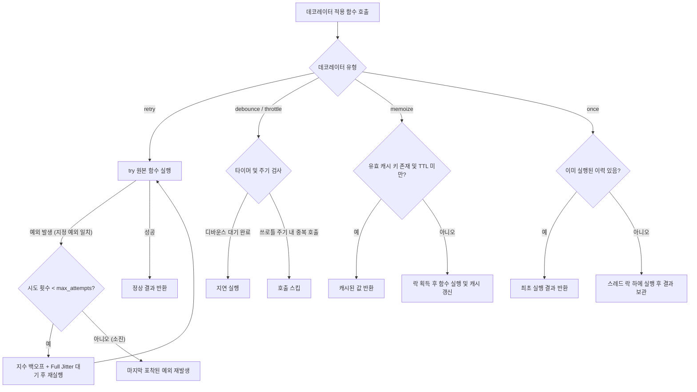
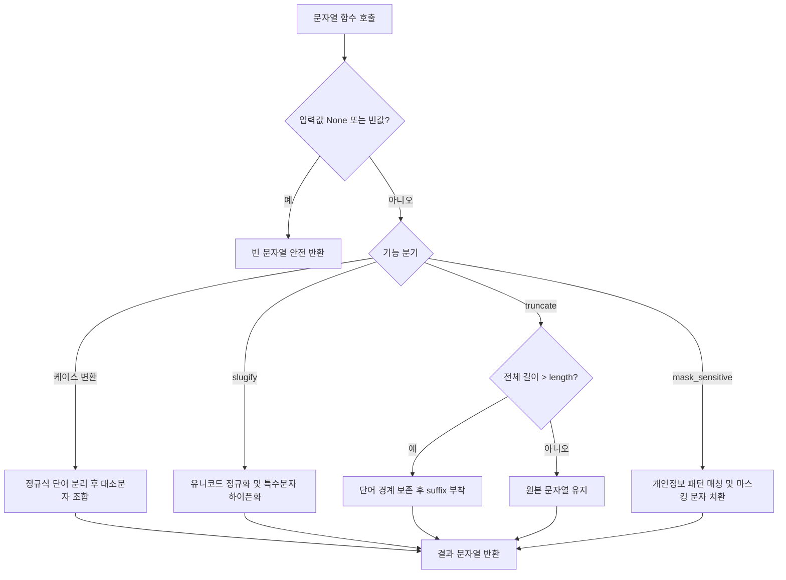

# [quiver] 유틸리티 모듈 상세기능정의서 (Modular FSD)

- **도메인**: `quiver` 코어 유틸리티 (Collections, Behavior, Strings, Scope, Timing)
- **작성자**: 기획 명세 작성가 (`spec-writer`)
- **문서 버전**: v1.1
- **상태**: Approved

---

## 단위 기능 상세 명세 (단위기능별 7대 상세 명세 완비)

---

### [FUNC-COLL-001] 불변 컬렉션 조작 함수군 (Collections)

#### 1. 기본 정보
- **기능명**: 불변 컬렉션 조작 함수군 (`chunk`, `flatten`, `group_by`, `partition`, `uniq_by`, `windowed`, `deep_get`, `deep_set`, `merge`, `pick`, `omit`)
- **기능 ID**: `FUNC-COLL-001`
- **대응 요구사항 ID**: `REQ-COLL-001`, `REQ-TYP-001`
- **대상 모듈 코드**: `MOD-COLL-001` (`quiver.collections`)
- **우선순위**: Must Have
- **관련 액터 (Actor)**: 라이브러리 사용자 (백엔드 및 데이터 엔지니어)

#### 2. 사전 조건 (Pre-conditions)
1. Python 3.10 이상의 런타임 환경에서 `quiver.collections` 모듈이 임포트되어 있어야 함.
2. 입력으로 전달되는 시퀀스 또는 매핑 객체는 읽기 접근이 가능해야 함.
3. 1회성 제너레이터 인입 시, 다중 순회가 필요한 연산(`group_by`, `partition`)은 내부에서 안전하게 튜플이나 리스트로 메모리에 고정(Materialize)되어야 함.

#### 3. 시스템 동작 흐름 및 플로우차트 (Step-by-Step Flow & Flowchart)
1. 호출자가 컬렉션 처리 함수를 호출한다 (예: `chunk(orders, size=100)`, `deep_get(payload, "user.address.zipcode")`).
2. 시스템은 입력 인자의 유효성(예: `size >= 1`, `depth >= 0`, `separator` 공백 여부)을 검증한다. 유효하지 않은 경우 `ValueError` 또는 `TypeError`를 발생시킨다.
3. 연산 수행 시 원본 데이터 객체를 직접 수정하지 않고, **새로운 리스트나 딕셔너리를 생성하거나 제너레이터를 반환**한다:
   - `chunk`: 입력 이터러블을 `size` 단위로 묶은 리스트를 순차 반환하는 제너레이터 생성. 나누어떨어지지 않는 잔여 원소는 마지막 청크에 포함.
   - `flatten`: 중첩 이터러블을 평탄화하되, 파이썬 특성상 무한 루프나 원하지 않는 글자 쪼개짐을 유발하는 문자열(`str`), 바이트(`bytes`), 매핑(`dict`)은 단일 원소(Atomic)로 간주하여 보존.
   - `group_by`: `key_fn(item)` 기준으로 딕셔너리 키를 구성하고 원래 순서대로 그룹 리스트에 추가.
   - `partition`: 술어 함수 `predicate` 결과에 따라 `(참_리스트, 거짓_리스트)` 튜플 반환.
   - `uniq_by`: 원소 또는 `key_fn(item)` 결과를 식별자로 사용하여 첫 등장 순서를 보존한 리스트 반환.
   - `windowed`: 슬라이딩 윈도우 크기 `size`, 이동 간격 `step`에 따른 튜플 제너레이터 반환.
   - `deep_get` / `deep_set`: 구분자 경로로 중첩 딕셔너리를 탐색/갱신. `deep_set`은 Copy-on-Write 방식으로 신규 딕셔너리 반환.
   - `merge`: 복수의 딕셔너리를 좌에서 우로 재귀 병합한 신규 딕셔너리 반환.
   - `pick` / `omit`: 지정된 키만 선택하거나 제외한 신규 딕셔너리 반환.
4. 독립된 신규 객체 또는 제너레이터 이터레이터를 호출자에게 반환한다.

```mermaid
flowchart TD
    A[컬렉션 함수 호출] --> B{파라미터 유효성 검증}
    B -- 검증 실패 (size <= 0 등) --> C[ValueError / TypeError 발생]
    B -- 통과 --> D{함수 성격 판별}
    D -- chunk / windowed --> E[메모리 절약형 제너레이터 반환]
    D -- flatten --> F[str/bytes/dict 원자성 보존 평탄화]
    D -- group_by / partition --> G[순서 보존 버킷/튜플 분류]
    D -- deep_set / merge --> H[Copy-on-Write 신규 딕셔너리 생성]
    D -- pick / omit / uniq_by --> I[고유 필터링 결과 생성]
    E --> J[호출자에게 결과 반환 (원본 100% 불변)]
    F --> J
    G --> J
    H --> J
    I --> J
```

#### 4. 화면 표시 및 입력 데이터 항목 명세 (UI Data Elements - 8대 표준 컬럼)

| 항목명 | 화면 표시/입력 구분 | UI 컴포넌트 | 필수 여부 | 데이터 타입 / 제약 | 기본값 | 유효성 검증 규칙 (Validation) | 노출/수정 조건 |
| :--- | :---: | :--- | :---: | :--- | :---: | :--- | :--- |
| `iterable` | 함수 인자 (Input) | Function Argument | 필수 | `Iterable[T]` | - | `collections.abc.Iterable` 구현체 | 상시 |
| `size` | 함수 인자 (Input) | Function Argument | 필수 (chunk/windowed) | `int` | - | $\text{size} \ge 1$, 정수형 필수 | chunk, windowed 호출 시 |
| `step` | 옵션 플래그 (Config) | Keyword Option | 선택 | `Optional[int]` | `None` (size와 동일) | $\text{step} \ge 1$ | 윈도우 보폭 설정 시 |
| `depth` | 옵션 플래그 (Config) | Keyword Option | 선택 | `Optional[int]` | `None` (제한 없음) | $\text{depth} \ge 0$ | 평탄화 깊이 제한 시 |
| `key_fn` | 함수 인자 (Input) | Function Argument | 선택 | `Optional[Callable[[T], K]]` | `None` (원소 자체) | 1개 인자를 받는 호출 가능 객체 | group_by, uniq_by 시 |
| `predicate` | 함수 인자 (Input) | Function Argument | 필수 (partition) | `Callable[[T], bool]` | - | 불리언을 반환하는 함수 | partition 호출 시 |
| `path` | 함수 인자 (Input) | Function Argument | 필수 (deep_*) | `Union[str, Sequence[Union[str, int]]]` | - | 문자열 또는 키 시퀀스 | 중첩 접근/갱신 시 |
| `value` | 함수 인자 (Input) | Function Argument | 필수 (deep_set) | `Any` | - | 제약 없음 | 심층 값 갱신 시 |
| `separator` | 옵션 플래그 (Config) | Keyword Option | 선택 | `str` | `"."` | 길이 1 이상의 비어있지 않은 문자열 | 경로 분리 시 |
| `deep` | 옵션 플래그 (Config) | Keyword Option | 선택 | `bool` | `True` | 불리언 | 재귀 병합 여부 결정 시 |
| `keys` | 함수 인자 (Input) | VarArgs | 필수 (pick/omit) | `Tuple[K, ...]` | - | 1개 이상의 키 식별자 | 딕셔너리 필터링 시 |

#### 5. 비즈니스 규칙 (Business Rules)
- **BR-COLL-001-1 (불변성 원칙)**: 함수로 전달된 리스트, 딕셔너리, 세트의 원본 참조 및 내용을 일체 변경하지 않는다.
- **BR-COLL-001-2 (원자적 타입 평탄화 방어)**: `str`, `bytes`, `bytearray`, `dict`는 평탄화 대상 시퀀스로 분해하지 않고 하나의 독립 원소로 유지한다.
- **BR-COLL-001-3 (순서 보존 중복 제거)**: `uniq_by`는 첫 번째로 발견된 원소의 순서를 엄격히 유지하며, 해시가 불가능한 객체(`unhashable type`)는 `repr()` 또는 등가 비교 폴백을 통해 식별한다.
- **BR-COLL-001-4 (Copy-on-Write 딕셔너리 갱신)**: `deep_set`은 원본 딕셔너리를 얕은/깊은 복사하여 경로에 위치한 값을 변경한 새 딕셔너리를 반환한다.
- **BR-COLL-001-5 (청크 잔여분 보존)**: 원소 개수가 `size`로 나누어떨어지지 않을 때 마지막 청크의 잔여 데이터를 누락하지 않고 그대로 포함한다.

#### 6. 예외 처리 및 엣지 케이스 (Edge Cases & Exception Handling)

| 발생 상황 (Edge Case Scenario) | 시스템 처리 방식 | 사용자 안내 메시지 / 예외 |
| :--- | :--- | :--- |
| `size <= 0` 또는 `step <= 0` 입력 | 즉시 `ValueError` 발생 | `ValueError: size and step must be positive integers` |
| 빈 이터러블(`[]`, `set()`) 인입 | 빈 제너레이터 또는 빈 리스트를 즉시 반환 | 정상 처리 (빈 컬렉션 반환) |
| `deep_get` 탐색 경로 부재 | 예외 없이 호출자가 넘긴 `default` (`None` 기본값) 반환 | 정상 반환 (`KeyError` 방지) |
| 순환 참조(Self-referencing) 구조 평탄화 | `id()` 기반 방문 추적 세트로 순환 감지 시 예외 발생 | `ValueError: Circular reference detected in nested structure` |
| `pick`/`omit`에 존재하지 않는 키 포함 | 존재하는 키만 필터링하고 누락 키는 무시 | 정상 처리 (`KeyError` 미발생) |

#### 7. 비즈니스 에러 코드 매핑

| 비즈니스 에러 코드 | 발생 사유 | HTTP 상태 코드 매핑 / 표준 예외 | 클라이언트 표시 / 예외 형태 |
| :--- | :--- | :---: | :--- |
| `ERR_COLL_INVALID_SIZE` | 청크/윈도우 크기가 1 미만 | `ValueError` (400 Bad Request) | `ValueError: size must be >= 1` |
| `ERR_COLL_INVALID_DEPTH` | 평탄화 깊이가 음수인 경우 | `ValueError` (400 Bad Request) | `ValueError: depth must be >= 0` |
| `ERR_COLL_CYCLIC_REF` | 중첩 컬렉션 순환 참조 감지 | `ValueError` (422 Unprocessable) | `ValueError: Cyclic reference detected` |
| `ERR_COLL_TYPE_MISMATCH` | 이터러블이 아닌 객체 전달 | `TypeError` (400 Bad Request) | `TypeError: Expected Iterable, got <type>` |

---

### [FUNC-BEHV-001] 함수 제어 및 합성 데코레이터 (Behavior)

#### 1. 기본 정보
- **기능명**: 함수 제어 및 합성 데코레이터군 (`pipe`, `compose`, `curry`, `once`, `debounce`, `throttle`, `memoize with TTL`, `retry`)
- **기능 ID**: `FUNC-BEHV-001`
- **대응 요구사항 ID**: `REQ-BEHV-001`, `REQ-ASYNC-001`, `REQ-TYP-001`
- **대상 모듈 코드**: `MOD-BEHV-001` (`quiver.behavior`)
- **우선순위**: Must Have
- **관련 액터 (Actor)**: 라이브러리 사용자 (백엔드 엔지니어, 아키텍트)

#### 2. 사전 조건 (Pre-conditions)
1. 래핑 대상 함수가 호출 가능한 객체(`Callable`)여야 함.
2. 멀티스레드 환경에서 `once`, `debounce`, `throttle`, `memoize`가 호출될 때 스레드 간 상태 공유가 안전하게 보호되어야 함.
3. `retry` 적용 함수는 일시적 네트워크 예외 또는 지정된 예외 클래스를 발생시킬 수 있어야 함.

#### 3. 시스템 동작 흐름 및 플로우차트 (Step-by-Step Flow & Flowchart)
1. **함수 합성 (`pipe`, `compose`)**:
   - `pipe`: 첫 번째 함수에 값을 넣고, 이후 함수들에 이전 결괏값을 좌에서 우로 넘기며 최종값 산출.
   - `compose`: 수학적 함수 합성과 같이 맨 오른쪽 함수부터 왼쪽 함수 순서로 실행되는 신규 합성 함수 생성.
2. **커링 (`curry`)**:
   - 함수의 매개변수 시그니처(`inspect.signature`)를 분석하여, 요구 인자가 충족될 때까지 클로저를 반환하다가 인자가 모두 채워지면 원본 함수 실행.
3. **1회 실행 보장 (`once`)**:
   - `threading.Lock`을 획득하고 실행 여부 플래그를 검사. 첫 호출 시 실행 결과를 캐싱하고, 두 번째 호출부터는 함수를 재실행하지 않고 캐시된 값을 즉시 반환.
4. **시간 제어 (`debounce`, `throttle`)**:
   - `debounce`: 호출 인입 시 이전 활성 타이머(`threading.Timer`)를 취소하고 새로 예약. 설정된 `wait_seconds` 동안 추가 호출이 없으면 최종 실행.
   - `throttle`: 호출 시 이전 실행 시각과 비교하여 최소 주기 `interval_seconds`가 지나지 않았으면 실행을 스킵하고 직전 결과 또는 `None` 반환.
5. **TTL 캐시 (`memoize`)**:
   - 인자 기반 캐시 키 `(args, frozenset(kwargs.items()))`를 생성하고 만료 시각을 검사. 유효하면 캐시 반환, 만료 시 락 하에 재계산.
6. **지수 백오프 스마트 재시도 (`retry`)**:
   - 실행 중 `exceptions`에 지정된 예외 포착 시 시도 횟수를 증가시키고, Full Jitter 지수 백오프 대기 시간만큼 `time.sleep` 후 재실행. 최대 횟수 초과 시 최종 예외 재발생.



#### 4. 화면 표시 및 입력 데이터 항목 명세 (UI Data Elements - 8대 표준 컬럼)

| 항목명 | 화면 표시/입력 구분 | UI 컴포넌트 | 필수 여부 | 데이터 타입 / 제약 | 기본값 | 유효성 검증 규칙 (Validation) | 노출/수정 조건 |
| :--- | :---: | :--- | :---: | :--- | :---: | :--- | :--- |
| `fn` | 함수 인자 (Input) | Function Argument | 필수 | `Callable[..., Any]` | - | 호출 가능한 객체 | 데코레이터 적용 시 |
| `max_attempts` | 옵션 플래그 (Config) | Decorator Param | 선택 | `int` | `3` | $\text{max\_attempts} \ge 1$ | retry 설정 시 |
| `backoff_base` | 옵션 플래그 (Config) | Decorator Param | 선택 | `float` | `0.5` (초) | $\text{backoff\_base} > 0.0$ | 재시도 기본 지연 |
| `backoff_max` | 옵션 플래그 (Config) | Decorator Param | 선택 | `float` | `60.0` (초) | $\text{backoff\_max} \ge \text{backoff\_base}$ | 재시도 최대 지연 상한 |
| `jitter` | 옵션 플래그 (Config) | Decorator Param | 선택 | `bool` | `True` | 불리언 | 지터 적용 여부 |
| `exceptions` | 옵션 플래그 (Config) | Decorator Param | 선택 | `Tuple[Type[Exception], ...]` | `(Exception,)` | 1개 이상의 예외 클래스 튜플 | 재시도 대상 예외 필터 |
| `wait_seconds` | 옵션 플래그 (Config) | Decorator Param | 필수 (debounce) | `float` | - | $\text{wait\_seconds} > 0.0$ | debounce 대기 시간 |
| `interval_seconds` | 옵션 플래그 (Config) | Decorator Param | 필수 (throttle) | `float` | - | $\text{interval\_seconds} > 0.0$ | throttle 주기 |
| `ttl_seconds` | 옵션 플래그 (Config) | Decorator Param | 선택 (memoize) | `Optional[float]` | `None` (무기한) | $\text{ttl\_seconds} > 0.0$ 또는 `None` | 캐시 유효 시간 |
| `maxsize` | 옵션 플래그 (Config) | Decorator Param | 선택 (memoize) | `Optional[int]` | `128` | $\text{maxsize} \ge 1$ 또는 `None` | LRU 캐시 최대 크기 |

#### 5. 비즈니스 규칙 (Business Rules)
- **BR-BEHV-001-1 (재시도 지연 시간 알고리즘)**: $k$번째 재시도 대기 시간 $T_{wait}$는 아래 수식을 따르며, 다수의 워커가 동시에 재시도할 때 발생하는 Thundering Herd 문제를 방지한다:
  $$T_{temp} = \min(\text{backoff\_max}, \text{backoff\_base} \times 2^{k-1})$$
  $$T_{wait} = \text{random.uniform}(0, T_{temp}) \quad (\text{단, jitter=False인 경우 } T_{wait} = T_{temp})$$
- **BR-BEHV-001-2 (once 예외 처리 시 상태 복구)**: `once` 데코레이터 적용 함수 실행 중 예외가 발생하면 실패 상태를 캐싱하지 않고 플래그를 복구하여 다음 호출 시 재시도할 수 있도록 한다.
- **BR-BEHV-001-3 (캐시 키 안전 직렬화)**: `memoize` 호출 시 인자에 딕셔너리나 리스트 등 해시 불가능 객체가 포함되면 예외로 죽지 않고 `repr()` 문자열을 키로 안전 폴백한다.
- **BR-BEHV-001-4 (시그니처 및 메타데이터 보존)**: 모든 데코레이터는 `functools.wraps`를 엄격히 적용하여 `__name__`, `__doc__`, `__annotations__`를 보존한다.

#### 6. 예외 처리 및 엣지 케이스 (Edge Cases & Exception Handling)

| 발생 상황 (Edge Case Scenario) | 시스템 처리 방식 | 사용자 안내 메시지 / 예외 |
| :--- | :--- | :--- |
| `KeyboardInterrupt`, `SystemExit` 발생 | `retry`가 가로채지 않고 시스템 인터럽트를 즉시 상위로 전파 | 프로세스 정상 종료 유도 |
| `curry` 대상에 가변 인자(`*args`)가 있어 매개변수 수를 알 수 없음 | `arity`가 지정되지 않은 경우 `ValueError` 발생 | `ValueError: Variadic function requires explicit arity` |
| `wait_seconds` 또는 `interval_seconds`가 음수 | 즉시 `ValueError` 발생 | `ValueError: Wait/Interval must be positive number` |
| 비동기 코루틴 함수에 동기 전용 데코레이터 적용 | `inspect.iscoroutinefunction`을 검사하여 비동기 래퍼로 투명 분기 | 정상 비동기 처리 지원 |

#### 7. 비즈니스 에러 코드 매핑

| 비즈니스 에러 코드 | 발생 사유 | HTTP 상태 코드 매핑 / 표준 예외 | 클라이언트 표시 / 예외 형태 |
| :--- | :--- | :---: | :--- |
| `ERR_BEHV_MAX_RETRIES` | 재시도 한도 초과 | 원본 발생 예외 유지 | 원본 예외 스택 트레이스 전파 |
| `ERR_BEHV_INVALID_ARITY` | 커링 인자 수 감지 실패 | `ValueError` (400 Bad Request) | `ValueError: Invalid function arity` |
| `ERR_BEHV_INVALID_INTERVAL` | 시간 간격이 0 이하 | `ValueError` (400 Bad Request) | `ValueError: Interval must be > 0` |
| `ERR_BEHV_NOT_CALLABLE` | 호출 불가능한 객체에 래퍼 적용 | `TypeError` (400 Bad Request) | `TypeError: Target must be callable` |

---

### [FUNC-STR-001] 문자열 변환 및 보안 트랜스포머 (Strings)

#### 1. 기본 정보
- **기능명**: 문자열 변환 및 보안 트랜스포머군 (`to_camel_case`, `to_snake_case`, `to_kebab_case`, `to_pascal_case`, `to_title_case`, `slugify`, `truncate`, `mask_sensitive`)
- **기능 ID**: `FUNC-STR-001`
- **대응 요구사항 ID**: `REQ-STR-001`, `REQ-TYP-001`
- **대상 모듈 코드**: `MOD-STR-001` (`quiver.strings`)
- **우선순위**: Must Have
- **관련 액터 (Actor)**: 라이브러리 사용자 (백엔드 엔지니어, 보안 담당자)

#### 2. 사전 조건 (Pre-conditions)
1. 변환 대상 입력값은 문자열(`str`)이거나 `None`일 수 있음.
2. `mask_sensitive`는 마스킹 대상 패턴 식별자(이메일, 주민번호, 카드번호, 전화번호) 또는 기본 범용 범위를 지원해야 함.

#### 3. 시스템 동작 흐름 및 플로우차트 (Step-by-Step Flow & Flowchart)
1. 호출자가 문자열 함수를 호출한다 (예: `to_snake_case("orderId")`, `mask_sensitive(log_msg)`).
2. 입력값이 `None`인 경우 예외로 중단되지 않고 빈 문자열(`""`)로 안전 변환한다 (`None` 방어).
3. 기능별 처리:
   - **케이스 변환**: 공백, 언더바(`_`), 대소문자 전환 지점을 정규식으로 토큰화하여 단어 리스트를 추출한 뒤 목표 포맷으로 결합.
   - **슬러그화 (`slugify`)**: 유니코드 NFKD 정규화 $\rightarrow$ ASCII 인코딩(옵션 시 한글 보존) $\rightarrow$ 특수문자를 구분자(`-`)로 치환 $\rightarrow$ 중복 구분자 정리.
   - **말줄임 (`truncate`)**: 문자열 길이가 `length`를 넘으면 자르고 접미사(`suffix`)를 부착하되, `preserve_words=True`인 경우 단어 중간 절단 방지.
   - **민감정보 마스킹 (`mask_sensitive`)**: 사전 컴파일된 고성능 정규식을 적용하여 개인정보를 마스킹 문자로 치환.



#### 4. 화면 표시 및 입력 데이터 항목 명세 (UI Data Elements - 8대 표준 컬럼)

| 항목명 | 화면 표시/입력 구분 | UI 컴포넌트 | 필수 여부 | 데이터 타입 / 제약 | 기본값 | 유효성 검증 규칙 (Validation) | 노출/수정 조건 |
| :--- | :---: | :--- | :---: | :--- | :---: | :--- | :--- |
| `text` | 함수 인자 (Input) | Function Argument | 필수 | `Optional[str]` | - | 문자열 (`None` 인입 시 빈 문자열 처리) | 상시 |
| `separator` | 옵션 플래그 (Config) | Keyword Option | 선택 (slugify) | `str` | `"-"` | 길이 1 이상의 문자열 | 슬러그 생성 시 |
| `allow_unicode` | 옵션 플래그 (Config) | Keyword Option | 선택 (slugify) | `bool` | `False` | 한글 등 유니코드 보존 여부 | 비영문 슬러그 생성 시 |
| `length` | 함수 인자 (Input) | Function Argument | 필수 (truncate) | `int` | - | $\text{length} \ge \text{len(suffix)}$ | 문자열 자르기 시 |
| `suffix` | 옵션 플래그 (Config) | Keyword Option | 선택 (truncate) | `str` | `"..."` | 접미사 문자열 | 말줄임 표기 커스텀 시 |
| `preserve_words` | 옵션 플래그 (Config) | Keyword Option | 선택 (truncate) | `bool` | `True` | 불리언 | 단어 중간 절단 방지 여부 |
| `pattern_type` | 옵션 플래그 (Config) | Keyword Option | 선택 (mask) | `Optional[Literal["email", "phone", "rrn", "card"]]` | `None` (자동 패턴 탐색) | 지원 리터럴 옵션 | 특정 패턴 마스킹 지정 시 |
| `mask_char` | 옵션 플래그 (Config) | Keyword Option | 선택 (mask) | `str` | `"*"` | 정확히 1글자 문자열 | 마스킹 문자 변경 시 |

#### 5. 비즈니스 규칙 (Business Rules)
- **BR-STR-001-1 (주민등록번호 마스킹)**: 생년월일 6자리와 뒷자리 성별 구분 1자리는 보존하고, 뒤 6자리는 마스킹한다 (`900101-1******`).
- **BR-STR-001-2 (신용카드 마스킹)**: 카드 16자리 중 식별용 앞 6자리(BIN)와 마지막 4자리는 남기고 중간 6자리를 마스킹한다 (`1234-56**-****-3456`).
- **BR-STR-001-3 (이메일 마스킹)**: 로컬 파트의 첫 1자와 마지막 1자를 제외한 중간을 마스킹하고 도메인은 보존한다 (`u***r@example.com`).
- **BR-STR-001-4 (말줄임 길이 불변식)**: `truncate` 반환값의 길이는 호출자가 지정한 `length`를 초과하지 않는다 ($\text{len}(\text{result}) \le \text{length}$).

#### 6. 예외 처리 및 엣지 케이스 (Edge Cases & Exception Handling)

| 발생 상황 (Edge Case Scenario) | 시스템 처리 방식 | 사용자 안내 메시지 / 예외 |
| :--- | :--- | :--- |
| `truncate`의 `length < len(suffix)` | 접미사 표기가 불가능하므로 `ValueError` 발생 | `ValueError: length must be >= len(suffix)` |
| `mask_char` 길이가 1이 아닌 경우 | 단일 문자 원칙 위반이므로 `ValueError` 발생 | `ValueError: mask_char must be a single character` |
| 유니코드 특수문자 및 이모지 자르기 | 파이썬 유니코드 문자열 슬라이싱으로 글자 깨짐 방지 | 정상 분할 |

#### 7. 비즈니스 에러 코드 매핑

| 비즈니스 에러 코드 | 발생 사유 | HTTP 상태 코드 매핑 / 표준 예외 | 클라이언트 표시 / 예외 형태 |
| :--- | :--- | :---: | :--- |
| `ERR_STR_INVALID_LENGTH` | `length`가 접미사보다 짧음 | `ValueError` (400 Bad Request) | `ValueError: length must be >= len(suffix)` |
| `ERR_STR_INVALID_MASK_CHAR` | `mask_char`가 1글자가 아님 | `ValueError` (400 Bad Request) | `ValueError: mask_char must be 1 character` |

---

### [FUNC-SCP-001] 스코프 확장 및 None 안전성 (Scope)

#### 1. 기본 정보
- **기능명**: 스코프 확장 및 None 안전성 함수군 (`let`, `also`/`tap`, `take_if`, `take_unless`, `coalesce`)
- **기능 ID**: `FUNC-SCP-001`
- **대응 요구사항 ID**: `REQ-SCP-001`, `REQ-TYP-001`
- **대상 모듈 코드**: `MOD-SCP-001` (`quiver.scope`)
- **우선순위**: Must Have
- **관련 액터 (Actor)**: 라이브러리 사용자 (백엔드 엔지니어)

#### 2. 사전 조건 (Pre-conditions)
1. 체이닝 대상 객체가 유효하거나 `None`일 수 있음.
2. `block` 또는 `predicate` 인자는 1개 인자를 취하는 호출 가능 객체(`Callable`)여야 함.

#### 3. 시스템 동작 흐름 및 플로우차트 (Step-by-Step Flow & Flowchart)
1. 호출자가 `let(user, lambda u: u.id)`, `also(data, logger.info)`, `coalesce(val1, val2, default)` 등을 호출한다.
2. 각 함수별 동작:
   - `let`: `block(target)`을 실행하여 그 반환값을 그대로 넘긴다.
   - `also` (별칭 `tap`): `block(target)`을 실행하되 블록의 반환값은 무시하고 **원본 `target` 객체를 그대로 반환**하여 체이닝 중간 로깅이나 유효성 검사를 수행한다.
   - `take_if`: 조건 `predicate(target)`이 참이면 `target`, 거짓이면 `None` 반환.
   - `take_unless`: 조건 `predicate(target)`이 참이면 `None`, 거짓이면 `target` 반환.
   - `coalesce`: 가변 인자 중 처음으로 발견되는 `not None` 값을 반환하며, 모두 `None`이면 `default` 반환.

```mermaid
flowchart TD
    A[스코프 함수 호출] --> B{함수 분기}
    B -- let --> C[block(target) 실행 결과 반환]
    B -- also / tap --> D[block(target) 실행 후 원본 target 반환]
    B -- take_if --> E{predicate(target) 참?}
    E -- 예 --> F[target 반환]
    E -- 아니오 --> G[None 반환]
    B -- take_unless --> H{predicate(target) 참?}
    H -- 예 --> G
    H -- 아니오 --> F
    B -- coalesce --> I[가변 인자 중 첫 Non-None 값 반환]
```

#### 4. 화면 표시 및 입력 데이터 항목 명세 (UI Data Elements - 8대 표준 컬럼)

| 항목명 | 화면 표시/입력 구분 | UI 컴포넌트 | 필수 여부 | 데이터 타입 / 제약 | 기본값 | 유효성 검증 규칙 (Validation) | 노출/수정 조건 |
| :--- | :---: | :--- | :---: | :--- | :---: | :--- | :--- |
| `target` | 함수 인자 (Input) | Function Argument | 필수 | `T` (Generic) | - | 모든 파이썬 객체 (`None` 허용) | 상시 |
| `block` | 함수 인자 (Input) | Function Argument | 필수 (let, also) | `Callable[[T], Any]` | - | 1개 인자를 받는 호출 가능 객체 | let, also 호출 시 |
| `predicate` | 함수 인자 (Input) | Function Argument | 필수 (take_*) | `Callable[[T], bool]` | - | 불리언 반환 함수 | take_if, take_unless 시 |
| `values` | 함수 인자 (Input) | VarArgs | 필수 (coalesce) | `Tuple[Optional[T], ...]` | - | 1개 이상의 값 목록 | coalesce 호출 시 |
| `default` | 옵션 플래그 (Config) | Keyword Option | 선택 (coalesce) | `Optional[T]` | `None` | 폴백 기본값 | coalesce 기본값 지정 시 |

#### 5. 비즈니스 규칙 (Business Rules)
- **BR-SCP-001-1 (also 객체 참조 무손실)**: `also`/`tap`은 내부 블록의 실행 결과와 무관하게 입력된 `target` 객체 참조를 그대로 반환한다 ($\text{return\_value} \equiv \text{target}$).
- **BR-SCP-001-2 (coalesce 단락 평가)**: 제너레이터나 호출 가능 객체가 전달될 경우 첫 유효값을 찾는 즉시 후속 평가를 중단(Short-circuit)한다.

#### 6. 예외 처리 및 엣지 케이스 (Edge Cases & Exception Handling)

| 발생 상황 (Edge Case Scenario) | 시스템 처리 방식 | 사용자 안내 메시지 / 예외 |
| :--- | :--- | :--- |
| `block` 또는 `predicate`가 함수가 아님 | 즉시 `TypeError` 발생 | `TypeError: block/predicate must be callable` |
| `coalesce()` 인자가 전혀 없음 | 예외 없이 `default` (`None`) 반환 | `None` 반환 |
| `block` 내부에서 발생한 예외 | 예외를 삼키지 않고 상위로 전파 | 원본 예외 발생 |

#### 7. 비즈니스 에러 코드 매핑

| 비즈니스 에러 코드 | 발생 사유 | HTTP 상태 코드 매핑 / 표준 예외 | 클라이언트 표시 / 예외 형태 |
| :--- | :--- | :---: | :--- |
| `ERR_SCP_NOT_CALLABLE` | 인자로 전달된 객체가 함수가 아님 | `TypeError` (400 Bad Request) | `TypeError: Expected callable object` |

---

### [FUNC-TIME-001] 시간 계측 및 속도 제한 (Timing)

#### 1. 기본 정보
- **기능명**: 시간 계측 및 속도 제한군 (`Stopwatch`, `measure_time`, `RateLimiter`)
- **기능 ID**: `FUNC-TIME-001`
- **대응 요구사항 ID**: `REQ-TIME-001`, `REQ-TYP-001`
- **대상 모듈 코드**: `MOD-TIME-001` (`quiver.timing`)
- **우선순위**: Must Have
- **관련 액터 (Actor)**: 라이브러리 사용자 (백엔드 엔지니어, 성능 튜닝 담당자)

#### 2. 사전 조건 (Pre-conditions)
1. OS 단조 시계(`time.perf_counter_ns`, `time.monotonic`)가 지원되어야 함.
2. `RateLimiter`는 멀티스레드 환경에서 안전하게 토큰을 소비할 수 있도록 내부 락을 보유해야 함.

#### 3. 시스템 동작 흐름 및 플로우차트 (Step-by-Step Flow & Flowchart)
1. **정밀 스톱워치 (`Stopwatch`)**:
   - `sw.start()`: `time.perf_counter_ns()`로 시작 시각 $t_0$ 기록.
   - `sw.lap()`: 이전 랩 시각과의 차이($\Delta t_{lap}$) 및 누적 시간 기록.
   - `sw.stop()`: 계측 종료 및 총 경과 시간(초 단위 `float`) 반환.
2. **소요 시간 측정기 (`measure_time`)**:
   - 컨텍스트 매니저(`with measure_time() as t:`) 및 데코레이터(`@measure_time()`) 겸용 지원.
   - 블록 진입 시각과 탈출 시각의 차이를 계산하여 콜백 호출 또는 속성에 바인딩.
3. **토큰 버킷 속도 제한기 (`RateLimiter`)**:
   - 용량 $C = burst$, 충전율 $r = rate / per\_seconds$.
   - `acquire(tokens)`: 락 획득 $\rightarrow$ 경과 시간에 따른 토큰 보충 $\rightarrow$ 충분하면 즉시 차감 후 `True` 반환 $\rightarrow$ 부족하고 `blocking=True`이면 대기 후 차감 $\rightarrow$ 부족하고 `blocking=False`이거나 타임아웃 초과 시 `False` 반환.

```mermaid
flowchart TD
    A[RateLimiter.acquire() 호출] --> B[threading.Lock 획득]
    B --> C[시간 경과에 따른 토큰 충전 계산]
    C --> D{가용 토큰 >= 요청 토큰?}
    D -- 예 --> E[토큰 차감 및 Lock 해제 후 True 반환]
    D -- 아니오 --> F{blocking 여부 및 timeout 확인}
    F -- non-blocking 또는 타임아웃 초과 --> G[Lock 해제 후 False 반환]
    F -- blocking 대기 가능 --> H[충전 소요 시간만큼 time.sleep 후 재확인]
    H --> C
```

#### 4. 화면 표시 및 입력 데이터 항목 명세 (UI Data Elements - 8대 표준 컬럼)

| 항목명 | 화면 표시/입력 구분 | UI 컴포넌트 | 필수 여부 | 데이터 타입 / 제약 | 기본값 | 유효성 검증 규칙 (Validation) | 노출/수정 조건 |
| :--- | :---: | :--- | :---: | :--- | :---: | :--- | :--- |
| `rate` | 함수 인자 (Input) | Function Argument | 필수 (RateLimiter) | `float` | - | $\text{rate} > 0.0$ | 제한기 생성 시 |
| `per_seconds` | 옵션 플래그 (Config) | Keyword Option | 선택 (RateLimiter) | `float` | `1.0` | $\text{per\_seconds} > 0.0$ | 주기 기준 초 |
| `burst` | 옵션 플래그 (Config) | Keyword Option | 선택 (RateLimiter) | `Optional[float]` | `None` (rate와 동일) | $\text{burst} \ge \text{rate}$ | 최대 버스트 용량 |
| `tokens` | 함수 인자 (Input) | Function Argument | 선택 (acquire) | `float` | `1.0` | $\text{tokens} > 0.0$ | 토큰 요청량 |
| `blocking` | 옵션 플래그 (Config) | Keyword Option | 선택 (acquire) | `bool` | `True` | 불리언 | 대기 여부 |
| `timeout` | 옵션 플래그 (Config) | Keyword Option | 선택 (acquire) | `Optional[float]` | `None` (무제한) | $\text{timeout} \ge 0.0$ 또는 `None` | 최대 대기 시간 |
| `unit` | 옵션 플래그 (Config) | Keyword Option | 선택 (measure) | `Literal["s", "ms", "us", "ns"]` | `"ms"` | 허용 단위 문자열 | 소요시간 변환 단위 |
| `callback` | 옵션 플래그 (Config) | Keyword Option | 선택 (measure) | `Optional[Callable[[float], None]]` | `None` | 호출 가능한 함수 | 시간 측정 완료 리포트 |

#### 5. 비즈니스 규칙 (Business Rules)
- **BR-TIME-001-1 (모노토닉 타이머 준수)**: 시스템 시계 조작이나 NTP 동기화에 영향을 받지 않도록 모든 시각 측정은 반드시 `time.perf_counter_ns()` 또는 `time.monotonic()`만을 사용한다.
- **BR-TIME-001-2 (버킷 상한 고정)**: 경과 시간에 따라 충전되는 토큰 양은 설정된 `burst` 용량을 초과할 수 없다.
- **BR-TIME-001-3 (스레드 안전성 보장)**: `RateLimiter`는 `threading.Lock` 하에 토큰을 차감하여 다중 스레드 동시 진입 시에도 토큰 초과 소비가 발생하지 않는다.

#### 6. 예외 처리 및 엣지 케이스 (Edge Cases & Exception Handling)

| 발생 상황 (Edge Case Scenario) | 시스템 처리 방식 | 사용자 안내 메시지 / 예외 |
| :--- | :--- | :--- |
| `rate <= 0` 또는 `per_seconds <= 0` | 즉시 `ValueError` 발생 | `ValueError: rate and per_seconds must be positive numbers` |
| `acquire(tokens)` 요청량이 `burst` 초과 | 영구히 만족할 수 없으므로 `ValueError` 발생 | `ValueError: Requested tokens exceeds burst capacity` |
| 정지 상태 스톱워치에서 `lap()` 호출 | 실행 중이 아니므로 `RuntimeError` 발생 | `RuntimeError: Stopwatch is not running; call start() first` |

#### 7. 비즈니스 에러 코드 매핑

| 비즈니스 에러 코드 | 발생 사유 | HTTP 상태 코드 매핑 / 표준 예외 | 클라이언트 표시 / 예외 형태 |
| :--- | :--- | :---: | :--- |
| `ERR_TIME_INVALID_RATE` | 제한 속도가 0 이하 | `ValueError` (400 Bad Request) | `ValueError: Rate must be > 0` |
| `ERR_TIME_EXCEEDS_BURST` | 요청량이 버킷 용량 초과 | `ValueError` (400 Bad Request) | `ValueError: Requested tokens exceeds burst` |
| `ERR_TIME_STOPWATCH_NOT_RUNNING`| 정지 상태 스톱워치 조작 | `RuntimeError` (409 Conflict) | `RuntimeError: Stopwatch is not running` |
