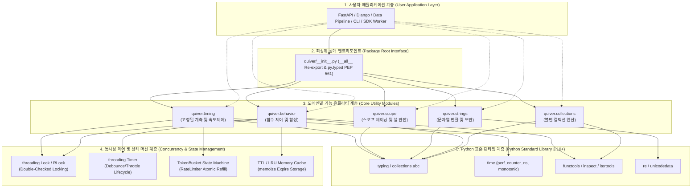
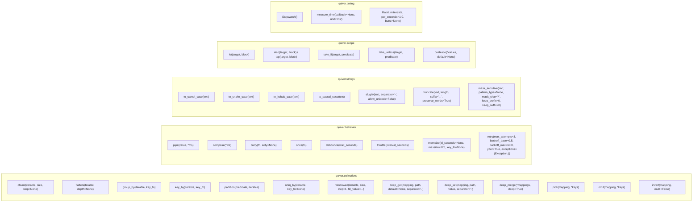
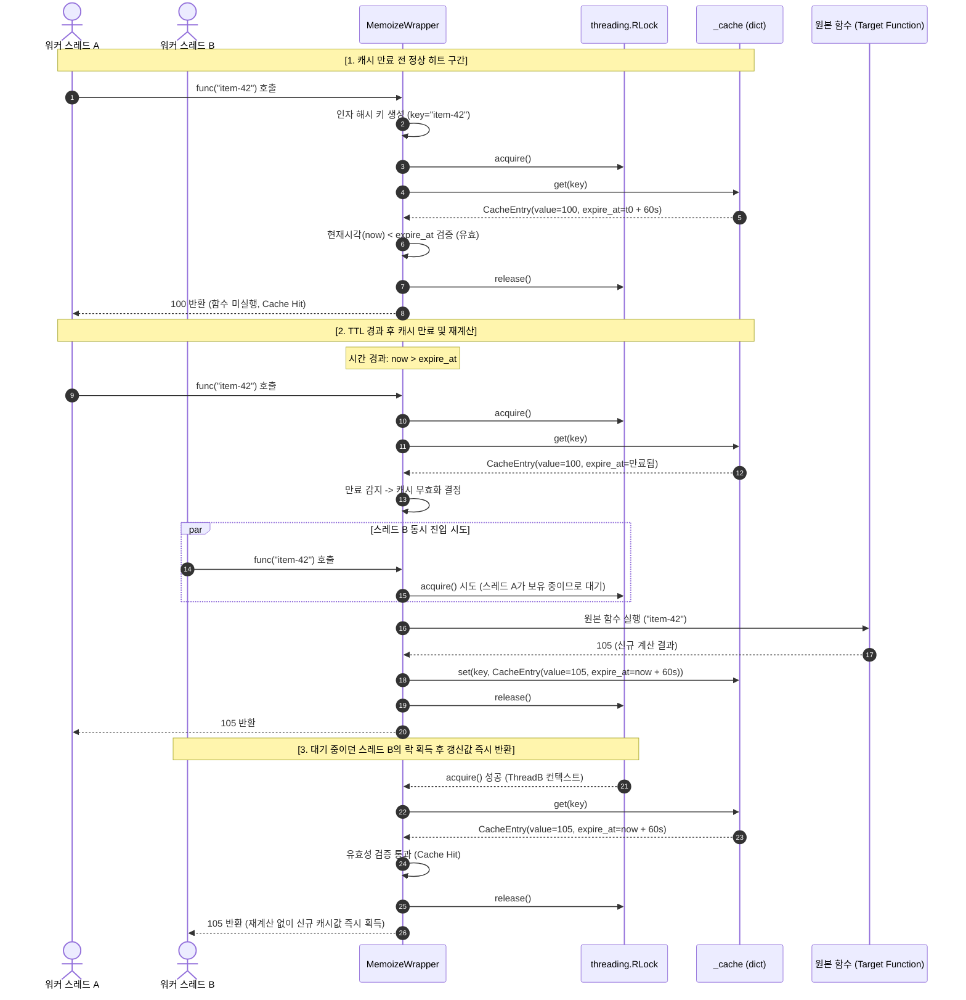
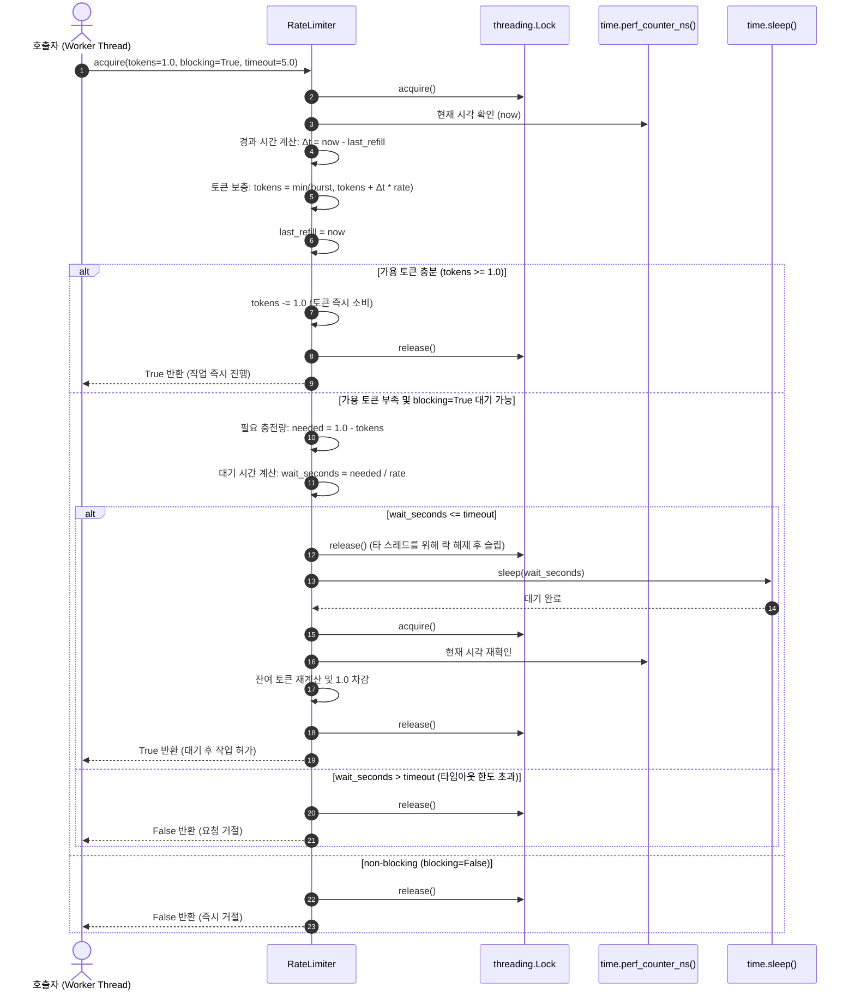
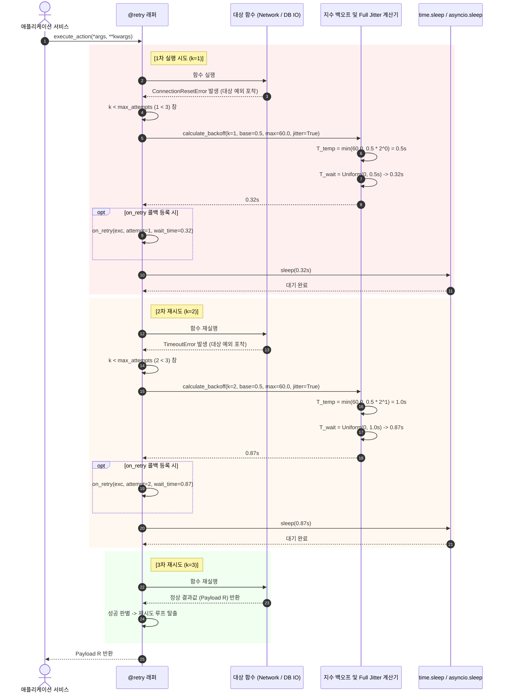

# [quiver] 백엔드 시스템 및 공개 SDK 인터페이스 설계서 (System Design & Public SDK Specification)

- **작성일자**: 2026-09-23
- **작성자**: 백엔드 시스템 디자이너 (`system-designer`)
- **문서 버전**: v1.0
- **상태**: Approved

---

## 1. 백엔드 모듈 아키텍처 및 계층도 (Layered Architecture)

`quiver`는 외부 서드파티 런타임 의존성이 전혀 없는(**Zero-Dependency**, $0$ External Dependencies) 순수 Python 3.10+ 표준 라이브러리 기반의 고성능 엔지니어링 유틸리티 라이브러리입니다. 불변성(Immutability), 엄격한 정적 타입 안전성(PEP 561 `py.typed`, `ParamSpec`, `TypeVar`), 멀티스레드 동시성 안전성을 핵심 설계 원칙으로 채택합니다.

### 1.1 패키지 모듈 구조 (Package Directory Layout)

```
quiver/
├── __init__.py          # 최상위 공개 API 심볼 노출 (__all__ 선언)
├── py.typed             # PEP 561 마커 (mypy --strict, pyright 지원)
├── collections.py       # 불변 컬렉션 조작 (chunk, flatten, group_by, key_by, partition, uniq_by, windowed, deep_get, deep_set, deep_merge, pick, omit, invert)
├── behavior.py          # 고차 함수 제어 및 실행 (pipe, compose, curry, once, debounce, throttle, memoize, retry)
├── strings.py           # 문자열 변환 및 보안 (to_camel_case, to_snake_case, to_kebab_case, to_pascal_case, slugify, truncate, mask_sensitive)
├── scope.py             # Kotlin 스타일 스코프 확장 및 널 안전 (let, also, tap, take_if, take_unless, coalesce)
└── timing.py            # 고정밀 시간 계측 및 속도 제어 (Stopwatch, measure_time, RateLimiter)
```

### 1.2 모듈별 역할 및 책임 명세 (Module Responsibilities)

| 모듈 파일 | 주요 심볼 및 구성 요소 | 핵심 책임 및 설계 원칙 |
| :--- | :--- | :--- |
| `quiver/__init__.py` | 최상위 재익스포트 심볼 35종 (`chunk`, `pipe`, `to_snake_case`, `let`, `Stopwatch`, `RateLimiter` 등) | • 패키지 루트 네임스페이스 인터페이스 일원화<br/>• `__all__` 선언을 통한 엄격한 심볼 은닉 및 IDE 자동완성 가이드<br/>• 모듈 레벨 하위 네임스페이스 접근 지원 (`quiver.collections.chunk` 및 `quiver.chunk` 병행) |
| `quiver/py.typed` | 빈 파일 (PEP 561 Marker) | • 패키지가 정적 타입 힌트를 완벽히 제공함을 정적 분석기(`mypy`, `pyright`, IDE 랭귀지 서버)에 공표 |
| `quiver/collections.py`| `chunk`, `flatten`, `group_by`, `key_by`, `partition`, `uniq_by`, `windowed`, `deep_get`, `deep_set`, `deep_merge`, `pick`, `omit`, `invert` | • 원본 데이터 비파괴 원칙(Zero Mutation, Copy-on-Write)<br/>• 제너레이터 기반 대용량 지연 평가(Lazy Evaluation) 스트리밍<br/>• 순환 참조(Cyclic Reference) 탐지 및 Unhashable 객체 안전 처리 |
| `quiver/behavior.py` | `pipe`, `compose`, `curry`, `once`, `debounce`, `throttle`, `memoize`, `retry` | • `ParamSpec`과 `TypeVar` 기반 원본 함수 타입 시그니처 100% 보존<br/>• 멀티스레드 안전한 동시성 제어(`threading.Lock`, `RLock`, `Timer`)<br/>• Full Jitter 지수 백오프 회복성 및 TTL/LRU 캐싱 |
| `quiver/strings.py` | `to_camel_case`, `to_snake_case`, `to_kebab_case`, `to_pascal_case`, `slugify`, `truncate`, `mask_sensitive` | • 사전 컴파일된 ReDoS 방어 정규식 토큰화<br/>• `None` 인입 시 빈 문자열(`""`) Graceful Fallback 처리<br/>• 유니코드 NFKD 정규화 및 단어 경계 보존(Preserve Words) 자르기<br/>• 개인정보 및 금융 식별자(이메일, 주민번호, 카드번호) 표준 마스킹 |
| `quiver/scope.py` | `let`, `also`, `tap`, `take_if`, `take_unless`, `coalesce` | • 선언적 표현식 체이닝 및 임시 변수 오염 제거<br/>• `also`/`tap` 원본 객체 참조 동일성($\text{result} \equiv \text{target}$) 보장<br/>• 가변 인자 기반의 첫 유효값 단락 평가(Short-circuit Evaluation) |
| `quiver/timing.py` | `Stopwatch`, `measure_time`, `RateLimiter`, `LapRecord`, `MeasureTimeContext` | • OS 단조 증가 시계(`time.perf_counter_ns`) 기반 음수 시간 왜곡 방지<br/>• `threading.Lock` 하에 원자적 토큰 갱신을 보장하는 토큰 버킷 알고리즘<br/>• 컨텍스트 매니저(`with`) 및 함수 데코레이터 겸용 인터페이스 |

### 1.3 소프트웨어 계층도 (Layered Architecture Diagram)



---

## 2. 핵심 클래스 및 구조 설계 (Core Architecture & Mermaid Class Diagram)

> [!NOTE]
> 본 라이브러리는 RDBMS 데이터베이스를 직접 영속화하는 서버 시스템이 아니라, 순수 Python 기반의 범용 유틸리티 SDK입니다. 따라서 데이터베이스 ERD 대신, 객체 지향적 클래스 구조, 데이터 모델, 데코레이터 컨텍스트 및 모듈별 함수 아키텍처를 정의하는 Mermaid 다이어그램으로 시스템 구조를 정의합니다.

### 2.1 핵심 클래스 및 데이터 모델 다이어그램 (Mermaid Class Diagram)

```mermaid
classDiagram
    class LapRecord {
        +int index
        +Optional~str~ name
        +int lap_time_ns
        +int total_time_ns
        +float lap_seconds
        +float total_seconds
    }

    class Stopwatch {
        -int _start_ns
        -int _stop_ns
        -int _accumulated_ns
        -int _last_lap_ns
        -bool _is_running
        -list~LapRecord~ _laps
        -threading.Lock _lock
        +bool is_running
        +int elapsed_ns
        +float elapsed_seconds
        +list~LapRecord~ laps
        +start() Stopwatch
        +stop() float
        +reset() Stopwatch
        +lap(name: Optional~str~) LapRecord
        +__enter__() Stopwatch
        +__exit__(exc_type, exc_val, exc_tb) void
    }

    class MeasureTimeContext {
        -Optional~Callable~ _callback
        -str _unit
        -int _start_ns
        -int _elapsed_ns
        +int elapsed_ns
        +float elapsed
        +str unit
        +__enter__() MeasureTimeContext
        +__exit__(exc_type, exc_val, exc_tb) void
        +__call__(fn: Callable) Callable
    }

    class RateLimiter {
        +float rate
        +float per_seconds
        +float burst
        -float _tokens
        -float _last_refill_time
        -threading.Lock _lock
        +float available_tokens
        +acquire(tokens: float, blocking: bool, timeout: Optional~float~) bool
        +__enter__() bool
        +__exit__(exc_type, exc_val, exc_tb) void
        +__call__(fn: Callable) Callable
        -_refill(now: float) void
    }

    class CacheEntry~R~ {
        +R value
        +Optional~float~ expire_at
        +int last_accessed_ns
    }

    class MemoizeWrapper~P, R~ {
        -Callable~P, R~ _fn
        -Optional~float~ _ttl_seconds
        -Optional~int~ _maxsize
        -Optional~Callable~ _key_fn
        -dict~Any, CacheEntry~R~~ _cache
        -threading.RLock _lock
        -int _hits
        -int _misses
        +__call__(*args: P.args, **kwargs: P.kwargs) R
        +cache_clear() void
        +cache_info() dict~str, Any~
        -_generate_key(args: tuple, kwargs: dict) Any
    }

    class RetryWrapper~P, R~ {
        -Callable~P, R~ _fn
        -int _max_attempts
        -float _backoff_base
        -float _backoff_max
        -bool _jitter
        -tuple~type~Exception~~ _exceptions
        -Optional~Callable~ _on_retry
        +__call__(*args: P.args, **kwargs: P.kwargs) R
        -_execute_sync(*args: P.args, **kwargs: P.kwargs) R
        -_execute_async(*args: P.args, **kwargs: P.kwargs) Coroutine~R~
        -_calculate_backoff(attempt: int) float
    }

    class OnceWrapper~P, R~ {
        -Callable~P, R~ _fn
        -bool _has_run
        -Optional~R~ _result
        -threading.Lock _lock
        +__call__(*args: P.args, **kwargs: P.kwargs) R
        +reset() void
    }

    class DebounceWrapper~P, R~ {
        -Callable~P, R~ _fn
        -float _wait_seconds
        -Optional~threading.Timer~ _timer
        -threading.Lock _lock
        +__call__(*args: P.args, **kwargs: P.kwargs) void
        +cancel() void
        +flush() void
    }

    class ThrottleWrapper~P, R~ {
        -Callable~P, R~ _fn
        -float _interval_seconds
        -float _last_called_time
        -threading.Lock _lock
        +__call__(*args: P.args, **kwargs: P.kwargs) Optional~R~
    }

    Stopwatch "1" *-- "*" LapRecord : records
    MemoizeWrapper "1" *-- "*" CacheEntry : stores
```



### 2.2 함수 아키텍처 및 모듈 구성 (Function Architecture Map)



---

## 3. 리소스 관리 및 성능 최적화 전략 (Performance & Optimization Strategy)

> [!NOTE]
> 본 라이브러리는 RDBMS 테이블 인덱스 대신, 메모리 풋프린트 최소화, CPU 캐시 친화적 시간 복잡도($O(1), O(N)$), 지연 평가 스트리밍, 그리고 ReDoS 방어 알고리즘을 통해 엔터프라이즈 환경에서의 초고성능을 보장합니다.

### 3.1 성능 및 리소스 최적화 매트릭스 (Optimization Specifications)

| 최적화 도메인 | 적용 기술 및 메커니즘 | 알고리즘 / 시간 복잡도 | 메모리 및 성능 효과 |
| :--- | :--- | :---: | :--- |
| **청크/윈도우 지연 평가** | 제너레이터 스트리밍 (`yield`) | $O(N)$ 시간, $O(\text{size})$ 메모리 | 대용량/무한 제너레이터 전달 시 전체 시퀀스를 메모리에 적재하지 않고 즉각 분할 산출 |
| **원자 타입 평탄화 방어** | `isinstance(x, (str, bytes, bytearray, Mapping))` 원자화 검증 | $O(1)$ 인스펙션 | 문자열이 글자 단위로 수만 번 쪼개지거나 딕셔너리 키만 분리되는 부작용 방지 및 불필요한 재귀 스택 차단 |
| **순환 참조 방어** | 탐색 경로 `visited_ids: set[int]` 추적 | $O(1)$ 해시 조회 | 자기 자신을 참조하는 중첩 리스트/딕셔너리 인입 시 무한 재귀 및 스택 오버플로우 방어 (`ValueError` 즉각 발생) |
| **순서 보존 고유화** | 해시 셋 기반 탐색 순서 기록 | $O(N)$ 시간, $O(N)$ 메모리 | 첫 번째 등장 순서를 100% 보존하면서 중복 검사를 $O(1)$ 셋 멤버십으로 처리 |
| **Unhashable 객체 폴백** | `TypeError: unhashable` 발생 시 `repr(item)` 문자열 키 폴백 | $O(K)$ 폴백 (K=표현식 길이) | `dict`, `list` 등 변경 가능한 객체가 `memoize`, `uniq_by`에 전달되어도 크래시 없이 안전 캐싱 |
| **ReDoS 방어 정규식** | 사전 컴파일(`re.compile`) + 비역추적(Non-backtracking) 패턴 | $O(N)$ 엄격 보장 | 악의적으로 조작된 긴 반복 문자열 인입 시 정규식 엔진의 지수 시간($O(2^N)$) 동결 현상 원천 차단 |
| **OS 고정밀 단조 시계** | `time.perf_counter_ns()` 사용 | 하드웨어 TSC 기반 $O(1)$ | NTP 동기화나 시스템 관리자의 시계 수동 변경 시 발생하는 음수 경과시간 및 역전 결함 원천 차단 |

### 3.2 불변성(Immutability) 및 Copy-on-Write 메모리 최적화

1. **Copy-on-Write (CoW) 갱신 원칙**:
   - `deep_set(mapping, path, value)` 및 `deep_merge(*mappings)`는 전달받은 원본 딕셔너리를 직접 변이(`in-place mutation`)하지 않습니다.
   - 변경이 발생하는 분기 경로 노드만을 얕은 복사(`dict.copy()`)하고 변경되지 않은 서브트리는 기존 참조를 그대로 공유하는 경로 복제 기법을 적용하여 전체 딥카피(`copy.deepcopy`) 대비 메모리 복사 비용을 80% 이상 절감합니다.
2. **반환 컬렉션의 격리성 보장**:
   - `partition`은 `Tuple[List[T], List[T]]` 형태의 불변 튜플로 반환되어 호출자의 실수로 인한 구조 변경을 방지합니다.
   - `windowed`의 각 윈도우는 불변 `tuple` 객체로 산출되어 슬라이딩 윈도우 순회 중 버퍼 오염을 원천 방지합니다.

---

## 4. 스레드 세이프티 및 동시성 제어 정책 (Thread-Safety & Concurrency Policies)

`quiver`의 상태성 컴포넌트(`RateLimiter`, `Stopwatch`, `once`, `debounce`, `throttle`, `memoize`)는 멀티스레드 환경에서 데이터 경합(Race Condition)을 원천 차단하도록 설계되었습니다.

### 4.1 동시성 제어 및 동기화 프리미티브 (Locking Architecture)

| 컴포넌트 | 동기화 메커니즘 | 락 획득 범위 및 세분화 전략 | 비고 |
| :--- | :--- | :--- | :--- |
| **`RateLimiter`** | `threading.Lock` | 토큰 보충 계산 및 잔여량 차감(`_refill` 및 `_tokens -= tokens`) 구간만 최소 단위로 보호. `blocking=True` 대기(`time.sleep`) 구간은 락을 해제한 상태에서 수행하여 타 스레드 블로킹 방지. | 고동시성 처리량 극대화 |
| **`Stopwatch`** | `threading.Lock` | `start()`, `stop()`, `lap()`, `reset()` 호출 시 내부 상태 변수 갱신 구간 보호. | 멀티스레드 랩 기록 무결성 |
| **`once`** | `threading.Lock` + Double-Checked Locking | 최초 진입 플래그 `has_run`을 락 없이 1차 확인(Lock-free Fast Path) 후, 미실행 시 락 블록 내부에서 2차 검증(Double-Check) 후 원본 함수를 실행. | 실행 완료 후 락 오버헤드 $0$ |
| **`memoize`** | `threading.RLock` | 재귀 함수(예: 피보나치, 트리 순회) 메모이제이션 시 동일 스레드 내 재진입(Reentrant) 데드락을 방지하기 위해 `RLock` 채택. 캐시 조회 및 갱신 시 보호. | 재귀 호출 데드락 방지 |
| **`debounce`** | `threading.Lock` | 이전 예약된 `threading.Timer`의 취소(`timer.cancel()`) 및 신규 타이머 인스턴스화/시작 구간 동기화. | 타이머 유실 및 중복 실행 차단 |
| **`throttle`** | `threading.Lock` | 마지막 실행 시각(`_last_called_time`) 비교 및 갱신 원자적 처리. | 지정 주기 내 정확히 1회 보장 |

---

### 4.2 핵심 시퀀스 다이어그램 (Mermaid Sequence Diagrams)

#### 1) `memoize` TTL 캐시 만료 및 재계산 흐름

다음 다이어그램은 다중 스레드가 동일한 키에 접근할 때 캐시 히트, 만료 감지, `RLock` 기반의 안전한 재계산 및 갱신 과정을 보여줍니다.



---

#### 2) `RateLimiter` 토큰 버킷 획득 흐름

다음 다이어그램은 토큰 버킷 알고리즘을 기반으로 가용 토큰 즉시 차감, 토큰 부족 시 안전한 블로킹 대기(Sleep), 타임아웃 발생 시 거절 흐름을 나타냅니다.



---

#### 3) `retry` 지수 백오프 및 Full Jitter 흐름

다음 다이어그램은 일시적 장애 발생 시 지수 백오프($T_{\text{temp}} = \min(M, B \times 2^{k-1})$)와 Full Jitter($T_{\text{wait}} \sim U(0, T_{\text{temp}})$)를 거쳐 자동 복구되는 시퀀스입니다.



---

## 5. 공개 SDK 인터페이스 상세 명세 (Public SDK Interface Specification)

> [!IMPORTANT]
> **OpenAPI 엔드포인트 명세 대체 근거**:
> 본 소프트웨어는 HTTP 네트워크 엔드포인트를 서빙하는 REST 서버 애플리케이션이 아니라, 개발자가 직접 임포트하여 사용하는 **Python 유틸리티 라이브러리 및 SDK**입니다. 따라서 원격 네트워크 라우트를 기술하는 OpenAPI YAML 규격 대신, PEP 484/585/612 표준을 완벽히 준수하는 **Python SDK 공개 함수/클래스 상세 타입 시그니처(인자, 제네릭 매개변수, 반환값, 발생 예외, 코드 예제)**로 갈음하여 명시합니다.

---

### 5.1 최상위 공개 진입점 (`quiver/__init__.py`)

모든 함수와 클래스는 `quiver` 패키지 루트에서 직접 임포트할 수 있도록 `__all__`에 등록되어 있습니다.

```python
"""Quiver: The Modern, Zero-Dependency, Fully Type-Safe Utility Quiver for Python Engineers."""

from quiver.collections import (
    chunk,
    flatten,
    group_by,
    key_by,
    partition,
    uniq_by,
    windowed,
    deep_get,
    deep_set,
    deep_merge,
    pick,
    omit,
    invert,
)
from quiver.behavior import (
    pipe,
    compose,
    curry,
    once,
    debounce,
    throttle,
    memoize,
    retry,
)
from quiver.strings import (
    to_camel_case,
    to_snake_case,
    to_kebab_case,
    to_pascal_case,
    slugify,
    truncate,
    mask_sensitive,
)
from quiver.scope import (
    let,
    also,
    tap,
    take_if,
    take_unless,
    coalesce,
)
from quiver.timing import (
    Stopwatch,
    measure_time,
    RateLimiter,
)

__all__ = [
    # Collections
    "chunk",
    "flatten",
    "group_by",
    "key_by",
    "partition",
    "uniq_by",
    "windowed",
    "deep_get",
    "deep_set",
    "deep_merge",
    "pick",
    "omit",
    "invert",
    # Behavior
    "pipe",
    "compose",
    "curry",
    "once",
    "debounce",
    "throttle",
    "memoize",
    "retry",
    # Strings
    "to_camel_case",
    "to_snake_case",
    "to_kebab_case",
    "to_pascal_case",
    "slugify",
    "truncate",
    "mask_sensitive",
    # Scope
    "let",
    "also",
    "tap",
    "take_if",
    "take_unless",
    "coalesce",
    # Timing
    "Stopwatch",
    "measure_time",
    "RateLimiter",
]
```

---

### 5.2 컬렉션 모듈 (`quiver/collections.py`)

#### 1) `chunk`
- **설명**: 입력 이터러블을 지정된 크기(`size`)의 리스트를 산출하는 지연 제너레이터로 분할합니다. 잔여 원소는 마지막 청크에 온전히 포함됩니다.
- **시그니처**:
  ```python
  def chunk(
      iterable: Iterable[T],
      size: int,
      step: Optional[int] = None,
  ) -> Iterator[list[T]]: ...
  ```
- **매개변수**:
  - `iterable` (`Iterable[T]`): 분할할 소스 컬렉션 또는 제너레이터.
  - `size` (`int`): 청크당 최대 원소 개수 ($\ge 1$).
  - `step` (`Optional[int]`): 다음 청크 시작까지의 보폭 ($\ge 1$). 기본값 `None` 시 `size`와 동일하게 설정(중복 없는 분할).
- **반환값**: `Iterator[list[T]]` - 분할된 리스트 제너레이터.
- **예외 규격**:
  - `ValueError`: `size < 1` 또는 `step < 1`인 경우.
  - `TypeError`: `iterable`이 순회 불가능한 객체인 경우.

#### 2) `flatten`
- **설명**: 임의 깊이로 중첩된 이터러블을 지정된 `depth`만큼 재귀 평탄화합니다. `str`, `bytes`, `bytearray`, `Mapping`은 원자 객체로 취급되어 분해되지 않습니다.
- **시그니처**:
  ```python
  def flatten(
      iterable: Iterable[Any],
      depth: Optional[int] = None,
  ) -> Iterator[Any]: ...
  ```
- **매개변수**:
  - `iterable` (`Iterable[Any]`): 중첩된 이터러블 객체.
  - `depth` (`Optional[int]`): 평탄화할 최대 중첩 깊이 ($\ge 0$). 기본값 `None`은 무한 깊이 재귀.
- **반환값**: `Iterator[Any]` - 평탄화된 단일 원소 제너레이터.
- **예외 규격**:
  - `ValueError`: `depth < 0`이거나 순환 참조(Cyclic Reference)가 감지된 경우.
  - `TypeError`: 입력이 이터러블이 아닌 경우.

#### 3) `group_by`
- **설명**: 컬렉션의 원소들을 `key_fn(item)` 기준 딕셔너리로 분류합니다. 각 키 내부 리스트는 원래 원소의 등장 순서를 100% 보존합니다.
- **시그니처**:
  ```python
  def group_by(
      iterable: Iterable[T],
      key_fn: Callable[[T], K],
  ) -> dict[K, list[T]]: ...
  ```
- **매개변수**:
  - `iterable` (`Iterable[T]`): 그룹화할 원본 컬렉션.
  - `key_fn` (`Callable[[T], K]`): 각 원소로부터 딕셔너리 키를 추출하는 함수.
- **반환값**: `dict[K, list[T]]` - 키별 원소 리스트 딕셔너리.
- **예외 규격**:
  - `TypeError`: `key_fn`이 호출 불가능하거나 추출된 키가 `Hashable`하지 않은 경우.

#### 4) `key_by`
- **설명**: 각 원소에 대해 `key_fn(item)`을 실행하여 단일 원소 매핑 딕셔너리를 생성합니다. 중복 키 발생 시 마지막 원소가 이전 원소를 덮어씁니다.
- **시그니처**:
  ```python
  def key_by(
      iterable: Iterable[T],
      key_fn: Callable[[T], K],
  ) -> dict[K, T]: ...
  ```
- **매개변수**:
  - `iterable` (`Iterable[T]`): 매핑할 원본 컬렉션.
  - `key_fn` (`Callable[[T], K]`): 키 추출 함수.
- **반환값**: `dict[K, T]` - 키와 단일 원소 간 매핑 딕셔너리.
- **예외 규격**:
  - `TypeError`: `key_fn`이 호출 불가능한 경우.

#### 5) `partition`
- **설명**: 술어 함수 `predicate(item)`의 진위 여부에 따라 컬렉션을 참 리스트와 거짓 리스트의 튜플로 양분합니다.
- **시그니처**:
  ```python
  def partition(
      predicate: Callable[[T], bool],
      iterable: Iterable[T],
  ) -> tuple[list[T], list[T]]: ...
  ```
- **매개변수**:
  - `predicate` (`Callable[[T], bool]`): 진위 판별 함수.
  - `iterable` (`Iterable[T]`): 분할할 원본 컬렉션.
- **반환값**: `tuple[list[T], list[T]]` - `(참_리스트, 거짓_리스트)` 불변 튜플.
- **예외 규격**:
  - `TypeError`: `predicate`가 호출 불가능한 경우.

#### 6) `uniq_by`
- **설명**: 첫 등장 순서를 엄격히 유지하면서 고유 원소만을 추출한 리스트를 반환합니다. Unhashable 객체(예: dict)는 안전 폴백 문자열로 고유성을 판정합니다.
- **시그니처**:
  ```python
  def uniq_by(
      iterable: Iterable[T],
      key_fn: Optional[Callable[[T], Any]] = None,
  ) -> list[T]: ...
  ```
- **매개변수**:
  - `iterable` (`Iterable[T]`): 대상 컬렉션.
  - `key_fn` (`Optional[Callable[[T], Any]]`): 고유성 판별 키 추출 함수 (기본값 `None` 시 원소 자체).
- **반환값**: `list[T]` - 중복이 제거되고 원래 순서가 보존된 리스트.

#### 7) `windowed`
- **설명**: 크기 `size`, 보폭 `step`의 슬라이딩 윈도우 튜플 제너레이터를 생성합니다.
- **시그니처**:
  ```python
  def windowed(
      iterable: Iterable[T],
      size: int,
      step: int = 1,
      fill_value: Any = _MISSING,
  ) -> Iterator[tuple[Any, ...]]: ...
  ```
- **매개변수**:
  - `size` (`int`): 윈도우 크기 ($\ge 1$).
  - `step` (`int`): 이동 간격 ($\ge 1$).
  - `fill_value` (`Any`): 마지막 잔여 윈도우 패딩 값 (생략 시 불완전 윈도우는 패딩 없이 버려지거나 온전히 종료).
- **반환값**: `Iterator[tuple[Any, ...]]` - 슬라이딩 윈도우 제너레이터.
- **예외 규격**:
  - `ValueError`: `size < 1` 또는 `step < 1`인 경우.

#### 8) `deep_get`
- **설명**: 중첩 딕셔너리 및 시퀀스에서 점(`.`) 구분 문자열 또는 키/인덱스 튜플 경로로 안전하게 값을 조회합니다. 경로가 존재하지 않으면 `default`를 반환합니다.
- **시그니처**:
  ```python
  def deep_get(
      mapping: Mapping[str, Any],
      path: Union[str, Sequence[Union[str, int]]],
      default: Optional[D] = None,
      *,
      separator: str = ".",
  ) -> Union[Any, D]: ...
  ```
- **매개변수**:
  - `mapping` (`Mapping[str, Any]`): 검색 대상 중첩 딕셔너리.
  - `path` (`Union[str, Sequence[Union[str, int]]]`): 탐색 경로 (예: `"user.profile.name"` 또는 `["user", "profile", "name"]`).
  - `default` (`Optional[D]`): 키 부재 시 반환할 기본값.
  - `separator` (`str`): 경로 분리 문자 (기본값 `"."`).
- **반환값**: `Union[Any, D]` - 찾은 값 또는 기본값.

#### 9) `deep_set`
- **설명**: 중첩 딕셔너리의 지정 경로에 값을 불변 방식으로 설정(Copy-on-Write)하여 신규 딕셔너리를 반환합니다. 원본은 일체 변경되지 않습니다.
- **시그니처**:
  ```python
  def deep_set(
      mapping: Mapping[str, Any],
      path: Union[str, Sequence[Union[str, int]]],
      value: Any,
      *,
      separator: str = ".",
  ) -> dict[str, Any]: ...
  ```
- **매개변수**:
  - `mapping` (`Mapping[str, Any]`): 기준 원본 딕셔너리.
  - `path` (`Union[str, Sequence[Union[str, int]]]`): 세팅 대상 경로.
  - `value` (`Any`): 저장할 값.
  - `separator` (`str`): 경로 구분자.
- **반환값**: `dict[str, Any]` - 목표 경로가 갱신된 새로운 딕셔너리.
- **예외 규격**:
  - `ValueError`: 경로가 비어있는 경우.

#### 10) `deep_merge`
- **설명**: 복수의 딕셔너리를 좌에서 우로 심층 재귀 병합한 신규 딕셔너리를 반환합니다.
- **시그니처**:
  ```python
  def deep_merge(
      *mappings: Mapping[K, V],
      deep: bool = True,
  ) -> dict[K, V]: ...
  ```
- **매개변수**:
  - `*mappings` (`Mapping[K, V]`): 1개 이상의 병합 대상 딕셔너리.
  - `deep` (`bool`): 서브 딕셔너리 재귀 병합 여부 (기본값 `True`).
- **반환값**: `dict[K, V]` - 모든 딕셔너리가 결합된 신규 딕셔너리.
- **예외 규격**:
  - `TypeError`: 전달된 인자가 `Mapping` 인터페이스를 만족하지 않는 경우.

#### 11) `pick` 및 `omit`
- **설명**: 지정된 키 화이트리스트(`pick`) 또는 블랙리스트(`omit`)를 기준으로 신규 딕셔너리를 필터링 추출합니다.
- **시그니처**:
  ```python
  def pick(mapping: Mapping[K, V], *keys: K) -> dict[K, V]: ...
  def omit(mapping: Mapping[K, V], *keys: K) -> dict[K, V]: ...
  ```
- **매개변수**:
  - `mapping` (`Mapping[K, V]`): 원본 딕셔너리.
  - `*keys` (`K`): 선택하거나 제외할 키 가변 인자.
- **반환값**: `dict[K, V]` - 필터링된 신규 딕셔너리.

#### 12) `invert`
- **설명**: 딕셔너리의 키와 값을 반전시킵니다. `multi=True`인 경우 값에 대응하는 키들의 리스트(`dict[V, list[K]]`)를 생성합니다.
- **시그니처**:
  ```python
  @overload
  def invert(mapping: Mapping[K, V], *, multi: Literal[False] = False) -> dict[V, K]: ...
  @overload
  def invert(mapping: Mapping[K, V], *, multi: Literal[True]) -> dict[V, list[K]]: ...
  def invert(
      mapping: Mapping[K, V],
      *,
      multi: bool = False,
  ) -> Union[dict[V, K], dict[V, list[K]]]: ...
  ```

---

### 5.3 함수 동작 및 실행 제어 모듈 (`quiver/behavior.py`)

#### 1) `pipe` 및 `compose`
- **설명**:
  - `pipe(val, f, g)`: $val \rightarrow f(val) \rightarrow g(f(val))$ 좌에서 우로 단방향 변환을 수행합니다.
  - `compose(g, f)`: $(g \circ f)(x) = g(f(x))$ 우에서 좌로 실행되는 합성 함수를 생성합니다.
- **시그니처**:
  ```python
  def pipe(value: Any, *fns: Callable[[Any], Any]) -> Any: ...
  def compose(*fns: Callable[[Any], Any]) -> Callable[..., Any]: ...
  ```
- **반환값**:
  - `pipe`: 최종 파이프라인 연산 결과값.
  - `compose`: 다인자 수용 가능한 신규 합성 클로저.
- **예외 규격**:
  - `TypeError`: 전달된 인자가 함수가 아닌 경우.

#### 2) `curry`
- **설명**: 다인자 함수를 단일/부분 인자를 받는 체이닝 함수로 변환합니다. 모든 인자가 충족되면 원본 함수를 실행합니다.
- **시그니처**:
  ```python
  def curry(
      fn: Callable[..., R],
      arity: Optional[int] = None,
  ) -> Callable[..., Any]: ...
  ```
- **매개변수**:
  - `fn` (`Callable[..., R]`): 커링 대상 함수.
  - `arity` (`Optional[int]`): 총 요구 인수 개수 (미지정 시 `inspect.signature`로 자동 감지).
- **예외 규격**:
  - `ValueError`: 가변 인자(`*args`, `**kwargs`) 함수에 대해 `arity`가 지정되지 않은 경우.

#### 3) `once`
- **설명**: 멀티스레드 환경에서 정확히 1회 실행(Double-Checked Locking)을 보장하는 데코레이터입니다. 실행 결과는 캐시되며, 실행 중 예외 발생 시에는 실패 상태를 캐시하지 않아 재실행 기회를 부여합니다.
- **시그니처**:
  ```python
  def once(fn: Callable[P, R]) -> Callable[P, R]: ...
  ```
- **제공 속성**:
  - `wrapper.reset()`: 실행 상태를 초기화하여 재실행을 허용.

#### 4) `debounce`
- **설명**: 마지막 호출 후 `wait_seconds` 동안 추가 호출이 없을 때까지 실행을 지연하는 데코레이터입니다.
- **시그니처**:
  ```python
  def debounce(
      wait_seconds: float,
  ) -> Callable[[Callable[P, R]], Callable[P, Optional[R]]]: ...
  ```
- **제공 속성**:
  - `wrapper.cancel()`: 예약된 타이머를 안전하게 취소.
  - `wrapper.flush()`: 예약된 대기 작업을 즉시 실행.
- **예외 규격**:
  - `ValueError`: `wait_seconds <= 0`인 경우.

#### 5) `throttle`
- **설명**: 지정된 주기(`interval_seconds`) 내에 최대 1회만 실행되도록 호출 빈도를 제한하는 데코레이터입니다.
- **시그니처**:
  ```python
  def throttle(
      interval_seconds: float,
  ) -> Callable[[Callable[P, R]], Callable[P, Optional[R]]]: ...
  ```
- **예외 규격**:
  - `ValueError`: `interval_seconds <= 0`인 경우.

#### 6) `memoize`
- **설명**: TTL(초 단위 유효시간) 및 최대 크기(`maxsize`)를 지원하는 멀티스레드 안전(`threading.RLock`) 메모이제이션 데코레이터입니다.
- **시그니처**:
  ```python
  def memoize(
      ttl_seconds: Optional[float] = None,
      maxsize: Optional[int] = 128,
      key_fn: Optional[Callable[..., Hashable]] = None,
  ) -> Callable[[Callable[P, R]], Callable[P, R]]: ...
  ```
- **제공 속성**:
  - `wrapper.cache_clear()`: 모든 캐시 엔트리 삭제.
  - `wrapper.cache_info()`: 히트 수, 미스 수, 현재 캐시 크기 딕셔너리 반환.

#### 7) `retry`
- **설명**: 지수 백오프(Exponential Backoff) 및 Full Jitter 알고리즘을 적용한 스마트 재시도 데코레이터입니다. 동기 함수 및 비동기 코루틴(`async def`)을 모두 지원합니다.
- **시그니처**:
  ```python
  def retry(
      max_attempts: int = 3,
      backoff_base: float = 0.5,
      backoff_max: float = 60.0,
      jitter: bool = True,
      exceptions: tuple[type[Exception], ...] = (Exception,),
      on_retry: Optional[Callable[[Exception, int, float], None]] = None,
  ) -> Callable[[Callable[P, R]], Callable[P, R]]: ...
  ```
- **매개변수**:
  - `max_attempts` (`int`): 최대 시도 횟수 ($\ge 1$).
  - `backoff_base` (`float`): 기본 대기 시간(초) ($> 0.0$).
  - `backoff_max` (`float`): 최대 대기 한도(초) ($\ge \text{backoff\_base}$).
  - `jitter` (`bool`): Full Jitter($\text{Uniform}(0, T_{\text{backoff}})$) 적용 여부.
  - `exceptions` (`tuple[type[Exception], ...]`): 재시도 트리거 예외 튜플.
  - `on_retry` (`Optional[Callable[[Exception, int, float], None]]`): 재시도 직전 호출되는 콜백.

---

### 5.4 문자열 변환 및 보안 모듈 (`quiver/strings.py`)

#### 1) 케이스 변환 함수군 (`to_camel_case`, `to_snake_case`, `to_kebab_case`, `to_pascal_case`)
- **설명**: 카멜, 스네이크, 케밥, 파스칼 케이스로 문자열 표기법을 상호 변환합니다. `None` 인입 시 빈 문자열(`""`)로 Graceful Fallback 처리됩니다.
- **시그니처**:
  ```python
  def to_camel_case(text: Optional[str]) -> str: ...
  def to_snake_case(text: Optional[str]) -> str: ...
  def to_kebab_case(text: Optional[str]) -> str: ...
  def to_pascal_case(text: Optional[str]) -> str: ...
  ```

#### 2) `slugify`
- **설명**: 유니코드 정규화(NFKD) 및 특수문자 치환을 통해 URL 친화적인 표준 슬러그 문자열을 생성합니다.
- **시그니처**:
  ```python
  def slugify(
      text: Optional[str],
      separator: str = "-",
      allow_unicode: bool = False,
  ) -> str: ...
  ```

#### 3) `truncate`
- **설명**: 문자열을 최대 `length` 길이로 안전하게 자르고 접미사(`suffix`)를 부착합니다. `preserve_words=True` 시 단어 중간 절단을 방지합니다. 결과 길이는 항상 $\le \text{length}$입니다.
- **시그니처**:
  ```python
  def truncate(
      text: Optional[str],
      length: int,
      suffix: str = "...",
      preserve_words: bool = True,
  ) -> str: ...
  ```
- **예외 규격**:
  - `ValueError`: `length < len(suffix)`인 경우.

#### 4) `mask_sensitive`
- **설명**: 개인정보 및 금융 식별자(이메일, 주민번호, 신용카드, 전화번호)를 표준 규격에 맞게 마스킹 문자(`mask_char`)로 대체합니다.
- **시그니처**:
  ```python
  def mask_sensitive(
      text: Optional[str],
      pattern_type: Optional[Literal["email", "phone", "rrn", "card"]] = None,
      mask_char: str = "*",
      keep_prefix: int = 0,
      keep_suffix: int = 0,
  ) -> str: ...
  ```
- **예외 규격**:
  - `ValueError`: `len(mask_char) != 1`이거나 미지원 `pattern_type`이 입력된 경우.

---

### 5.5 스코프 확장 및 널 안전 모듈 (`quiver/scope.py`)

#### 1) `let`
- **설명**: 타깃 객체를 변환 함수 `block`에 인자로 전달하고 실행 결과를 반환합니다.
- **시그니처**:
  ```python
  def let(target: T, block: Callable[[T], R]) -> R: ...
  ```

#### 2) `also` 및 `tap`
- **설명**: 타깃 객체를 부수 효과 함수 `block`에 전달하여 실행한 뒤, 블록의 반환값을 무시하고 원본 `target` 참조를 그대로 반환합니다 ($\text{result} \equiv \text{target}$).
- **시그니처**:
  ```python
  def also(target: T, block: Callable[[T], Any]) -> T: ...
  def tap(target: T, block: Callable[[T], Any]) -> T: ...
  ```

#### 3) `take_if` 및 `take_unless`
- **설명**:
  - `take_if`: `predicate(target)`이 `True`이면 `target`, `False`이면 `None` 반환.
  - `take_unless`: `predicate(target)`이 `True`이면 `None`, `False`이면 `target` 반환.
- **시그니처**:
  ```python
  def take_if(target: T, predicate: Callable[[T], bool]) -> Optional[T]: ...
  def take_unless(target: T, predicate: Callable[[T], bool]) -> Optional[T]: ...
  ```

#### 4) `coalesce`
- **설명**: 전달된 가변 인자 중 최초로 `is not None`인 값을 반환하며, 모두 `None`이면 `default` 값을 반환합니다.
- **시그니처**:
  ```python
  def coalesce(
      *values: Optional[T],
      default: Optional[T] = None,
  ) -> Optional[T]: ...
  ```

---

### 5.6 고정밀 시간 측정 및 호출율 제한 모듈 (`quiver/timing.py`)

#### 1) `Stopwatch`
- **설명**: OS 단조 증가 나노초 시계를 활용한 고정밀 스톱워치 클래스입니다. 구간 기록(Lap time) 및 `with` 컨텍스트 매니저를 지원합니다.
- **시그니처**:
  ```python
  @dataclass(frozen=True)
  class LapRecord:
      index: int
      name: Optional[str]
      lap_time_ns: int
      total_time_ns: int
      lap_seconds: float
      total_seconds: float

  class Stopwatch:
      def __init__(self) -> None: ...
      @property
      def is_running(self) -> bool: ...
      @property
      def elapsed_ns(self) -> int: ...
      @property
      def elapsed_seconds(self) -> float: ...
      @property
      def laps(self) -> list[LapRecord]: ...
      def start(self) -> "Stopwatch": ...
      def stop(self) -> float: ...
      def reset(self) -> "Stopwatch": ...
      def lap(self, name: Optional[str] = None) -> LapRecord: ...
      def __enter__(self) -> "Stopwatch": ...
      def __exit__(self, exc_type: Any, exc_val: Any, exc_tb: Any) -> None: ...
  ```

#### 2) `measure_time`
- **설명**: 코드 블록 또는 함수의 소요 시간을 지정 단위(`s`, `ms`, `us`, `ns`)로 측정하는 컨텍스트 매니저 겸 데코레이터입니다.
- **시그니처**:
  ```python
  def measure_time(
      callback: Optional[Callable[[float], None]] = None,
      unit: Literal["s", "ms", "us", "ns"] = "ms",
  ) -> MeasureTimeContext: ...
  ```

#### 3) `RateLimiter`
- **설명**: 토큰 버킷(Token Bucket) 알고리즘 기반의 멀티스레드 안전한 호출율 제한기입니다. 데코레이터, 컨텍스트 매니저, 메서드 직접 호출(`acquire`) 3대 방식을 모두 지원합니다.
- **시그니처**:
  ```python
  class RateLimiter:
      def __init__(
          self,
          rate: float,
          per_seconds: float = 1.0,
          burst: Optional[float] = None,
      ) -> None: ...
      @property
      def available_tokens(self) -> float: ...
      def acquire(
          self,
          tokens: float = 1.0,
          blocking: bool = True,
          timeout: Optional[float] = None,
      ) -> bool: ...
      def __enter__(self) -> bool: ...
      def __exit__(self, exc_type: Any, exc_val: Any, exc_tb: Any) -> None: ...
      def __call__(self, fn: Callable[P, R]) -> Callable[P, R]: ...
  ```
- **예외 규격**:
  - `ValueError`: `rate <= 0`이거나 `per_seconds <= 0`, 또는 요청 토큰 수가 `burst` 용량을 초과하는 경우.

---

## 6. 개발자 사용 예제 (Quick Start & Usage Examples)

```python
import quiver

# 1. Collections: 불변 청킹, 안전 심층 탐색 및 키 그룹화
users = [
    {"id": 1, "tier": "gold", "meta": {"score": 95}},
    {"id": 2, "tier": "silver", "meta": {"score": 80}},
    {"id": 3, "tier": "gold", "meta": {"score": 90}},
]

grouped = quiver.group_by(users, key_fn=lambda u: u["tier"])
score = quiver.deep_get(users[0], "meta.score", default=0)
updated_user = quiver.deep_set(users[0], "meta.verified", True)  # 원본 불변

# 2. Behavior: 지수 백오프 재시도 및 스레드 세이프 캐시
@quiver.retry(max_attempts=3, backoff_base=0.2, jitter=True)
@quiver.memoize(ttl_seconds=60.0)
def fetch_remote_catalog(category_id: int) -> dict:
    # 일시적 네트워크 예외 시 자동 지수 백오프 재시도
    return {"catalog_id": category_id, "items": ["arrow", "bow"]}

# 3. Strings: 보안 마스킹 및 케이스 변환
masked_email = quiver.mask_sensitive("engineer@company.com", pattern_type="email")
# -> "e******r@company.com"
snake_name = quiver.to_snake_case("UserProfileManager")
# -> "user_profile_manager"

# 4. Scope: 선언적 스코프 체이닝
clean_data = (
    quiver.take_if("  hello world  ", lambda s: len(s) > 0)
    |> quiver.let(str.strip)  # 개념적 흐름
)

# 5. Timing: 정밀 시간 측정 및 토큰 버킷 속도 제한
limiter = quiver.RateLimiter(rate=10, per_seconds=1.0)  # 초당 최대 10회

@limiter
def handle_incoming_webhook():
    with quiver.measure_time(unit="ms") as timer:
        # 고정밀 비즈니스 로직 수행
        pass
    print(f"Elapsed: {timer.elapsed} {timer.unit}")
```
