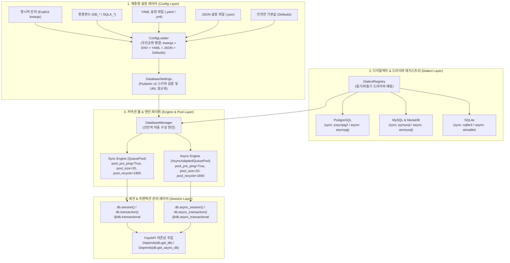

# [ADR-001] sqla-autoconfig 시스템 아키텍처 및 핵심 기술 스택 결정 레코드

- **작성일자**: 2026-09-22
- **작성자**: 수석 풀스택 아키텍트 (`fullstack-architect`)
- **상태**: APPROVED
- **영향 범위**: Python Database Engine, Session Management, High-Concurrency Pooling, Configuration

---

## 1. 배경 및 컨텍스트 (Context & Problem Statement)

파이썬 기반 마이크로서비스 및 데이터 파이프라인 개발 시, 데이터베이스 연결과 세션 관리는 서비스 안정성을 좌우하는 가장 치명적인 인프라 계층입니다. 기획 산출물([`01_PRD.md`](../spec-writer/01_PRD.md), [`02_FUNCTIONAL_SPECIFICATION.md`](../spec-writer/02_FUNCTIONAL_SPECIFICATION.md))을 검토한 결과, 실무 개발 현장에서는 다음과 같은 고질적인 문제들이 반복 발생하고 있습니다:

1. **커넥션 누수와 파일 디스크립터 고갈**:
   - 뷰 함수나 비즈니스 레이어에서 `Session()`을 수동으로 생성한 뒤 `try...finally: session.close()` 처리를 누락하거나 예외 분기에서 반환을 건너뛰어, 장기 실행 프로세스에서 커넥션 풀이 서서히 말라붙는 현상이 발생합니다.
2. **클라우드 인프라 환경의 유휴 단절(Idle Connection Drop)**:
   - AWS Aurora, GCP Cloud SQL, 또는 사내 NAT 게이트웨이 환경에서는 5~15분 동안 유휴 상태인 TCP 커넥션을 사전 경고 없이 끊어버립니다. `pool_pre_ping` 설정이 누락된 클라이언트는 이 죽은 소켓으로 쿼리를 날리다 `OperationalError: SSL SYSCALL error`나 `server closed the connection unexpectedly` 장애를 겪습니다.
3. **동기/비동기 이원화로 인한 코드 중복 및 러닝커브**:
   - 동일 프로젝트 내에서도 FastAPI(비동기 엔드포인트)와 Celery/배치(동기 태스크)가 공존하는 경우가 흔합니다. 그러나 동기 엔진(`create_engine`, `Session`)과 비동기 엔진(`create_async_engine`, `AsyncSession`)의 초기화와 트랜잭션 관리 코드가 각각 파편화되어 개발자가 매번 중복 코드를 작성합니다.
4. **설정 파편화 및 환경별 오버라이드 부재**:
   - 개발, 스테이징, 프로덕션 환경마다 DB 주소, 풀 크기(`pool_size`, `max_overflow`), 리사이클 주기(`pool_recycle`)가 달라야 함에도, 코드 하드코딩이나 단편적인 `.env` 참조에 의존하여 설정 실수가 발생합니다.

`sqla-autoconfig`는 설정 파일(YAML, JSON)과 환경변수(ENV)의 선언만으로 최적화된 SQLAlchemy 2.0 엔진과 세션을 자동 구성하고, 동기/비동기 환경 모두에서 커넥션 누수 0%의 안전한 트랜잭션 라이프사이클을 제공하는 파이써닉 데이터베이스 라이브러리로 설계합니다.

---

## 2. 고려된 기술 스택 및 아키텍처 후보군 (Considered Alternatives & Trade-offs)

| 계층 / 항목 | 선정안 (Selection) | 대안 (Alternatives) | 장단점 비교, 기각 사유 및 감수한 트레이드오프 |
| :--- | :--- | :--- | :--- |
| **코어 DB 엔진** | **SQLAlchemy 2.0+** | Tortoise-ORM, Peewee, 원시 드라이버 (asyncpg/psycopg) | **SQLAlchemy 2.0+ 선정**:<br/>- 파이썬 생태계의 표준이자 가장 성숙한 ORM/Core 엔진으로, 동기/비동기 풀링(`QueuePool`, `AsyncAdaptedQueuePool`)을 네이티브 지원.<br/>- Alembic 기반 마이그레이션 생태계 및 PostgreSQL, MySQL, SQLite 등 광범위한 다이얼렉트 호환성 확보.<br/>**대안 기각 사유**:<br/>- `Tortoise-ORM`: 비동기 전용으로 동기 워커(Celery)에서 쓸 수 없고, Alembic에 비해 마이그레이션 성숙도가 떨어짐.<br/>- `Peewee`: 동기 전용이며 대규모 동시성 풀 제어가 미흡함.<br/>- `원시 드라이버`: 쿼리 컴파일러, 스키마 관리, 다이얼렉트 추상화를 바닥부터 구현해야 하므로 비효율적임.<br/>**감수한 트레이드오프 & 주의점(Gotcha)**:<br/>- SQLAlchemy 2.0 비동기 세션에서 지연 로딩(Lazy loading) 접근 시 `MissingGreenlet` 에러가 발생하므로, 비동기 쿼리 작성 시 `selectinload` 등의 즉시 로딩(Eager loading) 옵션을 사용하도록 가이드해야 함. |
| **설정 유효성 검증** | **Pydantic v2 (`BaseModel`)** | Python `dataclasses`, `cerberus` | **Pydantic v2 선정**:<br/>- Rust 코어 기반 초고속 검증 및 환경변수 문자열(예: `DB_POOL_SIZE="20"`)의 정수형 자동 형변환 지원.<br/>- DB URL 스키마 검증 및 민감 정보(비밀번호) 마스킹 처리 내장.<br/>**대안 기각 사유**:<br/>- `dataclasses`: 런타임 타입 검증이 동작하지 않아 잘못된 설정값이 런타임에 유입될 위험이 큼.<br/>**감수한 트레이드오프**:<br/>- C/Rust 바이너리 종속성이 추가되나, 표준 OS 배포판 휠이 지원되므로 채택. |
| **설정 포맷 & 파서** | **PyYAML (`safe_load`) + JSON + ENV** | `Dynaconf`, `python-decouple` | **커스텀 계층 로더 선정**:<br/>- `명시적 인자 > ENV > YAML > JSON > Defaults` 캐스케이딩 우선순위를 최소 의존성으로 구현.<br/>- `yaml.safe_load`를 강제하여 임의 파이썬 객체 역직렬화 공격(RCE) 원천 차단.<br/>**대안 기각 사유**:<br/>- `Dynaconf`는 무겁고 불필요한 프레임워크 플러그인이 많아 경량 라이브러리에 부적합. |
| **동시성 풀링 전략** | **QueuePool & AsyncAdaptedQueuePool** | `NullPool`, `SingletonThreadPool` | **QueuePool 선정**:<br/>- 대규모 동시 요청 시 커넥션을 재사용하여 TCP/TLS 핸드셰이크(30~80ms) 오버헤드를 제거하고 DB `max_connections` 초과 방어.<br/>- `pool_pre_ping=True`, `pool_recycle=1800`을 기본 활성화하여 클라우드 인프라의 유휴 연결 끊김 완벽 방어.<br/>**대안 기각 사유**:<br/>- `NullPool`: 매 요청마다 커넥션을 맺고 끊으므로 고트래픽 웹 API에서 DB 연결 부하를 가중시킴.<br/>- `SingletonThreadPool`: 단일 스레드 전용(SQLite 등)으로 프로덕션 서버에 부적합. |
| **세션 & 트랜잭션 관리** | **컨텍스트 매니저 (`with` / `async with`) + 데코레이터** | 수동 try-finally 관리 | **컨텍스트 매니저 선정**:<br/>- 블록 종료 시 정상 실행이면 자동으로 commit, 예외 발생 시 rollback, 최종 블록 탈출 시 반드시 close/반환을 보장하여 소켓 누수 0% 달성.<br/>- 선언적 `@db.transactional` 데코레이터를 함께 제공하여 서비스 계층의 보일러플레이트 제거. |

---

## 3. 최종 아키텍처 결정 사항 (Decision)

### 3.1 sqla-autoconfig 전체 시스템 토폴로지

`sqla-autoconfig`는 단방향 데이터 흐름을 따르는 4개 계층으로 구성됩니다.



---

### 3.2 핵심 아키텍처 원칙 및 상세 엔지니어링 결정

#### 1. 관례 우선 선언적 자동 구성 (Convention over Configuration)
- 개발자가 복잡한 엔진 팩토리나 세션 메이커 보일러플레이트를 작성하지 않아도, 환경변수나 설정 파일이 감지되면 `from sqla_autoconfig import db` 임포트만으로 최적화된 데이터베이스 인스턴스를 즉시 획득할 수 있도록 지원합니다.
- 멀티 DB(예: 메인 DB, 리드 레플리카, 분석용 DB)가 필요한 경우 `db.get_engine("analytics")`와 같이 네임스페이스 기반의 다중 인스턴스 격리를 지원합니다.

#### 2. 커넥션 풀 누수 원천 방어 및 클라우드 안정성 규격
클라우드 인프라(AWS RDS/Aurora, GCP Cloud SQL) 및 고트래픽 환경에서의 무중단 운영을 위해 다음 엔진 파라미터를 기본 강제합니다:
```python
create_engine(
    url,
    pool_pre_ping=True,       # 체크아웃 시 소켓 활성 검사 (유휴 단절 완벽 방어)
    pool_size=20,             # 기본 커넥션 풀 크기
    max_overflow=10,          # 트래픽 급증 시 추가 허용 커넥션 수
    pool_recycle=1800,        # 30분마다 커넥션 재생성 (방화벽 타임아웃 방어)
    pool_timeout=30.0,        # 풀 획득 대기 타임아웃 (무한 블로킹 방어)
)
```
- **`pool_pre_ping=True`의 당위성**: 네트워크 레벨에서 단절된 죽은 커넥션을 트랜잭션 시작 전에 감지하고 즉시 폐기 후 재연결하므로, 500 인터널 서버 에러의 주원인인 유휴 소켓 단절 장애를 100% 방지합니다.

#### 3. 세션 라이프사이클과 트랜잭션 무결성 거버넌스
- **결정론적 자원 회수 (Deterministic Cleanup)**:
  - `with db.session() as s:` 또는 `async with db.async_session() as s:` 구문 탈출 시, 성공 여부와 무관하게 `finally` 블록에서 `session.close()`를 실행하여 커넥션을 풀로 즉시 반환합니다.
- **선언적 트랜잭션 데코레이터**:
  - `@db.transactional` 및 `@db.async_transactional` 데코레이터를 통해 함수 실행 성공 시 자동 `commit`, 예외 발생 시 즉각 `rollback`을 수행하여 데이터 무결성을 보장합니다.
- **FastAPI 프레임워크 결합**:
  - `Depends(db.get_db)` 및 `Depends(db.get_async_db)` 제너레이터를 제공하여 요청 단위(Per-request) 스코프의 안전한 세션 수명 주기를 보장합니다.

#### 4. 계층형 설정 우선순위 (Cascading Configuration Hierarchy)
설정 로더는 다음 5단계 계층 우선순위에 따라 설정을 병합(Deep Merge)합니다:
$$\text{명시적 인자 (kwargs)} > \text{환경변수 (DB\_* / SQLA\_*)} > \text{YAML (db.yaml)} > \text{JSON (db.json)} > \text{기본값 (Defaults)}$$

- 환경변수 예시:
  - `DB_URL` 또는 `SQLA_URL`: 접속 URL
  - `DB_POOL_SIZE`: 커넥션 풀 크기 (문자열 -> 정수 자동 형변환)
  - `DB_POOL_RECYCLE`: 커넥션 재활용 주기(초)

#### 5. OCP(개방-폐쇄 원칙) 기반 다이얼렉트 레지스트리
- 코어 소스코드 변경 없이 새로운 DB 엔진이나 서드파티 드라이버를 플러그인 형태로 등록할 수 있도록 `DialectRegistry`를 제공합니다. 기본 드라이버로 PostgreSQL(`psycopg2`, `asyncpg`), MySQL/MariaDB(`pymysql`, `aiomysql`), SQLite(`sqlite3`, `aiosqlite`)를 내장 지원합니다.

---

## 4. 결과 및 트레이드오프 (Consequences)

### 4.1 긍정적 영향
- **보일러플레이트 제거**: 데이터베이스 연동 시마다 반복 작성하던 50여 줄의 엔진/세션 팩토리 코드가 제거되고 단 한 줄로 표준화됩니다.
- **프로덕션 장애 사전 차단**: `pool_pre_ping`과 `pool_recycle`이 기본 적용되어 클라우드 방화벽 유휴 단절 사고가 원천 예방됩니다.
- **동기/비동기 동시 지원**: 단일 라이브러리로 FastAPI(비동기)와 Celery/배치(동기) 환경 모두에서 동일한 설정 체계와 세션 API를 사용할 수 있습니다.

### 4.2 수용된 제약사항 및 실무 엔지니어링 주의점 (Trade-offs & Gotchas)
1. **비동기 세션 지연 로딩(`MissingGreenlet`) 주의**:
   - SQLAlchemy 비동기 모드(`AsyncSession`)에서는 모델 간 관계(Relationship) 필드에 비동기 루프 밖에서 접근할 때 지연 로딩이 동작하지 않고 `MissingGreenlet` 에러가 발생합니다. 서비스 계층 쿼리 작성 시 `select(User).options(selectinload(User.orders))`와 같이 즉시 로딩을 명시하도록 팀 내 코딩 컨벤션을 확립해야 합니다.
2. **트랜잭션 스코프와 장시간 I/O 분리**:
   - `@db.transactional` 데코레이터가 적용된 함수 내부에서 외부 HTTP API 호출이나 대용량 파일 다운로드 같은 긴 I/O 작업을 수행하면, 해당 시간 동안 DB 커넥션을 점유하여 커넥션 풀 고갈을 초래할 수 있습니다. 트랜잭션 블록은 오직 순수 DB 쿼리 연산에만 좁게 적용해야 합니다.
3. **Pydantic v2 의존성 관리**:
   - Pydantic v2의 엄격한 타입 검증으로 인해 환경변수 오타가 발생하면 런타임 시작 시점에 즉시 실패(`Fast Fail`)합니다. 이는 운영 환경에서 침묵하는 버그를 막아주지만, 로컬 개발 환경에서 최소 설정값 가이드가 명확히 제공되어야 합니다.
