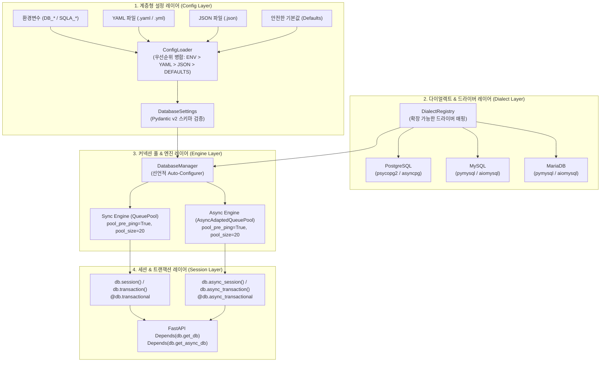

# [ADR-001] sqla-autoconfig 시스템 아키텍처 및 핵심 기술 스택 결정 레코드

- **작성일자**: 2026-09-22
- **작성자**: 수석 풀스택 아키텍트 (`fullstack-architect`)
- **상태**: APPROVED
- **영향 범위**: Python Database Engine, Session Management, High-Concurrency Pooling, Configuration

---

## 1. 배경 및 컨텍스트 (Context & Problem Statement)

- 기획 산출물(`01_PRD.md`, `02_FUNCTIONAL_SPECIFICATION.md`)을 바탕으로, Python 생태계에서 동작하는 데이터베이스 자동 구성 및 고성능 커넥션 풀 관리 라이브러리(`sqla-autoconfig`)를 설계해야 합니다.
- **핵심 기술 과제**:
  1. **계층적 설정 탐색 및 우선순위 보장**: `명시적 인자 > 환경변수(ENV) > YAML > JSON > 기본값` 순서로 병합되는 유연한 설정 아키텍처.
  2. **대규모 동시접속(High Concurrency) 안정성**: 스레드 및 코루틴 기반 동시 요청 폭증 시 커넥션 누수(Zero Leak) 방지 및 자동 복구.
  3. **Sync & Async 완벽 지원**: 동기(`Session`, `create_engine`)와 비동기(`AsyncSession`, `create_async_engine`)를 하나의 직관적인 인터페이스로 통합.
  4. **무한한 DB 확장성**: PostgreSQL, MySQL, MariaDB를 기본 지원하고, 새로운 RDBMS 다이얼렉트를 플러그인 형태로 등록 가능한 개방-폐쇄 원칙(OCP) 충족.

---

## 2. 고려된 기술 스택 및 아키텍처 후보군 (Considered Alternatives)

| 계층 / 항목 | 선정안 (Selection) | 대안 (Alternatives) | 장단점 비교 및 선정 사유 |
| :--- | :--- | :--- | :--- |
| **코어 ORM / 엔진** | **SQLAlchemy 2.0+** | Tortoise-ORM, Peewee, Raw Drivers | SQLAlchemy 2.0은 Python 생태계 표준이자 가장 성숙한 비동기/동기 풀링 지원. 광범위한 다이얼렉트 생태계 보유 |
| **설정 유효성 검증** | **Pydantic v2 (`BaseModel`)** | `dataclasses`, `cerberus` | Pydantic v2는 Rust 코어로 극도로 빠르며, 엄격한 타입 강제, 기본값 주입 및 환경변수 호환성 우수 |
| **YAML 파서** | **PyYAML (`yaml.safe_load`)** | `ruamel.yaml` | 가볍고 표준적이며, `safe_load`를 통한 임의 코드 실행(RCE) 보안 위협 차단 |
| **동시성 풀링 전략** | **QueuePool & AsyncAdaptedQueuePool** | NullPool, SingletonThreadPool | 대규모 동접 부하 분산 및 커넥션 재사용에 가장 최적화된 풀 구조. `pre-ping` 및 `recycle` 네이티브 지원 |
| **트랜잭션 관리** | **Context Manager (`@contextmanager`, `@asynccontextmanager`) + 데코레이터** | 수동 try-finally 관리 | 파이써닉한 `with` 블록을 통해 정상 완료 시 commit, 예외 시 rollback, 종료 시 close를 100% 보장 |

---

## 3. 최종 아키텍처 결정 사항 (Decision)

### 3.1 sqla-autoconfig 코어 컴포넌트 토폴로지

### 3.2 핵심 아키텍처 원칙
1. **Zero-Configuration by Default (관례 우선)**:
   - 환경변수나 설정 파일이 존재하면 개발자가 별도의 엔진 초기화 코드를 작성할 필요 없이 `from sqla_autoconfig import db` 즉시 사용 가능.
2. **Resource Leak Prevention (무결점 자원 회수)**:
   - 컨텍스트 매니저와 데코레이터의 `finally` 구문에서 반드시 세션을 닫고 풀로 커넥션을 회수하여 동접 폭증 상황에서도 누수 0% 달성.
3. **Open-Closed Principle (OCP 확장성)**:
   - 다이얼렉트 레지스트리(`DialectRegistry`)를 두어 코어 코드 수정 없이도 신규 드라이버 및 DB 타입 등록 지원.
4. **KISS & Pragmatic Implementation**:
   - 불필요한 메타프로그래밍이나 과도한 추상화를 지양하고, 표준 SQLAlchemy 2.0 인터페이스를 투명하게 노출.

---

## 4. 결과 및 트레이드오프 (Consequences)
- **긍정적 영향**:
  - 개발자가 매 프로젝트마다 작성하던 수십 줄의 DB 보일러플레이트 코드 완전 제거.
  - 배포 환경에 따라 환경변수, YAML, JSON을 자유롭게 교체 가능.
  - 최적화된 풀 파라미터가 기본 적용되어 AWS Aurora, MySQL 등의 유휴 단절(Idle disconnect) 문제 사전 방지.
- **수용된 제약사항**:
  - Pydantic v2 및 PyYAML 의존성 포함 (경량 및 타입 안정성을 위한 필수적 트레이드오프).
