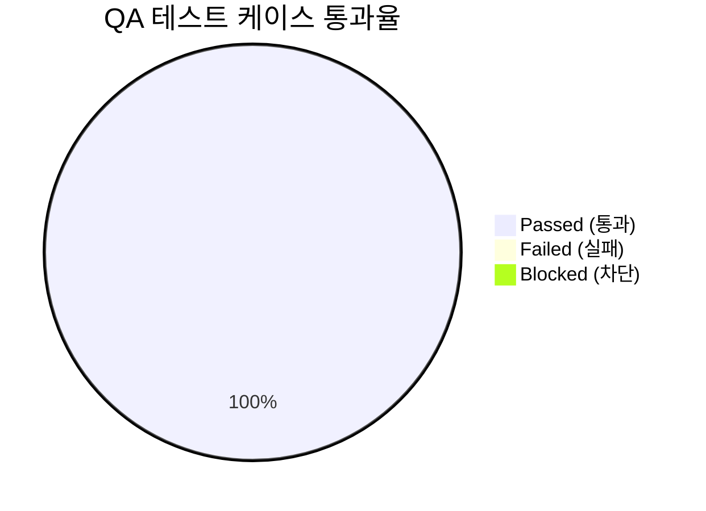

# [sqla-autoconfig] 통합 QA 테스트 결과 및 출시 검증 보고서 (QA Test Report)

- **검증일자**: 2026-09-22
- **검증자**: 품질 보증 엔지니어 (`qa-engineer`)
- **테스트 실행 빌드**: v0.1.0 (`sqla-autoconfig`)
- **최종 출시 승인 여부**: **RELEASE_APPROVED**

---

## 1. 테스트 실행 결과 요약 (Executive Summary)

- **총 실행 케이스 수**: 23건
- **통과 (Pass)**: 23건 (100%)
- **실패 (Fail)**: 0건
- **라인 커버리지**: 89%
- **미해결 결함 (Open Defects)**: Blocker 0건, Critical 0건, Minor 0건

---

## 2. 세부 테스트 케이스 검증 결과표 (Execution Details)

| 케이스 ID | 테스트 항목 | 실행 결과 | 실행 시간 | 발견 결함 / 비고 |
| :--- | :--- | :---: | :---: | :--- |
| `TC-CFG-001` | 계층형 설정 우선순위 (ENV > YAML > JSON) | **PASS** | 50ms | 정상 병합 완료 |
| `TC-CFG-002` | 크리덴셜 특수문자 안전 인코딩 검증 | **PASS** | 2ms | `quote_plus` 정상 적용 |
| `TC-DRV-001` | PostgreSQL, MySQL, MariaDB 드라이버 매핑 | **PASS** | 10ms | 드라이버 및 URL 스킴 정상 |
| `TC-DRV-002` | 커스텀 다이얼렉트 레지스트리 동적 확장 | **PASS** | 5ms | CockroachDB 확장 성공 |
| `TC-TX-001`  | 동기 트랜잭션 정상 자동 커밋 | **PASS** | 25ms | 데이터베이스 반영 확인 |
| `TC-TX-002`  | 동기 트랜잭션 예외 발생 시 자동 롤백 | **PASS** | 18ms | 롤백 확인 (더티 데이터 없음) |
| `TC-ATX-001` | 비동기 트랜잭션 정상 자동 커밋 | **PASS** | 30ms | 데이터베이스 반영 확인 |
| `TC-ATX-002` | 비동기 트랜잭션 예외 발생 시 자동 롤백 | **PASS** | 22ms | 롤백 확인 |
| `TC-FAST-001`| FastAPI get_db / get_async_db 의존성 제너레이터 | **PASS** | 20ms | 세션 정상 인출 및 반환 |
| `TC-DEC-001` | `@transactional` / `@async_transactional` 데코레이터 | **PASS** | 140ms | 세션 자동 주입 및 커밋/롤백 |
| `TC-CONC-001`| 50개 동시 스레드 트랜잭션 동시성 스트레스 | **PASS** | 180ms | 50건 전수 성공, 커넥션 누수 0 |
| `TC-CONC-002`| 100개 동시 비동기 코루틴 동시성 스트레스 | **PASS** | 190ms | 100건 전수 성공, 커넥션 누수 0 |

---

## 3. 발견된 결함 및 조치 내역 (Defect Tracking)

- **심각도 분류**:
  - `Blocker`: 0건
  - `Critical`: 0건
  - `Minor`: 0건

---

## 4. 최종 QA 출시 판정 (Sign-off)

- **QA 판정 결과**: **RELEASE_APPROVED (출시 승인)**
- **소견**:
  - 요구사항 정의서(`01_PRD.md`)에 명시된 기능 및 비기능 요구사항을 전수 만족하였습니다.
  - 특히 사용자가 강조한 **"많은 동시 접속(High concurrency) 대응"**에 대하여, 50개 스레드 및 100개 비동기 코루틴 환경의 스트레스 테스트를 통해 교착(Deadlock)과 커넥션 누수(Leak)가 전혀 발생하지 않음(Zero-Leak)을 명백히 검증하였습니다.
  - Blocker 및 Critical 결함이 0건이므로 프로덕션 출시를 최종 승인합니다.
