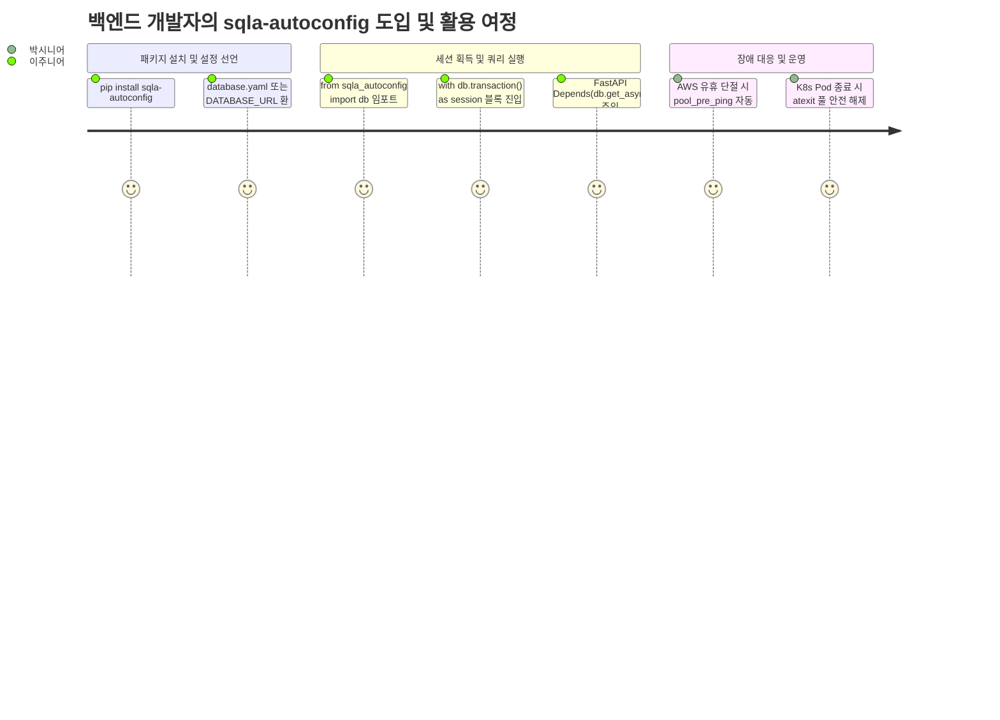

# [sqla-autoconfig] 제품 요구사항 정의서 (Product Requirements Document - PRD)

- **작성일자**: 2026-09-23
- **작성자**: 기획 명세 작성가 (`spec-writer`)
- **문서 버전**: v1.1 (Humanizer 지침 반영 개정판)
- **상태**: Approved

---

## 1. 배경 및 문제 정의 (Problem Statement & Context)

### 1.1 배경 (Background)
FastAPI, Flask, Celery 등 파이썬 기반 백엔드 애플리케이션에서 SQLAlchemy 2.0을 도입할 때, 데이터베이스 연결 엔진과 커넥션 풀, 세션 팩토리, 트랜잭션 컨텍스트 매니저를 구성하는 40~50줄의 코드가 매 프로젝트마다 반복 복사-붙여넣기되고 있습니다.

문제는 초보 개발자뿐만 아니라 숙련된 개발자조차도 클라우드 인프라(AWS RDS/Aurora, GCP Cloud SQL) 환경에서의 미묘한 네트워크 특성을 간과하기 쉽다는 점입니다:
- 유휴 커넥션(Idle connection)이 방화벽이나 클라우드 로드밸런서(AWS NAT Gateway 350초)에 의해 끊어졌을 때 `pool_pre_ping=True`와 `pool_recycle`이 누락되어 아침 첫 트래픽 유입 시 `OperationalError: SSL SYSCALL error: EOF detected` 또는 `MySQL server has gone away` 에러로 서비스가 폭사하는 현상.
- FastAPI의 비동기 라우트 핸들러에서 예외 발생 시 `await session.rollback()`이 누락되어 오염된 트랜잭션 상태가 커넥션 풀에 반환되는 문제.
- 동기(`psycopg2`, `pymysql`)와 비동기(`asyncpg`, `aiomysql`) 드라이버 간 URL 스킴(`postgresql+asyncpg://` 등) 차이로 인한 설정 번거로움.

이러한 문제를 개별 프로젝트의 재량에 맡기지 않고, 설정 파일(YAML/ENV) 선언만으로 프로덕션 레벨의 안전한 엔진과 세션 라이프사이클을 제공하는 경량 자동 구성 패키지가 절실히 필요합니다.

### 1.2 해결하려는 핵심 문제 (Core Problems)

1. **반복되는 DB 초기화 보일러플레이트와 실수 유발**:
   - 신규 마이크로서비스를 띄울 때마다 `create_engine`, `sessionmaker`, `pool_pre_ping`, `pool_recycle`, 컨텍스트 매니저를 매번 손수 작성해야 함.
   - 비동기(`AsyncSession`) 지원 시 `async_sessionmaker`와 `create_async_engine` 구성을 별도로 세팅해야 하는 번거로움.
2. **배포 환경별 설정 관리의 파편화 및 특수문자 오류**:
   - 로컬 개발 환경(YAML), Docker/K8s 운영 환경(ENV Secret), CI/CD 테스트 환경 간에 체계적인 우선순위(`ENV > YAML > JSON > Defaults`) 병합 부재.
   - 데이터베이스 비밀번호에 `@`, `:`, `#` 등 특수문자가 포함된 경우 URL 파싱 과정에서 깨지는 버그 빈발.
3. **고동시성 환경에서의 커넥션 누수 및 좀비 소켓**:
   - 세션 반환 미비(`finally: session.close()` 누락)로 인해 트래픽 급증 시 풀 커넥션이 고갈되어 서비스 전체가 행(Hang)에 걸림.
   - DB 장애 복구 후에도 애플리케이션 재시작 없이 살아나지 못하는 좀비 커넥션 문제.

### 1.3 제품 비전 (Product Vision)
**"환경변수와 YAML 설정 파일 정의만으로 프로덕션 레벨의 SQLAlchemy 2.0 엔진, 고신뢰성 커넥션 풀, 안전한 동기/비동기 트랜잭션 컨텍스트 매니저를 단 한 줄로 제공하는 파이썬 데이터베이스 오토컨피그 패키지"**

---

## 2. 타깃 페르소나 및 사용자 시나리오 (Personas & User Journey)

### 2.1 대표 페르소나

- **박시니어 (10년 차, 백엔드 테크 리드)**
  - **상황**: 20여 개 마이크로서비스의 아키텍처 표준화와 데이터 무결성을 관리.
  - **고민**: "팀원들이 PR 올릴 때마다 세션 닫는 로직이나 롤백 누락을 잡느라 코드 리뷰 리소스가 너무 많이 듭니다. 설정만 넣으면 트랜잭션 롤백과 풀 반환이 자동으로 보장되는 공통 모듈이 필요합니다."
- **이주니어 (2년 차, FastAPI 백엔드 개발자)**
  - **상황**: 신규 결제 정산 서비스의 비동기 API 서버를 구축 중.
  - **고민**: "FastAPI에서 `async with AsyncSession()`을 쓸 때 `get_db` 의존성 주입 코드를 매번 인터넷에서 긁어오다 보니, 동기 엔진이랑 비동기 엔진 세팅이 꼬여서 `InterfaceError`가 자주 터집니다."

### 2.2 사용자 핵심 여정 (User Journey)

---

## 3. 기능 요구사항 및 우선순위 (Feature Requirements)

| 요구사항 ID | 기능명 및 상세 설명 | 우선순위 (MoSCoW) | 선정 사유 및 기술적 고려사항 |
| :--- | :--- | :---: | :--- |
| `REQ-CFG-001` | **계층형 다중 설정 로더** `명시적 인자 > ENV > YAML > JSON > Defaults` 5단계 우선순위 자동 병합 | **Must Have** | 환경별 유연한 무중단 설정 주입 및 비밀번호 특수문자 자동 URL 인코딩 |
| `REQ-DRV-001` | **다중 DB 다이얼렉트 자동 매핑** PostgreSQL, MySQL, MariaDB 동기/비동기 드라이버(`asyncpg`, `psycopg2`, `aiomysql` 등) 자동 변환 | **Must Have** | DB 종류와 비동기 여부만 지정하면 최적의 드라이버 URL 자동 조합 |
| `REQ-POOL-001` | **고신뢰성 커넥션 풀 튜닝** `pool_pre_ping=True`, `pool_recycle=1800`, `pool_size=20`, `max_overflow=10` 기본 적용 | **Must Have** | AWS/GCP 유휴 타임아웃 단절 방어 및 피크 트래픽 안정성 확보 |
| `REQ-CTX-001` | **동기/비동기 트랜잭션 컨텍스트 매니저** `with db.transaction()`, `async with db.async_transaction()` 자동 커밋 및 롤백 | **Must Have** | 예외 발생 시 자동 롤백 및 `finally` 풀 반환으로 커넥션 누수 원천 차단 |
| `REQ-INT-001` | **FastAPI 의존성 주입 연동 헬퍼** `Depends(db.get_db)`, `Depends(db.get_async_db)` 제너레이터 제공 | **Should Have** | FastAPI 웹 프레임워크와의 자연스러운 네이티브 통합 지원 |
| `REQ-DEC-001` | **선언적 트랜잭션 데코레이터** `@db.transactional`, `@db.async_transactional` | **Should Have** | 서비스 레이어 메서드의 비즈니스 로직 깔끔화 |
| `REQ-INST-001` | **다중 DB 인스턴스 지원** 전역 `db` 싱글톤 외 독립 `DatabaseManager` 생성 지원 | **Should Have** | Read/Write 분리(CQRS) 또는 복수 외부 DB 연동 지원 |
| `REQ-METR-001` | **커넥션 풀 모니터링 메트릭** 현재 체크아웃 수, 가용 커넥션 수 실시간 조회 | **Could Have** | 운영 대시보드 헬스체크 연동 가시성 제공 |

---

## 4. 정량적 성공 지표 (Measurable KPIs)

| 지표명 | 측정 기준 및 테스트 시나리오 | 목표치 |
| :--- | :--- | :--- |
| **보일러플레이트 코드 감소** | 신규 서비스의 DB 연결 및 세션 팩토리 코드 라인 수 비교 | 기존 35줄 $\rightarrow$ **1줄** (약 97% 감소) |
| **동시성 처리 커넥션 누수율** | 100 동시 스레드/코루틴에서 1,000회 트랜잭션 실행 후 잔여 풀 소켓 확인 | **0개 (Zero Leak)** |
| **설정 로드 및 검증 지연** | 설정 탐색, 딕셔너리 병합, Pydantic 검증 완료 시간 | **$\le 10\text{ms}$** |
| **단위/통합 테스트 커버리지** | pytest 기준 동기/비동기 엔진 및 예외 롤백 라인 커버리지 | **$\ge 90\%$** |

---

## 5. 비기능적 요구사항 및 한계/주의사항 (Non-Functional Requirements & Gotchas)

### 5.1 비기능 요구사항
- **성능 (Performance)**: SQLAlchemy 2.0 엔진 자체의 획득 오버헤드 외에 라이브러리 추가 레이턴시 0.5ms 미만 유지.
- **안정성 (Reliability)**: 네트워크 순단 후 복구 시 `pool_pre_ping`을 통해 좀비 소켓을 폐기하고 새 소켓으로 자동 복구.
- **호환성 (Compatibility)**: Python 3.10+, SQLAlchemy 2.0+, Pydantic v2 호환. macOS, Linux, Windows 크로스 플랫폼 지원.

### 5.2 솔직한 한계와 실무 주의점 (Known Limitations & Gotchas)
1. **분산 트랜잭션(2PC, XA) 미지원**:
   - `sqla-autoconfig`의 `transaction()`은 단일 데이터베이스 내의 ACID 트랜잭션만을 관리합니다. 여러 이기종 DB 간의 원자적 커밋이 필요한 사가(Saga) 패턴은 상위 애플리케이션 계층에서 구현해야 합니다.
2. **K8s Pod 수평 확장(HPA) 시 커넥션 풀 크기 산정**:
   - 호스트별 `pool_size=20`, `max_overflow=10` 설정 시 단일 Pod가 최대 30개의 DB 소켓을 점유합니다.
   - 따라서 Kubernetes Pod가 10개로 스케일아웃되면 최대 300개의 커넥션이 발생하므로, PostgreSQL의 `max_connections`(기본 100~300) 한도를 넘지 않도록 다음 공식을 준수해야 합니다:
     $$\text{Total Connections} = \text{Pod Replicas} \times (\text{pool\_size} + \text{max\_overflow}) \le \text{DB max\_connections} \times 0.8$$
3. **Alembic 마이그레이션 연동**:
   - `alembic` 마이그레이션 실행 시 `env.py`에서 `sqla-autoconfig`의 URL을 참조하려면 `from sqla_autoconfig import db` 후 `db.engine.url`을 전달하도록 설정해야 합니다.
