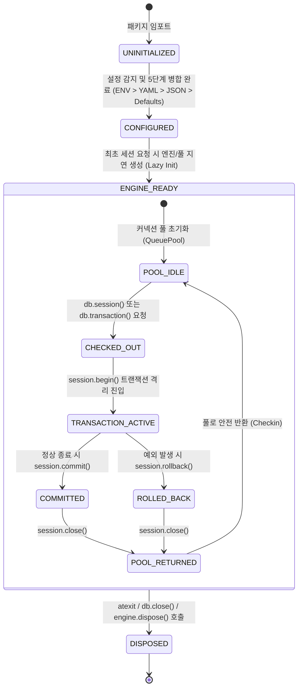

# [sqla-autoconfig] 비즈니스 정책 및 전역 예외 처리 명세서 (Policy & Edge Cases)

- **작성일자**: 2026-09-23
- **작성자**: 기획 명세 작성가 (`spec-writer`)
- **문서 버전**: v1.1 (Humanizer 지침 반영 개정판)
- **상태**: Approved

---

## 1. 커넥션 및 세션 수명 주기 상태 머신 (Connection & Session Lifecycle)

`sqla-autoconfig`가 관리하는 데이터베이스 엔진, 커넥션 풀, 세션 및 트랜잭션 수명 주기의 상태 전이도입니다.

### 1.1 상태 전이 매트릭스 및 규칙

| 현재 상태 | 대상 상태 | 전이 트리거 이벤트 | 필수 사전 조건 | 동작 및 사후 조건 |
| :--- | :--- | :--- | :--- | :--- |
| `UNINITIALIZED` | `CONFIGURED` | 설정 탐색 및 로드 | 환경변수, YAML/JSON, 또는 기본값 존재 | 계층 우선순위 병합 및 `DatabaseSettings` Pydantic 검증 완료 |
| `CONFIGURED` | `ENGINE_READY` | 최초 DB 호출 (`db.session` 등) | 유효한 설정 보유 | SQLAlchemy Engine 및 Sessionmaker 인스턴스화, Lazy 풀 생성 |
| `POOL_IDLE` | `CHECKED_OUT` | 컨텍스트 매니저 진입 | 풀 여유 커넥션 존재 또는 overflow 허용 | 활성 커넥션 1 증가, `pool_pre_ping`으로 유휴 소켓 생존 검증 |
| `CHECKED_OUT` | `TRANSACTION_ACTIVE`| 트랜잭션 블록 진입 | 커넥션 획득 완료 | DB 트랜잭션 격리 시작 (`session.begin()`) |
| `TRANSACTION_ACTIVE`| `COMMITTED` | 블록 정상 종료 | 블록 내 예외 미발생 | DB `COMMIT` 명령 전달 및 데이터 영속화 |
| `TRANSACTION_ACTIVE`| `ROLLED_BACK` | 블록 내 예외 발생 | 임의의 `Exception` 포착 | 즉시 DB `ROLLBACK` 전달 및 오염 방지, 원본 예외 전파 |
| `COMMITTED`/`ROLLED_BACK` | `POOL_IDLE` | `finally: session.close()` | 트랜잭션 완료 | 커넥션 풀 반환 및 소켓 누수 방지 |
| `ENGINE_READY` | `DISPOSED` | 프로세스 종료 또는 명시적 `dispose()` | `atexit` 시그널 인입 | 열려 있는 모든 풀 커넥션 강제 종료 및 소켓 자원 해제 |

---

## 2. 공통 설정 및 풀 관리 정책 (Global Connection & Pool Policies)

### 2.1 계층형 설정 우선순위 정책 (Configuration Precedence Policy)
- **우선순위 순서**:
  1. **명시적 인자 (`kwargs`)**: `DatabaseManager(host="...")`와 같이 코드에서 직접 주입한 값.
  2. **환경변수 (`ENV`)**: `DB_*` 또는 `SQLA_*` 접두사를 가진 환경변수.
  3. **YAML 설정 파일 (`.yaml` / `.yml`)**: `database.yaml`, `config.yaml`.
  4. **JSON 설정 파일 (`.json`)**: `database.json`, `config.json`.
  5. **기본값 (Hardcoded Defaults)**: 프로덕션 권장 안전 기본값.
- **병합 규칙**: 상위 우선순위의 딕셔너리가 하위 설정을 키 단위로 덮어쓰며(Deep Merge), 미정의된 필드만 기본값으로 채워집니다.

### 2.2 대규모 동접 커넥션 풀 정책 (High-Concurrency Pool Policy)
- **`pool_size` (기본값: 20)**: 풀에서 항시 상주 유지하는 커넥션 수.
- **`max_overflow` (기본값: 10)**: 피크 타임 트래픽 급증 시 일시적으로 추가 생성할 수 있는 커넥션 수 (최대 30개 동시 세션 처리).
- **`pool_recycle` (기본값: 1800초 / 30분)**: 유휴 커넥션 자동 재생성 주기로, 클라우드 로드밸런서(AWS NAT Gateway 350초)나 MySQL 서버의 `wait_timeout`으로 인한 소켓 강제 단절을 사전에 방어합니다.
- **`pool_pre_ping` (기본값: True)**: 커넥션 체크아웃 직전 가벼운 `SELECT 1` 핑을 날려 끊어진 좀비 소켓을 감지하고, 폐기 후 새 소켓을 즉시 투명하게 생성합니다.
- **`pool_timeout` (기본값: 30.0초)**: 가용 소켓이 고갈되었을 때 대기하는 최대 시간. 초과 시 명확한 `PoolTimeoutError`를 발생시켜 시스템이 영구 정지(Hang)되는 것을 방지합니다.

---

## 3. 전역 엣지 케이스 및 장애 복구 가이드 (Edge Cases & Recovery Playbook)

| 장애 / 예외 유형 | 감지 방식 | 시스템 처리 방식 및 엔지니어링 가이드 |
| :--- | :--- | :--- |
| **AWS NAT Gateway 유휴 단절 (Idle Reset)** | `pool_pre_ping` 실패 또는 `OperationalError` 포착 | 끊어진 소켓을 풀에서 즉시 폐기하고 새 소켓을 생성하여 첫 요청 사용자에게 에러가 노출되지 않도록 투명하게 복구 |
| **트랜잭션 블록 내 예기치 못한 Exception** | `try...except` 포착 | 즉시 `session.rollback()`을 호출하고, `finally`에서 `session.close()`를 수행하여 더러워진 트랜잭션 상태가 풀로 반환되지 않도록 세션 폐기 |
| **풀 커넥션 완전 고갈 (Pool Exhaustion)** | 대기 시간이 `pool_timeout`(30s) 초과 | `sqlalchemy.exc.TimeoutError`를 포착하여 현재 체크아웃 수, 대기 스레드 정보가 포함된 커스텀 `PoolTimeoutError`로 변환 |
| **FastAPI 요청 취소 / 연결 단절 (Disconnect)** | `generator.close()` 이벤트 감지 | 라우트 핸들러 완료 전 클라이언트가 연결을 끊더라도 `finally` 블록을 안전하게 실행하여 진행 중인 트랜잭션 롤백 및 풀 반환 보장 |
| **K8s Pod 핫 리로드 및 종료 (SIGTERM)** | Python `atexit` 및 프레임워크 Shutdown 이벤트 | 등록된 모든 활성 엔진의 `engine.dispose()`를 순차 호출하여 DB 서버에 물려있는 백엔드 소켓을 정상 종료 |
| **특수문자가 포함된 데이터베이스 비밀번호** | URL 파싱 오류 방어 | 비밀번호 필드는 URL 결합 시 `quote_plus`로 인코딩하여 `@`, `:`, `/`, `#` 등이 포함되어도 연결 URL 파싱 에러를 원천 방지 |
