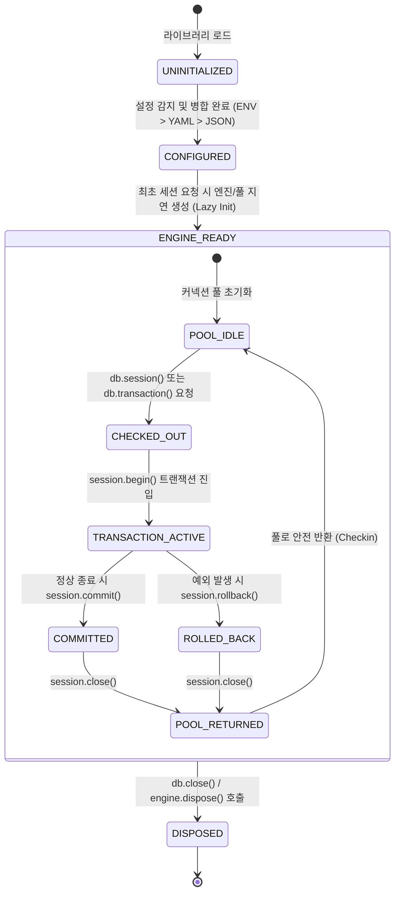

# [sqla-autoconfig] 비즈니스 정책 및 전역 예외 처리 명세서 (Policy & Edge Cases)

- **작성일자**: 2026-09-22
- **작성자**: 기획 명세 작성가 (`spec-writer`)
- **문서 버전**: v1.0
- **상태**: Approved

---

## 1. 핵심 커넥션 및 세션 생명주기 상태 전이 머신 (Connection & Session Lifecycle)

`sqla-autoconfig`가 관리하는 데이터베이스 커넥션 풀과 세션의 생명주기 상태 전이도입니다.

### 상태 전이 매트릭스 및 규칙
| 현재 상태 | 대상 상태 | 전이 트리거 이벤트 | 필수 사전 조건 | 동작 및 사후 조건 |
| :--- | :--- | :--- | :--- | :--- |
| `UNINITIALIZED` | `CONFIGURED` | 설정 탐색 시작 | 환경변수, 파일, 또는 기본값 존재 | `DatabaseSettings` 유효성 검증 완료 |
| `CONFIGURED` | `ENGINE_READY` | 첫 DB 호출 (`db.session` 등) | 유효한 설정 보유 | SQLAlchemy Engine 및 Sessionmaker 인스턴스화 |
| `POOL_IDLE` | `CHECKED_OUT` | 컨텍스트 매니저 진입 | 풀 여유 커넥션 존재 또는 overflow 허용 | 활성 커넥션 수 1 증가, pre-ping 검증 |
| `CHECKED_OUT` | `TRANSACTION_ACTIVE`| 트랜잭션 블록 진입 | 커넥션 획득 완료 | DB 트랜잭션 격리 시작 |
| `TRANSACTION_ACTIVE`| `COMMITTED` | 블록 정상 종료 | 예외 발생 없음 | DB `COMMIT` 명령 전달 |
| `TRANSACTION_ACTIVE`| `ROLLED_BACK` | 블록 내 예외 발생 | 임의의 예외 포착 | DB `ROLLBACK` 명령 전달 및 원본 예외 전파 |
| `COMMITTED`/`ROLLED_BACK` | `POOL_IDLE` | `finally: session.close()` | 트랜잭션 완료 | 커넥션 풀 반환 및 리소스 누수 0 보장 |

---

## 2. 공통 설정 및 풀 관리 정책 (Global Connection & Pool Policies)

### 2.1 계층형 설정 우선순위 정책 (Configuration Precedence Policy)
- **우선순위 순서**:
  1. **명시적 전달 인자 (`kwargs`)**: 코드 레벨에서 주입한 설정이 최우선
  2. **환경변수 (Environment Variables)**: `DB_*` 또는 `SQLA_*` 접두사
  3. **YAML 파일 (`.yaml` / `.yml`)**: `database.yaml`, `database.yml`, `config.yaml`
  4. **JSON 파일 (`.json`)**: `database.json`, `config.json`
  5. **기본값 (Hardcoded Defaults)**: 안전한 프로덕션 기본값
- **병합 규칙**: 하위 우선순위의 딕셔너리를 상위 우선순위가 키 단위로 덮어쓰며, 미정의된 필드만 기본값으로 채웁니다.

### 2.2 대규모 동접 커넥션 풀 정책 (High-Concurrency Pool Policy)
- **`pool_size` (기본값: 20)**: 기본 상주 유지 커넥션 수.
- **`max_overflow` (기본값: 10)**: 피크 타임 시 추가 허용 가능한 일시적 커넥션 수 (총 30개 동시 쿼리 처리).
- **`pool_recycle` (기본값: 1800초 / 30분)**: 유휴 커넥션 자동 재생성 주기로, 방화벽이나 DB 서버의 유휴 커넥션 단절(`idle timeout`) 방어.
- **`pool_pre_ping` (기본값: True)**: 커넥션 체크아웃 전 `SELECT 1` 헬스체크를 수행하여 끊어진 좀비 커넥션을 감지하고 자동 폐기 후 신규 커넥션 생성.
- **`pool_timeout` (기본값: 30초)**: 모든 풀 커넥션 소진 시 대기할 최대 시간. 초과 시 명확한 `PoolTimeoutError` 발생.

---

## 3. 전역 엣지 케이스 및 장애 복구 가이드 (Global Edge Cases & Recovery)

| 장애 / 예외 유형 | 감지 방식 | 시스템 처리 방식 및 가이드 |
| :--- | :--- | :--- |
| **DB 서버 일시 단절 (Network Glitch)** | `pool_pre_ping` 실패 또는 `OperationalError` | 끊어진 커넥션을 풀에서 폐기하고 새 커넥션으로 재시도하여 애플리케이션 중단 방지 |
| **트랜잭션 블록 내 예기치 못한 Exception** | `try...except` 포착 | 즉시 `session.rollback()`을 호출하고, `finally`에서 `session.close()`를 수행하여 더러워진 상태가 풀에 반환되지 않도록 세션 폐기 |
| **풀 커넥션 완전 고갈 (Pool Exhaustion)** | 대기 시간이 `pool_timeout`(30s) 초과 | `sqlalchemy.exc.TimeoutError`를 포착하여 상세 원인(현재 체크아웃 수, 대기 스레드)을 포함한 커스텀 에러 발생 |
| **프로세스 종료 및 핫 리로드** | Python `atexit` 또는 FastAPI Shutdown 이벤트 | 등록된 모든 활성 엔진의 `dispose()`를 안전하게 호출하여 DB 서버에 남아있는 잔여 세션 정상 종료 |
| **특수문자가 포함된 비밀번호** | URL 파싱 오류 방지 | 비밀번호 필드는 URL 결합 시 `quote_plus`로 인코딩하여 `@`, `:`, `#` 등이 깨지지 않도록 방어 |
