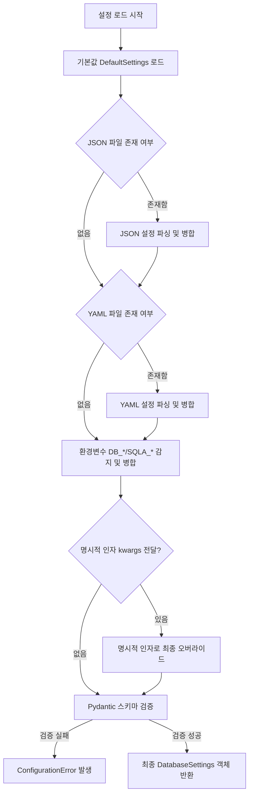
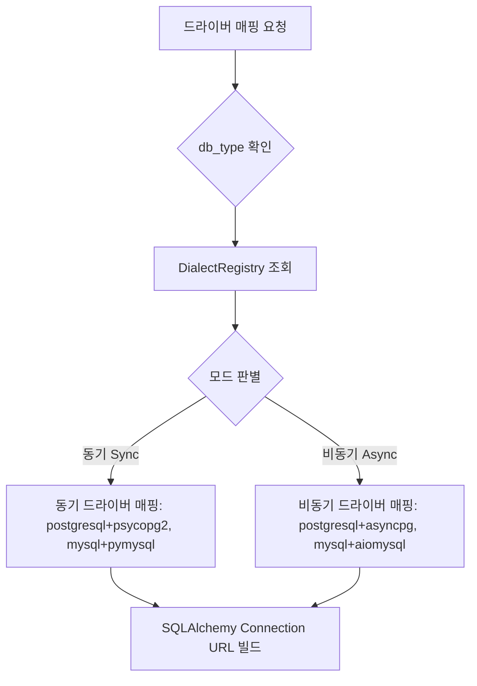
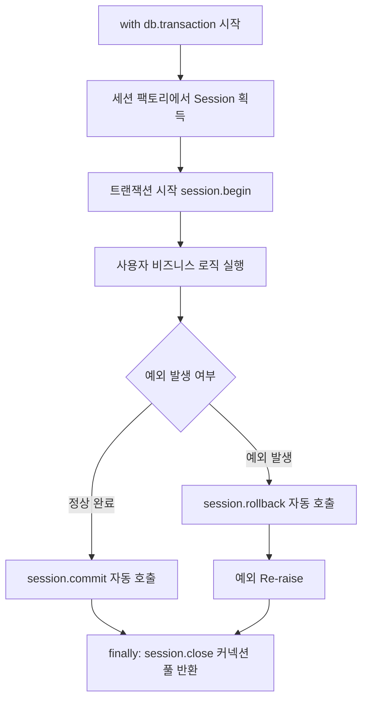

# [sqla-autoconfig] 코어 상세기능정의서 (Modular FSD)

- **도메인**: 데이터베이스 연결 관리 및 자동 구성 (Database Auto-Configuration & Connection Management)
- **작성자**: 기획 명세 작성가 (`spec-writer`)
- **문서 버전**: v1.0
- **상태**: Approved

---

## 단위 기능 상세 명세 (단위기능별 7대 상세 명세 완비)

---

### [FUNC-CFG-001] 계층형 설정 로더 및 병합 (Cascading Configuration Loader)

#### 1. 기본 정보
- **기능명**: 계층형 설정 로더 및 우선순위 자동 병합
- **기능 ID**: `FUNC-CFG-001`
- **대응 요구사항 ID**: `REQ-CFG-001`
- **대상 모듈 코드**: `MOD-CONFIG-001`
- **우선순위**: Must Have
- **관련 액터 (Actor)**: 라이브러리 사용자 (백엔드 개발자, 데이터 엔지니어)

#### 2. 사전 조건 (Pre-conditions)
1. Python 런타임 환경에 `sqla-autoconfig`가 설치되어 있는 상태
2. 환경변수, YAML 파일(`database.yaml`, `database.yml`, `config.yaml`), 또는 JSON 파일(`database.json`, `config.json`) 중 하나 이상이 존재하거나 직접 인자가 전달된 상태

#### 3. 사용자 인터랙션 및 시스템 동작 흐름과 플로우차트
1. 사용자가 `from sqla_autoconfig import db`를 호출하거나 `DatabaseManager()`를 인스턴스화한다.
2. 시스템은 설정 파일 탐색 순서에 따라 로컬 작업 디렉토리에서 JSON 파일(`database.json`, `config.json`)을 1차 탐색한다.
3. 시스템은 YAML 파일(`database.yaml`, `database.yml`, `config.yaml`)을 탐색하여 기존 JSON 설정을 덮어쓴다(Override).
4. 시스템은 환경변수(`DB_*` 또는 `SQLA_*`)를 읽어 기존 설정을 덮어쓴다.
5. 명시적으로 생성자에 전달된 `kwargs`가 있다면 최우선으로 적용한다.
6. 최종 병합된 딕셔너리를 `DatabaseSettings` Pydantic 모델로 변환 및 유효성 검증을 수행한다.

#### 4. 화면 표시 및 입력 데이터 항목 명세 (Configuration Data Elements - 8대 표준 컬럼)
| 항목명 | 입력/설정 구분 | 매핑 방식 | 필수 여부 | 데이터 타입 / 제약 | 기본값 | 유효성 검증 규칙 (Validation) | 노출/오버라이드 조건 |
| :--- | :---: | :--- | :---: | :--- | :---: | :--- | :--- |
| `db_type` | 설정 항목 | `DB_TYPE` / `type` | 필수 | String / `postgres`, `mysql`, `mariadb` 등 | - | 지원 다이얼렉트 목록 내 존재 | 상시 |
| `host` | 설정 항목 | `DB_HOST` / `host` | 선택 | String / 호스트명 또는 IP | `localhost` | 공백 제외 1자 이상 | `url` 미지정 시 필수 |
| `port` | 설정 항목 | `DB_PORT` / `port` | 선택 | Integer / 1~65535 | 각 DB 기본 포트 | 유효 포트 범위 (1~65535) | `url` 미지정 시 적용 |
| `user` | 설정 항목 | `DB_USER` / `user` | 선택 | String | `root` or `postgres` | 비어있지 않음 | `url` 미지정 시 적용 |
| `password` | 설정 항목 | `DB_PASSWORD` / `password` | 선택 | String | `""` | 특수문자 URL 인코딩 처리 | `url` 미지정 시 적용 |
| `database` | 설정 항목 | `DB_NAME` / `database` | 선택 | String | `test` | 알파벳, 숫자, 언더바 | `url` 미지정 시 필수 |
| `url` | 설정 항목 | `DATABASE_URL` / `url` | 선택 | String / SQLAlchemy URL | `None` | SQLAlchemy 유효 URL 형식 | 지정 시 host/port 등 무시 |
| `pool_size`| 설정 항목 | `DB_POOL_SIZE` | 선택 | Integer / 1~1000 | `20` | 최소 1 이상 | 상시 |
| `max_overflow`| 설정 항목| `DB_MAX_OVERFLOW` | 선택 | Integer / 0~1000 | `10` | 0 이상 | 상시 |
| `pool_recycle`| 설정 항목| `DB_POOL_RECYCLE` | 선택 | Integer / 1~86400 (초) | `1800` | 1 이상 | 상시 |
| `pool_pre_ping`| 설정 항목| `DB_POOL_PRE_PING` | 선택 | Boolean | `True` | boolean 타입 | 상시 |
| `pool_timeout`| 설정 항목| `DB_POOL_TIMEOUT` | 선택 | Float / 초 단위 | `30.0` | 0.1 이상 | 상시 |
| `echo` | 설정 항목 | `DB_ECHO` | 선택 | Boolean | `False` | boolean 타입 | 쿼리 로깅 필요 시 |

#### 5. 비즈니스 규칙 (Business Rules)
- **BR-CFG-001-1**: 설정 우선순위는 `명시적 인자(kwargs) > 환경변수(ENV) > YAML 파일 > JSON 파일 > 기본값(Defaults)` 순서를 엄격히 준수해야 한다.
- **BR-CFG-001-2**: `DATABASE_URL`이 명시된 경우 호스트/포트/유저 조합보다 우선하며, `db_type`이 누락되었을 경우 URL 스킴(`postgresql://` 등)에서 자동으로 추출한다.

#### 6. 예외 처리 및 엣지 케이스 (Edge Cases & Exception Handling)
| 발생 상황 (Edge Case Scenario) | 시스템 처리 방식 | 사용자 안내 메시지 / 예외 |
| :--- | :--- | :--- |
| 지원하지 않는 `db_type` 설정 시 | 즉시 검증 실패 처리 및 지원 DB 목록 안내 | `UnsupportedDialectError: 'oracle' is not supported. Supported dialects: ['postgres', 'mysql', 'mariadb']` |
| 포트 번호가 문자열이거나 유효 범위를 벗어난 경우 | Pydantic ValidationError 발생 | `ValueError: port must be between 1 and 65535` |
| 비밀번호에 `@`, `:`, `/` 등 특수문자 포함 시 | URL 조합 시 `urllib.parse.quote_plus`로 자동 인코딩 | 특수문자 파싱 오류 원천 방지 |
| 설정 파일(YAML/JSON) 문법 오류 시 | 파싱 에러를 잡아서 명확한 설정 로드 에러로 래핑 | `ConfigParseError: Failed to parse YAML config at database.yaml: line 3` |

#### 7. 비즈니스 에러 코드 매핑
| 비즈니스 에러 코드 | 발생 사유 | Python 예외 클래스 | 가이드 조치 |
| :--- | :--- | :--- | :--- |
| `ERR_CFG_MISSING` | 필수 설정(`db_type` 또는 `url`) 누락 | `MissingConfigurationError` | 환경변수 또는 파일에 `DB_TYPE` 지정 필요 |
| `ERR_CFG_INVALID` | 설정 타입 또는 값 범위 오류 | `ConfigurationValidationError` | 설정값의 타입 및 범위 수정 |
| `ERR_CFG_FILE_IO` | 설정 파일 읽기 권한 또는 문법 오류 | `ConfigFileReadError` | 파일 경로 및 권한, YAML/JSON 문법 확인 |

---

### [FUNC-DRV-001] 다중 데이터베이스 드라이버 매핑 및 확장 (Dialect Mapping & Registry)

#### 1. 기본 정보
- **기능명**: 다중 DB 동기/비동기 드라이버 자동 매핑 및 레지스트리
- **기능 ID**: `FUNC-DRV-001`
- **대응 요구사항 ID**: `REQ-DRV-001`
- **대상 모듈 코드**: `MOD-DIALECT-001`
- **우선순위**: Must Have
- **관련 액터 (Actor)**: 라이브러리 사용자

#### 2. 사전 조건
1. `db_type`이 결정된 상태
2. 동기(Sync) 또는 비동기(Async) 모드가 선택된 상태

#### 3. 사용자 인터랙션 및 시스템 동작 흐름과 플로우차트
1. 사용자가 동기 엔진 또는 비동기 엔진 생성을 요청한다.
2. 시스템은 `DialectRegistry`를 조회하여 해당 `db_type`의 동기 드라이버(`psycopg2`, `pymysql`) 또는 비동기 드라이버(`asyncpg`, `aiomysql`)를 검색한다.
3. 알맞은 SQLAlchemy URL 스킴(예: `postgresql+asyncpg://...`, `mysql+pymysql://...`)을 생성한다.
4. 필요 시 사용자가 `DialectRegistry.register("sqlite", ...)`를 통해 신규 다이얼렉트를 동적으로 확장할 수 있다.

#### 4. 데이터 항목 명세
| 항목명 | 입력/설정 구분 | 매핑 방식 | 필수 여부 | 데이터 타입 / 제약 | 기본값 | 유효성 검증 규칙 | 노출/오버라이드 조건 |
| :--- | :---: | :--- | :---: | :--- | :---: | :--- | :--- |
| `db_type` | 파라미터 | 함수 인자 | 필수 | String | - | 등록된 dialect 이름 | 상시 |
| `driver` | 파라미터 | 함수 인자 | 선택 | String | 자동 선택 | 설치된 드라이버 패키지 | 커스텀 드라이버 지정 시 |
| `async_mode`| 파라미터 | 함수 인자 | 필수 | Boolean | `False` | boolean | 상시 |

#### 5. 비즈니스 규칙
- **BR-DRV-001-1**: MariaDB는 MySQL 다이얼렉트(`mysql+pymysql`, `mysql+aiomysql`)와 100% 호환되도록 구성하되 MariaDB 고유 드라이버가 지정된 경우 이를 우선 지원한다.
- **BR-DRV-001-2**: 드라이버가 명시되지 않은 경우 생태계에서 가장 안정적이고 널리 사용되는 기본 드라이버(`postgres` $\rightarrow$ `asyncpg` / `psycopg2`, `mysql/mariadb` $\rightarrow$ `aiomysql` / `pymysql`)를 기본값으로 채택한다.

#### 6. 예외 처리 및 엣지 케이스
| 발생 상황 | 시스템 처리 방식 | 안내 메시지 / 예외 |
| :--- | :--- | :--- |
| 필요한 비동기 드라이버(예: `asyncpg`)가 설치되지 않은 경우 | 드라이버 임포트 실패 시 `pip install` 안내 에러 발생 | `DriverNotFoundError: Driver 'asyncpg' is required for postgres async mode. Install it via 'pip install asyncpg'` |

#### 7. 비즈니스 에러 코드 매핑
| 비즈니스 에러 코드 | 발생 사유 | Python 예외 클래스 | 가이드 조치 |
| :--- | :--- | :--- | :--- |
| `ERR_DRV_NOT_FOUND` | 필수 DB 드라이버 미설치 | `DriverNotFoundError` | 해당 드라이버 pip 설치 안내 |
| `ERR_DRV_UNKNOWN` | 알 수 없는 다이얼렉트 | `UnknownDialectError` | DialectRegistry 등록 또는 db_type 확인 |

---

### [FUNC-CTX-001] 안전한 세션 및 트랜잭션 컨텍스트 매니저 (Context Managers & Decorators)

#### 1. 기본 정보
- **기능명**: 동기/비동기 세션 및 트랜잭션 컨텍스트 매니저와 데코레이터
- **기능 ID**: `FUNC-CTX-001`
- **대응 요구사항 ID**: `REQ-CTX-001`, `REQ-DEC-001`
- **대상 모듈 코드**: `MOD-SESSION-001`
- **우선순위**: Must Have
- **관련 액터 (Actor)**: 라이브러리 사용자

#### 2. 사전 조건
1. `DatabaseManager`의 엔진 및 세션 팩토리가 정상 초기화된 상태

#### 3. 사용자 인터랙션 및 시스템 동작 흐름과 플로우차트
1. 사용자가 `with db.session() as session:` 또는 `with db.transaction() as session:`을 호출한다.
2. 세션 풀에서 커넥션/세션을 획득한다 (`checkout`).
3. `transaction` 블록의 경우:
   - 블록 내부 코드가 성공적으로 종료되면 자동으로 `session.commit()`을 호출한다.
   - 블록 내부에서 예외(`Exception`)가 발생하면 즉시 `session.rollback()`을 호출하고 예외를 다시 전파(Re-raise)한다.
4. `finally` 블록에서 반드시 `session.close()`를 수행하여 커넥션을 풀에 즉시 반환(`checkin`)한다.

#### 4. 데이터 항목 명세
| 항목명 | 입력/설정 구분 | 매핑 방식 | 필수 여부 | 데이터 타입 / 제약 | 기본값 | 유효성 검증 규칙 | 노출/오버라이드 조건 |
| :--- | :---: | :--- | :---: | :--- | :---: | :--- | :--- |
| `autocommit` | 파라미터 | 메서드 인자 | 선택 | Boolean | `True` (for transaction) | boolean | 트랜잭션 수동 제어 시 |
| `session` | 반환값 | Context yield | - | `Session` or `AsyncSession` | - | SQLAlchemy 2.0 세션 인스턴스 | 컨텍스트 내부 바인딩 |

#### 5. 비즈니스 규칙
- **BR-CTX-001-1**: 트랜잭션 컨텍스트(`with db.transaction()`) 내에서 명시적인 커밋 호출 없이도 블록 종료 시 정상 커밋되어야 한다.
- **BR-CTX-001-2**: 어떠한 경우(정상 반환, 예외 발생, 조기 return)에도 세션은 반드시 닫히고 커넥션 풀로 반환되어야 하며, 커넥션 누수가 발생해서는 안 된다.
- **BR-CTX-001-3**: 데코레이터 `@db.transactional` 및 비동기 데코레이터 `@db.async_transactional`은 함수의 첫 번째 인자 또는 키워드 인자로 세션을 자동 주입하거나 내부 컨텍스트로 격리 실행할 수 있어야 한다.

#### 6. 예외 처리 및 엣지 케이스
| 발생 상황 | 시스템 처리 방식 | 안내 메시지 / 예외 |
| :--- | :--- | :--- |
| 트랜잭션 블록 내에서 `SQLAlchemyError` 또는 일반 `Exception` 발생 시 | 즉시 `session.rollback()` 수행 후 원래 예외 보존 전파 | 원본 예외 스택 트레이스 보존 |
| 이미 닫힌 세션에 대해 재사용 시도 시 | 안전한 세션 새로 획득 또는 에러 방어 | 세션 풀에서 신규 세션 안전 인출 |

#### 7. 비즈니스 에러 코드 매핑
| 비즈니스 에러 코드 | 발생 사유 | Python 예외 클래스 | 가이드 조치 |
| :--- | :--- | :--- | :--- |
| `ERR_TX_FAILED` | 트랜잭션 롤백 발생 | `TransactionRollbackError` | 비즈니스 로직 및 제약조건 위반 확인 |
| `ERR_POOL_EXHAUSTED`| 커넥션 풀 고갈 타임아웃 | `PoolTimeoutError` | `pool_size` 및 `max_overflow` 증설 검토 |
