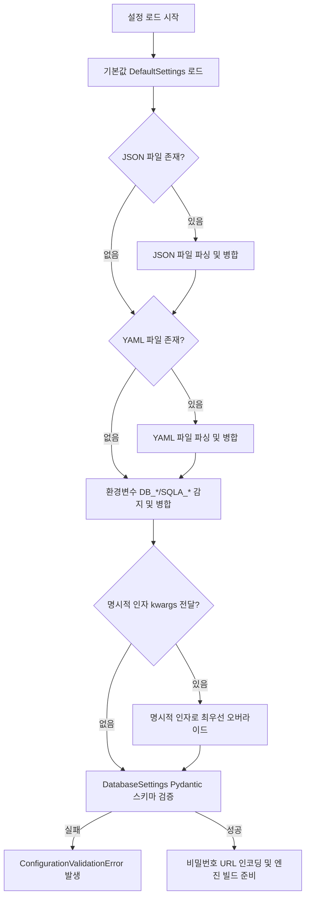
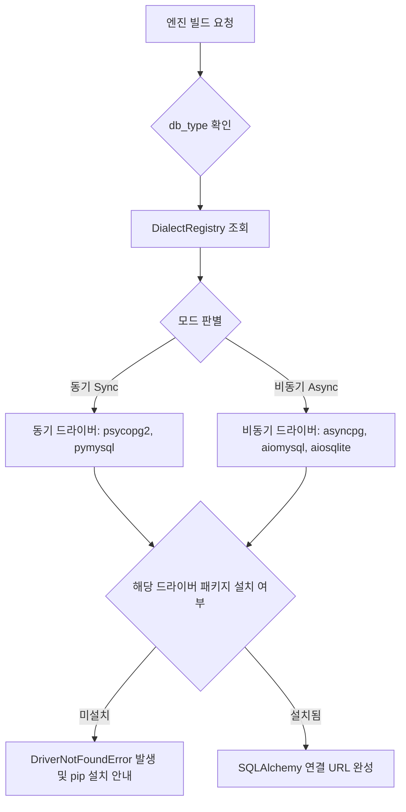
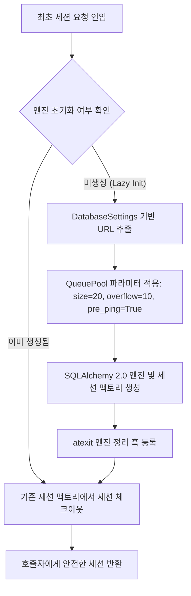

# [sqla-autoconfig] 코어 상세기능정의서 (Modular FSD)

- **도메인**: 데이터베이스 연결 관리 및 자동 구성 (Database Auto-Configuration & Connection Lifecycle)
- **작성자**: 기획 명세 작성가 (`spec-writer`)
- **문서 버전**: v1.1 (Humanizer 지침 반영 개정판)
- **상태**: Approved

---

## 단위 기능 상세 명세 (단위기능별 7대 상세 명세 완비)

---

### [FUNC-CFG-001] 계층형 설정 로더 및 병합 (Cascading Configuration Loader)

#### 1. 기본 정보
- **기능명**: 계층형 설정 로더 및 5단계 우선순위 자동 병합
- **기능 ID**: `FUNC-CFG-001`
- **대응 요구사항 ID**: `REQ-CFG-001`
- **대상 모듈 코드**: `MOD-CONFIG-001`
- **우선순위**: Must Have
- **관련 액터 (Actor)**: 사내 백엔드 엔지니어, DevOps 엔지니어

#### 2. 사전 조건 (Pre-conditions)
1. Python 실행 환경에 `sqla-autoconfig`가 설치된 상태.
2. 환경변수, YAML 파일(`database.yaml`, `config.yaml`), JSON 파일(`database.json`), 또는 파이썬 코드 인자(`kwargs`) 중 최소 1개 이상의 설정 소스가 준비된 상태.

#### 3. 시스템 동작 흐름 및 플로우차트 (Step-by-Step Flow & Flowchart)

1. 호출자가 `from sqla_autoconfig import db`를 호출하거나 `DatabaseManager()`를 인스턴스화합니다.
2. 시스템은 프로덕션 권장 안전 기본값(`DefaultSettings`: `pool_size=20`, `max_overflow=10`, `pool_recycle=1800`, `pool_pre_ping=True`, `pool_timeout=30.0`)을 메모리에 적재합니다.
3. 작업 디렉토리에서 JSON 파일(`database.json`, `config.json`)을 탐색하여 설정을 1차 병합합니다.
4. YAML 파일(`database.yaml`, `database.yml`, `config.yaml`)을 탐색하여 기존 설정을 2차 덮어씁니다.
5. `DB_*` 또는 `SQLA_*` 접두사를 가진 환경변수를 읽어와 기존 설정을 3차 오버라이드합니다.
6. 명시적으로 전달된 `kwargs`가 있다면 이를 4차(최우선)로 반영합니다.
7. 최종 병합된 딕셔너리를 `DatabaseSettings` Pydantic 모델로 변환하여 유효성을 검증하고, 비밀번호 특수문자 URL 인코딩 처리를 거쳐 반환합니다.



#### 4. 데이터 항목 명세 (Configuration Data Elements - 8대 표준 컬럼)

| 항목명 | 입출력 구분 | 매핑 속성 | 필수 여부 | 데이터 타입 / 제약 | 기본값 | 유효성 검증 규칙 (Validation) | 노출 및 오버라이드 조건 |
| :--- | :---: | :--- | :---: | :--- | :---: | :--- | :--- |
| `db_type` | 설정 항목 | `DB_TYPE` / `type` | 필수 | String / `postgres`, `mysql`, `mariadb`, `sqlite` | - | 지원 다이얼렉트 목록 내 존재 | `url` 미지정 시 필수 |
| `host` | 설정 항목 | `DB_HOST` / `host` | 선택 | String / 호스트명 또는 IP | `localhost` | 공백 제외 1자 이상 | `url` 미지정 시 적용 |
| `port` | 설정 항목 | `DB_PORT` / `port` | 선택 | Integer / 1 ~ 65535 | 각 DB 표준 포트 | $1 \le \text{port} \le 65535$ | `url` 미지정 시 적용 |
| `user` | 설정 항목 | `DB_USER` / `user` | 선택 | String | `root` or `postgres` | 공백 제외 1자 이상 | `url` 미지정 시 적용 |
| `password` | 설정 항목 | `DB_PASSWORD` / `password` | 선택 | String | `""` | 특수문자 자동 URL 인코딩 | `url` 미지정 시 적용 |
| `database` | 설정 항목 | `DB_NAME` / `database` | 선택 | String | `test` | 알파벳, 숫자, 언더바, 하이픈 | `url` 미지정 시 필수 |
| `url` | 설정 항목 | `DATABASE_URL` / `url` | 선택 | String / SQLAlchemy URL | `None` | SQLAlchemy 유효 스킴 검증 | 지정 시 개별 호스트 설정 무시 |
| `pool_size` | 설정 항목 | `DB_POOL_SIZE` | 선택 | Integer / 1 ~ 500 | `20` | $1 \le \text{pool\_size} \le 500$ | 항상 오버라이드 가능 |
| `max_overflow`| 설정 항목 | `DB_MAX_OVERFLOW` | 선택 | Integer / 0 ~ 500 | `10` | $0 \le \text{max\_overflow} \le 500$ | 항상 오버라이드 가능 |
| `pool_recycle`| 설정 항목 | `DB_POOL_RECYCLE` | 선택 | Integer / 1 ~ 86400 (초) | `1800` | $1 \le \text{pool\_recycle} \le 86400$ | 유휴 타임아웃 방어 시 |
| `pool_pre_ping`| 설정 항목 | `DB_POOL_PRE_PING` | 선택 | Boolean | `True` | Boolean 타입 | 좀비 소켓 감지 시 필수 |
| `pool_timeout`| 설정 항목 | `DB_POOL_TIMEOUT` | 선택 | Float / 0.1 ~ 300.0 (초) | `30.0` | $0.1 \le \text{pool\_timeout} \le 300.0$ | 풀 고갈 대기 상한 |

#### 5. 비즈니스 규칙 (Business Rules)
- **BR-CFG-001-1**: 설정 우선순위는 `명시적 인자(kwargs) > 환경변수(ENV) > YAML > JSON > 기본값(Defaults)` 순서를 엄격히 준수합니다.
- **BR-CFG-001-2**: `DATABASE_URL`이 명시된 경우 호스트/포트/사용자 개별 설정보다 우선하며, `db_type`이 누락된 경우 URL 스킴(`postgresql://` 등)에서 자동으로 추출합니다.
- **BR-CFG-001-3**: 비밀번호에 `@`, `:`, `/`, `#` 등 특수문자가 포함된 경우 URL 결합 시 `urllib.parse.quote_plus`로 안전하게 인코딩하여 파싱 에러를 방지합니다.

#### 6. 예외 처리 및 엣지 케이스 (Edge Cases & Exception Handling)

| 발생 상황 (Edge Case Scenario) | 시스템 처리 방식 | 사용자 안내 메시지 / 예외 |
| :--- | :--- | :--- |
| 지원하지 않는 `db_type` ("oracle") 지정 시 | 지원 다이얼렉트 목록을 명시하며 즉시 검증 실패 처리 | `UnsupportedDialectError: 'oracle' is not supported. Supported dialects: ['postgres', 'mysql', 'mariadb', 'sqlite']` |
| 포트 번호가 유효 범위를 벗어난 경우 (-1 또는 99999) | Pydantic 스키마 검증에서 즉시 차단 | `ConfigurationValidationError: port must be between 1 and 65535` |
| YAML/JSON 설정 파일 문법 불량 | 파싱 에러 라인 번호와 파일 경로를 래핑하여 안내 | `ConfigParseError: Failed to parse YAML config at 'database.yaml' (line 4)` |

#### 7. 비즈니스 에러 코드 매핑

| 비즈니스 에러 코드 | 발생 원인 | 예외 클래스 | 대응 가이드 |
| :--- | :--- | :--- | :--- |
| `ERR_CFG_MISSING` | 필수 설정(`db_type` 또는 `url`) 누락 | `MissingConfigurationError` | database.yaml 또는 DB_TYPE 환경변수 선언 |
| `ERR_CFG_INVALID` | 설정 필드 값 범위 또는 타입 오류 | `ConfigurationValidationError` | port, pool_size 수치 범위 확인 |
| `ERR_CFG_FILE_IO` | 설정 파일 읽기 권한 또는 문법 오류 | `ConfigFileReadError` | 파일 접근 권한 및 들여쓰기 확인 |

---

### [FUNC-DRV-001] 다중 데이터베이스 드라이버 자동 매핑 (Dialect Mapping & Driver Registry)

#### 1. 기본 정보
- **기능명**: 다중 DB 동기/비동기 드라이버 자동 매핑 및 레지스트리
- **기능 ID**: `FUNC-DRV-001`
- **대응 요구사항 ID**: `REQ-DRV-001`
- **대상 모듈 코드**: `MOD-DIALECT-001`
- **우선순위**: Must Have
- **관련 액터 (Actor)**: 라이브러리 사용자

#### 2. 사전 조건 (Pre-conditions)
1. `db_type`이 결정되었거나 `url` 스킴이 주어진 상태.
2. 동기(Sync) 또는 비동기(Async) 엔진 생성 요청이 인입된 상태.

#### 3. 시스템 동작 흐름 및 플로우차트 (Step-by-Step Flow & Flowchart)

1. 사용자가 동기 엔진 또는 비동기 엔진 생성을 요청합니다.
2. 시스템은 `DialectRegistry`를 조회하여 해당 `db_type`에 대응하는 드라이버를 결정합니다:
   - **PostgreSQL**: 동기 `psycopg2` (`postgresql+psycopg2://`), 비동기 `asyncpg` (`postgresql+asyncpg://`)
   - **MySQL / MariaDB**: 동기 `pymysql` (`mysql+pymysql://`), 비동기 `aiomysql` (`mysql+aiomysql://`)
   - **SQLite**: 동기 기본 내장 (`sqlite:///`), 비동기 `aiosqlite` (`sqlite+aiosqlite:///`)
3. 조합된 SQLAlchemy 2.0 URL 문자열을 생성하고, 필수 드라이버 패키지가 파이썬 환경에 설치되어 있는지 검증합니다.
4. 필요 시 사용자가 `DialectRegistry.register("custom", ...)`로 커스텀 드라이버를 확장할 수 있습니다.



#### 4. 데이터 항목 명세 (Data Elements - 8대 표준 컬럼)

| 항목명 | 입출력 구분 | 매핑 속성 | 필수 여부 | 데이터 타입 / 제약 | 기본값 | 유효성 검증 규칙 (Validation) | 노출 및 오버라이드 조건 |
| :--- | :---: | :--- | :---: | :--- | :---: | :--- | :--- |
| `db_type` | 함수 인자 | Python Arg | 필수 | String / 등록된 dialect 명칭 | - | 소문자 정규화 후 레지스트리 검색 | 항상 필수 |
| `driver` | 설정 항목 | Config Key | 선택 | String | `None` (자동 선택) | 유효 파이썬 모듈명 | 커스텀 드라이버 명시 시 |
| `async_mode` | 함수 인자 | Python Arg | 필수 | Boolean | `False` | Boolean 타입 | 비동기 엔진 빌드 시 True |

#### 5. 비즈니스 규칙 (Business Rules)
- **BR-DRV-001-1**: MariaDB는 MySQL 다이얼렉트(`mysql+pymysql`, `mysql+aiomysql`)와 완벽 호환되도록 구성하되, MariaDB 전용 드라이버(`mariadb`)가 명시된 경우 이를 우선 지원합니다.
- **BR-DRV-001-2**: 드라이버 미지정 시 생태계에서 가장 성능과 안정성이 검증된 기본 드라이버(`postgres` $\rightarrow$ `asyncpg` / `psycopg2`, `mysql` $\rightarrow$ `aiomysql` / `pymysql`)를 자동으로 선택합니다.

#### 6. 예외 처리 및 엣지 케이스 (Edge Cases & Exception Handling)

| 발생 상황 (Edge Case Scenario) | 시스템 처리 방식 | 사용자 안내 메시지 / 예외 |
| :--- | :--- | :--- |
| 필수 비동기 드라이버(`asyncpg` 등)가 설치되지 않은 경우 | `ImportError`를 포착하여 명확한 pip 설치 명령어를 포함한 `DriverNotFoundError` 발생 | `DriverNotFoundError: Driver 'asyncpg' is required for postgres async mode. Install via 'pip install asyncpg'` |
| 미등록 커스텀 다이얼렉트 인입 시 | 등록되지 않은 DB 타입임을 알리고 레지스트리 확장 방법 안내 | `UnknownDialectError: Dialect 'oracle' is not registered in DialectRegistry` |

#### 7. 비즈니스 에러 코드 매핑

| 비즈니스 에러 코드 | 발생 원인 | 예외 클래스 | 대응 가이드 |
| :--- | :--- | :--- | :--- |
| `ERR_DRV_NOT_FOUND` | 필수 DB 드라이버 미설치 | `DriverNotFoundError` | 안내된 드라이버 패키지 pip 설치 |
| `ERR_DRV_UNKNOWN` | 알 수 없는 다이얼렉트 | `UnknownDialectError` | DialectRegistry.register 또는 db_type 오타 확인 |

---

### [FUNC-ENG-001] SQLAlchemy 2.0 고신뢰성 엔진 및 커넥션 풀 (Engine & Connection Pool Lifecycle)

#### 1. 기본 정보
- **기능명**: 고신뢰성 동기/비동기 SQLAlchemy 2.0 엔진 빌드 및 풀 최적화
- **기능 ID**: `FUNC-ENG-001`
- **대응 요구사항 ID**: `REQ-POOL-001`
- **대상 모듈 코드**: `MOD-ENGINE-001`
- **우선순위**: Must Have
- **관련 액터 (Actor)**: 사내 백엔드 개발자, 데이터 엔지니어

#### 2. 사전 조건 (Pre-conditions)
1. `DatabaseSettings` 유효성 검증 및 연결 URL 조합이 완료된 상태.
2. `SQLAlchemy>=2.0.0` 패키지가 런타임에 로드된 상태.

#### 3. 시스템 동작 흐름 및 플로우차트 (Step-by-Step Flow & Flowchart)

1. 호출자가 최초로 `db.session()`, `db.engine`, `db.async_session()` 등을 호출할 때 엔진을 지연 생성(Lazy Init)합니다.
2. 설정된 파라미터(`pool_size`, `max_overflow`, `pool_recycle`, `pool_pre_ping`, `pool_timeout`)를 적용하여 동기 `Engine` 또는 비동기 `AsyncEngine`을 인스턴스화합니다.
3. 세션 팩토리(`sessionmaker`, `async_sessionmaker`)를 구성하고 `expire_on_commit=False`를 적용하여 트랜잭션 종료 후에도 객체 속성 접근이 안전하도록 설정합니다.
4. Python 인터프리터 종료 시그널 등록(`atexit.register`)을 수행하여 프로세스 종료 시 `engine.dispose()`를 자동 실행합니다.



#### 4. 데이터 항목 명세 (Engine Configuration Data Elements - 8대 표준 컬럼)

| 항목명 | 입출력 구분 | 매핑 속성 | 필수 여부 | 데이터 타입 / 제약 | 기본값 | 유효성 검증 규칙 (Validation) | 노출 및 오버라이드 조건 |
| :--- | :---: | :--- | :---: | :--- | :---: | :--- | :--- |
| `pool_size` | 설정 항목 | `DB_POOL_SIZE` | 선택 | Integer / 1 ~ 500 | `20` | 최소 1 이상 | 상시 오버라이드 가능 |
| `max_overflow`| 설정 항목 | `DB_MAX_OVERFLOW` | 선택 | Integer / 0 ~ 500 | `10` | 0 이상 | 상시 오버라이드 가능 |
| `pool_recycle`| 설정 항목 | `DB_POOL_RECYCLE` | 선택 | Integer / 1 ~ 86400 (초) | `1800` | 유휴 소켓 재연결 주기 | 상시 오버라이드 가능 |
| `pool_pre_ping`| 설정 항목 | `DB_POOL_PRE_PING` | 선택 | Boolean | `True` | 체크아웃 전 SELECT 1 검증 | 상시 오버라이드 가능 |
| `pool_timeout`| 설정 항목 | `DB_POOL_TIMEOUT` | 선택 | Float / 0.1 ~ 300.0 (초) | `30.0` | 풀 대기 최대 시간 | 상시 오버라이드 가능 |
| `echo` | 설정 항목 | `DB_ECHO` | 선택 | Boolean | `False` | 쿼리 로깅 활성화 여부 | 로컬 디버깅 시 활용 |

#### 5. 비즈니스 규칙 (Business Rules)
- **BR-ENG-001-1**: `pool_pre_ping=True`를 기본 활성화하여, AWS NAT Gateway나 방화벽에 의해 유휴 소켓이 끊겼을 때 좀비 커넥션으로 인한 `OperationalError`를 방지하고 자동 재연결을 수행합니다.
- **BR-ENG-001-2**: `pool_recycle=1800`(30분)을 기본 적용하여, MySQL `wait_timeout`이나 클라우드 인프라의 유휴 세션 강제 종료를 사전에 예방합니다.
- **BR-ENG-001-3**: 세션 팩토리의 `expire_on_commit`은 기본적으로 `False`로 고정하여, 트랜잭션이 커밋된 후 비동기 핸들러나 백그라운드 태스크에서 ORM 속성에 접근할 때 `DetachedInstanceError`가 발생하는 문제를 방지합니다.

#### 6. 예외 처리 및 엣지 케이스 (Edge Cases & Exception Handling)

| 발생 상황 (Edge Case Scenario) | 시스템 처리 방식 | 사용자 안내 메시지 / 예외 |
| :--- | :--- | :--- |
| 풀의 모든 커넥션이 소진되고 30초 대기 시간 초과 | `sqlalchemy.exc.TimeoutError`를 포착하여 현재 체크아웃 수와 가용량을 명시한 `PoolTimeoutError` 발생 | `PoolTimeoutError: Connection pool exhausted (size=20, overflow=10, timeout=30.0s)` |
| DB 서버 재부팅으로 기존 연결 전체 유실 | `pool_pre_ping`이 실패한 소켓을 풀에서 자동 폐기하고 새 소켓으로 재생성 | 애플리케이션 중단 없이 자동 복구 |

#### 7. 비즈니스 에러 코드 매핑

| 비즈니스 에러 코드 | 발생 원인 | 예외 클래스 | 대응 가이드 |
| :--- | :--- | :--- | :--- |
| `ERR_POOL_EXHAUSTED` | 커넥션 풀 가용 소켓 고갈 및 타임아웃 | `PoolTimeoutError` | pool_size/max_overflow 증설 또는 세션 반환 누수 점검 |
| `ERR_ENG_INIT_FAILED` | 데이터베이스 연결 엔진 초기화 실패 | `EngineInitializationError` | DB 호스트 네트워크 접근성 및 계정 권한 확인 |

---

### [FUNC-CTX-001] 안전한 트랜잭션 컨텍스트 매니저 (Session & Transaction Context Lifecycle)

#### 1. 기본 정보
- **기능명**: 동기/비동기 세션 및 트랜잭션 컨텍스트 매니저와 데코레이터
- **기능 ID**: `FUNC-CTX-001`
- **대응 요구사항 ID**: `REQ-CTX-001`, `REQ-DEC-001`
- **대상 모듈 코드**: `MOD-SESSION-001`
- **우선순위**: Must Have
- **관련 액터 (Actor)**: 사내 백엔드 개발자

#### 2. 사전 조건 (Pre-conditions)
1. `DatabaseManager`의 엔진 및 세션 팩토리가 정상 초기화된 상태.

#### 3. 시스템 동작 흐름 및 플로우차트 (Step-by-Step Flow & Flowchart)

1. 호출자가 `with db.transaction() as session:` 또는 `async with db.async_transaction() as session:` 블록에 진입합니다.
2. 세션 풀에서 세션을 체크아웃하고 `session.begin()`으로 트랜잭션을 시작합니다.
3. 사용자 비즈니스 로직을 실행합니다:
   - **정상 종료 시**: 블록을 빠져나올 때 `session.commit()`을 자동으로 호출합니다.
   - **예외 발생 시**: 블록 내에서 `Exception` 발생 시 즉시 `session.rollback()`을 호출하고 원본 예외를 상위로 전파(Re-raise)합니다.
4. **`finally` 구문**: 어떠한 경우(정상, 예외, 조기 return)에도 `session.close()`를 필수로 수행하여 소켓을 커넥션 풀에 안전하게 반환합니다.

```mermaid
flowchart TD
    A[with db.transaction() 블록 진입] --> B[세션 팩토리에서 Session 획득]
    B --> C[트랜잭션 시작 session.begin()]
    C --> D[사용자 비즈니스 로직 실행]
    D --> E{블록 내 예외 발생 여부}
    E -- 정상 완료 --> F[session.commit() 자동 호출]
    E -- 예외 발생 --> G[session.rollback() 자동 호출]
    F --> H[finally: session.close() 풀 반환]
    G --> I[원본 예외 Re-raise]
    I --> H
```

#### 4. 데이터 항목 명세 (Data Elements - 8대 표준 컬럼)

| 항목명 | 입출력 구분 | 매핑 속성 | 필수 여부 | 데이터 타입 / 제약 | 기본값 | 유효성 검증 규칙 (Validation) | 노출 및 오버라이드 조건 |
| :--- | :---: | :--- | :---: | :--- | :---: | :--- | :--- |
| `session` | 반환 객체 | Context Yield | 필수 | `Session` or `AsyncSession` | - | SQLAlchemy 2.0 세션 인스턴스 | 블록 내부에서 활성화 |
| `autoflush` | 파라미터 | 함수 인자 | 선택 | Boolean | `True` | 쿼리 전 플러시 여부 | 수동 플러시 필요 시 |

#### 5. 비즈니스 규칙 (Business Rules)
- **BR-CTX-001-1**: `with db.transaction()` 컨텍스트는 블록 정상 완료 시 자동으로 커밋하며, 중간에 예외가 발생하면 100% 롤백을 보장하여 오염된 데이터가 DB에 반영되지 않도록 합니다.
- **BR-CTX-001-2**: 세션은 `finally` 절에서 무조건 닫히고 풀로 반환되어 커넥션 누수를 원천 차단합니다.
- **BR-CTX-001-3**: 데코레이터 `@db.transactional` 및 `@db.async_transactional`은 비즈니스 함수 내부로 세션 인스턴스를 주입하거나 내부 격리 트랜잭션으로 감싸서 비즈니스 로직과 트랜잭션 코드를 분리합니다.

#### 6. 예외 처리 및 엣지 케이스 (Edge Cases & Exception Handling)

| 발생 상황 (Edge Case Scenario) | 시스템 처리 방식 | 사용자 안내 메시지 / 예외 |
| :--- | :--- | :--- |
| 트랜잭션 블록 내에서 비즈니스 예외 발생 | 즉시 `session.rollback()` 호출 후 원래 예외와 스택 트레이스 보존 전파 | 원본 예외 투명 전파 |
| FastAPI 의존성 주입 시 클라이언트 요청 취소 (Disconnect) | `generator.close()`를 감지하여 진행 중인 트랜잭션 안전 롤백 및 세션 풀 반환 | 커넥션 누수 방지 |

#### 7. 비즈니스 에러 코드 매핑

| 비즈니스 에러 코드 | 발생 원인 | 예외 클래스 | 대응 가이드 |
| :--- | :--- | :--- | :--- |
| `ERR_TX_FAILED` | 트랜잭션 실행 중 롤백 발생 | `TransactionRollbackError` | 원본 예외 로그 및 데이터베이스 무결성 제약조건 확인 |
