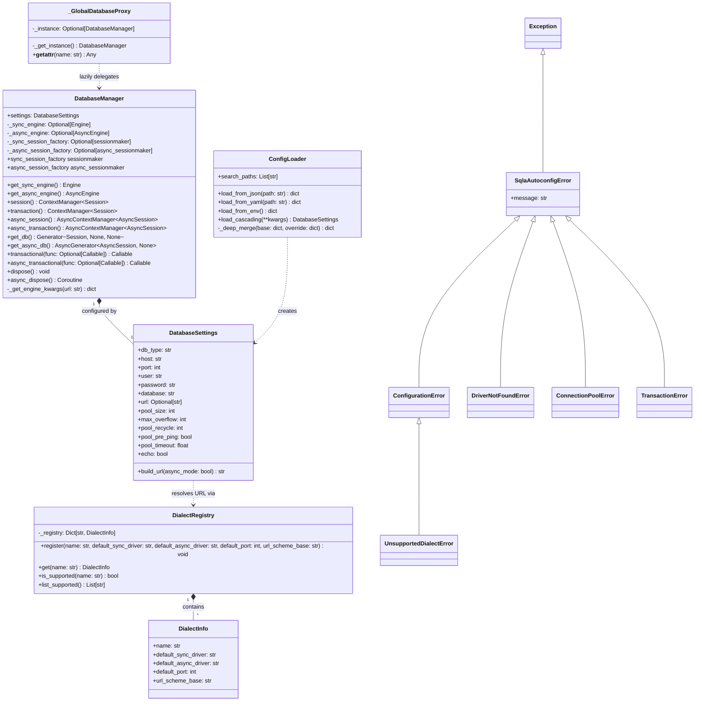
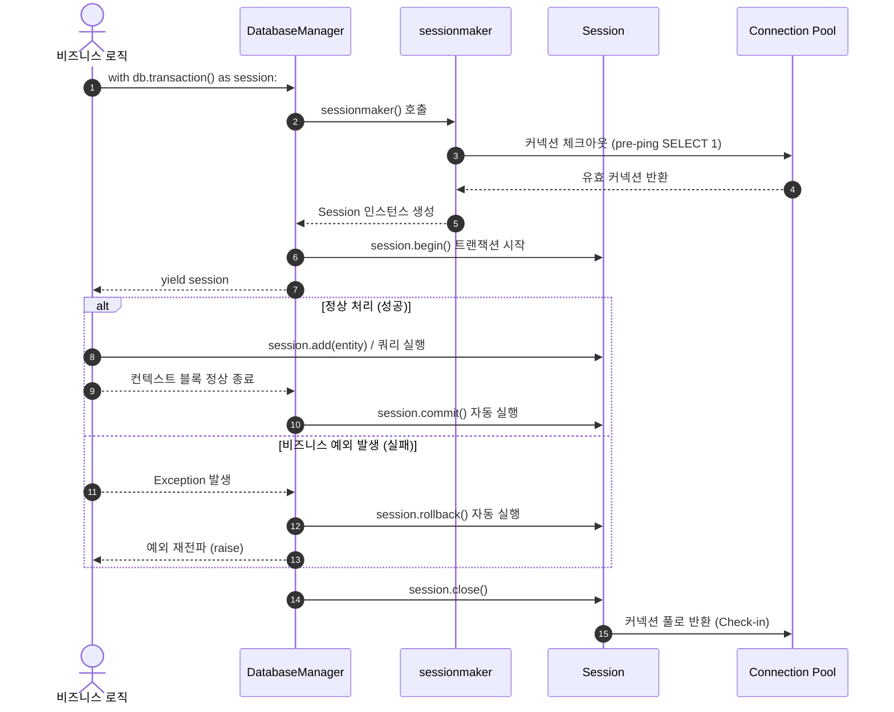
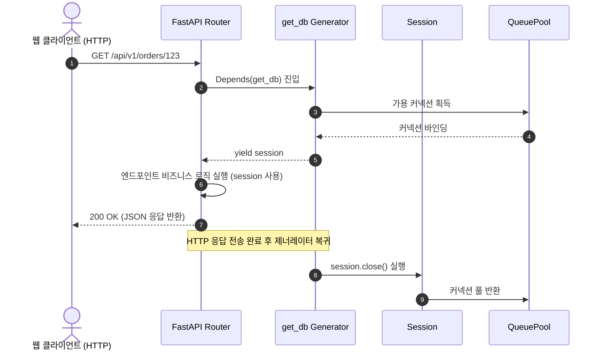

# [sqla-autoconfig] 백엔드 시스템 및 라이브러리 인터페이스 설계서 (System Design & Public API Spec)

- **작성일자**: 2026-09-22 (개정일자: 2026-09-23)
- **작성자**: 백엔드 시스템 디자이너 (`system-designer`)
- **문서 버전**: v1.1
- **상태**: Approved

---

## 1. 설계 배경 및 아키텍처 의사결정 (Context & Architecture Decisions)

### 1.1 배경 및 문제의식 (Problem Statement)

FastAPI, Flask, Celery 등 파이썬 백엔드 프로젝트에서 SQLAlchemy를 도입할 때, 개발팀은 반복적으로 다음과 같은 보일러플레이트와 운영상 함정(Pitfalls)에 부딪힙니다:

1. **드라이버 URL 스키마 파편화**: 동기(`psycopg2`, `pymysql`)와 비동기(`asyncpg`, `aiomysql`) 드라이버에 따라 `DATABASE_URL` 스키마 접두사(`postgresql+asyncpg://`, `mysql+pymysql://`)를 수동으로 조합해야 하며, 드라이버 미설치 시 런타임에 모호한 에러가 발생합니다.
2. **커넥션 풀 누수 및 좀비 커넥션 장애**: 컨텍스트 매니저 없이 `SessionLocal()`을 호출하다가 예외 발생 시 `session.close()`가 누락되어 커넥션 풀이 고갈되거나, 클라우드 NAT Gateway/L4 로드밸런서의 유휴 커넥션 단절(Idle timeout)로 인해 새벽 시간대 첫 요청 시 `OperationalError: SSL connection has been closed unexpectedly` 에러가 빈발합니다.
3. **비동기 세션의 `MissingGreenlet` 에러**: SQLAlchemy 비동기 모드에서 `expire_on_commit=True` 기본값을 그대로 사용할 경우, 트랜잭션 커밋 후 모델 속성에 접근할 때 이벤트 루프 밖에서 I/O를 시도하여 `sqlalchemy.exc.MissingGreenlet: greenlet_spawn has not been called` 예외가 발생합니다.

`sqla-autoconfig`는 환경변수나 설정 파일 선언만으로 **검증된 SQLAlchemy 2.0 엔진 및 세션 팩토리**, **동기/비동기 통합 트랜잭션 스코프**, **FastAPI 의존성 주입 제너레이터**를 제공하여 위 문제들을 원천 차단합니다.

### 1.2 핵심 아키텍처 결정 사항 (Architecture Decisions & Trade-offs)

| 결정 항목 | 채택한 방식 | 고려했던 대안 | 선택 이유 및 엔지니어링 트레이드오프 |
| :--- | :--- | :--- | :--- |
| **ORM 세션 수명 관리** | **SQLAlchemy 2.0 `session.begin()` 기반 컨텍스트 매니저** | 1.x 스타일 `session.commit()` 수동 호출, `scoped_session` | • `session.begin()`은 블록 내 정상 종료 시 자동 커밋, 예외 발생 시 자동 롤백을 보장하여 트랜잭션 누수를 방지함.<br/>• `scoped_session`은 스레드 로컬에 의존하여 비동기(`asyncio`) 환경에서 태스크 간 세션 오염을 일으킬 위험이 커 배제함. |
| **글로벌 인스턴스 지연 초기화** | **`_GlobalDatabaseProxy`를 통한 Lazy Initialization** | 모듈 임포트 시점 즉각 엔진 생성 (Eager Init) | • 모듈 임포트(`from sqla_autoconfig import db`) 시점에 즉시 DB 연결을 맺으면, 환경변수가 주입되기 전인 CLI 명령어(`alembic`, `pytest`) 실행 시 연결 실패로 프로세스가 즉시 크래시됨.<br/>• 프록시를 통해 실제 첫 속성 접근/메서드 호출 시점에만 엔진과 풀을 생성함. |
| **커밋 후 속성 만료 제어** | **`expire_on_commit=False` 전역 기본값 적용** | SQLAlchemy 기본값 (`expire_on_commit=True`) | • `True` 상태에서는 커밋 후 인스턴스 필드 접근 시 DB 재조회(SELECT)를 시도함. 비동기 환경에서 세션이 닫힌 뒤 속성을 읽으려 하면 `MissingGreenlet` 에러가 발생함.<br/>• `False`로 설정하여 커밋된 메모리 상태를 안전하게 보존함.<br/>• *트레이드오프*: 동일 트랜잭션 외부에서 DB가 변경되었을 경우 최신 상태와 차이가 있을 수 있으므로, 최신 상태가 필요하면 명시적 `session.refresh()`를 권장함. |
| **FastAPI 의존성 제공** | **제너레이터 함수 (`get_db`, `get_async_db`)** | 미들웨어 기반 단일 세션 주입 | • HTTP 미들웨어 방식은 DB를 쓰지 않는 정적 파일 서빙이나 헬스체크 라우트까지 불필요하게 커넥션을 체크아웃하여 풀 낭비를 유발함.<br/>• 라우터 단위에서 `Depends(get_db)`로 선별 주입하는 방식을 채택함. |

---

## 2. 패키지 모듈 구조 (Package Layout & Responsibilities)

### 2.1 디렉터리 레이아웃

```
sqla_autoconfig/
├── __init__.py           # 공개 API 엔트리포인트 (db, DatabaseManager, get_db, get_async_db, transactional 등)
├── config.py            # DatabaseSettings (Pydantic), ConfigLoader (kwargs > ENV > YAML > JSON > Defaults)
├── context.py           # 동기/비동기 세션 및 트랜잭션 컨텍스트 매니저, FastAPI 의존성 제너레이터
├── decorators.py        # 선언적 트랜잭션 데코레이터 (@transactional, @async_transactional)
├── dialects.py          # DialectRegistry, DialectInfo (PostgreSQL, MySQL, MariaDB, SQLite 드라이버 매핑)
├── exceptions.py        # 표준 도메인 예외 계층 (SqlaAutoconfigError, ConfigurationError, ConnectionPoolError 등)
└── manager.py           # DatabaseManager 코어 엔진 및 세션 팩토리 라이프사이클 관리, atexit 풀 해제
```

### 2.2 모듈별 세부 역할 명세

| 모듈 | 노출 심볼 | 핵심 역할 및 구현 세부사항 |
| :--- | :--- | :--- |
| `config.py` | `DatabaseSettings`, `ConfigLoader` | • 5단계 설정 우선순위(`kwargs > ENV > YAML > JSON > Defaults`) 자동 병합.<br/>• `DB_*` 및 `SQLA_*` 환경변수 접두사 지원.<br/>• 다이얼렉트 정보와 결합하여 동기/비동기용 SQLAlchemy URL 자동 생성 (`build_url(async_mode)`). |
| `dialects.py` | `DialectRegistry`, `DialectInfo` | • 지원 RDBMS(`postgres`, `mysql`, `mariadb`, `sqlite`) 드라이버 매핑 관리.<br/>• PostgreSQL: `psycopg2` (동기) / `asyncpg` (비동기).<br/>• MySQL/MariaDB: `pymysql` (동기) / `aiomysql` (비동기).<br/>• SQLite: `pysqlite` (동기) / `aiosqlite` (비동기).<br/>• 사용자 커스텀 드라이버 등록 인터페이스 제공 (`DialectRegistry.register`). |
| `manager.py` | `DatabaseManager` | • 동기 `Engine` 및 비동기 `AsyncEngine` 지연 인스턴스화.<br/>• `sessionmaker` 및 `async_sessionmaker` 세션 팩토리 수명 관리.<br/>• 프로세스 종료 시 `atexit.register(self.dispose)`를 통한 소켓 안전 회수. |
| `context.py` | `session_scope`, `transaction_scope`, `async_session_scope`, `async_transaction_scope` | • 컨텍스트 매니저 종료 시 `session.close()` 및 `await session.close()` 의무 실행.<br/>• 트랜잭션 스코프 내 예외 발생 시 명시적 `rollback()` 보장.<br/>• FastAPI `Depends`용 제너레이터 팩토리 제공. |
| `decorators.py` | `transactional`, `async_transactional` | • 함수 시그니처에 `session` 파라미터가 선언되어 있으면 활성 세션을 키워드 인자로 자동 주입.<br/>• 괄호 유무와 무관하게 동작 지원 (`@transactional` 및 `@transactional()`). |
| `exceptions.py` | `SqlaAutoconfigError`, `ConfigurationError`, `UnsupportedDialectError`, `DriverNotFoundError`, `ConnectionPoolError`, `TransactionError` | • 설정 누락, 다이얼렉트 불일치, 트랜잭션 롤백, 커넥션 풀 고갈 등 도메인별 표준 예외 정의. |

---

## 3. 핵심 클래스 구조 설계 (Class Diagram & Architecture)

> [!NOTE]
> 본 패키지는 비즈니스 도메인 엔티티를 영속화하기 위한 공통 인프라스트럭처 라이브러리이므로, 애플리케이션 엔티티 ERD 대신 엔진 및 세션 라이프사이클을 관장하는 Mermaid 클래스 다이어그램(`classDiagram`)으로 구조를 명세합니다.

### 3.1 Mermaid 클래스 다이어그램



---

## 4. 커넥션 풀링 최적화 및 세션 수명 제어 (Connection Pooling & Session Policies)

### 4.1 커넥션 풀 최적화 매트릭스

| 파라미터 | 기본값 | 적용 클래스 | 엔지니어링 설계 의도 및 운영 방어 메커니즘 |
| :--- | :---: | :--- | :--- |
| `poolclass` | `QueuePool` (동기)<br/>`AsyncAdaptedQueuePool` (비동기) | Engine | 동기 스레드 풀 및 비동기 이벤트 루프에 최적화된 고정 크기 큐 기반 커넥션 풀 적용. (단, SQLite 인메모리/파일 DB는 `NullPool` 또는 기본 풀 유지). |
| `pool_size` | `20` | Engine | 호스트 프로세스가 유지하는 기본 커넥션 수. 일반적인 웹 트래픽을 상시 대기 소켓으로 즉시 처리. |
| `max_overflow` | `10` | Engine | 트래픽 급증 시 풀 크기 외에 추가로 개설할 수 있는 임시 커넥션 한도 (최대 동시 커넥션 = 20 + 10 = 30개). 피크 해소 시 자동으로 닫힘. |
| `pool_pre_ping` | `True` | Engine | 풀에서 커넥션을 체크아웃할 때 `SELECT 1` 핑을 날려 소켓 생존 여부를 사전 검증. DB 재부팅이나 방화벽에 의해 강제 종료된 좀비 커넥션을 투명하게 폐기하고 새 소켓으로 교체. |
| `pool_recycle` | `1800초` (30분) | Engine | 30분이 지난 커넥션은 풀 반환 시 자동으로 폐기하고 새로 연결. 클라우드 방화벽(AWS Security Group, NAT Gateway)의 기본 유휴 타임아웃(350초~1시간)으로 인한 연결 끊김 원천 차단. |
| `pool_timeout` | `30.0초` | Engine | 풀의 모든 커넥션이 사용 중일 때 가용 소켓 반환을 대기하는 최대 시간. 초과 시 `TimeoutError`를 발생시켜 스레드 영구 행(Hang) 방지. |

### 4.2 세션 팩토리 격리 정책

1. **`autoflush=False`**:
   - 쿼리 실행 직전 ORM이 자동으로 `flush`를 시도하여 의도치 않은 DB 쓰기 락이 걸리거나 상태가 오염되는 것을 방지합니다. 명시적인 `flush()` 또는 커밋 시점에만 쓰기가 실행됩니다.
2. **`expire_on_commit=False`**:
   - 트랜잭션 커밋 완료 후에도 ORM 인스턴스의 속성을 메모리에 그대로 유지합니다. 비동기 환경에서 세션이 닫힌 뒤 DTO 변환이나 로깅을 위해 속성을 참조할 때 발생하는 `MissingGreenlet` 에러를 방지합니다.

---

## 5. 트랜잭션 및 요청 생명주기 흐름 (Transaction & Dependency Sequence)

### 5.1 트랜잭션 컨텍스트 매니저 (`db.transaction()`) 실행 흐름



### 5.2 FastAPI 의존성 주입 (`Depends(get_db)`) 실행 흐름



---

## 6. 공개 SDK 인터페이스 상세 명세 (Public API Specification)

> [!IMPORTANT]
> **OpenAPI 문서 대체 근거**:
> `sqla-autoconfig`는 REST API 엔드포인트를 서빙하는 서버 어플리케이션이 아닌, 데이터베이스 커넥션과 트랜잭션을 관리하는 **인프라스트럭처 라이브러리**입니다. 따라서 HTTP 스펙 대신 개발자가 직접 사용하는 Python API 함수 시그니처와 사용법을 상세 명세로 갈음합니다.

### 6.1 최상위 노출 객체 및 컨텍스트 매니저

```python
from typing import AsyncGenerator, ContextManager, Generator
from sqlalchemy.orm import Session
from sqlalchemy.ext.asyncio import AsyncSession
from sqla_autoconfig import db

# 1. 동기 세션 및 트랜잭션
def session() -> ContextManager[Session]:
    """자동 커밋 없는 동기 세션 컨텍스트 매니저. 블록 종료 시 session.close() 보장."""
    ...

def transaction() -> ContextManager[Session]:
    """자동 커밋/롤백 동기 트랜잭션 컨텍스트 매니저.
    정상 종료 시 commit, 예외 발생 시 rollback 및 close 보장.
    """
    ...

# 2. 비동기 세션 및 트랜잭션
def async_session() -> AsyncContextManager[AsyncSession]:
    """자동 커밋 없는 비동기 세션 컨텍스트 매니저. 블록 종료 시 await session.close() 보장."""
    ...

def async_transaction() -> AsyncContextManager[AsyncSession]:
    """자동 커밋/롤백 비동기 트랜잭션 컨텍스트 매니저."""
    ...

# 3. FastAPI 의존성 주입 제너레이터
def get_db() -> Generator[Session, None, None]:
    """FastAPI Depends(get_db) 동기 세션 제너레이터."""
    ...

async def get_async_db() -> AsyncGenerator[AsyncSession, None]:
    """FastAPI Depends(get_async_db) 비동기 세션 제너레이터."""
    ...
```

### 6.2 선언적 트랜잭션 데코레이터 (`decorators.py`)

함수 인자에 `session`이 선언되어 있으면 활성 트랜잭션 세션을 키워드 인자로 자동 주입합니다:

```python
from sqla_autoconfig import transactional, async_transactional
from sqlalchemy.orm import Session
from sqlalchemy.ext.asyncio import AsyncSession

# 동기 서비스 함수
@transactional
def create_user(username: str, email: str, session: Session = None) -> User:
    user = User(username=username, email=email)
    session.add(user)
    return user  # 정상 리턴 시 자동 커밋

# 비동기 코루틴 함수
@async_transactional
async def update_order_status(order_id: int, status: str, session: AsyncSession = None):
    stmt = select(Order).where(Order.id == order_id)
    result = await session.execute(stmt)
    order = result.scalar_one()
    order.status = status
    # 예외 발생 시 자동 롤백
```

### 6.3 커스텀 다이얼렉트 확장 (`DialectRegistry`)

사내 전용 드라이버나 기본 매핑 외의 드라이버가 필요할 때 런타임에 등록할 수 있습니다:

```python
from sqla_autoconfig import DialectRegistry

# CockroachDB 다이얼렉트 등록 예시
DialectRegistry.register(
    name="cockroachdb",
    default_sync_driver="psycopg2",
    default_async_driver="asyncpg",
    default_port=26257,
    url_scheme_base="cockroachdb"
)
```

---

## 7. 현장 엔지니어링 주의사항 및 한계 (Gotchas & Caveats)

실무 개발팀이 `sqla-autoconfig`를 사용할 때 반드시 유의해야 하는 기술적 제약사항입니다:

1. **`AsyncSession`을 `asyncio.gather`로 동시 공유 금지**:
   - SQLAlchemy의 `AsyncSession`은 스레드 안전하지 않을 뿐 아니라, **단일 이벤트 루프 내에서도 동시 코루틴 간 안전하지 않습니다**.
   - 단일 세션 인스턴스를 여러 개의 `asyncio.create_task`나 `asyncio.gather`에 넘겨 동시에 쿼리를 실행하면 `InvalidRequestError: Cannot run multiple concurrent operations on the same session` 에러가 발생합니다. 병렬 조회가 필요할 경우 태스크마다 독립된 `db.async_session()`을 생성해야 합니다.
2. **SQLite 인메모리(`:memory:`) 사용 시 풀링 주의사항**:
   - SQLite 인메모리 데이터베이스는 커넥션이 닫히면 데이터가 즉시 소멸합니다. `sqla-autoconfig`는 SQLite 감지 시 `QueuePool` 대신 단일 커넥션을 유지하는 풀링 전략을 자동 적용하므로, 테스트 코드 작성 시 파일 경로 기반(`.db`) 테스트를 권장합니다.
3. **`expire_on_commit=False` 환경에서의 Stale Data 인지**:
   - 커밋 후에도 메모리 객체의 속성이 유지되므로 읽기 비용은 절감되지만, 타 트랜잭션이 해당 레코드를 수정한 경우 현재 세션의 엔티티는 이전 값을 유지할 수 있습니다. 최신 DB 상태 동기화가 중요한 금융/재고 차감 로직에서는 읽기 전 명시적 `session.refresh(entity)`를 수행하십시오.
