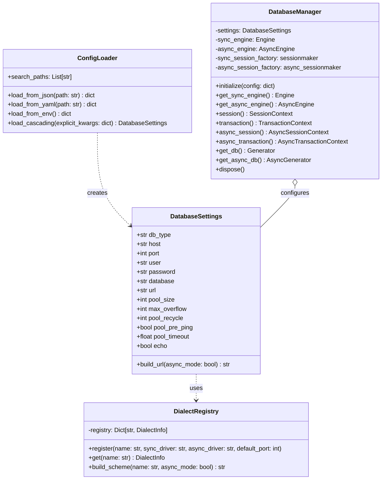

# [sqla-autoconfig] 백엔드 시스템 및 라이브러리 인터페이스 설계서 (System Design & API Spec)

- **작성일자**: 2026-09-22
- **작성자**: 백엔드 시스템 디자이너 (`system-designer`)
- **문서 버전**: v1.0
- **상태**: APPROVED

> **[오케스트레이터 파이프라인 생략 근거 명시]**
> - 본 프로젝트는 웹 HTTP 서비스가 아닌 **순수 Python 오픈소스 라이브러리/패키지**입니다.
> - 따라서 웹 클라이언트 화면을 위한 Stage 2c(`ui-system-designer`), 프론트-백엔드 HTTP 통신을 위한 Stage 2d(`contract-integrator`) 및 `02_OPENAPI_SPEC.yaml`은 오케스트레이터의 판단하에 합리적으로 생략하고, 이를 대체하여 **Python 라이브러리 공개 인터페이스(Public SDK / API Specification)**를 상세히 설계합니다.

---

## 1. 패키지 모듈 구조 (Package Structure)

```
python-package/sqla-autoconfig/
├── pyproject.toml                 # 패키지 메타데이터 및 의존성 명세 (Poetry / Hatch / Flit 표준)
├── README.md                      # 패키지 사용 가이드 및 예제
├── sqla_autoconfig/
│   ├── __init__.py                # 공개 API 노출 (db, DatabaseManager, get_db, transactional 등)
│   ├── config.py                  # 계층형 설정 로더 (ConfigLoader) 및 Pydantic 모델 (DatabaseSettings)
│   ├── dialects.py                # 지원 RDBMS 다이얼렉트 매핑 및 레지스트리 (DialectRegistry)
│   ├── manager.py                 # 코어 엔진 및 세션 팩토리 관리자 (DatabaseManager)
│   ├── context.py                 # 동기/비동기 세션 및 트랜잭션 컨텍스트 매니저
│   ├── decorators.py             # 선언적 트랜잭션 데코레이터 (@transactional, @async_transactional)
│   └── exceptions.py              # 라이브러리 표준 예외 계층
└── tests/
    ├── conftest.py                # pytest 공통 픽스처 및 모의 환경
    ├── test_config.py             # 계층형 설정 로더 (ENV > YAML > JSON) 테스트
    ├── test_dialects.py           # 드라이버 매핑 및 DialectRegistry 확장 테스트
    ├── test_manager.py            # 동기/비동기 엔진 생성 및 라이프사이클 테스트
    ├── test_context.py            # 세션/트랜잭션 커밋 및 롤백 컨텍스트 테스트
    ├── test_decorators.py         # 데코레이터 동작 테스트
    └── test_concurrency.py        # 대규모 동접(High-concurrency) 풀 누수 및 스트레스 테스트
```

---

## 2. 핵심 클래스 및 구조 설계 (Class Diagram)



---

## 3. 계층형 설정 우선순위 알고리즘 명세 (Configuration Precedence)

1. **기본값 딕셔너리 생성 (`DEFAULTS`)**:
   - `pool_size=20`, `max_overflow=10`, `pool_recycle=1800`, `pool_pre_ping=True`, `pool_timeout=30.0`, `echo=False`.
2. **JSON 파일 로드**:
   - `database.json`, `config.json`, `application.json` 순차 탐색 후 최초 발견 파일 파싱.
   - 키를 기본값에 덮어씀 (`merged.update(json_data)`).
3. **YAML 파일 로드**:
   - `database.yaml`, `database.yml`, `config.yaml`, `application.yml` 순차 탐색 후 최초 발견 파일 파싱.
   - 키를 기존 설정에 덮어씀 (`merged.update(yaml_data)`).
4. **환경변수 로드**:
   - `DB_TYPE`, `DB_HOST`, `DB_PORT`, `DB_USER`, `DB_PASSWORD`, `DB_NAME`, `DATABASE_URL`, `DB_POOL_SIZE`, `DB_MAX_OVERFLOW`, `DB_POOL_RECYCLE`, `DB_POOL_PRE_PING`, `DB_POOL_TIMEOUT`, `DB_ECHO` 탐색.
   - `SQLA_*` 접두사도 동등하게 지원.
   - 기존 설정을 환경변수 값으로 덮어씀 (`merged.update(env_data)`).
5. **명시적 `kwargs` 적용**:
   - 코드에서 직접 전달된 파라미터로 최종 덮어씀 (`merged.update(kwargs)`).
6. **Pydantic 스키마 변환**:
   - `DatabaseSettings(**merged)` 호출 및 검증.

---

## 4. 커넥션 풀 최적화 및 동시성 제어 정책 (High-Concurrency Pooling)

- **SQLAlchemy 2.0 엔진 파라미터**:
  - `poolclass`: 동기는 `QueuePool`, 비동기는 `AsyncAdaptedQueuePool` 적용.
  - `pool_size`: 기본 20 (피크 트래픽 기본 흡수).
  - `max_overflow`: 기본 10 (순간 급증 트래픽 시 최대 30개까지 커넥션 확장).
  - `pool_pre_ping`: `True` (체크아웃 시 `SELECT 1`을 통한 커넥션 유효성 자동 검증, 좀비 커넥션 자동 폐기).
  - `pool_recycle`: `1800` (30분마다 재생성하여 DB 서버 및 방화벽 유휴 타임아웃 차단).
  - `pool_timeout`: `30.0` (30초 이상 풀 대기 시 타임아웃 예외 발생).
- **컨텍스트 매니저 내 무결점 리소스 반환**:
  ```python
  # 동기 트랜잭션 컨텍스트
  @contextmanager
  def transaction(self) -> Iterator[Session]:
      session = self.session_factory()
      try:
          with session.begin():
              yield session
      finally:
          session.close()  # 반드시 풀로 커넥션 반환

  # 비동기 트랜잭션 컨텍스트
  @asynccontextmanager
  async def async_transaction(self) -> AsyncIterator[AsyncSession]:
      session = self.async_session_factory()
      try:
          async with session.begin():
              yield session
      finally:
          await session.close()  # 반드시 풀로 커넥션 반환
  ```

---

## 5. 파이썬 라이브러리 공개 인터페이스 명세 (Public API Specification)

### 5.1 최상위 노출 객체 및 함수 (`sqla_autoconfig`)
- `db`: 기본 설정으로 자동 초기화되는 전역 `DatabaseManager` 싱글톤 인스턴스.
- `DatabaseManager`: 독자적인 설정을 갖는 매니저 인스턴스 생성 클래스.
- `db.session()`: 동기 세션 컨텍스트 매니저 (`with db.session() as s:`).
- `db.transaction()`: 동기 트랜잭션 컨텍스트 매니저 (`with db.transaction() as s:`).
- `db.async_session()`: 비동기 세션 컨텍스트 매니저 (`async with db.async_session() as s:`).
- `db.async_transaction()`: 비동기 트랜잭션 컨텍스트 매니저 (`async with db.async_transaction() as s:`).
- `@db.transactional`: 동기 함수 트랜잭션 데코레이터.
- `@db.async_transactional`: 비동기 코루틴 트랜잭션 데코레이터.
- `db.get_db`: FastAPI 동기 의존성 주입 제너레이터 (`Depends(db.get_db)`).
- `db.get_async_db`: FastAPI 비동기 의존성 주입 비동기 제너레이터 (`Depends(db.get_async_db)`).
- `DialectRegistry`: 커스텀 DB 다이얼렉트 등록 클래스.
